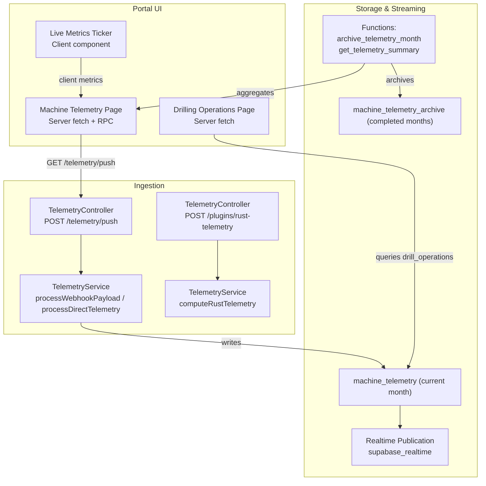
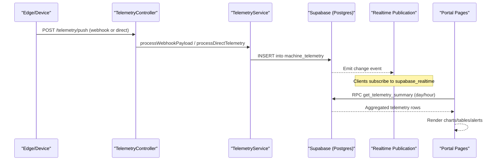
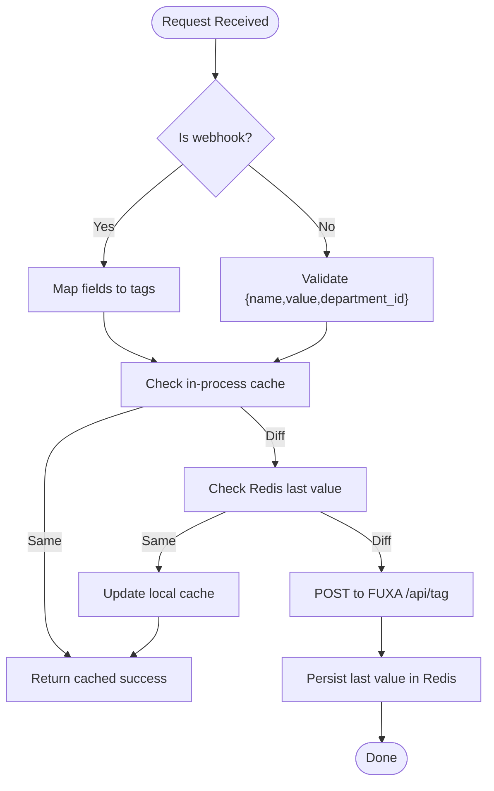
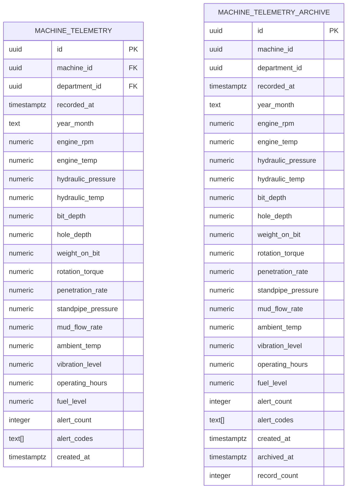
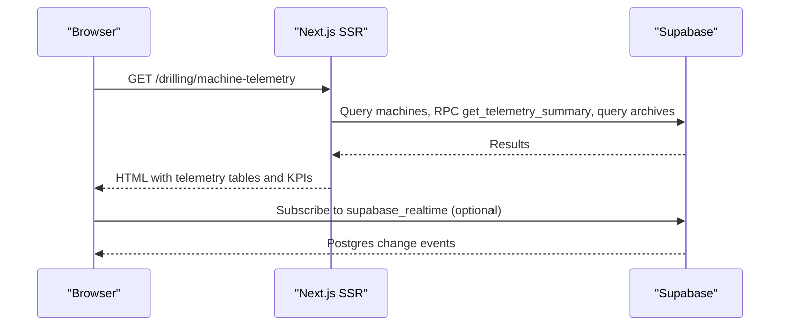
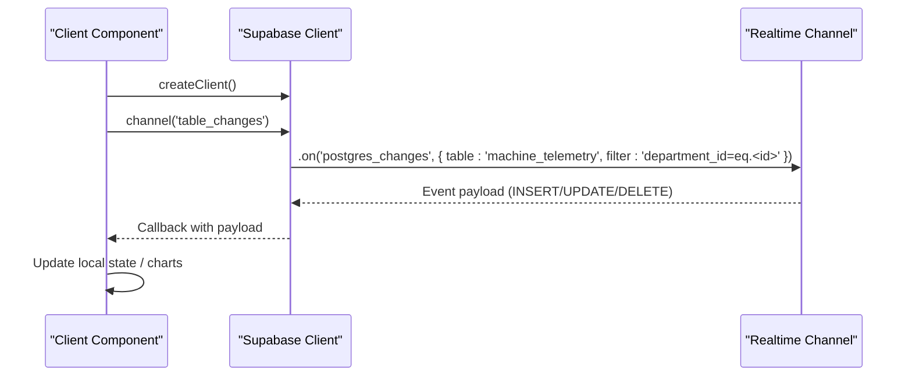
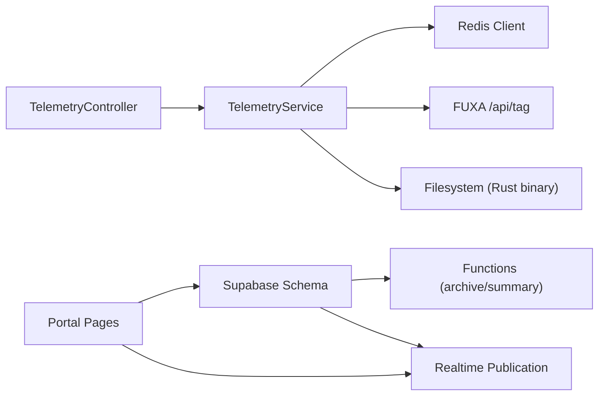

# Machine Telemetry Monitoring

<cite>
**Referenced Files in This Document**
- [telemetry.controller.ts](file://apps/api/src/telemetry/telemetry.controller.ts)
- [telemetry.service.ts](file://apps/api/src/telemetry/telemetry.service.ts)
- [sync.controller.ts](file://apps/api/src/telemetry/sync.controller.ts)
- [025_machine_telemetry.sql](file://packages/supabase/migrations/025_machine_telemetry.sql)
- [page.tsx](file://apps/portal/app/(departments)/drilling/machine-telemetry/page.tsx)
- [page.tsx](file://apps/portal/app/(departments)/drilling/drilling-operations/page.tsx)
- [LiveMetricsTicker.tsx](file://apps/portal/components/system/LiveMetricsTicker.tsx)
- [useSystemMetrics.ts](file://apps/portal/hooks/useSystemMetrics.ts)
- [next.config.mjs](file://apps/portal/next.config.mjs)
</cite>

## Table of Contents

1. [Introduction](#introduction)
2. [Project Structure](#project-structure)
3. [Core Components](#core-components)
4. [Architecture Overview](#architecture-overview)
5. [Detailed Component Analysis](#detailed-component-analysis)
6. [Dependency Analysis](#dependency-analysis)
7. [Performance Considerations](#performance-considerations)
8. [Troubleshooting Guide](#troubleshooting-guide)
9. [Conclusion](#conclusion)
10. [Appendices](#appendices)

## Introduction

This document describes the Machine Telemetry Monitoring system for drilling machines. It covers real-time telemetry ingestion, storage, archival, and visualization, including depth measurements, pressure readings, temperature sensors, and operational parameters. The system supports live data streaming via Supabase Realtime, chart-ready aggregations, alerting signals, and historical tracking through monthly archival. Technical details include webhook ingestion, Redis-backed deduplication, optional native computation fallbacks, and performance optimizations for high-frequency updates.

## Project Structure

The telemetry feature spans API endpoints, database schema, and portal UI:

- API layer (NestJS): Ingestion endpoints for direct tag writes and Supabase webhook payloads; optional Rust-based computation with JS fallback.
- Database layer (Supabase): Active telemetry table for current month, archive table for completed months, functions for aggregation and archival, and realtime publication.
- Portal UI (Next.js): Server-side rendered pages to display daily summaries, availability/utilization metrics, and archived months; client components for live status indicators.

**Diagram sources**

- [telemetry.controller.ts:1-36](file://apps/api/src/telemetry/telemetry.controller.ts#L1-L36)
- [telemetry.service.ts:1-195](file://apps/api/src/telemetry/telemetry.service.ts#L1-L195)
- [025_machine_telemetry.sql:1-313](file://packages/supabase/migrations/025_machine_telemetry.sql#L1-L313)
- [page.tsx](<file://apps/portal/app/(departments)/drilling/machine-telemetry/page.tsx#L1-L719>)
- [page.tsx](<file://apps/portal/app/(departments)/drilling/drilling-operations/page.tsx#L1-L79>)
- [LiveMetricsTicker.tsx:1-56](file://apps/portal/components/system/LiveMetricsTicker.tsx#L1-L56)

**Section sources**

- [telemetry.controller.ts:1-36](file://apps/api/src/telemetry/telemetry.controller.ts#L1-L36)
- [telemetry.service.ts:1-195](file://apps/api/src/telemetry/telemetry.service.ts#L1-L195)
- [025_machine_telemetry.sql:1-313](file://packages/supabase/migrations/025_machine_telemetry.sql#L1-L313)
- [page.tsx](<file://apps/portal/app/(departments)/drilling/machine-telemetry/page.tsx#L1-L719>)
- [page.tsx](<file://apps/portal/app/(departments)/drilling/drilling-operations/page.tsx#L1-L79>)
- [LiveMetricsTicker.tsx:1-56](file://apps/portal/components/system/LiveMetricsTicker.tsx#L1-L56)

## Core Components

- Telemetry ingestion controller exposes:
  - POST /telemetry/push: Accepts either a Supabase webhook payload or a direct single-tag update.
  - POST /plugins/rust-telemetry: Computes wear index/probability/RUL using a native binary if available, otherwise falls back to JavaScript logic.
- Telemetry service implements:
  - Webhook processing: Maps machine_telemetry fields to SCADA tags and pushes to an external FUXA endpoint.
  - Direct tag processing: Validates input, applies L1 (in-process) and L2 (Redis) deduplication, then forwards to FUXA.
  - Rust compute path: Executes a compiled binary with arguments; on failure, uses a JS algorithmic fallback.
- Database schema provides:
  - machine_telemetry: Current-month active records with indexes and RLS policies.
  - machine_telemetry_archive: Monthly aggregated snapshots.
  - Functions: archive_telemetry_month and get_telemetry_summary for archival and dashboards.
  - Realtime publication for live changes.
- Portal pages:
  - Machine Telemetry page: Server-side queries for daily summaries, archives, and monthly utilization; displays KPIs and tables.
  - Drilling Operations page: Server-side queries for today’s operations and operators.
  - Live Metrics Ticker: Client component showing connection health, server time, and simulated WebSocket latency.

**Section sources**

- [telemetry.controller.ts:1-36](file://apps/api/src/telemetry/telemetry.controller.ts#L1-L36)
- [telemetry.service.ts:1-195](file://apps/api/src/telemetry/telemetry.service.ts#L1-L195)
- [025_machine_telemetry.sql:1-313](file://packages/supabase/migrations/025_machine_telemetry.sql#L1-L313)
- [page.tsx](<file://apps/portal/app/(departments)/drilling/machine-telemetry/page.tsx#L1-L719>)
- [page.tsx](<file://apps/portal/app/(departments)/drilling/drilling-operations/page.tsx#L1-L79>)
- [LiveMetricsTicker.tsx:1-56](file://apps/portal/components/system/LiveMetricsTicker.tsx#L1-L56)

## Architecture Overview

End-to-end flow from ingestion to visualization:

**Diagram sources**

- [telemetry.controller.ts:1-36](file://apps/api/src/telemetry/telemetry.controller.ts#L1-L36)
- [telemetry.service.ts:1-195](file://apps/api/src/telemetry/telemetry.service.ts#L1-L195)
- [025_machine_telemetry.sql:1-313](file://packages/supabase/migrations/025_machine_telemetry.sql#L1-L313)
- [page.tsx](<file://apps/portal/app/(departments)/drilling/machine-telemetry/page.tsx#L1-L719>)

## Detailed Component Analysis

### Ingestion Endpoints and Service Logic

- POST /telemetry/push
  - Detects Supabase webhook payloads and maps fields to SCADA tags.
  - For direct updates, validates name/value and enforces department scoping.
  - Applies two-level deduplication:
    - L1: In-process Map keyed by department+tag.
    - L2: Redis key per tag with TTL.
  - Writes to FUXA SCADA via HTTP POST when values differ.
- POST /plugins/rust-telemetry
  - Attempts to run a native binary with hours/temp/rpm inputs.
  - Falls back to a JS model computing wear index, probability, RUL, and status.

**Diagram sources**

- [telemetry.controller.ts:1-36](file://apps/api/src/telemetry/telemetry.controller.ts#L1-L36)
- [telemetry.service.ts:1-195](file://apps/api/src/telemetry/telemetry.service.ts#L1-L195)

**Section sources**

- [telemetry.controller.ts:1-36](file://apps/api/src/telemetry/telemetry.controller.ts#L1-L36)
- [telemetry.service.ts:1-195](file://apps/api/src/telemetry/telemetry.service.ts#L1-L195)

### Data Model and Archival

- Active table: machine_telemetry
  - Fields include engine RPM, temperatures, hydraulic pressure, bit/hole depths, penetration rate, standpipe pressure, mud flow, ambient temp, vibration, operating hours, fuel level, alerts.
  - Indexes on machine_id+recorded_at, year_month, department_id.
  - Row Level Security scoped by department access.
- Archive table: machine_telemetry_archive
  - Stores monthly aggregates and metadata (archived_at, record_count).
- Functions:
  - archive_telemetry_month: Aggregates previous month into archive and deletes from active table.
  - get_telemetry_summary: Returns hourly or daily aggregates for current month.
- Realtime:
  - machine_telemetry is added to supabase_realtime publication for live subscriptions.

**Diagram sources**

- [025_machine_telemetry.sql:1-313](file://packages/supabase/migrations/025_machine_telemetry.sql#L1-L313)

**Section sources**

- [025_machine_telemetry.sql:1-313](file://packages/supabase/migrations/025_machine_telemetry.sql#L1-L313)

### Portal Visualization and Historical Tracking

- Machine Telemetry page:
  - Server-side fetches drills, daily telemetry summary via RPC, archives, and monthly utilization.
  - Displays KPIs (active drills, data points, average penetration, alerts), daily table with color-coded thresholds, and archived months list.
- Drilling Operations page:
  - Server-side fetches today’s operations and operators for context.
- Live Metrics Ticker:
  - Client component shows online/offline state, server time, shift info, and simulated WebSocket latency.

**Diagram sources**

- [page.tsx](<file://apps/portal/app/(departments)/drilling/machine-telemetry/page.tsx#L1-L719>)
- [page.tsx](<file://apps/portal/app/(departments)/drilling/drilling-operations/page.tsx#L1-L79>)
- [LiveMetricsTicker.tsx:1-56](file://apps/portal/components/system/LiveMetricsTicker.tsx#L1-L56)
- [025_machine_telemetry.sql:311-313](file://packages/supabase/migrations/025_machine_telemetry.sql#L311-L313)

**Section sources**

- [page.tsx](<file://apps/portal/app/(departments)/drilling/machine-telemetry/page.tsx#L1-L719>)
- [page.tsx](<file://apps/portal/app/(departments)/drilling/drilling-operations/page.tsx#L1-L79>)
- [LiveMetricsTicker.tsx:1-56](file://apps/portal/components/system/LiveMetricsTicker.tsx#L1-L56)

### Real-time Streaming Implementation

- Realtime channel subscription pattern:
  - Use Supabase client channels with postgres_changes filters scoped by department_id.
  - Handle INSERT/UPDATE/DELETE events to update UI state incrementally.
- Content Security Policy:
  - Next.js config allows wss connections to Supabase domains for secure WebSocket usage.

**Diagram sources**

- [025_machine_telemetry.sql:311-313](file://packages/supabase/migrations/025_machine_telemetry.sql#L311-L313)
- [next.config.mjs:113-120](file://apps/portal/next.config.mjs#L113-L120)

**Section sources**

- [025_machine_telemetry.sql:311-313](file://packages/supabase/migrations/025_machine_telemetry.sql#L311-L313)
- [next.config.mjs:113-120](file://apps/portal/next.config.mjs#L113-L120)

### Alert Systems and Operational Parameters

- Alerts:
  - alert_count and alert_codes stored per telemetry record.
  - UI highlights days with non-zero alerts and provides counts.
- Operational parameters:
  - Engine RPM, temperatures, hydraulic pressure, bit/hole depths, penetration rate, standpipe pressure, mud flow, ambient temp, vibration, operating hours, fuel level.
  - Daily averages/maxima are computed via get_telemetry_summary for dashboard consumption.

**Section sources**

- [025_machine_telemetry.sql:1-313](file://packages/supabase/migrations/025_machine_telemetry.sql#L1-L313)
- [page.tsx](<file://apps/portal/app/(departments)/drilling/machine-telemetry/page.tsx#L1-L719>)

## Dependency Analysis

Key dependencies and relationships:

- NestJS controllers depend on TelemetryService for validation, caching, and external calls.
- TelemetryService depends on Redis for last-value caching and environment configuration for FUXA URL/key.
- Database migrations define schemas, functions, and realtime publication.
- Portal pages depend on Supabase client/server utilities and RPC functions for aggregated views.

**Diagram sources**

- [telemetry.controller.ts:1-36](file://apps/api/src/telemetry/telemetry.controller.ts#L1-L36)
- [telemetry.service.ts:1-195](file://apps/api/src/telemetry/telemetry.service.ts#L1-L195)
- [025_machine_telemetry.sql:1-313](file://packages/supabase/migrations/025_machine_telemetry.sql#L1-L313)
- [page.tsx](<file://apps/portal/app/(departments)/drilling/machine-telemetry/page.tsx#L1-L719>)

**Section sources**

- [telemetry.controller.ts:1-36](file://apps/api/src/telemetry/telemetry.controller.ts#L1-L36)
- [telemetry.service.ts:1-195](file://apps/api/src/telemetry/telemetry.service.ts#L1-L195)
- [025_machine_telemetry.sql:1-313](file://packages/supabase/migrations/025_machine_telemetry.sql#L1-L313)
- [page.tsx](<file://apps/portal/app/(departments)/drilling/machine-telemetry/page.tsx#L1-L719>)

## Performance Considerations

- Deduplication:
  - L1 in-process Map avoids redundant network calls within the same process lifetime.
  - L2 Redis last-value cache persists across processes with TTL to reduce downstream load.
- Aggregation at source:
  - get_telemetry_summary computes averages/maxima server-side, minimizing client-side processing.
- Archival strategy:
  - Monthly archival keeps the active table small and query-fast while preserving history.
- Realtime efficiency:
  - Department-scoped filters limit broadcast scope to relevant clients.
- Optional native acceleration:
  - Rust plugin path can offload heavy computations; JS fallback ensures resilience.

[No sources needed since this section provides general guidance]

## Troubleshooting Guide

- Ingestion failures:
  - Check FUXA connectivity and response codes; service returns warnings when unreachable or non-OK responses occur.
  - Validate required fields for direct updates (name, value).
- Realtime not updating:
  - Ensure supabase_realtime includes machine_telemetry and that client subscriptions filter by department_id.
  - Verify CSP allows wss connections to Supabase domains.
- Missing data:
  - Confirm authentication and department access policies allow inserts/selects.
  - Verify scheduled archival function runs correctly and does not delete expected records prematurely.

**Section sources**

- [telemetry.service.ts:1-195](file://apps/api/src/telemetry/telemetry.service.ts#L1-L195)
- [025_machine_telemetry.sql:1-313](file://packages/supabase/migrations/025_machine_telemetry.sql#L1-L313)
- [next.config.mjs:113-120](file://apps/portal/next.config.mjs#L113-L120)

## Conclusion

The Machine Telemetry Monitoring system integrates robust ingestion, efficient storage, and clear visualization for drilling operations. With deduplication, server-side aggregation, monthly archival, and real-time subscriptions, it delivers timely insights and reliable historical tracking. The design balances performance and resilience, supporting both native acceleration and graceful fallbacks.

[No sources needed since this section summarizes without analyzing specific files]

## Appendices

### Telemetry Data Types

- Depth measurements: bit_depth, hole_depth
- Pressure readings: hydraulic_pressure, standpipe_pressure
- Temperature sensors: engine_temp, hydraulic_temp, ambient_temp
- Operational parameters: engine_rpm, weight_on_bit, rotation_torque, penetration_rate, mud_flow_rate, operating_hours, fuel_level, vibration_level
- Alerts: alert_count, alert_codes

**Section sources**

- [025_machine_telemetry.sql:1-313](file://packages/supabase/migrations/025_machine_telemetry.sql#L1-L313)

### Live Status Indicators

- LiveMetricsTicker shows online/offline state, server time, shift labels, and simulated WebSocket latency.
- useSystemMetrics simulates latency updates and tracks network status.

**Section sources**

- [LiveMetricsTicker.tsx:1-56](file://apps/portal/components/system/LiveMetricsTicker.tsx#L1-L56)
- [useSystemMetrics.ts:1-106](file://apps/portal/hooks/useSystemMetrics.ts#L1-L106)
