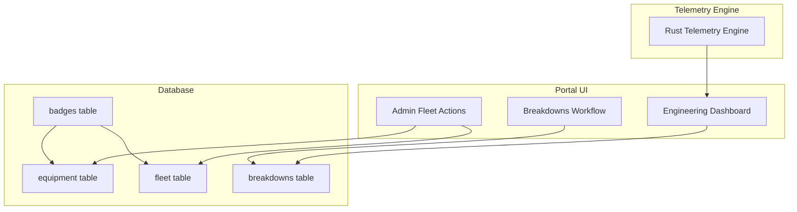
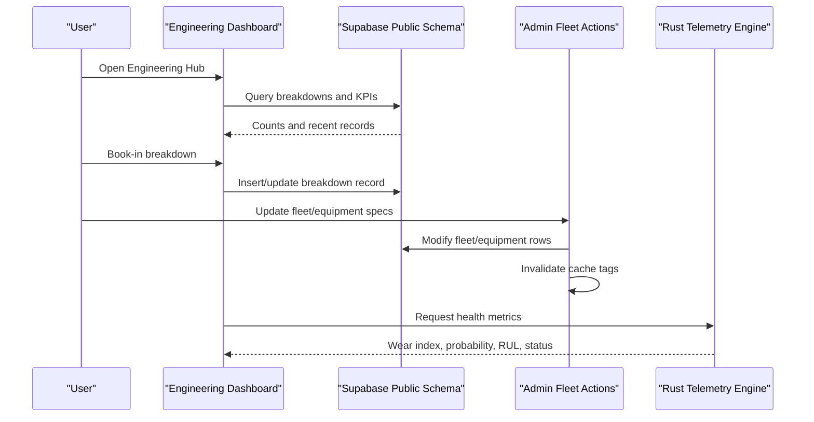
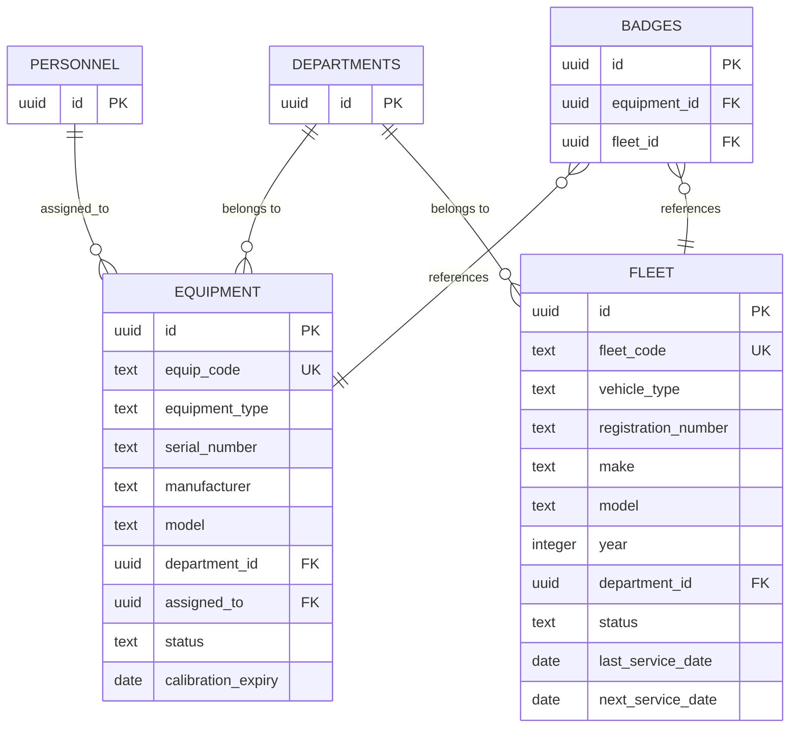
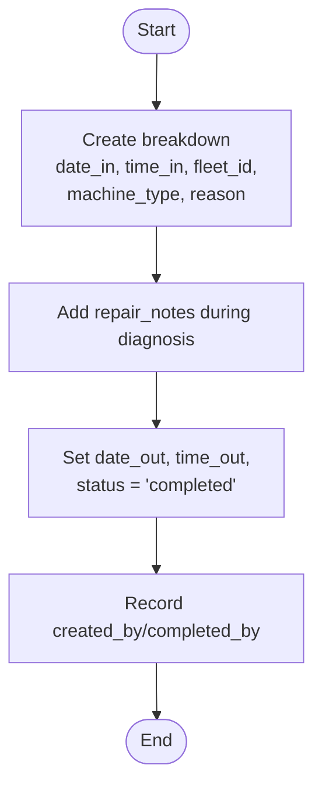
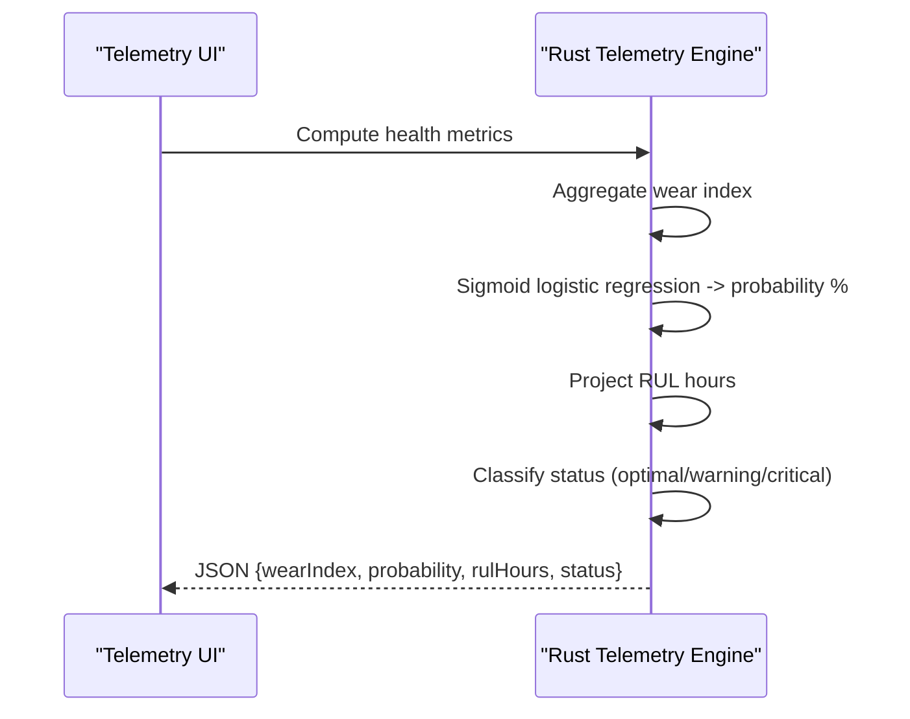
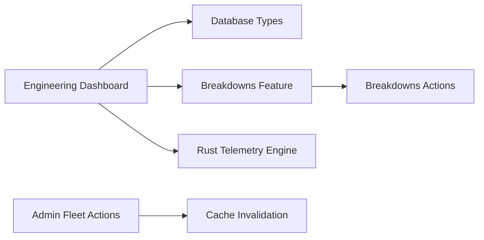

# Equipment Management

<cite>
**Referenced Files in This Document**
- [035_fleet_and_equipment_tables.sql](file://packages/supabase/migrations/035_fleet_and_equipment_tables.sql)
- [database.types.ts](file://packages/supabase/src/database.types.ts)
- [page.tsx](file://apps/portal/app/(departments)/engineering/page.tsx)
- [layout.tsx](file://apps/portal/app/(departments)/engineering/layout.tsx)
- [actions.ts](file://apps/portal/features/departments/components/engineering/breakdowns/actions.ts)
- [types.ts](file://apps/portal/features/departments/components/engineering/breakdowns/types.ts)
- [BookInForm.tsx](file://apps/portal/features/departments/components/engineering/breakdowns/BookInForm.tsx)
- [BookOutForm.tsx](file://apps/portal/features/departments/components/engineering/breakdowns/BookOutForm.tsx)
- [BreakdownsTable.tsx](file://apps/portal/features/departments/components/engineering/breakdowns/BreakdownsTable.tsx)
- [BreakdownsDashboard.tsx](file://apps/portal/features/departments/components/engineering/breakdowns/BreakdownsDashboard.tsx)
- [index.ts](file://apps/portal/features/departments/components/engineering/breakdowns/index.ts)
- [fleet.ts](file://apps/portal/features/admin/actions/fleet.ts)
- [access-control actions.ts](file://apps/portal/app/(departments)/access-control/actions.ts)
- [main.rs](file://apps/portal/plugins/rust-telemetry-engine/src/main.rs)
- [index.tsx](file://apps/portal/plugins/rust-telemetry-engine/index.tsx)
- [SCHEMA.md](file://wiki/SCHEMA.md)
- [engineering-department.md](file://wiki/entities/engineering-department.md)
</cite>

## Table of Contents

1. [Introduction](#introduction)
2. [Project Structure](#project-structure)
3. [Core Components](#core-components)
4. [Architecture Overview](#architecture-overview)
5. [Detailed Component Analysis](#detailed-component-analysis)
6. [Dependency Analysis](#dependency-analysis)
7. [Performance Considerations](#performance-considerations)
8. [Troubleshooting Guide](#troubleshooting-guide)
9. [Conclusion](#conclusion)
10. [Appendices](#appendices)

## Introduction

This document describes the Equipment Management system for the Engineering department. It covers:

- Equipment specifications database and asset lifecycle tracking
- Equipment categorization and maintenance history management
- Data models for equipment records, technical specifications storage, and integration with telemetry systems
- Workflows for equipment registration, specification updates, and performance monitoring
- Status tracking, warranty considerations, and depreciation calculations

The system integrates a relational schema for fleet and equipment assets, an engineering breakdown workflow for book-in/book-out maintenance events, and a Rust-based telemetry engine that computes wear, failure probability, and remaining useful life (RUL).

## Project Structure

Key areas relevant to Equipment Management:

- Database migrations define core tables for fleet and equipment, including constraints, indexes, and row-level security policies
- Portal UI provides the Engineering dashboard and breakdown workflows
- Admin actions manage fleet/equipment cache invalidation
- Telemetry plugin computes health metrics from operational inputs

**Diagram sources**

- [035_fleet_and_equipment_tables.sql:1-120](file://packages/supabase/migrations/035_fleet_and_equipment_tables.sql#L1-L120)
- [database.types.ts:266-360](file://packages/supabase/src/database.types.ts#L266-L360)
- [page.tsx](<file://apps/portal/app/(departments)/engineering/page.tsx#L1-L220>)
- [actions.ts](file://apps/portal/features/departments/components/engineering/breakdowns/actions.ts)
- [fleet.ts:58-105](file://apps/portal/features/admin/actions/fleet.ts#L58-L105)
- [main.rs:41-68](file://apps/portal/plugins/rust-telemetry-engine/src/main.rs#L41-L68)

**Section sources**

- [035_fleet_and_equipment_tables.sql:1-120](file://packages/supabase/migrations/035_fleet_and_equipment_tables.sql#L1-L120)
- [page.tsx](<file://apps/portal/app/(departments)/engineering/page.tsx#L1-L220>)
- [engineering-department.md:1-44](file://wiki/entities/engineering-department.md#L1-L44)

## Core Components

- Equipment and Fleet registries:
  - equipment: portable/fixed assets with type, serial number, manufacturer, model, department assignment, assigned personnel, status, calibration expiry
  - fleet: vehicles/heavy machinery with vehicle type, registration, make, model, year, department, service dates, status
- Breakdowns workflow:
  - Tracks book-in/book-out, reasons, repair notes, durations, and completion by user
- Badges linkage:
  - badges can reference equipment or fleet items for access control
- Telemetry integration:
  - Rust engine outputs wear index, failure probability, RUL, and health classification

**Section sources**

- [035_fleet_and_equipment_tables.sql:1-120](file://packages/supabase/migrations/035_fleet_and_equipment_tables.sql#L1-L120)
- [database.types.ts:266-360](file://packages/supabase/src/database.types.ts#L266-L360)
- [engineering-department.md:1-44](file://wiki/entities/engineering-department.md#L1-L44)

## Architecture Overview

High-level flow:

- Users interact with the Engineering dashboard and breakdown forms
- Data is persisted via Supabase client calls to the public schema
- Admin operations update fleet/equipment records and invalidate caches
- Telemetry engine computes health metrics consumed by dashboards

**Diagram sources**

- [page.tsx](<file://apps/portal/app/(departments)/engineering/page.tsx#L1-L220>)
- [actions.ts](file://apps/portal/features/departments/components/engineering/breakdowns/actions.ts)
- [fleet.ts:58-105](file://apps/portal/features/admin/actions/fleet.ts#L58-L105)
- [main.rs:41-68](file://apps/portal/plugins/rust-telemetry-engine/src/main.rs#L41-L68)

## Detailed Component Analysis

### Equipment and Fleet Data Models

- equipment fields include unique code, type, serial number, manufacturer, model, department association, assigned personnel, status, and calibration expiry
- fleet fields include unique code, vehicle type, registration, make, model, year, department, status, and service date fields
- Both tables have indexes on codes and department IDs; RLS policies restrict access based on roles and department membership
- badges references equipment and fleet for access control linkage

**Diagram sources**

- [035_fleet_and_equipment_tables.sql:1-120](file://packages/supabase/migrations/035_fleet_and_equipment_tables.sql#L1-L120)
- [database.types.ts:266-360](file://packages/supabase/src/database.types.ts#L266-L360)

**Section sources**

- [035_fleet_and_equipment_tables.sql:1-120](file://packages/supabase/migrations/035_fleet_and_equipment_tables.sql#L1-L120)
- [database.types.ts:266-360](file://packages/supabase/src/database.types.ts#L266-L360)

### Breakdowns Workflow (Equipment Maintenance History)

- The breakdowns table captures book-in/book-out events, reasons, repair notes, durations, and timestamps
- The Engineering dashboard queries active and completed breakdowns per department
- Forms support creating and completing breakdowns; actions orchestrate writes and reads

**Diagram sources**

- [database.types.ts:361-457](file://packages/supabase/src/database.types.ts#L361-L457)
- [page.tsx](<file://apps/portal/app/(departments)/engineering/page.tsx#L1-L220>)
- [actions.ts](file://apps/portal/features/departments/components/engineering/breakdowns/actions.ts)
- [types.ts](file://apps/portal/features/departments/components/engineering/breakdowns/types.ts)
- [BookInForm.tsx](file://apps/portal/features/departments/components/engineering/breakdowns/BookInForm.tsx)
- [BookOutForm.tsx](file://apps/portal/features/departments/components/engineering/breakdowns/BookOutForm.tsx)
- [BreakdownsTable.tsx](file://apps/portal/features/departments/components/engineering/breakdowns/BreakdownsTable.tsx)
- [BreakdownsDashboard.tsx](file://apps/portal/features/departments/components/engineering/breakdowns/BreakdownsDashboard.tsx)
- [index.ts](file://apps/portal/features/departments/components/engineering/breakdowns/index.ts)

**Section sources**

- [database.types.ts:361-457](file://packages/supabase/src/database.types.ts#L361-L457)
- [page.tsx](<file://apps/portal/app/(departments)/engineering/page.tsx#L1-L220>)
- [actions.ts](file://apps/portal/features/departments/components/engineering/breakdowns/actions.ts)
- [types.ts](file://apps/portal/features/departments/components/engineering/breakdowns/types.ts)
- [BookInForm.tsx](file://apps/portal/features/departments/components/engineering/breakdowns/BookInForm.tsx)
- [BookOutForm.tsx](file://apps/portal/features/departments/components/engineering/breakdowns/BookOutForm.tsx)
- [BreakdownsTable.tsx](file://apps/portal/features/departments/components/engineering/breakdowns/BreakdownsTable.tsx)
- [BreakdownsDashboard.tsx](file://apps/portal/features/departments/components/engineering/breakdowns/BreakdownsDashboard.tsx)
- [index.ts](file://apps/portal/features/departments/components/engineering/breakdowns/index.ts)

### Telemetry Integration (Wear, Failure Probability, RUL)

- The Rust telemetry engine aggregates wear components and applies a sigmoid function to compute failure probability percentage
- It projects Remaining Useful Life (RUL) in hours and classifies health status (optimal, warning, critical)
- The UI consumes these metrics to display wear index, RUL, and probability

**Diagram sources**

- [main.rs:41-68](file://apps/portal/plugins/rust-telemetry-engine/src/main.rs#L41-L68)
- [index.tsx:107-139](file://apps/portal/plugins/rust-telemetry-engine/index.tsx#L107-L139)

**Section sources**

- [main.rs:41-68](file://apps/portal/plugins/rust-telemetry-engine/src/main.rs#L41-L68)
- [index.tsx:107-139](file://apps/portal/plugins/rust-telemetry-engine/index.tsx#L107-L139)

### Access Control and Badge Linkage

- Badges can be associated with equipment or fleet entries
- RLS policies ensure only authorized users (admin/access_control or matching department) can read/write fleet/equipment data
- Access control actions reference equipment-related cache tags for consistency

**Section sources**

- [database.types.ts:266-360](file://packages/supabase/src/database.types.ts#L266-L360)
- [035_fleet_and_equipment_tables.sql:59-120](file://packages/supabase/migrations/035_fleet_and_equipment_tables.sql#L59-L120)
- [access-control actions.ts](<file://apps/portal/app/(departments)/access-control/actions.ts#L260-L276>)

### Administrative Fleet/Equipment Updates

- Admin actions update fleet/equipment records and invalidate related cache tags to keep UI consistent

**Section sources**

- [fleet.ts:58-105](file://apps/portal/features/admin/actions/fleet.ts#L58-L105)

## Dependency Analysis

- UI depends on database types and Supabase client for reading breakdowns and KPIs
- Breakdowns feature depends on actions and typed forms for stateful workflows
- Admin fleet actions depend on cache invalidation utilities
- Telemetry engine is a separate process providing computed metrics to UI

**Diagram sources**

- [page.tsx](<file://apps/portal/app/(departments)/engineering/page.tsx#L1-L220>)
- [actions.ts](file://apps/portal/features/departments/components/engineering/breakdowns/actions.ts)
- [fleet.ts:58-105](file://apps/portal/features/admin/actions/fleet.ts#L58-L105)
- [main.rs:41-68](file://apps/portal/plugins/rust-telemetry-engine/src/main.rs#L41-L68)

**Section sources**

- [page.tsx](<file://apps/portal/app/(departments)/engineering/page.tsx#L1-L220>)
- [actions.ts](file://apps/portal/features/departments/components/engineering/breakdowns/actions.ts)
- [fleet.ts:58-105](file://apps/portal/features/admin/actions/fleet.ts#L58-L105)
- [main.rs:41-68](file://apps/portal/plugins/rust-telemetry-engine/src/main.rs#L41-L68)

## Performance Considerations

- Indexes on equipment(equip_code), equipment(department_id), equipment(assigned_to), and fleet(fleet_code), fleet(department_id) improve lookup and join performance
- Materialized views and partitioning strategies are used elsewhere in the schema; consider similar patterns for high-volume telemetry or breakdown logs if needed
- Use read replicas for dashboard queries to reduce write load on primary

[No sources needed since this section provides general guidance]

## Troubleshooting Guide

- If breakdown counts appear stale, verify RLS policies and department context; ensure the user has appropriate role or department membership
- For badge-to-equipment/fleet linkage issues, confirm foreign key constraints and referential integrity
- When admin updates do not reflect immediately, check cache invalidation tags for fleet and equipment

**Section sources**

- [035_fleet_and_equipment_tables.sql:59-120](file://packages/supabase/migrations/035_fleet_and_equipment_tables.sql#L59-L120)
- [database.types.ts:266-360](file://packages/supabase/src/database.types.ts#L266-L360)
- [fleet.ts:58-105](file://apps/portal/features/admin/actions/fleet.ts#L58-L105)

## Conclusion

The Equipment Management system provides a robust foundation for tracking equipment and fleet assets, managing maintenance through a structured breakdown workflow, and integrating telemetry-driven health insights. With clear data models, strong access controls, and actionable UI flows, it supports effective lifecycle management and performance monitoring for Engineering operations.

[No sources needed since this section summarizes without analyzing specific files]

## Appendices

### Examples and Workflows

- Equipment Registration Workflow
  - Create an equipment record with unique code, type, serial number, manufacturer, model, department, and initial status
  - Optionally assign to personnel and set calibration expiry
  - Reference via badges for access control if needed

- Specification Updates
  - Admin updates equipment or fleet attributes
  - Cache invalidation ensures UI reflects changes promptly

- Performance Monitoring Integration
  - Call telemetry engine to compute wear index, failure probability, RUL, and status
  - Display results in the dashboard for proactive maintenance planning

- Warranty Management
  - Extend equipment records with warranty start/end dates and vendor details
  - Trigger alerts when warranty approaches expiration

- Depreciation Calculations
  - Add acquisition cost, useful life, and depreciation method fields to equipment
  - Compute periodic depreciation values and current book value for reporting

[No sources needed since this section provides conceptual guidance]
