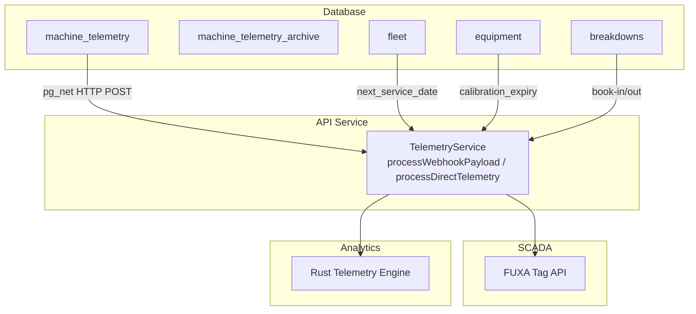
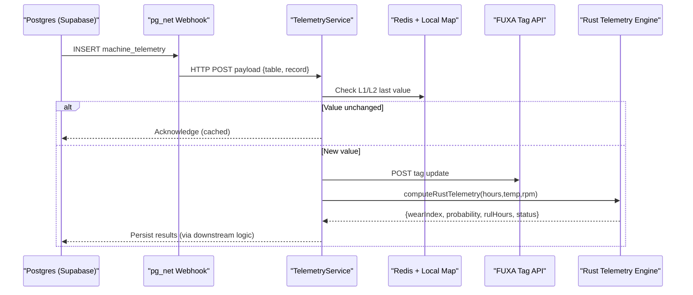
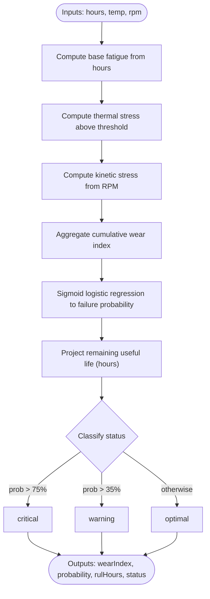
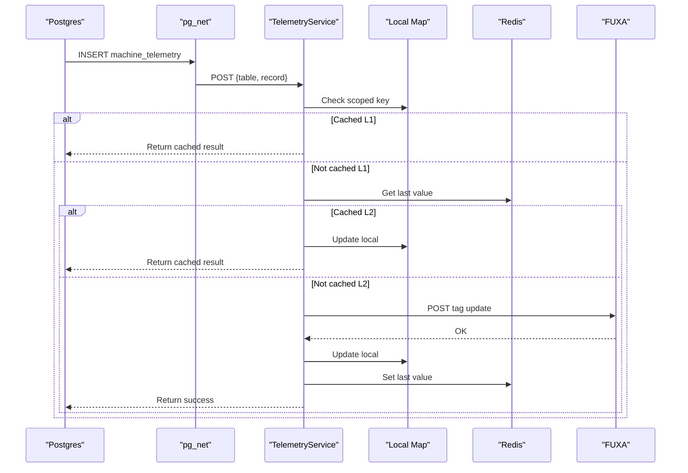
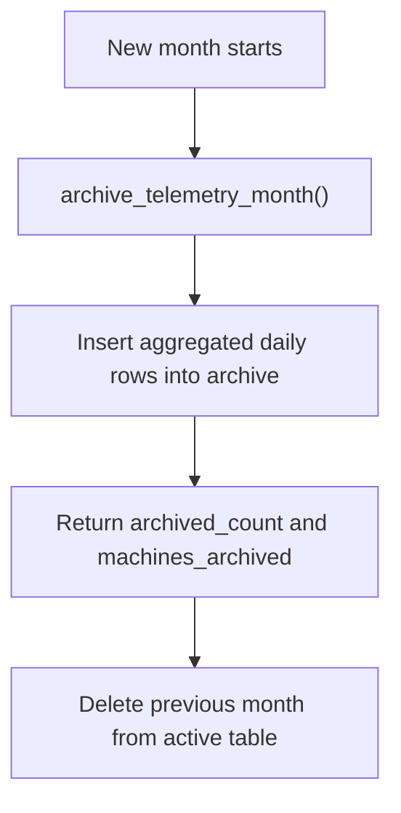
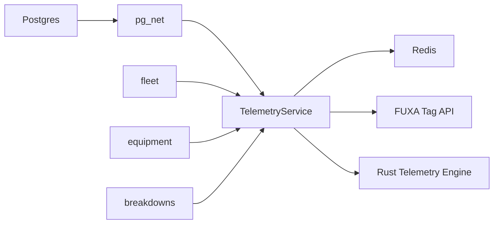
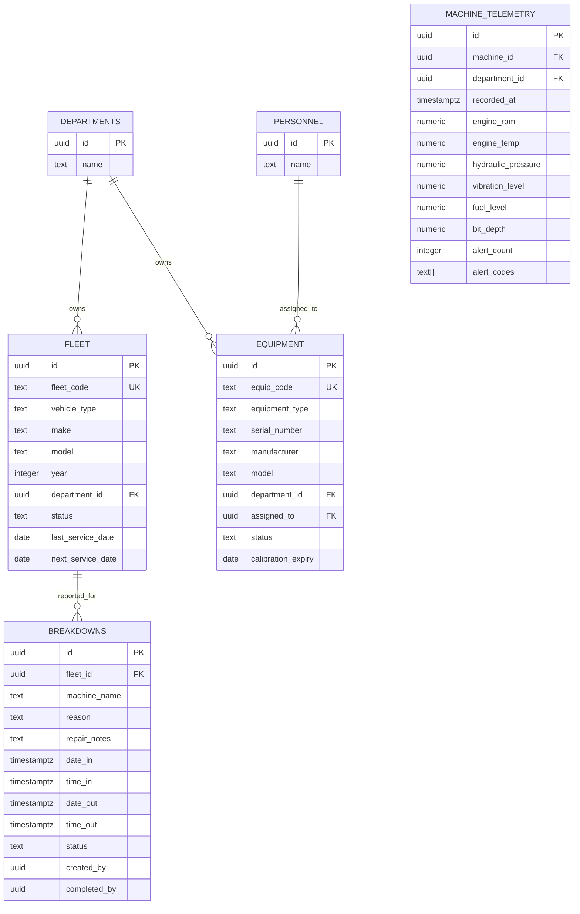

# Maintenance Scheduling

<cite>
**Referenced Files in This Document**
- [025_machine_telemetry.sql](file://packages/supabase/migrations/025_machine_telemetry.sql)
- [035_fleet_and_equipment_tables.sql](file://packages/supabase/migrations/035_fleet_and_equipment_tables.sql)
- [053_machine_telemetry_webhook.sql](file://packages/supabase/migrations/053_machine_telemetry_webhook.sql)
- [telemetry.service.ts](file://apps/api/src/telemetry/telemetry.service.ts)
- [main.rs](file://apps/portal/plugins/rust-telemetry-engine/src/main.rs)
- [engineering-department.md](file://wiki/entities/engineering-department.md)
</cite>

## Table of Contents

1. Introduction
2. Project Structure
3. Core Components
4. Architecture Overview
5. Detailed Component Analysis
6. Dependency Analysis
7. Performance Considerations
8. Troubleshooting Guide
9. Conclusion
10. Appendices

## Introduction

This document describes the Maintenance Scheduling system as implemented in the repository. It covers:

- Preventive maintenance planning using equipment and fleet service dates
- Corrective maintenance workflows via breakdowns book-in/book-out
- Predictive maintenance algorithms driven by machine telemetry
- Maintenance calendar management, technician assignment, and resource allocation
- Examples of task creation, scheduling rules, and automated reminders
- Maintenance history tracking, cost analysis, and compliance reporting
- Integration with equipment telemetry for condition-based triggers

The system combines database-backed asset registries, a real-time telemetry pipeline, and predictive analytics to enable proactive maintenance operations.

## Project Structure

The maintenance-related capabilities are primarily implemented across:

- Database schema and functions for telemetry, archival, and summaries
- A webhook-triggered ingestion pipeline that forwards telemetry to SCADA and caches last values
- A predictive analytics engine (Rust binary or JS fallback) computing wear, failure probability, and remaining useful life
- Documentation of the Engineering department’s corrective workflow and KPIs

**Diagram sources**

- [025_machine_telemetry.sql:1-313](file://packages/supabase/migrations/025_machine_telemetry.sql#L1-L313)
- [035_fleet_and_equipment_tables.sql:1-120](file://packages/supabase/migrations/035_fleet_and_equipment_tables.sql#L1-L120)
- [053_machine_telemetry_webhook.sql:1-45](file://packages/supabase/migrations/053_machine_telemetry_webhook.sql#L1-L45)
- [telemetry.service.ts:1-195](file://apps/api/src/telemetry/telemetry.service.ts#L1-L195)
- [main.rs:1-69](file://apps/portal/plugins/rust-telemetry-engine/src/main.rs#L1-L69)

**Section sources**

- [025_machine_telemetry.sql:1-313](file://packages/supabase/migrations/025_machine_telemetry.sql#L1-L313)
- [035_fleet_and_equipment_tables.sql:1-120](file://packages/supabase/migrations/035_fleet_and_equipment_tables.sql#L1-L120)
- [053_machine_telemetry_webhook.sql:1-45](file://packages/supabase/migrations/053_machine_telemetry_webhook.sql#L1-L45)
- [telemetry.service.ts:1-195](file://apps/api/src/telemetry/telemetry.service.ts#L1-L195)
- [main.rs:1-69](file://apps/portal/plugins/rust-telemetry-engine/src/main.rs#L1-L69)
- [engineering-department.md:1-69](file://wiki/entities/engineering-department.md#L1-L69)

## Core Components

- Asset registry and preventive maintenance fields
  - Fleet assets include last_service_date and next_service_date to schedule preventive tasks
  - Equipment includes calibration_expiry for scheduled calibrations
- Corrective maintenance workflow
  - Breakdowns table supports book-in/book-out with status tracking and audit fields
- Telemetry ingestion and caching
  - Webhook from database inserts triggers processing, deduplication, and forwarding to SCADA
- Predictive maintenance engine
  - Rust binary computes wear index, failure probability, and remaining useful life; JS fallback available
- Historical aggregation and archival
  - Monthly archival function aggregates daily metrics and moves data to archive table
  - Summary function provides hourly/daily aggregations for dashboards

**Section sources**

- [035_fleet_and_equipment_tables.sql:1-120](file://packages/supabase/migrations/035_fleet_and_equipment_tables.sql#L1-L120)
- [025_machine_telemetry.sql:150-223](file://packages/supabase/migrations/025_machine_telemetry.sql#L150-L223)
- [telemetry.service.ts:49-159](file://apps/api/src/telemetry/telemetry.service.ts#L49-L159)
- [main.rs:27-68](file://apps/portal/plugins/rust-telemetry-engine/src/main.rs#L27-L68)
- [engineering-department.md:25-44](file://wiki/entities/engineering-department.md#L25-L44)

## Architecture Overview

The system integrates database events, an API service, SCADA, and analytics to drive maintenance scheduling and alerts.

**Diagram sources**

- [053_machine_telemetry_webhook.sql:1-45](file://packages/supabase/migrations/053_machine_telemetry_webhook.sql#L1-L45)
- [telemetry.service.ts:49-159](file://apps/api/src/telemetry/telemetry.service.ts#L49-L159)
- [main.rs:27-68](file://apps/portal/plugins/rust-telemetry-engine/src/main.rs#L27-L68)

## Detailed Component Analysis

### Preventive Maintenance Planning

- Fleet assets track last_service_date and next_service_date to plan recurring services
- Equipment tracks calibration_expiry for scheduled calibrations
- Calendar management can be built on these date fields to generate upcoming tasks and reminders

Examples:

- Task creation: Create a preventive task when next_service_date is approaching
- Scheduling rules: Generate tasks at fixed intervals based on operating hours or calendar thresholds
- Automated reminders: Notify technicians before due dates

**Section sources**

- [035_fleet_and_equipment_tables.sql:6-20](file://packages/supabase/migrations/035_fleet_and_equipment_tables.sql#L6-L20)
- [035_fleet_and_equipment_tables.sql:25-38](file://packages/supabase/migrations/035_fleet_and_equipment_tables.sql#L25-L38)

### Corrective Maintenance Workflows

- Breakdowns support book-in/book-out with status transitions and audit fields
- Dashboard KPIs include active breakdowns, MTTR, pending work, and completed today

Workflow:

- Book-in: Record date/time, asset, and reason
- Investigation: Add repair notes during diagnosis
- Book-out: Set completion date/time and mark status completed
- Audit: Track created_by and completed_by

**Section sources**

- [engineering-department.md:25-44](file://wiki/entities/engineering-department.md#L25-L44)

### Predictive Maintenance Algorithms

- Inputs: operating hours, temperature, RPM
- Outputs: wear index, failure probability percentage, remaining useful life (hours), health classification
- Implementation: Rust binary invoked by API; JS fallback if binary unavailable

**Diagram sources**

- [main.rs:27-68](file://apps/portal/plugins/rust-telemetry-engine/src/main.rs#L27-L68)
- [telemetry.service.ts:161-193](file://apps/api/src/telemetry/telemetry.service.ts#L161-L193)

**Section sources**

- [main.rs:1-69](file://apps/portal/plugins/rust-telemetry-engine/src/main.rs#L1-L69)
- [telemetry.service.ts:161-193](file://apps/api/src/telemetry/telemetry.service.ts#L161-L193)

### Telemetry Ingestion and Caching

- Webhook trigger posts new telemetry records to the API
- API performs two-level deduplication:
  - L1: In-process map keyed by tenant and tag name
  - L2: Redis cache with TTL
- On change, updates SCADA tags and persists last values

**Diagram sources**

- [053_machine_telemetry_webhook.sql:1-45](file://packages/supabase/migrations/053_machine_telemetry_webhook.sql#L1-L45)
- [telemetry.service.ts:49-159](file://apps/api/src/telemetry/telemetry.service.ts#L49-L159)

**Section sources**

- [053_machine_telemetry_webhook.sql:1-45](file://packages/supabase/migrations/053_machine_telemetry_webhook.sql#L1-L45)
- [telemetry.service.ts:49-159](file://apps/api/src/telemetry/telemetry.service.ts#L49-L159)

### Maintenance History Tracking and Reporting

- Monthly archival aggregates daily metrics and moves them to archive table
- Summary function returns hourly or daily aggregations for dashboards
- Breakdowns history supports MTTR and completion counts

**Diagram sources**

- [025_machine_telemetry.sql:150-223](file://packages/supabase/migrations/025_machine_telemetry.sql#L150-L223)

**Section sources**

- [025_machine_telemetry.sql:150-223](file://packages/supabase/migrations/025_machine_telemetry.sql#L150-L223)
- [025_machine_telemetry.sql:230-292](file://packages/supabase/migrations/025_machine_telemetry.sql#L230-L292)
- [engineering-department.md:39-44](file://wiki/entities/engineering-department.md#L39-L44)

### Technician Assignment and Resource Allocation

- Equipment assigned_to references personnel for ownership and assignment
- Fleet and equipment tables include indexes for efficient lookup by department and assignee
- Access control policies restrict access by role and department

**Section sources**

- [035_fleet_and_equipment_tables.sql:25-38](file://packages/supabase/migrations/035_fleet_and_equipment_tables.sql#L25-L38)
- [035_fleet_and_equipment_tables.sql:50-56](file://packages/supabase/migrations/035_fleet_and_equipment_tables.sql#L50-L56)
- [035_fleet_and_equipment_tables.sql:64-120](file://packages/supabase/migrations/035_fleet_and_equipment_tables.sql#L64-L120)

### Compliance Reporting

- Row-level security policies enforce department-scoped access for telemetry and assets
- Breakdowns and telemetry provide auditable records for compliance reviews

**Section sources**

- [025_machine_telemetry.sql:98-148](file://packages/supabase/migrations/025_machine_telemetry.sql#L98-L148)
- [035_fleet_and_equipment_tables.sql:64-120](file://packages/supabase/migrations/035_fleet_and_equipment_tables.sql#L64-L120)

## Dependency Analysis

Key dependencies and interactions:

- Database triggers depend on pg_net extension to call API endpoints
- API depends on Redis for distributed caching and local map for performance
- API invokes Rust binary for analytics; falls back to JS implementation
- Assets reference departments and personnel for assignment and access control

**Diagram sources**

- [053_machine_telemetry_webhook.sql:1-45](file://packages/supabase/migrations/053_machine_telemetry_webhook.sql#L1-L45)
- [telemetry.service.ts:1-195](file://apps/api/src/telemetry/telemetry.service.ts#L1-L195)
- [main.rs:1-69](file://apps/portal/plugins/rust-telemetry-engine/src/main.rs#L1-L69)
- [035_fleet_and_equipment_tables.sql:1-120](file://packages/supabase/migrations/035_fleet_and_equipment_tables.sql#L1-L120)

**Section sources**

- [053_machine_telemetry_webhook.sql:1-45](file://packages/supabase/migrations/053_machine_telemetry_webhook.sql#L1-L45)
- [telemetry.service.ts:1-195](file://apps/api/src/telemetry/telemetry.service.ts#L1-L195)
- [main.rs:1-69](file://apps/portal/plugins/rust-telemetry-engine/src/main.rs#L1-L69)
- [035_fleet_and_equipment_tables.sql:1-120](file://packages/supabase/migrations/035_fleet_and_equipment_tables.sql#L1-L120)

## Performance Considerations

- Deduplication reduces redundant SCADA writes and network overhead
- Local map and Redis caching minimize latency and external calls
- Monthly archival keeps active telemetry tables lean for faster queries
- Indexes on department_id, codes, and assignees improve lookup performance

[No sources needed since this section provides general guidance]

## Troubleshooting Guide

Common issues and checks:

- Webhook not firing: Ensure pg_net extension is enabled and webhook endpoint configured
- Duplicate SCADA updates: Verify L1/L2 caching keys and TTL behavior
- Analytics failures: Confirm Rust binary path exists; otherwise JS fallback will run
- Access denied: Validate RLS policies and user roles per department

**Section sources**

- [053_machine_telemetry_webhook.sql:1-45](file://packages/supabase/migrations/053_machine_telemetry_webhook.sql#L1-L45)
- [telemetry.service.ts:161-193](file://apps/api/src/telemetry/telemetry.service.ts#L161-L193)
- [025_machine_telemetry.sql:98-148](file://packages/supabase/migrations/025_machine_telemetry.sql#L98-L148)

## Conclusion

The Maintenance Scheduling system leverages structured asset registries, robust telemetry ingestion, and predictive analytics to enable proactive maintenance. Preventive schedules derive from service and calibration dates, corrective workflows are tracked through breakdowns, and condition-based triggers arise from telemetry-driven risk assessments. Archival and summary functions support historical analysis and compliance reporting, while caching and indexing ensure performance at scale.

[No sources needed since this section summarizes without analyzing specific files]

## Appendices

### Data Models

**Diagram sources**

- [035_fleet_and_equipment_tables.sql:1-120](file://packages/supabase/migrations/035_fleet_and_equipment_tables.sql#L1-L120)
- [025_machine_telemetry.sql:1-97](file://packages/supabase/migrations/025_machine_telemetry.sql#L1-L97)
- [029_breakdowns_machine_name.sql:1-8](file://packages/supabase/migrations/029_breakdowns_machine_name.sql#L1-L8)
