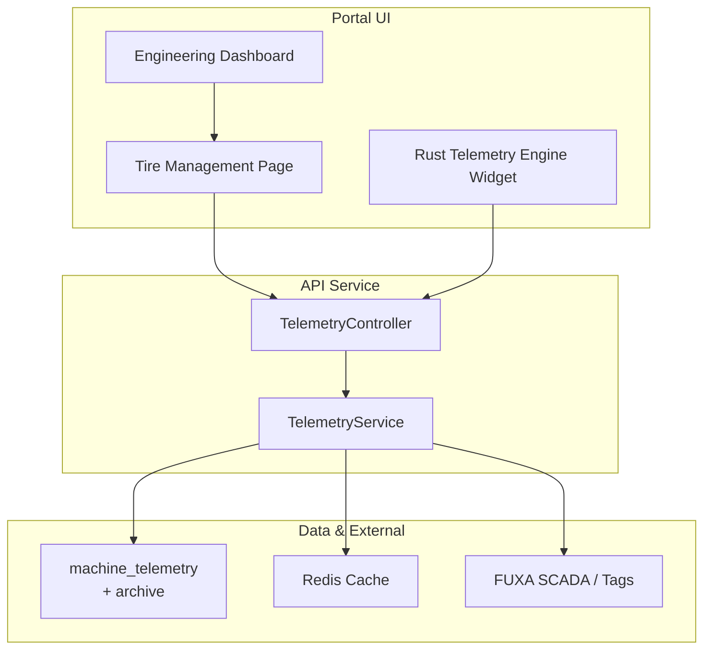
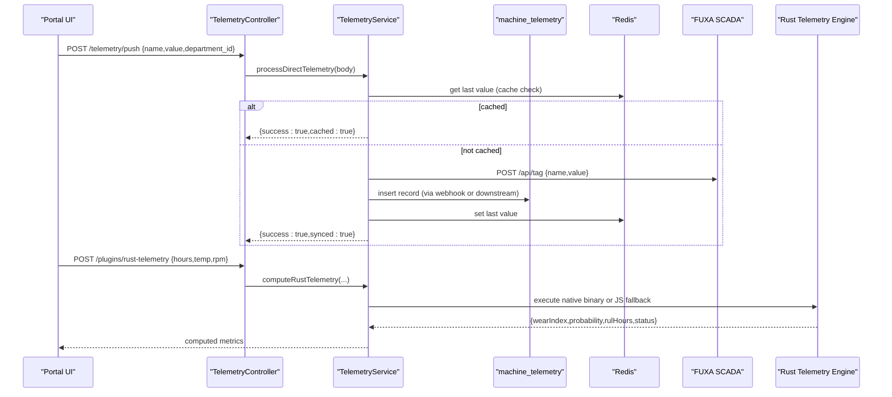
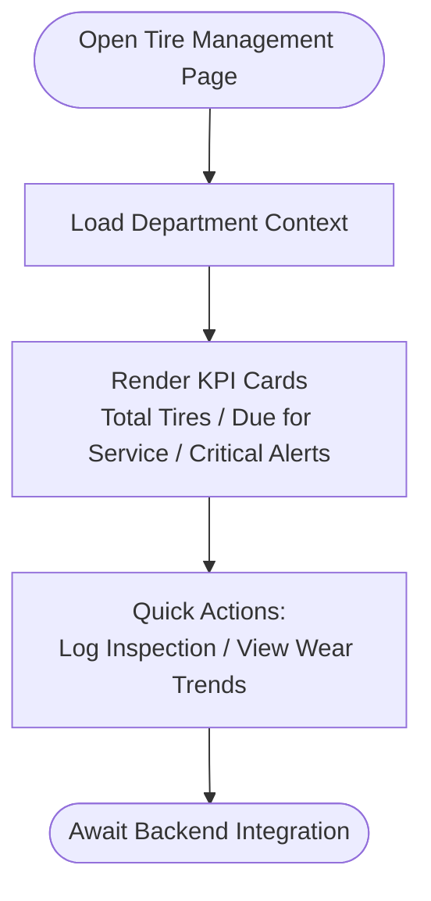
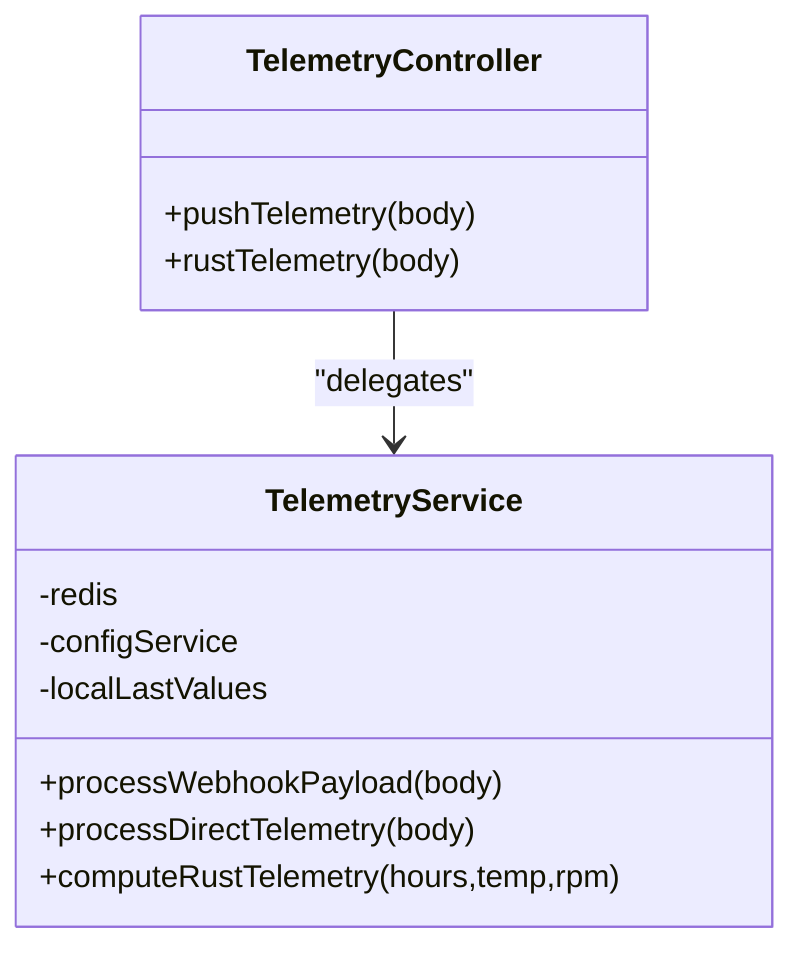
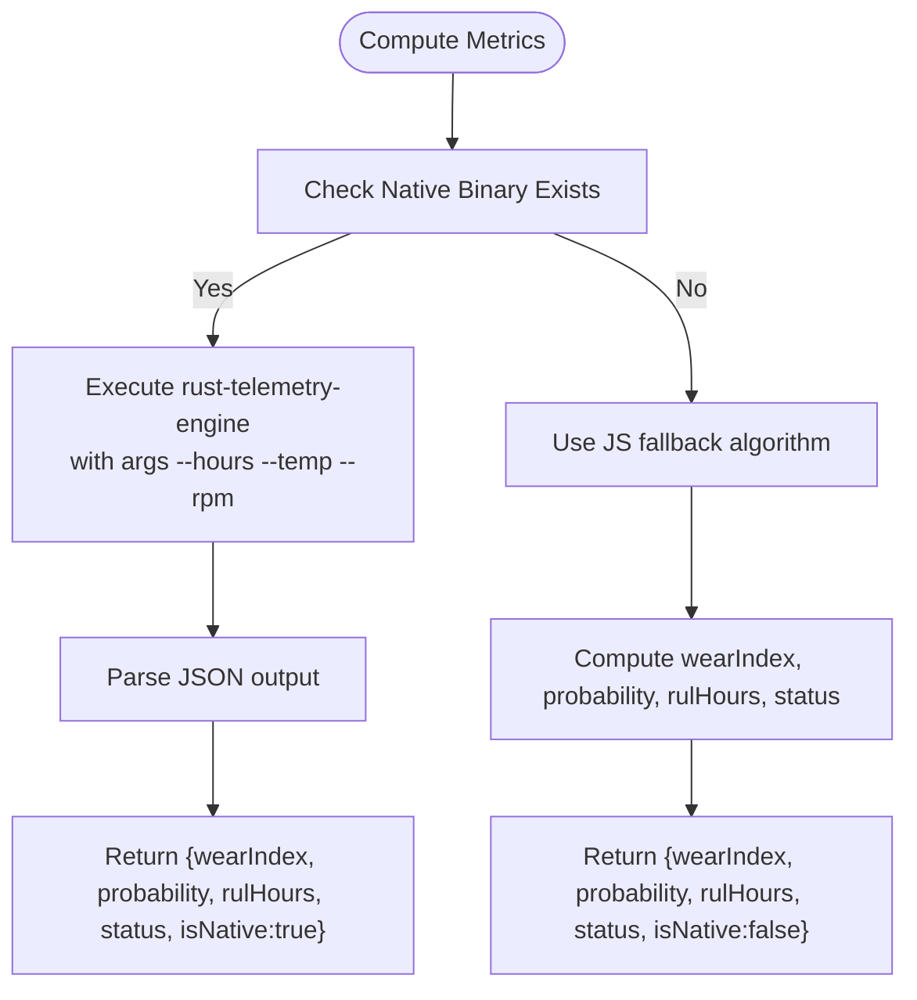
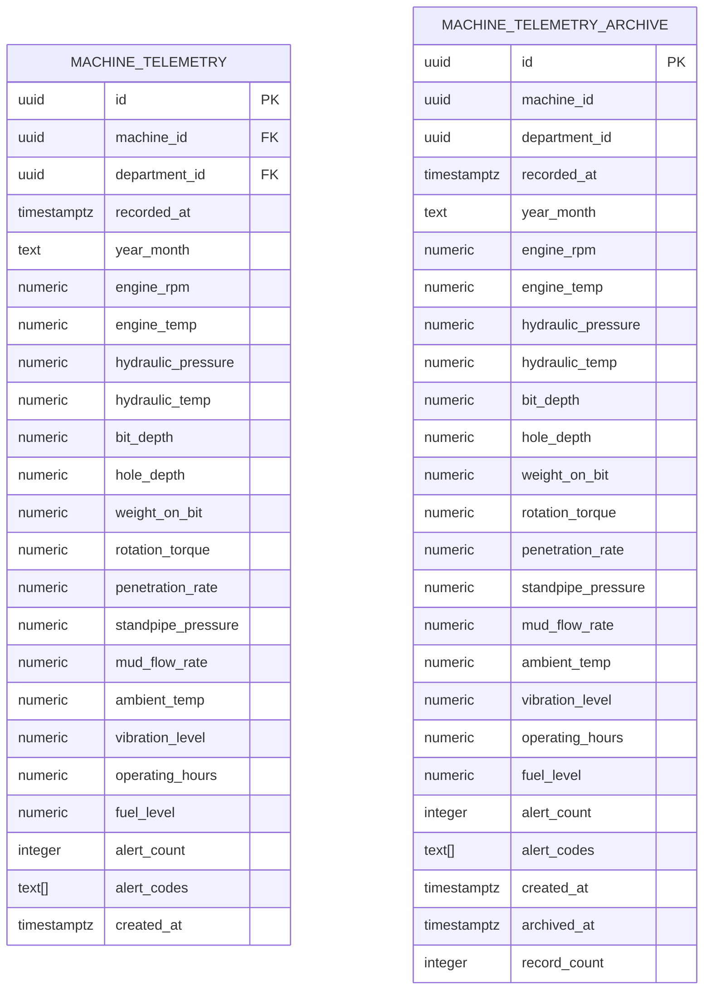
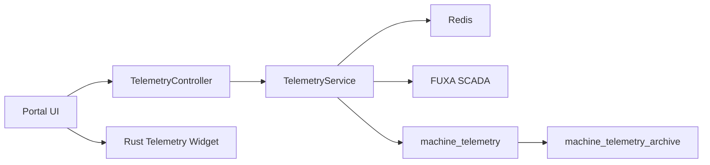

# Tire Management

<cite>
**Referenced Files in This Document**
- [apps/portal/app/(departments)/engineering/tire-management/page.tsx](file://apps/portal/app/(departments)/engineering/tire-management/page.tsx)
- [apps/portal/app/(departments)/engineering/tire-management/layout.tsx](file://apps/portal/app/(departments)/engineering/tire-management/layout.tsx)
- [apps/portal/app/(departments)/engineering/page.tsx](file://apps/portal/app/(departments)/engineering/page.tsx)
- [apps/portal/plugins/rust-telemetry-engine/index.tsx](file://apps/portal/plugins/rust-telemetry-engine/index.tsx)
- [apps/api/src/telemetry/telemetry.controller.ts](file://apps/api/src/telemetry/telemetry.controller.ts)
- [apps/api/src/telemetry/telemetry.service.ts](file://apps/api/src/telemetry/telemetry.service.ts)
- [packages/supabase/migrations/025_machine_telemetry.sql](file://packages/supabase/migrations/025_machine_telemetry.sql)
</cite>

## Table of Contents

1. [Introduction](#introduction)
2. [Project Structure](#project-structure)
3. [Core Components](#core-components)
4. [Architecture Overview](#architecture-overview)
5. [Detailed Component Analysis](#detailed-component-analysis)
6. [Dependency Analysis](#dependency-analysis)
7. [Performance Considerations](#performance-considerations)
8. [Troubleshooting Guide](#troubleshooting-guide)
9. [Conclusion](#conclusion)
10. [Appendices](#appendices)

## Introduction

This document describes the Tire Management subsystem as implemented in the repository. It covers:

- Inventory tracking and inspection logging UI scaffolding
- Wear monitoring and replacement scheduling indicators
- Performance metrics collection via telemetry ingestion and computation
- Integration with vehicle telematics through a push API and Rust-native analysis engine
- Data persistence for machine telemetry, including archival and access control

The tire module is currently a frontend scaffold with placeholders for live data, while the backend provides a robust telemetry pipeline that can be extended to support tire-specific metrics.

## Project Structure

The tire management feature spans the portal UI (Next.js), an API service (NestJS), and database migrations (Supabase). The current state includes:

- A dedicated page and layout under Engineering for tire management
- A telemetry controller and service for ingesting and processing metrics
- A Rust-based native engine for wear and failure probability calculations
- Database schema for machine telemetry with monthly archival and row-level security

**Diagram sources**

- [apps/portal/app/(departments)/engineering/page.tsx](<file://apps/portal/app/(departments)/engineering/page.tsx#L160-L219>)
- [apps/portal/app/(departments)/engineering/tire-management/page.tsx](<file://apps/portal/app/(departments)/engineering/tire-management/page.tsx#L1-L76>)
- [apps/portal/plugins/rust-telemetry-engine/index.tsx:107-139](file://apps/portal/plugins/rust-telemetry-engine/index.tsx#L107-L139)
- [apps/api/src/telemetry/telemetry.controller.ts:1-37](file://apps/api/src/telemetry/telemetry.controller.ts#L1-L37)
- [apps/api/src/telemetry/telemetry.service.ts:1-195](file://apps/api/src/telemetry/telemetry.service.ts#L1-L195)
- [packages/supabase/migrations/025_machine_telemetry.sql:1-313](file://packages/supabase/migrations/025_machine_telemetry.sql#L1-L313)

**Section sources**

- [apps/portal/app/(departments)/engineering/tire-management/page.tsx](<file://apps/portal/app/(departments)/engineering/tire-management/page.tsx#L1-L76>)
- [apps/portal/app/(departments)/engineering/tire-management/layout.tsx](<file://apps/portal/app/(departments)/engineering/tire-management/layout.tsx#L1-L7>)
- [apps/portal/app/(departments)/engineering/page.tsx](<file://apps/portal/app/(departments)/engineering/page.tsx#L160-L219>)
- [apps/portal/plugins/rust-telemetry-engine/index.tsx:107-139](file://apps/portal/plugins/rust-telemetry-engine/index.tsx#L107-L139)
- [apps/api/src/telemetry/telemetry.controller.ts:1-37](file://apps/api/src/telemetry/telemetry.controller.ts#L1-L37)
- [apps/api/src/telemetry/telemetry.service.ts:1-195](file://apps/api/src/telemetry/telemetry.service.ts#L1-L195)
- [packages/supabase/migrations/025_machine_telemetry.sql:1-313](file://packages/supabase/migrations/025_machine_telemetry.sql#L1-L313)

## Core Components

- Tire Management UI
  - Provides a dashboard entry point and a dedicated page for tire inspections, wear tracking, and replacement scheduling. Currently shows placeholder values and quick actions.
- Telemetry Ingestion API
  - Accepts webhook payloads from Supabase and direct tag updates. Applies caching to avoid redundant writes and forwards values to external systems.
- Rust Telemetry Engine
  - Computes wear index, failure probability, remaining useful life, and health status using a native binary or JS fallback.
- Machine Telemetry Schema
  - Stores time-series telemetry with monthly archival, indexes, and row-level security policies.

Key responsibilities:

- UI: Present tire KPIs, alerts, and quick actions; integrate with telemetry endpoints
- API: Validate inputs, deduplicate writes, persist to DB, forward to SCADA
- Engine: Compute tire-related performance metrics (wear, RUL, probability)
- Data: Persist telemetry, aggregate summaries, and archive historical data

**Section sources**

- [apps/portal/app/(departments)/engineering/tire-management/page.tsx](<file://apps/portal/app/(departments)/engineering/tire-management/page.tsx#L1-L76>)
- [apps/portal/app/(departments)/engineering/page.tsx](<file://apps/portal/app/(departments)/engineering/page.tsx#L160-L219>)
- [apps/api/src/telemetry/telemetry.controller.ts:1-37](file://apps/api/src/telemetry/telemetry.controller.ts#L1-L37)
- [apps/api/src/telemetry/telemetry.service.ts:1-195](file://apps/api/src/telemetry/telemetry.service.ts#L1-L195)
- [packages/supabase/migrations/025_machine_telemetry.sql:1-313](file://packages/supabase/migrations/025_machine_telemetry.sql#L1-L313)

## Architecture Overview

The tire management system integrates UI, API, and data layers with optional external SCADA integration and a native analytics engine.

**Diagram sources**

- [apps/api/src/telemetry/telemetry.controller.ts:1-37](file://apps/api/src/telemetry/telemetry.controller.ts#L1-L37)
- [apps/api/src/telemetry/telemetry.service.ts:1-195](file://apps/api/src/telemetry/telemetry.service.ts#L1-L195)
- [packages/supabase/migrations/025_machine_telemetry.sql:1-313](file://packages/supabase/migrations/025_machine_telemetry.sql#L1-L313)

## Detailed Component Analysis

### Tire Management UI

- Purpose: Provide a centralized view for tire inspections, wear tracking, and replacement scheduling within the Engineering department context.
- Current state: Placeholder cards for total tires, due for service, critical alerts; quick action buttons for logging inspections and viewing trends.
- Integration points:
  - Engineering dashboard links to the tire management page
  - Rust telemetry widget displays wear index, estimated lifetime, and failure probability

**Diagram sources**

- [apps/portal/app/(departments)/engineering/tire-management/page.tsx](<file://apps/portal/app/(departments)/engineering/tire-management/page.tsx#L1-L76>)
- [apps/portal/app/(departments)/engineering/page.tsx](<file://apps/portal/app/(departments)/engineering/page.tsx#L160-L219>)
- [apps/portal/plugins/rust-telemetry-engine/index.tsx:107-139](file://apps/portal/plugins/rust-telemetry-engine/index.tsx#L107-L139)

**Section sources**

- [apps/portal/app/(departments)/engineering/tire-management/page.tsx](<file://apps/portal/app/(departments)/engineering/tire-management/page.tsx#L1-L76>)
- [apps/portal/app/(departments)/engineering/tire-management/layout.tsx](<file://apps/portal/app/(departments)/engineering/tire-management/layout.tsx#L1-L7>)
- [apps/portal/app/(departments)/engineering/page.tsx](<file://apps/portal/app/(departments)/engineering/page.tsx#L160-L219>)
- [apps/portal/plugins/rust-telemetry-engine/index.tsx:107-139](file://apps/portal/plugins/rust-telemetry-engine/index.tsx#L107-L139)

### Telemetry Controller and Service

- Controller
  - Exposes endpoints for pushing telemetry and computing metrics via the Rust plugin.
- Service
  - Handles two flows:
    - Webhook flow: Reads Supabase webhook payload for machine_telemetry, maps fields, caches last values, and pushes to FUXA tags.
    - Direct flow: Validates input, applies L1/L2 cache checks, persists to DB (via webhook or downstream), and forwards to FUXA.
  - Rust integration: Executes native binary if available; otherwise falls back to JS implementation. Returns wear index, failure probability, RUL, and status.

**Diagram sources**

- [apps/api/src/telemetry/telemetry.controller.ts:1-37](file://apps/api/src/telemetry/telemetry.controller.ts#L1-L37)
- [apps/api/src/telemetry/telemetry.service.ts:1-195](file://apps/api/src/telemetry/telemetry.service.ts#L1-L195)

**Section sources**

- [apps/api/src/telemetry/telemetry.controller.ts:1-37](file://apps/api/src/telemetry/telemetry.controller.ts#L1-L37)
- [apps/api/src/telemetry/telemetry.service.ts:1-195](file://apps/api/src/telemetry/telemetry.service.ts#L1-L195)

### Rust Telemetry Engine

- Purpose: Compute tire-related performance metrics using a native binary when available, with a JS fallback.
- Inputs: hours, temperature, RPM
- Outputs: wearIndex, probability (%), rulHours, status ("optimal", "warning", "critical")
- UI integration: Displays wear index, estimated lifetime, and failure probability bar

**Diagram sources**

- [apps/api/src/telemetry/telemetry.service.ts:161-193](file://apps/api/src/telemetry/telemetry.service.ts#L161-L193)
- [apps/portal/plugins/rust-telemetry-engine/index.tsx:107-139](file://apps/portal/plugins/rust-telemetry-engine/index.tsx#L107-L139)

**Section sources**

- [apps/api/src/telemetry/telemetry.service.ts:161-193](file://apps/api/src/telemetry/telemetry.service.ts#L161-L193)
- [apps/portal/plugins/rust-telemetry-engine/index.tsx:107-139](file://apps/portal/plugins/rust-telemetry-engine/index.tsx#L107-L139)

### Machine Telemetry Schema and Archival

- Active table: machine_telemetry stores per-machine metrics with timestamps and derived year_month for easy filtering.
- Archive table: machine_telemetry_archive holds aggregated monthly summaries.
- Functions:
  - archive_telemetry_month: Aggregates previous month’s data into archive and deletes from active table.
  - get_telemetry_summary: Returns hourly or daily aggregates for current month.
- Security: Row-level security policies restrict access by department.

**Diagram sources**

- [packages/supabase/migrations/025_machine_telemetry.sql:1-313](file://packages/supabase/migrations/025_machine_telemetry.sql#L1-L313)

**Section sources**

- [packages/supabase/migrations/025_machine_telemetry.sql:1-313](file://packages/supabase/migrations/025_machine_telemetry.sql#L1-L313)

## Dependency Analysis

- UI depends on:
  - Engineering dashboard navigation to tire management
  - Rust telemetry widget for displaying computed metrics
- API depends on:
  - Redis for last-value caching
  - FUXA SCADA for tag synchronization
  - Supabase webhook for machine_telemetry inserts
  - Rust binary path for native computations
- Data layer depends on:
  - PostgreSQL with indexes and functions for aggregation and archival
  - Row-level security policies scoped by department

**Diagram sources**

- [apps/portal/app/(departments)/engineering/page.tsx](<file://apps/portal/app/(departments)/engineering/page.tsx#L160-L219>)
- [apps/portal/plugins/rust-telemetry-engine/index.tsx:107-139](file://apps/portal/plugins/rust-telemetry-engine/index.tsx#L107-L139)
- [apps/api/src/telemetry/telemetry.controller.ts:1-37](file://apps/api/src/telemetry/telemetry.controller.ts#L1-L37)
- [apps/api/src/telemetry/telemetry.service.ts:1-195](file://apps/api/src/telemetry/telemetry.service.ts#L1-L195)
- [packages/supabase/migrations/025_machine_telemetry.sql:1-313](file://packages/supabase/migrations/025_machine_telemetry.sql#L1-L313)

**Section sources**

- [apps/api/src/telemetry/telemetry.service.ts:1-195](file://apps/api/src/telemetry/telemetry.service.ts#L1-L195)
- [packages/supabase/migrations/025_machine_telemetry.sql:1-313](file://packages/supabase/migrations/025_machine_telemetry.sql#L1-L313)

## Performance Considerations

- Caching strategy:
  - L1 in-memory map keyed by department-scoped tag names avoids duplicate writes.
  - L2 Redis cache with TTL reduces cross-process redundancy.
- Database efficiency:
  - Indexes on machine_id, recorded_at, and year_month optimize queries and archival.
  - Monthly archival function aggregates records to reduce active table size.
- Computation:
  - Native Rust engine improves throughput for wear/failure calculations; JS fallback ensures availability.

[No sources needed since this section provides general guidance]

## Troubleshooting Guide

- Missing required fields in direct telemetry push:
  - Endpoint validates name and value; missing fields return a bad request error.
- FUXA connectivity issues:
  - If FUXA returns non-OK or is unreachable, service returns warnings and skips sync.
- Cache misses:
  - If last values differ across processes, writes proceed; verify Redis availability.
- Rust binary not found:
  - Service logs a warning and uses JS fallback; ensure binary path exists for optimal performance.

**Section sources**

- [apps/api/src/telemetry/telemetry.controller.ts:1-37](file://apps/api/src/telemetry/telemetry.controller.ts#L1-L37)
- [apps/api/src/telemetry/telemetry.service.ts:1-195](file://apps/api/src/telemetry/telemetry.service.ts#L1-L195)

## Conclusion

The Tire Management subsystem provides a foundation for inventory tracking, inspection logging, wear monitoring, and replacement scheduling. While the UI is scaffolded with placeholders, the backend offers a robust telemetry pipeline with caching, archival, and native analytics. Extending the schema and UI to include tire-specific entities will enable full lifecycle management, procurement workflows, supplier management, and cost optimization strategies.

[No sources needed since this section summarizes without analyzing specific files]

## Appendices

### Example Workflows

#### Tire Installation Tracking

- Steps:
  - Create a new tire record linked to a vehicle and position.
  - Log installation date, initial tread depth, pressure, and source batch.
  - Attach inspection images and notes.
- Implementation note: Extend machine_telemetry or create a tire_inventory table with foreign keys to vehicles and positions.

#### Mileage Logging

- Steps:
  - Record cumulative mileage at each inspection.
  - Compute wear rate per unit distance.
  - Trigger maintenance reminders based on thresholds.
- Implementation note: Add mileage field to tire records and compute wear deltas over time.

#### Failure Analysis

- Steps:
  - Capture failure events with cause codes and conditions (temperature, RPM, load).
  - Correlate with telemetry history to identify patterns.
  - Generate reports for root cause and corrective actions.
- Implementation note: Leverage existing alert_codes and vibration_level fields; extend with tire-specific failure categories.

#### Procurement and Supplier Management

- Steps:
  - Define specifications and compatibility matrices per vehicle model.
  - Track suppliers, lead times, and costs.
  - Optimize purchasing based on usage patterns and warranty terms.
- Implementation note: Introduce supplier and purchase_order tables; link to tire specs and inventory.

#### Real-Time Tire Condition Monitoring

- Steps:
  - Push tire pressure, temperature, and wear proxies via telemetry endpoint.
  - Compute wear index and failure probability using Rust engine.
  - Display real-time dashboards and alerts.
- Implementation note: Map tire sensors to tag names and use existing push endpoint.

[No sources needed since this section provides conceptual guidance]
