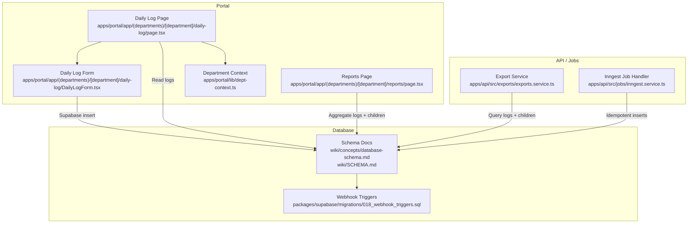
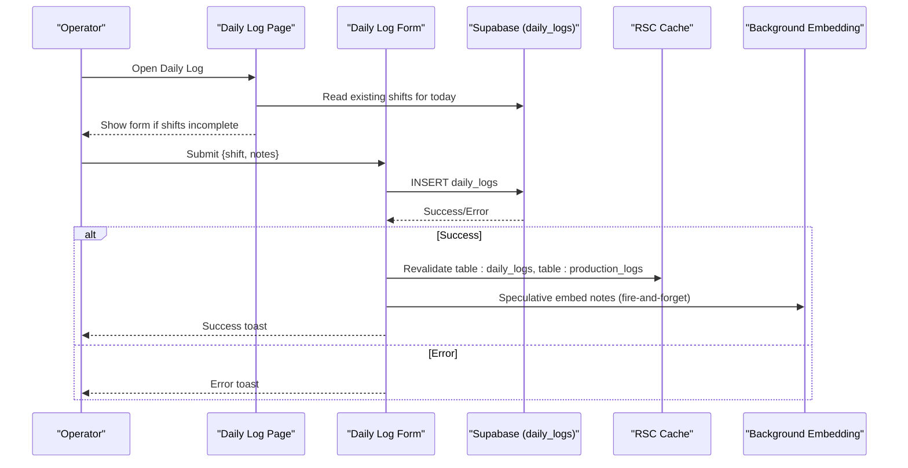
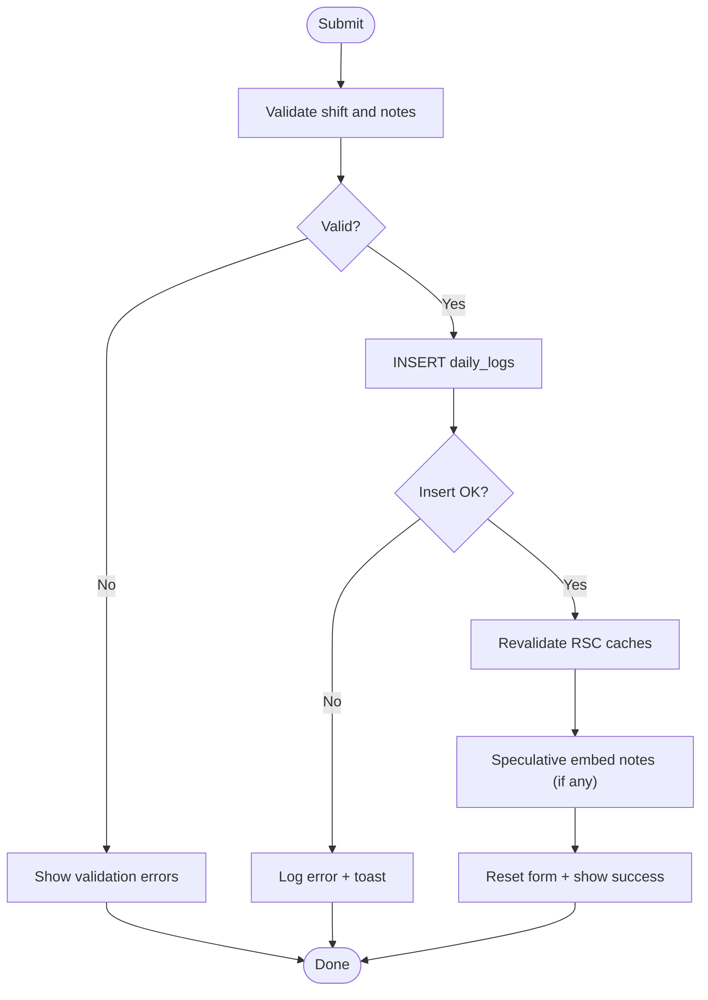
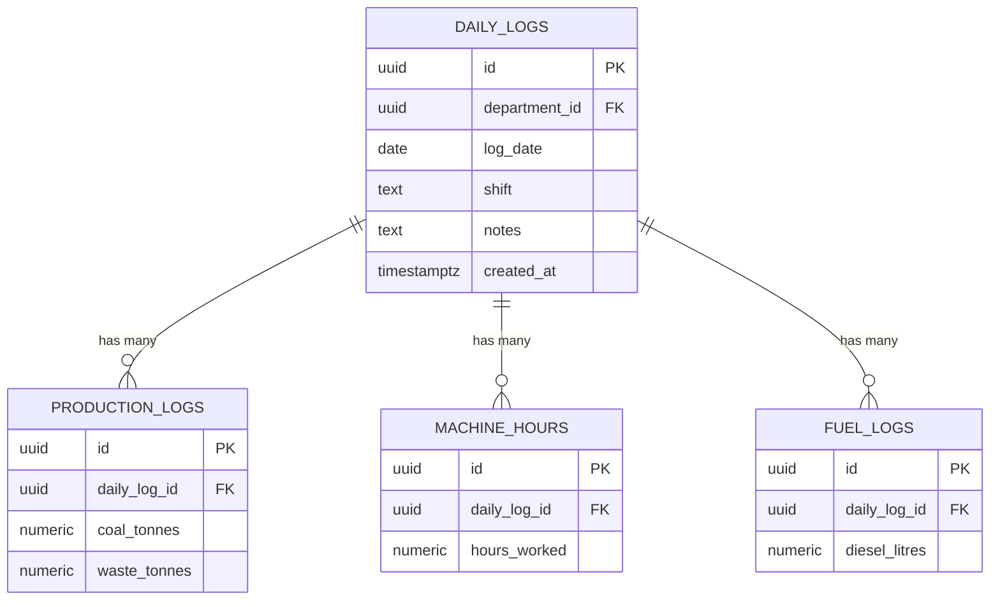
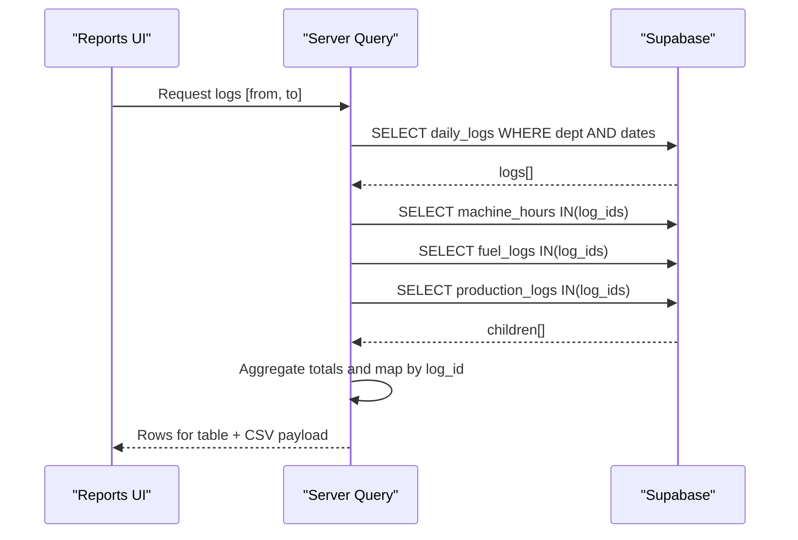
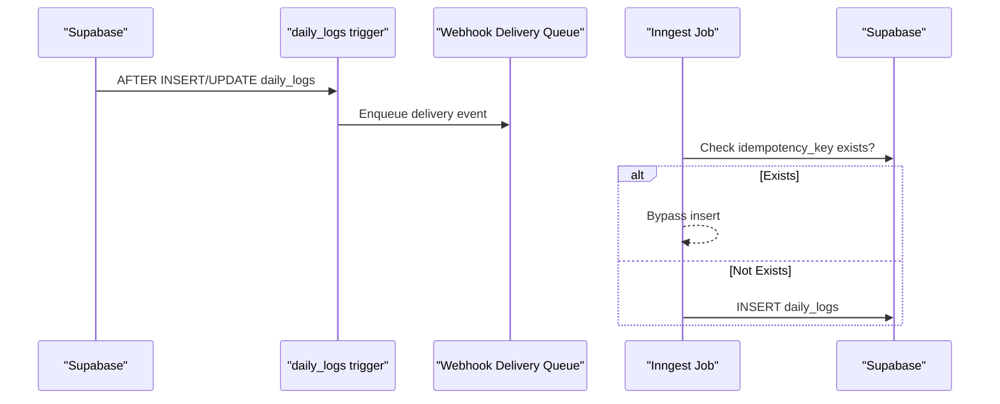
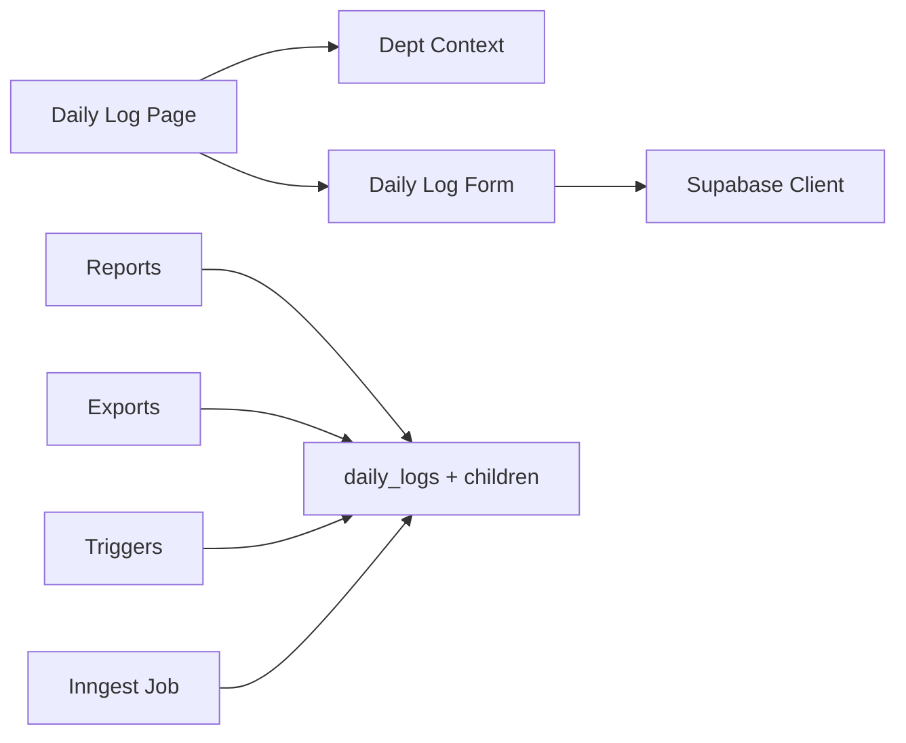

# Production Tracking & Daily Logging

<cite>
**Referenced Files in This Document**
- [DailyLogForm.tsx](file://apps/portal/app/(departments)/[department]/daily-log/DailyLogForm.tsx)
- [page.tsx (Daily Log)](file://apps/portal/app/(departments)/[department]/daily-log/page.tsx)
- [dept-context.ts](file://apps/portal/lib/dept-context.ts)
- [database-schema.md](file://wiki/concepts/database-schema.md)
- [SCHEMA.md](file://wiki/SCHEMA.md)
- [production-department.md](file://wiki/entities/production-department.md)
- [page.tsx (Reports)](file://apps/portal/app/(departments)/[department]/reports/page.tsx)
- [exports.service.ts](file://apps/api/src/exports/exports.service.ts)
- [018_webhook_triggers.sql](file://packages/supabase/migrations/018_webhook_triggers.sql)
- [inngest.service.ts](file://apps/api/src/jobs/inngest.service.ts)
- [actions.ts (Hourly Loads)](file://apps/portal/app/(departments)/[department]/hourly-loads/actions.ts)
</cite>

## Table of Contents

1. [Introduction](#introduction)
2. [Project Structure](#project-structure)
3. [Core Components](#core-components)
4. [Architecture Overview](#architecture-overview)
5. [Detailed Component Analysis](#detailed-component-analysis)
6. [Dependency Analysis](#dependency-analysis)
7. [Performance Considerations](#performance-considerations)
8. [Troubleshooting Guide](#troubleshooting-guide)
9. [Conclusion](#conclusion)

## Introduction

This document explains the production tracking and daily logging system used to record shift-level production data, including tonnage, machine hours, fuel consumption, and notes. It covers:

- Daily log entry forms and validation rules
- Submission workflows and error handling
- Data models for shifts, output quantities, and quality metrics
- Real-time data entry patterns and batch processing capabilities
- Integration with shift management and employee context for automatic attribution

The system is built on a Next.js portal with Supabase-backed relational tables and server actions for secure writes.

## Project Structure

Key areas involved in production tracking and daily logging:

- Portal pages and client components for daily log entry and reporting
- Server-side context resolution for department and date
- Database schema definitions and constraints
- Export services and webhook triggers for downstream integrations
- Background job handlers for idempotent inserts

**Diagram sources**

- [page.tsx (Daily Log)](<file://apps/portal/app/(departments)/[department]/daily-log/page.tsx#L1-L148>)
- [DailyLogForm.tsx](<file://apps/portal/app/(departments)/[department]/daily-log/DailyLogForm.tsx#L1-L197>)
- [dept-context.ts:1-68](file://apps/portal/lib/dept-context.ts#L1-L68)
- [page.tsx (Reports)](<file://apps/portal/app/(departments)/[department]/reports/page.tsx#L470-L534>)
- [exports.service.ts:44-77](file://apps/api/src/exports/exports.service.ts#L44-L77)
- [018_webhook_triggers.sql:159-168](file://packages/supabase/migrations/018_webhook_triggers.sql#L159-L168)
- [inngest.service.ts:113-120](file://apps/api/src/jobs/inngest.service.ts#L113-L120)
- [database-schema.md:68-89](file://wiki/concepts/database-schema.md#L68-L89)
- [SCHEMA.md:228-259](file://wiki/SCHEMA.md#L228-L259)

**Section sources**

- [page.tsx (Daily Log)](<file://apps/portal/app/(departments)/[department]/daily-log/page.tsx#L1-L148>)
- [DailyLogForm.tsx](<file://apps/portal/app/(departments)/[department]/daily-log/DailyLogForm.tsx#L1-L197>)
- [dept-context.ts:1-68](file://apps/portal/lib/dept-context.ts#L1-L68)
- [database-schema.md:68-89](file://wiki/concepts/database-schema.md#L68-L89)
- [SCHEMA.md:228-259](file://wiki/SCHEMA.md#L228-L259)
- [production-department.md:38-48](file://wiki/entities/production-department.md#L38-L48)

## Core Components

- Daily Log Entry UI
  - Client form with Zod-based validation for shift selection and optional notes
  - Direct Supabase insert into daily_logs with optimistic revalidation and background embedding
- Department Context Resolution
  - Server utility that resolves department UUID, caches it, and provides operational today’s date
- Reporting Aggregation
  - Fetches daily_logs and aggregates child records (machine_hours, fuel_logs, production_logs) by log ID
- Export Service
  - Queries daily_logs with nested children for export purposes
- Webhook Triggers
  - Database triggers queue webhooks on daily_logs insert/update
- Background Job Idempotency
  - Inngest handler checks idempotency keys before inserting daily_logs or safety incidents

**Section sources**

- [DailyLogForm.tsx](<file://apps/portal/app/(departments)/[department]/daily-log/DailyLogForm.tsx#L15-L97>)
- [dept-context.ts:16-52](file://apps/portal/lib/dept-context.ts#L16-L52)
- [page.tsx (Reports)](<file://apps/portal/app/(departments)/[department]/reports/page.tsx#L470-L534>)
- [exports.service.ts:44-77](file://apps/api/src/exports/exports.service.ts#L44-L77)
- [018_webhook_triggers.sql:159-168](file://packages/supabase/migrations/018_webhook_triggers.sql#L159-L168)
- [inngest.service.ts:113-120](file://apps/api/src/jobs/inngest.service.ts#L113-L120)

## Architecture Overview

End-to-end flow for creating a daily log and aggregating production data:

**Diagram sources**

- [page.tsx (Daily Log)](<file://apps/portal/app/(departments)/[department]/daily-log/page.tsx#L85-L147>)
- [DailyLogForm.tsx](<file://apps/portal/app/(departments)/[department]/daily-log/DailyLogForm.tsx#L55-L97>)

## Detailed Component Analysis

### Daily Log Entry Form

- Validation Rules
  - Shift must be one of day or night
  - Notes are optional; empty strings normalized to null
- Submission Workflow
  - Inserts a new daily_logs row scoped to current department and operational today
  - On success:
    - Revalidates RSC cache for daily_logs and production_logs
    - Fire-and-forget speculative embedding for notes
  - On failure:
    - Logs error via centralized logger and shows user-facing toast
- UI Behavior
  - Disables submit while submitting
  - Shows success/error status messages
  - Resets form after successful submission

**Diagram sources**

- [DailyLogForm.tsx](<file://apps/portal/app/(departments)/[department]/daily-log/DailyLogForm.tsx#L15-L97>)

**Section sources**

- [DailyLogForm.tsx](<file://apps/portal/app/(departments)/[department]/daily-log/DailyLogForm.tsx#L15-L97>)

### Daily Log Page

- Preload Logic
  - Resolves department context (UUID and operational today)
  - Reads active machines and existing shifts for today
  - Determines whether both day and night shifts are already logged
- Conditional Rendering
  - If all shifts logged: displays completion banner and link to history
  - Otherwise: renders the DailyLogForm with available machines list

**Section sources**

- [page.tsx (Daily Log)](<file://apps/portal/app/(departments)/[department]/daily-log/page.tsx#L1-L148>)
- [dept-context.ts:16-52](file://apps/portal/lib/dept-context.ts#L16-L52)

### Data Models and Constraints

- daily_logs
  - Parent record per department per day/shift
  - Unique constraint on (department_id, log_date, shift)
  - Append-only policy enforced at database level
- production_logs
  - Child of daily_logs; tracks coal_tonnes and waste_tonnes
  - Referenced by reports and exports
- machine_hours, fuel_logs
  - Child tables linked to daily_logs; aggregated in reports and exports

**Diagram sources**

- [database-schema.md:68-89](file://wiki/concepts/database-schema.md#L68-L89)
- [SCHEMA.md:228-259](file://wiki/SCHEMA.md#L228-L259)

**Section sources**

- [database-schema.md:68-89](file://wiki/concepts/database-schema.md#L68-L89)
- [SCHEMA.md:228-259](file://wiki/SCHEMA.md#L228-L259)
- [production-department.md:38-48](file://wiki/entities/production-department.md#L38-L48)

### Reporting and Batch Processing

- Aggregation Strategy
  - Fetches daily_logs within a date range
  - Parallel fetch of machine_hours, fuel_logs, and production_logs filtered by log IDs
  - Aggregates totals and maps values per log for CSV export and table rendering
- Export Service
  - Uses nested selects to flatten child records for export
  - Supports pagination and department scoping

**Diagram sources**

- [page.tsx (Reports)](<file://apps/portal/app/(departments)/[department]/reports/page.tsx#L470-L534>)
- [exports.service.ts:44-77](file://apps/api/src/exports/exports.service.ts#L44-L77)

**Section sources**

- [page.tsx (Reports)](<file://apps/portal/app/(departments)/[department]/reports/page.tsx#L470-L534>)
- [exports.service.ts:44-77](file://apps/api/src/exports/exports.service.ts#L44-L77)

### Webhook Integration and Background Jobs

- Webhook Triggers
  - Database triggers enqueue webhook deliveries on daily_logs insert/update
- Idempotent Inserts via Inngest
  - Background jobs check idempotency_key before inserting daily_logs or safety incidents to prevent duplicates

**Diagram sources**

- [018_webhook_triggers.sql:159-168](file://packages/supabase/migrations/018_webhook_triggers.sql#L159-L168)
- [inngest.service.ts:113-120](file://apps/api/src/jobs/inngest.service.ts#L113-L120)

**Section sources**

- [018_webhook_triggers.sql:159-168](file://packages/supabase/migrations/018_webhook_triggers.sql#L159-L168)
- [inngest.service.ts:113-120](file://apps/api/src/jobs/inngest.service.ts#L113-L120)

### Employee Context and Automatic Attribution

- Current Implementation
  - The daily log form does not automatically set created_by; it relies on database policies and audit columns where applicable
- Related Authorization Pattern
  - Server actions validate the authenticated user and their role/department before performing updates (example pattern in hourly loads action)
- Recommendation
  - Extend the daily log submission to capture created_by from the authenticated employee context when writing daily_logs, ensuring consistent attribution across systems

**Section sources**

- [actions.ts (Hourly Loads)](<file://apps/portal/app/(departments)/[department]/hourly-loads/actions.ts#L10-L49>)

## Dependency Analysis

- Frontend dependencies
  - Daily Log Page depends on Department Context for department UUID and operational date
  - Daily Log Form depends on Supabase client and React Hook Form with Zod resolver
- Backend and data layer
  - Reports and Exports depend on daily_logs and its child tables
  - Webhook triggers depend on daily_logs mutations
  - Inngest job handler depends on idempotency checks before inserts

**Diagram sources**

- [page.tsx (Daily Log)](<file://apps/portal/app/(departments)/[department]/daily-log/page.tsx#L1-L148>)
- [DailyLogForm.tsx](<file://apps/portal/app/(departments)/[department]/daily-log/DailyLogForm.tsx#L1-L197>)
- [dept-context.ts:1-68](file://apps/portal/lib/dept-context.ts#L1-L68)
- [page.tsx (Reports)](<file://apps/portal/app/(departments)/[department]/reports/page.tsx#L470-L534>)
- [exports.service.ts:44-77](file://apps/api/src/exports/exports.service.ts#L44-L77)
- [018_webhook_triggers.sql:159-168](file://packages/supabase/migrations/018_webhook_triggers.sql#L159-L168)
- [inngest.service.ts:113-120](file://apps/api/src/jobs/inngest.service.ts#L113-L120)

**Section sources**

- [page.tsx (Daily Log)](<file://apps/portal/app/(departments)/[department]/daily-log/page.tsx#L1-L148>)
- [DailyLogForm.tsx](<file://apps/portal/app/(departments)/[department]/daily-log/DailyLogForm.tsx#L1-L197>)
- [dept-context.ts:1-68](file://apps/portal/lib/dept-context.ts#L1-L68)
- [page.tsx (Reports)](<file://apps/portal/app/(departments)/[department]/reports/page.tsx#L470-L534>)
- [exports.service.ts:44-77](file://apps/api/src/exports/exports.service.ts#L44-L77)
- [018_webhook_triggers.sql:159-168](file://packages/supabase/migrations/018_webhook_triggers.sql#L159-L168)
- [inngest.service.ts:113-120](file://apps/api/src/jobs/inngest.service.ts#L113-L120)

## Performance Considerations

- Parallelization
  - Reports page uses parallel queries for child tables to reduce latency
- Caching
  - Department UUID lookup cached in Redis for 1 hour
  - RSC cache revalidated after daily log submission to reflect changes immediately
- Efficient Aggregation
  - Aggregations performed client-side using Maps keyed by daily_log_id to avoid repeated joins

[No sources needed since this section provides general guidance]

## Troubleshooting Guide

- Form Submission Errors
  - Inspect toast messages and browser console; errors are logged via centralized logger
  - Verify network requests to daily_logs insert endpoint
- Duplicate Records
  - Ensure idempotency keys are used when inserting via background jobs
- Missing Attribution
  - If created_by is required, ensure server action captures authenticated employee context before write

**Section sources**

- [DailyLogForm.tsx](<file://apps/portal/app/(departments)/[department]/daily-log/DailyLogForm.tsx#L68-L97>)
- [inngest.service.ts:113-120](file://apps/api/src/jobs/inngest.service.ts#L113-L120)
- [actions.ts (Hourly Loads)](<file://apps/portal/app/(departments)/[department]/hourly-loads/actions.ts#L10-L49>)

## Conclusion

The production tracking and daily logging system provides a robust foundation for recording shift-level production data, with clear validation, efficient aggregation, and integration points for webhooks and background jobs. To fully support automatic attribution, extend the daily log submission to capture the authenticated employee context consistently.
