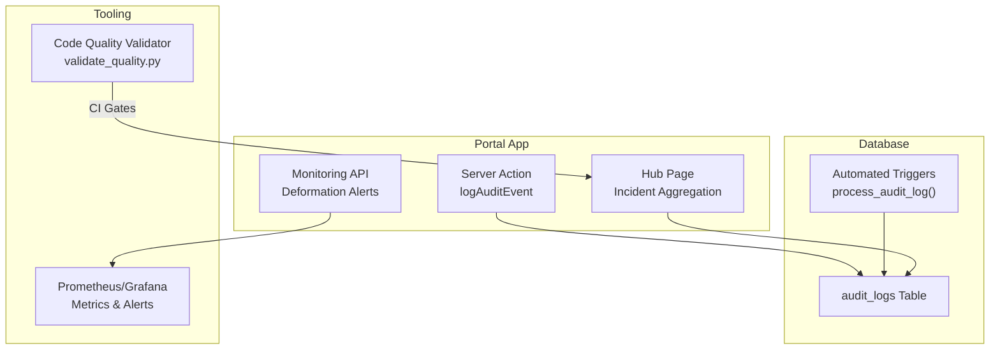
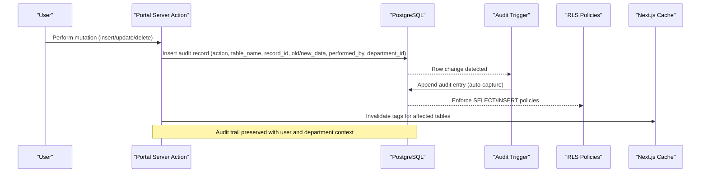
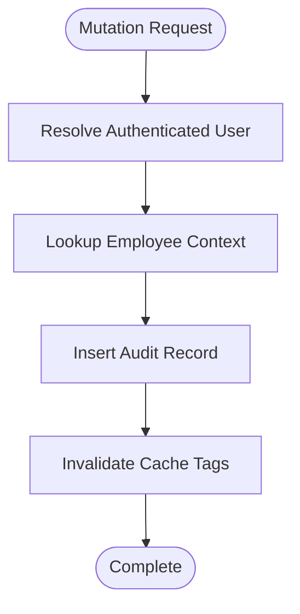
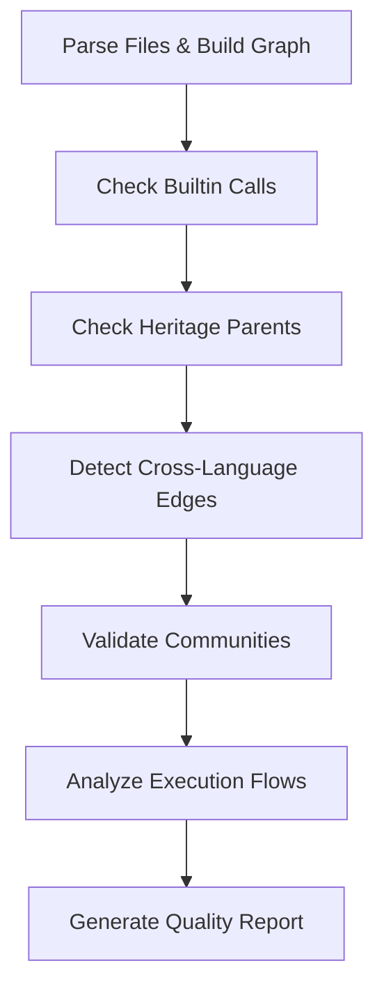
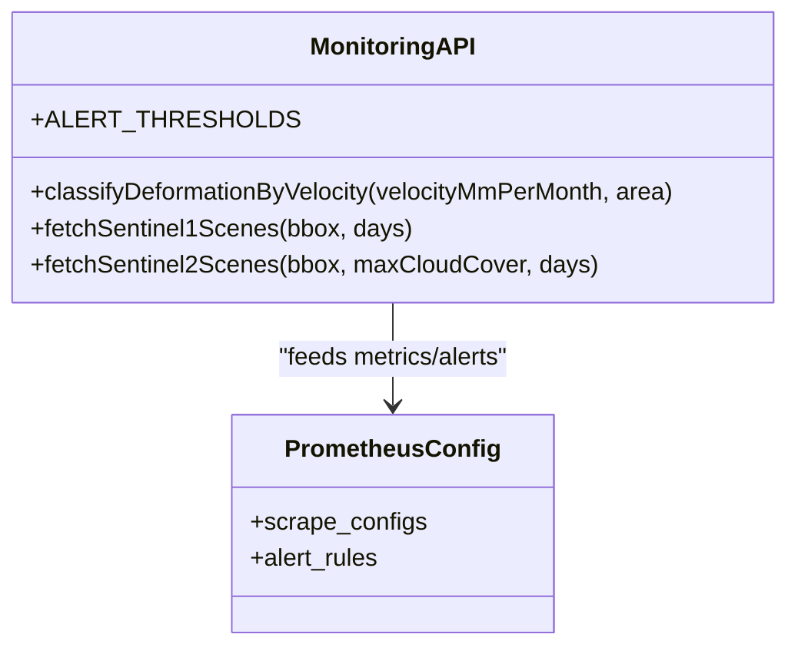
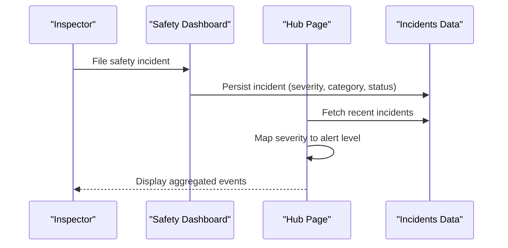
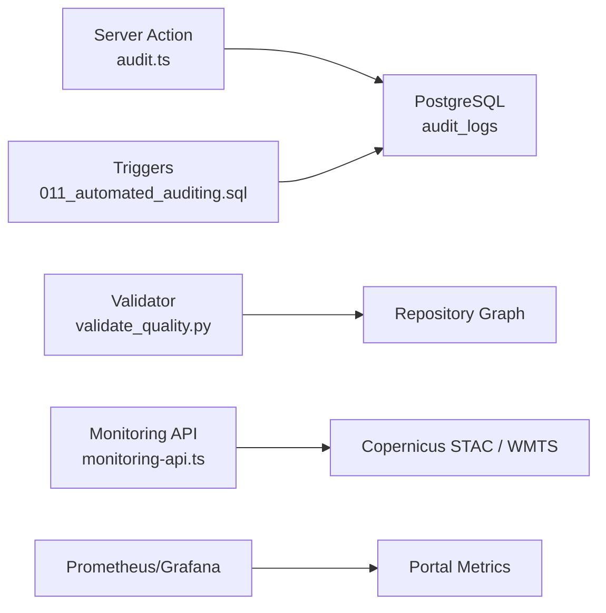

# Quality Control & Compliance

<cite>
**Referenced Files in This Document**
- [audit.ts](file://apps/portal/lib/audit.ts)
- [007_audit_logs.sql](file://packages/database/migrations/007_audit_logs.sql)
- [011_automated_auditing.sql](file://packages/database/migrations/011_automated_auditing.sql)
- [monitoring-api.ts](file://apps/portal/lib/monitoring-api.ts)
- [monitoring-error-tracking.md](file://wiki/concepts/monitoring-error-tracking.md)
- [code-quality.md](file://wiki/breakdown/code-quality.md)
- [validate_quality.py](file://tools/repowise/scripts/validate_quality.py)
- [safety-department.md](file://wiki/entities/safety-department.md)
- [department-features.md](file://wiki/concepts/department-features.md)
- [page.tsx](file://apps/portal/app/(hub)/page.tsx)
</cite>

## Table of Contents

1. [Introduction](#introduction)
2. [Project Structure](#project-structure)
3. [Core Components](#core-components)
4. [Architecture Overview](#architecture-overview)
5. [Detailed Component Analysis](#detailed-component-analysis)
6. [Dependency Analysis](#dependency-analysis)
7. [Performance Considerations](#performance-considerations)
8. [Troubleshooting Guide](#troubleshooting-guide)
9. [Conclusion](#conclusion)

## Introduction

This document describes the quality control and compliance monitoring system implemented across the portal and supporting tooling. It covers:

- Quality inspection workflows and automated checks
- Defect tracking and safety incident reporting integration
- Compliance validation processes and thresholds
- Audit trail for changes, approvals, and corrective actions
- Metrics collection, threshold monitoring, and alerting for quality deviations

The system combines application-level audit logging, database triggers, code quality gates, and operational monitoring to ensure consistent quality and compliance posture.

## Project Structure

Quality and compliance capabilities are distributed across several layers:

- Application-level audit logging and server-side actions
- Database schema and automated auditing via triggers
- Code quality metrics and CI-integrated validators
- Operational monitoring (Sentry, Prometheus/Grafana) and satellite deformation alerts
- Safety department features and incident workflow

**Diagram sources**

- [audit.ts:1-57](file://apps/portal/lib/audit.ts#L1-L57)
- [007_audit_logs.sql:1-46](file://packages/database/migrations/007_audit_logs.sql#L1-L46)
- [011_automated_auditing.sql:1-116](file://packages/database/migrations/011_automated_auditing.sql#L1-L116)
- [monitoring-api.ts:86-106](file://apps/portal/lib/monitoring-api.ts#L86-L106)
- [monitoring-error-tracking.md:176-243](file://wiki/concepts/monitoring-error-tracking.md#L176-L243)
- [validate_quality.py:1-196](file://tools/repowise/scripts/validate_quality.py#L1-L196)
- [page.tsx](<file://apps/portal/app/(hub)/page.tsx#L215-L252>)

**Section sources**

- [audit.ts:1-57](file://apps/portal/lib/audit.ts#L1-L57)
- [007_audit_logs.sql:1-46](file://packages/database/migrations/007_audit_logs.sql#L1-L46)
- [011_automated_auditing.sql:1-116](file://packages/database/migrations/011_automated_auditing.sql#L1-L116)
- [monitoring-api.ts:86-106](file://apps/portal/lib/monitoring-api.ts#L86-L106)
- [monitoring-error-tracking.md:176-243](file://wiki/concepts/monitoring-error-tracking.md#L176-L243)
- [validate_quality.py:1-196](file://tools/repowise/scripts/validate_quality.py#L1-L196)
- [page.tsx](<file://apps/portal/app/(hub)/page.tsx#L215-L252>)

## Core Components

- Audit Trail System
  - Server action logs mutations with user context and department scoping.
  - Database triggers automatically capture inserts, updates, and deletes on core tables.
  - Row-level security policies restrict access by role and department.
- Quality Inspection and Validation
  - Automated validator checks call resolution, heritage filtering, community detection, and execution flows.
  - Code quality dashboard tracks linting, type safety, error handling, dead code, console hygiene, bundle size, and TODO debt.
- Compliance Monitoring and Alerts
  - Satellite monitoring API classifies deformation levels using geotechnical thresholds and integrates with operational dashboards.
  - Prometheus/Grafana configured for key metrics and alert rules.
- Safety Incident Integration
  - Safety department features include incident history, severity distribution, and status workflow.
  - Hub page aggregates incidents into a unified event stream with severity mapping.

**Section sources**

- [audit.ts:1-57](file://apps/portal/lib/audit.ts#L1-L57)
- [007_audit_logs.sql:1-46](file://packages/database/migrations/007_audit_logs.sql#L1-L46)
- [011_automated_auditing.sql:1-116](file://packages/database/migrations/011_automated_auditing.sql#L1-L116)
- [monitoring-api.ts:86-106](file://apps/portal/lib/monitoring-api.ts#L86-L106)
- [monitoring-error-tracking.md:176-243](file://wiki/concepts/monitoring-error-tracking.md#L176-L243)
- [validate_quality.py:1-196](file://tools/repowise/scripts/validate_quality.py#L1-L196)
- [code-quality.md:1-159](file://wiki/breakdown/code-quality.md#L1-L159)
- [department-features.md:83-104](file://wiki/concepts/department-features.md#L83-L104)
- [page.tsx](<file://apps/portal/app/(hub)/page.tsx#L215-L252>)

## Architecture Overview

The quality and compliance architecture spans application, database, tooling, and observability layers.

**Diagram sources**

- [audit.ts:19-56](file://apps/portal/lib/audit.ts#L19-L56)
- [007_audit_logs.sql:23-46](file://packages/database/migrations/007_audit_logs.sql#L23-L46)
- [011_automated_auditing.sql:6-60](file://packages/database/migrations/011_automated_auditing.sql#L6-L60)

## Detailed Component Analysis

### Audit Trail System

- Server Action Logging
  - Resolves authenticated user and employee context.
  - Inserts structured audit records including action, table name, record ID, old/new data, performer, and department.
  - Invalidates Next.js cache tags for affected tables to keep UI consistent.
- Database-Level Automation
  - Generic trigger function captures INSERT/UPDATE/DELETE events, serializes old/new state, resolves performer, and persists audit entries.
  - Triggers applied to core tables (departments, employees, machines, operators, sites, daily_logs, excavator_activity, dozer_rolls).
- Access Control
  - Row-level security ensures admins see all; department users see only their department or accessible departments.
  - Insert policy allows authenticated users (server actions log on behalf of user).

**Diagram sources**

- [audit.ts:19-56](file://apps/portal/lib/audit.ts#L19-L56)

**Section sources**

- [audit.ts:1-57](file://apps/portal/lib/audit.ts#L1-L57)
- [007_audit_logs.sql:1-46](file://packages/database/migrations/007_audit_logs.sql#L1-L46)
- [011_automated_auditing.sql:1-116](file://packages/database/migrations/011_automated_auditing.sql#L1-L116)

### Quality Inspection Workflows

- Automated Validator
  - Parses files, builds graph, and runs checks:
    - Builtin call filtering
    - Heritage builtin filtering
    - Cross-language call edges detection
    - Community detection quality (labels, test vs prod balance)
    - Execution flows analysis (entry points, depth, cross-community crossings)
- Code Quality Dashboard
  - Tracks linting, type safety, error handling, dead code, console hygiene, bundle size, and TODO debt.
  - Provides industry comparisons and actionable remediation steps.

**Diagram sources**

- [validate_quality.py:25-196](file://tools/repowise/scripts/validate_quality.py#L25-L196)

**Section sources**

- [validate_quality.py:1-196](file://tools/repowise/scripts/validate_quality.py#L1-L196)
- [code-quality.md:1-159](file://wiki/breakdown/code-quality.md#L1-L159)

### Compliance Validation Processes

- Satellite Deformation Thresholds
  - Velocity-based classification per area type (pit-wall, tailings-dam, haul-road, processing-plant).
  - Thresholds aligned with geotechnical standards.
- Operational Monitoring
  - Prometheus scrapes portal metrics and exposes health endpoints.
  - Grafana dashboards visualize performance and reliability.
  - Alert rules define critical/warning/info thresholds for error rates, latency, AI provider failovers, slow queries, and cache misses.

**Diagram sources**

- [monitoring-api.ts:86-106](file://apps/portal/lib/monitoring-api.ts#L86-L106)
- [monitoring-error-tracking.md:176-243](file://wiki/concepts/monitoring-error-tracking.md#L176-L243)

**Section sources**

- [monitoring-api.ts:86-106](file://apps/portal/lib/monitoring-api.ts#L86-L106)
- [monitoring-error-tracking.md:176-243](file://wiki/concepts/monitoring-error-tracking.md#L176-L243)

### Safety Incident Reporting Integration

- Safety Department Features
  - Incident history with investigation status and severity distribution.
  - Workflow statuses: open, under-investigation, resolved, closed.
- Hub Aggregation
  - Maps incident severity levels to standardized alert severities and aggregates into a unified event stream.

**Diagram sources**

- [department-features.md:83-104](file://wiki/concepts/department-features.md#L83-L104)
- [page.tsx](<file://apps/portal/app/(hub)/page.tsx#L215-L252>)

**Section sources**

- [department-features.md:83-104](file://wiki/concepts/department-features.md#L83-L104)
- [page.tsx](<file://apps/portal/app/(hub)/page.tsx#L215-L252>)
- [safety-department.md:66-76](file://wiki/entities/safety-department.md#L66-L76)

## Dependency Analysis

- Application-to-Database Dependencies
  - Server action depends on Supabase client and cache invalidation utilities.
  - Database triggers depend on row-level security policies and employee/auth mappings.
- Tooling-to-Repository Dependencies
  - Validator depends on AST parsing, file traversal, and graph building components.
- Observability Dependencies
  - Monitoring API depends on external STAC/WMTS services and caches responses.
  - Prometheus scrapes portal metrics and applies alert rules.

**Diagram sources**

- [audit.ts:1-57](file://apps/portal/lib/audit.ts#L1-L57)
- [011_automated_auditing.sql:1-116](file://packages/database/migrations/011_automated_auditing.sql#L1-L116)
- [validate_quality.py:1-196](file://tools/repowise/scripts/validate_quality.py#L1-L196)
- [monitoring-api.ts:176-226](file://apps/portal/lib/monitoring-api.ts#L176-L226)
- [monitoring-error-tracking.md:176-243](file://wiki/concepts/monitoring-error-tracking.md#L176-L243)

**Section sources**

- [audit.ts:1-57](file://apps/portal/lib/audit.ts#L1-L57)
- [011_automated_auditing.sql:1-116](file://packages/database/migrations/011_automated_auditing.sql#L1-L116)
- [validate_quality.py:1-196](file://tools/repowise/scripts/validate_quality.py#L1-L196)
- [monitoring-api.ts:176-226](file://apps/portal/lib/monitoring-api.ts#L176-L226)
- [monitoring-error-tracking.md:176-243](file://wiki/concepts/monitoring-error-tracking.md#L176-L243)

## Performance Considerations

- Audit Logging Overhead
  - JSONB storage for old/new data can grow quickly; consider pruning or archiving strategies.
  - Indexes on table_name, record_id, performed_by, department_id, and created_at support efficient queries.
- Cache Invalidation
  - Tag-based invalidation reduces stale UI but may increase cache churn; scope invalidations precisely.
- Monitoring Scraping
  - Prometheus scrape intervals should align with portal metrics volume; tune retention and query complexity.
- Satellite Data Fetching
  - External STAC/WMTS calls are cached via Next.js revalidation; adjust TTL based on data freshness needs.

[No sources needed since this section provides general guidance]

## Troubleshooting Guide

- Audit Logs Not Appearing
  - Verify server action authentication and employee lookup succeed.
  - Ensure database triggers are enabled and policies allow insert/select.
- RLS Policy Denials
  - Confirm user’s role and department membership; check accessible_departments array.
- Validator Failures
  - Review builtin call leaks, heritage parents, cross-language edges, and community labels.
  - Inspect execution flow entry points for demo/test contamination.
- Monitoring Alerts
  - Validate Prometheus scrape targets and metric paths.
  - Adjust alert thresholds if false positives occur.

**Section sources**

- [audit.ts:19-56](file://apps/portal/lib/audit.ts#L19-L56)
- [007_audit_logs.sql:23-46](file://packages/database/migrations/007_audit_logs.sql#L23-L46)
- [011_automated_auditing.sql:6-60](file://packages/database/migrations/011_automated_auditing.sql#L6-L60)
- [validate_quality.py:45-196](file://tools/repowise/scripts/validate_quality.py#L45-L196)
- [monitoring-error-tracking.md:176-243](file://wiki/concepts/monitoring-error-tracking.md#L176-L243)

## Conclusion

The quality control and compliance monitoring system integrates application-level audits, database-triggered automation, code quality validation, and operational monitoring to provide comprehensive oversight. Safety incident reporting is seamlessly integrated into the hub experience, while deformation thresholds and Prometheus/Grafana alerting ensure proactive compliance and risk management. Continuous improvement is supported by detailed code quality metrics and actionable remediation plans.
