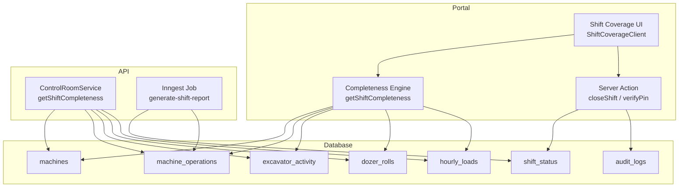
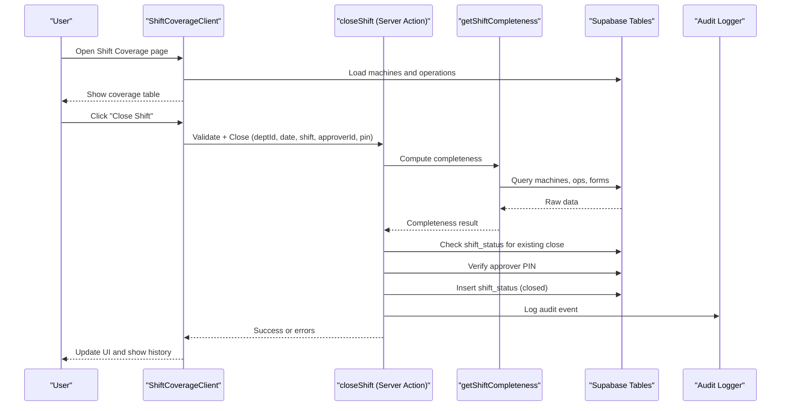
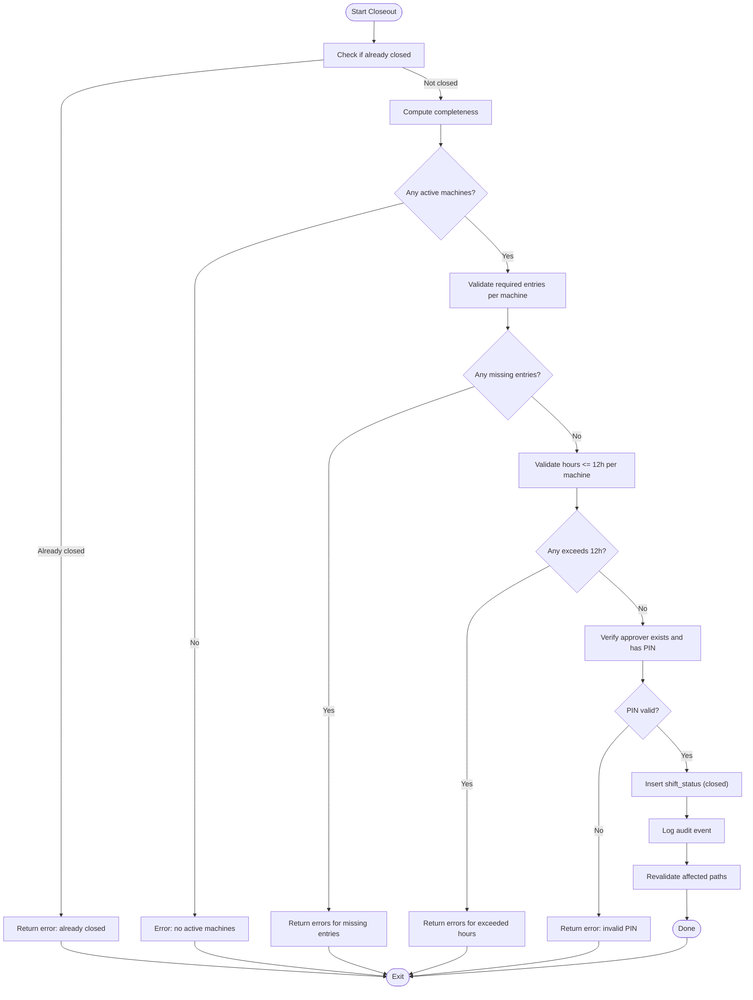
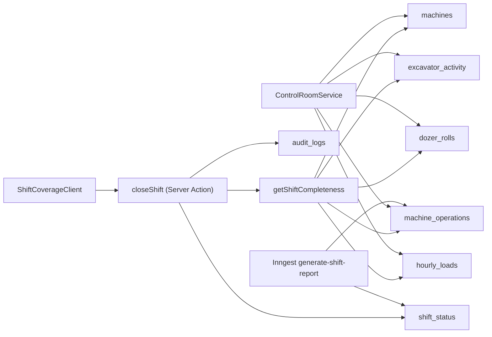

# Shift Management & Handover

<cite>
**Referenced Files in This Document**
- [shift-closeout.ts](file://apps/portal/lib/shift-closeout.ts)
- [shift-completeness.ts](file://apps/portal/lib/shift-completeness.ts)
- [ShiftCoverageClient.tsx](file://apps/portal/app/(departments)/[department]/shift-coverage/ShiftCoverageClient.tsx)
- [page.tsx (shift-coverage)](file://apps/portal/app/(departments)/[department]/shift-coverage/page.tsx)
- [control-room.service.ts](file://apps/api/src/control-room/control-room.service.ts)
- [inngest.service.ts](file://apps/api/src/jobs/inngest.service.ts)
- [003_control_room_revisions.sql](file://packages/supabase/migrations/003_control_room_revisions.sql)
- [audit.ts](file://apps/portal/lib/audit.ts)
</cite>

## Table of Contents

1. Introduction
2. Project Structure
3. Core Components
4. Architecture Overview
5. Detailed Component Analysis
6. Dependency Analysis
7. Performance Considerations
8. Troubleshooting Guide
9. Conclusion

## Introduction

This document explains the shift management and handover system, covering the full lifecycle from shift start to closeout. It details:

- Shift completion validation and closeout workflow
- The shift calculation engine that processes production data and generates summaries
- The closeout modal experience with summary reports, pending tasks, and handover notes
- Integration with access control for shift-based permissions and audit trails

The system is implemented across a Next.js portal (server actions and client UI), an API service for completeness checks, and database policies for row-level security.

## Project Structure

Key areas involved in shift management:

- Portal server action for closeout and PIN handling
- Client UI for coverage view and closeout modal
- Server-side completeness computation (portal and API)
- Background job for report generation
- Database policies for department-scoped access



**Diagram sources**

- [shift-closeout.ts:1-245](file://apps/portal/lib/shift-closeout.ts#L1-L245)
- [shift-completeness.ts:1-324](file://apps/portal/lib/shift-completeness.ts#L1-L324)
- [ShiftCoverageClient.tsx](<file://apps/portal/app/(departments)/[department]/shift-coverage/ShiftCoverageClient.tsx#L1-L424>)
- [control-room.service.ts:40-88](file://apps/api/src/control-room/control-room.service.ts#L40-L88)
- [inngest.service.ts:205-244](file://apps/api/src/jobs/inngest.service.ts#L205-L244)
- [003_control_room_revisions.sql:181-231](file://packages/supabase/migrations/003_control_room_revisions.sql#L181-L231)

**Section sources**

- [shift-closeout.ts:1-245](file://apps/portal/lib/shift-closeout.ts#L1-L245)
- [shift-completeness.ts:1-324](file://apps/portal/lib/shift-completeness.ts#L1-L324)
- [ShiftCoverageClient.tsx](<file://apps/portal/app/(departments)/[department]/shift-coverage/ShiftCoverageClient.tsx#L1-L424>)
- [page.tsx (shift-coverage)](<file://apps/portal/app/(departments)/[department]/shift-coverage/page.tsx#L1-L28>)
- [control-room.service.ts:40-88](file://apps/api/src/control-room/control-room.service.ts#L40-L88)
- [inngest.service.ts:205-244](file://apps/api/src/jobs/inngest.service.ts#L205-L244)
- [003_control_room_revisions.sql:181-231](file://packages/supabase/migrations/003_control_room_revisions.sql#L181-L231)

## Core Components

- Closeout server action: validates shift data, verifies supervisor PIN, records closeout, and emits audit events.
- Completeness engine: aggregates machine registrations and form submissions to determine required vs covered entries per machine.
- Shift coverage UI: displays coverage status, allows date/shift navigation, and opens the closeout modal.
- API completeness service: mirrors portal logic with caching for performance.
- Report generation job: aggregates production logs into generated reports.
- Access control: Row-Level Security policies restrict access by department and role.

**Section sources**

- [shift-closeout.ts:1-245](file://apps/portal/lib/shift-closeout.ts#L1-L245)
- [shift-completeness.ts:1-324](file://apps/portal/lib/shift-completeness.ts#L1-L324)
- [ShiftCoverageClient.tsx](<file://apps/portal/app/(departments)/[department]/shift-coverage/ShiftCoverageClient.tsx#L1-L424>)
- [control-room.service.ts:40-88](file://apps/api/src/control-room/control-room.service.ts#L40-L88)
- [inngest.service.ts:205-244](file://apps/api/src/jobs/inngest.service.ts#L205-L244)
- [003_control_room_revisions.sql:181-231](file://packages/supabase/migrations/003_control_room_revisions.sql#L181-L231)

## Architecture Overview

End-to-end flow for closing a shift:

- User navigates to Shift Coverage page and selects date and shift.
- UI loads machines and their reported hours; shows “Reported/Partial/Missing” statuses.
- On “Close Shift,” the UI opens a modal that performs validation via the server action.
- If valid, the server action inserts a closed shift record and logs an audit event.
- The UI refreshes to reflect the closed state and updates history.



**Diagram sources**

- [ShiftCoverageClient.tsx](<file://apps/portal/app/(departments)/[department]/shift-coverage/ShiftCoverageClient.tsx#L1-L424>)
- [shift-closeout.ts:1-245](file://apps/portal/lib/shift-closeout.ts#L1-L245)
- [shift-completeness.ts:1-324](file://apps/portal/lib/shift-completeness.ts#L1-L324)

## Detailed Component Analysis

### Shift Lifecycle and Closeout Workflow

- Start: Operators submit required forms per machine type during the shift.
- Validation: Before closeout, the system ensures:
  - No prior close for the same department/date/shift
  - All non-exempt machines have required entries
  - Machine hours do not exceed 12h maximum
- Authorization: Approving supervisor must exist and have a PIN set; PIN is verified before allowing close.
- Recording: A closed shift record is inserted with timestamps and identifiers.
- Audit: An audit event is logged for traceability.
- UI update: Pages are revalidated and the UI reflects the closed state.



**Diagram sources**

- [shift-closeout.ts:18-69](file://apps/portal/lib/shift-closeout.ts#L18-L69)
- [shift-closeout.ts:149-245](file://apps/portal/lib/shift-closeout.ts#L149-L245)
- [shift-completeness.ts:271-323](file://apps/portal/lib/shift-completeness.ts#L271-L323)

**Section sources**

- [shift-closeout.ts:18-69](file://apps/portal/lib/shift-closeout.ts#L18-L69)
- [shift-closeout.ts:149-245](file://apps/portal/lib/shift-closeout.ts#L149-L245)
- [shift-completeness.ts:271-323](file://apps/portal/lib/shift-completeness.ts#L271-L323)

### Shift Calculation Engine

Responsibilities:

- Determine required form per machine type using keyword matching.
- Aggregate submitted forms for the selected department, date, and shift.
- Build per-machine coverage status including whether entry exists and hours worked.
- Summarize overall completeness (required vs covered).

Data sources:

- machines (active, department-scoped)
- machine_operations (hours_worked)
- excavator_activity (presence indicates required form)
- dozer_rolls (hours_operated)
- hourly_loads (total_loads > 0 indicates presence)

Caching:

- Results are cached with tags keyed by department and tables to ensure freshness after mutations.

```mermaid
classDiagram
class ShiftCompleteness {
+boolean complete
+number totalRequired
+number totalCovered
+MachineCoverageStatus[] statuses
}
class MachineCoverageStatus {
+string machineId
+string machineName
+string machineType
+RequiredForm requiredForm
+string formLabel
+string formPath
+boolean hasEntry
+boolean exempt
+number? hoursWorked
}
class RequiredForm {
<<enum>>
"machine-operations"
"excavator-activity"
"roll-over"
"hourly-loads"
}
ShiftCompleteness --> MachineCoverageStatus : "contains"
MachineCoverageStatus --> RequiredForm : "uses"
```

**Diagram sources**

- [shift-completeness.ts:7-30](file://apps/portal/lib/shift-completeness.ts#L7-L30)
- [shift-completeness.ts:40-60](file://apps/portal/lib/shift-completeness.ts#L40-L60)
- [shift-completeness.ts:271-323](file://apps/portal/lib/shift-completeness.ts#L271-L323)

**Section sources**

- [shift-completeness.ts:40-60](file://apps/portal/lib/shift-completeness.ts#L40-L60)
- [shift-completeness.ts:96-167](file://apps/portal/lib/shift-completeness.ts#L96-L167)
- [shift-completeness.ts:185-269](file://apps/portal/lib/shift-completeness.ts#L185-L269)
- [shift-completeness.ts:271-323](file://apps/portal/lib/shift-completeness.ts#L271-L323)

### Closeout Modal and Summary Reports

The Shift Coverage UI provides:

- Date and shift selection controls
- Machine coverage table with Reported/Partial/Missing indicators
- Close Shift button that opens the CloseShiftModal
- Close-out history table showing recent shifts and timestamps

On successful closeout:

- The UI reloads to reflect the closed state
- History is updated with the new close record

Notes on handover:

- The current implementation focuses on shift closure and audit logging.
- Dedicated handover notes storage is not present in the analyzed files; any handover documentation should be captured via existing operational forms or external systems.

**Section sources**

- [ShiftCoverageClient.tsx](<file://apps/portal/app/(departments)/[department]/shift-coverage/ShiftCoverageClient.tsx#L1-L424>)
- [page.tsx (shift-coverage)](<file://apps/portal/app/(departments)/[department]/shift-coverage/page.tsx#L1-L28>)

### Integration with Access Control and Audit Trails

Access control:

- Row-Level Security policies enforce department-scoped access based on employee roles and accessible departments.
- Policies apply to operational delays and related tables; similar patterns govern other department-specific entities.

Audit trails:

- Closeout inserts are accompanied by audit log events.
- Audit infrastructure includes triggers and dedicated logging for critical tables.

**Section sources**

- [003_control_room_revisions.sql:181-231](file://packages/supabase/migrations/003_control_room_revisions.sql#L181-L231)
- [shift-closeout.ts:231-236](file://apps/portal/lib/shift-closeout.ts#L231-L236)
- [audit.ts](file://apps/portal/lib/audit.ts)

## Dependency Analysis

Component relationships:

- ShiftCoverageClient depends on Supabase clients and the closeout server action.
- Closeout server action depends on completeness engine and audit logger.
- Completeness engine depends on multiple form tables and caches results.
- API completeness service mirrors portal logic with Redis-backed caching.
- Report generation job aggregates production logs and persists generated reports.



**Diagram sources**

- [ShiftCoverageClient.tsx](<file://apps/portal/app/(departments)/[department]/shift-coverage/ShiftCoverageClient.tsx#L1-L424>)
- [shift-closeout.ts:1-245](file://apps/portal/lib/shift-closeout.ts#L1-L245)
- [shift-completeness.ts:1-324](file://apps/portal/lib/shift-completeness.ts#L1-L324)
- [control-room.service.ts:40-88](file://apps/api/src/control-room/control-room.service.ts#L40-L88)
- [inngest.service.ts:205-244](file://apps/api/src/jobs/inngest.service.ts#L205-L244)

**Section sources**

- [ShiftCoverageClient.tsx](<file://apps/portal/app/(departments)/[department]/shift-coverage/ShiftCoverageClient.tsx#L1-L424>)
- [shift-closeout.ts:1-245](file://apps/portal/lib/shift-closeout.ts#L1-L245)
- [shift-completeness.ts:1-324](file://apps/portal/lib/shift-completeness.ts#L1-L324)
- [control-room.service.ts:40-88](file://apps/api/src/control-room/control-room.service.ts#L40-L88)
- [inngest.service.ts:205-244](file://apps/api/src/jobs/inngest.service.ts#L205-L244)

## Performance Considerations

- Caching: Both portal and API compute completeness with caching strategies to reduce repeated DB queries.
- Parallelization: Data fetching uses parallel queries for machines and form tables to minimize latency.
- Selectivity: Queries select only necessary columns to reduce payload size.
- Revalidation: After closeout, specific department pages are revalidated to keep UI consistent without full cache invalidation.

[No sources needed since this section provides general guidance]

## Troubleshooting Guide

Common issues and resolutions:

- Shift already closed: Ensure you are attempting to close the correct department/date/shift combination.
- Missing required entries: Complete all required forms for non-exempt machines before closing.
- Hours exceeding 12h: Review machine operation entries and adjust hours accordingly.
- Invalid supervisor PIN: Confirm the approving supervisor has a PIN configured and enter the correct value.
- Operator not found: Ensure the authenticated user has an associated employee record.

Operational tips:

- Use the Shift Coverage page to identify missing entries and partial reports.
- Check close-out history to confirm previous closures and timestamps.
- For access issues, verify department membership and role-based policies.

**Section sources**

- [shift-closeout.ts:18-69](file://apps/portal/lib/shift-closeout.ts#L18-L69)
- [shift-closeout.ts:149-245](file://apps/portal/lib/shift-closeout.ts#L149-L245)
- [ShiftCoverageClient.tsx](<file://apps/portal/app/(departments)/[department]/shift-coverage/ShiftCoverageClient.tsx#L1-L424>)

## Conclusion

The shift management and handover system provides a robust workflow for validating shift data, enforcing constraints, and securely recording closeouts with audit trails. The completeness engine ensures accurate reporting across multiple machine types and forms, while access control policies maintain department-scoped integrity. The UI offers clear visibility into coverage status and close-out history, supporting efficient shift transitions and accountability.

[No sources needed since this section summarizes without analyzing specific files]
