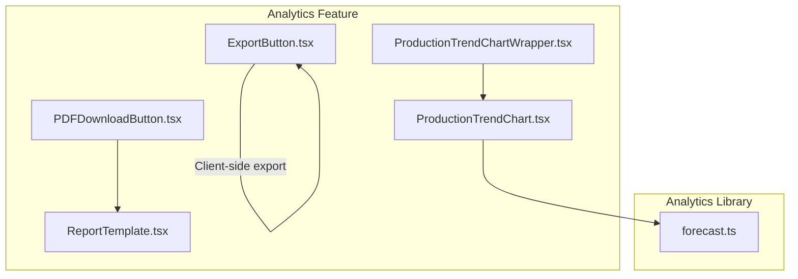
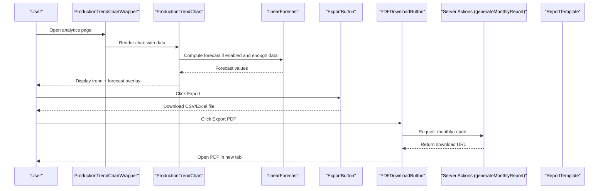
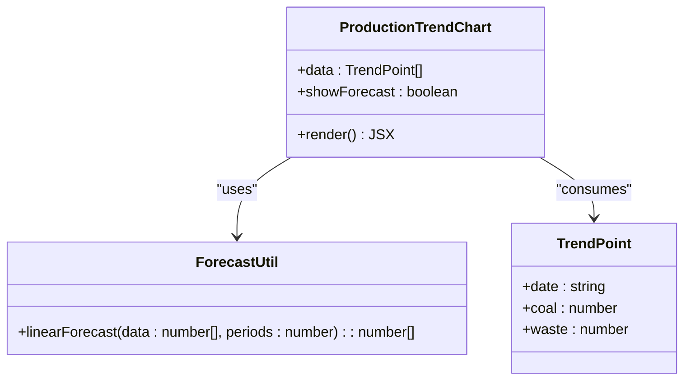
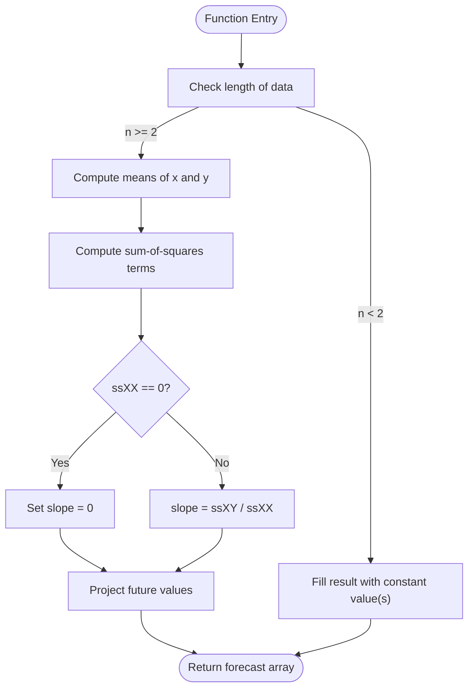
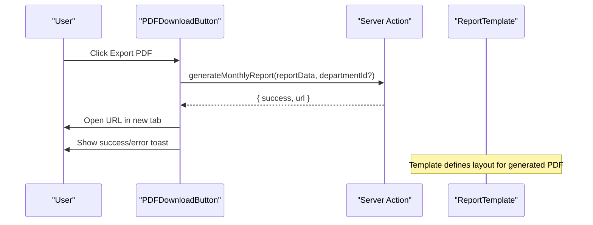
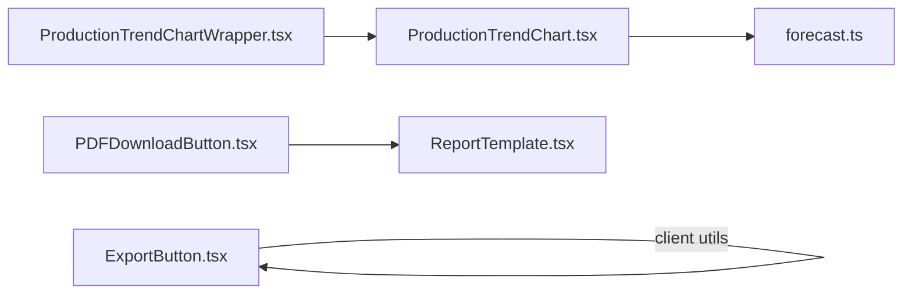

# Yield Analysis & Performance Metrics

<cite>
**Referenced Files in This Document**
- [ProductionTrendChart.tsx](file://apps/portal/features/analytics/components/ProductionTrendChart.tsx)
- [ProductionTrendChartWrapper.tsx](file://apps/portal/features/analytics/components/ProductionTrendChartWrapper.tsx)
- [forecast.ts](file://apps/portal/lib/analytics/forecast.ts)
- [ExportButton.tsx](file://apps/portal/features/analytics/components/ExportButton.tsx)
- [PDFDownloadButton.tsx](file://apps/portal/features/analytics/components/PDFDownloadButton.tsx)
- [ReportTemplate.tsx](file://apps/portal/features/analytics/components/ReportTemplate.tsx)
</cite>

## Table of Contents

1. [Introduction](#introduction)
2. [Project Structure](#project-structure)
3. [Core Components](#core-components)
4. [Architecture Overview](#architecture-overview)
5. [Detailed Component Analysis](#detailed-component-analysis)
6. [Dependency Analysis](#dependency-analysis)
7. [Performance Considerations](#performance-considerations)
8. [Troubleshooting Guide](#troubleshooting-guide)
9. [Conclusion](#conclusion)
10. [Appendices](#appendices)

## Introduction

This document explains the yield analysis and performance metrics system focused on production trend visualization, forecasting, KPI reporting, and export capabilities. It covers:

- Production trend charts with interactive area visualization
- Forecasting algorithms for efficiency projections
- Export functionality to CSV, Excel, and PDF
- Data aggregation patterns and time-based reporting structures
- Comparative analysis through multi-series charting and report layouts

The goal is to provide a clear understanding of how analytics data flows from inputs to visualizations and exports, including algorithmic details and UI interactions.

## Project Structure

The analytics feature resides under apps/portal/features/analytics/components and uses shared logic in apps/portal/lib/analytics. Key responsibilities:

- Visualization components render production trends and forecasts
- Forecasting utility computes linear projections
- Export utilities generate CSV/Excel files client-side
- PDF generation integrates server actions and templates

**Diagram sources**

- [ProductionTrendChartWrapper.tsx:1-17](file://apps/portal/features/analytics/components/ProductionTrendChartWrapper.tsx#L1-L17)
- [ProductionTrendChart.tsx:1-95](file://apps/portal/features/analytics/components/ProductionTrendChart.tsx#L1-L95)
- [forecast.ts:1-23](file://apps/portal/lib/analytics/forecast.ts#L1-L23)
- [ExportButton.tsx:1-91](file://apps/portal/features/analytics/components/ExportButton.tsx#L1-L91)
- [PDFDownloadButton.tsx:1-57](file://apps/portal/features/analytics/components/PDFDownloadButton.tsx#L1-L57)
- [ReportTemplate.tsx:1-189](file://apps/portal/features/analytics/components/ReportTemplate.tsx#L1-L189)

**Section sources**

- [ProductionTrendChartWrapper.tsx:1-17](file://apps/portal/features/analytics/components/ProductionTrendChartWrapper.tsx#L1-L17)
- [ProductionTrendChart.tsx:1-95](file://apps/portal/features/analytics/components/ProductionTrendChart.tsx#L1-L95)
- [forecast.ts:1-23](file://apps/portal/lib/analytics/forecast.ts#L1-L23)
- [ExportButton.tsx:1-91](file://apps/portal/features/analytics/components/ExportButton.tsx#L1-L91)
- [PDFDownloadButton.tsx:1-57](file://apps/portal/features/analytics/components/PDFDownloadButton.tsx#L1-L57)
- [ReportTemplate.tsx:1-189](file://apps/portal/features/analytics/components/ReportTemplate.tsx#L1-L189)

## Core Components

- Production Trend Chart: Renders historical coal and waste removal over time with optional forecast overlay. Supports toggling forecast visibility and handles empty datasets gracefully.
- Forecast Utility: Implements least-squares linear regression to project future values based on recent history.
- Export Button: Provides CSV and Excel export options directly from the browser using client-side libraries.
- PDF Download Button: Initiates server-side monthly report generation and opens the resulting URL.
- Report Template: Defines the structure and styling for PDF reports, including KPIs and tabular operational details.

Key behaviors:

- Time-based series are aggregated by date and rendered as area charts.
- Forecasting requires at least seven data points to enable projection.
- Exports support both lightweight CSV and richer Excel formats.
- PDF generation follows a structured template with header, KPI cards, and tables.

**Section sources**

- [ProductionTrendChart.tsx:1-95](file://apps/portal/features/analytics/components/ProductionTrendChart.tsx#L1-L95)
- [forecast.ts:1-23](file://apps/portal/lib/analytics/forecast.ts#L1-L23)
- [ExportButton.tsx:1-91](file://apps/portal/features/analytics/components/ExportButton.tsx#L1-L91)
- [PDFDownloadButton.tsx:1-57](file://apps/portal/features/analytics/components/PDFDownloadButton.tsx#L1-L57)
- [ReportTemplate.tsx:1-189](file://apps/portal/features/analytics/components/ReportTemplate.tsx#L1-L189)

## Architecture Overview

The analytics pipeline connects UI components to forecasting logic and export services. The flow includes:

- Client-side rendering of production trends
- Optional forecast computation using linear regression
- User-triggered exports to CSV/Excel or server-generated PDF

**Diagram sources**

- [ProductionTrendChartWrapper.tsx:1-17](file://apps/portal/features/analytics/components/ProductionTrendChartWrapper.tsx#L1-L17)
- [ProductionTrendChart.tsx:1-95](file://apps/portal/features/analytics/components/ProductionTrendChart.tsx#L1-L95)
- [forecast.ts:1-23](file://apps/portal/lib/analytics/forecast.ts#L1-L23)
- [ExportButton.tsx:1-91](file://apps/portal/features/analytics/components/ExportButton.tsx#L1-L91)
- [PDFDownloadButton.tsx:1-57](file://apps/portal/features/analytics/components/PDFDownloadButton.tsx#L1-L57)
- [ReportTemplate.tsx:1-189](file://apps/portal/features/analytics/components/ReportTemplate.tsx#L1-L189)

## Detailed Component Analysis

### Production Trend Chart

Responsibilities:

- Transform raw series into chart-ready data
- Compute optional forecast overlay
- Handle empty states and legend configuration

Data model:

- Input array contains objects with date and numeric fields for coal and waste
- Output series include historical values and optional forecast entries

Algorithm highlights:

- Forecast enabled when showForecast is true and at least seven data points exist
- Linear regression projects future values beyond the last recorded date
- Null handling ensures smooth curve connections across historical and forecast segments

Complexity:

- Forecast computation is O(n) where n is number of data points
- Chart data assembly is O(n)

Edge cases:

- Empty dataset returns a friendly message instead of an empty chart
- Forecast disabled omits forecast category and series

**Section sources**

- [ProductionTrendChart.tsx:1-95](file://apps/portal/features/analytics/components/ProductionTrendChart.tsx#L1-L95)

#### Class Diagram

**Diagram sources**

- [ProductionTrendChart.tsx:1-95](file://apps/portal/features/analytics/components/ProductionTrendChart.tsx#L1-L95)
- [forecast.ts:1-23](file://apps/portal/lib/analytics/forecast.ts#L1-L23)

### Forecast Algorithm

Purpose:

- Provide simple, interpretable projections for production trends

Inputs:

- Historical numeric series in chronological order
- Number of future periods to project

Outputs:

- Array of projected values for each future period

Methodology:

- Least-squares linear regression computes slope and intercept
- Projections extend beyond the last observed index
- Guard against insufficient data by returning constant values

Complexity:

- O(n) time and O(1) extra space

Usage constraints:

- Requires at least two data points for meaningful slope calculation
- In practice, chart enables forecast only when sufficient history exists

**Section sources**

- [forecast.ts:1-23](file://apps/portal/lib/analytics/forecast.ts#L1-L23)

#### Flowchart

**Diagram sources**

- [forecast.ts:1-23](file://apps/portal/lib/analytics/forecast.ts#L1-L23)

### Export Button (CSV/Excel)

Capabilities:

- Generate CSV content from rows of records
- Create downloadable Blob and trigger browser download
- Dynamically import Excel export utility and produce .xlsx files

Behavior:

- Menu toggle controlled by state and click-outside listener
- Disabled when no rows are available
- Uses client-side library for Excel export

Complexity:

- CSV conversion is O(n\*m) where n is rows and m is columns

Error handling:

- Graceful fallback when rows are empty
- Dynamic import errors surfaced via standard promise rejection

**Section sources**

- [ExportButton.tsx:1-91](file://apps/portal/features/analytics/components/ExportButton.tsx#L1-L91)

### PDF Download Button and Report Template

Workflow:

- User triggers PDF export
- Server action generates a monthly report and returns a URL
- Client opens the URL in a new tab and shows toast feedback

Report structure:

- Header with title and subtitle
- KPI cards grid
- Tabular operational details
- Footer with system branding and generation date

Integration:

- Uses React PDF renderer for layout and styling
- Accepts structured data payload for consistent formatting

**Section sources**

- [PDFDownloadButton.tsx:1-57](file://apps/portal/features/analytics/components/PDFDownloadButton.tsx#L1-L57)
- [ReportTemplate.tsx:1-189](file://apps/portal/features/analytics/components/ReportTemplate.tsx#L1-L189)

#### Sequence Diagram

**Diagram sources**

- [PDFDownloadButton.tsx:1-57](file://apps/portal/features/analytics/components/PDFDownloadButton.tsx#L1-L57)
- [ReportTemplate.tsx:1-189](file://apps/portal/features/analytics/components/ReportTemplate.tsx#L1-L189)

### Conceptual Overview

This section outlines general concepts not tied to specific files:

- Efficiency rate: ratio of productive output to total input over a period
- Waste percentage: proportion of non-productive material relative to total throughput
- Productivity metrics: units produced per labor hour or machine hour
- Comparative analysis: side-by-side views across departments, shifts, or time windows

[No sources needed since this section doesn't analyze specific source files]

## Dependency Analysis

Component relationships:

- Wrapper dynamically loads the chart component to avoid SSR issues
- Chart depends on forecasting utility for optional projections
- Export button relies on client-side utilities for CSV and Excel
- PDF button depends on server actions and report template for document generation

**Diagram sources**

- [ProductionTrendChartWrapper.tsx:1-17](file://apps/portal/features/analytics/components/ProductionTrendChartWrapper.tsx#L1-L17)
- [ProductionTrendChart.tsx:1-95](file://apps/portal/features/analytics/components/ProductionTrendChart.tsx#L1-L95)
- [forecast.ts:1-23](file://apps/portal/lib/analytics/forecast.ts#L1-L23)
- [ExportButton.tsx:1-91](file://apps/portal/features/analytics/components/ExportButton.tsx#L1-L91)
- [PDFDownloadButton.tsx:1-57](file://apps/portal/features/analytics/components/PDFDownloadButton.tsx#L1-L57)
- [ReportTemplate.tsx:1-189](file://apps/portal/features/analytics/components/ReportTemplate.tsx#L1-L189)

**Section sources**

- [ProductionTrendChartWrapper.tsx:1-17](file://apps/portal/features/analytics/components/ProductionTrendChartWrapper.tsx#L1-L17)
- [ProductionTrendChart.tsx:1-95](file://apps/portal/features/analytics/components/ProductionTrendChart.tsx#L1-L95)
- [forecast.ts:1-23](file://apps/portal/lib/analytics/forecast.ts#L1-L23)
- [ExportButton.tsx:1-91](file://apps/portal/features/analytics/components/ExportButton.tsx#L1-L91)
- [PDFDownloadButton.tsx:1-57](file://apps/portal/features/analytics/components/PDFDownloadButton.tsx#L1-L57)
- [ReportTemplate.tsx:1-189](file://apps/portal/features/analytics/components/ReportTemplate.tsx#L1-L189)

## Performance Considerations

- Rendering large datasets: Consider aggregating daily or weekly totals before charting to reduce DOM nodes and improve interactivity.
- Forecast computation: Linear regression is efficient; however, ensure data arrays remain bounded to avoid unnecessary recalculations.
- Export size: For large row sets, prefer streaming or server-side export to minimize memory usage on the client.
- PDF generation: Batch KPIs and table rows efficiently; paginate long tables to keep PDFs concise.

[No sources needed since this section provides general guidance]

## Troubleshooting Guide

Common issues and resolutions:

- Forecast not displayed: Ensure at least seven historical data points and that forecast toggle is enabled.
- Empty chart message: Indicates no data within the expected time window; verify upstream data ingestion.
- Export disabled: Confirm that rows array is populated before enabling export controls.
- PDF generation failure: Check server action response and network connectivity; review toast messages for error details.

**Section sources**

- [ProductionTrendChart.tsx:1-95](file://apps/portal/features/analytics/components/ProductionTrendChart.tsx#L1-L95)
- [ExportButton.tsx:1-91](file://apps/portal/features/analytics/components/ExportButton.tsx#L1-L91)
- [PDFDownloadButton.tsx:1-57](file://apps/portal/features/analytics/components/PDFDownloadButton.tsx#L1-L57)

## Conclusion

The analytics system delivers actionable insights through intuitive trend visualization, reliable forecasting, and flexible export options. Its modular design separates concerns between visualization, computation, and reporting, enabling maintainability and extensibility. By adhering to the outlined best practices and troubleshooting steps, teams can confidently monitor yield performance and drive continuous improvement.

[No sources needed since this section summarizes without analyzing specific files]

## Appendices

### Data Aggregation Patterns

- Time-based grouping: Aggregate raw events by day or shift to compute daily coal and waste totals.
- Series alignment: Ensure all series share the same date axis and handle missing dates with nulls.
- Forecast horizon: Limit projections to reasonable horizons to maintain accuracy.

[No sources needed since this section doesn't analyze specific source files]

### KPI Definitions

- Efficiency Rate: Ratio of productive output to total input over a defined period.
- Waste Percentage: Non-productive material divided by total throughput.
- Productivity: Units produced per unit of resource (e.g., per labor hour).

[No sources needed since this section doesn't analyze specific source files]
