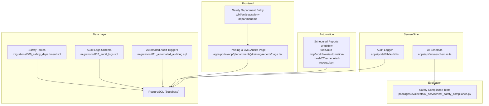
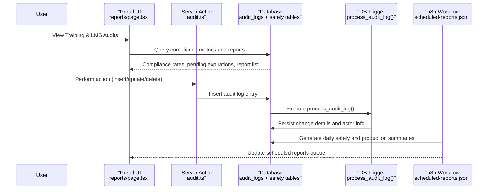
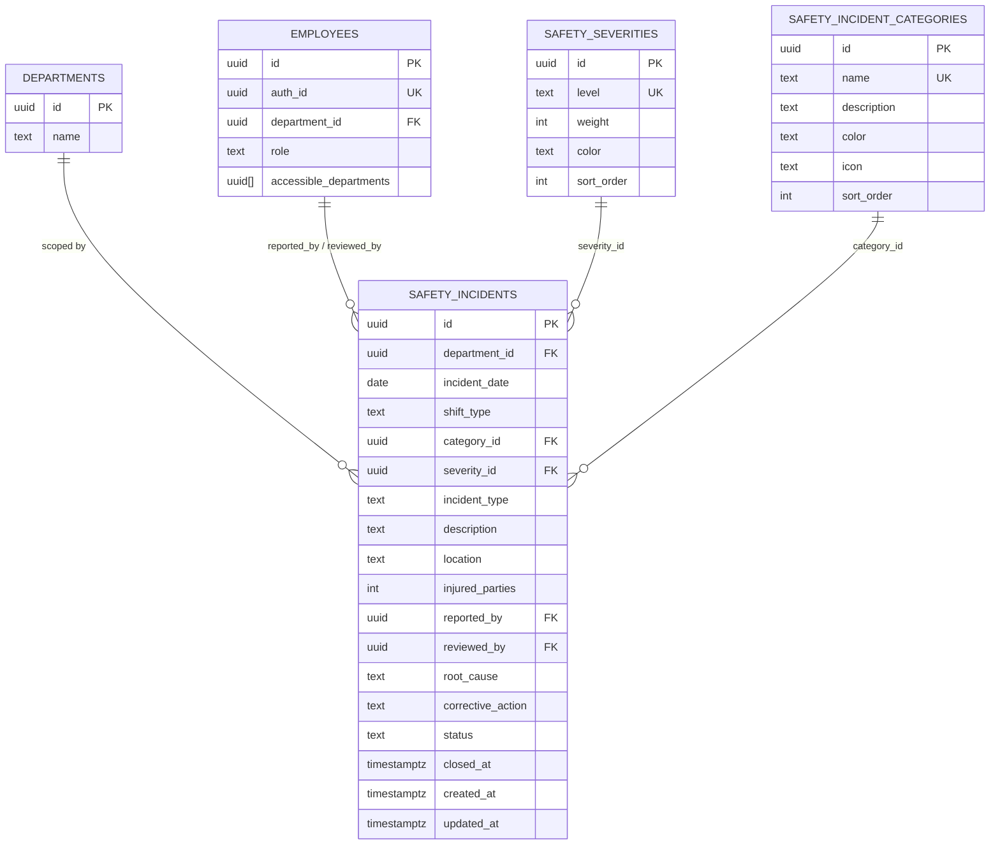
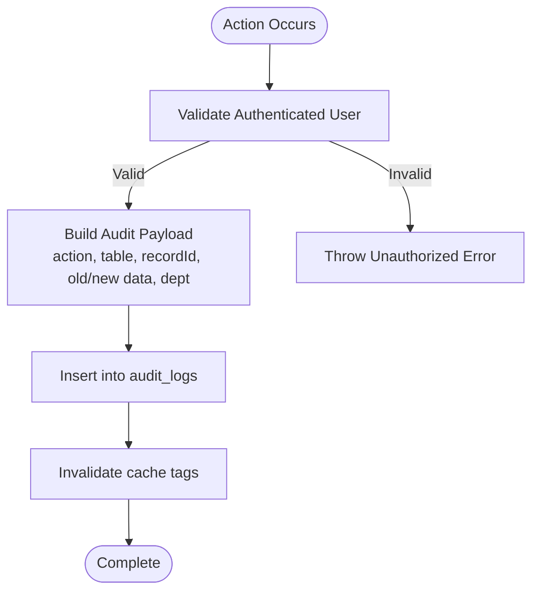
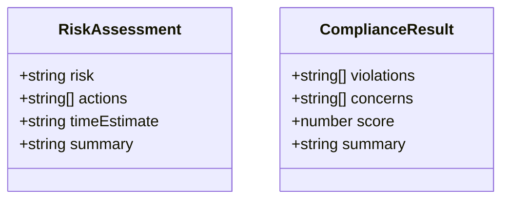
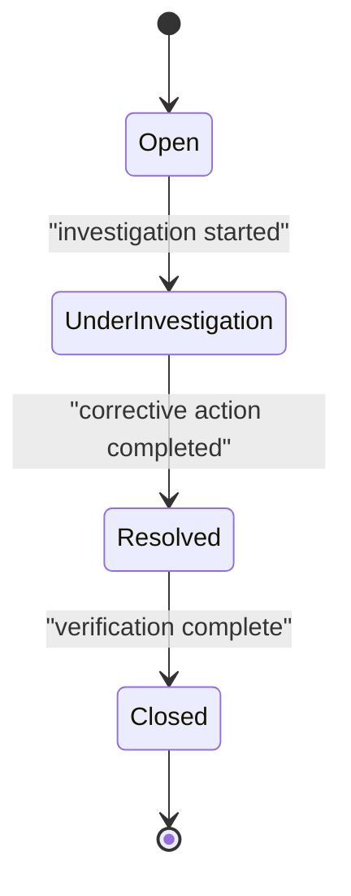
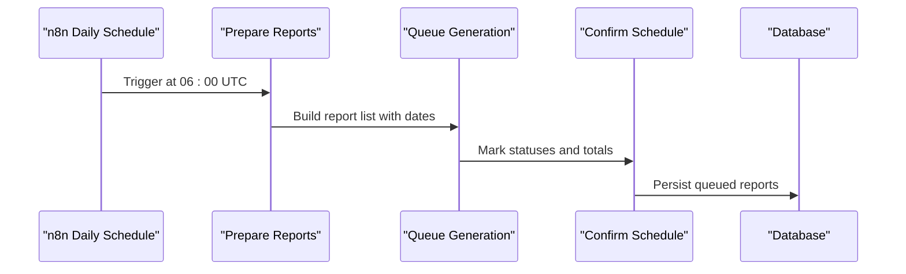
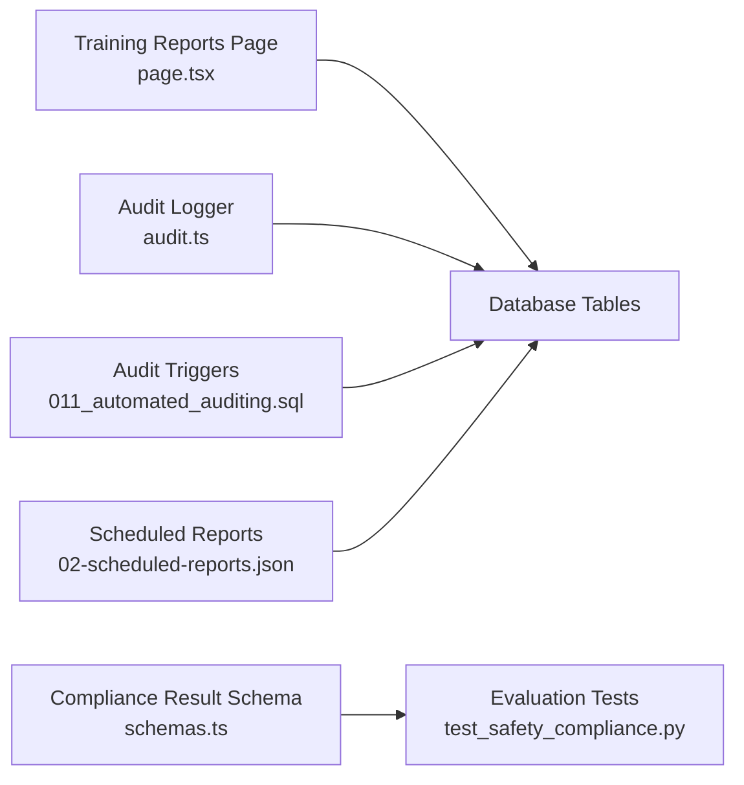

# Compliance Tracking & Reporting

<cite>
**Referenced Files in This Document**
- [audit.ts](file://apps/portal/lib/audit.ts)
- [006_safety_department.sql](file://packages/database/migrations/006_safety_department.sql)
- [007_audit_logs.sql](file://packages/database/migrations/007_audit_logs.sql)
- [011_automated_auditing.sql](file://packages/database/migrations/011_automated_auditing.sql)
- [safety-department.md](file://wiki/entities/safety-department.md)
- [page.tsx](file://apps/portal/app/(departments)/training/reports/page.tsx)
- [schemas.ts](file://apps/api/src/ai/schemas.ts)
- [test_safety_compliance.py](file://packages/eval/tests/ai_service/test_safety_compliance.py)
- [02-scheduled-reports.json](file://tools/n8n-mcp/workflows/automation-mesh/02-scheduled-reports.json)
</cite>

## Table of Contents

1. Introduction
2. Project Structure
3. Core Components
4. Architecture Overview
5. Detailed Component Analysis
6. Dependency Analysis
7. Performance Considerations
8. Troubleshooting Guide
9. Conclusion
10. Appendices

## Introduction

This document describes the Safety Compliance Tracking system’s compliance frameworks, monitoring, automated checks, scoring, audit trails, and reporting capabilities. It explains how safety incidents are captured, how compliance is measured and visualized, how audits are generated and scheduled, and how continuous improvement workflows are supported through corrective actions and training compliance tracking.

## Project Structure

The compliance tracking functionality spans several layers:

- Data model and security policies for safety data and audit logs
- Server-side audit logging utilities
- Frontend dashboards and reports for compliance visibility
- AI-assisted compliance analysis with validated schemas
- Automated scheduling for periodic report generation

**Diagram sources**

- [006_safety_department.sql:1-143](file://packages/database/migrations/006_safety_department.sql#L1-L143)
- [007_audit_logs.sql:1-46](file://packages/database/migrations/007_audit_logs.sql#L1-L46)
- [011_automated_auditing.sql:1-116](file://packages/database/migrations/011_automated_auditing.sql#L1-L116)
- [audit.ts:1-57](file://apps/portal/lib/audit.ts#L1-L57)
- [schemas.ts:1-20](file://apps/api/src/ai/schemas.ts#L1-L20)
- [page.tsx](<file://apps/portal/app/(departments)/training/reports/page.tsx#L1-L261>)
- [safety-department.md:1-76](file://wiki/entities/safety-department.md#L1-L76)
- [02-scheduled-reports.json:1-65](file://tools/n8n-mcp/workflows/automation-mesh/02-scheduled-reports.json#L1-L65)

**Section sources**

- [006_safety_department.sql:1-143](file://packages/database/migrations/006_safety_department.sql#L1-L143)
- [007_audit_logs.sql:1-46](file://packages/database/migrations/007_audit_logs.sql#L1-L46)
- [011_automated_auditing.sql:1-116](file://packages/database/migrations/011_automated_auditing.sql#L1-L116)
- [audit.ts:1-57](file://apps/portal/lib/audit.ts#L1-L57)
- [schemas.ts:1-20](file://apps/api/src/ai/schemas.ts#L1-L20)
- [page.tsx](<file://apps/portal/app/(departments)/training/reports/page.tsx#L1-L261>)
- [safety-department.md:1-76](file://wiki/entities/safety-department.md#L1-L76)
- [02-scheduled-reports.json:1-65](file://tools/n8n-mcp/workflows/automation-mesh/02-scheduled-reports.json#L1-L65)

## Core Components

- Safety incident data model and access controls: defines categories, severities, and incidents with row-level security policies scoped by department and role.
- Audit logging: server-side utility to record insert/update/delete events with user context and department scoping; database triggers auto-capture changes on core tables.
- Compliance visualization: training and LMS audits page showing departmental compliance rates, pending expirations, and generated reports.
- AI-assisted compliance analysis: typed schema for compliance results including violations, concerns, score, and summary; evaluated for factual consistency and bias.
- Scheduled reporting: n8n workflow that prepares and queues daily reports across departments.

**Section sources**

- [006_safety_department.sql:1-143](file://packages/database/migrations/006_safety_department.sql#L1-L143)
- [007_audit_logs.sql:1-46](file://packages/database/migrations/007_audit_logs.sql#L1-L46)
- [011_automated_auditing.sql:1-116](file://packages/database/migrations/011_automated_auditing.sql#L1-L116)
- [audit.ts:1-57](file://apps/portal/lib/audit.ts#L1-L57)
- [page.tsx](<file://apps/portal/app/(departments)/training/reports/page.tsx#L1-L261>)
- [schemas.ts:1-20](file://apps/api/src/ai/schemas.ts#L1-L20)
- [test_safety_compliance.py:1-40](file://packages/eval/tests/ai_service/test_safety_compliance.py#L1-L40)
- [02-scheduled-reports.json:1-65](file://tools/n8n-mcp/workflows/automation-mesh/02-scheduled-reports.json#L1-L65)

## Architecture Overview

The system integrates data persistence, server-side auditing, frontend dashboards, AI evaluation, and automation to provide end-to-end compliance tracking and reporting.

**Diagram sources**

- [page.tsx](<file://apps/portal/app/(departments)/training/reports/page.tsx#L1-L261>)
- [audit.ts:1-57](file://apps/portal/lib/audit.ts#L1-L57)
- [007_audit_logs.sql:1-46](file://packages/database/migrations/007_audit_logs.sql#L1-L46)
- [011_automated_auditing.sql:1-116](file://packages/database/migrations/011_automated_auditing.sql#L1-L116)
- [02-scheduled-reports.json:1-65](file://tools/n8n-mcp/workflows/automation-mesh/02-scheduled-reports.json#L1-L65)

## Detailed Component Analysis

### Safety Incident Model and Access Controls

- Defines severity levels, incident categories, and incidents with constraints and RLS policies.
- Policies enforce department-scoped read/write and admin/supervisor privileges.
- Supports investigation fields (root cause, corrective action) and status lifecycle.

**Diagram sources**

- [006_safety_department.sql:1-143](file://packages/database/migrations/006_safety_department.sql#L1-L143)

**Section sources**

- [006_safety_department.sql:1-143](file://packages/database/migrations/006_safety_department.sql#L1-L143)
- [safety-department.md:1-76](file://wiki/entities/safety-department.md#L1-L76)

### Audit Trail Generation

- Server-side audit logger records actions with user identity and department context.
- Database trigger function automatically captures inserts, updates, and deletes for core tables, persisting old/new snapshots and actor metadata.

**Diagram sources**

- [audit.ts:1-57](file://apps/portal/lib/audit.ts#L1-L57)
- [007_audit_logs.sql:1-46](file://packages/database/migrations/007_audit_logs.sql#L1-L46)
- [011_automated_auditing.sql:1-116](file://packages/database/migrations/011_automated_auditing.sql#L1-L116)

**Section sources**

- [audit.ts:1-57](file://apps/portal/lib/audit.ts#L1-L57)
- [007_audit_logs.sql:1-46](file://packages/database/migrations/007_audit_logs.sql#L1-L46)
- [011_automated_auditing.sql:1-116](file://packages/database/migrations/011_automated_auditing.sql#L1-L116)

### Compliance Scoring and AI-Assisted Analysis

- The API layer defines a typed compliance result schema including violations, concerns, numeric score, and summary.
- Evaluation tests assert factual consistency and lack of bias for AI-generated safety compliance assessments.

**Diagram sources**

- [schemas.ts:1-20](file://apps/api/src/ai/schemas.ts#L1-L20)

**Section sources**

- [schemas.ts:1-20](file://apps/api/src/ai/schemas.ts#L1-L20)
- [test_safety_compliance.py:1-40](file://packages/eval/tests/ai_service/test_safety_compliance.py#L1-L40)

### Compliance Deadline Tracking and Corrective Actions

- Safety incidents include investigation fields such as root cause and corrective action, enabling structured remediation workflows.
- Status progression supports open, under-investigation, resolved, and closed states, facilitating deadline-driven follow-ups.

**Diagram sources**

- [006_safety_department.sql:51-70](file://packages/database/migrations/006_safety_department.sql#L51-L70)

**Section sources**

- [006_safety_department.sql:51-70](file://packages/database/migrations/006_safety_department.sql#L51-L70)
- [safety-department.md:24-35](file://wiki/entities/safety-department.md#L24-L35)

### Regulatory Report Creation and Scheduling

- The Training & LMS Audits page displays departmental compliance rates, pending expirations, and generated reports, supporting export and download.
- An n8n workflow schedules daily report preparation and queuing across departments, providing a foundation for automated regulatory outputs.

**Diagram sources**

- [02-scheduled-reports.json:1-65](file://tools/n8n-mcp/workflows/automation-mesh/02-scheduled-reports.json#L1-L65)
- [page.tsx](<file://apps/portal/app/(departments)/training/reports/page.tsx#L1-L261>)

**Section sources**

- [page.tsx](<file://apps/portal/app/(departments)/training/reports/page.tsx#L1-L261>)
- [02-scheduled-reports.json:1-65](file://tools/n8n-mcp/workflows/automation-mesh/02-scheduled-reports.json#L1-L65)

### Continuous Improvement Workflows

- Safety entity documentation outlines KPIs (e.g., LTI-Free Days, Incident-Free Days) and completeness targets, guiding iterative enhancements.
- Mobile responsiveness and real-time updates are prioritized to improve field reporting and operational feedback loops.

**Section sources**

- [safety-department.md:36-66](file://wiki/entities/safety-department.md#L36-L66)

## Dependency Analysis

Key dependencies and relationships:

- Frontend reports depend on database tables for compliance metrics and report listings.
- Audit logging depends on authenticated sessions and employee mapping to capture actor context.
- Automated auditing relies on database triggers to ensure consistent change capture.
- AI compliance schemas are used by evaluation tests to validate output quality.
- Scheduled reports orchestrate batch processing via n8n and interact with the database.

**Diagram sources**

- [page.tsx](<file://apps/portal/app/(departments)/training/reports/page.tsx#L1-L261>)
- [audit.ts:1-57](file://apps/portal/lib/audit.ts#L1-L57)
- [011_automated_auditing.sql:1-116](file://packages/database/migrations/011_automated_auditing.sql#L1-L116)
- [schemas.ts:1-20](file://apps/api/src/ai/schemas.ts#L1-L20)
- [test_safety_compliance.py:1-40](file://packages/eval/tests/ai_service/test_safety_compliance.py#L1-L40)
- [02-scheduled-reports.json:1-65](file://tools/n8n-mcp/workflows/automation-mesh/02-scheduled-reports.json#L1-L65)

**Section sources**

- [page.tsx](<file://apps/portal/app/(departments)/training/reports/page.tsx#L1-L261>)
- [audit.ts:1-57](file://apps/portal/lib/audit.ts#L1-L57)
- [011_automated_auditing.sql:1-116](file://packages/database/migrations/011_automated_auditing.sql#L1-L116)
- [schemas.ts:1-20](file://apps/api/src/ai/schemas.ts#L1-L20)
- [test_safety_compliance.py:1-40](file://packages/eval/tests/ai_service/test_safety_compliance.py#L1-L40)
- [02-scheduled-reports.json:1-65](file://tools/n8n-mcp/workflows/automation-mesh/02-scheduled-reports.json#L1-L65)

## Performance Considerations

- Indexes on audit logs support efficient queries by table, record, performer, department, and time.
- Row-level security policies reduce unnecessary data exposure and can improve query performance by narrowing result sets.
- Cache invalidation after audit writes ensures timely dashboard updates without excessive polling.

[No sources needed since this section provides general guidance]

## Troubleshooting Guide

- Unauthorized audit logging: Ensure the user session is valid before calling the audit logger; errors are thrown when authentication fails.
- Missing actor or department context: Verify employee mapping and department assignment so audit entries include performed_by and department_id.
- Trigger failures: If automated audit entries are missing, check that triggers are attached to core tables and that the trigger function executes successfully.
- Report scheduling issues: Confirm the n8n workflow is active and scheduled; verify queued report statuses and timestamps.

**Section sources**

- [audit.ts:1-57](file://apps/portal/lib/audit.ts#L1-L57)
- [007_audit_logs.sql:1-46](file://packages/database/migrations/007_audit_logs.sql#L1-L46)
- [011_automated_auditing.sql:1-116](file://packages/database/migrations/011_automated_auditing.sql#L1-L116)
- [02-scheduled-reports.json:1-65](file://tools/n8n-mcp/workflows/automation-mesh/02-scheduled-reports.json#L1-L65)

## Conclusion

The Safety Compliance Tracking system combines robust data modeling, secure access controls, comprehensive audit trails, AI-assisted analysis, and automated reporting to deliver actionable compliance insights. With clear incident lifecycles, corrective action tracking, and scheduled report generation, it supports ongoing regulatory adherence and continuous improvement.

[No sources needed since this section summarizes without analyzing specific files]

## Appendices

### Guidelines for Maintaining Compliance Documentation

- Keep safety incident categories and severities up to date; use standardized descriptions and icons for clarity.
- Maintain accurate employee roles and department assignments to ensure correct RLS behavior and audit attribution.
- Regularly review audit logs for completeness and accuracy; confirm that both server-side and trigger-based logging are functioning.
- Use the Training & LMS Audits page to monitor departmental compliance rates and address pending expirations promptly.
- Validate AI-assisted compliance outputs against factual consistency and bias thresholds using the provided evaluation tests.
- Monitor scheduled reports to ensure daily summaries are generated and available for distribution.

**Section sources**

- [006_safety_department.sql:1-143](file://packages/database/migrations/006_safety_department.sql#L1-L143)
- [007_audit_logs.sql:1-46](file://packages/database/migrations/007_audit_logs.sql#L1-L46)
- [011_automated_auditing.sql:1-116](file://packages/database/migrations/011_automated_auditing.sql#L1-L116)
- [page.tsx](<file://apps/portal/app/(departments)/training/reports/page.tsx#L1-L261>)
- [test_safety_compliance.py:1-40](file://packages/eval/tests/ai_service/test_safety_compliance.py#L1-L40)
- [02-scheduled-reports.json:1-65](file://tools/n8n-mcp/workflows/automation-mesh/02-scheduled-reports.json#L1-L65)
