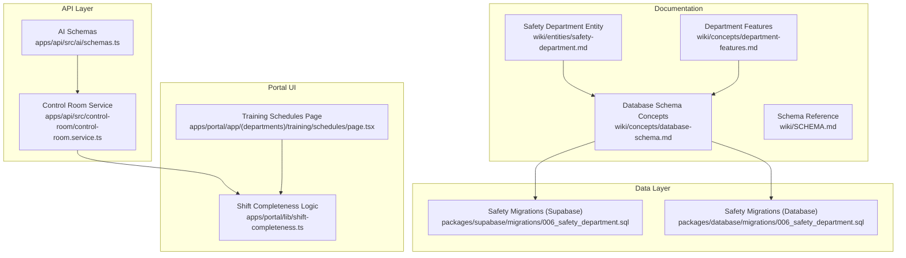
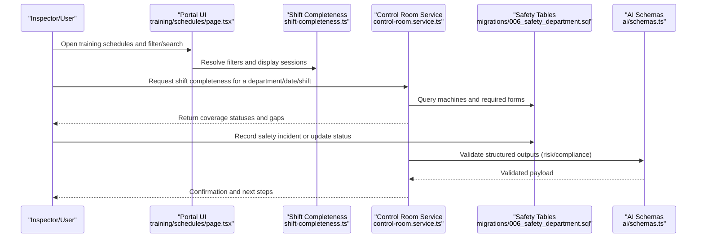
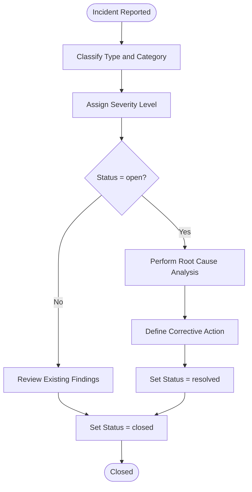
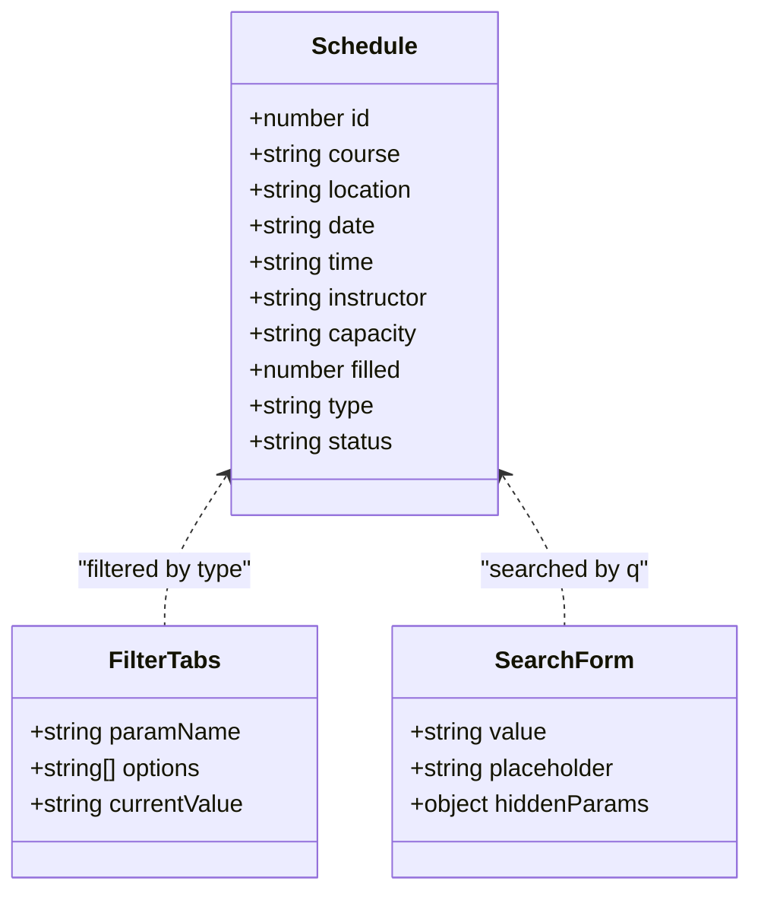
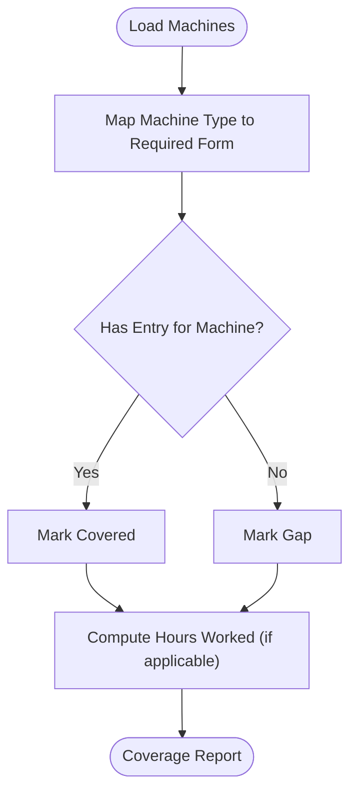
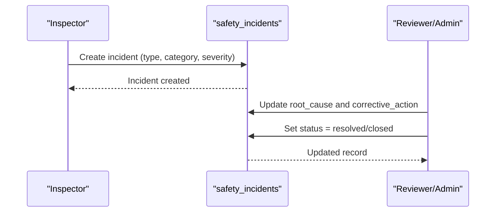
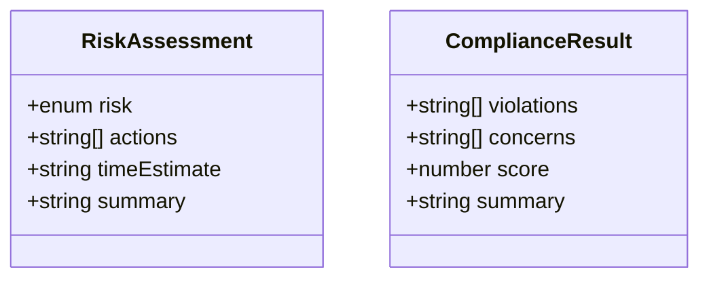
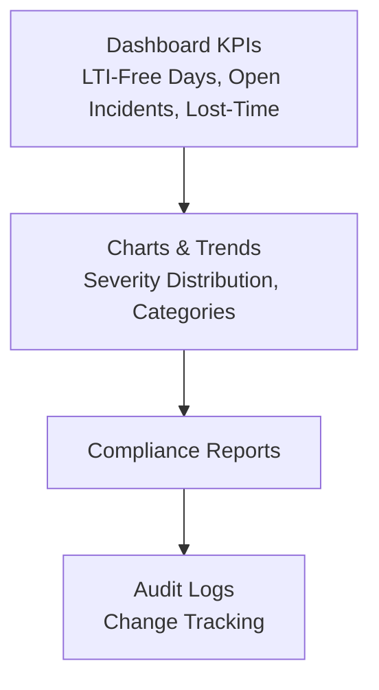
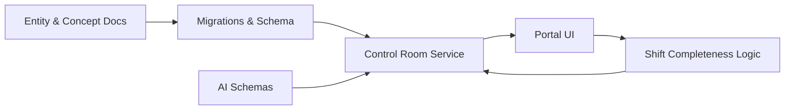

# Inspection Management System

<cite>
**Referenced Files in This Document**
- [safety-department.md](file://wiki/entities/safety-department.md)
- [department-features.md](file://wiki/concepts/department-features.md)
- [database-schema.md](file://wiki/concepts/database-schema.md)
- [SCHEMA.md](file://wiki/SCHEMA.md)
- [006_safety_department.sql (packages/supabase)](file://packages/supabase/migrations/006_safety_department.sql)
- [006_safety_department.sql (packages/database)](file://packages/database/migrations/006_safety_department.sql)
- [control-room.service.ts](file://apps/api/src/control-room/control-room.service.ts)
- [shift-completeness.ts](file://apps/portal/lib/shift-completeness.ts)
- [schedules/page.tsx](file://apps/portal/app/(departments)/training/schedules/page.tsx)
- [schemas.ts](file://apps/api/src/ai/schemas.ts)
</cite>

## Table of Contents

1. [Introduction](#introduction)
2. [Project Structure](#project-structure)
3. [Core Components](#core-components)
4. [Architecture Overview](#architecture-overview)
5. [Detailed Component Analysis](#detailed-component-analysis)
6. [Dependency Analysis](#dependency-analysis)
7. [Performance Considerations](#performance-considerations)
8. [Troubleshooting Guide](#troubleshooting-guide)
9. [Conclusion](#conclusion)
10. [Appendices](#appendices)

## Introduction

This document describes the Safety Inspection Management system as implemented within the repository. It focuses on:

- Inspection scheduling and planning
- Checklist management and field inspection workflows
- Recording inspection results, non-conformance tracking, and corrective action assignment
- Analytics, performance metrics, and trend analysis
- Inspector training integration and result validation processes

The system is centered around safety incident reporting, severity categorization, and investigation workflows, with supporting analytics and auditability. Training schedules are available to support inspector readiness and compliance.

## Project Structure

The relevant parts of the codebase include:

- Safety department entity documentation and feature overview
- Database schema definitions for safety tables and reference data
- API service logic for shift completeness and form coverage
- Portal UI components for training schedules and search/filtering
- AI schemas for risk assessment and compliance scoring

**Diagram sources**

- [safety-department.md:1-76](file://wiki/entities/safety-department.md#L1-L76)
- [department-features.md:83-104](file://wiki/concepts/department-features.md#L83-L104)
- [database-schema.md:180-338](file://wiki/concepts/database-schema.md#L180-L338)
- [SCHEMA.md:312-335](file://wiki/SCHEMA.md#L312-L335)
- [006_safety_department.sql (packages/supabase):1-46](file://packages/supabase/migrations/006_safety_department.sql#L1-L46)
- [006_safety_department.sql (packages/database):1-46](file://packages/database/migrations/006_safety_department.sql#L1-L46)
- [control-room.service.ts:40-157](file://apps/api/src/control-room/control-room.service.ts#L40-L157)
- [shift-completeness.ts:215-269](file://apps/portal/lib/shift-completeness.ts#L215-L269)
- [schedules/page.tsx](<file://apps/portal/app/(departments)/training/schedules/page.tsx#L1-L234>)
- [schemas.ts:1-19](file://apps/api/src/ai/schemas.ts#L1-L19)

**Section sources**

- [safety-department.md:1-76](file://wiki/entities/safety-department.md#L1-L76)
- [department-features.md:83-104](file://wiki/concepts/department-features.md#L83-L104)
- [database-schema.md:180-338](file://wiki/concepts/database-schema.md#L180-L338)
- [SCHEMA.md:312-335](file://wiki/SCHEMA.md#L312-L335)

## Core Components

- Safety Incident Workflow
  - Statuses: open, under-investigation, resolved, closed
  - Severity levels: low, medium, high, critical (with weights)
  - Categories: Slip/Trip/Fall, Equipment Contact, Vehicle Incident, Hazardous Material, Environmental, Near Miss, Other
  - Key fields include incident type, location, injured parties, root cause, corrective action, and timestamps

- Data Model Foundations
  - safety_incidents table with references to severities and categories
  - safety_severities and safety_incident_categories reference tables
  - Audit logs and RLS policies for security and traceability

- Shift Coverage and Form Completion
  - Control room service computes required forms per machine type and determines coverage
  - Client-side logic resolves hasEntry and hoursWorked per machine/form mapping

- Training Scheduling
  - Training sessions page supports filtering by type and search across course/instructor/location
  - Provides registration capacity and status indicators

- AI-Assisted Risk and Compliance
  - Zod schemas define structured outputs for risk assessments and compliance results

**Section sources**

- [department-features.md:83-104](file://wiki/concepts/department-features.md#L83-L104)
- [database-schema.md:180-338](file://wiki/concepts/database-schema.md#L180-L338)
- [SCHEMA.md:312-335](file://wiki/SCHEMA.md#L312-L335)
- [006_safety_department.sql (packages/supabase):119-142](file://packages/supabase/migrations/006_safety_department.sql#L119-L142)
- [006_safety_department.sql (packages/database):119-142](file://packages/database/migrations/006_safety_department.sql#L119-L142)
- [control-room.service.ts:40-157](file://apps/api/src/control-room/control-room.service.ts#L40-L157)
- [shift-completeness.ts:215-269](file://apps/portal/lib/shift-completeness.ts#L215-L269)
- [schedules/page.tsx](<file://apps/portal/app/(departments)/training/schedules/page.tsx#L1-L234>)
- [schemas.ts:1-19](file://apps/api/src/ai/schemas.ts#L1-L19)

## Architecture Overview

The system integrates documentation-driven design, database migrations, API services, and portal UI to support safety inspections and related workflows.

**Diagram sources**

- [schedules/page.tsx](<file://apps/portal/app/(departments)/training/schedules/page.tsx#L1-L234>)
- [shift-completeness.ts:215-269](file://apps/portal/lib/shift-completeness.ts#L215-L269)
- [control-room.service.ts:40-157](file://apps/api/src/control-room/control-room.service.ts#L40-L157)
- [006_safety_department.sql (packages/supabase):1-46](file://packages/supabase/migrations/006_safety_department.sql#L1-L46)
- [schemas.ts:1-19](file://apps/api/src/ai/schemas.ts#L1-L19)

## Detailed Component Analysis

### Safety Incident Workflow and Data Model

- Incident lifecycle states and severity weighting drive prioritization and reporting
- Categories standardize classification for trend analysis and dashboards
- Audit logs capture changes for accountability and compliance

**Diagram sources**

- [department-features.md:94-104](file://wiki/concepts/department-features.md#L94-L104)
- [database-schema.md:180-207](file://wiki/concepts/database-schema.md#L180-L207)
- [SCHEMA.md:312-335](file://wiki/SCHEMA.md#L312-L335)

**Section sources**

- [department-features.md:83-104](file://wiki/concepts/department-features.md#L83-L104)
- [database-schema.md:180-207](file://wiki/concepts/database-schema.md#L180-L207)
- [SCHEMA.md:312-335](file://wiki/SCHEMA.md#L312-L335)

### Inspection Planning and Scheduling Integration

- Training schedules provide visibility into mandatory and refresher courses
- Filtering and search enable quick discovery of relevant sessions
- Capacity and status indicators help plan inspector availability

**Diagram sources**

- [schedules/page.tsx](<file://apps/portal/app/(departments)/training/schedules/page.tsx#L1-L234>)

**Section sources**

- [schedules/page.tsx](<file://apps/portal/app/(departments)/training/schedules/page.tsx#L1-L234>)

### Field Inspection Workflows and Shift Coverage

- Required forms per machine type determine coverage expectations
- Client-side logic maps machine types to forms and resolves completion status
- Hours worked can be surfaced where applicable

**Diagram sources**

- [control-room.service.ts:40-157](file://apps/api/src/control-room/control-room.service.ts#L40-L157)
- [shift-completeness.ts:215-269](file://apps/portal/lib/shift-completeness.ts#L215-L269)

**Section sources**

- [control-room.service.ts:40-157](file://apps/api/src/control-room/control-room.service.ts#L40-L157)
- [shift-completeness.ts:215-269](file://apps/portal/lib/shift-completeness.ts#L215-L269)

### Non-Conformance Tracking and Corrective Actions

- Non-conformances are captured via incident records with category and severity
- Root cause and corrective action fields support structured remediation
- Status progression ensures closure and auditability

**Diagram sources**

- [database-schema.md:180-207](file://wiki/concepts/database-schema.md#L180-L207)
- [SCHEMA.md:312-335](file://wiki/SCHEMA.md#L312-L335)

**Section sources**

- [database-schema.md:180-207](file://wiki/concepts/database-schema.md#L180-L207)
- [SCHEMA.md:312-335](file://wiki/SCHEMA.md#L312-L335)

### Inspection Result Validation and AI Assistance

- Structured schemas validate risk assessments and compliance results
- Enforcement of enums and numeric ranges ensures consistency

**Diagram sources**

- [schemas.ts:1-19](file://apps/api/src/ai/schemas.ts#L1-L19)

**Section sources**

- [schemas.ts:1-19](file://apps/api/src/ai/schemas.ts#L1-L19)

### Analytics, Performance Metrics, and Trend Analysis

- Dashboard KPIs include LTI-free days, incident-free days, open incidents, and lost-time counts
- Reference tables and categories enable distribution charts and trend analysis
- Audit logs support change tracking and compliance reporting

**Diagram sources**

- [safety-department.md:36-64](file://wiki/entities/safety-department.md#L36-L64)
- [department-features.md:83-104](file://wiki/concepts/department-features.md#L83-L104)
- [database-schema.md:208-229](file://wiki/concepts/database-schema.md#L208-L229)

**Section sources**

- [safety-department.md:36-64](file://wiki/entities/safety-department.md#L36-L64)
- [department-features.md:83-104](file://wiki/concepts/department-features.md#L83-L104)
- [database-schema.md:208-229](file://wiki/concepts/database-schema.md#L208-L229)

## Dependency Analysis

- Documentation drives implementation: entity and concept docs inform schema and features
- Migrations implement safety tables and seed reference data
- API service depends on machine type mappings and form metadata to compute coverage
- Portal UI depends on client-side logic for filtering and coverage resolution
- AI schemas enforce structured outputs used by downstream processes

**Diagram sources**

- [safety-department.md:1-76](file://wiki/entities/safety-department.md#L1-L76)
- [department-features.md:83-104](file://wiki/concepts/department-features.md#L83-L104)
- [006_safety_department.sql (packages/supabase):1-46](file://packages/supabase/migrations/006_safety_department.sql#L1-L46)
- [control-room.service.ts:40-157](file://apps/api/src/control-room/control-room.service.ts#L40-L157)
- [shift-completeness.ts:215-269](file://apps/portal/lib/shift-completeness.ts#L215-L269)
- [schemas.ts:1-19](file://apps/api/src/ai/schemas.ts#L1-L19)

**Section sources**

- [safety-department.md:1-76](file://wiki/entities/safety-department.md#L1-L76)
- [department-features.md:83-104](file://wiki/concepts/department-features.md#L83-L104)
- [006_safety_department.sql (packages/supabase):1-46](file://packages/supabase/migrations/006_safety_department.sql#L1-L46)
- [control-room.service.ts:40-157](file://apps/api/src/control-room/control-room.service.ts#L40-L157)
- [shift-completeness.ts:215-269](file://apps/portal/lib/shift-completeness.ts#L215-L269)
- [schemas.ts:1-19](file://apps/api/src/ai/schemas.ts#L1-L19)

## Performance Considerations

- Use materialized views and indexes for dashboard queries and trend analysis
- Cache shift completeness computations to reduce repeated database load
- Partition time-series tables to improve query performance at scale
- Ensure RLS policies are optimized with appropriate indexes on department membership columns

[No sources needed since this section provides general guidance]

## Troubleshooting Guide

- Missing required forms: Verify machine type mapping and required form metadata; check coverage report for gaps
- Incorrect incident status transitions: Confirm workflow rules and ensure root cause and corrective action are populated before closing
- Training schedule filters not applying: Validate search parameters and filter tab state; confirm hidden params propagation
- AI schema validation failures: Ensure payloads conform to defined enums and numeric ranges

**Section sources**

- [control-room.service.ts:40-157](file://apps/api/src/control-room/control-room.service.ts#L40-L157)
- [shift-completeness.ts:215-269](file://apps/portal/lib/shift-completeness.ts#L215-L269)
- [schedules/page.tsx](<file://apps/portal/app/(departments)/training/schedules/page.tsx#L1-L234>)
- [schemas.ts:1-19](file://apps/api/src/ai/schemas.ts#L1-L19)

## Conclusion

The Safety Inspection Management system integrates robust data modeling, clear workflows, and supportive UI components to manage inspections, track non-conformances, and drive corrective actions. Training schedules enhance inspector readiness, while analytics and audit capabilities support continuous improvement and compliance.

[No sources needed since this section summarizes without analyzing specific files]

## Appendices

- Safety Incident Fields and References
  - Refer to the safety tables and reference data for detailed column definitions and constraints
- Shift Coverage Mapping
  - See control room service and client-side logic for machine-to-form mappings and coverage computation

**Section sources**

- [database-schema.md:180-338](file://wiki/concepts/database-schema.md#L180-L338)
- [SCHEMA.md:312-335](file://wiki/SCHEMA.md#L312-L335)
- [control-room.service.ts:40-157](file://apps/api/src/control-room/control-room.service.ts#L40-L157)
- [shift-completeness.ts:215-269](file://apps/portal/lib/shift-completeness.ts#L215-L269)
