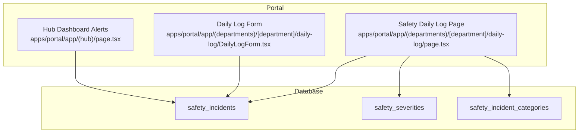
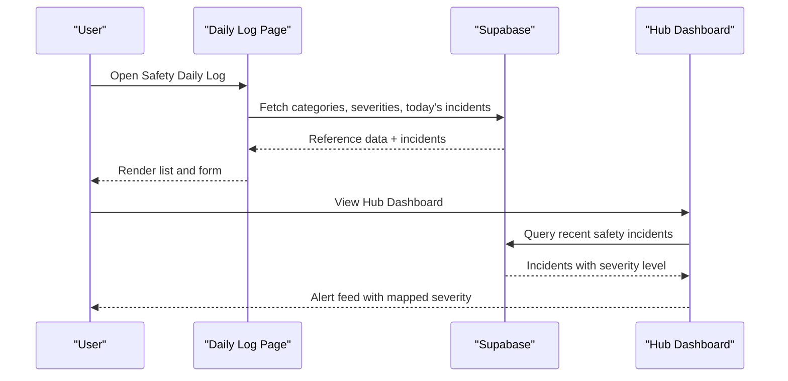
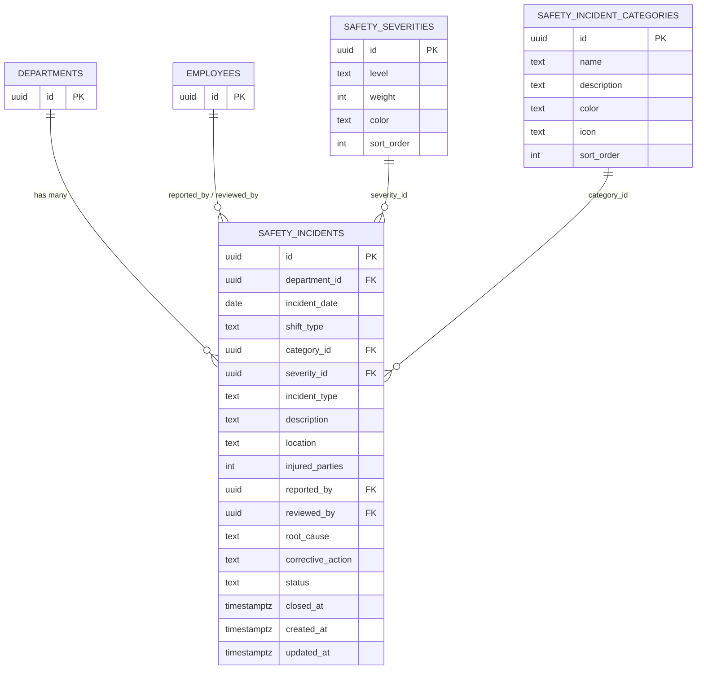
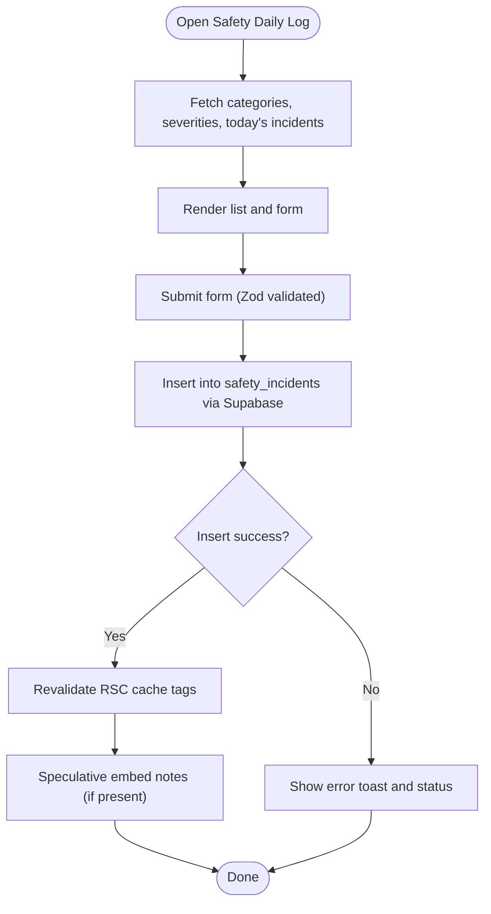
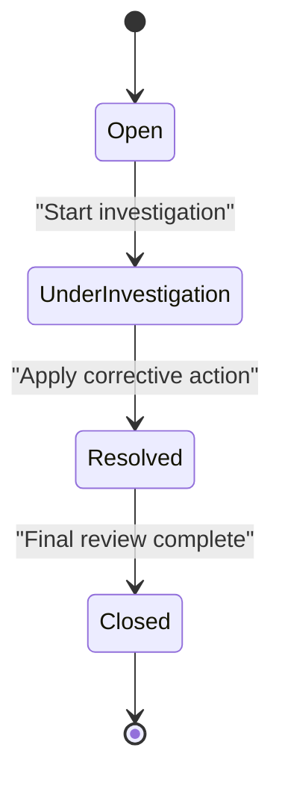
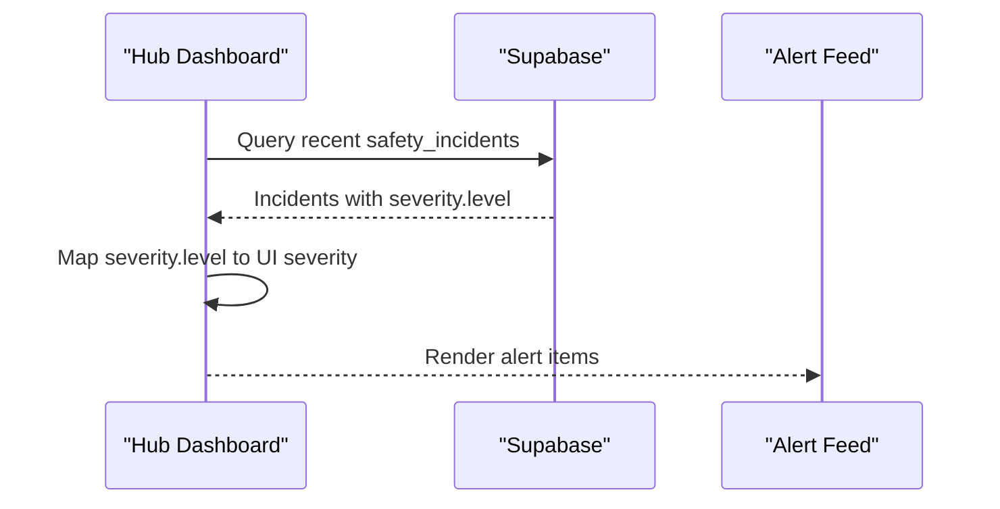
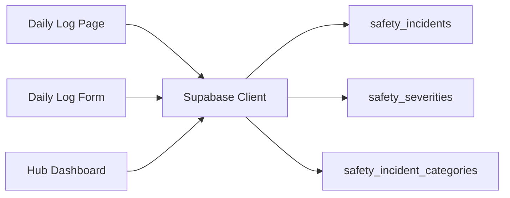

# Safety Incidents Management

<cite>
**Referenced Files in This Document**
- [006_safety_department.sql](file://packages/database/migrations/006_safety_department.sql)
- [006_safety_department.sql](file://packages/supabase/migrations/006_safety_department.sql)
- [safety-department.md](file://wiki/entities/safety-department.md)
- [department-features.md](file://wiki/concepts/department-features.md)
- [incident-response.md](file://wiki/concepts/incident-response.md)
- [page.tsx](file://apps/portal/app/(departments)/[department]/daily-log/page.tsx)
- [DailyLogForm.tsx](file://apps/portal/app/(departments)/[department]/daily-log/DailyLogForm.tsx)
- [page.tsx](file://apps/portal/app/(hub)/page.tsx)
</cite>

## Table of Contents

1. Introduction
2. Project Structure
3. Core Components
4. Architecture Overview
5. Detailed Component Analysis
6. Dependency Analysis
7. Performance Considerations
8. Troubleshooting Guide
9. Conclusion

## Introduction

This document describes the Safety Incidents Management system within the portal, focusing on incident logging workflows, classification and categorization, investigation tracking, and resolution processes. It explains the incident data model, form validation rules, automated notifications, reporting features, trend analysis, and compliance documentation generation. It also provides guidelines for severity assessment, stakeholder notifications, and regulatory reporting requirements.

## Project Structure

The safety feature is implemented as part of the department-specific portal with:

- Database schema and policies for safety incidents, severities, and categories
- A daily log page that loads safety reference data and today’s incidents
- A generic daily log form (used across departments; safety uses it for shift logging)
- Hub dashboard integration that surfaces recent safety incidents as alerts

**Diagram sources**

- [page.tsx](<file://apps/portal/app/(departments)/[department]/daily-log/page.tsx>)
- [DailyLogForm.tsx](<file://apps/portal/app/(departments)/[department]/daily-log/DailyLogForm.tsx>)
- [page.tsx](<file://apps/portal/app/(hub)/page.tsx>)
- [006_safety_department.sql](file://packages/database/migrations/006_safety_department.sql)

**Section sources**

- [safety-department.md](file://wiki/entities/safety-department.md)
- [department-features.md](file://wiki/concepts/department-features.md)

## Core Components

- Incident Data Model
  - safety_incidents: core incident record with fields for date, shift, type, category, severity, description, location, injured parties, reporter/reviewer, root cause, corrective action, status, and timestamps.
  - safety_severities: severity levels with weights and colors.
  - safety_incident_categories: predefined categories with descriptions and icons.
- Security Policies
  - Row-level security ensures users can only access incidents scoped to their department or roles (admin/supervisor).
- Daily Log Page
  - Loads categories, severities, and today’s incidents in parallel for the active department.
- Daily Log Form
  - Shift-based logging with Zod validation and Supabase insert; revalidates cached RSC data and triggers speculative embedding for notes.
- Hub Dashboard Integration
  - Aggregates recent safety incidents into alert events with mapped severity levels.

**Section sources**

- [006_safety_department.sql](file://packages/database/migrations/006_safety_department.sql)
- [006_safety_department.sql](file://packages/supabase/migrations/006_safety_department.sql)
- [page.tsx](<file://apps/portal/app/(departments)/[department]/daily-log/page.tsx>)
- [DailyLogForm.tsx](<file://apps/portal/app/(departments)/[department]/daily-log/DailyLogForm.tsx>)
- [page.tsx](<file://apps/portal/app/(hub)/page.tsx>)

## Architecture Overview

The system follows a client-server architecture using Next.js pages and Supabase for data persistence and row-level security. The daily log page fetches reference data and today’s incidents concurrently. The hub dashboard aggregates recent incidents and maps severity labels to UI severity levels.

**Diagram sources**

- [page.tsx](<file://apps/portal/app/(departments)/[department]/daily-log/page.tsx>)
- [page.tsx](<file://apps/portal/app/(hub)/page.tsx>)
- [006_safety_department.sql](file://packages/database/migrations/006_safety_department.sql)

## Detailed Component Analysis

### Incident Data Model and Classification

- Tables
  - safety_incidents: primary entity capturing all incident details and lifecycle state.
  - safety_severities: defines severity levels (low, medium, high, critical) with numeric weights and color codes.
  - safety_incident_categories: standardizes categories such as Slip/Trip/Fall, Equipment Contact, Vehicle Incident, Hazardous Material, Environmental, Near Miss, Other.
- Constraints and Validations
  - CHECK constraints enforce valid values for shift_type, incident_type, and status.
  - Foreign keys link to departments, employees, severities, and categories.
- Security
  - Row-level security policies restrict access by department and role.

**Diagram sources**

- [006_safety_department.sql](file://packages/database/migrations/006_safety_department.sql)
- [006_safety_department.sql](file://packages/supabase/migrations/006_safety_department.sql)

**Section sources**

- [006_safety_department.sql](file://packages/database/migrations/006_safety_department.sql)
- [006_safety_department.sql](file://packages/supabase/migrations/006_safety_department.sql)
- [safety-department.md](file://wiki/entities/safety-department.md)
- [department-features.md](file://wiki/concepts/department-features.md)

### Incident Logging Workflow

- Entry Point
  - Safety Daily Log page loads categories, severities, and today’s incidents in parallel for the current department.
- Submission
  - The daily log form validates input via Zod, inserts records into Supabase, shows toast feedback, and revalidates cached RSC data.
- Post-Submit Actions
  - Optional speculative embedding for notes is triggered asynchronously.

**Diagram sources**

- [page.tsx](<file://apps/portal/app/(departments)/[department]/daily-log/page.tsx>)
- [DailyLogForm.tsx](<file://apps/portal/app/(departments)/[department]/daily-log/DailyLogForm.tsx>)

**Section sources**

- [page.tsx](<file://apps/portal/app/(departments)/[department]/daily-log/page.tsx>)
- [DailyLogForm.tsx](<file://apps/portal/app/(departments)/[department]/daily-log/DailyLogForm.tsx>)

### Investigation Tracking and Resolution

- Status Lifecycle
  - open → under-investigation → resolved → closed
- Investigation Fields
  - root_cause and corrective_action capture findings and remediation steps.
- Reviewers
  - reviewed_by tracks who finalized the review.
- Access Control
  - Only the reporter, supervisors, or admins can update an incident.

**Diagram sources**

- [006_safety_department.sql](file://packages/database/migrations/006_safety_department.sql)
- [department-features.md](file://wiki/concepts/department-features.md)

**Section sources**

- [006_safety_department.sql](file://packages/database/migrations/006_safety_department.sql)
- [department-features.md](file://wiki/concepts/department-features.md)

### Automated Notifications and Hub Integration

- Severity Mapping
  - The hub dashboard maps database severity levels to UI severity categories (critical, warning, info).
- Alert Feed
  - Recent safety incidents are aggregated and displayed with title, description, timestamp, and navigation link.

**Diagram sources**

- [page.tsx](<file://apps/portal/app/(hub)/page.tsx>)
- [006_safety_department.sql](file://packages/database/migrations/006_safety_department.sql)

**Section sources**

- [page.tsx](<file://apps/portal/app/(hub)/page.tsx>)

### Reporting Features, Trend Analysis, and Compliance Documentation

- KPIs and Dashboards
  - LTI-Free Days, Incident-Free Days (30d), Open Incidents, Lost Time (30d) provide operational insights.
- Categories and Severity Distribution
  - Predefined categories and weighted severities enable trend analysis and heatmaps.
- Compliance Reports
  - The reports tab supports generating compliance documents based on stored incident data.

**Section sources**

- [safety-department.md](file://wiki/entities/safety-department.md)
- [department-features.md](file://wiki/concepts/department-features.md)

### Guidelines for Severity Assessment, Stakeholder Notifications, and Regulatory Reporting

- Severity Assessment
  - Use standardized levels (low, medium, high, critical) with associated weights and colors to ensure consistent classification.
- Stakeholder Notifications
  - High/critical incidents should be surfaced prominently in the hub dashboard and escalated per the incident response playbook.
- Regulatory Reporting Requirements
  - Maintain accurate records of incident_type, severity, category, location, injured_parties, root_cause, and corrective_action to support external audits and regulatory submissions.

**Section sources**

- [incident-response.md](file://wiki/concepts/incident-response.md)
- [safety-department.md](file://wiki/entities/safety-department.md)

## Dependency Analysis

- Frontend Dependencies
  - Daily Log Page depends on Supabase client to fetch categories, severities, and incidents.
  - Daily Log Form depends on Zod for validation and Supabase client for inserts.
  - Hub Dashboard depends on Supabase queries and local mapping logic for severity display.
- Backend/Data Dependencies
  - All safety tables rely on row-level security policies tied to employees and departments.
  - Seed data populates severities and categories at migration time.

**Diagram sources**

- [page.tsx](<file://apps/portal/app/(departments)/[department]/daily-log/page.tsx>)
- [DailyLogForm.tsx](<file://apps/portal/app/(departments)/[department]/daily-log/DailyLogForm.tsx>)
- [page.tsx](<file://apps/portal/app/(hub)/page.tsx>)
- [006_safety_department.sql](file://packages/database/migrations/006_safety_department.sql)

**Section sources**

- [page.tsx](<file://apps/portal/app/(departments)/[department]/daily-log/page.tsx>)
- [DailyLogForm.tsx](<file://apps/portal/app/(departments)/[department]/daily-log/DailyLogForm.tsx>)
- [page.tsx](<file://apps/portal/app/(hub)/page.tsx>)
- [006_safety_department.sql](file://packages/database/migrations/006_safety_department.sql)

## Performance Considerations

- Parallel Data Loading
  - The daily log page fetches categories, severities, and incidents concurrently to reduce latency.
- Caching and Revalidation
  - After successful submission, RSC cache tags are revalidated to reflect new data promptly.
- Efficient Queries
  - Select only required fields and use filters (e.g., department_id, incident_date) to minimize payload size.

[No sources needed since this section provides general guidance]

## Troubleshooting Guide

- Validation Errors
  - Ensure form inputs satisfy Zod schema before submission; check field-specific error messages.
- Insert Failures
  - Inspect Supabase errors and user permissions; verify row-level security policies allow the operation.
- Cache Staleness
  - If data does not refresh after submission, trigger revalidation of relevant cache tags.
- Severity Display Issues
  - Confirm severity.level values map correctly to UI severity categories in the hub dashboard.

**Section sources**

- [DailyLogForm.tsx](<file://apps/portal/app/(departments)/[department]/daily-log/DailyLogForm.tsx>)
- [page.tsx](<file://apps/portal/app/(hub)/page.tsx>)

## Conclusion

The Safety Incidents Management system provides a robust foundation for logging, classifying, investigating, and resolving safety incidents. With well-defined data models, strict validation, secure access controls, and integrated dashboards, it supports operational visibility, trend analysis, and compliance reporting. Extending automated notifications and regulatory report generation will further enhance responsiveness and auditability.
