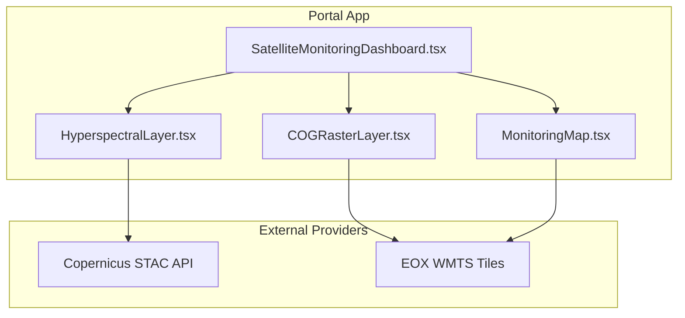
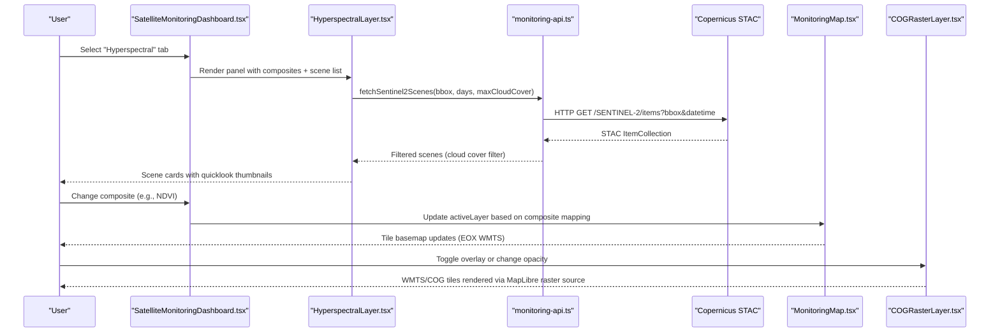
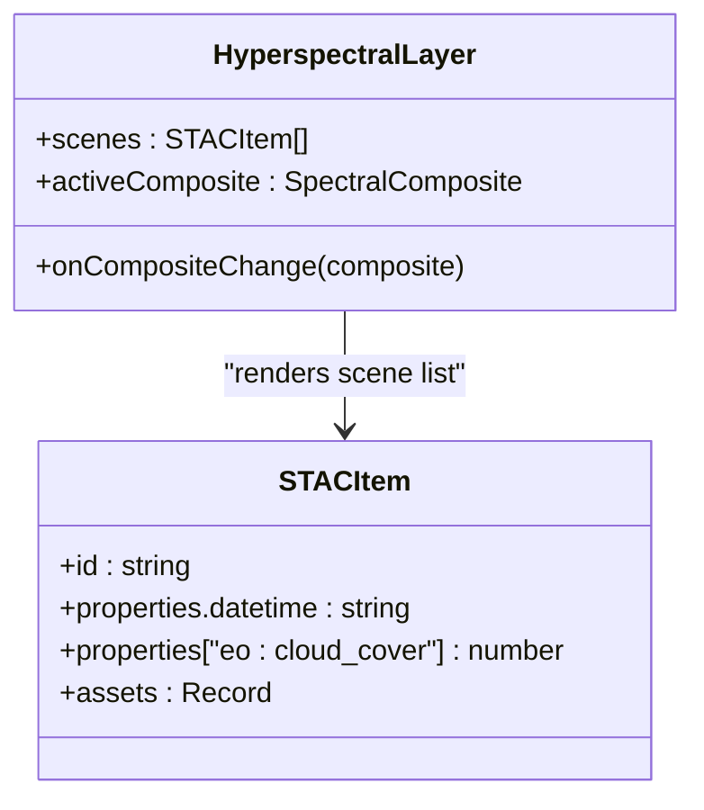
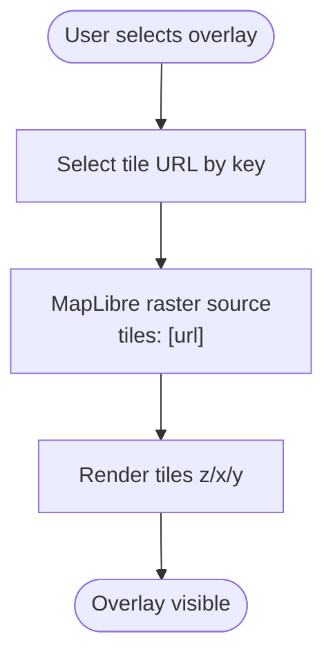
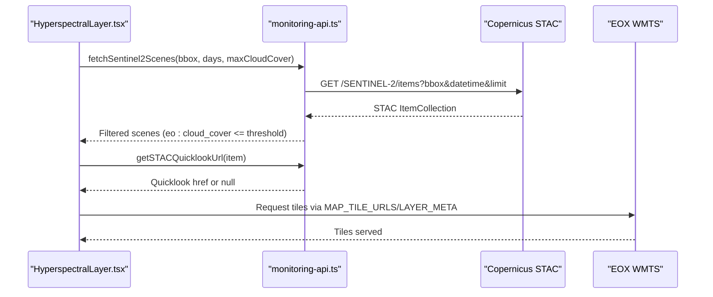
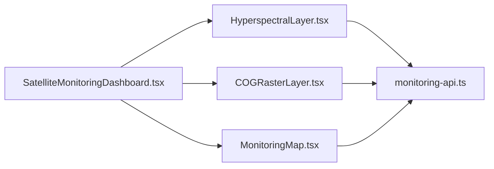

# Hyperspectral Imaging System

<cite>
**Referenced Files in This Document**
- [HyperspectralLayer.tsx](file://apps/portal/features/departments/components/satellite/HyperspectralLayer.tsx)
- [SatelliteMonitoringDashboard.tsx](file://apps/portal/features/departments/components/satellite/SatelliteMonitoringDashboard.tsx)
- [monitoring-api.ts](file://apps/portal/lib/monitoring-api.ts)
- [COGRasterLayer.tsx](file://apps/portal/components/monitoring/COGRasterLayer.tsx)
- [MonitoringMap.tsx](file://apps/portal/components/monitoring/MonitoringMap.tsx)
</cite>

## Table of Contents

1. Introduction
2. Project Structure
3. Core Components
4. Architecture Overview
5. Detailed Component Analysis
6. Dependency Analysis
7. Performance Considerations
8. Troubleshooting Guide
9. Conclusion

## Introduction

This document describes the hyperspectral imaging system implemented in the portal application. It focuses on:

- The HyperspectralLayer component and its spectral band composites
- Integration with external hyperspectral data providers (Copernicus STAC, EOX WMTS)
- High-resolution raster rendering via COG/WMTS endpoints
- Spectral signature analysis for AMD risk indicators
- Data format handling and quality assessment workflows
- Large image tiling, memory management, and performance optimization strategies

The system is a client-side Next.js feature that composes satellite imagery layers, queries Copernicus STAC for Sentinel-2 scenes, and renders tile-based overlays using MapLibre GL and DeckGL.

## Project Structure

Key modules involved in the hyperspectral workflow:

- Feature layer UI: HyperspectralLayer.tsx
- Dashboard orchestration: SatelliteMonitoringDashboard.tsx
- External data integration: monitoring-api.ts
- Raster overlay rendering: COGRasterLayer.tsx
- Base map and deformation overlays: MonitoringMap.tsx

**Diagram sources**

- [SatelliteMonitoringDashboard.tsx](file://apps/portal/features/departments/components/satellite/SatelliteMonitoringDashboard.tsx)
- [HyperspectralLayer.tsx](file://apps/portal/features/departments/components/satellite/HyperspectralLayer.tsx)
- [COGRasterLayer.tsx](file://apps/portal/components/monitoring/COGRasterLayer.tsx)
- [MonitoringMap.tsx](file://apps/portal/components/monitoring/MonitoringMap.tsx)

**Section sources**

- [SatelliteMonitoringDashboard.tsx](file://apps/portal/features/departments/components/satellite/SatelliteMonitoringDashboard.tsx)
- [HyperspectralLayer.tsx](file://apps/portal/features/departments/components/satellite/HyperspectralLayer.tsx)
- [monitoring-api.ts](file://apps/portal/lib/monitoring-api.ts)
- [COGRasterLayer.tsx](file://apps/portal/components/monitoring/COGRasterLayer.tsx)
- [MonitoringMap.tsx](file://apps/portal/components/monitoring/MonitoringMap.tsx)

## Core Components

- HyperspectralLayer: Presents spectral composite options (true color, false color/NIR, NDVI, SWIR geology), metadata, and scene list with quicklook previews.
- SatelliteMonitoringDashboard: Orchestrates tabs, maps, and panels; wires active composite to base map layer selection.
- monitoring-api.ts: Provides STAC query functions, tile URL templates, layer metadata, and helper utilities.
- COGRasterLayer: Renders tile-based overlays (WMTS/COG) via MapLibre raster source and DeckGL BitmapLayer.
- MonitoringMap: Hosts MapLibre map with selectable basemap tiles and deformation scatterplot overlay.

**Section sources**

- [HyperspectralLayer.tsx](file://apps/portal/features/departments/components/satellite/HyperspectralLayer.tsx)
- [SatelliteMonitoringDashboard.tsx](file://apps/portal/features/departments/components/satellite/SatelliteMonitoringDashboard.tsx)
- [monitoring-api.ts](file://apps/portal/lib/monitoring-api.ts)
- [COGRasterLayer.tsx](file://apps/portal/components/monitoring/COGRasterLayer.tsx)
- [MonitoringMap.tsx](file://apps/portal/components/monitoring/MonitoringMap.tsx)

## Architecture Overview

End-to-end flow from user interaction to rendered imagery:

**Diagram sources**

- [SatelliteMonitoringDashboard.tsx](file://apps/portal/features/departments/components/satellite/SatelliteMonitoringDashboard.tsx)
- [HyperspectralLayer.tsx](file://apps/portal/features/departments/components/satellite/HyperspectralLayer.tsx)
- [monitoring-api.ts](file://apps/portal/lib/monitoring-api.ts)
- [COGRasterLayer.tsx](file://apps/portal/components/monitoring/COGRasterLayer.tsx)
- [MonitoringMap.tsx](file://apps/portal/components/monitoring/MonitoringMap.tsx)

## Detailed Component Analysis

### HyperspectralLayer Component

Responsibilities:

- Composite selector with metadata (bands, resolution, use cases)
- AMD risk indicator panel with mineral signatures and band ratios
- Scene list with cloud cover badges, age, and quicklook preview

Data flow:

- Receives scenes array from dashboard
- Uses getSTACQuicklookUrl to render previews
- Displays formatted dates via formatSceneDate

Composite mapping:

- truecolor/falsecolor → optical
- ndvi → ndvi
- geology → geology

**Diagram sources**

- [HyperspectralLayer.tsx](file://apps/portal/features/departments/components/satellite/HyperspectralLayer.tsx)
- [monitoring-api.ts](file://apps/portal/lib/monitoring-api.ts)

**Section sources**

- [HyperspectralLayer.tsx](file://apps/portal/features/departments/components/satellite/HyperspectralLayer.tsx)

### Spectral Band Processing and Composites

Implemented composites:

- True Color: B04/B03/B02 at 10m
- False Color (NIR): B08/B04/B03 at 10m
- NDVI: (B08−B04)/(B08+B04) at 10m
- SWIR Geology: B12/B08/B02 at 20m

Band combinations are defined in the component and mapped to base map layers by the dashboard.

Note: Actual pixel-wise band math is not performed client-side; composites are represented as metadata and used to select appropriate precomputed tile layers where applicable.

**Section sources**

- [HyperspectralLayer.tsx](file://apps/portal/features/departments/components/satellite/HyperspectralLayer.tsx)
- [SatelliteMonitoringDashboard.tsx](file://apps/portal/features/departments/components/satellite/SatelliteMonitoringDashboard.tsx)

### High-Resolution Image Handling (COG/WMTS)

Capabilities:

- Renders tile-based imagery via MapLibre raster source
- Supports multiple overlays (optical, terrain, SAR mosaic, NDVI/geology placeholders)
- DeckGL BitmapLayer configured for overlay presentation

Rendering strategy:

- Tile URLs provided by EOX WMTS endpoints
- MapLibre handles tiling, caching, and GPU-accelerated raster rendering

**Diagram sources**

- [COGRasterLayer.tsx](file://apps/portal/components/monitoring/COGRasterLayer.tsx)
- [MonitoringMap.tsx](file://apps/portal/components/monitoring/MonitoringMap.tsx)

**Section sources**

- [COGRasterLayer.tsx](file://apps/portal/components/monitoring/COGRasterLayer.tsx)
- [MonitoringMap.tsx](file://apps/portal/components/monitoring/MonitoringMap.tsx)

### Integration with External Hyperspectral Data Providers

Providers:

- Copernicus STAC API for Sentinel-2 items
- EOX WMTS for tile services

Integration details:

- fetchSentinel2Scenes constructs bbox/datetime filters and returns features filtered by cloud cover
- getSTACQuicklookUrl resolves thumbnail assets
- MAP_TILE_URLS and LAYER_META define basemaps and attribution

**Diagram sources**

- [monitoring-api.ts](file://apps/portal/lib/monitoring-api.ts)
- [HyperspectralLayer.tsx](file://apps/portal/features/departments/components/satellite/HyperspectralLayer.tsx)

**Section sources**

- [monitoring-api.ts](file://apps/portal/lib/monitoring-api.ts)
- [HyperspectralLayer.tsx](file://apps/portal/features/departments/components/satellite/HyperspectralLayer.tsx)

### Data Format Conversions and Utilities

- STAC item shape is typed and consumed across components
- Date formatting utility for display
- Quicklook asset resolution prioritizes common keys

No heavy binary conversions occur in the browser; processing is limited to metadata and tile requests.

**Section sources**

- [monitoring-api.ts](file://apps/portal/lib/monitoring-api.ts)
- [HyperspectralLayer.tsx](file://apps/portal/features/departments/components/satellite/HyperspectralLayer.tsx)

### Quality Assessment Procedures

- Cloud cover filtering via STAC query parameter and client-side threshold
- Scene age calculation for freshness indication
- Quicklook availability check for preview rendering

These provide basic quality signals for scene selection.

**Section sources**

- [monitoring-api.ts](file://apps/portal/lib/monitoring-api.ts)
- [HyperspectralLayer.tsx](file://apps/portal/features/departments/components/satellite/HyperspectralLayer.tsx)

### Spectral Signature Analysis (AMD Risk Indicators)

The component includes an AMD risk panel listing mineral signatures, associated bands/ratios, and concern descriptions. These are informational and do not perform automated detection.

Examples include:

- Iron oxide/gossan ratio thresholds
- Jarosite and kaolinite/clay ratios
- Carbonate absorption features
- Sulfide exposure dark absorption
- Chlorophyll/algal presence indicators

Use these as guidance for manual interpretation alongside SWIR geology composites.

**Section sources**

- [HyperspectralLayer.tsx](file://apps/portal/features/departments/components/satellite/HyperspectralLayer.tsx)

### Color Correction and Atmospheric Compensation

Current implementation does not apply per-pixel atmospheric correction or color correction in the browser. Composites are presented as metadata and rely on provider-prepared mosaics/tiles. For production-grade radiometric calibration, integrate server-side processing (e.g., Sen2Cor/ACOLITE) and serve corrected products.

[No sources needed since this section provides general guidance]

## Dependency Analysis

Component relationships:

- SatelliteMonitoringDashboard orchestrates HyperspectralLayer, COGRasterLayer, and MonitoringMap
- HyperspectralLayer depends on monitoring-api.ts for STAC queries and helpers
- COGRasterLayer and MonitoringMap depend on MAP_TILE_URLS and LAYER_META for basemaps

**Diagram sources**

- [SatelliteMonitoringDashboard.tsx](file://apps/portal/features/departments/components/satellite/SatelliteMonitoringDashboard.tsx)
- [HyperspectralLayer.tsx](file://apps/portal/features/departments/components/satellite/HyperspectralLayer.tsx)
- [COGRasterLayer.tsx](file://apps/portal/components/monitoring/COGRasterLayer.tsx)
- [MonitoringMap.tsx](file://apps/portal/components/monitoring/MonitoringMap.tsx)
- [monitoring-api.ts](file://apps/portal/lib/monitoring-api.ts)

**Section sources**

- [SatelliteMonitoringDashboard.tsx](file://apps/portal/features/departments/components/satellite/SatelliteMonitoringDashboard.tsx)
- [monitoring-api.ts](file://apps/portal/lib/monitoring-api.ts)

## Performance Considerations

- Tiled rendering: MapLibre raster source efficiently loads tiles on demand, reducing memory footprint
- Dynamic imports: Dashboard uses dynamic() to defer heavy map libraries until needed
- Client-side filtering: STAC results filtered by cloud cover before rendering to minimize UI clutter
- Quickload images: Lazy loading for scene previews reduces initial payload

Recommendations for large imagery:

- Prefer WMTS/COG over full-scene downloads
- Use appropriate zoom levels and tile sizes
- Cache-friendly URLs and short-lived revalidation for STAC responses

[No sources needed since this section provides general guidance]

## Troubleshooting Guide

Common issues and checks:

- No scenes returned: Verify bbox, time window, and cloud cover threshold; ensure STAC endpoint reachable
- Missing quicklooks: Some items may lack preview assets; fallback gracefully
- Basemap not updating: Confirm MAP_TILE_URLS keys match activeLayer selections
- Overlay visibility: Ensure COG tile URL exists for selected composite key

Operational references:

- STAC query parameters and response parsing
- Layer metadata and attribution strings
- Composite-to-layer mapping logic

**Section sources**

- [monitoring-api.ts](file://apps/portal/lib/monitoring-api.ts)
- [SatelliteMonitoringDashboard.tsx](file://apps/portal/features/departments/components/satellite/SatelliteMonitoringDashboard.tsx)
- [COGRasterLayer.tsx](file://apps/portal/components/monitoring/COGRasterLayer.tsx)

## Conclusion

The hyperspectral imaging system integrates Copernicus STAC and EOX WMTS to deliver interactive spectral analysis capabilities within the portal. It emphasizes compositional metadata, scene discovery, and efficient tiled rendering. While advanced atmospheric correction and automated spectral classification are not implemented client-side, the architecture supports future server-side pipelines and richer analytics while maintaining responsive performance through tiling and lazy loading.
