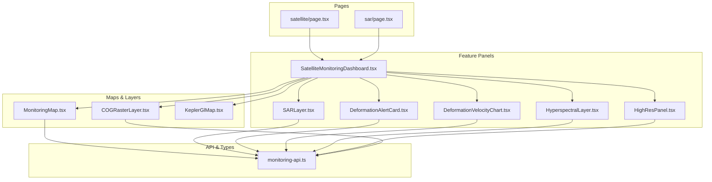
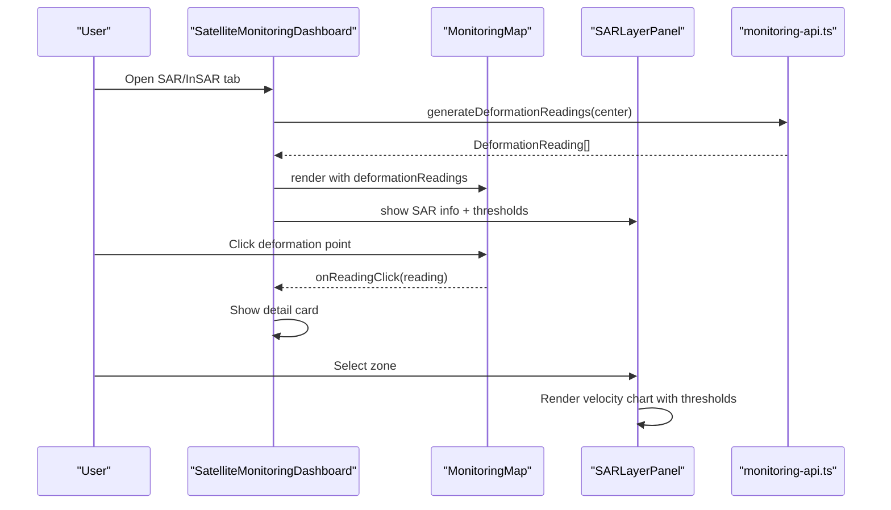
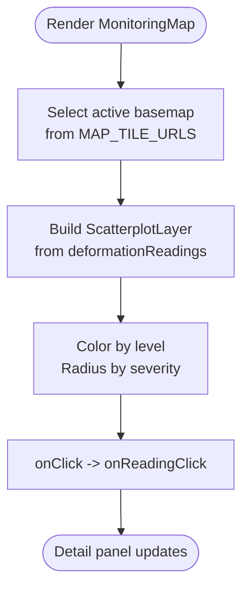
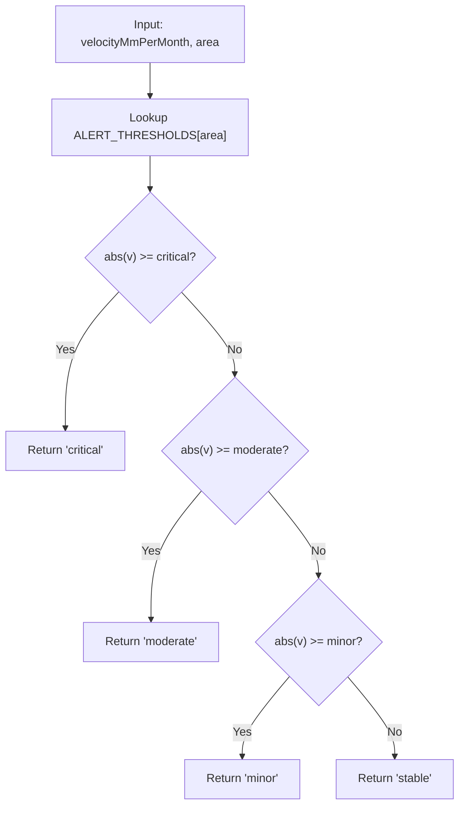
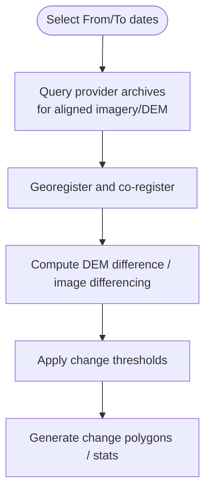
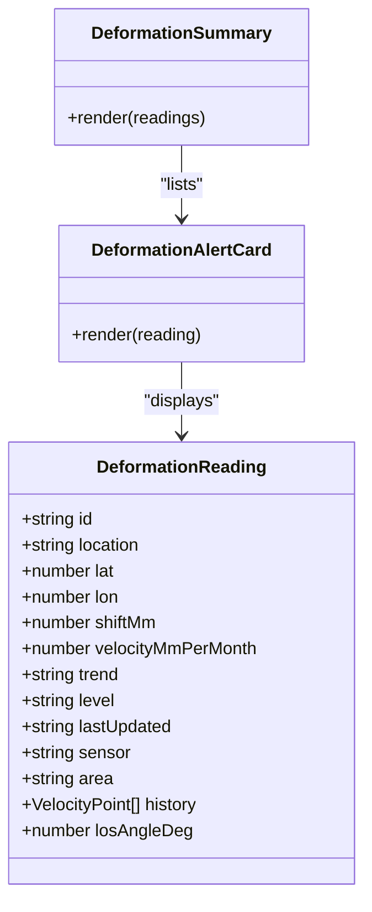
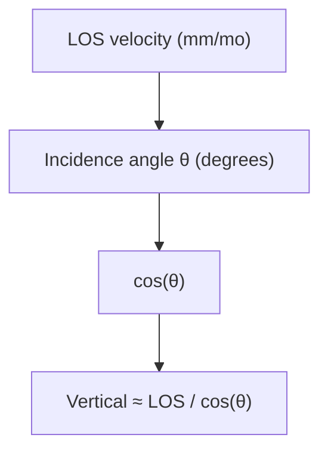
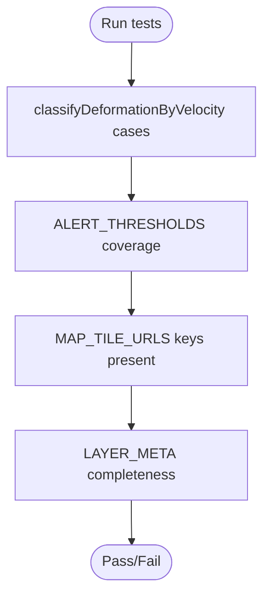
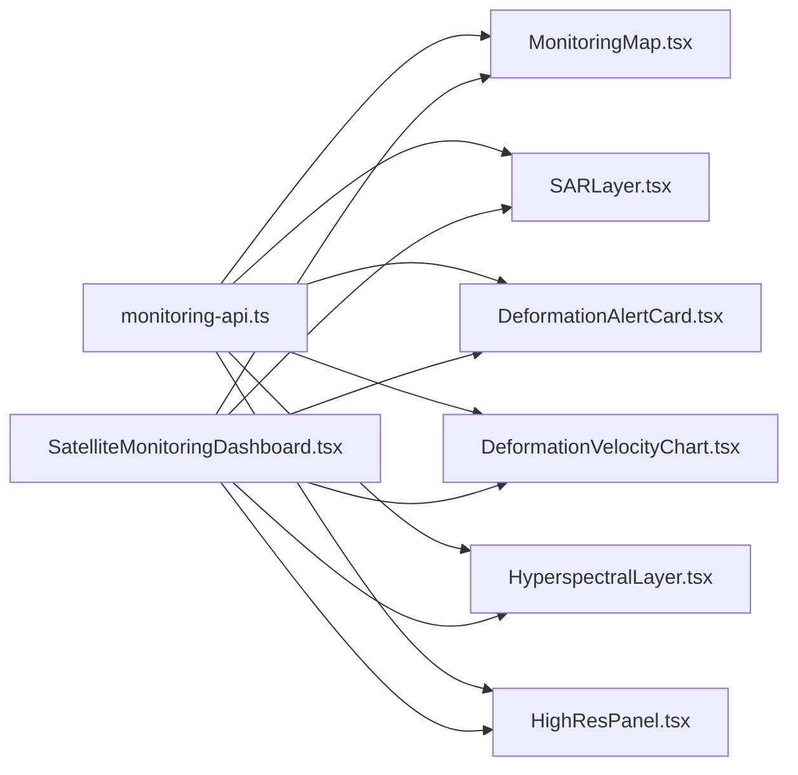

# SAR/InSAR Analysis Tools

<cite>
**Referenced Files in This Document**
- [monitoring-api.ts](file://apps/portal/lib/monitoring-api.ts)
- [MonitoringMap.tsx](file://apps/portal/components/monitoring/MonitoringMap.tsx)
- [SatelliteMonitoringDashboard.tsx](file://apps/portal/features/departments/components/satellite/SatelliteMonitoringDashboard.tsx)
- [SARLayer.tsx](file://apps/portal/features/departments/components/satellite/SARLayer.tsx)
- [DeformationAlertCard.tsx](file://apps/portal/features/departments/components/satellite/DeformationAlertCard.tsx)
- [DeformationVelocityChart.tsx](file://apps/portal/features/departments/components/satellite/DeformationVelocityChart.tsx)
- [COGRasterLayer.tsx](file://apps/portal/components/monitoring/COGRasterLayer.tsx)
- [KeplerGlMap.tsx](file://apps/portal/components/monitoring/KeplerGlMap.tsx)
- [HyperspectralLayer.tsx](file://apps/portal/features/departments/components/satellite/HyperspectralLayer.tsx)
- [HighResPanel.tsx](file://apps/portal/features/departments/components/satellite/HighResPanel.tsx)
- [satellite/page.tsx](file://apps/portal/app/(departments)/[department]/satellite/page.tsx)
- [sar/page.tsx](file://apps/portal/app/(departments)/[department]/sar/page.tsx)
- [monitoring-api.test.ts](file://apps/portal/lib/monitoring-api.test.ts)
</cite>

## Table of Contents

1. [Introduction](#introduction)
2. [Project Structure](#project-structure)
3. [Core Components](#core-components)
4. [Architecture Overview](#architecture-overview)
5. [Detailed Component Analysis](#detailed-component-analysis)
6. [Dependency Analysis](#dependency-analysis)
7. [Performance Considerations](#performance-considerations)
8. [Troubleshooting Guide](#troubleshooting-guide)
9. [Conclusion](#conclusion)
10. [Appendices](#appendices)

## Introduction

This document explains the SAR and InSAR analysis tools implemented in the portal application. It covers:

- The SAR layer implementation for visualizing deformation points and basemaps
- Deformation velocity calculations and alert classification logic
- Change detection workflows using high-resolution imagery and DEM differencing concepts
- Alert system design, threshold configuration, and notification mechanisms
- Mathematical models referenced by the UI (LOS vs vertical decomposition, revisit cadence)
- Practical monitoring workflows and interpretation guidelines

The codebase provides a client-side dashboard that integrates Copernicus STAC queries, WMTS tile sources, and interactive maps to visualize satellite-derived deformation data and related analytics.

## Project Structure

The SAR/InSAR features are primarily implemented under the portal app with a clear separation between shared API utilities and feature-specific components:

- Shared API and types: apps/portal/lib/monitoring-api.ts
- Map rendering and layers: apps/portal/components/monitoring/\*.tsx
- Feature panels: apps/portal/features/departments/components/satellite/\*.tsx
- Pages and routing: apps/portal/app/(departments)/[department]/{satellite,sar}/page.tsx

**Diagram sources**

- [satellite/page.tsx](<file://apps/portal/app/(departments)/[department]/satellite/page.tsx>)
- [sar/page.tsx](<file://apps/portal/app/(departments)/[department]/sar/page.tsx>)
- [SatelliteMonitoringDashboard.tsx](file://apps/portal/features/departments/components/satellite/SatelliteMonitoringDashboard.tsx)
- [SARLayer.tsx](file://apps/portal/features/departments/components/satellite/SARLayer.tsx)
- [DeformationAlertCard.tsx](file://apps/portal/features/departments/components/satellite/DeformationAlertCard.tsx)
- [DeformationVelocityChart.tsx](file://apps/portal/features/departments/components/satellite/DeformationVelocityChart.tsx)
- [HyperspectralLayer.tsx](file://apps/portal/features/departments/components/satellite/HyperspectralLayer.tsx)
- [HighResPanel.tsx](file://apps/portal/features/departments/components/satellite/HighResPanel.tsx)
- [MonitoringMap.tsx](file://apps/portal/components/monitoring/MonitoringMap.tsx)
- [COGRasterLayer.tsx](file://apps/portal/components/monitoring/COGRasterLayer.tsx)
- [KeplerGlMap.tsx](file://apps/portal/components/monitoring/KeplerGlMap.tsx)
- [monitoring-api.ts](file://apps/portal/lib/monitoring-api.ts)

**Section sources**

- [satellite/page.tsx](<file://apps/portal/app/(departments)/[department]/satellite/page.tsx>)
- [sar/page.tsx](<file://apps/portal/app/(departments)/[department]/sar/page.tsx>)
- [SatelliteMonitoringDashboard.tsx](file://apps/portal/features/departments/components/satellite/SatelliteMonitoringDashboard.tsx)

## Core Components

- SatelliteMonitoringDashboard: Orchestrates tabs (Overview, SAR/InSAR, Hyperspectral, High-Res, LiDAR, COG Raster, Kepler.gl), renders the map and contextual panels, and computes KPIs from deformation readings.
- MonitoringMap: Renders a DeckGL + MapLibre map with selectable basemaps and overlays deformation points colored by severity.
- SARLayerPanel: Provides SAR/InSAR context, LOS disclaimer, colormap legend, alert thresholds table, zone velocity chart, acquisition timeline, and recent scene list.
- DeformationAlertCard and DeformationSummary: Visualize individual alerts and summary lists sorted by severity.
- DeformationVelocityChart: Plots monthly velocity history with threshold bands and lines.
- monitoring-api.ts: Central source of types, STAC query helpers, tile URLs, alert thresholds, classification functions, and demo data generation.

Key responsibilities:

- Data model and classification: DeformationReading, VelocityPoint, DeformationArea, DeformationLevel; classifyDeformationByVelocity and generateDeformationReadings.
- Alerts and thresholds: ALERT_THRESHOLDS per area type; used across UI to color-code and annotate.
- Imagery integration: Copernicus STAC queries for Sentinel-1 and Sentinel-2; WMTS tile URLs for basemaps and composites.

**Section sources**

- [SatelliteMonitoringDashboard.tsx](file://apps/portal/features/departments/components/satellite/SatelliteMonitoringDashboard.tsx)
- [MonitoringMap.tsx](file://apps/portal/components/monitoring/MonitoringMap.tsx)
- [SARLayer.tsx](file://apps/portal/features/departments/components/satellite/SARLayer.tsx)
- [DeformationAlertCard.tsx](file://apps/portal/features/departments/components/satellite/DeformationAlertCard.tsx)
- [DeformationVelocityChart.tsx](file://apps/portal/features/departments/components/satellite/DeformationVelocityChart.tsx)
- [monitoring-api.ts](file://apps/portal/lib/monitoring-api.ts)

## Architecture Overview

The system is a client-side React application composed of:

- A dashboard shell coordinating state and tab selection
- A map view integrating DeckGL scatterplot layers over MapLibre raster tiles
- Feature panels providing domain-specific information and controls
- An API module encapsulating STAC queries, tile URLs, and deformation data generation/classification

**Diagram sources**

- [SatelliteMonitoringDashboard.tsx](file://apps/portal/features/departments/components/satellite/SatelliteMonitoringDashboard.tsx)
- [MonitoringMap.tsx](file://apps/portal/components/monitoring/MonitoringMap.tsx)
- [SARLayer.tsx](file://apps/portal/features/departments/components/satellite/SARLayer.tsx)
- [monitoring-api.ts](file://apps/portal/lib/monitoring-api.ts)

## Detailed Component Analysis

### SAR Layer Implementation

- Basemap switching: Uses MAP_TILE_URLS and LAYER_META to switch among optical, terrain, NDVI, geology, OSM, and SAR-themed layers.
- Deformation overlay: ScatterplotLayer renders DeformationReading points with size and color mapped to severity level.
- Interaction: Click events bubble up to the dashboard to display a detail card.

**Diagram sources**

- [MonitoringMap.tsx](file://apps/portal/components/monitoring/MonitoringMap.tsx)
- [monitoring-api.ts](file://apps/portal/lib/monitoring-api.ts)

**Section sources**

- [MonitoringMap.tsx](file://apps/portal/components/monitoring/MonitoringMap.tsx)
- [monitoring-api.ts](file://apps/portal/lib/monitoring-api.ts)

### Deformation Velocity Calculations and Alert Classification

- Thresholds: Per-area velocity thresholds define minor/moderate/critical boundaries.
- Classification: classifyDeformationByVelocity uses absolute velocity to assign levels.
- Demo data: generateDeformationReadings creates representative LOS velocities and trends; generateHistory builds monthly time series.

**Diagram sources**

- [monitoring-api.ts](file://apps/portal/lib/monitoring-api.ts)

**Section sources**

- [monitoring-api.ts](file://apps/portal/lib/monitoring-api.ts)
- [monitoring-api.test.ts](file://apps/portal/lib/monitoring-api.test.ts)

### Change Detection Algorithms

- Conceptual workflow: Compare two dates’ imagery or DEMs to detect changes such as stockpile growth, infrastructure expansion, or water body shifts.
- UI support: HighResPanel includes date range selection and guidance for ordering commercial archive imagery and performing DEM differencing.
- Outputs: Not computed in-app; intended to be integrated via external pipelines or APIs.

[No sources needed since this diagram shows conceptual workflow, not actual code structure]

**Section sources**

- [HighResPanel.tsx](file://apps/portal/features/departments/components/satellite/HighResPanel.tsx)

### Alert System and Notification Mechanisms

- Threshold configuration: ALERT_THRESHOLDS defines per-area velocity limits.
- Visualization: DeformationAlertCard and DeformationSummary highlight critical and moderate alerts with badges and colors.
- Ticker: A separate AlertTicker component displays real-time operational alerts at the hub level.

**Diagram sources**

- [DeformationAlertCard.tsx](file://apps/portal/features/departments/components/satellite/DeformationAlertCard.tsx)
- [monitoring-api.ts](file://apps/portal/lib/monitoring-api.ts)

**Section sources**

- [DeformationAlertCard.tsx](file://apps/portal/features/departments/components/satellite/DeformationAlertCard.tsx)
- [monitoring-api.ts](file://apps/portal/lib/monitoring-api.ts)

### Mathematical Models Referenced by the UI

- LOS vs vertical displacement: SAR measures Line-of-Sight motion; vertical component requires division by cos(incidence angle). The SAR panel calculates an approximate vertical rate from LOS and incidence angle.
- Revisit cadence: getSentinel1RevisitDates illustrates the 12-day repeat cycle (6 days when both satellites are active).
- Time-series: Velocity history represents monthly rates suitable for trend analysis.

**Diagram sources**

- [SARLayer.tsx](file://apps/portal/features/departments/components/satellite/SARLayer.tsx)
- [monitoring-api.ts](file://apps/portal/lib/monitoring-api.ts)

**Section sources**

- [SARLayer.tsx](file://apps/portal/features/departments/components/satellite/SARLayer.tsx)
- [monitoring-api.ts](file://apps/portal/lib/monitoring-api.ts)

### Accuracy Validation Methods

- Unit tests validate classification behavior and threshold coverage across area types.
- Tests assert correct mapping of velocity magnitudes to stable/minor/moderate/critical and confirm per-area thresholds.

**Diagram sources**

- [monitoring-api.test.ts](file://apps/portal/lib/monitoring-api.test.ts)

**Section sources**

- [monitoring-api.test.ts](file://apps/portal/lib/monitoring-api.test.ts)

### Practical Workflows and Interpretation Guidelines

- Monitoring workflow:
  - Open the SAR/InSAR tab to review deformation points and thresholds.
  - Use the zone selector to inspect velocity history and assess acceleration or stabilization.
  - Cross-reference with optical/NDVI/geology basemaps for environmental context.
- Interpretation:
  - Treat values as LOS; convert to vertical using incidence angle if needed.
  - Critical alerts require immediate verification by qualified personnel before operational decisions.
  - Combine multi-temporal trends with ground truth and engineering judgment.

**Section sources**

- [SatelliteMonitoringDashboard.tsx](file://apps/portal/features/departments/components/satellite/SatelliteMonitoringDashboard.tsx)
- [SARLayer.tsx](file://apps/portal/features/departments/components/satellite/SARLayer.tsx)

## Dependency Analysis

- monitoring-api.ts is the central dependency for types, STAC queries, tile URLs, thresholds, and demo data.
- All feature panels and map components import from monitoring-api.ts.
- The dashboard composes multiple dynamic imports for heavy components (map, Kepler.gl, COG raster).

**Diagram sources**

- [monitoring-api.ts](file://apps/portal/lib/monitoring-api.ts)
- [SatelliteMonitoringDashboard.tsx](file://apps/portal/features/departments/components/satellite/SatelliteMonitoringDashboard.tsx)
- [MonitoringMap.tsx](file://apps/portal/components/monitoring/MonitoringMap.tsx)
- [SARLayer.tsx](file://apps/portal/features/departments/components/satellite/SARLayer.tsx)
- [DeformationAlertCard.tsx](file://apps/portal/features/departments/components/satellite/DeformationAlertCard.tsx)
- [DeformationVelocityChart.tsx](file://apps/portal/features/departments/components/satellite/DeformationVelocityChart.tsx)
- [HyperspectralLayer.tsx](file://apps/portal/features/departments/components/satellite/HyperspectralLayer.tsx)
- [HighResPanel.tsx](file://apps/portal/features/departments/components/satellite/HighResPanel.tsx)

**Section sources**

- [monitoring-api.ts](file://apps/portal/lib/monitoring-api.ts)
- [SatelliteMonitoringDashboard.tsx](file://apps/portal/features/departments/components/satellite/SatelliteMonitoringDashboard.tsx)

## Performance Considerations

- Dynamic imports reduce initial bundle size for heavy map components.
- DeckGL scatterplot rendering scales with number of deformation points; consider clustering for large datasets.
- Tile requests depend on WMTS endpoints; caching headers and appropriate zoom levels improve responsiveness.
- Avoid unnecessary re-renders by memoizing derived data where applicable.

[No sources needed since this section provides general guidance]

## Troubleshooting Guide

- No scenes returned: Ensure bounding box and time window are valid; check network connectivity to Copernicus STAC.
- Incorrect classification: Verify ALERT_THRESHOLDS entries and ensure area type matches expected enum values.
- Map not updating: Confirm deformationReadings prop is passed and DeckGL updateTriggers include new data arrays.
- Threshold visualization mismatch: Check that charts compute domainMin/domainMax based on thresholds and that zero line is drawn correctly.

**Section sources**

- [monitoring-api.ts](file://apps/portal/lib/monitoring-api.ts)
- [MonitoringMap.tsx](file://apps/portal/components/monitoring/MonitoringMap.tsx)
- [DeformationVelocityChart.tsx](file://apps/portal/features/departments/components/satellite/DeformationVelocityChart.tsx)

## Conclusion

The SAR/InSAR toolset provides a cohesive, client-side interface for monitoring deformation using satellite data. It integrates STAC queries, WMTS basemaps, and interactive visualizations with robust alerting and threshold-based classification. While full InSAR processing is externalized, the UI supports practical workflows for interpreting LOS measurements, reviewing trends, and coordinating follow-up actions.

[No sources needed since this section summarizes without analyzing specific files]

## Appendices

### Configuration Reference

- Alert thresholds: Defined per area type in monitoring-api.ts.
- Tile sources: MAP_TILE_URLS and LAYER_META control basemaps and attribution.
- Default site bounds: DEFAULT_MINE_BBOX and DEFAULT_MINE_CENTER provide default map centering.

**Section sources**

- [monitoring-api.ts](file://apps/portal/lib/monitoring-api.ts)

### Data Model Summary

- DeformationReading: Represents a monitored location with LOS metrics, trend, severity, and metadata.
- VelocityPoint: Monthly velocity sample for time-series analysis.
- DeformationArea: Enumerated categories for threshold application.

**Section sources**

- [monitoring-api.ts](file://apps/portal/lib/monitoring-api.ts)
