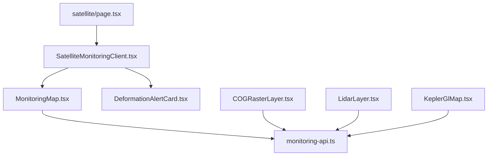
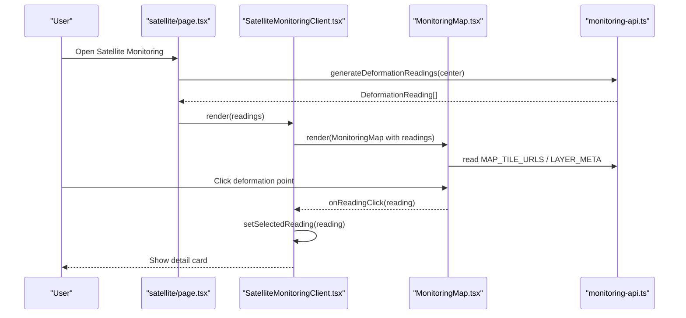
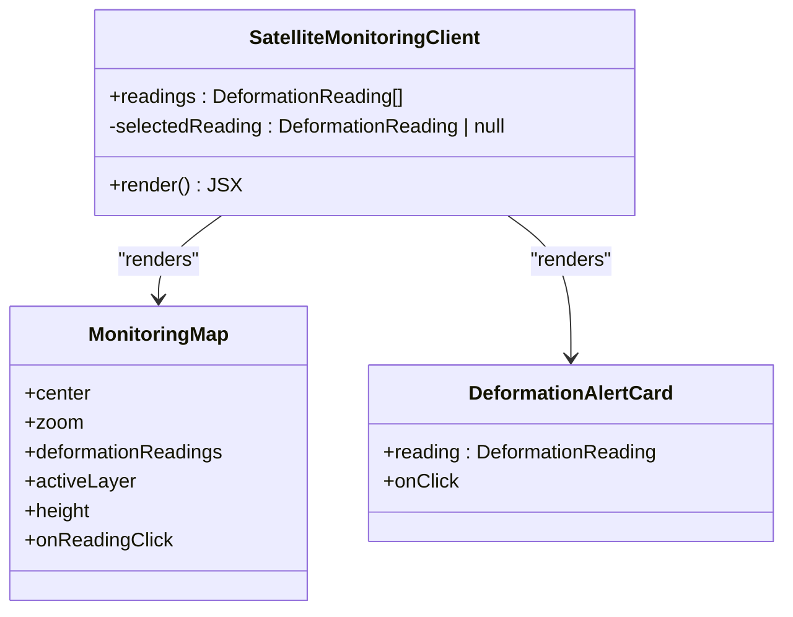
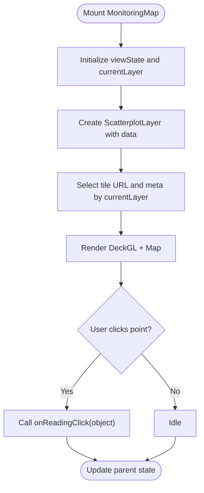
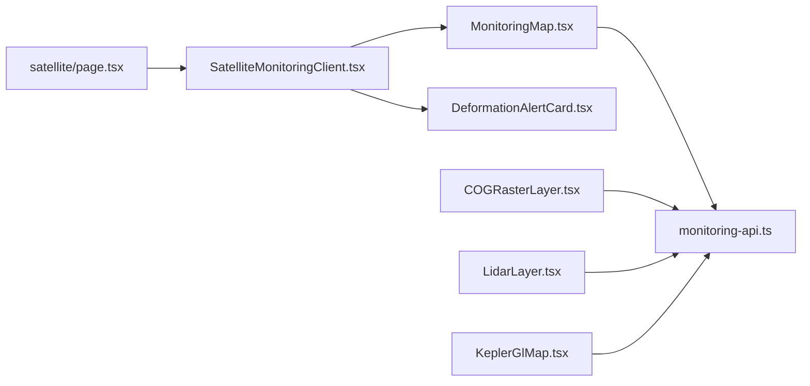

# Satellite Data Visualization

<cite>
**Referenced Files in This Document**
- [SatelliteMonitoringClient.tsx](file://apps/portal/components/monitoring/SatelliteMonitoringClient.tsx)
- [MonitoringMap.tsx](file://apps/portal/components/monitoring/MonitoringMap.tsx)
- [COGRasterLayer.tsx](file://apps/portal/components/monitoring/COGRasterLayer.tsx)
- [LidarLayer.tsx](file://apps/portal/components/monitoring/LidarLayer.tsx)
- [KeplerGlMap.tsx](file://apps/portal/components/monitoring/KeplerGlMap.tsx)
- [monitoring-api.ts](file://apps/portal/lib/monitoring-api.ts)
- [satellite/page.tsx](file://apps/portal/app/(departments)/[department]/satellite/page.tsx)
- [DeformationAlertCard.tsx](file://apps/portal/features/departments/components/satellite/DeformationAlertCard.tsx)
- [useAdaptivePerformance.ts](file://apps/portal/hooks/useAdaptivePerformance.ts)
</cite>

## Table of Contents

1. [Introduction](#introduction)
2. [Project Structure](#project-structure)
3. [Core Components](#core-components)
4. [Architecture Overview](#architecture-overview)
5. [Detailed Component Analysis](#detailed-component-analysis)
6. [Dependency Analysis](#dependency-analysis)
7. [Performance Considerations](#performance-considerations)
8. [Troubleshooting Guide](#troubleshooting-guide)
9. [Conclusion](#conclusion)
10. [Appendices](#appendices)

## Introduction

This document explains the satellite data visualization system implemented in the portal application. It focuses on the SatelliteMonitoringClient component architecture, real-time data streaming patterns, interactive map interfaces, and integration with geospatial libraries (MapLibre GL via react-map-gl and DeckGL). It also covers coordinate systems, multi-layer raster rendering, dashboard layout, user interaction patterns, performance optimization for large datasets, responsive design, zoom controls, and data filtering capabilities.

## Project Structure

The satellite monitoring feature is composed of:

- A page-level controller that generates or receives deformation readings and renders the client UI.
- A client orchestrator that composes the interactive map, selected reading detail, and alert summary.
- Specialized map components for 2D raster overlays, COG band switching, LiDAR point clouds, and Kepler.gl export workflows.
- A shared API module providing tile sources, STAC queries, classification logic, and synthetic data generation.

**Diagram sources**

- [satellite/page.tsx:1-66](<file://apps/portal/app/(departments)/[department]/satellite/page.tsx#L1-L66>)
- [SatelliteMonitoringClient.tsx:1-83](file://apps/portal/components/monitoring/SatelliteMonitoringClient.tsx#L1-L83)
- [MonitoringMap.tsx:1-192](file://apps/portal/components/monitoring/MonitoringMap.tsx#L1-L192)
- [COGRasterLayer.tsx:1-204](file://apps/portal/components/monitoring/COGRasterLayer.tsx#L1-L204)
- [LidarLayer.tsx:1-285](file://apps/portal/components/monitoring/LidarLayer.tsx#L1-L285)
- [KeplerGlMap.tsx:1-176](file://apps/portal/components/monitoring/KeplerGlMap.tsx#L1-L176)
- [monitoring-api.ts:1-398](file://apps/portal/lib/monitoring-api.ts#L1-L398)
- [DeformationAlertCard.tsx:1-153](file://apps/portal/features/departments/components/satellite/DeformationAlertCard.tsx#L1-L153)

**Section sources**

- [satellite/page.tsx:1-66](<file://apps/portal/app/(departments)/[department]/satellite/page.tsx#L1-L66>)
- [SatelliteMonitoringClient.tsx:1-83](file://apps/portal/components/monitoring/SatelliteMonitoringClient.tsx#L1-L83)
- [monitoring-api.ts:1-398](file://apps/portal/lib/monitoring-api.ts#L1-L398)

## Core Components

- SatelliteMonitoringClient: Orchestrates the map, selected reading detail, and alert list. Uses dynamic import to defer heavy map code and provides a loading placeholder.
- MonitoringMap: Renders a DeckGL + MapLibre map with selectable basemaps and a ScatterplotLayer overlay for deformation points.
- COGRasterLayer: Demonstrates WMTS-based raster layers with opacity control and band selection.
- LidarLayerPanel: Visualizes a 3D point cloud using PointCloudLayer with color modes and size controls.
- KeplerGlMap: Generates GeoJSON for export and shows counts by level; integrates with Kepler.gl workflow.
- DeformationAlertCard and DeformationSummary: Provide an alert list and detail view for selected readings.
- monitoring-api: Centralizes types, tile URLs, layer metadata, STAC query helpers, thresholds, and synthetic data generation.

**Section sources**

- [SatelliteMonitoringClient.tsx:1-83](file://apps/portal/components/monitoring/SatelliteMonitoringClient.tsx#L1-L83)
- [MonitoringMap.tsx:1-192](file://apps/portal/components/monitoring/MonitoringMap.tsx#L1-L192)
- [COGRasterLayer.tsx:1-204](file://apps/portal/components/monitoring/COGRasterLayer.tsx#L1-L204)
- [LidarLayer.tsx:1-285](file://apps/portal/components/monitoring/LidarLayer.tsx#L1-L285)
- [KeplerGlMap.tsx:1-176](file://apps/portal/components/monitoring/KeplerGlMap.tsx#L1-L176)
- [DeformationAlertCard.tsx:1-153](file://apps/portal/features/departments/components/satellite/DeformationAlertCard.tsx#L1-L153)
- [monitoring-api.ts:1-398](file://apps/portal/lib/monitoring-api.ts#L1-L398)

## Architecture Overview

The system follows a layered React architecture:

- Page Controller: Prepares data and KPIs, then delegates to the client component.
- Client Orchestrator: Manages local state (selected reading), composes subcomponents, and passes props down.
- Map Layer: Encapsulates DeckGL + MapLibre configuration, basemap switching, and overlay rendering.
- Data Layer: Provides types, constants, STAC utilities, and synthetic data generators.

**Diagram sources**

- [satellite/page.tsx:1-66](<file://apps/portal/app/(departments)/[department]/satellite/page.tsx#L1-L66>)
- [SatelliteMonitoringClient.tsx:1-83](file://apps/portal/components/monitoring/SatelliteMonitoringClient.tsx#L1-L83)
- [MonitoringMap.tsx:1-192](file://apps/portal/components/monitoring/MonitoringMap.tsx#L1-L192)
- [monitoring-api.ts:1-398](file://apps/portal/lib/monitoring-api.ts#L1-L398)

## Detailed Component Analysis

### SatelliteMonitoringClient

Responsibilities:

- Dynamically imports the heavy map component to avoid SSR issues and reduce initial bundle cost.
- Maintains selected reading state and renders a detail card when a point is clicked.
- Composes the map and the alert summary list.

Key behaviors:

- Dynamic import with a loading skeleton ensures smooth perceived performance.
- Passes center, zoom, active layer, height, and click handler to the map.
- Displays a glassmorphic detail card with location, shift, trend, and area.

**Diagram sources**

- [SatelliteMonitoringClient.tsx:1-83](file://apps/portal/components/monitoring/SatelliteMonitoringClient.tsx#L1-L83)
- [MonitoringMap.tsx:1-192](file://apps/portal/components/monitoring/MonitoringMap.tsx#L1-L192)
- [DeformationAlertCard.tsx:1-153](file://apps/portal/features/departments/components/satellite/DeformationAlertCard.tsx#L1-L153)

**Section sources**

- [SatelliteMonitoringClient.tsx:1-83](file://apps/portal/components/monitoring/SatelliteMonitoringClient.tsx#L1-L83)

### MonitoringMap

Responsibilities:

- Wraps DeckGL and MapLibre to render a basemap and a ScatterplotLayer overlay.
- Exposes a layer switcher for multiple basemaps (optical, terrain, SAR, NDVI, geology, OSM).
- Handles view state updates and pointer interactions for picking deformation points.

Coordinate system and tiles:

- Uses EPSG:3857 Web Mercator tiles from EOX and OSM via WMTS/XYZ endpoints.
- Raster source configured with tileSize and min/max zoom.

Overlay details:

- ScatterplotLayer maps lon/lat to positions, colors by level, radius by severity, and supports click events.

**Diagram sources**

- [MonitoringMap.tsx:1-192](file://apps/portal/components/monitoring/MonitoringMap.tsx#L1-L192)
- [monitoring-api.ts:115-172](file://apps/portal/lib/monitoring-api.ts#L115-L172)

**Section sources**

- [MonitoringMap.tsx:1-192](file://apps/portal/components/monitoring/MonitoringMap.tsx#L1-L192)
- [monitoring-api.ts:115-172](file://apps/portal/lib/monitoring-api.ts#L115-L172)

### COGRasterLayer

Responsibilities:

- Demonstrates WMTS-based raster overlays with band/composite selection and opacity control.
- Layers an OSM background beneath the selected composite.

Key features:

- Band selector buttons with descriptions.
- Opacity slider mapped to raster-opacity paint property.
- Attribution and description overlays.

**Section sources**

- [COGRasterLayer.tsx:1-204](file://apps/portal/components/monitoring/COGRasterLayer.tsx#L1-L204)

### LidarLayerPanel

Responsibilities:

- Visualizes airborne LiDAR point clouds using PointCloudLayer.
- Supports color modes (elevation, intensity, classification) and point size control.
- Includes legends for classification and elevation gradients.

Interaction:

- Drag-to-rotate enabled via controller options.
- Cursor changes during drag.

**Section sources**

- [LidarLayer.tsx:1-285](file://apps/portal/components/monitoring/LidarLayer.tsx#L1-L285)

### KeplerGlMap

Responsibilities:

- Generates a dataset of deformation points and exports them as GeoJSON for use in Kepler.gl.
- Shows counts per level and a truncated preview of the generated GeoJSON.

Integration note:

- Provides guidance for integrating kepler.gl Redux store and loading exported GeoJSON.

**Section sources**

- [KeplerGlMap.tsx:1-176](file://apps/portal/components/monitoring/KeplerGlMap.tsx#L1-L176)

### DeformationAlertCard and DeformationSummary

Responsibilities:

- Alert cards display per-reading metrics, icons, and badges based on level and area.
- Summary sorts readings by severity and highlights critical/moderate alerts.

Interactions:

- Clicking a card triggers onReadingClick to select and show details in the client.

**Section sources**

- [DeformationAlertCard.tsx:1-153](file://apps/portal/features/departments/components/satellite/DeformationAlertCard.tsx#L1-L153)

### Data and Tile Sources (monitoring-api)

Responsibilities:

- Defines types for bounding boxes, STAC items, velocity history, and deformation readings.
- Provides alert thresholds per area type and classification functions.
- Supplies tile URLs and human-readable metadata for basemaps.
- Implements STAC queries for Sentinel-1 and Sentinel-2 scenes and quicklook extraction.
- Offers synthetic data generation for demonstration and testing.

Real-time streaming readiness:

- The module exposes fetch functions suitable for polling or SSE/WebSocket integration.
- Revalidation hints are included for server-side caching where applicable.

**Section sources**

- [monitoring-api.ts:1-398](file://apps/portal/lib/monitoring-api.ts#L1-L398)

## Dependency Analysis

High-level dependencies:

- satellite/page.tsx depends on monitoring-api for data and SatelliteMonitoringClient for UI composition.
- SatelliteMonitoringClient dynamically imports MonitoringMap and uses DeformationAlertCard for lists.
- MonitoringMap consumes monitoring-api for tile URLs and metadata.
- COGRasterLayer and LidarLayerPanel are independent but share the same map stack (DeckGL + MapLibre).
- KeplerGlMap produces GeoJSON compatible with external Kepler.gl instances.

**Diagram sources**

- [satellite/page.tsx:1-66](<file://apps/portal/app/(departments)/[department]/satellite/page.tsx#L1-L66>)
- [SatelliteMonitoringClient.tsx:1-83](file://apps/portal/components/monitoring/SatelliteMonitoringClient.tsx#L1-L83)
- [MonitoringMap.tsx:1-192](file://apps/portal/components/monitoring/MonitoringMap.tsx#L1-L192)
- [COGRasterLayer.tsx:1-204](file://apps/portal/components/monitoring/COGRasterLayer.tsx#L1-L204)
- [LidarLayer.tsx:1-285](file://apps/portal/components/monitoring/LidarLayer.tsx#L1-L285)
- [KeplerGlMap.tsx:1-176](file://apps/portal/components/monitoring/KeplerGlMap.tsx#L1-L176)
- [monitoring-api.ts:1-398](file://apps/portal/lib/monitoring-api.ts#L1-L398)

**Section sources**

- [satellite/page.tsx:1-66](<file://apps/portal/app/(departments)/[department]/satellite/page.tsx#L1-L66>)
- [SatelliteMonitoringClient.tsx:1-83](file://apps/portal/components/monitoring/SatelliteMonitoringClient.tsx#L1-L83)
- [MonitoringMap.tsx:1-192](file://apps/portal/components/monitoring/MonitoringMap.tsx#L1-L192)
- [monitoring-api.ts:1-398](file://apps/portal/lib/monitoring-api.ts#L1-L398)

## Performance Considerations

- Dynamic import of the map component reduces initial payload and avoids SSR incompatibilities.
- DeckGL leverages WebGL for efficient rendering of scatter plots and point clouds.
- Adaptive performance hook monitors frame rate and can signal fallback behavior when FPS drops below threshold or Focus Mode is enabled.
- For large datasets:
  - Prefer clustering or binning layers (e.g., HexagonLayer, ClusterLayer) before rendering thousands of points.
  - Use LOD strategies and viewport culling via DeckGL’s built-in optimizations.
  - Limit updateTriggers to necessary fields and batch state updates.
- Raster layers:
  - Use appropriate tileSize and min/max zoom to balance quality and bandwidth.
  - Apply opacity only when needed to reduce overdraw.

**Section sources**

- [SatelliteMonitoringClient.tsx:12-20](file://apps/portal/components/monitoring/SatelliteMonitoringClient.tsx#L12-L20)
- [MonitoringMap.tsx:72-104](file://apps/portal/components/monitoring/MonitoringMap.tsx#L72-L104)
- [useAdaptivePerformance.ts:1-83](file://apps/portal/hooks/useAdaptivePerformance.ts#L1-L83)

## Troubleshooting Guide

Common issues and resolutions:

- Map does not render on first load:
  - Ensure the map component is dynamically imported with ssr disabled and a loading skeleton is provided.
- Basemap tiles fail to load:
  - Verify CORS and network access to WMTS/XYZ endpoints; check attribution strings and tile URL templates.
- Points not clickable:
  - Confirm pickable is true and onClick callback is wired through onReadingClick.
- Poor interactivity on low-end devices:
  - Use the adaptive performance hook to detect low FPS and consider disabling heavy effects or reducing point sizes.
- Large point cloud lag:
  - Reduce pointSize, enable depthTest judiciously, and consider sampling or clustering.

**Section sources**

- [SatelliteMonitoringClient.tsx:12-20](file://apps/portal/components/monitoring/SatelliteMonitoringClient.tsx#L12-L20)
- [MonitoringMap.tsx:94-103](file://apps/portal/components/monitoring/MonitoringMap.tsx#L94-L103)
- [useAdaptivePerformance.ts:1-83](file://apps/portal/hooks/useAdaptivePerformance.ts#L1-L83)

## Conclusion

The satellite monitoring visualization combines a clean React component hierarchy with robust geospatial rendering via DeckGL and MapLibre. The system supports multiple basemaps, interactive overlays, and specialized visualizations for COG rasters and LiDAR point clouds. With dynamic imports, adaptive performance detection, and clear separation of concerns, it scales well for operational dashboards while remaining accessible to users with varying device capabilities.

## Appendices

### Real-Time Data Streaming Patterns

- Polling: Use fetchSentinel1Scenes/fetchSentinel2Scenes at intervals to refresh scene listings.
- Server-Sentenced Events (SSE): Integrate an SSE stream to push new deformation readings into the client state.
- WebSockets: For bidirectional telemetry, maintain a persistent connection and dispatch updates to DeckGL layers.

Implementation notes:

- Debounce or throttle updates to avoid excessive re-renders.
- Normalize incoming data to DeformationReading shape before updating state.
- Use updateTriggers in DeckGL layers to minimize unnecessary recalculations.

**Section sources**

- [monitoring-api.ts:177-226](file://apps/portal/lib/monitoring-api.ts#L177-L226)
- [MonitoringMap.tsx:99-103](file://apps/portal/components/monitoring/MonitoringMap.tsx#L99-L103)

### Dashboard Layout and Interactions

- KPIs: Critical and moderate counts displayed above the map.
- Alerts: Sorted list with severity badges and quick navigation to selected points.
- Detail panel: Glassmorphic card showing location, shift, trend, and area.

**Section sources**

- [satellite/page.tsx:35-62](<file://apps/portal/app/(departments)/[department]/satellite/page.tsx#L35-L62>)
- [DeformationAlertCard.tsx:112-153](file://apps/portal/features/departments/components/satellite/DeformationAlertCard.tsx#L112-L153)
- [SatelliteMonitoringClient.tsx:44-73](file://apps/portal/components/monitoring/SatelliteMonitoringClient.tsx#L44-L73)

### Coordinate Systems and Multi-Layer Rendering

- Coordinates: Lat/lon pairs used for ScatterplotLayer positioning; EPSG:3857 tiles for basemaps.
- Multi-layer: DeckGL layers stacked above MapLibre raster sources; opacity and blending controlled via paint properties.

**Section sources**

- [MonitoringMap.tsx:72-104](file://apps/portal/components/monitoring/MonitoringMap.tsx#L72-L104)
- [COGRasterLayer.tsx:155-193](file://apps/portal/components/monitoring/COGRasterLayer.tsx#L155-L193)

### Responsive Design, Zoom Controls, and Filtering

- Responsive: Height passed as prop; Tailwind classes ensure consistent sizing across breakpoints.
- Zoom/Pan: Provided by DeckGL controller; custom cursors improve UX.
- Filtering: Level-based sorting and alert banners guide attention; additional filters can be added via URL params or form inputs.

**Section sources**

- [SatelliteMonitoringClient.tsx:35-42](file://apps/portal/components/monitoring/SatelliteMonitoringClient.tsx#L35-L42)
- [MonitoringMap.tsx:114-124](file://apps/portal/components/monitoring/MonitoringMap.tsx#L114-L124)
- [DeformationAlertCard.tsx:118-121](file://apps/portal/features/departments/components/satellite/DeformationAlertCard.tsx#L118-L121)
