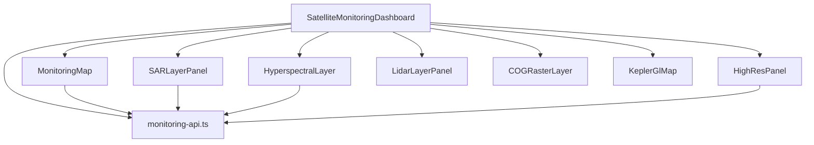
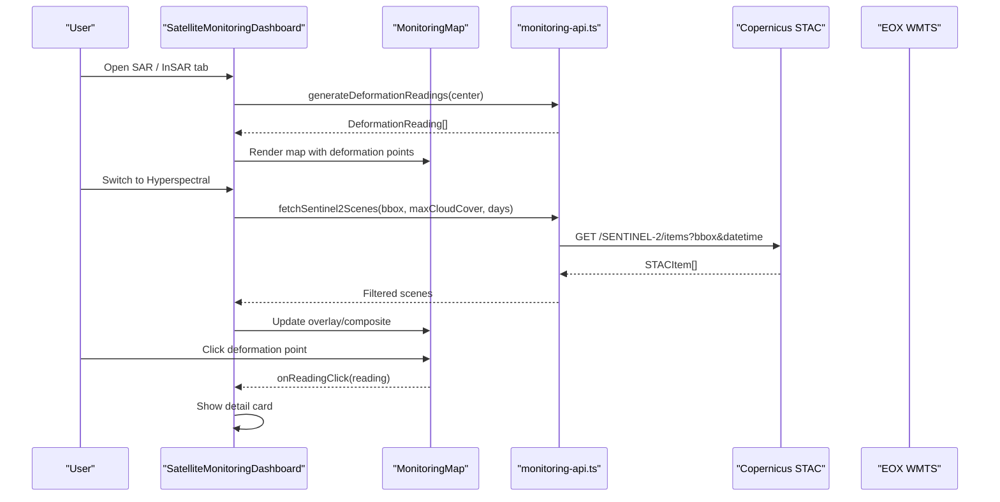
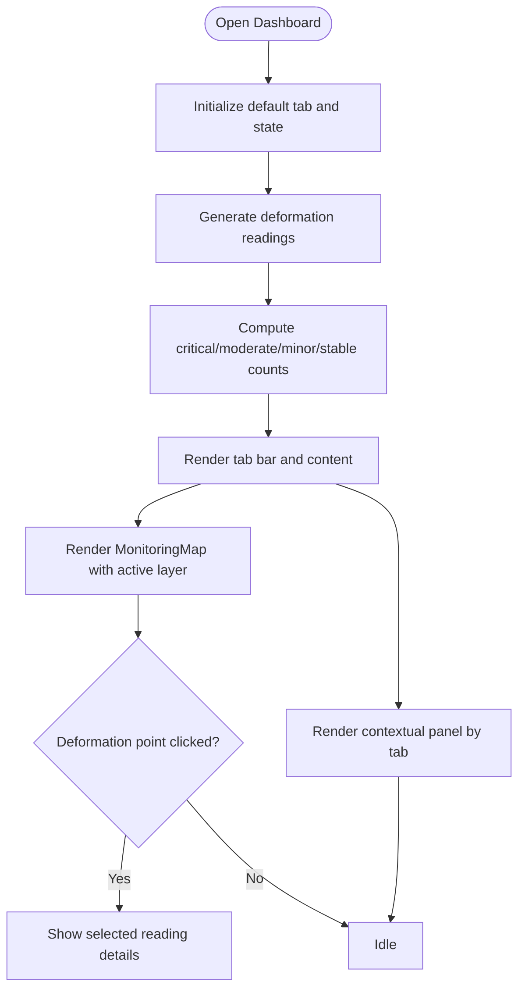
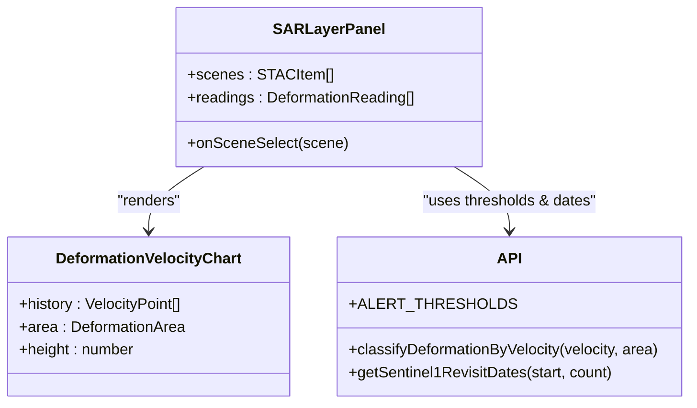
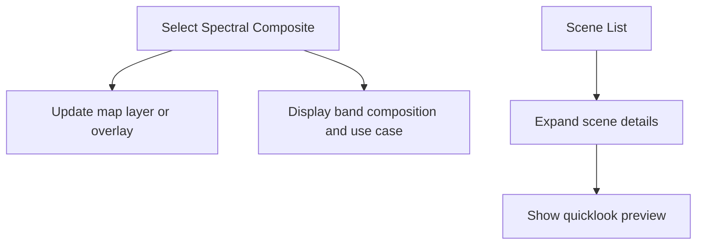
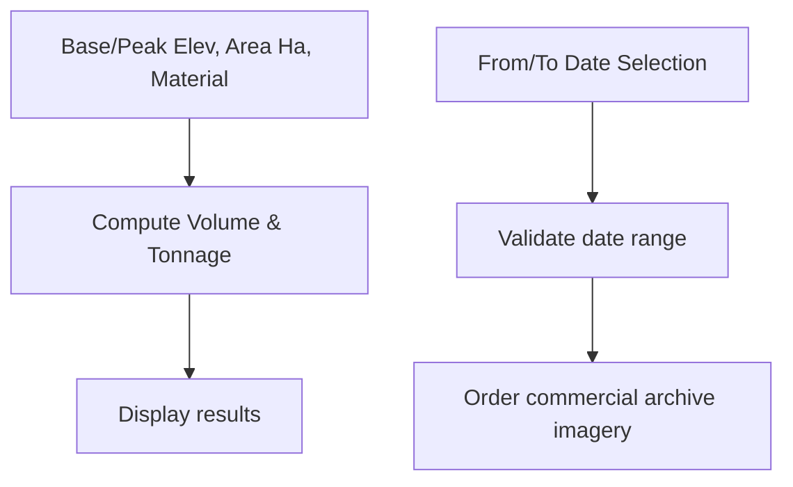
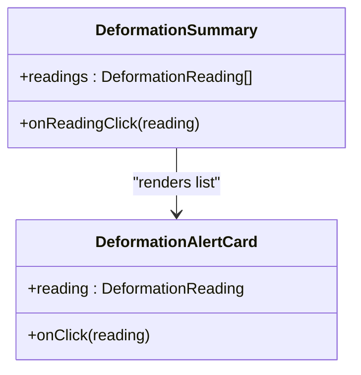
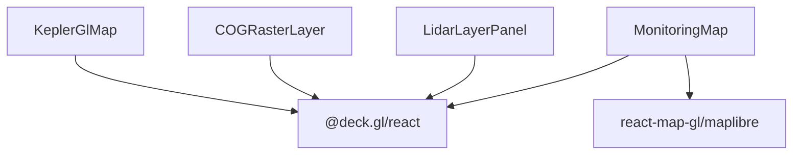
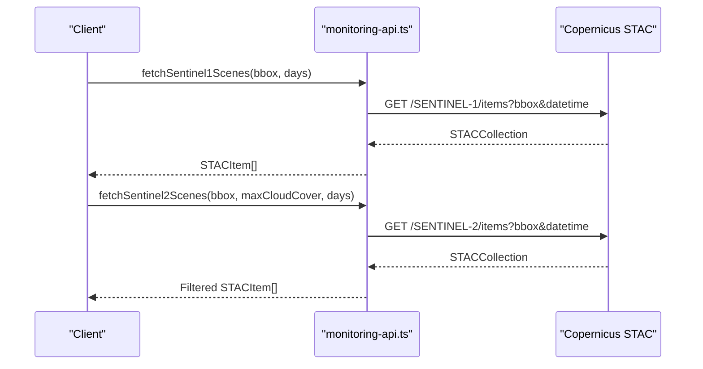
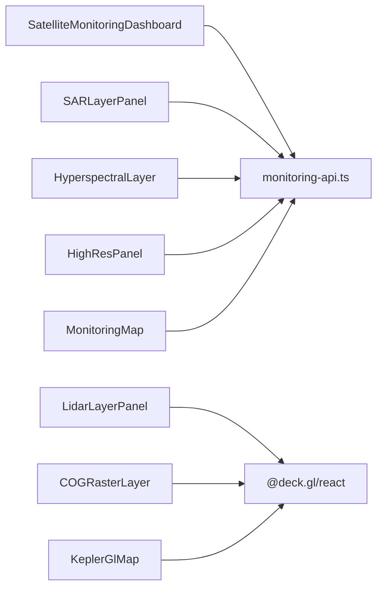

# Satellite Monitoring Department

<cite>
**Referenced Files in This Document**
- [satellite-monitoring-department.md](file://wiki/entities/satellite-monitoring-department.md)
- [monitoring-api.ts](file://apps/portal/lib/monitoring-api.ts)
- [SatelliteMonitoringDashboard.tsx](file://apps/portal/features/departments/components/satellite/SatelliteMonitoringDashboard.tsx)
- [SARLayer.tsx](file://apps/portal/features/departments/components/satellite/SARLayer.tsx)
- [HyperspectralLayer.tsx](file://apps/portal/features/departments/components/satellite/HyperspectralLayer.tsx)
- [HighResPanel.tsx](file://apps/portal/features/departments/components/satellite/HighResPanel.tsx)
- [DeformationAlertCard.tsx](file://apps/portal/features/departments/components/satellite/DeformationAlertCard.tsx)
- [DeformationVelocityChart.tsx](file://apps/portal/features/departments/components/satellite/DeformationVelocityChart.tsx)
- [MonitoringMap.tsx](file://apps/portal/components/monitoring/MonitoringMap.tsx)
- [LidarLayer.tsx](file://apps/portal/components/monitoring/LidarLayer.tsx)
- [COGRasterLayer.tsx](file://apps/portal/components/monitoring/COGRasterLayer.tsx)
- [KeplerGlMap.tsx](file://apps/portal/components/monitoring/KeplerGlMap.tsx)
- [sar/page.tsx](file://apps/portal/app/(departments)/[department]/sar/page.tsx)
- [hyperspectral/page.tsx](file://apps/portal/app/(departments)/[department]/hyperspectral/page.tsx)
- [highres/page.tsx](file://apps/portal/app/(departments)/[department]/highres/page.tsx)
- [monitoring-error-tracking.md](file://wiki/concepts/monitoring-error-tracking.md)
</cite>

## Table of Contents

1. Introduction
2. Project Structure
3. Core Components
4. Architecture Overview
5. Detailed Component Analysis
6. Dependency Analysis
7. Performance Considerations
8. Troubleshooting Guide
9. Conclusion

## Introduction

The Satellite Monitoring department provides advanced geospatial analytics for mining operations, including SAR/InSAR deformation monitoring, hyperspectral imaging analysis, and high-resolution optical imagery workflows. It integrates with open satellite data providers (Copernicus STAC and EOX WMTS), offers interactive map visualizations, and supports change detection and environmental impact assessment tools. The system emphasizes operational clarity through alert thresholds, velocity histories, and provider comparisons to guide decision-making.

## Project Structure

The feature is implemented as a Next.js client application with modular components:

- A dashboard orchestrates tabs for overview, SAR/InSAR, hyperspectral, high-resolution imagery, LiDAR, COG raster, and Kepler.gl views.
- A shared API module centralizes external integrations, tile URLs, scene queries, and deformation classification logic.
- Map layers are rendered via DeckGL + MapLibre GL, with specialized panels for each modality.

**Diagram sources**

- [SatelliteMonitoringDashboard.tsx:1-382](file://apps/portal/features/departments/components/satellite/SatelliteMonitoringDashboard.tsx#L1-L382)
- [MonitoringMap.tsx:1-192](file://apps/portal/components/monitoring/MonitoringMap.tsx#L1-L192)
- [SARLayer.tsx:1-314](file://apps/portal/features/departments/components/satellite/SARLayer.tsx#L1-L314)
- [HyperspectralLayer.tsx:1-378](file://apps/portal/features/departments/components/satellite/HyperspectralLayer.tsx#L1-L378)
- [HighResPanel.tsx:1-447](file://apps/portal/features/departments/components/satellite/HighResPanel.tsx#L1-L447)
- [LidarLayer.tsx:1-104](file://apps/portal/components/monitoring/LidarLayer.tsx#L1-L104)
- [COGRasterLayer.tsx:1-194](file://apps/portal/components/monitoring/COGRasterLayer.tsx#L1-L194)
- [KeplerGlMap.tsx:1-51](file://apps/portal/components/monitoring/KeplerGlMap.tsx#L1-L51)
- [monitoring-api.ts:1-398](file://apps/portal/lib/monitoring-api.ts#L1-L398)

**Section sources**

- [satellite-monitoring-department.md:1-50](file://wiki/entities/satellite-monitoring-department.md#L1-L50)
- [SatelliteMonitoringDashboard.tsx:1-382](file://apps/portal/features/departments/components/satellite/SatelliteMonitoringDashboard.tsx#L1-L382)

## Core Components

- SatelliteMonitoringDashboard: Central UI controller that renders the active tab, KPIs, map, and contextual panels. It composes deformation readings and delegates rendering to specialized layer panels.
- MonitoringMap: Interactive map using DeckGL + MapLibre GL, supporting multiple basemaps and deformation point overlays with click-to-detail behavior.
- SARLayerPanel: SAR/InSAR context panel with colormap legend, alert thresholds by area, zone velocity history charts, acquisition timeline, and scene list integration points.
- HyperspectralLayer: Multispectral composite selector (true color, false color, NDVI, geology), AMD risk indicators, and scene listing with quicklook previews.
- HighResPanel: Commercial imagery use cases, stockpile volume estimator, change detection period selection, and provider comparison table.
- DeformationAlertCard and DeformationSummary: Alert cards and summary view sorted by severity, linking back to map interactions.
- DeformationVelocityChart: SVG-based time series chart with threshold bands and per-area classification coloring.
- LidarLayerPanel, COGRasterLayer, KeplerGlMap: Additional visualization modes for point clouds, COG rasters, and large-scale exploratory mapping.

Key capabilities:

- SAR/InSAR deformation monitoring with LOS displacement interpretation and geotechnical thresholds.
- Hyperspectral band composites for mineral identification and vegetation health.
- High-resolution imagery workflows for change detection and volumetrics.
- Integration with Copernicus STAC and EOX WMTS for free, no-key access.

**Section sources**

- [SatelliteMonitoringDashboard.tsx:1-382](file://apps/portal/features/departments/components/satellite/SatelliteMonitoringDashboard.tsx#L1-L382)
- [MonitoringMap.tsx:1-192](file://apps/portal/components/monitoring/MonitoringMap.tsx#L1-L192)
- [SARLayer.tsx:1-314](file://apps/portal/features/departments/components/satellite/SARLayer.tsx#L1-L314)
- [HyperspectralLayer.tsx:1-378](file://apps/portal/features/departments/components/satellite/HyperspectralLayer.tsx#L1-L378)
- [HighResPanel.tsx:1-447](file://apps/portal/features/departments/components/satellite/HighResPanel.tsx#L1-L447)
- [DeformationAlertCard.tsx:1-153](file://apps/portal/features/departments/components/satellite/DeformationAlertCard.tsx#L1-L153)
- [DeformationVelocityChart.tsx:1-194](file://apps/portal/features/departments/components/satellite/DeformationVelocityChart.tsx#L1-L194)
- [LidarLayer.tsx:1-104](file://apps/portal/components/monitoring/LidarLayer.tsx#L1-L104)
- [COGRasterLayer.tsx:1-194](file://apps/portal/components/monitoring/COGRasterLayer.tsx#L1-L194)
- [KeplerGlMap.tsx:1-51](file://apps/portal/components/monitoring/KeplerGlMap.tsx#L1-L51)
- [monitoring-api.ts:1-398](file://apps/portal/lib/monitoring-api.ts#L1-L398)

## Architecture Overview

The system follows a component-driven architecture:

- The dashboard composes state and delegates to subcomponents.
- The API module encapsulates external integrations and domain logic (classification, thresholds).
- Map layers render via DeckGL + MapLibre GL, with optional overlays for deformation points and COG tiles.

**Diagram sources**

- [SatelliteMonitoringDashboard.tsx:1-382](file://apps/portal/features/departments/components/satellite/SatelliteMonitoringDashboard.tsx#L1-L382)
- [MonitoringMap.tsx:1-192](file://apps/portal/components/monitoring/MonitoringMap.tsx#L1-L192)
- [monitoring-api.ts:176-226](file://apps/portal/lib/monitoring-api.ts#L176-L226)

## Detailed Component Analysis

### SatelliteMonitoringDashboard

- Responsibilities:
  - Manage active tab and composite selection.
  - Generate and aggregate deformation readings for KPIs.
  - Compose map and contextual panels based on tab selection.
- Data flow:
  - Reads center coordinates and bounding box from the API module.
  - Passes deformation readings to map and summary panels.
- Interaction model:
  - Tab switching updates the active map layer and right-side panel.
  - Clicking a deformation point opens a detail card.

**Diagram sources**

- [SatelliteMonitoringDashboard.tsx:1-382](file://apps/portal/features/departments/components/satellite/SatelliteMonitoringDashboard.tsx#L1-L382)
- [monitoring-api.ts:290-369](file://apps/portal/lib/monitoring-api.ts#L290-L369)

**Section sources**

- [SatelliteMonitoringDashboard.tsx:1-382](file://apps/portal/features/departments/components/satellite/SatelliteMonitoringDashboard.tsx#L1-L382)

### SAR/InSAR Analysis (SARLayerPanel)

- Capabilities:
  - Displays LOS deformation colormap legend and area-specific alert thresholds.
  - Shows zone velocity history with incidence angle conversion hints.
  - Provides Sentinel-1 acquisition timeline and scene list integration points.
- Classification:
  - Uses per-area thresholds to classify velocities into stable/minor/moderate/critical.
- Integration:
  - Scene list expects STAC items; currently wired to accept empty arrays but ready for live queries.

**Diagram sources**

- [SARLayer.tsx:1-314](file://apps/portal/features/departments/components/satellite/SARLayer.tsx#L1-L314)
- [DeformationVelocityChart.tsx:1-194](file://apps/portal/features/departments/components/satellite/DeformationVelocityChart.tsx#L1-L194)
- [monitoring-api.ts:86-106](file://apps/portal/lib/monitoring-api.ts#L86-L106)

**Section sources**

- [SARLayer.tsx:1-314](file://apps/portal/features/departments/components/satellite/SARLayer.tsx#L1-L314)
- [DeformationVelocityChart.tsx:1-194](file://apps/portal/features/departments/components/satellite/DeformationVelocityChart.tsx#L1-L194)
- [monitoring-api.ts:86-106](file://apps/portal/lib/monitoring-api.ts#L86-L106)

### Hyperspectral Imaging Tools (HyperspectralLayer)

- Capabilities:
  - Band composite selection (true color, false color, NDVI, geology).
  - AMD risk indicators with spectral signatures and band ratios.
  - Scene listing with cloud cover and quicklook previews.
- Integration:
  - Uses STAC item metadata and quicklook asset resolution.

**Diagram sources**

- [HyperspectralLayer.tsx:1-378](file://apps/portal/features/departments/components/satellite/HyperspectralLayer.tsx#L1-L378)
- [monitoring-api.ts:232-239](file://apps/portal/lib/monitoring-api.ts#L232-L239)

**Section sources**

- [HyperspectralLayer.tsx:1-378](file://apps/portal/features/departments/components/satellite/HyperspectralLayer.tsx#L1-L378)
- [monitoring-api.ts:232-239](file://apps/portal/lib/monitoring-api.ts#L232-L239)

### High-Resolution Imagery and Change Detection (HighResPanel)

- Capabilities:
  - Stockpile volume estimator using DEM-derived base/peak elevation and footprint area.
  - Change detection period selection for multi-temporal analysis.
  - Provider comparison table (resolution, revisit, cost, API key requirements).
- Use cases:
  - Equipment tracking, excavation volumes, infrastructure changes, water body mapping.

**Diagram sources**

- [HighResPanel.tsx:1-447](file://apps/portal/features/departments/components/satellite/HighResPanel.tsx#L1-L447)

**Section sources**

- [HighResPanel.tsx:1-447](file://apps/portal/features/departments/components/satellite/HighResPanel.tsx#L1-L447)

### Deformation Alerts and Summaries

- DeformationAlertCard:
  - Visual severity badges, trend icons, and last updated timestamps.
- DeformationSummary:
  - Aggregates alerts, sorts by severity, and links to map interaction.

**Diagram sources**

- [DeformationAlertCard.tsx:1-153](file://apps/portal/features/departments/components/satellite/DeformationAlertCard.tsx#L1-L153)

**Section sources**

- [DeformationAlertCard.tsx:1-153](file://apps/portal/features/departments/components/satellite/DeformationAlertCard.tsx#L1-L153)

### Mapping and Visualization Layers

- MonitoringMap:
  - DeckGL ScatterplotLayer for deformation points with level-based sizing and colors.
  - Layer switcher for optical, terrain, SAR, NDVI, geology, and OSM basemaps.
- LidarLayerPanel:
  - Point cloud visualization with classification/elevation/intensity modes.
- COGRasterLayer:
  - COG/WMTS raster overlays with opacity control and band combos.
- KeplerGlMap:
  - Large-scale exploratory mapping with synthetic deformation points.

**Diagram sources**

- [MonitoringMap.tsx:1-192](file://apps/portal/components/monitoring/MonitoringMap.tsx#L1-L192)
- [LidarLayer.tsx:1-104](file://apps/portal/components/monitoring/LidarLayer.tsx#L1-L104)
- [COGRasterLayer.tsx:1-194](file://apps/portal/components/monitoring/COGRasterLayer.tsx#L1-L194)
- [KeplerGlMap.tsx:1-51](file://apps/portal/components/monitoring/KeplerGlMap.tsx#L1-L51)

**Section sources**

- [MonitoringMap.tsx:1-192](file://apps/portal/components/monitoring/MonitoringMap.tsx#L1-L192)
- [LidarLayer.tsx:1-104](file://apps/portal/components/monitoring/LidarLayer.tsx#L1-L104)
- [COGRasterLayer.tsx:1-194](file://apps/portal/components/monitoring/COGRasterLayer.tsx#L1-L194)
- [KeplerGlMap.tsx:1-51](file://apps/portal/components/monitoring/KeplerGlMap.tsx#L1-L51)

### External Integrations and Data Providers

- Copernicus STAC:
  - Sentinel-1 and Sentinel-2 scene queries with bbox and datetime filters.
  - Cloud filtering for optical scenes.
- EOX WMTS:
  - Free tile endpoints for optical, terrain, NDVI, and SAR mosaics.
- Revalidation:
  - Server-side caching with revalidate intervals for STAC responses.

**Diagram sources**

- [monitoring-api.ts:176-226](file://apps/portal/lib/monitoring-api.ts#L176-L226)

**Section sources**

- [monitoring-api.ts:176-226](file://apps/portal/lib/monitoring-api.ts#L176-L226)
- [monitoring-error-tracking.md:152-187](file://wiki/concepts/monitoring-error-tracking.md#L152-L187)

### Routing and Entry Points

- Dedicated routes for SAR, hyperspectral, and high-resolution tabs initialize the dashboard with a default tab.

**Section sources**

- [sar/page.tsx](<file://apps/portal/app/(departments)/[department]/sar/page.tsx#L1-L5>)
- [hyperspectral/page.tsx](<file://apps/portal/app/(departments)/[department]/hyperspectral/page.tsx#L1-L5>)
- [highres/page.tsx](<file://apps/portal/app/(departments)/[department]/highres/page.tsx#L1-L5>)

## Dependency Analysis

- Internal dependencies:
  - Dashboard depends on API module for data generation and constants.
  - Panels depend on API types and helpers (formatting, thresholds, STAC utilities).
  - Map components depend on DeckGL and MapLibre GL for rendering.
- External dependencies:
  - Copernicus STAC for scene discovery.
  - EOX WMTS for tile serving.
- Coupling and cohesion:
  - Strong cohesion within panels; low coupling via typed interfaces and centralized API module.
- Potential circular dependencies:
  - None observed; imports are unidirectional from UI to API.

**Diagram sources**

- [SatelliteMonitoringDashboard.tsx:1-382](file://apps/portal/features/departments/components/satellite/SatelliteMonitoringDashboard.tsx#L1-L382)
- [monitoring-api.ts:1-398](file://apps/portal/lib/monitoring-api.ts#L1-L398)
- [MonitoringMap.tsx:1-192](file://apps/portal/components/monitoring/MonitoringMap.tsx#L1-L192)
- [LidarLayer.tsx:1-104](file://apps/portal/components/monitoring/LidarLayer.tsx#L1-L104)
- [COGRasterLayer.tsx:1-194](file://apps/portal/components/monitoring/COGRasterLayer.tsx#L1-L194)
- [KeplerGlMap.tsx:1-51](file://apps/portal/components/monitoring/KeplerGlMap.tsx#L1-L51)

**Section sources**

- [monitoring-api.ts:1-398](file://apps/portal/lib/monitoring-api.ts#L1-L398)
- [SatelliteMonitoringDashboard.tsx:1-382](file://apps/portal/features/departments/components/satellite/SatelliteMonitoringDashboard.tsx#L1-L382)

## Performance Considerations

- Client-side rendering:
  - Heavy map components are dynamically imported to reduce initial bundle size and improve load times.
- Tile caching:
  - STAC responses are cached server-side with revalidation windows to minimize repeated network calls.
- Rendering efficiency:
  - DeckGL layers update triggers are scoped to relevant data arrays to avoid unnecessary redraws.
- Large datasets:
  - For extensive point clouds or rasters, consider streaming or tiling strategies and progressive loading.
- Real-time processing:
  - Introduce WebSocket or SSE channels for live deformation updates and automated anomaly notifications.

[No sources needed since this section provides general guidance]

## Troubleshooting Guide

- No scenes returned:
  - Verify bounding box and time window; adjust cloud cover thresholds for optical scenes.
- Incorrect layer display:
  - Ensure correct WMTS template URL and attribution settings; confirm layer key matches configuration.
- Deformation classification anomalies:
  - Check per-area thresholds and LOS vs vertical decomposition notes; validate input units (mm/month).
- Map interactivity issues:
  - Confirm DeckGL view state updates and pickable layer configurations; inspect console for WebGL errors.

**Section sources**

- [monitoring-api.ts:176-226](file://apps/portal/lib/monitoring-api.ts#L176-L226)
- [MonitoringMap.tsx:72-104](file://apps/portal/components/monitoring/MonitoringMap.tsx#L72-L104)
- [SARLayer.tsx:116-174](file://apps/portal/features/departments/components/satellite/SARLayer.tsx#L116-L174)

## Conclusion

The Satellite Monitoring department delivers a comprehensive, extensible platform for SAR/InSAR deformation monitoring, hyperspectral analysis, and high-resolution change detection. Its modular architecture, clear alert thresholds, and robust map visualizations enable actionable insights for mining operations. Future enhancements can focus on real-time data streams, expanded provider integrations, and advanced automated anomaly detection pipelines.
