# Certification Tracking

<cite>
**Referenced Files in This Document**
- [training-department.md](file://wiki/entities/training-department.md)
- [database-schema.md](file://wiki/concepts/database-schema.md)
- [016_schema_enhancements.sql](file://packages/supabase/migrations/016_schema_enhancements.sql)
- [certifications-page.tsx](file://apps/portal/app/(departments)/training/certifications/page.tsx)
- [training-overview-page.tsx](file://apps/portal/app/(departments)/training/page.tsx)
- [department-features.md](file://wiki/concepts/department-features.md)
</cite>

## Table of Contents

1. [Introduction](#introduction)
2. [Project Structure](#project-structure)
3. [Core Components](#core-components)
4. [Architecture Overview](#architecture-overview)
5. [Detailed Component Analysis](#detailed-component-analysis)
6. [Dependency Analysis](#dependency-analysis)
7. [Performance Considerations](#performance-considerations)
8. [Troubleshooting Guide](#troubleshooting-guide)
9. [Conclusion](#conclusion)

## Introduction

This document describes the certification tracking system within the Training department. It covers certification types, requirements definition, issuance workflows, employee assignment, completion tracking, expiration monitoring, automated alerts for upcoming expirations, renewal processes, and compliance reporting. It also documents data models, validation rules, integration with employee records, audit trails for changes, and regulatory compliance features.

## Project Structure

The certification tracking capability is part of the Training department feature set and includes:

- A training overview page that highlights recent certifications and status indicators
- A dedicated certifications page that lists, filters, and displays certification statuses
- Database schema documentation describing core tables including certifications and related entities
- Migration enhancements that introduce native enums, audit columns, and generated columns across operational tables

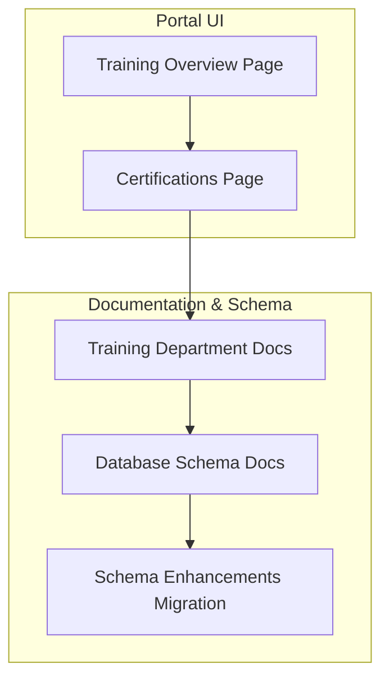

**Diagram sources**

- [training-overview-page.tsx](<file://apps/portal/app/(departments)/training/page.tsx>)
- [certifications-page.tsx](<file://apps/portal/app/(departments)/training/certifications/page.tsx>)
- [training-department.md](file://wiki/entities/training-department.md)
- [database-schema.md](file://wiki/concepts/database-schema.md)
- [016_schema_enhancements.sql](file://packages/supabase/migrations/016_schema_enhancements.sql)

**Section sources**

- [training-department.md](file://wiki/entities/training-department.md)
- [database-schema.md](file://wiki/concepts/database-schema.md)
- [certifications-page.tsx](<file://apps/portal/app/(departments)/training/certifications/page.tsx>)
- [training-overview-page.tsx](<file://apps/portal/app/(departments)/training/page.tsx>)

## Core Components

- Training department scope: LMS, certifications, competency tracking, and reports
- Certifications table: stores active certifications with expiry dates
- Expiration monitoring: queries to surface renewals due within a defined window (e.g., 30 days)
- Dashboard KPIs: active courses, compliance rate, pending assessments, expiring certifications
- Audit trail: central audit logs capturing insert/update/delete actions with actor and context

Key implementation anchors:

- Data model references and expiry query pattern are documented in the training entity docs
- The database schema docs describe RLS patterns, audit logs, and core tables
- The certifications page provides filtering and status visualization for Active, Expiring Soon, and Expired states

**Section sources**

- [training-department.md](file://wiki/entities/training-department.md)
- [database-schema.md](file://wiki/concepts/database-schema.md)
- [certifications-page.tsx](<file://apps/portal/app/(departments)/training/certifications/page.tsx>)

## Architecture Overview

The certification tracking system integrates portal UI components with database-backed records and audit mechanisms. The UI surfaces certification status and supports filtering by search terms and status. The backend relies on PostgreSQL with Row Level Security (RLS) policies scoped by department and maintains an audit trail for change history.

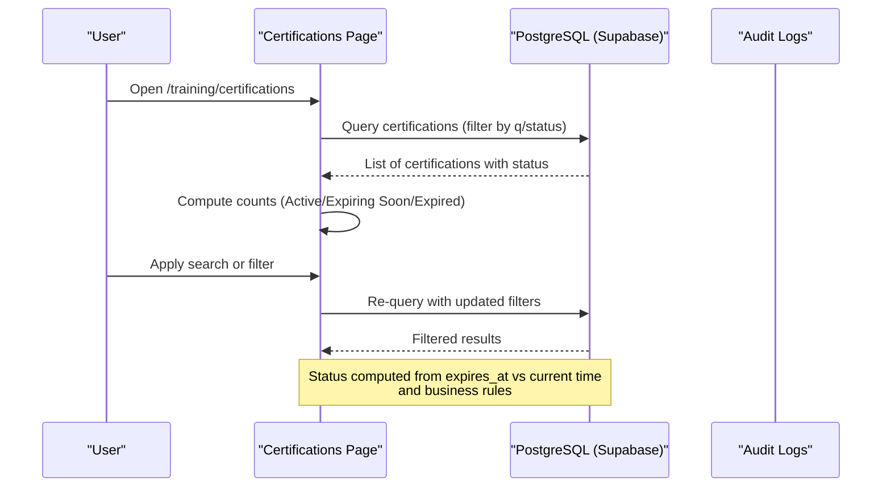

**Diagram sources**

- [certifications-page.tsx](<file://apps/portal/app/(departments)/training/certifications/page.tsx>)
- [database-schema.md](file://wiki/concepts/database-schema.md)

## Detailed Component Analysis

### Data Model and Relationships

The training domain centers around employees, certifications, training records, and course catalog entries. The certifications table captures issued and expired dates per employee and cert type. The audit_logs table records all changes with actor identity and department scoping.

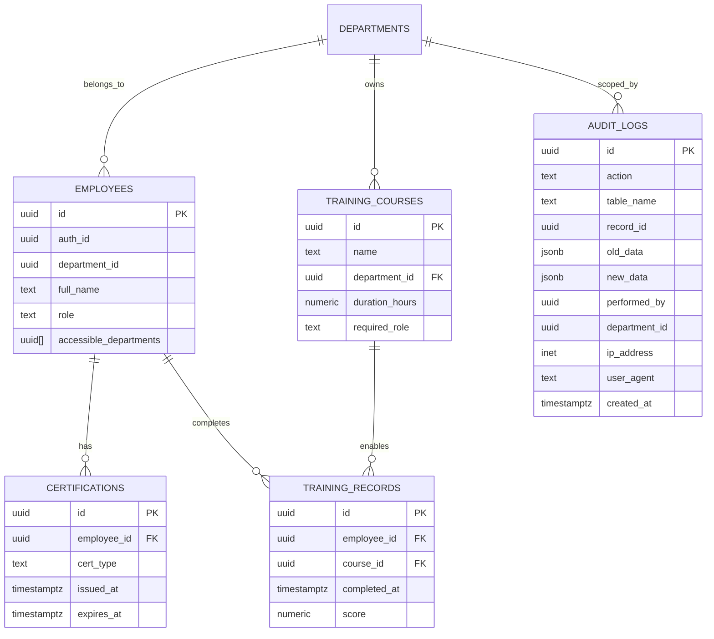

Notes:

- The certifications table fields align with the documented schema description for training entity
- Audit logs capture insert/update/delete events with JSONB snapshots and actor metadata
- RLS policies restrict access based on department membership and roles

**Diagram sources**

- [training-department.md](file://wiki/entities/training-department.md)
- [database-schema.md](file://wiki/concepts/database-schema.md)

**Section sources**

- [training-department.md](file://wiki/entities/training-department.md)
- [database-schema.md](file://wiki/concepts/database-schema.md)

### Issuance Workflow

Issuing a certification involves creating a record in the certifications table with employee linkage, cert type, issue date, and expiry date. The process should be audited via audit_logs and enforced by RLS policies tied to department membership.

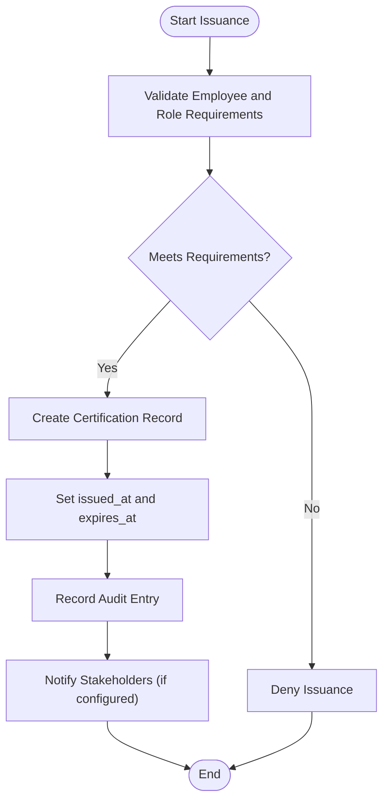

Implementation anchors:

- Validation rules can reference required roles and course completions from training_records and training_courses
- Audit entry creation leverages the audit_logs structure described in the schema docs

**Diagram sources**

- [training-department.md](file://wiki/entities/training-department.md)
- [database-schema.md](file://wiki/concepts/database-schema.md)

**Section sources**

- [training-department.md](file://wiki/entities/training-department.md)
- [database-schema.md](file://wiki/concepts/database-schema.md)

### Completion Tracking

Completion tracking associates employees with training records upon course completion, optionally scoring outcomes. This feeds into compliance calculations and informs eligibility for certifications.

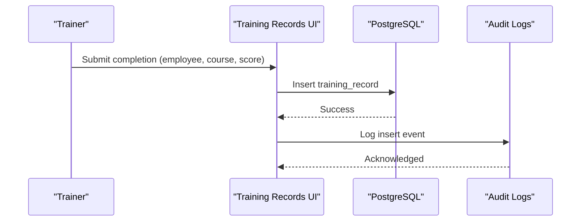

**Diagram sources**

- [training-department.md](file://wiki/entities/training-department.md)
- [database-schema.md](file://wiki/concepts/database-schema.md)

**Section sources**

- [training-department.md](file://wiki/entities/training-department.md)
- [database-schema.md](file://wiki/concepts/database-schema.md)

### Expiration Monitoring and Automated Alerts

Expiration monitoring uses queries against the certifications table to identify records nearing expiry. The documented approach surfaces certifications where expires_at falls within a threshold window (e.g., 30 days).

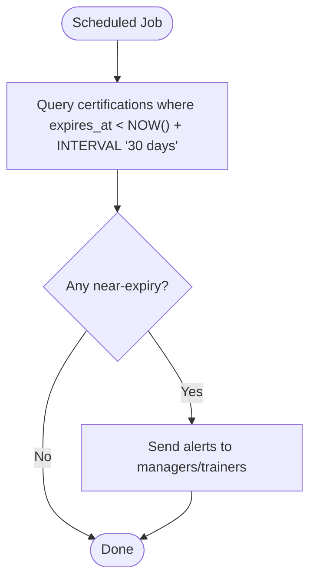

**Diagram sources**

- [training-department.md](file://wiki/entities/training-department.md)

**Section sources**

- [training-department.md](file://wiki/entities/training-department.md)

### Renewal Process

Renewal involves issuing a new certification record after retraining or reassessment. The workflow mirrors issuance but may include checks for prior expiry and mandatory refresher courses.

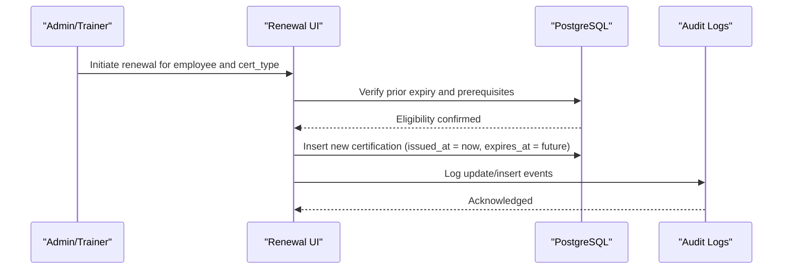

**Diagram sources**

- [training-department.md](file://wiki/entities/training-department.md)
- [database-schema.md](file://wiki/concepts/database-schema.md)

**Section sources**

- [training-department.md](file://wiki/entities/training-department.md)
- [database-schema.md](file://wiki/concepts/database-schema.md)

### Compliance Reporting

Compliance reporting aggregates certification status across departments and roles. Key metrics include compliance rate and counts of expiring certifications. The training dashboard KPIs provide a foundation for these reports.

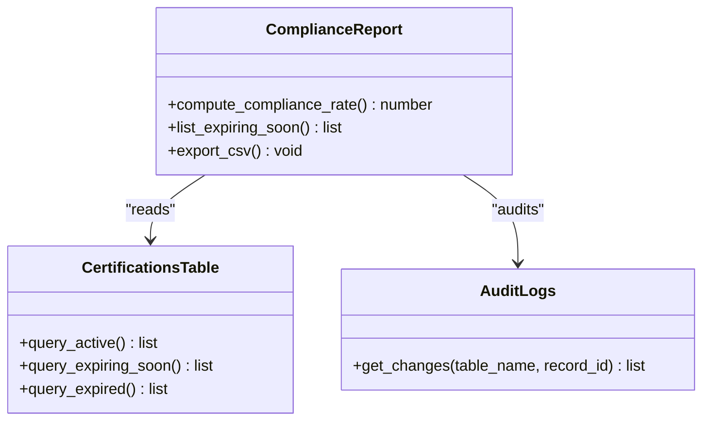

**Diagram sources**

- [training-department.md](file://wiki/entities/training-department.md)
- [database-schema.md](file://wiki/concepts/database-schema.md)

**Section sources**

- [training-department.md](file://wiki/entities/training-department.md)
- [database-schema.md](file://wiki/concepts/database-schema.md)

### UI Components and Filtering

The certifications page implements client-side filtering by search term and status, rendering status badges for Active, Expiring Soon, and Expired. The training overview page highlights recent certifications and their statuses.

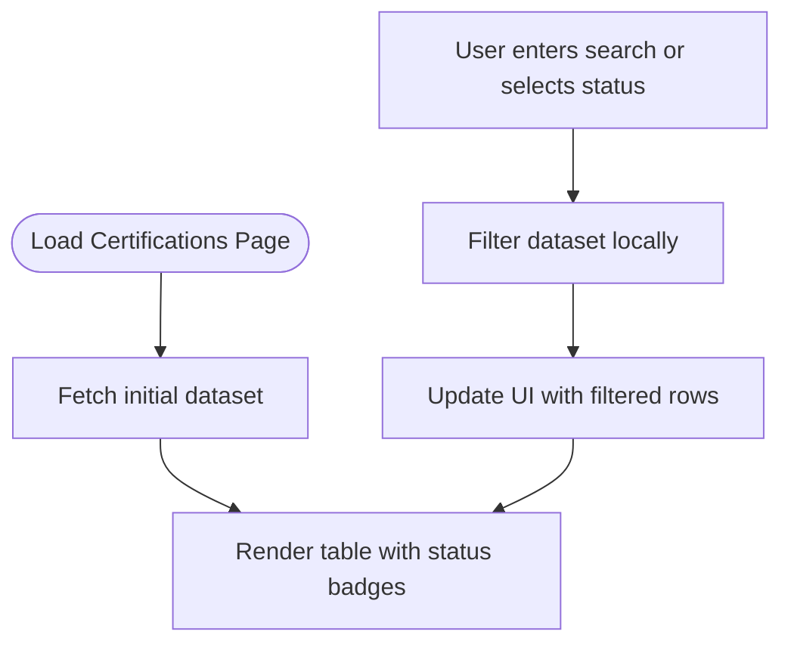

**Diagram sources**

- [certifications-page.tsx](<file://apps/portal/app/(departments)/training/certifications/page.tsx>)
- [training-overview-page.tsx](<file://apps/portal/app/(departments)/training/page.tsx>)

**Section sources**

- [certifications-page.tsx](<file://apps/portal/app/(departments)/training/certifications/page.tsx>)
- [training-overview-page.tsx](<file://apps/portal/app/(departments)/training/page.tsx>)

### Integration with Employee Records

Employees are linked to certifications through foreign keys and accessed via RLS policies. The employees table defines role and department membership, which govern access and eligibility for certifications.

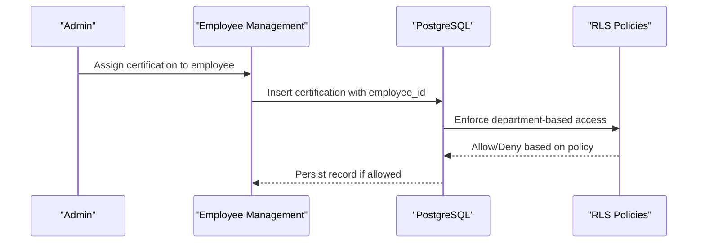

**Diagram sources**

- [database-schema.md](file://wiki/concepts/database-schema.md)

**Section sources**

- [database-schema.md](file://wiki/concepts/database-schema.md)

### Audit Trails and Regulatory Compliance

Audit logs capture insert/update/delete operations with actor identity, IP address, and user agent. This supports traceability and compliance audits. Generated columns and enum types improve data integrity and performance.

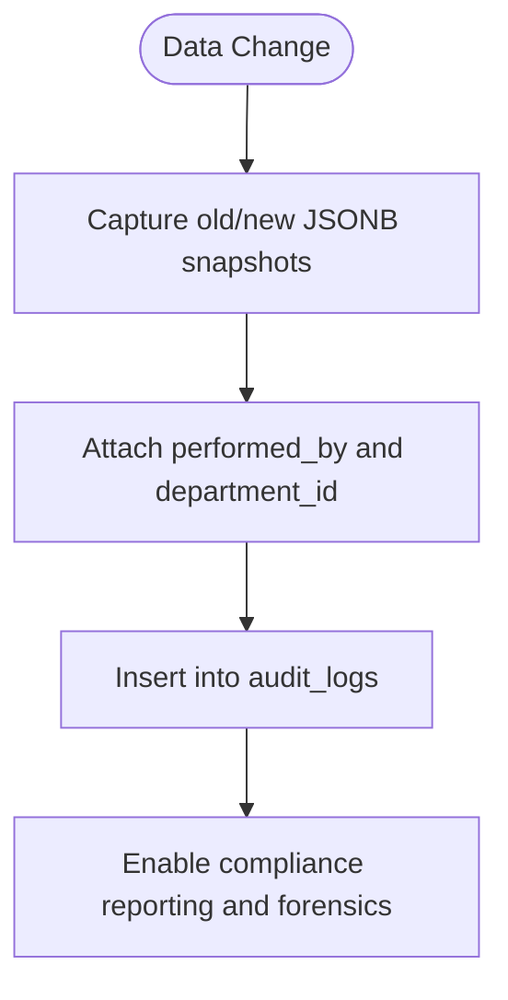

**Diagram sources**

- [database-schema.md](file://wiki/concepts/database-schema.md)
- [016_schema_enhancements.sql](file://packages/supabase/migrations/016_schema_enhancements.sql)

**Section sources**

- [database-schema.md](file://wiki/concepts/database-schema.md)
- [016_schema_enhancements.sql](file://packages/supabase/migrations/016_schema_enhancements.sql)

## Dependency Analysis

The certification tracking feature depends on:

- Portal UI pages for listing and filtering certifications
- Database schema definitions for certifications, training records, and audit logs
- RLS policies and employee records for access control
- Migration enhancements for enums, audit columns, and generated columns

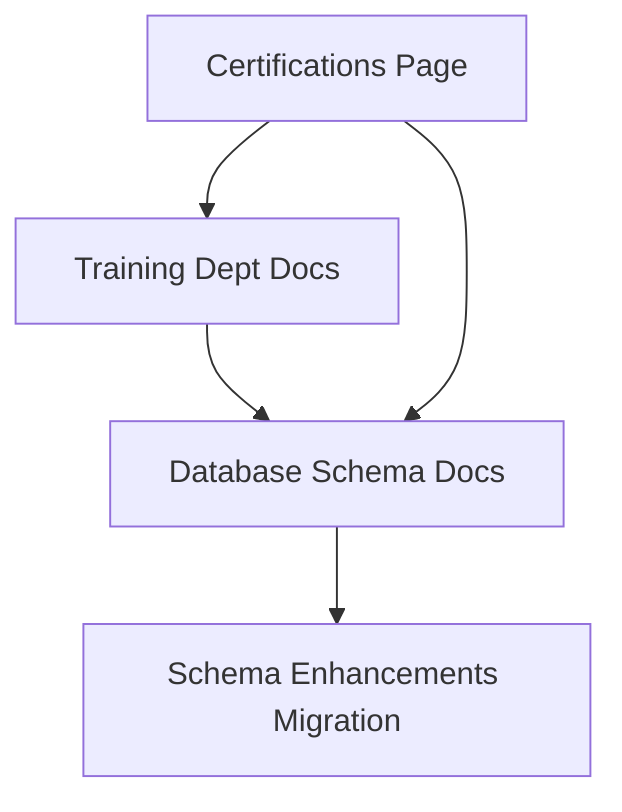

**Diagram sources**

- [certifications-page.tsx](<file://apps/portal/app/(departments)/training/certifications/page.tsx>)
- [training-department.md](file://wiki/entities/training-department.md)
- [database-schema.md](file://wiki/concepts/database-schema.md)
- [016_schema_enhancements.sql](file://packages/supabase/migrations/016_schema_enhancements.sql)

**Section sources**

- [certifications-page.tsx](<file://apps/portal/app/(departments)/training/certifications/page.tsx>)
- [training-department.md](file://wiki/entities/training-department.md)
- [database-schema.md](file://wiki/concepts/database-schema.md)
- [016_schema_enhancements.sql](file://packages/supabase/migrations/016_schema_enhancements.sql)

## Performance Considerations

- Use indexes on frequently queried columns such as employee_id, cert_type, and expires_at to optimize filtering and expiration queries
- Leverage materialized views for heavy aggregation when generating compliance reports
- Partition time-series data if certification records grow significantly over time
- Cache near-expiry lists for scheduled jobs to reduce repeated scans

[No sources needed since this section provides general guidance]

## Troubleshooting Guide

Common issues and resolutions:

- Missing certifications in filtered results: verify search parameters and status filters; ensure expires_at values are correctly set
- Access denied when assigning certifications: confirm employee’s department membership and RLS policy alignment
- Audit log gaps: check trigger configurations and permissions for audit_logs inserts
- Expiration alerts not firing: validate scheduled job execution and query thresholds

**Section sources**

- [certifications-page.tsx](<file://apps/portal/app/(departments)/training/certifications/page.tsx>)
- [database-schema.md](file://wiki/concepts/database-schema.md)

## Conclusion

The certification tracking system integrates portal UI, robust database schemas, and comprehensive audit capabilities to support issuance, completion tracking, expiration monitoring, and compliance reporting. With clear data models, RLS-enforced access, and audit trails, the system provides a solid foundation for regulatory compliance and operational efficiency.

[No sources needed since this section summarizes without analyzing specific files]
