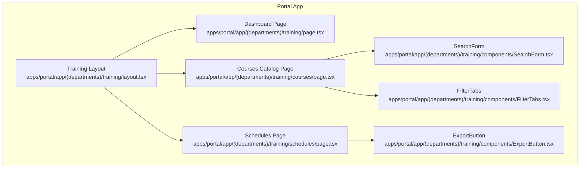
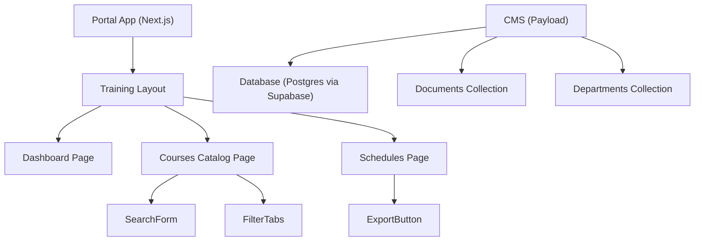
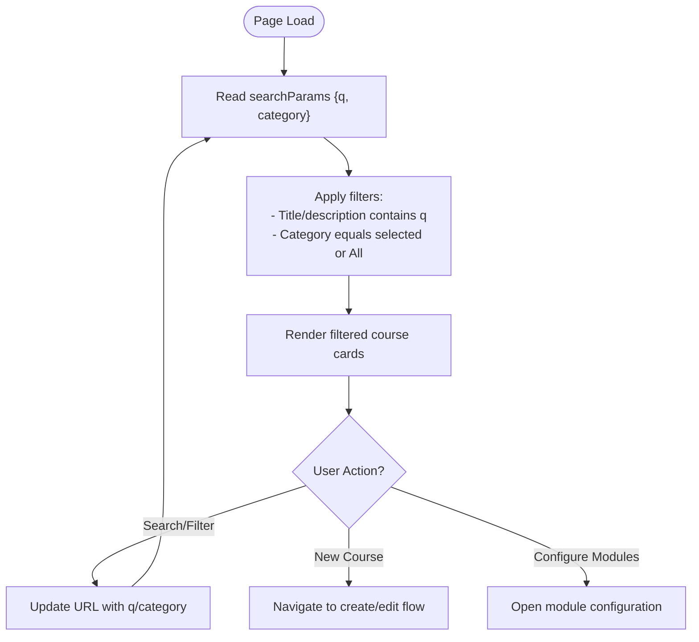
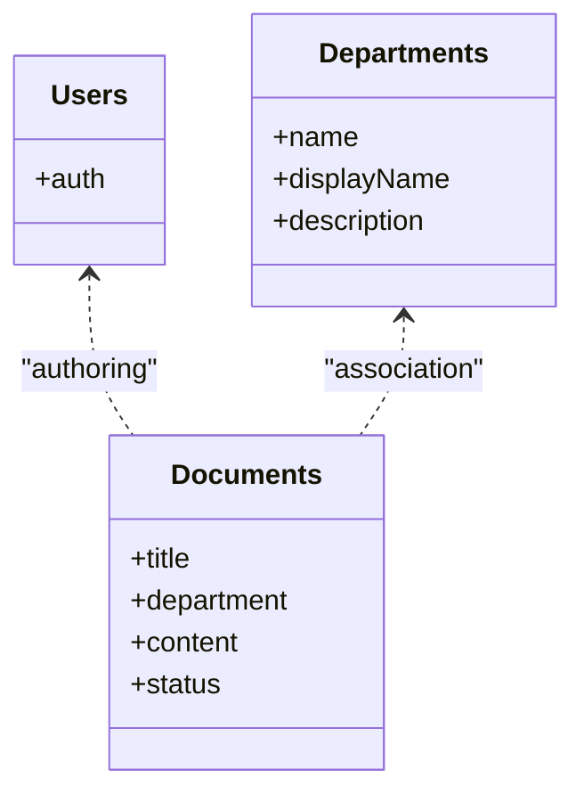
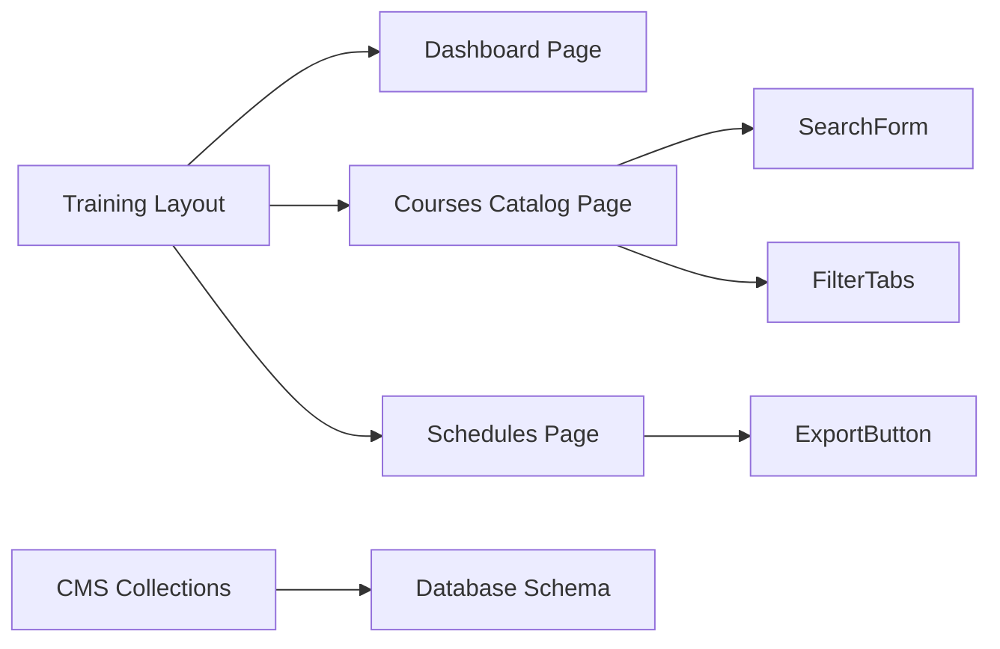

# Course Management

<cite>
**Referenced Files in This Document**
- [training layout](file://apps/portal/app/(departments)/training/layout.tsx)
- [training dashboard page](file://apps/portal/app/(departments)/training/page.tsx)
- [courses catalog page](file://apps/portal/app/(departments)/training/courses/page.tsx)
- [schedules page](file://apps/portal/app/(departments)/training/schedules/page.tsx)
- [search form component](file://apps/portal/app/(departments)/training/components/SearchForm.tsx)
- [filter tabs component](file://apps/portal/app/(departments)/training/components/FilterTabs.tsx)
- [export button component](file://apps/portal/app/(departments)/training/components/ExportButton.tsx)
- [training department entity doc](file://wiki/entities/training-department.md)
- [schema overview](file://wiki/SCHEMA.md)
- [seed data migration](file://packages/database/migrations/005_seed_data.sql)
- [department personality migration](file://packages/database/migrations/038_department_personality.sql)
- [CMS payload config](file://apps/cms/payload.config.ts)
</cite>

## Table of Contents

1. Introduction
2. Project Structure
3. Core Components
4. Architecture Overview
5. Detailed Component Analysis
6. Dependency Analysis
7. Performance Considerations
8. Troubleshooting Guide
9. Conclusion

## Introduction

This document describes the course management system within the Training department. It covers how courses are presented and organized, search and filtering capabilities, enrollment workflows, content structure, learning objectives, prerequisites, metadata, versioning, approval workflows, publishing states, and progress tracking integration points. The documentation is grounded in the repository’s portal pages for Training, shared UI components, CMS configuration, and database schema documentation.

## Project Structure

The Training department is implemented as a Next.js app route group with dedicated pages and reusable components:

- Department layout and routing
- Dashboard overview
- Course catalog with search and filters
- Scheduling interface
- Shared components for search, filtering, and export

**Diagram sources**

- [training layout](<file://apps/portal/app/(departments)/training/layout.tsx>)
- [training dashboard page](<file://apps/portal/app/(departments)/training/page.tsx>)
- [courses catalog page](<file://apps/portal/app/(departments)/training/courses/page.tsx>)
- [schedules page](<file://apps/portal/app/(departments)/training/schedules/page.tsx>)
- [search form component](<file://apps/portal/app/(departments)/training/components/SearchForm.tsx>)
- [filter tabs component](<file://apps/portal/app/(departments)/training/components/FilterTabs.tsx>)
- [export button component](<file://apps/portal/app/(departments)/training/components/ExportButton.tsx>)

**Section sources**

- [training layout](<file://apps/portal/app/(departments)/training/layout.tsx>)
- [training dashboard page](<file://apps/portal/app/(departments)/training/page.tsx>)
- [courses catalog page](<file://apps/portal/app/(departments)/training/courses/page.tsx>)
- [schedules page](<file://apps/portal/app/(departments)/training/schedules/page.tsx>)

## Core Components

- Training Layout: Provides department context, tab navigation, and AI assistant wrapper for the Training area.
- Dashboard Page: Displays KPIs such as compliance rate, active trainees, upcoming sessions, and hours logged.
- Courses Catalog Page: Presents the LMS course catalog with search and category filters; includes a “New Course” action and per-course actions like “Configure Modules.”
- Schedules Page: Shows scheduled training sessions with location, time, instructor, capacity, and status.
- SearchForm and FilterTabs: Reusable components to build query parameters (e.g., q, category) and maintain URL state across interactions.
- ExportButton: Utility component for exporting training-related data.

Key responsibilities:

- Present course metadata (title, category, level, lessons, duration, enrolled count, completion rate).
- Provide client-side filtering by text and category.
- Surface scheduling information and capacity constraints.
- Integrate with the Training AI Assistant via the layout wrapper.

**Section sources**

- [training layout](<file://apps/portal/app/(departments)/training/layout.tsx>)
- [training dashboard page](<file://apps/portal/app/(departments)/training/page.tsx>)
- [courses catalog page](<file://apps/portal/app/(departments)/training/courses/page.tsx>)
- [schedules page](<file://apps/portal/app/(departments)/training/schedules/page.tsx>)
- [search form component](<file://apps/portal/app/(departments)/training/components/SearchForm.tsx>)
- [filter tabs component](<file://apps/portal/app/(departments)/training/components/FilterTabs.tsx>)
- [export button component](<file://apps/portal/app/(departments)/training/components/ExportButton.tsx>)

## Architecture Overview

At runtime, the Training module composes:

- A department layout that sets context and renders child routes.
- Pages that render static or server-fetched data and compose shared UI components.
- A CMS layer configured for documents and departments, which can be extended to support course content authoring and publishing workflows.
- Database-backed entities documented in the wiki, including tables for training records, certifications, and courses.

**Diagram sources**

- [training layout](<file://apps/portal/app/(departments)/training/layout.tsx>)
- [training dashboard page](<file://apps/portal/app/(departments)/training/page.tsx>)
- [courses catalog page](<file://apps/portal/app/(departments)/training/courses/page.tsx>)
- [schedules page](<file://apps/portal/app/(departments)/training/schedules/page.tsx>)
- [search form component](<file://apps/portal/app/(departments)/training/components/SearchForm.tsx>)
- [filter tabs component](<file://apps/portal/app/(departments)/training/components/FilterTabs.tsx>)
- [export button component](<file://apps/portal/app/(departments)/training/components/ExportButton.tsx>)
- [CMS payload config](file://apps/cms/payload.config.ts)

## Detailed Component Analysis

### Training Layout

- Purpose: Establishes the Training department context, loads department tabs, and injects the AI assistant wrapper.
- Behavior: Validates the department exists and renders children within a shared department layout.

**Section sources**

- [training layout](<file://apps/portal/app/(departments)/training/layout.tsx>)

### Training Dashboard

- Purpose: High-level view of training performance and activity.
- Data: Displays metrics such as compliance percentage, active trainees, upcoming sessions, and hours logged. Also lists ongoing classes with trainer and timing.

**Section sources**

- [training dashboard page](<file://apps/portal/app/(departments)/training/page.tsx>)

### Courses Catalog Page

- Purpose: Central hub for browsing and managing courses.
- Features:
  - Search input and category filter tabs integrated via URL search params.
  - Grid of course cards showing title, description, category, level, lesson count, duration, enrolled count, and completion rate.
  - Actions include “New Course” and “Configure Modules.”
- Filtering logic:
  - Text search matches against title and description.
  - Category filter supports All, Safety, Equipment, Induction, Compliance.

**Diagram sources**

- [courses catalog page](<file://apps/portal/app/(departments)/training/courses/page.tsx>)
- [search form component](<file://apps/portal/app/(departments)/training/components/SearchForm.tsx>)
- [filter tabs component](<file://apps/portal/app/(departments)/training/components/FilterTabs.tsx>)

**Section sources**

- [courses catalog page](<file://apps/portal/app/(departments)/training/courses/page.tsx>)
- [search form component](<file://apps/portal/app/(departments)/training/components/SearchForm.tsx>)
- [filter tabs component](<file://apps/portal/app/(departments)/training/components/FilterTabs.tsx>)

### Schedules Page

- Purpose: Displays scheduled training sessions with details such as location, date/time, instructor, capacity, filled seats, type, and status.
- Use cases: Plan and monitor delivery of training sessions, track capacity utilization.

**Section sources**

- [schedules page](<file://apps/portal/app/(departments)/training/schedules/page.tsx>)

### CMS Configuration (Payload)

- Purpose: Configures collections for users, departments, and documents with rich text and status fields.
- Publishing states: Documents support Draft, Published, Archived statuses.
- Extensibility: Can be extended to model courses, modules, versions, approvals, and prerequisites.

**Diagram sources**

- [CMS payload config](file://apps/cms/payload.config.ts)

**Section sources**

- [CMS payload config](file://apps/cms/payload.config.ts)

## Dependency Analysis

- Portal pages depend on shared UI components for consistent UX and URL-driven filtering.
- The Training layout depends on department configuration and tabs.
- CMS collections define content models that can underpin course content and publishing workflows.
- Database schema documentation outlines core training-related entities and relationships.

**Diagram sources**

- [training layout](<file://apps/portal/app/(departments)/training/layout.tsx>)
- [training dashboard page](<file://apps/portal/app/(departments)/training/page.tsx>)
- [courses catalog page](<file://apps/portal/app/(departments)/training/courses/page.tsx>)
- [schedules page](<file://apps/portal/app/(departments)/training/schedules/page.tsx>)
- [search form component](<file://apps/portal/app/(departments)/training/components/SearchForm.tsx>)
- [filter tabs component](<file://apps/portal/app/(departments)/training/components/FilterTabs.tsx>)
- [export button component](<file://apps/portal/app/(departments)/training/components/ExportButton.tsx>)
- [CMS payload config](file://apps/cms/payload.config.ts)

**Section sources**

- [training layout](<file://apps/portal/app/(departments)/training/layout.tsx>)
- [training dashboard page](<file://apps/portal/app/(departments)/training/page.tsx>)
- [courses catalog page](<file://apps/portal/app/(departments)/training/courses/page.tsx>)
- [schedules page](<file://apps/portal/app/(departments)/training/schedules/page.tsx>)
- [search form component](<file://apps/portal/app/(departments)/training/components/SearchForm.tsx>)
- [filter tabs component](<file://apps/portal/app/(departments)/training/components/FilterTabs.tsx>)
- [export button component](<file://apps/portal/app/(departments)/training/components/ExportButton.tsx>)
- [CMS payload config](file://apps/cms/payload.config.ts)

## Performance Considerations

- Client-side filtering is efficient for small catalogs; consider server-side pagination and indexing when scaling.
- Avoid re-rendering large grids by memoizing list items and using stable keys.
- Debounce search inputs to reduce unnecessary re-renders.
- For schedules and reports, leverage server-side aggregation and materialized views where appropriate.

[No sources needed since this section provides general guidance]

## Troubleshooting Guide

- Missing department: If the Training department is not found in configuration, the layout will trigger a not-found response. Verify department seeding and configuration.
- Empty results: Ensure search terms and categories match available values; confirm that initial data or backend endpoints return expected datasets.
- CMS status transitions: Confirm that document status values align with UI expectations (Draft, Published, Archived).

**Section sources**

- [training layout](<file://apps/portal/app/(departments)/training/layout.tsx>)
- [courses catalog page](<file://apps/portal/app/(departments)/training/courses/page.tsx>)
- [CMS payload config](file://apps/cms/payload.config.ts)

## Conclusion

The Training department’s course management system provides a clear catalog interface with search and filtering, scheduling visibility, and extensible CMS-backed content modeling. While current pages demonstrate robust UI patterns and filtering, full implementation of course creation, editing, versioning, prerequisites, learning objectives, approval workflows, and progress tracking should integrate with the CMS collections and database schema documented here.

[No sources needed since this section summarizes without analyzing specific files]

## Appendices

### Course Metadata Model (from schema documentation)

- training_courses: name, department_id, duration_hours, required_role
- training_records: employee_id, course_id, completed_at, score
- certifications: employee_id, cert_type, issued_at, expires_at
- competency_assessments: employee_id, skill_area, assessed_at, result
- machines: name, machine_type, serial_number, active

These entities provide the foundation for course metadata, enrollment history, certification tracking, and equipment-based training.

**Section sources**

- [training department entity doc](file://wiki/entities/training-department.md)
- [schema overview](file://wiki/SCHEMA.md)

### Department Context and AI Assistant

- The Training AI Assistant persona is seeded for the Training department to support learning management, certifications, and skills development.

**Section sources**

- [department personality migration](file://packages/database/migrations/038_department_personality.sql)
- [seed data migration](file://packages/database/migrations/005_seed_data.sql)
