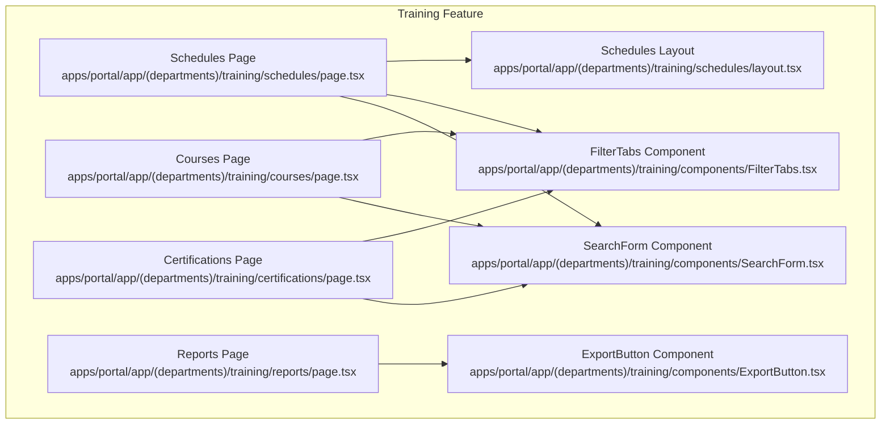
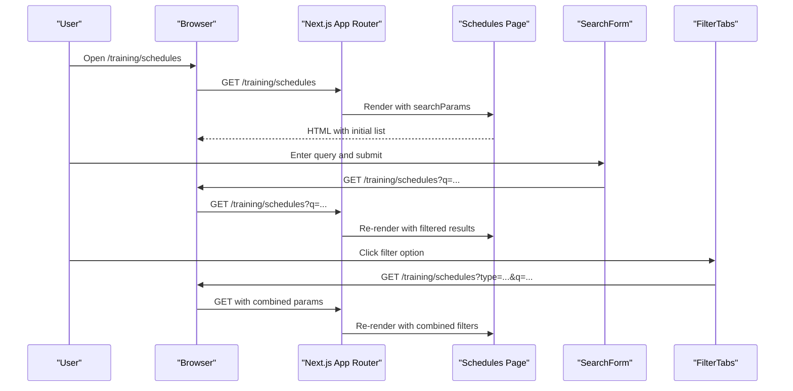
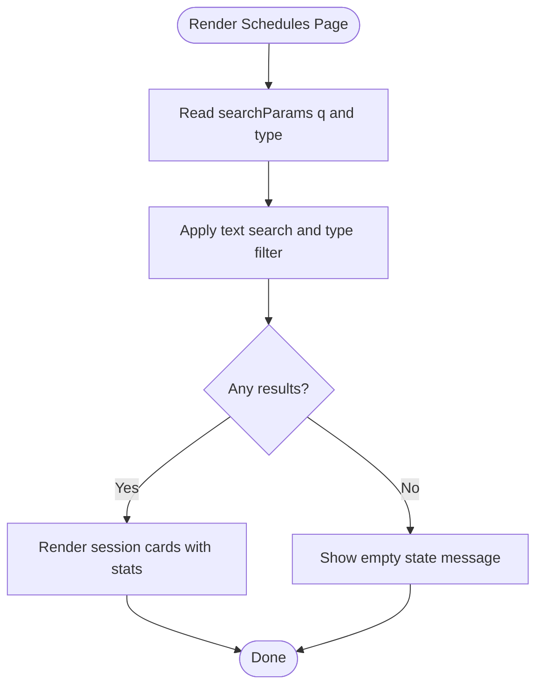
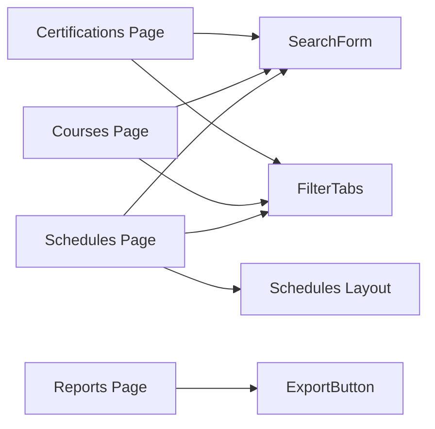

# Schedule Management

<cite>
**Referenced Files in This Document**
- [apps/portal/app/(departments)/training/schedules/page.tsx](file://apps/portal/app/(departments)/training/schedules/page.tsx)
- [apps/portal/app/(departments)/training/schedules/layout.tsx](file://apps/portal/app/(departments)/training/schedules/layout.tsx)
- [apps/portal/app/(departments)/training/courses/page.tsx](file://apps/portal/app/(departments)/training/courses/page.tsx)
- [apps/portal/app/(departments)/training/certifications/page.tsx](file://apps/portal/app/(departments)/training/certifications/page.tsx)
- [apps/portal/app/(departments)/training/reports/page.tsx](file://apps/portal/app/(departments)/training/reports/page.tsx)
- [apps/portal/app/(departments)/training/components/SearchForm.tsx](file://apps/portal/app/(departments)/training/components/SearchForm.tsx)
- [apps/portal/app/(departments)/training/components/FilterTabs.tsx](file://apps/portal/app/(departments)/training/components/FilterTabs.tsx)
- [apps/portal/app/(departments)/training/components/ExportButton.tsx](file://apps/portal/app/(departments)/training/components/ExportButton.tsx)
</cite>

## Table of Contents

1. [Introduction](#introduction)
2. [Project Structure](#project-structure)
3. [Core Components](#core-components)
4. [Architecture Overview](#architecture-overview)
5. [Detailed Component Analysis](#detailed-component-analysis)
6. [Dependency Analysis](#dependency-analysis)
7. [Performance Considerations](#performance-considerations)
8. [Troubleshooting Guide](#troubleshooting-guide)
9. [Conclusion](#conclusion)
10. [Appendices](#appendices)

## Introduction

This document describes the training schedule management system implemented in the portal application. It focuses on session scheduling, resource allocation, capacity management, attendee registration, waitlist handling, and cancellation policies. It also covers calendar views, conflict detection, automated notifications, recurring sessions, and schedule optimization. The current implementation is a client-side prototype with server-rendered pages that demonstrate UI flows, filtering, search, and reporting. Backend integration points are identified for future development.

## Project Structure

The training feature is organized under the training department area with dedicated pages for schedules, courses, certifications, and reports. Shared components provide reusable search and filter functionality.

**Diagram sources**

- [apps/portal/app/(departments)/training/schedules/page.tsx](<file://apps/portal/app/(departments)/training/schedules/page.tsx#L1-L234>)
- [apps/portal/app/(departments)/training/schedules/layout.tsx](<file://apps/portal/app/(departments)/training/schedules/layout.tsx#L1-L8>)
- [apps/portal/app/(departments)/training/courses/page.tsx](<file://apps/portal/app/(departments)/training/courses/page.tsx#L1-L235>)
- [apps/portal/app/(departments)/training/certifications/page.tsx](<file://apps/portal/app/(departments)/training/certifications/page.tsx#L1-L270>)
- [apps/portal/app/(departments)/training/reports/page.tsx](<file://apps/portal/app/(departments)/training/reports/page.tsx#L1-L261>)
- [apps/portal/app/(departments)/training/components/SearchForm.tsx](<file://apps/portal/app/(departments)/training/components/SearchForm.tsx#L1-L30>)
- [apps/portal/app/(departments)/training/components/FilterTabs.tsx](<file://apps/portal/app/(departments)/training/components/FilterTabs.tsx#L1-L50>)
- [apps/portal/app/(departments)/training/components/ExportButton.tsx](<file://apps/portal/app/(departments)/training/components/ExportButton.tsx#L1-L28>)

**Section sources**

- [apps/portal/app/(departments)/training/schedules/page.tsx:1-234](<file://apps/portal/app/(departments)/training/schedules/page.tsx#L1-L234>)
- [apps/portal/app/(departments)/training/schedules/layout.tsx:1-8](<file://apps/portal/app/(departments)/training/schedules/layout.tsx#L1-L8>)
- [apps/portal/app/(departments)/training/courses/page.tsx:1-235](<file://apps/portal/app/(departments)/training/courses/page.tsx#L1-L235>)
- [apps/portal/app/(departments)/training/certifications/page.tsx:1-270](<file://apps/portal/app/(departments)/training/certifications/page.tsx#L1-L270>)
- [apps/portal/app/(departments)/training/reports/page.tsx:1-261](<file://apps/portal/app/(departments)/training/reports/page.tsx#L1-L261>)
- [apps/portal/app/(departments)/training/components/SearchForm.tsx:1-30](<file://apps/portal/app/(departments)/training/components/SearchForm.tsx#L1-L30>)
- [apps/portal/app/(departments)/training/components/FilterTabs.tsx:1-50](<file://apps/portal/app/(departments)/training/components/FilterTabs.tsx#L1-L50>)
- [apps/portal/app/(departments)/training/components/ExportButton.tsx:1-28](<file://apps/portal/app/(departments)/training/components/ExportButton.tsx#L1-L28>)

## Core Components

- Schedules page: Displays training sessions with metadata (course, location, date/time, instructor), type and status tags, and registration statistics including capacity and filled slots. Provides search and type filtering via URL parameters.
- Courses page: Lists LMS courses with category, lessons, duration, enrollment, completion rate, and level. Supports search and category filters.
- Certifications page: Tracks employee certifications with issue/expiry dates and status (Active, Expiring Soon, Expired). Includes summary cards and table view with search and status filters.
- Reports page: Shows compliance metrics by department and lists generated audit/export files with download actions.
- SearchForm component: Renders a GET form to persist search queries as URL parameters and preserves other filters via hidden inputs.
- FilterTabs component: Renders filter options as links that update URL query parameters while preserving existing ones.
- ExportButton component: Client-side export action with loading state and simulated download flow.

Key responsibilities:

- Presenting data models for schedules, courses, certifications, and reports.
- Filtering and searching using Next.js searchParams.
- Rendering consistent UI patterns for badges, progress bars, and tables.

**Section sources**

- [apps/portal/app/(departments)/training/schedules/page.tsx:6-17](<file://apps/portal/app/(departments)/training/schedules/page.tsx#L6-L17>)
- [apps/portal/app/(departments)/training/schedules/page.tsx:94-109](<file://apps/portal/app/(departments)/training/schedules/page.tsx#L94-L109>)
- [apps/portal/app/(departments)/training/courses/page.tsx:6-16](<file://apps/portal/app/(departments)/training/courses/page.tsx#L6-L16>)
- [apps/portal/app/(departments)/training/courses/page.tsx:93-108](<file://apps/portal/app/(departments)/training/courses/page.tsx#L93-L108>)
- [apps/portal/app/(departments)/training/certifications/page.tsx:12-20](<file://apps/portal/app/(departments)/training/certifications/page.tsx#L12-L20>)
- [apps/portal/app/(departments)/training/certifications/page.tsx:97-112](<file://apps/portal/app/(departments)/training/certifications/page.tsx#L97-L112>)
- [apps/portal/app/(departments)/training/reports/page.tsx:11-18](<file://apps/portal/app/(departments)/training/reports/page.tsx#L11-L18>)
- [apps/portal/app/(departments)/training/components/SearchForm.tsx:3-29](<file://apps/portal/app/(departments)/training/components/SearchForm.tsx#L3-L29>)
- [apps/portal/app/(departments)/training/components/FilterTabs.tsx:4-49](<file://apps/portal/app/(departments)/training/components/FilterTabs.tsx#L4-L49>)
- [apps/portal/app/(departments)/training/components/ExportButton.tsx:6-27](<file://apps/portal/app/(departments)/training/components/ExportButton.tsx#L6-L27>)

## Architecture Overview

The training module uses a Next.js App Router structure with server components for rendering pages and client components for interactive behaviors. Data is currently represented as static arrays within each page for demonstration. Filtering and search operate through URL query parameters, enabling bookmarkable and shareable states.

**Diagram sources**

- [apps/portal/app/(departments)/training/schedules/page.tsx:94-109](<file://apps/portal/app/(departments)/training/schedules/page.tsx#L94-L109>)
- [apps/portal/app/(departments)/training/components/SearchForm.tsx:14-27](<file://apps/portal/app/(departments)/training/components/SearchForm.tsx#L14-L27>)
- [apps/portal/app/(departments)/training/components/FilterTabs.tsx:20-46](<file://apps/portal/app/(departments)/training/components/FilterTabs.tsx#L20-L46>)

## Detailed Component Analysis

### Schedules Page

Responsibilities:

- Display a list of training sessions with details and registration stats.
- Provide “Book Session” action and “Manage Roster” controls per session.
- Support search across course, instructor, and location; filter by type.
- Show capacity utilization via a progress bar.

Data model:

- Fields include id, course, location, date, time, instructor, capacity, filled, type, and status.

Filtering logic:

- Combines text search and type filter based on URL parameters.

Capacity management:

- Displays filled vs capacity and a visual progress indicator.

Registration and roster:

- “Manage Roster” button present; backend integration not implemented in this file.

Conflict detection and calendar views:

- Not implemented in this file; can be extended to show overlapping sessions and integrate with calendar libraries.

Recurring sessions:

- Not implemented; could be modeled by adding recurrence rules and generating instances.

Automated notifications:

- Not implemented; could be triggered by events such as full capacity or upcoming start times.

Cancellation policy:

- Not implemented; could be enforced when updating filled counts.

Waitlist handling:

- Not implemented; could be added by tracking waitlist count and promoting attendees when capacity frees up.

**Diagram sources**

- [apps/portal/app/(departments)/training/schedules/page.tsx:94-109](<file://apps/portal/app/(departments)/training/schedules/page.tsx#L94-L109>)

**Section sources**

- [apps/portal/app/(departments)/training/schedules/page.tsx:6-17](<file://apps/portal/app/(departments)/training/schedules/page.tsx#L6-L17>)
- [apps/portal/app/(departments)/training/schedules/page.tsx:94-109](<file://apps/portal/app/(departments)/training/schedules/page.tsx#L94-L109>)
- [apps/portal/app/(departments)/training/schedules/page.tsx:144-230](<file://apps/portal/app/(departments)/training/schedules/page.tsx#L144-L230>)

### Courses Page

Responsibilities:

- List LMS courses with category, lessons, duration, enrollment, completion rate, and level.
- Provide search and category filters.

Data model:

- Fields include id, title, category, lessons, duration, enrolled, completionRate, description, and level.

Filtering logic:

- Combines text search and category filter based on URL parameters.

Compliance and completion:

- Visual progress bars indicate completion rates.

Integration points:

- “Configure Modules” action suggests linking to course configuration workflows.

**Section sources**

- [apps/portal/app/(departments)/training/courses/page.tsx:6-16](<file://apps/portal/app/(departments)/training/courses/page.tsx#L6-L16>)
- [apps/portal/app/(departments)/training/courses/page.tsx:93-108](<file://apps/portal/app/(departments)/training/courses/page.tsx#L93-L108>)
- [apps/portal/app/(departments)/training/courses/page.tsx:144-231](<file://apps/portal/app/(departments)/training/courses/page.tsx#L144-L231>)

### Certifications Page

Responsibilities:

- Track employee certifications with issue/expiry dates and status.
- Provide summary cards for Active, Expiring Soon, and Expired counts.
- Support search and status filters.

Data model:

- Fields include id, employee, role, certification, issueDate, expiryDate, and status.

Filtering logic:

- Combines text search and status filter based on URL parameters.

Operational insights:

- Summary cards highlight near-expirations and expired credentials for proactive management.

**Section sources**

- [apps/portal/app/(departments)/training/certifications/page.tsx:12-20](<file://apps/portal/app/(departments)/training/certifications/page.tsx#L12-L20>)
- [apps/portal/app/(departments)/training/certifications/page.tsx:97-112](<file://apps/portal/app/(departments)/training/certifications/page.tsx#L97-L112>)
- [apps/portal/app/(departments)/training/certifications/page.tsx:143-185](<file://apps/portal/app/(departments)/training/certifications/page.tsx#L143-L185>)
- [apps/portal/app/(departments)/training/certifications/page.tsx:203-264](<file://apps/portal/app/(departments)/training/certifications/page.tsx#L203-L264>)

### Reports Page

Responsibilities:

- Display departmental compliance rates and overall site compliance.
- List generated audits and exports with download actions.

Data model:

- Report entries include id, name, type, generatedDate, author, and size.

Export workflow:

- Uses ExportButton component to simulate downloads with loading state.

**Section sources**

- [apps/portal/app/(departments)/training/reports/page.tsx:11-18](<file://apps/portal/app/(departments)/training/reports/page.tsx#L11-L18>)
- [apps/portal/app/(departments)/training/reports/page.tsx:78-203](<file://apps/portal/app/(departments)/training/reports/page.tsx#L78-L203>)
- [apps/portal/app/(departments)/training/reports/page.tsx:206-257](<file://apps/portal/app/(departments)/training/reports/page.tsx#L206-L257>)
- [apps/portal/app/(departments)/training/components/ExportButton.tsx:6-27](<file://apps/portal/app/(departments)/training/components/ExportButton.tsx#L6-L27>)

### SearchForm Component

Responsibilities:

- Render a GET form with a search input.
- Preserve other filter parameters via hidden inputs.

Behavior:

- Submits to the same route with updated query string.

**Section sources**

- [apps/portal/app/(departments)/training/components/SearchForm.tsx:3-29](<file://apps/portal/app/(departments)/training/components/SearchForm.tsx#L3-L29>)

### FilterTabs Component

Responsibilities:

- Render filter options as links.
- Update URL query parameters while preserving existing ones.

Behavior:

- Constructs href with combined parameters; clears parameter when selecting “All”.

**Section sources**

- [apps/portal/app/(departments)/training/components/FilterTabs.tsx:4-49](<file://apps/portal/app/(departments)/training/components/FilterTabs.tsx#L4-L49>)

## Dependency Analysis

The training pages depend on shared UI components for search and filtering. The Schedules layout is minimal and passes children through unchanged.

**Diagram sources**

- [apps/portal/app/(departments)/training/schedules/page.tsx:1-5](<file://apps/portal/app/(departments)/training/schedules/page.tsx#L1-L5>)
- [apps/portal/app/(departments)/training/schedules/layout.tsx:1-7](<file://apps/portal/app/(departments)/training/schedules/layout.tsx#L1-L7>)
- [apps/portal/app/(departments)/training/courses/page.tsx:1-4](<file://apps/portal/app/(departments)/training/courses/page.tsx#L1-L4>)
- [apps/portal/app/(departments)/training/certifications/page.tsx:1-10](<file://apps/portal/app/(departments)/training/certifications/page.tsx#L1-L10>)
- [apps/portal/app/(departments)/training/reports/page.tsx:1-9](<file://apps/portal/app/(departments)/training/reports/page.tsx#L1-L9>)

**Section sources**

- [apps/portal/app/(departments)/training/schedules/page.tsx:1-5](<file://apps/portal/app/(departments)/training/schedules/page.tsx#L1-L5>)
- [apps/portal/app/(departments)/training/schedules/layout.tsx:1-7](<file://apps/portal/app/(departments)/training/schedules/layout.tsx#L1-L7>)
- [apps/portal/app/(departments)/training/courses/page.tsx:1-4](<file://apps/portal/app/(departments)/training/courses/page.tsx#L1-L4>)
- [apps/portal/app/(departments)/training/certifications/page.tsx:1-10](<file://apps/portal/app/(departments)/training/certifications/page.tsx#L1-L10>)
- [apps/portal/app/(departments)/training/reports/page.tsx:1-9](<file://apps/portal/app/(departments)/training/reports/page.tsx#L1-L9>)

## Performance Considerations

- Client-side filtering and search are efficient for small datasets but may degrade with large lists. Consider server-side pagination and indexing for scalability.
- Avoid unnecessary re-renders by memoizing computed values if moving to client-side state.
- Use virtualization for long lists in schedules and certifications pages.
- Defer heavy operations like report generation to background jobs and trigger downloads upon completion.

[No sources needed since this section provides general guidance]

## Troubleshooting Guide

Common issues and resolutions:

- Filters not applied: Ensure URL parameters are correctly passed and parsed. Verify hidden inputs in SearchForm and link construction in FilterTabs.
- Empty results: Confirm search terms match available fields and that filters are mutually compatible.
- Export failures: Check ExportButton’s async behavior and network requests if integrated with a real endpoint.

**Section sources**

- [apps/portal/app/(departments)/training/components/SearchForm.tsx:14-27](<file://apps/portal/app/(departments)/training/components/SearchForm.tsx#L14-L27>)
- [apps/portal/app/(departments)/training/components/FilterTabs.tsx:20-46](<file://apps/portal/app/(departments)/training/components/FilterTabs.tsx#L20-L46>)
- [apps/portal/app/(departments)/training/components/ExportButton.tsx:9-15](<file://apps/portal/app/(departments)/training/components/ExportButton.tsx#L9-L15>)

## Conclusion

The training schedule management system provides a solid front-end foundation for scheduling, cataloging, certification tracking, and reporting. Current capabilities focus on display, search, and filtering via URL parameters. Future enhancements should implement backend services for capacity management, waitlists, conflict detection, recurring sessions, automated notifications, and external calendar integrations.

[No sources needed since this section summarizes without analyzing specific files]

## Appendices

### Implementation Details for Future Development

- Scheduling algorithms: Implement conflict detection by comparing overlapping time ranges for resources (rooms, instructors, equipment).
- Resource booking systems: Model resources with availability windows and enforce constraints during booking.
- Capacity management: Maintain accurate counts of filled seats and waitlist positions; promote from waitlist upon cancellations.
- Attendee registration: Validate prerequisites and certification status before allowing registration.
- Cancellation policies: Define time-based rules for refunds or penalties and automate updates to capacity and waitlist.
- Calendar views: Integrate a calendar library to visualize sessions and support drag-and-drop rescheduling.
- Automated notifications: Trigger emails or in-app alerts for upcoming sessions, expiring certifications, and capacity changes.
- Recurring sessions: Store recurrence rules and generate instances for display and conflict checks.
- Schedule optimization: Use constraint solvers or heuristics to minimize conflicts and maximize resource utilization.

[No sources needed since this section outlines conceptual enhancements]
