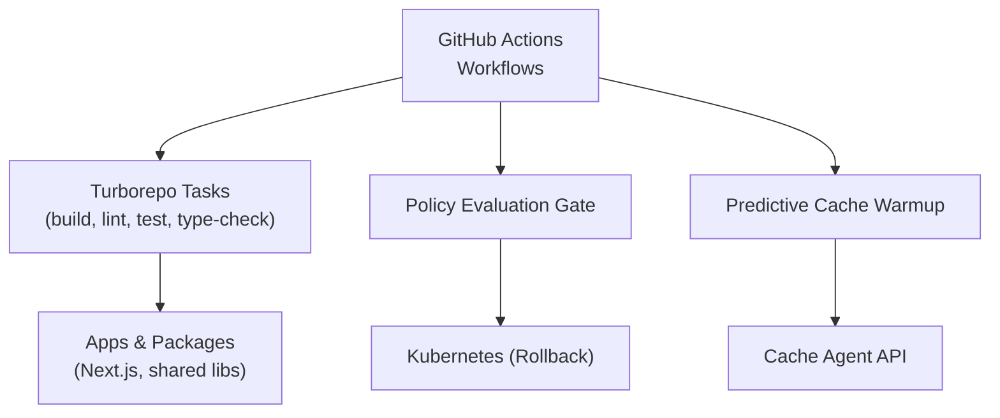
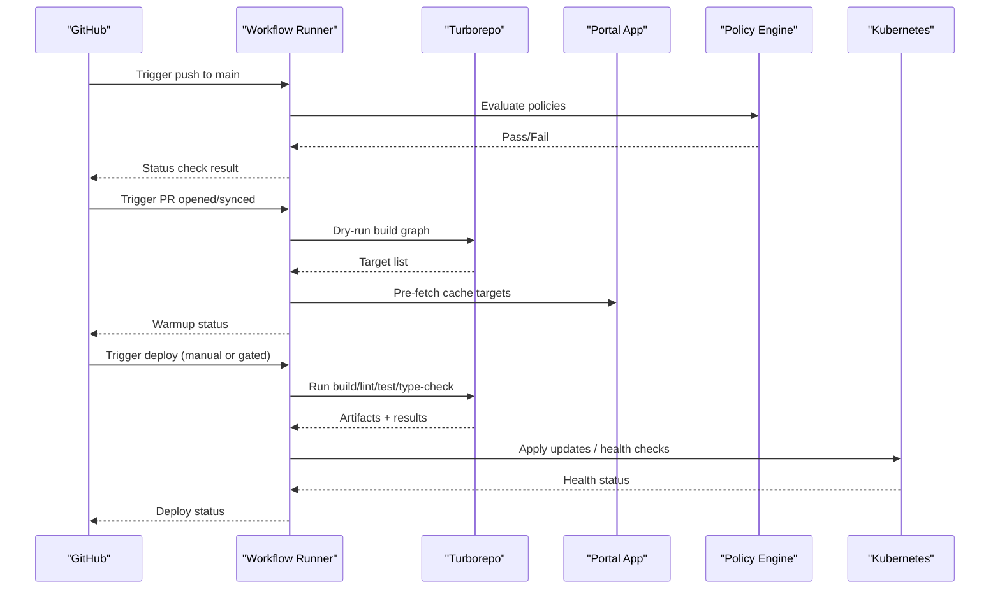
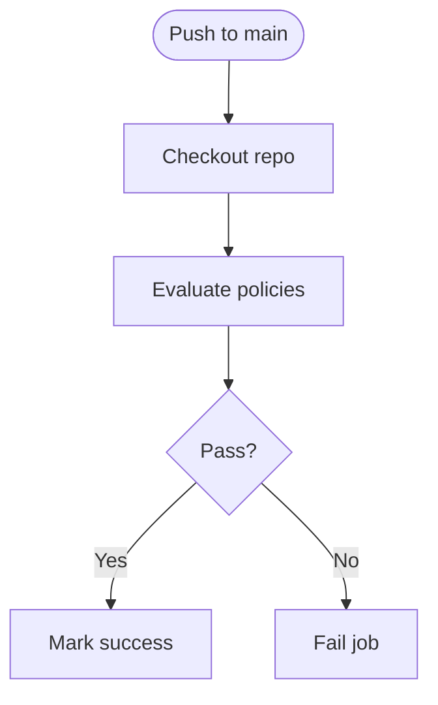
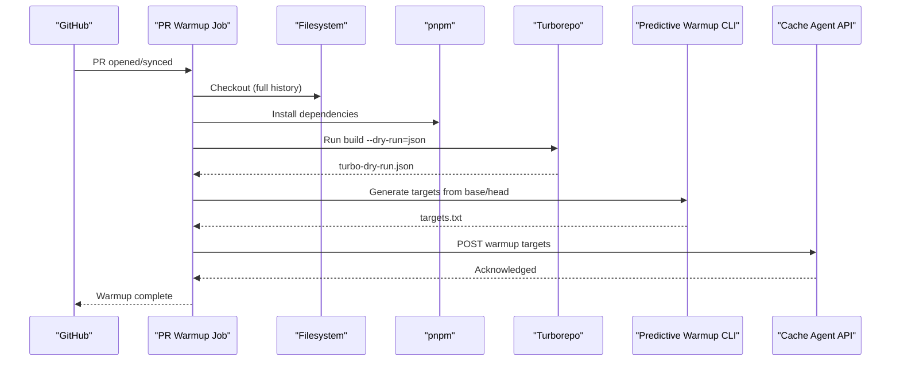
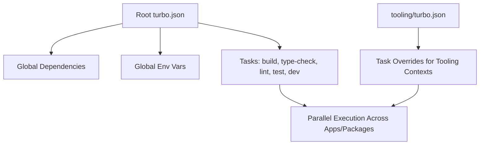
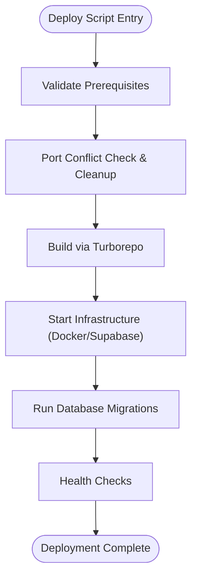
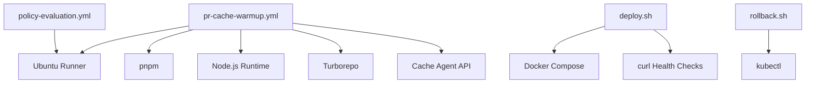

# CI/CD Pipeline

<cite>
**Referenced Files in This Document**
- [policy-evaluation.yml](file://ci/workflows/policy-evaluation.yml)
- [pr-cache-warmup.yml](file://ci/workflows/pr-cache-warmup.yml)
- [turbo.json](file://turbo.json)
- [tooling/turbo.json](file://tooling/turbo.json)
- [package.json](file://package.json)
- [deploy.sh](file://scripts/deploy.sh)
- [deploy-dev.sh](file://scripts/deploy-dev.sh)
- [rollback.sh](file://ci/scripts/rollback.sh)
</cite>

## Table of Contents

1. [Introduction](#introduction)
2. [Project Structure](#project-structure)
3. [Core Components](#core-components)
4. [Architecture Overview](#architecture-overview)
5. [Detailed Component Analysis](#detailed-component-analysis)
6. [Dependency Analysis](#dependency-analysis)
7. [Performance Considerations](#performance-considerations)
8. [Troubleshooting Guide](#troubleshooting-guide)
9. [Conclusion](#conclusion)
10. [Appendices](#appendices)

## Introduction

This document describes the CI/CD pipeline for the Arch-Mk2 monorepo, focusing on GitHub Actions workflows, build and test orchestration via Turborepo, caching strategies, parallel execution, policy evaluation, security checks, deployment automation, and operational guidance. It also provides diagrams to visualize flows and dependencies, and includes troubleshooting and optimization recommendations.

## Project Structure

The repository uses a monorepo layout with multiple apps and packages. CI/CD is primarily driven by:

- GitHub Actions workflows under ci/workflows
- Turborepo configuration at the root and tooling subdirectory
- Deployment scripts under scripts
- Rollback utilities under ci/scripts

[No sources needed since this diagram shows conceptual workflow, not actual code structure]

**Section sources**

- [policy-evaluation.yml](file://ci/workflows/policy-evaluation.yml)
- [pr-cache-warmup.yml](file://ci/workflows/pr-cache-warmup.yml)
- [turbo.json](file://turbo.json)
- [tooling/turbo.json](file://tooling/turbo.json)
- [package.json](file://package.json)

## Core Components

- GitHub Actions Workflows
  - Policy Evaluation Gate: runs on pushes to main; performs policy checks.
  - Predictive Cache Warmup: runs on PR open/synchronize; pre-warms caches based on predicted tasks.
- Turborepo Orchestration
  - Root turbo.json defines task inputs/outputs, global env, and caching behavior.
  - tooling/turbo.json provides additional task definitions for specific tooling contexts.
- Deployment Automation
  - scripts/deploy.sh orchestrates environment validation, builds, infrastructure start, migrations, and health checks across local/staging/production modes.
  - scripts/deploy-dev.sh streamlines local development with Docker, Supabase, Next.js dev server, and browser auto-open.
  - ci/scripts/rollback.sh issues Kubernetes rollbacks for selected deployments.

**Section sources**

- [policy-evaluation.yml](file://ci/workflows/policy-evaluation.yml)
- [pr-cache-warmup.yml](file://ci/workflows/pr-cache-warmup.yml)
- [turbo.json](file://turbo.json)
- [tooling/turbo.json](file://tooling/turbo.json)
- [deploy.sh](file://scripts/deploy.sh)
- [deploy-dev.sh](file://scripts/deploy-dev.sh)
- [rollback.sh](file://ci/scripts/rollback.sh)

## Architecture Overview

The CI/CD architecture integrates automated quality gates, predictive cache warmup, and deployment automation. Turborepo coordinates parallelizable tasks across the monorepo, while GitHub Actions triggers workflows based on branch events.

**Diagram sources**

- [policy-evaluation.yml](file://ci/workflows/policy-evaluation.yml)
- [pr-cache-warmup.yml](file://ci/workflows/pr-cache-warmup.yml)
- [turbo.json](file://turbo.json)
- [deploy.sh](file://scripts/deploy.sh)
- [rollback.sh](file://ci/scripts/rollback.sh)

## Detailed Component Analysis

### Policy Evaluation Gate Workflow

- Triggers on push to main.
- Checks out the repository and executes policy evaluation steps.
- Intended to enforce architectural and dependency policies before merging into main.

**Diagram sources**

- [policy-evaluation.yml](file://ci/workflows/policy-evaluation.yml)

**Section sources**

- [policy-evaluation.yml](file://ci/workflows/policy-evaluation.yml)

### Predictive Cache Warmup Workflow

- Triggers on PR opened or synchronized.
- Performs a full fetch to compute accurate change sets.
- Sets up Node.js and installs dependencies.
- Runs a Turborepo dry run to generate a JSON task graph.
- Uses a predictive warmup generator to produce target tasks.
- Pre-fetches cache targets via an internal cache agent API.

**Diagram sources**

- [pr-cache-warmup.yml](file://ci/workflows/pr-cache-warmup.yml)

**Section sources**

- [pr-cache-warmup.yml](file://ci/workflows/pr-cache-warmup.yml)

### Turborepo Task Definitions and Caching

- Global dependencies include TypeScript config, workspace manifest, and npmrc.
- Global environment variables cover runtime flags, telemetry keys, and feature toggles.
- Task definitions:
  - build: depends on upstream build and codegen; excludes tests and stories; outputs .next and dist.
  - type-check: caches tsbuildinfo outputs.
  - lint: caches ESLint cache.
  - test: caches coverage artifacts.
  - dev: non-cached, persistent.
- Additional tooling-specific tasks are defined in tooling/turbo.json for build, lint, test, type-check, and dev.

**Diagram sources**

- [turbo.json](file://turbo.json)
- [tooling/turbo.json](file://tooling/turbo.json)

**Section sources**

- [turbo.json](file://turbo.json)
- [tooling/turbo.json](file://tooling/turbo.json)

### Deployment Automation

- scripts/deploy.sh:
  - Validates prerequisites (Node.js, pnpm, Docker, Git).
  - Manages locks and error collection.
  - Cleans ports and caches.
  - Builds using Turborepo.
  - Starts infrastructure (Supabase locally; Docker tools and monitoring).
  - Runs database migrations and health checks.
  - Supports local, staging, and production modes with environment file validation.
- scripts/deploy-dev.sh:
  - Ensures port availability.
  - Starts Docker and Supabase if needed.
  - Cleans stale compilation cache.
  - Launches Next.js dev server with Turbopack.
  - Polls health endpoint and opens browser automatically.
- ci/scripts/rollback.sh:
  - Issues Kubernetes rollout undo commands for specified deployments.

**Diagram sources**

- [deploy.sh](file://scripts/deploy.sh)
- [deploy-dev.sh](file://scripts/deploy-dev.sh)
- [rollback.sh](file://ci/scripts/rollback.sh)

**Section sources**

- [deploy.sh](file://scripts/deploy.sh)
- [deploy-dev.sh](file://scripts/deploy-dev.sh)
- [rollback.sh](file://ci/scripts/rollback.sh)

## Dependency Analysis

- Workflows depend on:
  - actions/checkout@v4 for repository access.
  - actions/setup-node@v4 for Node.js setup.
  - pnpm for dependency installation.
  - Turborepo for task orchestration and caching.
  - Internal cache agent API for predictive warmup.
- Scripts depend on:
  - Docker and docker compose plugin for container orchestration.
  - System services (systemctl) for service management.
  - curl for health checks.
  - kubectl for Kubernetes operations (rollback).

**Diagram sources**

- [policy-evaluation.yml](file://ci/workflows/policy-evaluation.yml)
- [pr-cache-warmup.yml](file://ci/workflows/pr-cache-warmup.yml)
- [deploy.sh](file://scripts/deploy.sh)
- [rollback.sh](file://ci/scripts/rollback.sh)

**Section sources**

- [policy-evaluation.yml](file://ci/workflows/policy-evaluation.yml)
- [pr-cache-warmup.yml](file://ci/workflows/pr-cache-warmup.yml)
- [deploy.sh](file://scripts/deploy.sh)
- [rollback.sh](file://ci/scripts/rollback.sh)

## Performance Considerations

- Parallel Execution
  - Turborepo’s task graph enables parallelization across apps and packages.
  - Use filters to scope work when appropriate (e.g., building only affected apps).
- Caching Strategies
  - Rely on Turborepo’s input/output hashing for build, lint, test, and type-check tasks.
  - Leverage predictive warmup to pre-populate caches before PR jobs run.
- Environment Variables
  - Configure globalEnv in turbo.json to avoid redundant re-runs due to environment changes.
- I/O Optimization
  - Exclude test and story files from build inputs to reduce cache churn.
- Container Build Caching
  - Ensure BuildKit is enabled for efficient Docker layer caching during deployments.

[No sources needed since this section provides general guidance]

## Troubleshooting Guide

- Common Issues
  - Port conflicts: The deployment script detects and attempts to free occupied ports; use --force if necessary.
  - Docker not running: Local mode requires Docker; the script attempts to start it and will fail fast if unavailable.
  - Supabase not healthy: Health checks gate subsequent phases; verify logs and restart if needed.
  - Turborepo cache misses: Inspect task inputs/outputs and ensure consistent globalDependencies/globalEnv.
  - Rollback failures: Confirm kubectl connectivity and permissions; review cluster rollout status.
- Diagnostic Steps
  - Review deploy logs generated by the deployment script.
  - Check Next.js dev server logs for compilation errors.
  - Validate environment files for required variables (e.g., Supabase URL).
  - Inspect Turborepo cache directories for inconsistencies.

**Section sources**

- [deploy.sh](file://scripts/deploy.sh)
- [deploy-dev.sh](file://scripts/deploy-dev.sh)
- [rollback.sh](file://ci/scripts/rollback.sh)

## Conclusion

The Arch-Mk2 CI/CD pipeline combines GitHub Actions, Turborepo, and robust deployment scripts to deliver reliable, high-performance builds and releases. Policy evaluation gates protect main, while predictive cache warmup accelerates PR feedback. Operational scripts streamline local development and production deployments, with rollback capabilities for Kubernetes-managed services.

[No sources needed since this section summarizes without analyzing specific files]

## Appendices

### Branch Protection Rules (Recommended)

- Require status checks to pass before merging:
  - Policy Evaluation Gate
  - Quality checks (lint, type-check, test)
- Require pull request reviews:
  - At least one approving review
- Enforce linear history:
  - Squash or rebase merges preferred
- Restrict force pushes and deletions

[No sources needed since this section provides general guidance]

### Pull Request Automation (Recommended)

- Add a PR workflow to run:
  - Lint and format checks
  - Type checking
  - Unit tests
  - Visual regression tests (if applicable)
- Post comments with results and links to artifacts.

[No sources needed since this section provides general guidance]

### Release Management Processes (Recommended)

- Tagging strategy:
  - Semantic versioning tags
- Automated release notes:
  - Generate changelogs from commit messages
- Staged rollouts:
  - Canary deployments followed by gradual promotion
- Rollback procedures:
  - Use rollback script to revert recent deployments

[No sources needed since this section provides general guidance]
