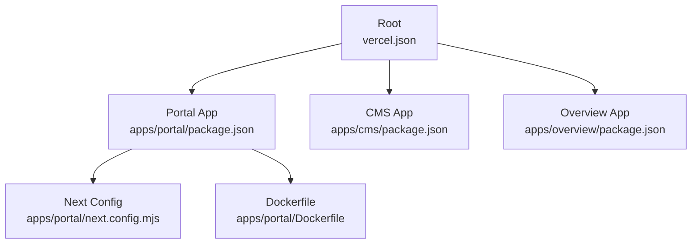
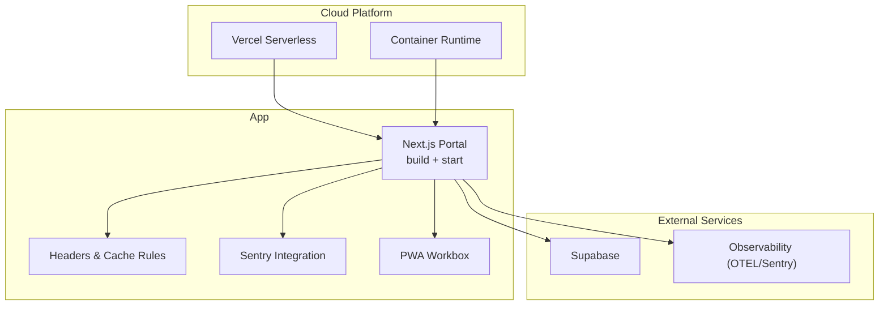
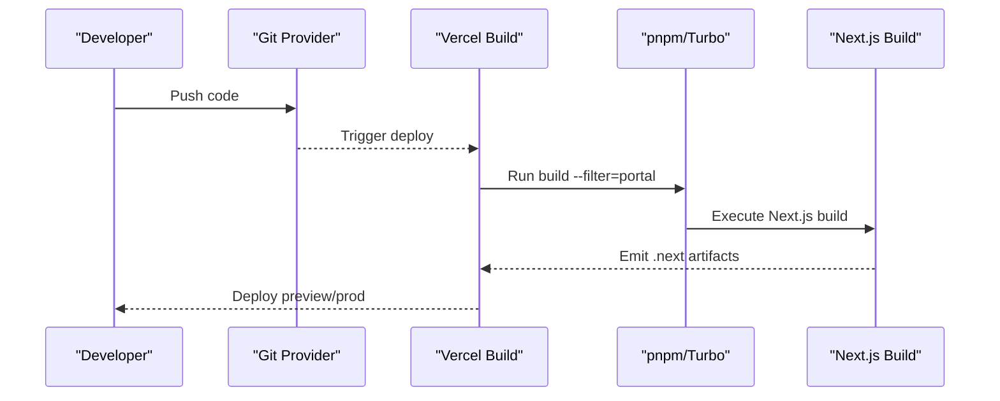
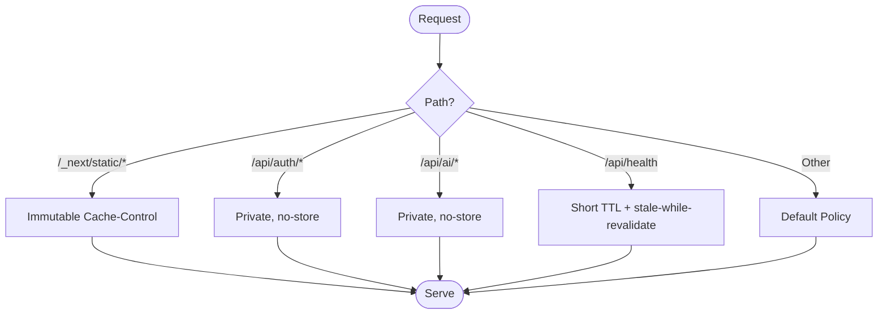
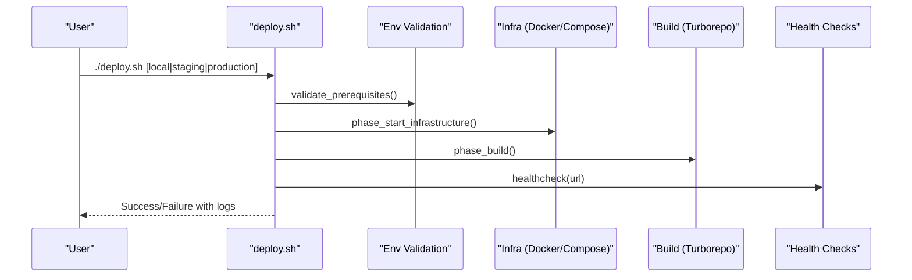
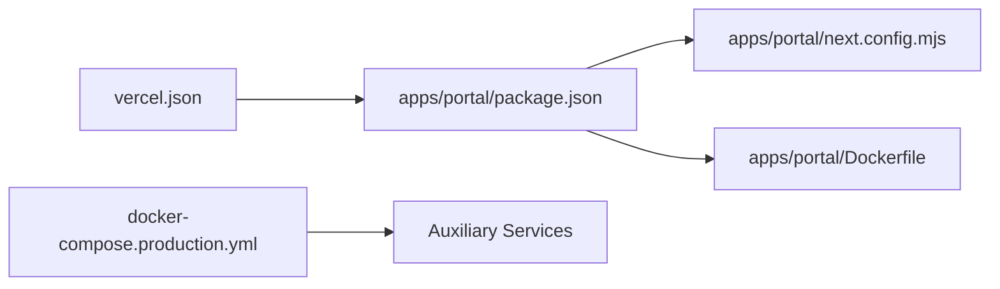

# Cloud Deployment

<cite>
**Referenced Files in This Document**
- [vercel.json](file://vercel.json)
- [apps/portal/package.json](file://apps/portal/package.json)
- [apps/cms/package.json](file://apps/cms/package.json)
- [apps/overview/package.json](file://apps/overview/package.json)
- [apps/portal/next.config.mjs](file://apps/portal/next.config.mjs)
- [apps/portal/Dockerfile](file://apps/portal/Dockerfile)
- [scripts/deploy.sh](file://scripts/deploy.sh)
- [scripts/deploy-dev.sh](file://scripts/deploy-dev.sh)
- [scripts/deploy-live-local.sh](file://scripts/deploy-live-local.sh)
- [ci/scripts/rollback.sh](file://ci/scripts/rollback.sh)
- [docker-compose.production.yml](file://docker-compose.production.yml)
- [apps/portal/lib/env.ts](file://apps/portal/lib/env.ts)
</cite>

## Table of Contents

1. Introduction
2. Project Structure
3. Core Components
4. Architecture Overview
5. Detailed Component Analysis
6. Dependency Analysis
7. Performance Considerations
8. Troubleshooting Guide
9. Conclusion

## Introduction

This document provides cloud deployment guidance for Arch-Mk2 with a focus on Vercel and other cloud platforms. It explains the Next.js build configuration, environment handling, caching and CDN strategies, automated deployment scripts for development, staging, and production, as well as domain and SSL considerations, feature flags, rollbacks, performance optimization, and monitoring integration.

## Project Structure

Arch-Mk2 is a monorepo with multiple Next.js applications:

- apps/portal: Primary Next.js application (PWA, telemetry, PII-sensitive features)
- apps/cms: Payload CMS Next.js app
- apps/overview: Static overview site

Vercel is configured to build and serve the portal app. The root vercel.json defines the framework, build command, and output directory. Each app has its own package.json with build/start scripts.

**Diagram sources**

- [vercel.json:1-7](file://vercel.json#L1-L7)
- [apps/portal/package.json:66-74](file://apps/portal/package.json#L66-L74)
- [apps/cms/package.json:23-30](file://apps/cms/package.json#L23-L30)
- [apps/overview/package.json:28-34](file://apps/overview/package.json#L28-L34)
- [apps/portal/next.config.mjs:1-228](file://apps/portal/next.config.mjs#L1-L228)
- [apps/portal/Dockerfile:1-64](file://apps/portal/Dockerfile#L1-L64)

**Section sources**

- [vercel.json:1-7](file://vercel.json#L1-L7)
- [apps/portal/package.json:66-74](file://apps/portal/package.json#L66-L74)
- [apps/cms/package.json:23-30](file://apps/cms/package.json#L23-L30)
- [apps/overview/package.json:28-34](file://apps/overview/package.json#L28-L34)

## Core Components

- Vercel Configuration: Defines Next.js framework, build command, and output directory for the portal app.
- Build Scripts: Each app exposes standard Next.js build/start scripts; the portal also supports bundle analysis and Turbopack dev server.
- Runtime Environment Validation: Centralized schema-based validation for required and optional environment variables at module load time.
- Docker Image: Multi-stage build producing a minimal standalone image for containerized deployments.

Key responsibilities:

- Ensure consistent builds across environments
- Validate environment variables early
- Provide optimized static assets and headers for CDN caching
- Support both serverless (Vercel) and containerized deployments

**Section sources**

- [vercel.json:1-7](file://vercel.json#L1-L7)
- [apps/portal/package.json:66-74](file://apps/portal/package.json#L66-L74)
- [apps/portal/lib/env.ts:1-144](file://apps/portal/lib/env.ts#L1-L144)
- [apps/portal/Dockerfile:1-64](file://apps/portal/Dockerfile#L1-L64)

## Architecture Overview

The portal app can be deployed via:

- Vercel serverless (recommended for CI/CD simplicity)
- Container runtime using the provided Dockerfile
- Local or self-hosted via docker-compose overlays

**Diagram sources**

- [vercel.json:1-7](file://vercel.json#L1-L7)
- [apps/portal/next.config.mjs:1-228](file://apps/portal/next.config.mjs#L1-L228)
- [apps/portal/Dockerfile:1-64](file://apps/portal/Dockerfile#L1-L64)

## Detailed Component Analysis

### Vercel Configuration and Build Process

- Framework detection: nextjs
- Build command: pnpm build scoped to portal
- Output directory: .next inside apps/portal

Implications:

- Vercel will run the portal build only, ignoring other apps unless explicitly configured.
- Use Vercel project settings to set environment variables and select the correct branch for preview deployments.

**Diagram sources**

- [vercel.json:1-7](file://vercel.json#L1-L7)
- [apps/portal/package.json:66-74](file://apps/portal/package.json#L66-L74)

**Section sources**

- [vercel.json:1-7](file://vercel.json#L1-L7)
- [apps/portal/package.json:66-74](file://apps/portal/package.json#L66-L74)

### Environment Variables and Feature Flags

- Centralized validation ensures required keys are present and typed.
- Public variables (NEXT*PUBLIC*\*) are embedded into the client bundle; secrets must remain server-only.
- Feature toggles and service URLs are validated at startup.

Operational notes:

- Configure environment variables in your platform’s dashboard (Vercel, container runtime, etc.).
- For local development, seed from templates and verify placeholders.

**Section sources**

- [apps/portal/lib/env.ts:1-144](file://apps/portal/lib/env.ts#L1-L144)

### Caching, CDN Optimization, and Security Headers

- Static assets under /\_next/static are marked immutable with long TTLs for CDN caching.
- Health endpoints and manifest have tuned cache policies.
- Auth and AI routes opt out of caching.
- Strict security headers including HSTS, CSP, X-Frame-Options, and Permissions-Policy are applied.
- PWA runtime caching rules optimize offline behavior and resilience.

**Diagram sources**

- [apps/portal/next.config.mjs:58-165](file://apps/portal/next.config.mjs#L58-L165)

**Section sources**

- [apps/portal/next.config.mjs:1-228](file://apps/portal/next.config.mjs#L1-L228)

### Monitoring and Error Tracking

- Sentry integration is enabled in CI/production builds with configurable org/project and tunnel route.
- OpenTelemetry packages are externalized for server-side usage.
- Web Vitals attribution is enabled for key metrics.

Recommendations:

- Set SENTRY_ORG, SENTRY_PROJECT, SENTRY_AUTH_TOKEN, and NEXT_PUBLIC_SENTRY_DSN in your platform’s environment.
- Keep source maps hidden in production if not needed.

**Section sources**

- [apps/portal/next.config.mjs:212-228](file://apps/portal/next.config.mjs#L212-L228)
- [apps/portal/package.json:10-15](file://apps/portal/package.json#L10-L15)

### Containerized Deployment (Dockerfile)

- Four-stage build: pruner → deps → builder → production
- Uses Turbo prune to minimize context
- Mounts pnpm store and Next.js cache for faster builds
- Produces a distroless production image with standalone output

Usage:

- Build with required ARGs for public env vars and Sentry config
- Run the resulting image exposing port 3000

**Section sources**

- [apps/portal/Dockerfile:1-64](file://apps/portal/Dockerfile#L1-L64)

### Automated Deployment Scripts

- scripts/deploy.sh: Comprehensive sequential deployment script supporting local, staging, and production modes. Includes pre-flight checks, lock management, health checks, backup, stop/start services, migrations, and monitoring.
- scripts/deploy-dev.sh: Developer-focused flow that starts Docker/Supabase, cleans caches, launches Next.js dev server, performs health checks, and opens the browser.
- scripts/deploy-live-local.sh: Exposes the system on the local network by configuring environment variables, building production artifacts, starting tools, and launching the server bound to 0.0.0.0.

**Diagram sources**

- [scripts/deploy.sh:334-431](file://scripts/deploy.sh#L334-L431)
- [scripts/deploy.sh:692-707](file://scripts/deploy.sh#L692-L707)
- [scripts/deploy.sh:710-795](file://scripts/deploy.sh#L710-L795)
- [scripts/deploy.sh:267-294](file://scripts/deploy.sh#L267-L294)

**Section sources**

- [scripts/deploy.sh:1-800](file://scripts/deploy.sh#L1-L800)
- [scripts/deploy-dev.sh:1-175](file://scripts/deploy-dev.sh#L1-L175)
- [scripts/deploy-live-local.sh:1-219](file://scripts/deploy-live-local.sh#L1-L219)

### Rollback Strategy

- Kubernetes rollback helper exists for specific cluster workloads.
- For Vercel, use preview deployments and promote/demote releases via the dashboard or CLI.
- For containerized runs, maintain previous images and switch tags accordingly.

**Section sources**

- [ci/scripts/rollback.sh:1-9](file://ci/scripts/rollback.sh#L1-L9)

## Dependency Analysis

- Vercel depends on the portal app’s build pipeline defined in vercel.json and package.json scripts.
- The portal app depends on Next.js, Sentry, PWA, and OpenTelemetry packages.
- Production docker-compose overlay adds restart policies, resource limits, and health checks for auxiliary services.

**Diagram sources**

- [vercel.json:1-7](file://vercel.json#L1-L7)
- [apps/portal/package.json:1-76](file://apps/portal/package.json#L1-L76)
- [apps/portal/next.config.mjs:1-228](file://apps/portal/next.config.mjs#L1-L228)
- [apps/portal/Dockerfile:1-64](file://apps/portal/Dockerfile#L1-L64)
- [docker-compose.production.yml:1-106](file://docker-compose.production.yml#L1-L106)

**Section sources**

- [vercel.json:1-7](file://vercel.json#L1-L7)
- [apps/portal/package.json:1-76](file://apps/portal/package.json#L1-L76)
- [docker-compose.production.yml:1-106](file://docker-compose.production.yml#L1-L106)

## Performance Considerations

- Enable heavy plugins (PWA, Sentry uploads) only in CI/production to reduce local build times.
- Use immutable caching for static assets to leverage CDN edge caches.
- Externalize server-side telemetry packages to avoid bundling overhead.
- Prefer standalone output when building containers for smaller images and faster cold starts.
- Tune PWA runtime caching for API responses to improve resilience and latency.

[No sources needed since this section provides general guidance]

## Troubleshooting Guide

Common issues and resolutions:

- Missing environment variables: Validate using the centralized env schema; ensure all required keys are set in your platform’s environment.
- Build failures: Confirm Node.js version and pnpm availability; inspect build logs and consider running builds locally first.
- Port conflicts (local): Use the deployment scripts’ port cleanup logic or manually free ports before starting services.
- Health check timeouts: Verify upstream services (e.g., Supabase) are reachable and healthy.

Actionable references:

- Pre-flight validation and error collection
- Health checking utility
- Lock file and dry-run helpers

**Section sources**

- [scripts/deploy.sh:334-431](file://scripts/deploy.sh#L334-L431)
- [scripts/deploy.sh:267-294](file://scripts/deploy.sh#L267-L294)
- [scripts/deploy.sh:136-167](file://scripts/deploy.sh#L136-L167)
- [apps/portal/lib/env.ts:1-144](file://apps/portal/lib/env.ts#L1-L144)

## Conclusion

Arch-Mk2’s portal app is ready for cloud deployment on Vercel and container runtimes. The configuration emphasizes secure defaults, strong caching strategies, and robust environment validation. Automated scripts streamline local and remote workflows, while observability integrations provide visibility into performance and errors. Follow the environment setup and deployment steps outlined above to achieve reliable, repeatable releases across development, staging, and production.

[No sources needed since this section summarizes without analyzing specific files]
