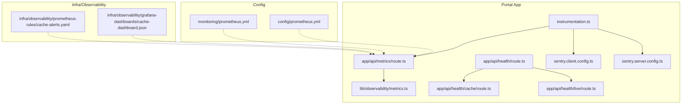
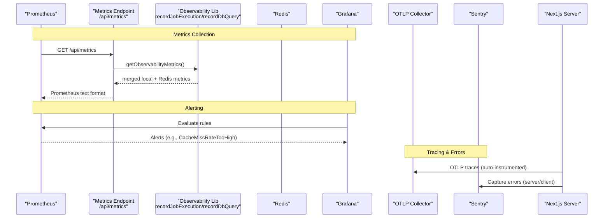
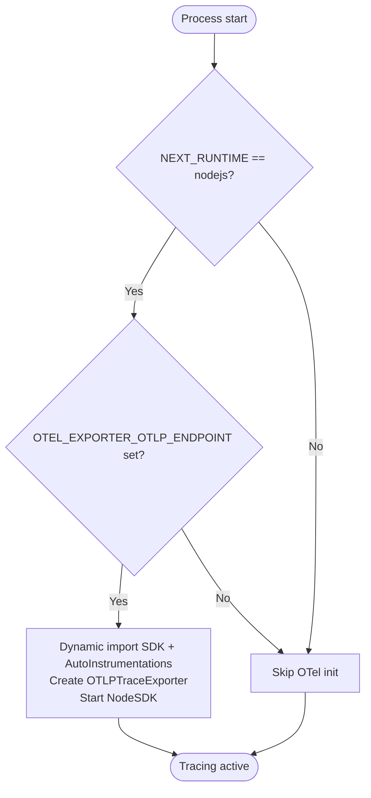
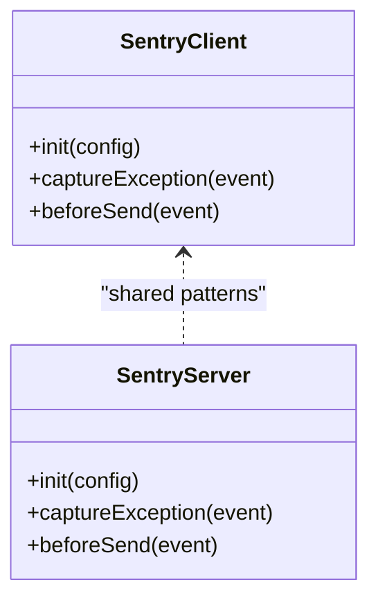
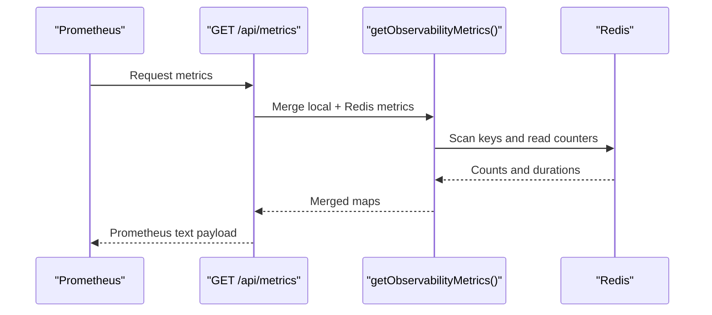
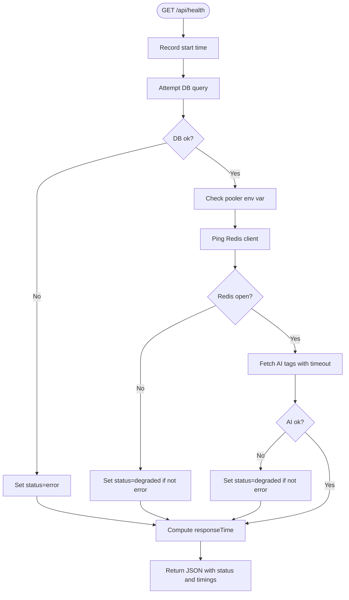
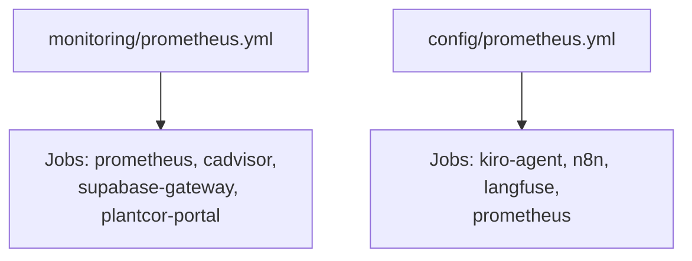
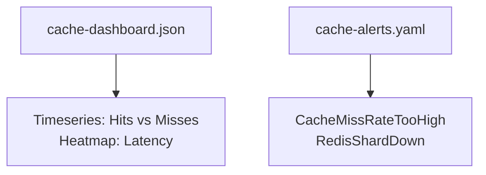
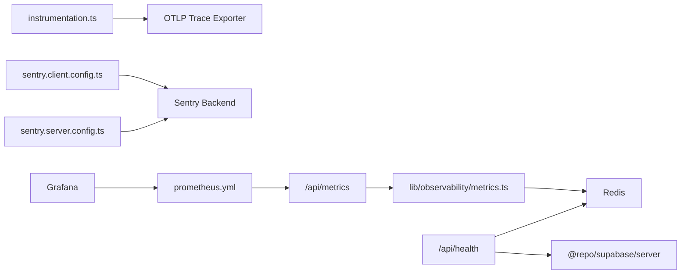

# Monitoring & Observability

<cite>
**Referenced Files in This Document**
- [instrumentation.ts](file://apps/portal/instrumentation.ts)
- [sentry.client.config.ts](file://apps/portal/sentry.client.config.ts)
- [sentry.server.config.ts](file://apps/portal/sentry.server.config.ts)
- [metrics route](file://apps/portal/app/api/metrics/route.ts)
- [observability metrics](file://apps/portal/lib/observability/metrics.ts)
- [health check](file://apps/portal/app/api/health/route.ts)
- [cache health](file://apps/portal/app/api/health/cache/route.ts)
- [live health](file://apps/portal/app/api/health/live/route.ts)
- [prometheus config (prod)](file://config/prometheus.yml)
- [prometheus config (dev)](file://monitoring/prometheus.yml)
- [grafana cache dashboard](file://infra/observability/grafana-dashboards/cache-dashboard.json)
- [prometheus rules (cache)](file://infra/observability/prometheus-rules/cache-alerts.yaml)
</cite>

## Table of Contents

1. Introduction
2. Project Structure
3. Core Components
4. Architecture Overview
5. Detailed Component Analysis
6. Dependency Analysis
7. Performance Considerations
8. Troubleshooting Guide
9. Conclusion
10. Appendices

## Introduction

This document explains the monitoring and observability setup for the Arch-Mk2 platform, focusing on:

- Prometheus scraping and Grafana dashboards/alerts
- OpenTelemetry distributed tracing instrumentation
- Custom metrics exposure via a dedicated endpoint
- Health checks for readiness and liveness
- Error tracking with Sentry across client and server
- Logging strategy and debugging approaches
- Alerting rules, dashboard creation, and incident response procedures

The goal is to provide both high-level guidance and code-mapped details so operators can deploy, tune, and troubleshoot effectively.

## Project Structure

Observability-related assets are spread across application code, configuration, and infrastructure:

- Application telemetry initialization and error capture
- Metrics export endpoint and custom metric collection
- Health endpoints for service and dependency checks
- Prometheus configurations for development and production
- Grafana dashboard definitions and alerting rules

**Diagram sources**

- [instrumentation.ts:1-61](file://apps/portal/instrumentation.ts#L1-L61)
- [metrics route:1-92](file://apps/portal/app/api/metrics/route.ts#L1-L92)
- [observability metrics:1-184](file://apps/portal/lib/observability/metrics.ts#L1-L184)
- [health check:1-83](file://apps/portal/app/api/health/route.ts#L1-L83)
- [cache health](file://apps/portal/app/api/health/cache/route.ts)
- [live health](file://apps/portal/app/api/health/live/route.ts)
- [sentry.client.config.ts:1-23](file://apps/portal/sentry.client.config.ts#L1-L23)
- [sentry.server.config.ts:1-25](file://apps/portal/sentry.server.config.ts#L1-L25)
- [prometheus config (prod):1-27](file://config/prometheus.yml#L1-L27)
- [prometheus config (dev):1-22](file://monitoring/prometheus.yml#L1-L22)
- [grafana cache dashboard:1-22](file://infra/observability/grafana-dashboards/cache-dashboard.json#L1-L22)
- [prometheus rules (cache):1-21](file://infra/observability/prometheus-rules/cache-alerts.yaml#L1-L21)

**Section sources**

- [instrumentation.ts:1-61](file://apps/portal/instrumentation.ts#L1-L61)
- [metrics route:1-92](file://apps/portal/app/api/metrics/route.ts#L1-L92)
- [observability metrics:1-184](file://apps/portal/lib/observability/metrics.ts#L1-L184)
- [health check:1-83](file://apps/portal/app/api/health/route.ts#L1-L83)
- [prometheus config (prod):1-27](file://config/prometheus.yml#L1-L27)
- [prometheus config (dev):1-22](file://monitoring/prometheus.yml#L1-L22)
- [grafana cache dashboard:1-22](file://infra/observability/grafana-dashboards/cache-dashboard.json#L1-L22)
- [prometheus rules (cache):1-21](file://infra/observability/prometheus-rules/cache-alerts.yaml#L1-L21)

## Core Components

- OpenTelemetry initialization and auto-instrumentation for Node.js runtime
- Sentry integration for client/server error tracking and sampling
- Custom metrics exporter at /api/metrics exposing cache, job, and DB query stats
- Health endpoints (/api/health, /api/health/cache, /api/health/live) for readiness/liveness
- Prometheus scrape targets and evaluation intervals
- Grafana dashboards and alerting rules

Key responsibilities:

- Collect and aggregate metrics locally and via Redis
- Export standardized Prometheus text format
- Initialize tracing and error capture safely in Node and Edge runtimes
- Provide actionable health signals for orchestrators and SLOs

**Section sources**

- [instrumentation.ts:1-61](file://apps/portal/instrumentation.ts#L1-L61)
- [sentry.client.config.ts:1-23](file://apps/portal/sentry.client.config.ts#L1-L23)
- [sentry.server.config.ts:1-25](file://apps/portal/sentry.server.config.ts#L1-L25)
- [metrics route:1-92](file://apps/portal/app/api/metrics/route.ts#L1-L92)
- [observability metrics:1-184](file://apps/portal/lib/observability/metrics.ts#L1-L184)
- [health check:1-83](file://apps/portal/app/api/health/route.ts#L1-L83)

## Architecture Overview

The portal app exposes metrics and health endpoints consumed by Prometheus and orchestration layers. Traces are exported over OTLP HTTP to an external collector. Errors are captured by Sentry. Grafana visualizes metrics and evaluates alert rules.

**Diagram sources**

- [metrics route:1-92](file://apps/portal/app/api/metrics/route.ts#L1-L92)
- [observability metrics:1-184](file://apps/portal/lib/observability/metrics.ts#L1-L184)
- [prometheus config (dev):1-22](file://monitoring/prometheus.yml#L1-L22)
- [prometheus config (prod):1-27](file://config/prometheus.yml#L1-L27)
- [grafana cache dashboard:1-22](file://infra/observability/grafana-dashboards/cache-dashboard.json#L1-L22)
- [prometheus rules (cache):1-21](file://infra/observability/prometheus-rules/cache-alerts.yaml#L1-L21)
- [instrumentation.ts:1-61](file://apps/portal/instrumentation.ts#L1-L61)
- [sentry.client.config.ts:1-23](file://apps/portal/sentry.client.config.ts#L1-L23)
- [sentry.server.config.ts:1-25](file://apps/portal/sentry.server.config.ts#L1-L25)

## Detailed Component Analysis

### OpenTelemetry Instrumentation

- Initialization occurs only in Node.js runtime when an OTLP endpoint is configured
- Uses dynamic imports to avoid bundling native gRPC modules
- Auto-instrumentations enabled for common Node libraries
- Service name derived from environment variables
- Sentry initialized for both Node and Edge runtimes with appropriate sampling

**Diagram sources**

- [instrumentation.ts:1-61](file://apps/portal/instrumentation.ts#L1-L61)

**Section sources**

- [instrumentation.ts:1-61](file://apps/portal/instrumentation.ts#L1-L61)

### Sentry Integration (Client and Server)

- Client-side initialization filters sensitive fields and controls replay sampling
- Server-side initialization redacts sensitive headers and sets environment-aware sampling
- Both use DSN values from environment variables

**Diagram sources**

- [sentry.client.config.ts:1-23](file://apps/portal/sentry.client.config.ts#L1-L23)
- [sentry.server.config.ts:1-25](file://apps/portal/sentry.server.config.ts#L1-L25)

**Section sources**

- [sentry.client.config.ts:1-23](file://apps/portal/sentry.client.config.ts#L1-L23)
- [sentry.server.config.ts:1-25](file://apps/portal/sentry.server.config.ts#L1-L25)

### Custom Metrics Exporter (/api/metrics)

- Exposes Prometheus-compatible text format
- Aggregates:
  - Cache hits/misses/errors and latency gauges
  - Inngest job execution counts, errors, and cumulative durations
  - Database query execution counts, errors, and cumulative durations
- Labels include source tiers, job IDs, table names, and operations

**Diagram sources**

- [metrics route:1-92](file://apps/portal/app/api/metrics/route.ts#L1-L92)
- [observability metrics:1-184](file://apps/portal/lib/observability/metrics.ts#L1-L184)

**Section sources**

- [metrics route:1-92](file://apps/portal/app/api/metrics/route.ts#L1-L92)
- [observability metrics:1-184](file://apps/portal/lib/observability/metrics.ts#L1-L184)

### Health Checks

- Primary health endpoint checks database connectivity, pooler status, Redis availability, and AI router reachability; returns degraded or error states accordingly
- Additional endpoints exist for cache-specific and live health checks

**Diagram sources**

- [health check:1-83](file://apps/portal/app/api/health/route.ts#L1-L83)

**Section sources**

- [health check:1-83](file://apps/portal/app/api/health/route.ts#L1-L83)
- [cache health](file://apps/portal/app/api/health/cache/route.ts)
- [live health](file://apps/portal/app/api/health/live/route.ts)

### Prometheus Configuration

- Development configuration includes cadvisor, Supabase gateway, and portal metrics path
- Production configuration includes multiple jobs (agent, n8n, langfuse, self-scrape)

**Diagram sources**

- [prometheus config (dev):1-22](file://monitoring/prometheus.yml#L1-L22)
- [prometheus config (prod):1-27](file://config/prometheus.yml#L1-L27)

**Section sources**

- [prometheus config (dev):1-22](file://monitoring/prometheus.yml#L1-L22)
- [prometheus config (prod):1-27](file://config/prometheus.yml#L1-L27)

### Grafana Dashboards and Alerting Rules

- Dashboard example focuses on cache telemetry panels (hits vs misses, latency heatmap)
- Alert rules define thresholds for cache miss rate and shard down events

**Diagram sources**

- [grafana cache dashboard:1-22](file://infra/observability/grafana-dashboards/cache-dashboard.json#L1-L22)
- [prometheus rules (cache):1-21](file://infra/observability/prometheus-rules/cache-alerts.yaml#L1-L21)

**Section sources**

- [grafana cache dashboard:1-22](file://infra/observability/grafana-dashboards/cache-dashboard.json#L1-L22)
- [prometheus rules (cache):1-21](file://infra/observability/prometheus-rules/cache-alerts.yaml#L1-L21)

## Dependency Analysis

- The metrics endpoint depends on the observability library for aggregation and Redis for cross-process consistency
- Health endpoints depend on Supabase client and Redis client
- Telemetry initialization depends on environment variables and Next.js runtime detection
- Prometheus scrapes the portal’s metrics endpoint and other services defined in configs
- Grafana consumes Prometheus data and applies alert rules

**Diagram sources**

- [metrics route:1-92](file://apps/portal/app/api/metrics/route.ts#L1-L92)
- [observability metrics:1-184](file://apps/portal/lib/observability/metrics.ts#L1-L184)
- [health check:1-83](file://apps/portal/app/api/health/route.ts#L1-L83)
- [instrumentation.ts:1-61](file://apps/portal/instrumentation.ts#L1-L61)
- [sentry.client.config.ts:1-23](file://apps/portal/sentry.client.config.ts#L1-L23)
- [sentry.server.config.ts:1-25](file://apps/portal/sentry.server.config.ts#L1-L25)
- [prometheus config (dev):1-22](file://monitoring/prometheus.yml#L1-L22)
- [prometheus config (prod):1-27](file://config/prometheus.yml#L1-L27)

**Section sources**

- [metrics route:1-92](file://apps/portal/app/api/metrics/route.ts#L1-L92)
- [observability metrics:1-184](file://apps/portal/lib/observability/metrics.ts#L1-L184)
- [health check:1-83](file://apps/portal/app/api/health/route.ts#L1-L83)
- [instrumentation.ts:1-61](file://apps/portal/instrumentation.ts#L1-L61)
- [sentry.client.config.ts:1-23](file://apps/portal/sentry.client.config.ts#L1-L23)
- [sentry.server.config.ts:1-25](file://apps/portal/sentry.server.config.ts#L1-L25)
- [prometheus config (dev):1-22](file://monitoring/prometheus.yml#L1-L22)
- [prometheus config (prod):1-27](file://config/prometheus.yml#L1-L27)

## Performance Considerations

- Use short scrape intervals in development for fast feedback; keep production intervals conservative to reduce overhead
- Prefer gauges for latency percentiles and counters for totals; ensure labels are bounded to avoid cardinality spikes
- Avoid excessive Redis scans; batch key enumeration and consider TTLs for metric keys
- Sample traces appropriately in production to balance visibility and cost
- Redact sensitive data before sending to external systems (already implemented in Sentry)

[No sources needed since this section provides general guidance]

## Troubleshooting Guide

- If metrics are missing:
  - Verify Prometheus scrape target for the portal metrics endpoint
  - Confirm Redis connectivity and that metric keys are being written
- If health shows degraded:
  - Inspect individual dependency checks (DB, Redis, AI router) and timeouts
- If traces are not visible:
  - Ensure OTLP endpoint is configured and reachable
  - Validate service name and auto-instrumentations are initialized
- If Sentry events lack context:
  - Check beforeSend filters and header scrubbing behavior
  - Confirm DSN and environment settings

**Section sources**

- [metrics route:1-92](file://apps/portal/app/api/metrics/route.ts#L1-L92)
- [observability metrics:1-184](file://apps/portal/lib/observability/metrics.ts#L1-L184)
- [health check:1-83](file://apps/portal/app/api/health/route.ts#L1-L83)
- [instrumentation.ts:1-61](file://apps/portal/instrumentation.ts#L1-L61)
- [sentry.client.config.ts:1-23](file://apps/portal/sentry.client.config.ts#L1-L23)
- [sentry.server.config.ts:1-25](file://apps/portal/sentry.server.config.ts#L1-L25)

## Conclusion

The Arch-Mk2 platform implements a comprehensive observability stack:

- OpenTelemetry for distributed tracing with auto-instrumentation
- Sentry for robust error tracking with sensitive data filtering
- Custom Prometheus metrics covering cache, jobs, and database queries
- Health endpoints providing granular readiness and dependency status
- Grafana dashboards and alert rules for visualization and proactive notifications

Adhering to the practices outlined here will improve reliability, speed up incident diagnosis, and support continuous improvement of system performance.

[No sources needed since this section summarizes without analyzing specific files]

## Appendices

### Log Aggregation and Structured Logging

- Centralize logs using a log shipper (e.g., Vector) and forward to a structured logging backend
- Include correlation IDs propagated from OpenTelemetry spans to correlate logs with traces
- Enforce consistent JSON structure with fields such as timestamp, level, service, traceId, spanId, and message

[No sources needed since this section provides general guidance]

### Incident Response Procedures

- On alert firing:
  - Acknowledge and triage based on severity
  - Correlate metrics, traces, and logs using shared identifiers
  - Validate health endpoints and dependency status
  - Roll back recent changes if correlated with degradation
  - Postmortem with action items and dashboard updates

[No sources needed since this section provides general guidance]
