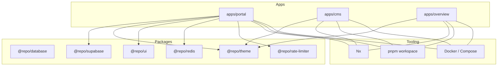
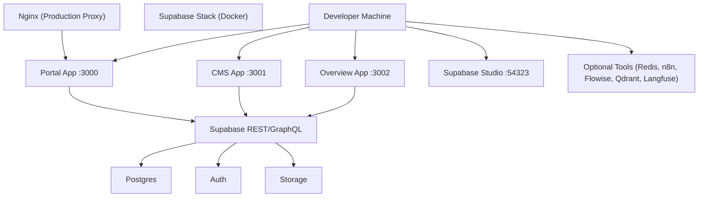
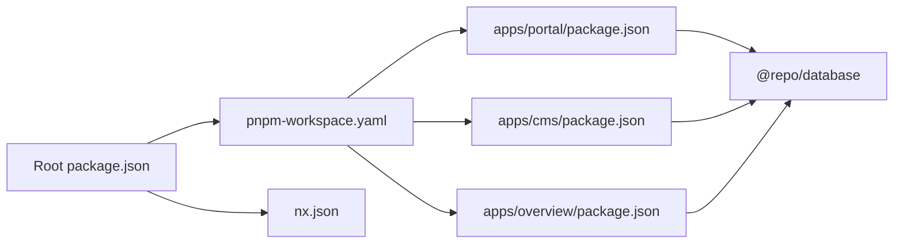

# Getting Started

<cite>
**Referenced Files in This Document**
- [README.md](file://README.md)
- [package.json](file://package.json)
- [pnpm-workspace.yaml](file://pnpm-workspace.yaml)
- [nx.json](file://nx.json)
- [apps/portal/package.json](file://apps/portal/package.json)
- [apps/cms/package.json](file://apps/cms/package.json)
- [apps/overview/package.json](file://apps/overview/package.json)
- [scripts/dev.sh](file://scripts/dev.sh)
- [docker-compose.portal.yml](file://docker-compose.portal.yml)
- [apps/portal/Dockerfile](file://apps/portal/Dockerfile)
- [packages/database/package.json](file://packages/database/package.json)
- [wiki/concepts/supabase-local-dev.md](file://wiki/concepts/supabase-local-dev.md)
- [wiki/raw/articles/supabase-local-dev-guide.md](file://wiki/raw/articles/supabase-local-dev-guide.md)
- [apps/portal/lib/env.ts](file://apps/portal/lib/env.ts)
</cite>

## Table of Contents

1. Introduction
2. Project Structure
3. Core Components
4. Architecture Overview
5. Detailed Component Analysis
6. Dependency Analysis
7. Performance Considerations
8. Troubleshooting Guide
9. Conclusion
10. Appendices

## Introduction

Arch-Mk2 is an industrial mining-operations portal built as a pnpm + Nx monorepo with three Next.js applications and shared packages. It provides:

- A main operations dashboard (Portal)
- A content management system (CMS)
- An architecture/flow viewer (Overview)

The platform uses Supabase for local development, Docker for infrastructure, and modern tooling for quality and performance.

## Project Structure

At the root you will find:

- apps/: Three Next.js applications (portal, cms, overview)
- packages/: Shared libraries (database client, theme, UI primitives, Redis, rate limiter, etc.)
- scripts/: Development and deployment helpers
- docker-compose.\*: Compose files for running services locally or in production-like environments
- nx.json: Task orchestration and caching configuration
- pnpm-workspace.yaml: Workspace and catalog definitions

**Diagram sources**

- [pnpm-workspace.yaml:1-33](file://pnpm-workspace.yaml#L1-L33)
- [nx.json:1-139](file://nx.json#L1-L139)
- [apps/portal/package.json:1-76](file://apps/portal/package.json#L1-L76)
- [apps/cms/package.json:1-32](file://apps/cms/package.json#L1-L32)
- [apps/overview/package.json:1-36](file://apps/overview/package.json#L1-L36)

**Section sources**

- [README.md:1-58](file://README.md#L1-L58)
- [pnpm-workspace.yaml:1-33](file://pnpm-workspace.yaml#L1-L33)
- [nx.json:1-139](file://nx.json#L1-L139)

## Core Components

- Portal app (Next.js 16, React 19): Main operations dashboard on port 3000 by default.
- CMS app (Payload CMS v3): Content management on port 3001.
- Overview app: Architecture/flow viewer on port 3002.
- Shared packages: Database client, SQL migrations source of truth, design tokens, UI primitives, Redis caching, rate limiting, and more.

Key environment variables used by the Portal include Supabase URLs and keys, Sentry DSN, Redis URL, AI provider settings, and N8N/FLOWISE integrations.

**Section sources**

- [README.md:1-58](file://README.md#L1-L58)
- [apps/portal/package.json:1-76](file://apps/portal/package.json#L1-L76)
- [apps/cms/package.json:1-32](file://apps/cms/package.json#L1-L32)
- [apps/overview/package.json:1-36](file://apps/overview/package.json#L1-L36)
- [apps/portal/lib/env.ts:114-144](file://apps/portal/lib/env.ts#L114-L144)

## Architecture Overview

Local development typically runs:

- Supabase stack via Docker (API, Studio, Postgres)
- Next.js dev servers for each app
- Optional tools (Redis, n8n, Flowise, Qdrant, Langfuse) via compose
- Nginx reverse proxy in production-like setups

**Diagram sources**

- [scripts/dev.sh:497-564](file://scripts/dev.sh#L497-L564)
- [docker-compose.portal.yml:1-37](file://docker-compose.portal.yml#L1-L37)

## Detailed Component Analysis

### Development Environment Setup

Prerequisites:

- Node.js 24.15.0 (pinned via Volta; engines require >=22)
- pnpm 9.15.9 (workspace package manager)
- Docker installed and running (for Supabase and optional tools)
- Supabase CLI available via devDependencies

Recommended:

- Use Volta to enforce exact versions across machines
- Ensure ports 3000, 3001, 3002 are free
- Ensure ports 54321–54324 are free for Supabase

Installation steps:

1. Install dependencies at the repository root:
   - pnpm install
2. Start the full development environment (includes Supabase, health checks, and browser launch):
   - pnpm dev
3. Quick mode (no Docker/Supabase, Portal only):
   - pnpm dev --quick

Initial configuration:

- The dev script copies .env.example to .env if missing and warns about placeholder secrets.
- After starting Supabase locally, add the database URL and keys to your .env file.

First-time deployment guidance:

- For local containerized run with Nginx proxy:
  - docker compose -f docker-compose.portal.yml up
- For production builds:
  - pnpm build
  - Use the provided Dockerfile for a multi-stage, pruned build producing a standalone output.

Common commands:

- pnpm dev — Full dev (Supabase + Portal + health checks + browser)
- pnpm dev --quick — Portal only, no Docker
- pnpm quality — lint + type-check + test + token/css lint + format + syncpack + knip
- pnpm build — Build everything
- pnpm test — Unit tests
- pnpm test:e2e — E2E (requires dev server running)
- pnpm format — Format all files

**Section sources**

- [package.json:28-95](file://package.json#L28-L95)
- [scripts/dev.sh:351-496](file://scripts/dev.sh#L351-L496)
- [scripts/dev.sh:497-564](file://scripts/dev.sh#L497-L564)
- [scripts/dev.sh:566-644](file://scripts/dev.sh#L566-L644)
- [scripts/dev.sh:645-690](file://scripts/dev.sh#L645-L690)
- [docker-compose.portal.yml:1-37](file://docker-compose.portal.yml#L1-L37)
- [apps/portal/Dockerfile:1-64](file://apps/portal/Dockerfile#L1-L64)
- [wiki/concepts/supabase-local-dev.md:1-100](file://wiki/concepts/supabase-local-dev.md#L1-L100)
- [wiki/raw/articles/supabase-local-dev-guide.md:1-41](file://wiki/raw/articles/supabase-local-dev-guide.md#L1-L41)

### Supabase Local Development

Setup flow:

1. pnpm install
2. Link to remote project (optional): pnpm run supabase:link
3. Start local stack: pnpm run supabase:dev
4. Open Studio at http://127.0.0.1:54323
5. Add the database URL and keys from CLI output to .env

Remote sync:

- Pull remote schema: pnpm run supabase:pull
- Push local changes: pnpm run supabase:push

Best practices:

- Commit migration files for team consistency and rollback
- Use local Supabase for dev/testing; switch env vars for staging/production
- Reset local DB before major schema changes
- Never hardcode sensitive keys; use environment variables and .gitignore
- Enable and test Row Level Security policies in local Studio

Troubleshooting:

- Docker not running: start Docker daemon
- Port conflicts: check ports 54321–54324
- Migration drift: reset local DB and restart
- Auth not working locally: verify SUPABASE_URL and SUPABASE_ANON_KEY match CLI output; ensure triggers and RLS policies allow auth flows

**Section sources**

- [packages/database/package.json:12-22](file://packages/database/package.json#L12-L22)
- [wiki/concepts/supabase-local-dev.md:1-100](file://wiki/concepts/supabase-local-dev.md#L1-L100)
- [wiki/raw/articles/supabase-local-dev-guide.md:1-41](file://wiki/raw/articles/supabase-local-dev-guide.md#L1-L41)

### Application Entry Points and Ports

- Portal: Next.js dev server on port 3000 by default
- CMS: Payload CMS on port 3001
- Overview: Architecture viewer on port 3002

These are orchestrated by the dev script and can be started individually or together.

**Section sources**

- [README.md:7-14](file://README.md#L7-L14)
- [apps/portal/package.json:66-74](file://apps/portal/package.json#L66-L74)
- [apps/cms/package.json:23-30](file://apps/cms/package.json#L23-L30)
- [apps/overview/package.json:28-34](file://apps/overview/package.json#L28-L34)

### Build and Containerization

The Portal Dockerfile uses a four-stage build:

- Pruner: Turbo prune to scope only required packages
- Deps: Install dependencies with pnpm store cache mount
- Builder: Build Next.js with cache mount and embed build-time env vars
- Production: Distroless image serving the standalone output

Compose file defines:

- Portal service with healthcheck
- Nginx reverse proxy exposing 80/443 and mounting certs/cache

**Section sources**

- [apps/portal/Dockerfile:1-64](file://apps/portal/Dockerfile#L1-L64)
- [docker-compose.portal.yml:1-37](file://docker-compose.portal.yml#L1-L37)

## Dependency Analysis

Workspace and catalogs:

- pnpm workspace includes apps/_ and packages/_
- Catalog centralizes common dependency versions (React 19, Tailwind, ESLint, Prettier, Supabase JS, etc.)
- Nx orchestrates tasks with caching and target defaults

**Diagram sources**

- [pnpm-workspace.yaml:1-33](file://pnpm-workspace.yaml#L1-L33)
- [nx.json:1-139](file://nx.json#L1-L139)
- [package.json:1-96](file://package.json#L1-L96)
- [apps/portal/package.json:1-76](file://apps/portal/package.json#L1-L76)
- [apps/cms/package.json:1-32](file://apps/cms/package.json#L1-L32)
- [apps/overview/package.json:1-36](file://apps/overview/package.json#L1-L36)

**Section sources**

- [pnpm-workspace.yaml:1-33](file://pnpm-workspace.yaml#L1-L33)
- [nx.json:1-139](file://nx.json#L1-L139)
- [package.json:1-96](file://package.json#L1-L96)

## Performance Considerations

- Use quick mode when you do not need Supabase during rapid iteration.
- Leverage Nx caching for builds, type checks, and tests.
- Keep Docker images lean using the provided multi-stage Dockerfile.
- Monitor health endpoints and logs generated by the dev script.

## Troubleshooting Guide

Common issues and resolutions:

- Docker not running: Start Docker Desktop or daemon; the dev script attempts to start it automatically on some platforms.
- Port conflicts: The dev script detects and prompts to clear ports for Supabase and apps; use --force to auto-clear.
- Missing .env: The dev script copies .env.example to .env and warns about placeholders.
- Supabase API timeout: Ensure ports 54321–54324 are free and Docker has enough resources.
- Auth not working locally: Verify SUPABASE_URL and SUPABASE_ANON_KEY in .env match CLI output; ensure triggers and RLS policies allow auth flows.
- Migration drift: Reset local DB and restart Supabase.

Useful checks:

- Health endpoint: http://localhost:3000/api/health
- Login page: http://localhost:3000/login
- Supabase Studio: http://127.0.0.1:54323
- Supabase API: http://127.0.0.1:54321

**Section sources**

- [scripts/dev.sh:351-496](file://scripts/dev.sh#L351-L496)
- [scripts/dev.sh:497-564](file://scripts/dev.sh#L497-L564)
- [scripts/dev.sh:645-690](file://scripts/dev.sh#L645-L690)
- [wiki/concepts/supabase-local-dev.md:63-100](file://wiki/concepts/supabase-local-dev.md#L63-L100)
- [wiki/raw/articles/supabase-local-dev-guide.md:1-41](file://wiki/raw/articles/supabase-local-dev-guide.md#L1-L41)

## Conclusion

You now have the essentials to set up, run, and deploy Arch-Mk2 locally and in production-like containers. Use the dev script for a smooth first run, follow Supabase local development best practices, and leverage Nx and Docker for consistent builds and deployments.

## Appendices

### First-Time Run Checklist

- Install Node.js 24.15.0 and pnpm 9.15.9 (or use Volta)
- Ensure Docker is installed and running
- Run pnpm install
- Run pnpm dev (or pnpm dev --quick)
- Configure .env with Supabase credentials and other secrets
- Open http://localhost:3000/login

### Useful Links

- Supabase local development guide
- Supabase local development concept doc

[No sources needed since this section summarizes without analyzing specific files]
