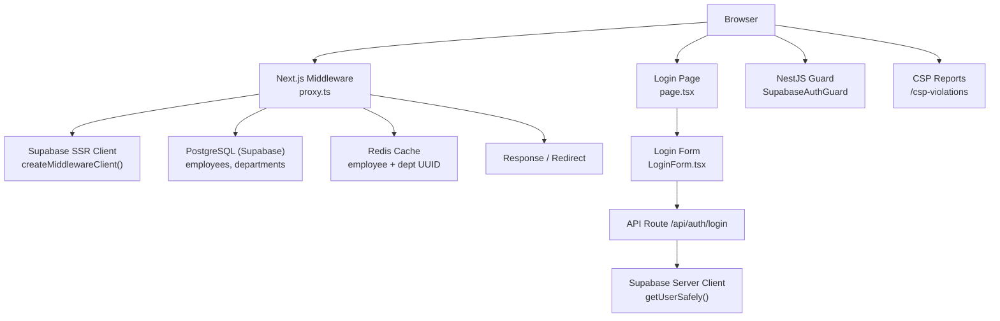
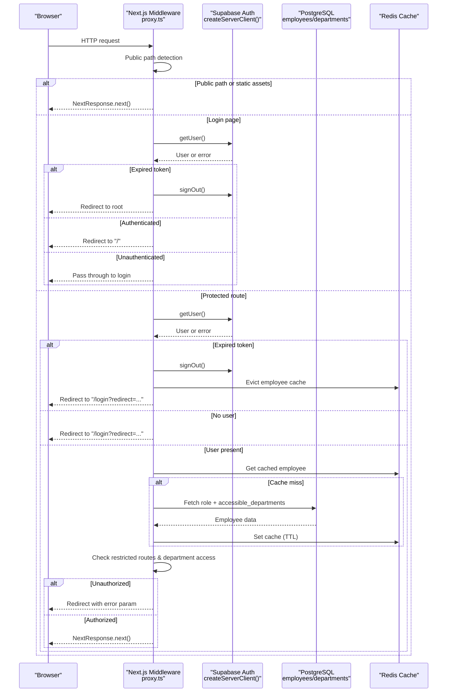
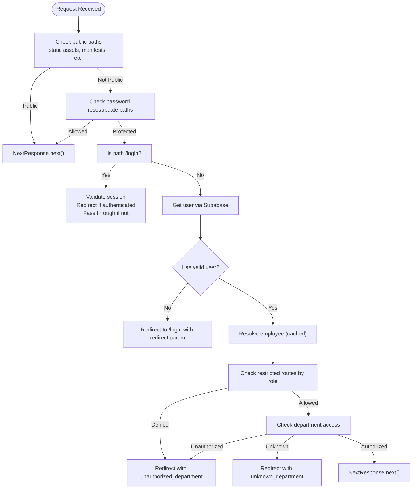
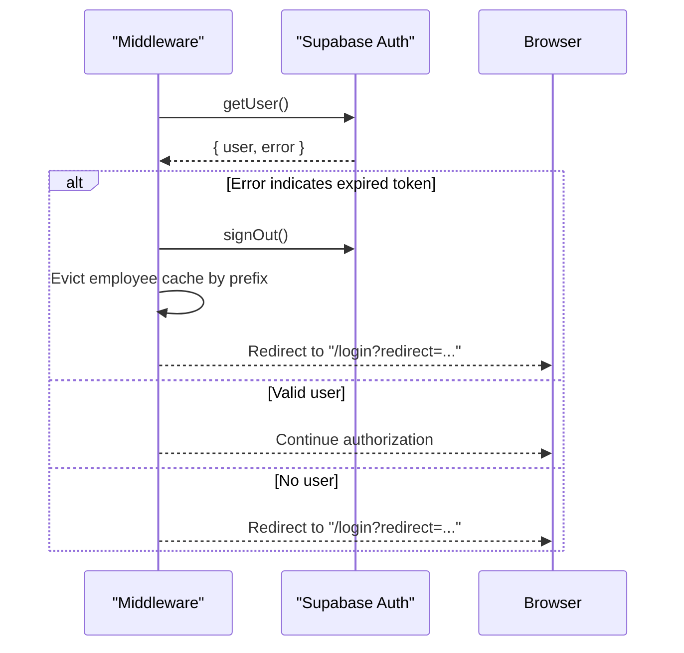
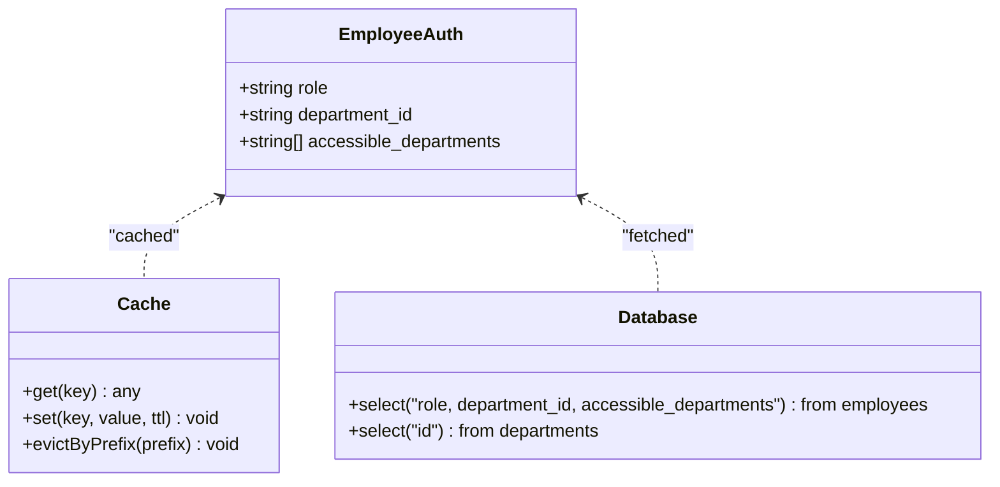
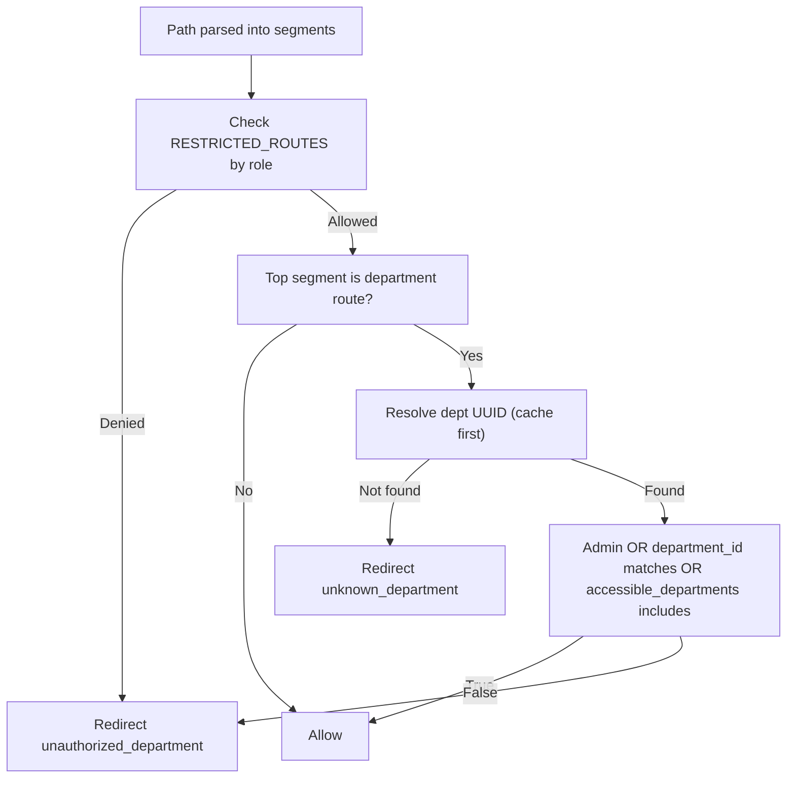
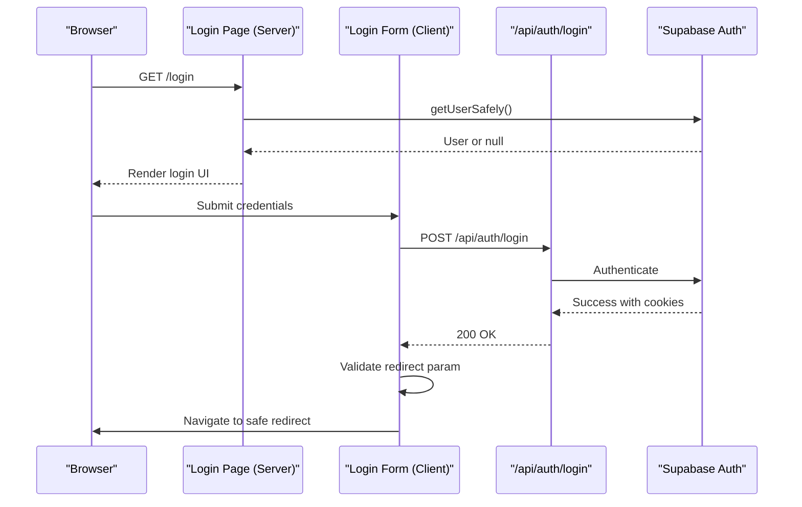
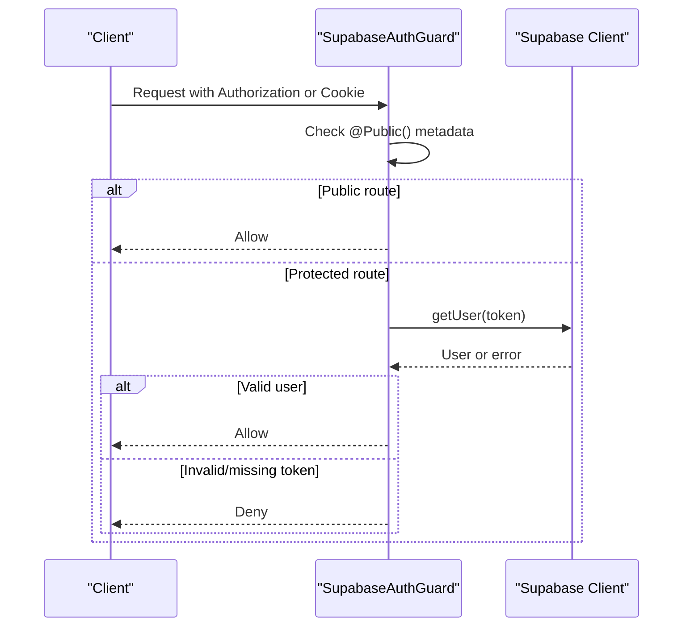
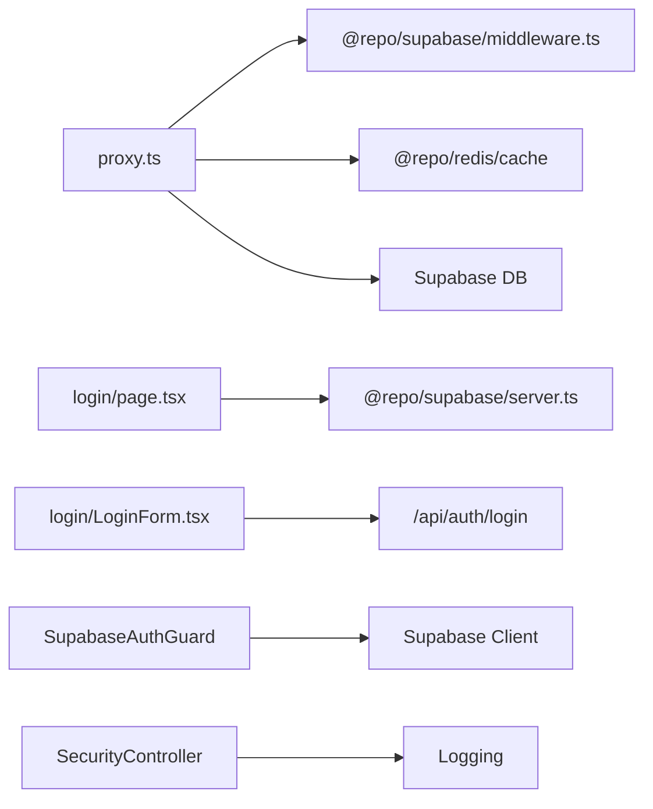

# Authentication Middleware

<cite>
**Referenced Files in This Document**
- [proxy.ts](file://apps/portal/proxy.ts)
- [middleware.ts](file://packages/supabase/src/middleware.ts)
- [server.ts](file://packages/supabase/src/server.ts)
- [page.tsx](file://apps/portal/app/(auth)/login/page.tsx)
- [LoginForm.tsx](file://apps/portal/app/(auth)/login/LoginForm.tsx)
- [001_initial.sql](file://packages/database/migrations/001_initial.sql)
- [supabase-auth.guard.ts](file://apps/api/src/auth/guards/supabase-auth.guard.ts)
- [security.controller.ts](file://apps/api/src/security/security.controller.ts)
</cite>

## Table of Contents

1. [Introduction](#introduction)
2. [Project Structure](#project-structure)
3. [Core Components](#core-components)
4. [Architecture Overview](#architecture-overview)
5. [Detailed Component Analysis](#detailed-component-analysis)
6. [Dependency Analysis](#dependency-analysis)
7. [Performance Considerations](#performance-considerations)
8. [Troubleshooting Guide](#troubleshooting-guide)
9. [Conclusion](#conclusion)
10. [Appendices](#appendices)

## Introduction

This document explains the authentication middleware implementation that protects Next.js routes using Supabase Auth. It covers how requests are intercepted, how sessions and JWT tokens are validated, how token expiration is handled, and how employee roles and department access permissions are resolved with caching. It also provides guidance for adding protected routes, implementing custom authorization logic, handling authentication errors, and security considerations such as CSRF protection, redirect validation, and secure cookie handling.

## Project Structure

The authentication flow spans several layers:

- Next.js middleware intercepts incoming requests and enforces authentication and authorization.
- Supabase SSR client manages cookies and session validation.
- Login page and form handle user sign-in and SSO flows.
- Database schema defines employees and departments used for role-based access control.
- API guard (NestJS) validates tokens for backend endpoints.
- CSP reporting endpoint captures policy violations.

**Diagram sources**

- [proxy.ts:263-375](file://apps/portal/proxy.ts#L263-L375)
- [middleware.ts:4-43](file://packages/supabase/src/middleware.ts#L4-L43)
- [server.ts:49-99](file://packages/supabase/src/server.ts#L49-L99)
- [page.tsx:15-31](<file://apps/portal/app/(auth)/login/page.tsx#L15-L31>)
- [LoginForm.tsx:74-145](<file://apps/portal/app/(auth)/login/LoginForm.tsx#L74-L145>)
- [supabase-auth.guard.ts:22-47](file://apps/api/src/auth/guards/supabase-auth.guard.ts#L22-L47)
- [security.controller.ts:25-44](file://apps/api/src/security/security.controller.ts#L25-L44)

**Section sources**

- [proxy.ts:1-56](file://apps/portal/proxy.ts#L1-L56)
- [middleware.ts:1-44](file://packages/supabase/src/middleware.ts#L1-L44)
- [server.ts:49-99](file://packages/supabase/src/server.ts#L49-L99)
- [page.tsx:15-31](<file://apps/portal/app/(auth)/login/page.tsx#L15-L31>)
- [LoginForm.tsx:74-145](<file://apps/portal/app/(auth)/login/LoginForm.tsx#L74-L145>)
- [supabase-auth.guard.ts:22-47](file://apps/api/src/auth/guards/supabase-auth.guard.ts#L22-L47)
- [security.controller.ts:25-44](file://apps/api/src/security/security.controller.ts#L25-L44)

## Core Components

- Request interception and routing decisions: The middleware decides whether to pass through, redirect to login, or enforce authorization based on path patterns and session state.
- Session validation: Uses Supabase SSR client to read and refresh cookies and validate the current user.
- Token expiration handling: Detects specific refresh token errors and triggers a clean sign-out and redirect.
- Employee resolution and caching: Resolves user roles and department access from the database and caches results to reduce latency.
- Department access checks: Validates top-level route segments against allowed departments and restricted routes by role.
- Secure cookie handling: Ensures HttpOnly, Secure, SameSite=Lax cookies are set appropriately.
- Redirect validation: Prevents open redirects by validating allowed paths.

**Section sources**

- [proxy.ts:6-45](file://apps/portal/proxy.ts#L6-L45)
- [proxy.ts:163-187](file://apps/portal/proxy.ts#L163-L187)
- [proxy.ts:204-221](file://apps/portal/proxy.ts#L204-L221)
- [proxy.ts:245-261](file://apps/portal/proxy.ts#L245-L261)
- [middleware.ts:11-33](file://packages/supabase/src/middleware.ts#L11-L33)
- [server.ts:88-99](file://packages/supabase/src/server.ts#L88-L99)

## Architecture Overview

The middleware orchestrates authentication and authorization across multiple services and caches.

**Diagram sources**

- [proxy.ts:263-375](file://apps/portal/proxy.ts#L263-L375)
- [middleware.ts:4-43](file://packages/supabase/src/middleware.ts#L4-L43)
- [server.ts:88-99](file://packages/supabase/src/server.ts#L88-L99)

## Detailed Component Analysis

### Middleware Entry Point and Flow Control

- Public path detection: Static file extensions, manifest files, robots.txt, sitemap.xml, service worker, and workbox scripts are bypassed.
- Password reset/update pages are passed through without auth checks.
- Login page special handling: If an authenticated user tries to access /login, they are redirected to the home page; otherwise, the page is served.
- Protected routes: For non-public paths, the middleware validates the session and enforces authorization.

**Diagram sources**

- [proxy.ts:138-159](file://apps/portal/proxy.ts#L138-L159)
- [proxy.ts:263-375](file://apps/portal/proxy.ts#L263-L375)

**Section sources**

- [proxy.ts:138-159](file://apps/portal/proxy.ts#L138-L159)
- [proxy.ts:263-375](file://apps/portal/proxy.ts#L263-L375)

### Session Validation and JWT Expiration Handling

- Session retrieval: The middleware uses Supabase’s server client to get the current user from cookies.
- Token expiration detection: Errors containing “Invalid Refresh Token” or “Refresh Token Not Found” are treated as expired sessions.
- Sign-out behavior: On expiration, the middleware calls signOut(), clears relevant cache entries, and redirects to the login page.

**Diagram sources**

- [proxy.ts:163-187](file://apps/portal/proxy.ts#L163-L187)
- [proxy.ts:317-335](file://apps/portal/proxy.ts#L317-L335)

**Section sources**

- [proxy.ts:69-78](file://apps/portal/proxy.ts#L69-L78)
- [proxy.ts:163-187](file://apps/portal/proxy.ts#L163-L187)
- [proxy.ts:317-335](file://apps/portal/proxy.ts#L317-L335)

### Employee Resolution and Caching

- Employee data model: Role, primary department_id, and array of accessible_departments are fetched from the employees table linked to auth.users.
- Caching strategy: Results are cached under keys like arch:auth:employee:{userId} with a TTL to reduce database load.
- Department UUID resolution: Department slugs are mapped to UUIDs and cached under dept:uuid:{slug}.

**Diagram sources**

- [proxy.ts:198-221](file://apps/portal/proxy.ts#L198-L221)
- [proxy.ts:119-136](file://apps/portal/proxy.ts#L119-L136)
- [001_initial.sql:27-35](file://packages/database/migrations/001_initial.sql#L27-L35)

**Section sources**

- [proxy.ts:198-221](file://apps/portal/proxy.ts#L198-L221)
- [proxy.ts:119-136](file://apps/portal/proxy.ts#L119-L136)
- [001_initial.sql:27-35](file://packages/database/migrations/001_initial.sql#L27-L35)

### Authorization Logic: Restricted Routes and Department Access

- Restricted routes: Certain top-level routes require specific roles (e.g., admin, supervisor). A secondary segment “tools” can be restricted independently.
- Department access: For department-scoped routes, the middleware checks if the user is admin, belongs to the department, or has explicit access via accessible_departments.
- Unknown department: If a department slug cannot be resolved, the request is redirected with an error parameter.

**Diagram sources**

- [proxy.ts:58-63](file://apps/portal/proxy.ts#L58-L63)
- [proxy.ts:223-243](file://apps/portal/proxy.ts#L223-L243)
- [proxy.ts:245-261](file://apps/portal/proxy.ts#L245-L261)

**Section sources**

- [proxy.ts:58-63](file://apps/portal/proxy.ts#L58-L63)
- [proxy.ts:223-243](file://apps/portal/proxy.ts#L223-L243)
- [proxy.ts:245-261](file://apps/portal/proxy.ts#L245-L261)

### Login Page Handling and Redirect Parameter Security

- Login page rendering: The server-side login page checks for existing auth cookies and attempts to validate the session safely. If the system is unavailable, it shows an error state.
- Redirect parameter validation: The login form validates the redirect target to prevent open redirects, ensuring only internal relative URLs pointing to application routes are accepted.

**Diagram sources**

- [page.tsx:15-31](<file://apps/portal/app/(auth)/login/page.tsx#L15-L31>)
- [server.ts:88-99](file://packages/supabase/src/server.ts#L88-L99)
- [LoginForm.tsx:18-38](<file://apps/portal/app/(auth)/login/LoginForm.tsx#L18-L38>)
- [LoginForm.tsx:74-145](<file://apps/portal/app/(auth)/login/LoginForm.tsx#L74-L145>)

**Section sources**

- [page.tsx:15-31](<file://apps/portal/app/(auth)/login/page.tsx#L15-L31>)
- [server.ts:88-99](file://packages/supabase/src/server.ts#L88-L99)
- [LoginForm.tsx:18-38](<file://apps/portal/app/(auth)/login/LoginForm.tsx#L18-L38>)
- [LoginForm.tsx:74-145](<file://apps/portal/app/(auth)/login/LoginForm.tsx#L74-L145>)

### API Guard for Backend Endpoints (NestJS)

- Global guard: Validates Supabase session tokens via Authorization header or sb-access-token cookie.
- Public routes: Decorated with @Public() to skip authentication.
- Token extraction: Supports Bearer tokens and cookie-based tokens.

**Diagram sources**

- [supabase-auth.guard.ts:22-47](file://apps/api/src/auth/guards/supabase-auth.guard.ts#L22-L47)

**Section sources**

- [supabase-auth.guard.ts:22-47](file://apps/api/src/auth/guards/supabase-auth.guard.ts#L22-L47)

### CSP Reporting Endpoint

- Receives Content-Security-Policy violation reports and logs them without exposing sensitive details.

**Section sources**

- [security.controller.ts:25-44](file://apps/api/src/security/security.controller.ts#L25-L44)

## Dependency Analysis

- Middleware depends on:
  - Supabase SSR client for session management and cookie handling.
  - Redis cache for employee and department UUID lookups.
  - PostgreSQL via Supabase for employee and department data.
- Login page depends on:
  - Supabase server client for safe user retrieval.
  - Client-side form for credential submission and redirect validation.
- API guard depends on:
  - Supabase client for token validation.
  - NestJS decorators for public route exemptions.

**Diagram sources**

- [proxy.ts:1-4](file://apps/portal/proxy.ts#L1-L4)
- [middleware.ts:1-44](file://packages/supabase/src/middleware.ts#L1-L44)
- [server.ts:49-99](file://packages/supabase/src/server.ts#L49-L99)
- [supabase-auth.guard.ts:22-47](file://apps/api/src/auth/guards/supabase-auth.guard.ts#L22-L47)
- [security.controller.ts:25-44](file://apps/api/src/security/security.controller.ts#L25-L44)

**Section sources**

- [proxy.ts:1-4](file://apps/portal/proxy.ts#L1-L4)
- [middleware.ts:1-44](file://packages/supabase/src/middleware.ts#L1-L44)
- [server.ts:49-99](file://packages/supabase/src/server.ts#L49-L99)
- [supabase-auth.guard.ts:22-47](file://apps/api/src/auth/guards/supabase-auth.guard.ts#L22-L47)
- [security.controller.ts:25-44](file://apps/api/src/security/security.controller.ts#L25-L44)

## Performance Considerations

- Caching: Employee and department UUID lookups are cached with TTL to minimize database queries during authorization checks.
- Best-effort metrics: Observability calls are wrapped to avoid blocking the auth flow.
- Cookie propagation: When redirecting, cookies from the Supabase response are copied to ensure session continuity.

[No sources needed since this section provides general guidance]

## Troubleshooting Guide

- Expired refresh token: If Supabase returns “Invalid Refresh Token” or “Refresh Token Not Found,” the middleware signs out and redirects to login. Ensure cookies are being set correctly and that the environment supports HTTPS in production.
- Unknown department: If a department slug cannot be resolved, the request is redirected with an error parameter. Verify department names and mappings.
- Unauthorized department: If the user lacks access to the requested department, they are redirected with an error parameter. Confirm employee.accessible_departments and department_id values.
- Open redirect prevention: Ensure redirect parameters are validated and only allow internal paths.

**Section sources**

- [proxy.ts:69-78](file://apps/portal/proxy.ts#L69-L78)
- [proxy.ts:245-261](file://apps/portal/proxy.ts#L245-L261)
- [proxy.ts:344-371](file://apps/portal/proxy.ts#L344-L371)
- [LoginForm.tsx:18-38](<file://apps/portal/app/(auth)/login/LoginForm.tsx#L18-L38>)

## Conclusion

The authentication middleware integrates Supabase Auth with role-based and department-scoped authorization, leveraging caching for performance and enforcing secure cookie policies. It handles token expiration gracefully, prevents open redirects, and provides clear error signaling for authorization failures. Extending protected routes and customizing authorization logic involves updating route restrictions and department access checks while maintaining secure cookie handling and robust error management.

[No sources needed since this section summarizes without analyzing specific files]

## Appendices

### Adding New Protected Routes

- Update the list of restricted routes and allowed roles in the middleware configuration.
- If a new top-level route requires department-specific access, add it to the department routes list and implement corresponding checks.

**Section sources**

- [proxy.ts:47-63](file://apps/portal/proxy.ts#L47-L63)
- [proxy.ts:223-243](file://apps/portal/proxy.ts#L223-L243)
- [proxy.ts:245-261](file://apps/portal/proxy.ts#L245-L261)

### Implementing Custom Authorization Logic

- Extend role checks for additional routes or nested segments.
- Integrate with external permission systems by modifying the employee resolution function and cache keys.

**Section sources**

- [proxy.ts:204-221](file://apps/portal/proxy.ts#L204-L221)
- [proxy.ts:223-243](file://apps/portal/proxy.ts#L223-L243)

### Handling Authentication Errors

- Use redirectWithError to propagate error parameters for client-side handling.
- Ensure observability metrics are best-effort and do not block the auth flow.

**Section sources**

- [proxy.ts:80-102](file://apps/portal/proxy.ts#L80-L102)
- [proxy.ts:300-314](file://apps/portal/proxy.ts#L300-L314)

### Security Considerations

- CSRF protection: Next.js server actions include built-in CSRF protection for same-origin requests; third-party API routes may need explicit CSRF tokens.
- Redirect validation: Enforce strict allowlists for redirect targets to prevent open redirects.
- Secure cookies: HttpOnly, Secure (in production), SameSite=Lax are enforced to mitigate XSS and CSRF risks.

**Section sources**

- [wiki/breakdown/security-posture.md:92-104](file://wiki/breakdown/security-posture.md#L92-L104)
- [proxy.ts:6-45](file://apps/portal/proxy.ts#L6-L45)
- [middleware.ts:25-31](file://packages/supabase/src/middleware.ts#L25-L31)
