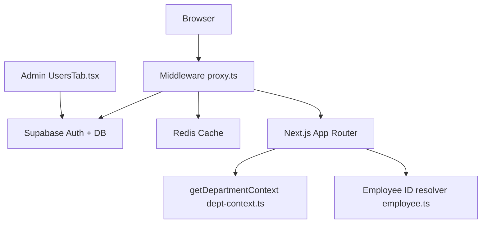
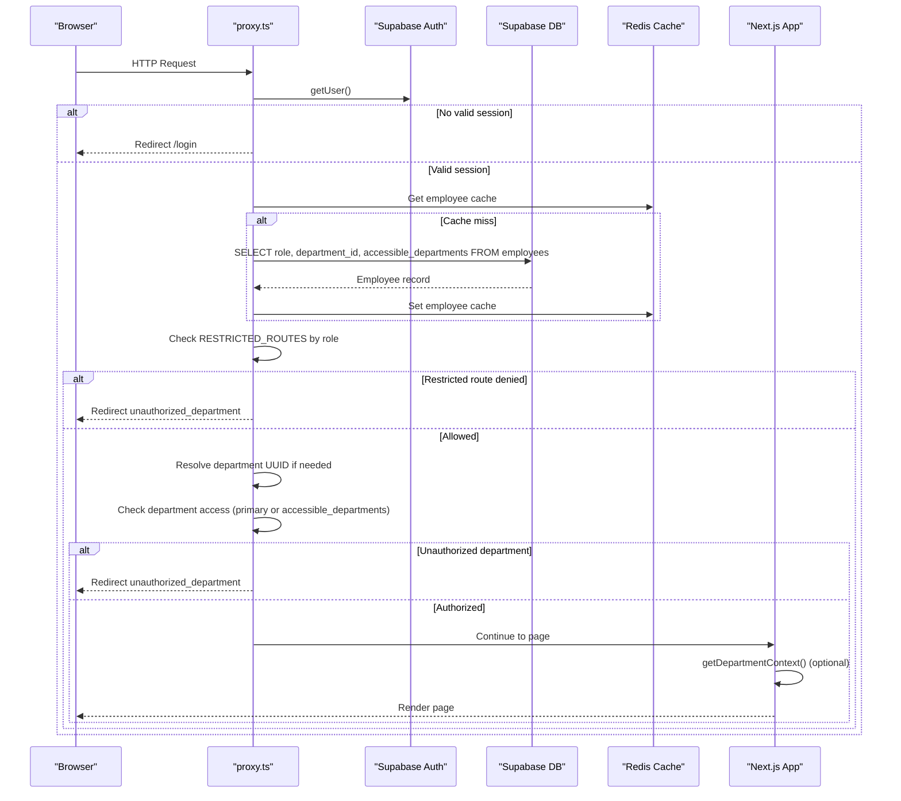
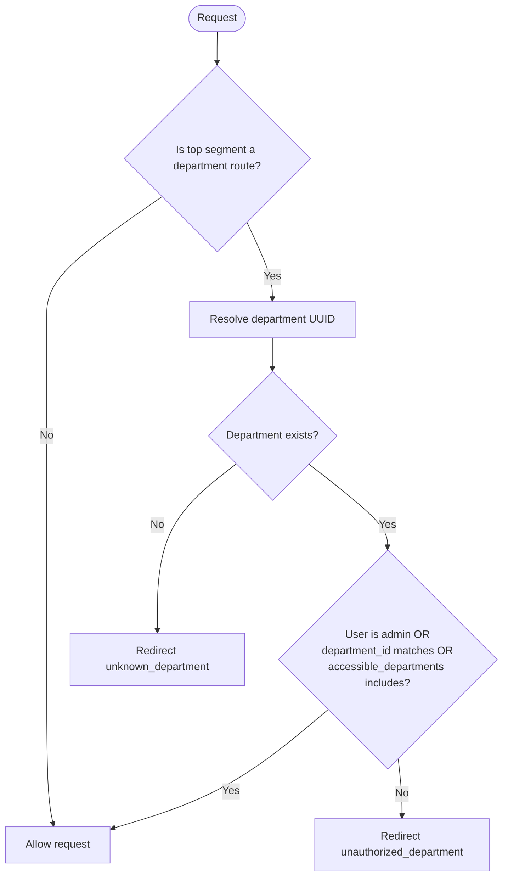
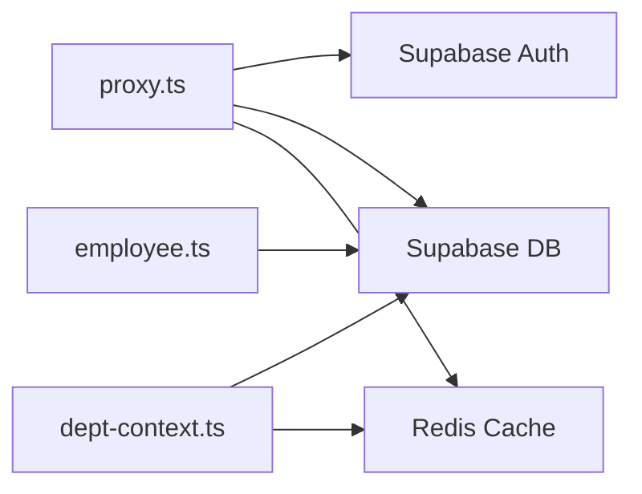

# Authorization & Role-Based Access Control

<cite>
**Referenced Files in This Document**
- [proxy.ts](file://apps/portal/proxy.ts)
- [employee.ts](file://apps/portal/lib/employee.ts)
- [dept-context.ts](file://apps/portal/lib/dept-context.ts)
- [departments.ts](file://apps/portal/lib/departments.ts)
- [UsersTab.tsx](file://apps/portal/features/admin/tabs/UsersTab.tsx)
- [001_initial.sql](file://packages/supabase/migrations/001_initial.sql)
- [how-does-auth-work.md](file://wiki/queries/how-does-auth-work.md)
- [proxy.test.ts](file://apps/portal/proxy.test.ts)
</cite>

## Table of Contents

1. [Introduction](#introduction)
2. [Project Structure](#project-structure)
3. [Core Components](#core-components)
4. [Architecture Overview](#architecture-overview)
5. [Detailed Component Analysis](#detailed-component-analysis)
6. [Dependency Analysis](#dependency-analysis)
7. [Performance Considerations](#performance-considerations)
8. [Troubleshooting Guide](#troubleshooting-guide)
9. [Conclusion](#conclusion)
10. [Appendices](#appendices)

## Introduction

This document explains the authorization system and role-based access control (RBAC) patterns used across the portal application. It covers:

- Employee roles and hierarchy: operator, supervisor, admin, and department-specific roles such as control_room_operator.
- Department access control that restricts users to their assigned department or explicitly granted departments via an array field.
- RESTRICTED_ROUTES configuration that gates sensitive sections like admin panels and tools by role.
- The employee context resolution mechanism that carries user permissions through the request lifecycle.
- Practical examples for adding new roles, implementing custom authorization checks, and extending department access patterns.

## Project Structure

The authorization logic spans middleware, server utilities, and UI administration components:

- Middleware enforces authentication, route restrictions, and department access at the edge of each request.
- Server-side helpers resolve employee identity and department context efficiently with caching.
- Admin UI allows administrators to manage roles, primary departments, and cross-department access.
- Database schema defines employees and departments tables and row-level security policies.



**Diagram sources**

- [proxy.ts:1-377](file://apps/portal/proxy.ts#L1-L377)
- [dept-context.ts:1-68](file://apps/portal/lib/dept-context.ts#L1-L68)
- [employee.ts:1-28](file://apps/portal/lib/employee.ts#L1-L28)
- [UsersTab.tsx:41-288](file://apps/portal/features/admin/tabs/UsersTab.tsx#L41-L288)

**Section sources**

- [proxy.ts:1-377](file://apps/portal/proxy.ts#L1-L377)
- [dept-context.ts:1-68](file://apps/portal/lib/dept-context.ts#L1-L68)
- [employee.ts:1-28](file://apps/portal/lib/employee.ts#L1-L28)
- [UsersTab.tsx:41-288](file://apps/portal/features/admin/tabs/UsersTab.tsx#L41-L288)

## Core Components

- Role definitions and restricted routes are centralized in middleware configuration.
- Employee profile data includes role, primary department, and a list of accessible departments.
- Department routing is validated against a known set of department slugs.
- Admin UI provides controls to update roles and department assignments.

Key responsibilities:

- Authentication and session handling in middleware.
- Role-based route gating using RESTRICTED_ROUTES.
- Department scoping based on primary assignment and explicit grants.
- Caching of employee profiles and department UUID lookups.

**Section sources**

- [proxy.ts:58-63](file://apps/portal/proxy.ts#L58-L63)
- [proxy.ts:198-261](file://apps/portal/proxy.ts#L198-L261)
- [proxy.ts:245-261](file://apps/portal/proxy.ts#L245-L261)
- [UsersTab.tsx:64-90](file://apps/portal/features/admin/tabs/UsersTab.tsx#L64-L90)

## Architecture Overview

The authorization flow integrates authentication, role checks, and department scoping before serving protected resources.



**Diagram sources**

- [proxy.ts:163-174](file://apps/portal/proxy.ts#L163-L174)
- [proxy.ts:204-221](file://apps/portal/proxy.ts#L204-L221)
- [proxy.ts:223-243](file://apps/portal/proxy.ts#L223-L243)
- [proxy.ts:245-261](file://apps/portal/proxy.ts#L245-L261)
- [dept-context.ts:16-52](file://apps/portal/lib/dept-context.ts#L16-L52)

## Detailed Component Analysis

### Roles and Hierarchy

- Roles include operator, supervisor, admin, and control_room_operator.
- The normalizeRole utility ensures a safe default when role data is missing.
- RESTRICTED_ROUTES maps route prefixes to allowed roles.

Examples:

- Adding a new role:
  - Update RESTRICTED_ROUTES to include the new role for specific routes.
  - Ensure the admin UI supports the new role value in the role selector.
- Extending role semantics:
  - Add additional checks in middleware if the new role requires special behavior beyond route gating.

**Section sources**

- [proxy.ts:65-67](file://apps/portal/proxy.ts#L65-L67)
- [proxy.ts:58-63](file://apps/portal/proxy.ts#L58-L63)
- [UsersTab.tsx:307-317](file://apps/portal/features/admin/tabs/UsersTab.tsx#L307-L317)
- [how-does-auth-work.md:184-204](file://wiki/queries/how-does-auth-work.md#L184-L204)

### Department Access Control

- DEPARTMENT_ROUTES enumerates top-level segments that require department scoping.
- isDepartmentAllowed checks:
  - If the route is not a department route, allow.
  - If the user is admin, allow.
  - Otherwise, allow only if the requested department matches the user’s primary department or is included in accessible_departments.
- Unknown department slugs result in a controlled redirect.



**Diagram sources**

- [proxy.ts:47-56](file://apps/portal/proxy.ts#L47-L56)
- [proxy.ts:245-261](file://apps/portal/proxy.ts#L245-L261)

**Section sources**

- [proxy.ts:47-56](file://apps/portal/proxy.ts#L47-L56)
- [proxy.ts:245-261](file://apps/portal/proxy.ts#L245-L261)

### RESTRICTED_ROUTES Configuration

- Centralized mapping of route prefixes to allowed roles.
- Special handling for nested paths such as tools under certain routes.
- Used by isRestrictedRouteAllowed to gate access early in the middleware.

Practical guidance:

- To add a new restricted section, add a key-value pair to RESTRICTED_ROUTES where the key is the route prefix and the value is an array of allowed roles.
- For nested tooling endpoints, ensure secondSegment checks cover your path structure.

**Section sources**

- [proxy.ts:58-63](file://apps/portal/proxy.ts#L58-L63)
- [proxy.ts:223-243](file://apps/portal/proxy.ts#L223-L243)

### Employee Context Provider and Resolution

- getEmployeeIdForAuthUser resolves the internal employee id from auth.users id, preferring a header provided by middleware when available.
- In middleware, resolveEmployee fetches role, department_id, and accessible_departments, caching results in Redis for performance.
- Server components can use getDepartmentContext to validate department slugs and retrieve department UUIDs with caching.

```mermaid
classDiagram
class EmployeeResolver {
+getEmployeeIdForAuthUser(supabase, authUserId) string|null
}
class MiddlewareEmployee {
+resolveEmployee(supabase, userId) EmployeeAuth|null
}
class DepartmentContext {
+getDepartmentContext(params) {dept, deptId, supabase, today}
+requireDepartment(departmentSlug, allowed) void
}
EmployeeResolver --> DepartmentContext : "used in pages"
MiddlewareEmployee --> EmployeeResolver : "header optimization"
```

**Diagram sources**

- [employee.ts:9-27](file://apps/portal/lib/employee.ts#L9-L27)
- [proxy.ts:204-221](file://apps/portal/proxy.ts#L204-L221)
- [dept-context.ts:16-52](file://apps/portal/lib/dept-context.ts#L16-L52)

**Section sources**

- [employee.ts:9-27](file://apps/portal/lib/employee.ts#L9-L27)
- [proxy.ts:204-221](file://apps/portal/proxy.ts#L204-L221)
- [dept-context.ts:16-52](file://apps/portal/lib/dept-context.ts#L16-L52)

### Admin Management of Roles and Departments

- The admin UsersTab component allows updating:
  - role
  - department_id (primary department)
  - accessible_departments (array of department IDs)
- These fields directly influence middleware authorization decisions.

Best practices:

- Always validate inputs before persisting updates.
- After changes, rely on cache TTL to refresh; optionally evict cache keys for immediate effect.

**Section sources**

- [UsersTab.tsx:64-90](file://apps/portal/features/admin/tabs/UsersTab.tsx#L64-L90)
- [UsersTab.tsx:273-288](file://apps/portal/features/admin/tabs/UsersTab.tsx#L273-L288)
- [UsersTab.tsx:342-377](file://apps/portal/features/admin/tabs/UsersTab.tsx#L342-L377)

### Data Model and Security Policies

- employees table stores role, department_id, and accessible_departments.
- Row-level security policies protect employee records and enforce admin privileges.
- departments table holds department metadata and is publicly selectable for authenticated users.

Operational notes:

- Use accessible_departments to grant cross-department access without changing primary department.
- RLS policies ensure users can only read their own employee record unless they are admin.

**Section sources**

- [001_initial.sql:27-48](file://packages/supabase/migrations/001_initial.sql#L27-L48)
- [001_initial.sql:7-22](file://packages/supabase/migrations/001_initial.sql#L7-L22)

## Dependency Analysis

Authorization depends on:

- Supabase Auth for session validation.
- Supabase DB for employee and department data.
- Redis for caching employee profiles and department UUIDs.
- Next.js App Router for rendering protected pages.



**Diagram sources**

- [proxy.ts:163-174](file://apps/portal/proxy.ts#L163-L174)
- [proxy.ts:204-221](file://apps/portal/proxy.ts#L204-L221)
- [dept-context.ts:16-52](file://apps/portal/lib/dept-context.ts#L16-L52)
- [employee.ts:9-27](file://apps/portal/lib/employee.ts#L9-L27)

**Section sources**

- [proxy.ts:163-174](file://apps/portal/proxy.ts#L163-L174)
- [proxy.ts:204-221](file://apps/portal/proxy.ts#L204-L221)
- [dept-context.ts:16-52](file://apps/portal/lib/dept-context.ts#L16-L52)
- [employee.ts:9-27](file://apps/portal/lib/employee.ts#L9-L27)

## Performance Considerations

- Employee profile caching reduces repeated DB queries per session.
- Department UUID caching avoids frequent lookups for route validation.
- Early route checks prevent unnecessary downstream processing.
- Best-effort metrics recording ensures observability without blocking auth flows.

Recommendations:

- Monitor cache hit rates for employee and department caches.
- Evict relevant cache entries after administrative updates to minimize stale state.

[No sources needed since this section provides general guidance]

## Troubleshooting Guide

Common issues and diagnostics:

- Unauthorized redirects:
  - Verify RESTRICTED_ROUTES includes the required role for the target route.
  - Confirm the user’s role and department assignments in the database.
- Unknown department errors:
  - Ensure the department slug exists in the departments table and DEPARTMENT_ROUTES.
- Cross-department access not working:
  - Check accessible_departments contains the correct department UUIDs.
- Session expiration:
  - Expired tokens trigger sign-out and cache eviction; re-login to refresh.

Useful references:

- Tests demonstrate expected behaviors for admin-only routes and control-room restrictions.
- Documentation outlines debugging steps for auth state and department access.

**Section sources**

- [proxy.test.ts:227-267](file://apps/portal/proxy.test.ts#L227-L267)
- [how-does-auth-work.md:226-252](file://wiki/queries/how-does-auth-work.md#L226-L252)

## Conclusion

The authorization system combines role-based route gating with department-scoped access control. Administrators can assign roles and manage both primary and cross-department access. Middleware enforces these policies consistently, while caching ensures efficient performance. Extensibility is straightforward: add new roles to RESTRICTED_ROUTES, update admin UI options, and leverage accessible_departments for fine-grained department access.

[No sources needed since this section summarizes without analyzing specific files]

## Appendices

### How to Add a New Role

- Update RESTRICTED_ROUTES to include the new role for relevant routes.
- Extend the admin UI role selector to include the new role option.
- If the role has unique behavior, add corresponding checks in middleware.

**Section sources**

- [proxy.ts:58-63](file://apps/portal/proxy.ts#L58-L63)
- [UsersTab.tsx:307-317](file://apps/portal/features/admin/tabs/UsersTab.tsx#L307-L317)

### Implementing Custom Authorization Checks

- Create a helper function similar to isRestrictedRouteAllowed for custom rules.
- Integrate the helper into the main proxy flow before allowing requests to proceed.
- Use consistent error redirects to maintain predictable UX.

**Section sources**

- [proxy.ts:223-243](file://apps/portal/proxy.ts#L223-L243)

### Extending Department Access Patterns

- Use accessible_departments to grant multi-department access without altering primary department.
- Validate department slugs using DEPARTMENT_ROUTES and resolve UUIDs via resolveDeptUuid.
- Leverage requireDepartment in server components to restrict tabs or features to specific departments.

**Section sources**

- [proxy.ts:245-261](file://apps/portal/proxy.ts#L245-L261)
- [dept-context.ts:59-67](file://apps/portal/lib/dept-context.ts#L59-L67)
