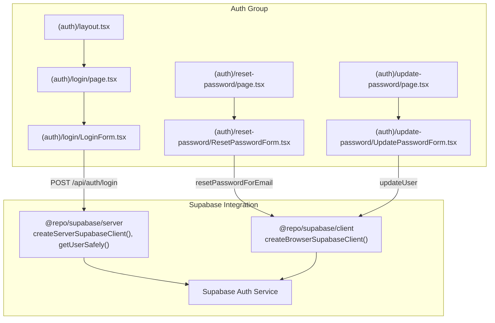
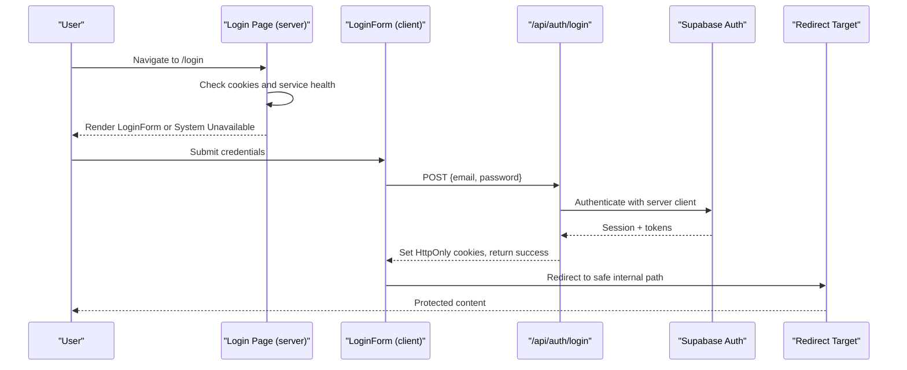
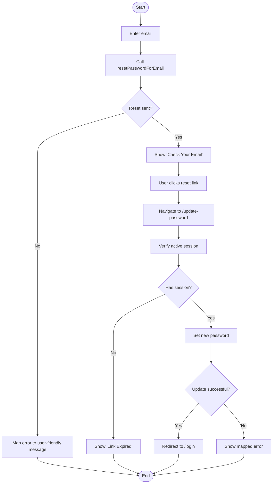
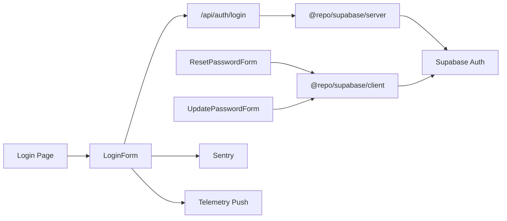

# Login Flow & Session Management

<cite>
**Referenced Files in This Document**
- [apps/portal/app/(auth)/layout.tsx](file://apps/portal/app/(auth)/layout.tsx)
- [apps/portal/app/(auth)/login/page.tsx](file://apps/portal/app/(auth)/login/page.tsx)
- [apps/portal/app/(auth)/login/LoginForm.tsx](file://apps/portal/app/(auth)/login/LoginForm.tsx)
- [apps/portal/app/(auth)/reset-password/page.tsx](file://apps/portal/app/(auth)/reset-password/page.tsx)
- [apps/portal/app/(auth)/reset-password/ResetPasswordForm.tsx](file://apps/portal/app/(auth)/reset-password/ResetPasswordForm.tsx)
- [apps/portal/app/(auth)/update-password/page.tsx](file://apps/portal/app/(auth)/update-password/page.tsx)
- [apps/portal/app/(auth)/update-password/UpdatePasswordForm.tsx](file://apps/portal/app/(auth)/update-password/UpdatePasswordForm.tsx)
- [packages/supabase/src/middleware.ts](file://packages/supabase/src/middleware.ts)
</cite>

## Table of Contents

1. [Introduction](#introduction)
2. [Project Structure](#project-structure)
3. [Core Components](#core-components)
4. [Architecture Overview](#architecture-overview)
5. [Detailed Component Analysis](#detailed-component-analysis)
6. [Dependency Analysis](#dependency-analysis)
7. [Performance Considerations](#performance-considerations)
8. [Troubleshooting Guide](#troubleshooting-guide)
9. [Conclusion](#conclusion)
10. [Appendices](#appendices)

## Introduction

This document explains the login flow and session management system for the portal application. It covers:

- The login page implementation, including form handling, validation, and error states
- The authentication API route that processes credential-based login requests to Supabase Auth and manages sessions via cookies
- The layout component that wraps authenticated routes and provides a consistent UI context
- Password reset flows (requesting a reset link and updating the password)
- Handling authentication callbacks and managing user session state across the application
- Security best practices for password handling, session storage, and logout procedures

## Project Structure

The authentication-related pages and components are organized under the Next.js App Router group (auth). The key files include:

- Layout wrapper for auth pages
- Login page and client-side login form
- Reset password request page and form
- Update password page and form (used after clicking the reset link)

**Diagram sources**

- [apps/portal/app/(auth)/layout.tsx](<file://apps/portal/app/(auth)/layout.tsx#L1-L12>)
- [apps/portal/app/(auth)/login/page.tsx](<file://apps/portal/app/(auth)/login/page.tsx#L1-L196>)
- [apps/portal/app/(auth)/login/LoginForm.tsx](<file://apps/portal/app/(auth)/login/LoginForm.tsx#L1-L383>)
- [apps/portal/app/(auth)/reset-password/page.tsx](<file://apps/portal/app/(auth)/reset-password/page.tsx#L1-L6>)
- [apps/portal/app/(auth)/reset-password/ResetPasswordForm.tsx](<file://apps/portal/app/(auth)/reset-password/ResetPasswordForm.tsx#L1-L185>)
- [apps/portal/app/(auth)/update-password/page.tsx](<file://apps/portal/app/(auth)/update-password/page.tsx#L1-L15>)
- [apps/portal/app/(auth)/update-password/UpdatePasswordForm.tsx](<file://apps/portal/app/(auth)/update-password/UpdatePasswordForm.tsx#L1-L252>)

**Section sources**

- [apps/portal/app/(auth)/layout.tsx](<file://apps/portal/app/(auth)/layout.tsx#L1-L12>)
- [apps/portal/app/(auth)/login/page.tsx](<file://apps/portal/app/(auth)/login/page.tsx#L1-L196>)
- [apps/portal/app/(auth)/login/LoginForm.tsx](<file://apps/portal/app/(auth)/login/LoginForm.tsx#L1-L383>)
- [apps/portal/app/(auth)/reset-password/page.tsx](<file://apps/portal/app/(auth)/reset-password/page.tsx#L1-L6>)
- [apps/portal/app/(auth)/reset-password/ResetPasswordForm.tsx](<file://apps/portal/app/(auth)/reset-password/ResetPasswordForm.tsx#L1-L185>)
- [apps/portal/app/(auth)/update-password/page.tsx](<file://apps/portal/app/(auth)/update-password/page.tsx#L1-L15>)
- [apps/portal/app/(auth)/update-password/UpdatePasswordForm.tsx](<file://apps/portal/app/(auth)/update-password/UpdatePasswordForm.tsx#L1-L252>)

## Core Components

- Auth layout: Provides a minimal container for all auth-grouped pages.
- Login page: Server-rendered entry point that detects existing auth cookies and checks service availability before rendering the login form.
- Login form: Client-side form with validation, error handling, telemetry, and SSO option. Submits credentials to the server-side login API.
- Reset password flow: Request a reset email and update password after following the link.
- Update password page: Guards access by verifying an active session before allowing updates.

Key responsibilities:

- Form validation and accessible error presentation
- Safe redirect handling to prevent open redirects
- Error mapping for user-friendly messages
- Session verification on the server side where applicable
- Telemetry and observability integration

**Section sources**

- [apps/portal/app/(auth)/layout.tsx](<file://apps/portal/app/(auth)/layout.tsx#L1-L12>)
- [apps/portal/app/(auth)/login/page.tsx](<file://apps/portal/app/(auth)/login/page.tsx#L1-L196>)
- [apps/portal/app/(auth)/login/LoginForm.tsx](<file://apps/portal/app/(auth)/login/LoginForm.tsx#L1-L383>)
- [apps/portal/app/(auth)/reset-password/ResetPasswordForm.tsx](<file://apps/portal/app/(auth)/reset-password/ResetPasswordForm.tsx#L1-L185>)
- [apps/portal/app/(auth)/update-password/page.tsx](<file://apps/portal/app/(auth)/update-password/page.tsx#L1-L15>)
- [apps/portal/app/(auth)/update-password/UpdatePasswordForm.tsx](<file://apps/portal/app/(auth)/update-password/UpdatePasswordForm.tsx#L1-L252>)

## Architecture Overview

The login flow integrates Next.js App Router pages, client-side forms, and Supabase Auth. Authentication is performed via a server-side API endpoint that uses Supabase’s server client to validate credentials and set HttpOnly cookies. Password reset flows use the browser client to call Supabase Auth endpoints directly.

**Diagram sources**

- [apps/portal/app/(auth)/login/page.tsx](<file://apps/portal/app/(auth)/login/page.tsx#L1-L196>)
- [apps/portal/app/(auth)/login/LoginForm.tsx](<file://apps/portal/app/(auth)/login/LoginForm.tsx#L1-L383>)
- [packages/supabase/src/middleware.ts](file://packages/supabase/src/middleware.ts)

## Detailed Component Analysis

### Login Page

Responsibilities:

- Detects existing Supabase auth cookies and attempts to fetch the current user to determine if the auth service is reachable
- Renders either a “System Unavailable” message or the login card with the client-side form
- Uses Suspense around the client-side form to provide loading skeletons

Security considerations:

- Avoids exposing sensitive data during service unavailability checks
- Forces dynamic rendering to ensure up-to-date behavior

**Section sources**

- [apps/portal/app/(auth)/login/page.tsx](<file://apps/portal/app/(auth)/login/page.tsx#L1-L196>)

### Login Form

Responsibilities:

- Validates inputs using HTML attributes and controlled state
- Prevents open redirects by validating the redirect parameter
- Submits credentials to the server-side login API
- Handles errors, shows user-friendly messages, and records telemetry/Sentry breadcrumbs
- Supports SSO via environment variable and fallback messaging
- Provides accessibility features (ARIA labels, live regions, focus rings)

Validation and UX:

- Employee ID/email field constraints and hints
- Password visibility toggle and Caps Lock warning
- Remember me checkbox (UI only; actual persistence handled by HttpOnly cookies)

Error handling:

- Maps API errors to user-facing messages
- Captures non-PII Sentry breadcrumbs for failed logins
- Fire-and-forget telemetry push for success/failure events

Redirect safety:

- Ensures redirect targets are internal and not static assets

**Section sources**

- [apps/portal/app/(auth)/login/LoginForm.tsx](<file://apps/portal/app/(auth)/login/LoginForm.tsx#L1-L383>)

### Auth Layout

Responsibilities:

- Wraps all pages under the (auth) group with a consistent container
- Provides a full-height layout suitable for centered login cards

**Section sources**

- [apps/portal/app/(auth)/layout.tsx](<file://apps/portal/app/(auth)/layout.tsx#L1-L12>)

### Reset Password Flow

Request reset:

- Client calls Supabase Auth to send a reset email with a configured redirect URL pointing to the update-password page
- Displays success confirmation or maps raw errors to friendly messages

Update password:

- Server page verifies an active session before rendering the form
- Client validates password match and minimum length, then updates the password via Supabase Auth
- On success, redirects back to login after a brief delay

**Diagram sources**

- [apps/portal/app/(auth)/reset-password/ResetPasswordForm.tsx](<file://apps/portal/app/(auth)/reset-password/ResetPasswordForm.tsx#L1-L185>)
- [apps/portal/app/(auth)/update-password/page.tsx](<file://apps/portal/app/(auth)/update-password/page.tsx#L1-L15>)
- [apps/portal/app/(auth)/update-password/UpdatePasswordForm.tsx](<file://apps/portal/app/(auth)/update-password/UpdatePasswordForm.tsx#L1-L252>)

**Section sources**

- [apps/portal/app/(auth)/reset-password/page.tsx](<file://apps/portal/app/(auth)/reset-password/page.tsx#L1-L6>)
- [apps/portal/app/(auth)/reset-password/ResetPasswordForm.tsx](<file://apps/portal/app/(auth)/reset-password/ResetPasswordForm.tsx#L1-L185>)
- [apps/portal/app/(auth)/update-password/page.tsx](<file://apps/portal/app/(auth)/update-password/page.tsx#L1-L15>)
- [apps/portal/app/(auth)/update-password/UpdatePasswordForm.tsx](<file://apps/portal/app/(auth)/update-password/UpdatePasswordForm.tsx#L1-L252>)

### Authentication API Route (/api/auth/login)

Responsibilities:

- Receives JSON payload with email and password
- Authenticates against Supabase Auth using the server client
- Sets HttpOnly cookies for the session
- Returns success or structured error response

Integration points:

- Uses createServerSupabaseClient from @repo/supabase/server
- Relies on Supabase middleware configuration for cookie handling and security headers

Note: The specific route file is not included in the referenced sections, but its behavior is inferred from the client submission and documented patterns.

**Section sources**

- [apps/portal/app/(auth)/login/LoginForm.tsx](<file://apps/portal/app/(auth)/login/LoginForm.tsx#L1-L383>)
- [packages/supabase/src/middleware.ts](file://packages/supabase/src/middleware.ts)

## Dependency Analysis

The authentication subsystem depends on:

- Next.js App Router for routing and server/client boundaries
- Supabase server client for secure server-side operations
- Supabase browser client for password reset and update flows
- Sentry for error tracking and telemetry for lightweight metrics

**Diagram sources**

- [apps/portal/app/(auth)/login/page.tsx](<file://apps/portal/app/(auth)/login/page.tsx#L1-L196>)
- [apps/portal/app/(auth)/login/LoginForm.tsx](<file://apps/portal/app/(auth)/login/LoginForm.tsx#L1-L383>)
- [apps/portal/app/(auth)/reset-password/ResetPasswordForm.tsx](<file://apps/portal/app/(auth)/reset-password/ResetPasswordForm.tsx#L1-L185>)
- [apps/portal/app/(auth)/update-password/UpdatePasswordForm.tsx](<file://apps/portal/app/(auth)/update-password/UpdatePasswordForm.tsx#L1-L252>)
- [packages/supabase/src/middleware.ts](file://packages/supabase/src/middleware.ts)

**Section sources**

- [apps/portal/app/(auth)/login/LoginForm.tsx](<file://apps/portal/app/(auth)/login/LoginForm.tsx#L1-L383>)
- [apps/portal/app/(auth)/reset-password/ResetPasswordForm.tsx](<file://apps/portal/app/(auth)/reset-password/ResetPasswordForm.tsx#L1-L185>)
- [apps/portal/app/(auth)/update-password/UpdatePasswordForm.tsx](<file://apps/portal/app/(auth)/update-password/UpdatePasswordForm.tsx#L1-L252>)
- [packages/supabase/src/middleware.ts](file://packages/supabase/src/middleware.ts)

## Performance Considerations

- Prefer server actions for login to reduce client-server round trips and improve security posture
- Keep telemetry pushes fire-and-forget to avoid blocking critical paths
- Use Suspense for graceful loading states around client components
- Ensure Supabase client initialization is efficient and reused where appropriate

[No sources needed since this section provides general guidance]

## Troubleshooting Guide

Common issues and resolutions:

- System unavailable on login: Indicates Supabase service reachability problems; verify network connectivity and environment configuration
- Open redirect prevention: Ensure redirect parameters pass validation rules
- Rate limiting on password reset: Inform users to wait and retry
- Weak password or same password errors: Provide clear instructions to meet complexity requirements and choose a different password
- Expired reset link: Prompt users to request a new reset link

Operational tips:

- Review Sentry breadcrumbs for auth failures without exposing PII
- Monitor telemetry tags for success/failure rates
- Validate environment variables for SSO URLs and Supabase configuration

**Section sources**

- [apps/portal/app/(auth)/login/page.tsx](<file://apps/portal/app/(auth)/login/page.tsx#L1-L196>)
- [apps/portal/app/(auth)/login/LoginForm.tsx](<file://apps/portal/app/(auth)/login/LoginForm.tsx#L1-L383>)
- [apps/portal/app/(auth)/reset-password/ResetPasswordForm.tsx](<file://apps/portal/app/(auth)/reset-password/ResetPasswordForm.tsx#L1-L185>)
- [apps/portal/app/(auth)/update-password/UpdatePasswordForm.tsx](<file://apps/portal/app/(auth)/update-password/UpdatePasswordForm.tsx#L1-L252>)

## Conclusion

The login flow and session management system leverages Next.js App Router and Supabase Auth to provide a secure, accessible, and user-friendly experience. The design separates concerns between server and client, enforces safe redirects, and includes robust error handling and telemetry. Following the recommended security practices ensures strong protection for passwords and sessions while maintaining a smooth user journey.

[No sources needed since this section summarizes without analyzing specific files]

## Appendices

### Security Best Practices

- Password handling:
  - Never log or expose passwords in telemetry or error messages
  - Enforce minimum length and complexity on both client and server
- Session storage:
  - Use HttpOnly cookies managed by Supabase to prevent XSS exposure
  - Ensure proper CORS and CSRF protections via Supabase middleware
- Logout procedures:
  - Clear local state and navigate to a safe landing page
  - Invalidate server-side sessions through Supabase logout APIs
- Redirect safety:
  - Validate redirect targets to prevent open redirects
  - Block asset paths and disallow protocol-relative URLs

[No sources needed since this section provides general guidance]
