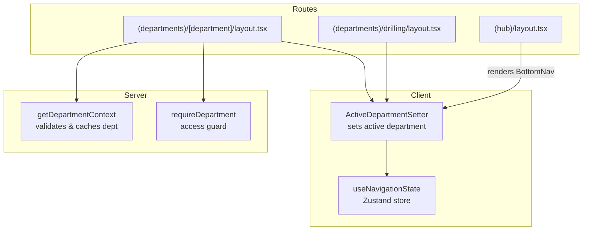
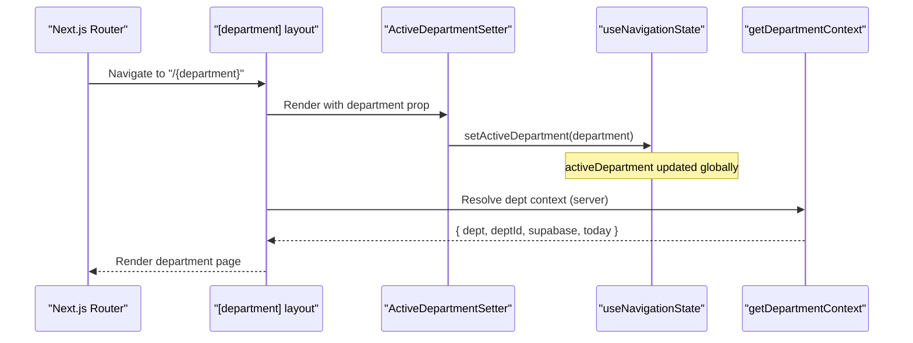
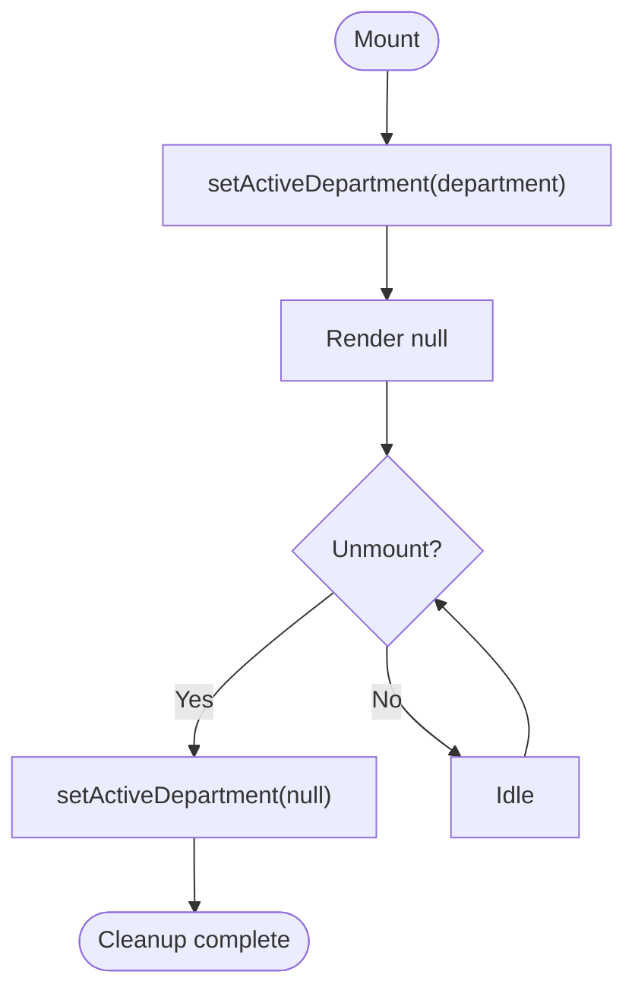
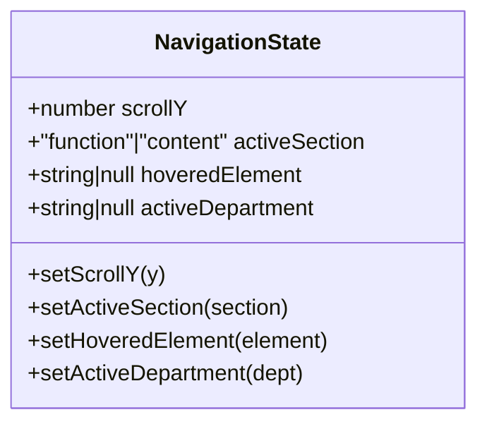
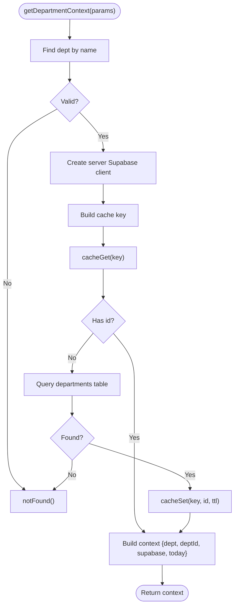
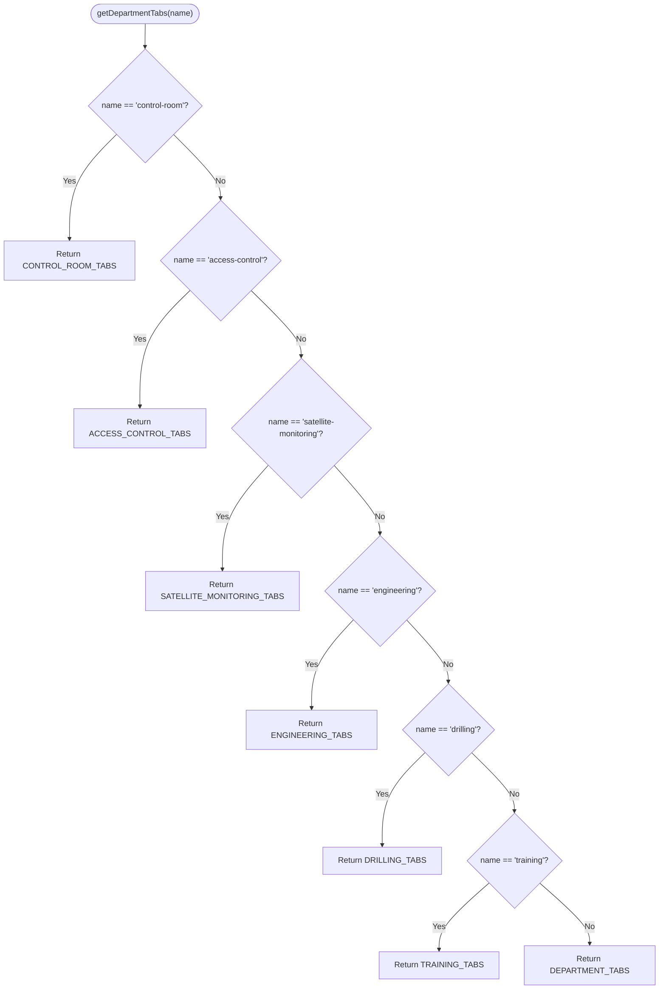
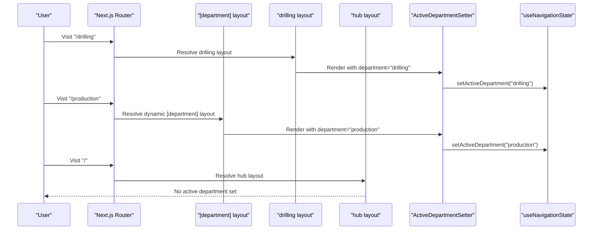
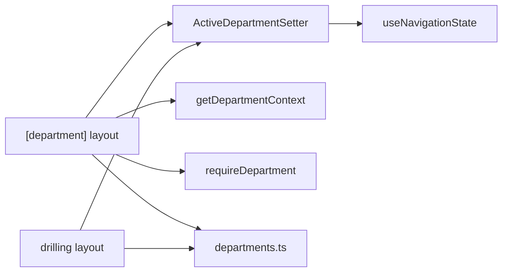

# Active Department State Management

<cite>
**Referenced Files in This Document**
- [ActiveDepartmentSetter.tsx](file://apps/portal/components/nav/ActiveDepartmentSetter.tsx)
- [useNavigationState.ts](file://apps/portal/hooks/useNavigationState.ts)
- [dept-context.ts](file://apps/portal/lib/dept-context.ts)
- [departments.ts](file://apps/portal/lib/departments.ts)
- [layout.tsx](file://apps/portal/app/(departments)/[department]/layout.tsx)
- [drilling-layout.tsx](file://apps/portal/app/(departments)/drilling/layout.tsx)
- [hub-layout.tsx](file://apps/portal/app/(hub)/layout.tsx)
</cite>

## Table of Contents

1. [Introduction](#introduction)
2. [Project Structure](#project-structure)
3. [Core Components](#core-components)
4. [Architecture Overview](#architecture-overview)
5. [Detailed Component Analysis](#detailed-component-analysis)
6. [Dependency Analysis](#dependency-analysis)
7. [Performance Considerations](#performance-considerations)
8. [Troubleshooting Guide](#troubleshooting-guide)
9. [Conclusion](#conclusion)

## Introduction

This document explains the active department state management system used across the portal application. It focuses on how the current department is tracked and propagated to components, how server-side department context is resolved, and how navigation integrates with department transitions. The goal is to help developers understand:

- How the ActiveDepartmentSetter component updates the active department in global client state
- How the useNavigationState hook provides a lightweight store for navigation-related state
- How server-side department context is validated and cached
- How to access the current department in components and implement department-aware navigation
- How state persistence and URL synchronization are handled (and what is missing)
- Performance considerations when managing department state

## Project Structure

The active department feature spans client components, hooks, and server utilities:

- Client component that sets the active department based on route parameters
- A Zustand-based navigation state hook for cross-component state sharing
- Server utilities for resolving and validating department context
- Layouts that wire routing segments to the active department setter

**Diagram sources**

- [ActiveDepartmentSetter.tsx:1-23](file://apps/portal/components/nav/ActiveDepartmentSetter.tsx#L1-L23)
- [useNavigationState.ts:1-24](file://apps/portal/hooks/useNavigationState.ts#L1-L24)
- [dept-context.ts:1-68](file://apps/portal/lib/dept-context.ts#L1-L68)
- [layout.tsx:1-30](<file://apps/portal/app/(departments)/[department]/layout.tsx#L1-L30>)
- [drilling-layout.tsx:1-27](<file://apps/portal/app/(departments)/drilling/layout.tsx#L1-L27>)
- [hub-layout.tsx:1-64](<file://apps/portal/app/(hub)/layout.tsx#L1-L64>)

**Section sources**

- [ActiveDepartmentSetter.tsx:1-23](file://apps/portal/components/nav/ActiveDepartmentSetter.tsx#L1-L23)
- [useNavigationState.ts:1-24](file://apps/portal/hooks/useNavigationState.ts#L1-L24)
- [dept-context.ts:1-68](file://apps/portal/lib/dept-context.ts#L1-L68)
- [layout.tsx:1-30](<file://apps/portal/app/(departments)/[department]/layout.tsx#L1-L30>)
- [drilling-layout.tsx:1-27](<file://apps/portal/app/(departments)/drilling/layout.tsx#L1-L27>)
- [hub-layout.tsx:1-64](<file://apps/portal/app/(hub)/layout.tsx#L1-L64>)

## Core Components

- ActiveDepartmentSetter: A minimal client component that subscribes to route-provided department slugs and updates the global navigation store’s active department. It also clears the active department on unmount to avoid stale state when leaving department routes.
- useNavigationState: A Zustand store exposing navigation-related state including activeDepartment and setters. It is consumed by components to read or update the active department.
- getDepartmentContext: A server utility that validates a department slug against known departments, resolves its UUID from the database, and caches the result. It returns department metadata, ID, Supabase client, and operational date.
- requireDepartment: A server-side guard to restrict access to specific tabs or pages to certain departments.
- Departments configuration: Centralized definitions of departments, tab configurations per department, and helpers to resolve tabs.

Key responsibilities:

- Route-driven activation of a department via ActiveDepartmentSetter
- Global availability of active department through useNavigationState
- Server-side validation and caching of department context
- Access control and tab resolution per department

**Section sources**

- [ActiveDepartmentSetter.tsx:1-23](file://apps/portal/components/nav/ActiveDepartmentSetter.tsx#L1-L23)
- [useNavigationState.ts:1-24](file://apps/portal/hooks/useNavigationState.ts#L1-L24)
- [dept-context.ts:1-68](file://apps/portal/lib/dept-context.ts#L1-L68)
- [departments.ts:1-310](file://apps/portal/lib/departments.ts#L1-L310)

## Architecture Overview

The active department flow combines Next.js App Router layouts with a client-side store:

- Layouts under (departments) render ActiveDepartmentSetter with the current department slug
- ActiveDepartmentSetter updates the active department in the Zustand store
- Components can subscribe to the active department via useNavigationState
- Server-side utilities validate and cache department data for server components

**Diagram sources**

- [layout.tsx:1-30](<file://apps/portal/app/(departments)/[department]/layout.tsx#L1-L30>)
- [ActiveDepartmentSetter.tsx:1-23](file://apps/portal/components/nav/ActiveDepartmentSetter.tsx#L1-L23)
- [useNavigationState.ts:1-24](file://apps/portal/hooks/useNavigationState.ts#L1-L24)
- [dept-context.ts:1-68](file://apps/portal/lib/dept-context.ts#L1-L68)

## Detailed Component Analysis

### ActiveDepartmentSetter

Purpose:

- Bridges route parameters to the global navigation store
- Ensures the active department is cleared when leaving department routes

Behavior:

- On mount, calls setActiveDepartment with the provided department slug
- On unmount, resets active department to null to prevent leakage into hub or other routes

Integration points:

- Consumed by department layouts to set the active department automatically
- Uses useNavigationState to mutate the store

**Diagram sources**

- [ActiveDepartmentSetter.tsx:1-23](file://apps/portal/components/nav/ActiveDepartmentSetter.tsx#L1-L23)

**Section sources**

- [ActiveDepartmentSetter.tsx:1-23](file://apps/portal/components/nav/ActiveDepartmentSetter.tsx#L1-L23)

### useNavigationState Hook

Purpose:

- Provides a small, centralized store for navigation-related state including activeDepartment

Data model:

- activeDepartment: string | null
- setActiveDepartment: (dept: string | null) => void
- Additional fields for scroll position, active section, hovered element

Usage patterns:

- Read activeDepartment in components to tailor UI or behavior
- Update via setActiveDepartment when programmatically switching departments

**Diagram sources**

- [useNavigationState.ts:1-24](file://apps/portal/hooks/useNavigationState.ts#L1-L24)

**Section sources**

- [useNavigationState.ts:1-24](file://apps/portal/hooks/useNavigationState.ts#L1-L24)

### Server-Side Department Context

Purpose:

- Validate department slugs and fetch associated metadata safely on the server
- Cache expensive lookups to reduce database load

Key functions:

- getDepartmentContext: Validates slug, resolves UUID from database, caches result, returns context object
- requireDepartment: Guards access to specific departments

Caching strategy:

- Redis-backed cache for department UUID lookup with TTL
- React cache wrapper around getDepartmentContext to deduplicate within request boundaries

**Diagram sources**

- [dept-context.ts:1-68](file://apps/portal/lib/dept-context.ts#L1-L68)

**Section sources**

- [dept-context.ts:1-68](file://apps/portal/lib/dept-context.ts#L1-L68)

### Department Configuration and Tabs

Purpose:

- Centralize department metadata and tab definitions
- Provide helpers to select appropriate tabs per department

Highlights:

- DEPARTMENTS array defines available departments and quick actions
- getDepartmentTabs selects specialized tabs for control-room, engineering, drilling, training, satellite-monitoring, and access-control
- Other departments fall back to default DEPARTMENT_TABS

**Diagram sources**

- [departments.ts:289-309](file://apps/portal/lib/departments.ts#L289-L309)

**Section sources**

- [departments.ts:1-310](file://apps/portal/lib/departments.ts#L1-L310)

### Layout Integration

Department layouts integrate ActiveDepartmentSetter and server-side context:

- Dynamic department layout reads params.department and renders ActiveDepartmentSetter
- Static department layouts (e.g., drilling) hardcode the department and still render ActiveDepartmentSetter
- Hub layout does not set an active department; it renders BottomNav which filters items based on user permissions

**Diagram sources**

- [layout.tsx:1-30](<file://apps/portal/app/(departments)/[department]/layout.tsx#L1-L30>)
- [drilling-layout.tsx:1-27](<file://apps/portal/app/(departments)/drilling/layout.tsx#L1-L27>)
- [hub-layout.tsx:1-64](<file://apps/portal/app/(hub)/layout.tsx#L1-L64>)
- [ActiveDepartmentSetter.tsx:1-23](file://apps/portal/components/nav/ActiveDepartmentSetter.tsx#L1-L23)
- [useNavigationState.ts:1-24](file://apps/portal/hooks/useNavigationState.ts#L1-L24)

**Section sources**

- [layout.tsx:1-30](<file://apps/portal/app/(departments)/[department]/layout.tsx#L1-L30>)
- [drilling-layout.tsx:1-27](<file://apps/portal/app/(departments)/drilling/layout.tsx#L1-L27>)
- [hub-layout.tsx:1-64](<file://apps/portal/app/(hub)/layout.tsx#L1-L64>)

## Dependency Analysis

- ActiveDepartmentSetter depends on useNavigationState to update the active department
- Department layouts depend on ActiveDepartmentSetter and server-side utilities for validation and context
- Server utilities depend on Supabase clients and Redis cache for performance
- Departments configuration is consumed by layouts and UI components to render correct tabs and metadata

**Diagram sources**

- [ActiveDepartmentSetter.tsx:1-23](file://apps/portal/components/nav/ActiveDepartmentSetter.tsx#L1-L23)
- [useNavigationState.ts:1-24](file://apps/portal/hooks/useNavigationState.ts#L1-L24)
- [dept-context.ts:1-68](file://apps/portal/lib/dept-context.ts#L1-L68)
- [departments.ts:1-310](file://apps/portal/lib/departments.ts#L1-L310)
- [layout.tsx:1-30](<file://apps/portal/app/(departments)/[department]/layout.tsx#L1-L30>)
- [drilling-layout.tsx:1-27](<file://apps/portal/app/(departments)/drilling/layout.tsx#L1-L27>)

**Section sources**

- [ActiveDepartmentSetter.tsx:1-23](file://apps/portal/components/nav/ActiveDepartmentSetter.tsx#L1-L23)
- [useNavigationState.ts:1-24](file://apps/portal/hooks/useNavigationState.ts#L1-L24)
- [dept-context.ts:1-68](file://apps/portal/lib/dept-context.ts#L1-L68)
- [departments.ts:1-310](file://apps/portal/lib/departments.ts#L1-L310)
- [layout.tsx:1-30](<file://apps/portal/app/(departments)/[department]/layout.tsx#L1-L30>)
- [drilling-layout.tsx:1-27](<file://apps/portal/app/(departments)/drilling/layout.tsx#L1-L27>)

## Performance Considerations

- Server-side caching: Department UUID lookups are cached in Redis with a one-hour TTL to reduce database pressure
- Request-level caching: getDepartmentContext is wrapped with React cache to deduplicate within a single request
- Minimal client state: useNavigationState keeps only necessary fields, avoiding heavy re-renders
- Cleanup on unmount: ActiveDepartmentSetter resets active department to null to prevent stale state leaks
- Tab selection optimization: getDepartmentTabs uses simple branching to return pre-defined arrays without runtime computation overhead

Recommendations:

- Avoid frequent programmatic updates to activeDepartment unless necessary
- Prefer reading activeDepartment in components rather than triggering unnecessary writes
- Ensure department layouts consistently render ActiveDepartmentSetter to maintain correctness

[No sources needed since this section provides general guidance]

## Troubleshooting Guide

Common issues and resolutions:

- Active department persists after leaving a department route: Verify that ActiveDepartmentSetter is rendered in all department layouts and that cleanup runs on unmount
- Incorrect department context on server: Ensure getDepartmentContext is called with valid slugs and that Redis cache is accessible
- Missing tabs for a department: Confirm getDepartmentTabs includes the department and returns the expected tab list
- Access denied to department-specific tabs: Use requireDepartment to enforce allowed lists and ensure notFound is triggered appropriately

Checklist:

- All department layouts render ActiveDepartmentSetter with the correct department slug
- Components reading activeDepartment subscribe via useNavigationState correctly
- Server components call getDepartmentContext before rendering sensitive content
- Redis cache keys follow the expected pattern and TTL is configured

**Section sources**

- [ActiveDepartmentSetter.tsx:1-23](file://apps/portal/components/nav/ActiveDepartmentSetter.tsx#L1-L23)
- [dept-context.ts:1-68](file://apps/portal/lib/dept-context.ts#L1-L68)
- [departments.ts:289-309](file://apps/portal/lib/departments.ts#L289-L309)

## Conclusion

The active department state management system leverages a clear separation between client-side state and server-side validation:

- ActiveDepartmentSetter ensures the active department is synchronized with the current route
- useNavigationState provides a lightweight, global store for navigation state
- Server utilities validate and cache department context efficiently
- Layouts orchestrate these pieces to deliver consistent department-aware experiences

For robustness, consider adding explicit URL synchronization and persistence if deep-linking or session restoration is required. Until then, the current design offers a performant and maintainable foundation for department state management.

[No sources needed since this section summarizes without analyzing specific files]
