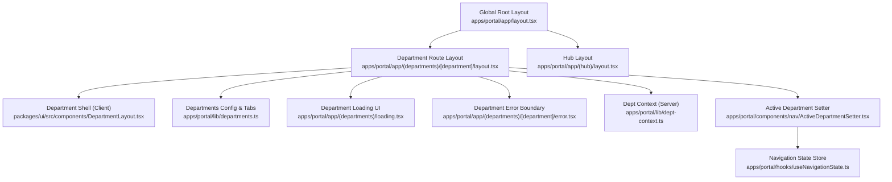
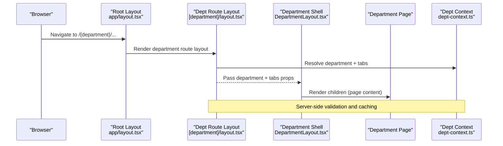
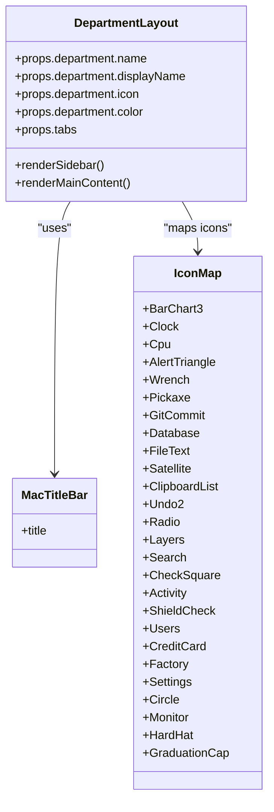
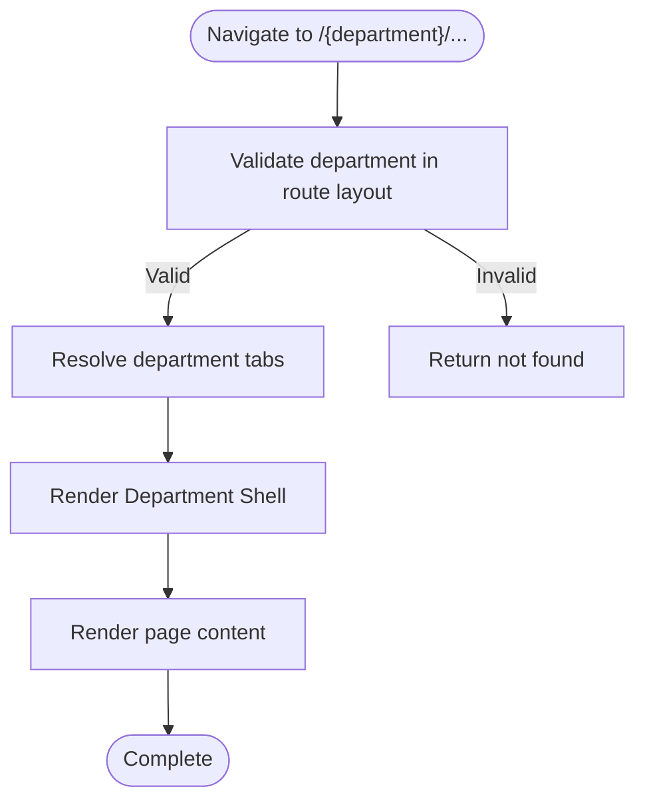
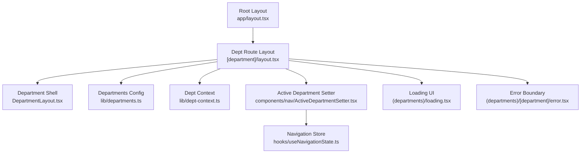

# Department Layout System

<cite>
**Referenced Files in This Document**
- [apps/portal/app/(departments)/[department]/layout.tsx](file://apps/portal/app/(departments)/[department]/layout.tsx)
- [packages/ui/src/components/DepartmentLayout.tsx](file://packages/ui/src/components/DepartmentLayout.tsx)
- [apps/portal/lib/departments.ts](file://apps/portal/lib/departments.ts)
- [apps/portal/app/layout.tsx](file://apps/portal/app/layout.tsx)
- [apps/portal/app/(departments)/loading.tsx](file://apps/portal/app/(departments)/loading.tsx)
- [apps/portal/app/(departments)/[department]/error.tsx](file://apps/portal/app/(departments)/[department]/error.tsx)
- [apps/portal/lib/dept-context.ts](file://apps/portal/lib/dept-context.ts)
- [apps/portal/components/nav/ActiveDepartmentSetter.tsx](file://apps/portal/components/nav/ActiveDepartmentSetter.tsx)
- [apps/portal/hooks/useNavigationState.ts](file://apps/portal/hooks/useNavigationState.ts)
- [apps/portal/app/(hub)/layout.tsx](file://apps/portal/app/(hub)/layout.tsx)
</cite>

## Table of Contents

1. Introduction
2. Project Structure
3. Core Components
4. Architecture Overview
5. Detailed Component Analysis
6. Dependency Analysis
7. Performance Considerations
8. Troubleshooting Guide
9. Conclusion

## Introduction

This document explains the department-specific layout system used across the portal application. It focuses on how each department route group provides shared UI components, navigation menus, data fetching, and state management through a consistent layout pattern. The documentation covers loading states, error boundaries, metadata handling, integration with the global portal layout, inheritance of common functionality, isolation of department-specific concerns, and best practices for composing layouts.

## Project Structure

The department layout system is centered around:

- A dynamic route layout that validates the department and renders a shared department shell.
- A reusable client-side department layout component that provides sidebar navigation and content area.
- Centralized department metadata and tab configuration.
- Global portal layout providing top-level providers, header, and main content wrapper.
- Loading and error boundary files at the department route level.
- Server-side context utilities for resolving department IDs and enforcing access.

**Diagram sources**

- [apps/portal/app/layout.tsx:1-189](file://apps/portal/app/layout.tsx#L1-L189)
- [apps/portal/app/(departments)/[department]/layout.tsx](<file://apps/portal/app/(departments)/[department]/layout.tsx#L1-L30>)
- [packages/ui/src/components/DepartmentLayout.tsx:1-217](file://packages/ui/src/components/DepartmentLayout.tsx#L1-L217)
- [apps/portal/lib/departments.ts:1-310](file://apps/portal/lib/departments.ts#L1-L310)
- [apps/portal/app/(departments)/loading.tsx](<file://apps/portal/app/(departments)/loading.tsx#L1-L16>)
- [apps/portal/app/(departments)/[department]/error.tsx](<file://apps/portal/app/(departments)/[department]/error.tsx#L1-L82>)
- [apps/portal/lib/dept-context.ts:1-68](file://apps/portal/lib/dept-context.ts#L1-L68)
- [apps/portal/components/nav/ActiveDepartmentSetter.tsx:1-22](file://apps/portal/components/nav/ActiveDepartmentSetter.tsx#L1-L22)
- [apps/portal/hooks/useNavigationState.ts:1-24](file://apps/portal/hooks/useNavigationState.ts#L1-L24)
- [apps/portal/app/(hub)/layout.tsx](<file://apps/portal/app/(hub)/layout.tsx#L1-L64>)

**Section sources**

- [apps/portal/app/layout.tsx:1-189](file://apps/portal/app/layout.tsx#L1-L189)
- [apps/portal/app/(departments)/[department]/layout.tsx](<file://apps/portal/app/(departments)/[department]/layout.tsx#L1-L30>)
- [packages/ui/src/components/DepartmentLayout.tsx:1-217](file://packages/ui/src/components/DepartmentLayout.tsx#L1-L217)
- [apps/portal/lib/departments.ts:1-310](file://apps/portal/lib/departments.ts#L1-L310)
- [apps/portal/app/(departments)/loading.tsx](<file://apps/portal/app/(departments)/loading.tsx#L1-L16>)
- [apps/portal/app/(departments)/[department]/error.tsx](<file://apps/portal/app/(departments)/[department]/error.tsx#L1-L82>)
- [apps/portal/lib/dept-context.ts:1-68](file://apps/portal/lib/dept-context.ts#L1-L68)
- [apps/portal/components/nav/ActiveDepartmentSetter.tsx:1-22](file://apps/portal/components/nav/ActiveDepartmentSetter.tsx#L1-L22)
- [apps/portal/hooks/useNavigationState.ts:1-24](file://apps/portal/hooks/useNavigationState.ts#L1-L24)
- [apps/portal/app/(hub)/layout.tsx](<file://apps/portal/app/(hub)/layout.tsx#L1-L64>)

## Core Components

- Dynamic department route layout: Validates the department slug, resolves tabs, sets active department state, and renders the department shell with an AI assistant context.
- Department shell (client): Provides macOS-style sidebar navigation, active tab highlighting, back-to-hub link, and a smooth content area.
- Departments config and tabs: Centralizes department metadata and per-department tab definitions, including specialized tab sets for control room, engineering, satellite monitoring, drilling, access control, and training.
- Global root layout: Supplies theme provider, global header, performance listeners, command bar, viewport boundaries, and wraps all routes in SplitWindowLayout.
- Department loading UI: Skeleton-based placeholders for department pages during load.
- Department error boundary: Client-side error display with logging, contextual actions, and reset capability.
- Server-side department context: Resolves department UUID from database with Redis caching and enforces not-found behavior for invalid departments.
- Active department setter: Updates global navigation state to reflect the current department.
- Navigation state store: Lightweight Zustand store for cross-component navigation state.

**Section sources**

- [apps/portal/app/(departments)/[department]/layout.tsx](<file://apps/portal/app/(departments)/[department]/layout.tsx#L1-L30>)
- [packages/ui/src/components/DepartmentLayout.tsx:1-217](file://packages/ui/src/components/DepartmentLayout.tsx#L1-L217)
- [apps/portal/lib/departments.ts:1-310](file://apps/portal/lib/departments.ts#L1-L310)
- [apps/portal/app/layout.tsx:1-189](file://apps/portal/app/layout.tsx#L1-L189)
- [apps/portal/app/(departments)/loading.tsx](<file://apps/portal/app/(departments)/loading.tsx#L1-L16>)
- [apps/portal/app/(departments)/[department]/error.tsx](<file://apps/portal/app/(departments)/[department]/error.tsx#L1-L82>)
- [apps/portal/lib/dept-context.ts:1-68](file://apps/portal/lib/dept-context.ts#L1-L68)
- [apps/portal/components/nav/ActiveDepartmentSetter.tsx:1-22](file://apps/portal/components/nav/ActiveDepartmentSetter.tsx#L1-L22)
- [apps/portal/hooks/useNavigationState.ts:1-24](file://apps/portal/hooks/useNavigationState.ts#L1-L24)

## Architecture Overview

The department layout system composes multiple layers:

- Global root layout establishes theming, accessibility, global header, and main content container.
- Department route layout acts as a server-side gatekeeper, validating the department and preparing context.
- Department shell provides consistent UI structure and navigation.
- Per-department pages render within the shell and can use server-side context utilities for data fetching.

**Diagram sources**

- [apps/portal/app/layout.tsx:1-189](file://apps/portal/app/layout.tsx#L1-L189)
- [apps/portal/app/(departments)/[department]/layout.tsx](<file://apps/portal/app/(departments)/[department]/layout.tsx#L1-L30>)
- [packages/ui/src/components/DepartmentLayout.tsx:1-217](file://packages/ui/src/components/DepartmentLayout.tsx#L1-L217)
- [apps/portal/lib/dept-context.ts:1-68](file://apps/portal/lib/dept-context.ts#L1-L68)

## Detailed Component Analysis

### Department Route Layout

Responsibilities:

- Validate the department parameter against known departments.
- Compute department-specific tabs using centralized configuration.
- Set the active department in global navigation state.
- Render the department shell and inject AI assistant context scoped to the department.
- Provide loading and error boundaries via sibling files.

Key behaviors:

- Uses Next.js params promise to await the department slug.
- Calls notFound() when the department is unknown.
- Wraps page content with the shared department shell.

**Section sources**

- [apps/portal/app/(departments)/[department]/layout.tsx](<file://apps/portal/app/(departments)/[department]/layout.tsx#L1-L30>)
- [apps/portal/lib/departments.ts:289-310](file://apps/portal/lib/departments.ts#L289-L310)
- [apps/portal/components/nav/ActiveDepartmentSetter.tsx:1-22](file://apps/portal/components/nav/ActiveDepartmentSetter.tsx#L1-L22)

#### Class Diagram: Department Shell

**Diagram sources**

- [packages/ui/src/components/DepartmentLayout.tsx:1-217](file://packages/ui/src/components/DepartmentLayout.tsx#L1-L217)

**Section sources**

- [packages/ui/src/components/DepartmentLayout.tsx:1-217](file://packages/ui/src/components/DepartmentLayout.tsx#L1-L217)

### Departments Configuration and Tabs

Centralized configuration includes:

- Department metadata array with name, display name, icon, color, type, status, grid span, stats, trend, and quick actions.
- Tab arrays for standard departments and specialized sets for control room, engineering, satellite monitoring, drilling, access control, and training.
- A resolver function that returns the correct tab set based on department name.

Best practices:

- Keep tab names aligned with actual route segments.
- Use descriptive labels and appropriate icons for clarity.
- Extend tab sets by adding new entries and updating the resolver if needed.

**Section sources**

- [apps/portal/lib/departments.ts:1-310](file://apps/portal/lib/departments.ts#L1-L310)

### Global Portal Layout Integration

The root layout:

- Sets up theme provider, font variables, and global CSS.
- Injects head resources and speculation rules for preconnect and prefetch.
- Provides accessibility features like skip links and route announcements.
- Renders global header with focus mode toggle, system tray, and header widgets.
- Wraps all child routes in SplitWindowLayout.

Integration points:

- Department layouts are rendered inside the root layout’s main content area.
- Global providers and listeners remain active across department navigation.

**Section sources**

- [apps/portal/app/layout.tsx:1-189](file://apps/portal/app/layout.tsx#L1-L189)

### Loading States

Department loading UI:

- Displays skeleton placeholders for headers and grids while content loads.
- Uses glass skeleton components for consistent visual feedback.

Recommendations:

- Keep skeletons representative of final layout to reduce perceived latency.
- Avoid overly complex skeletons; prioritize key content blocks.

**Section sources**

- [apps/portal/app/(departments)/loading.tsx](<file://apps/portal/app/(departments)/loading.tsx#L1-L16>)

### Error Boundaries

Department error boundary:

- Detects specific error types (not found, auth errors, app errors).
- Logs errors via centralized logger.
- Presents user-friendly messages and actionable links (try again, sign in, back to hub).

Error flow:

- Errors thrown during rendering or data fetching bubble to this boundary.
- Reset button allows recovery without full reload.

**Section sources**

- [apps/portal/app/(departments)/[department]/error.tsx](<file://apps/portal/app/(departments)/[department]/error.tsx#L1-L82>)

### Data Fetching and Server-Side Context

Server-side department context utility:

- Validates department slug against known list.
- Creates Supabase client and fetches department UUID with Redis caching.
- Returns department object, ID, client instance, and operational date.
- Enforces notFound() for invalid departments.

Usage patterns:

- Import in department pages to fetch data safely.
- Combine with React cache for deduplication across requests.

**Section sources**

- [apps/portal/lib/dept-context.ts:1-68](file://apps/portal/lib/dept-context.ts#L1-L68)

### Active Department State Management

Active department setter:

- Updates global navigation state with the current department.
- Cleans up state when leaving the department route.

Navigation state store:

- Lightweight Zustand store exposing setters for scroll position, active section, hovered element, and active department.

Benefits:

- Enables cross-component awareness of the active department (e.g., header highlights, bottom nav).
- Keeps state minimal and predictable.

**Section sources**

- [apps/portal/components/nav/ActiveDepartmentSetter.tsx:1-22](file://apps/portal/components/nav/ActiveDepartmentSetter.tsx#L1-L22)
- [apps/portal/hooks/useNavigationState.ts:1-24](file://apps/portal/hooks/useNavigationState.ts#L1-L24)

### Conceptual Overview

The department layout system follows a layered composition model:

- Global layout provides environment and chrome.
- Department route layout validates and prepares context.
- Department shell provides consistent UI and navigation.
- Pages compose within the shell and leverage server-side context for data.

[No sources needed since this diagram shows conceptual workflow, not actual code structure]

## Dependency Analysis

The following diagram maps core dependencies between layout components and configuration:

**Diagram sources**

- [apps/portal/app/layout.tsx:1-189](file://apps/portal/app/layout.tsx#L1-L189)
- [apps/portal/app/(departments)/[department]/layout.tsx](<file://apps/portal/app/(departments)/[department]/layout.tsx#L1-L30>)
- [packages/ui/src/components/DepartmentLayout.tsx:1-217](file://packages/ui/src/components/DepartmentLayout.tsx#L1-L217)
- [apps/portal/lib/departments.ts:1-310](file://apps/portal/lib/departments.ts#L1-L310)
- [apps/portal/lib/dept-context.ts:1-68](file://apps/portal/lib/dept-context.ts#L1-L68)
- [apps/portal/components/nav/ActiveDepartmentSetter.tsx:1-22](file://apps/portal/components/nav/ActiveDepartmentSetter.tsx#L1-L22)
- [apps/portal/hooks/useNavigationState.ts:1-24](file://apps/portal/hooks/useNavigationState.ts#L1-L24)
- [apps/portal/app/(departments)/loading.tsx](<file://apps/portal/app/(departments)/loading.tsx#L1-L16>)
- [apps/portal/app/(departments)/[department]/error.tsx](<file://apps/portal/app/(departments)/[department]/error.tsx#L1-L82>)

**Section sources**

- [apps/portal/app/layout.tsx:1-189](file://apps/portal/app/layout.tsx#L1-L189)
- [apps/portal/app/(departments)/[department]/layout.tsx](<file://apps/portal/app/(departments)/[department]/layout.tsx#L1-L30>)
- [packages/ui/src/components/DepartmentLayout.tsx:1-217](file://packages/ui/src/components/DepartmentLayout.tsx#L1-L217)
- [apps/portal/lib/departments.ts:1-310](file://apps/portal/lib/departments.ts#L1-L310)
- [apps/portal/lib/dept-context.ts:1-68](file://apps/portal/lib/dept-context.ts#L1-L68)
- [apps/portal/components/nav/ActiveDepartmentSetter.tsx:1-22](file://apps/portal/components/nav/ActiveDepartmentSetter.tsx#L1-L22)
- [apps/portal/hooks/useNavigationState.ts:1-24](file://apps/portal/hooks/useNavigationState.ts#L1-L24)
- [apps/portal/app/(departments)/loading.tsx](<file://apps/portal/app/(departments)/loading.tsx#L1-L16>)
- [apps/portal/app/(departments)/[department]/error.tsx](<file://apps/portal/app/(departments)/[department]/error.tsx#L1-L82>)

## Performance Considerations

- Prefer server-side validation and data fetching where possible to minimize client work.
- Use Redis caching for expensive lookups such as department UUID resolution.
- Keep department shell lightweight; avoid heavy computations in the sidebar.
- Leverage Next.js dynamic imports for large components within department pages.
- Use skeletons that match final layout to improve perceived performance.
- Minimize re-renders in the navigation store by setting only necessary state.

[No sources needed since this section provides general guidance]

## Troubleshooting Guide

Common issues and resolutions:

- Invalid department slug: Ensure the department exists in the configuration and matches the route segment. The route layout will call notFound() for unknown slugs.
- Missing tabs: Verify that the department has a corresponding tab set or falls back to the default tab configuration.
- Active department not updating: Confirm the active department setter is mounted and the navigation store is accessible.
- Error boundary not catching: Ensure errors are thrown within the department route tree and that the error boundary file is present.
- Data fetching failures: Check server-side context usage and Redis caching keys; verify Supabase connectivity and RLS policies.

**Section sources**

- [apps/portal/app/(departments)/[department]/layout.tsx](<file://apps/portal/app/(departments)/[department]/layout.tsx#L1-L30>)
- [apps/portal/lib/departments.ts:289-310](file://apps/portal/lib/departments.ts#L289-L310)
- [apps/portal/app/(departments)/[department]/error.tsx](<file://apps/portal/app/(departments)/[department]/error.tsx#L1-L82>)
- [apps/portal/lib/dept-context.ts:1-68](file://apps/portal/lib/dept-context.ts#L1-L68)

## Conclusion

The department layout system provides a robust, scalable foundation for multi-department experiences. By centralizing metadata and tabs, validating routes server-side, and composing a consistent shell, it balances shared functionality with department isolation. Following the recommended patterns for loading, error handling, and performance optimization ensures a smooth user experience across all departments.
