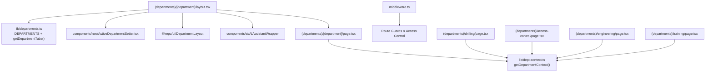
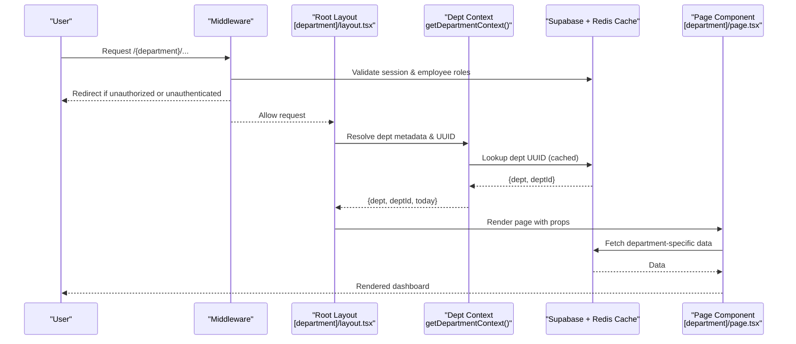
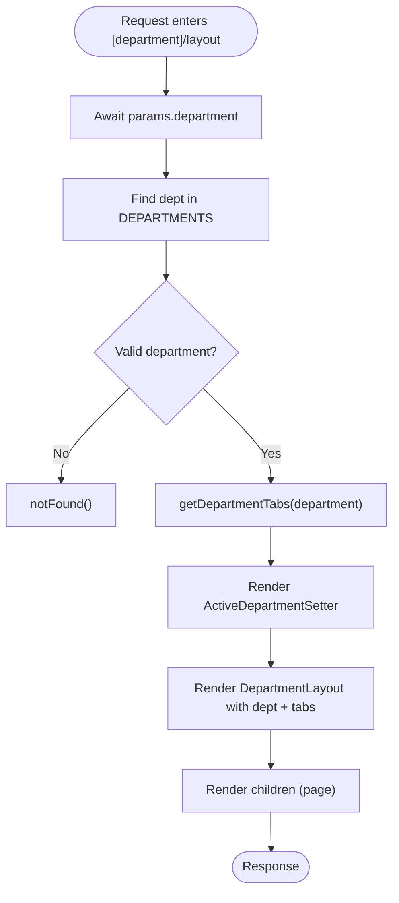
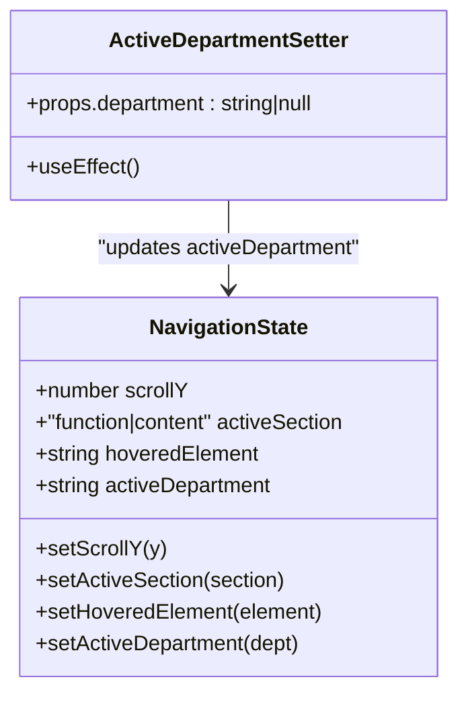
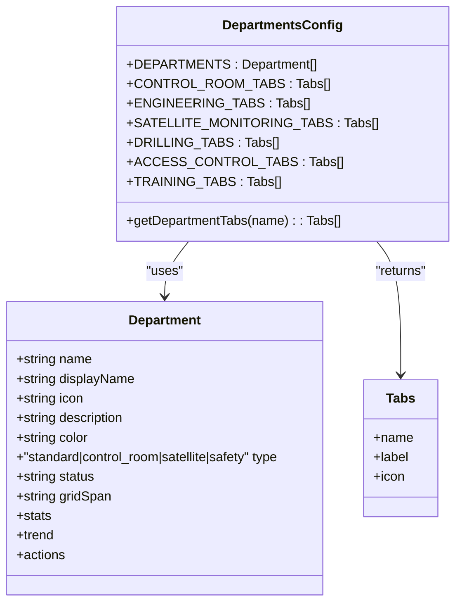
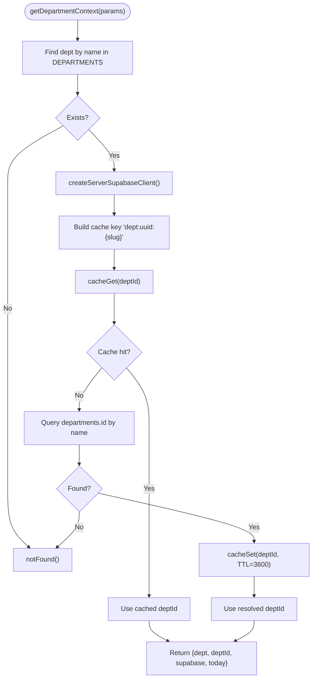
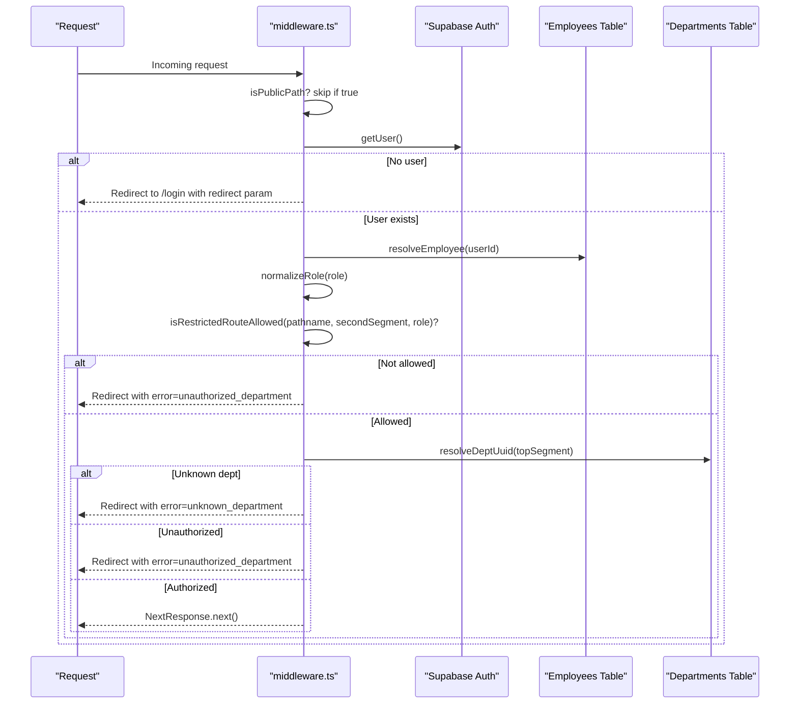
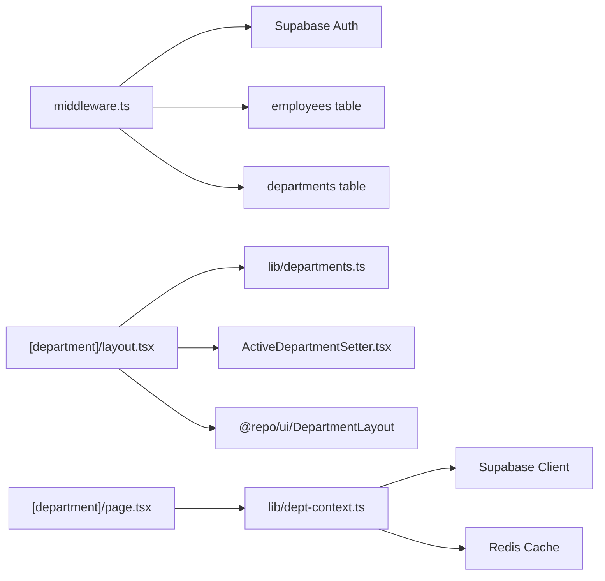

# Department Routing System

<cite>
**Referenced Files in This Document**
- [layout.tsx](file://apps/portal/app/(departments)/[department]/layout.tsx)
- [page.tsx](file://apps/portal/app/(departments)/[department]/page.tsx)
- [loading.tsx](file://apps/portal/app/(departments)/loading.tsx)
- [ActiveDepartmentSetter.tsx](file://apps/portal/components/nav/ActiveDepartmentSetter.tsx)
- [useNavigationState.ts](file://apps/portal/hooks/useNavigationState.ts)
- [departments.ts](file://apps/portal/lib/departments.ts)
- [dept-context.ts](file://apps/portal/lib/dept-context.ts)
- [middleware.ts](file://apps/portal/middleware.ts)
- [drilling/page.tsx](file://apps/portal/app/(departments)/drilling/page.tsx)
- [access-control/page.tsx](file://apps/portal/app/(departments)/access-control/page.tsx)
- [engineering/page.tsx](file://apps/portal/app/(departments)/engineering/page.tsx)
- [training/page.tsx](file://apps/portal/app/(departments)/training/page.tsx)
</cite>

## Table of Contents

1. [Introduction](#introduction)
2. [Project Structure](#project-structure)
3. [Core Components](#core-components)
4. [Architecture Overview](#architecture-overview)
5. [Detailed Component Analysis](#detailed-component-analysis)
6. [Dependency Analysis](#dependency-analysis)
7. [Performance Considerations](#performance-considerations)
8. [Troubleshooting Guide](#troubleshooting-guide)
9. [Conclusion](#conclusion)
10. [Appendices](#appendices)

## Introduction

This document explains the dynamic department routing system that powers access control and navigation for specialized industrial departments. It covers:

- Route group structure using Next.js App Router with (departments) grouping
- Dynamic [department] parameter handling and mapping to department features
- Shared layout hierarchy, UI components, and data fetching patterns
- Active department setter component managing current department state
- Route guards, loading states, and error handling
- Practical examples for adding new departments, implementing department-specific layouts, and creating shared department components

## Project Structure

The department routes are organized under the (departments) route group. The dynamic [department] segment resolves to a root layout that validates the department, renders shared UI, and delegates to department-specific pages.

**Diagram sources**

- [layout.tsx](<file://apps/portal/app/(departments)/[department]/layout.tsx#L1-L30>)
- [departments.ts:1-310](file://apps/portal/lib/departments.ts#L1-L310)
- [ActiveDepartmentSetter.tsx:1-23](file://apps/portal/components/nav/ActiveDepartmentSetter.tsx#L1-L23)
- [page.tsx](<file://apps/portal/app/(departments)/[department]/page.tsx#L1-L433>)
- [dept-context.ts:1-68](file://apps/portal/lib/dept-context.ts#L1-L68)
- [middleware.ts:1-371](file://apps/portal/middleware.ts#L1-L371)
- [drilling/page.tsx](<file://apps/portal/app/(departments)/drilling/page.tsx#L1-L167>)
- [access-control/page.tsx](<file://apps/portal/app/(departments)/access-control/page.tsx#L1-L120>)
- [engineering/page.tsx](<file://apps/portal/app/(departments)/engineering/page.tsx#L1-L220>)
- [training/page.tsx](<file://apps/portal/app/(departments)/training/page.tsx#L1-L242>)

**Section sources**

- [layout.tsx](<file://apps/portal/app/(departments)/[department]/layout.tsx#L1-L30>)
- [page.tsx](<file://apps/portal/app/(departments)/[department]/page.tsx#L1-L433>)
- [departments.ts:1-310](file://apps/portal/lib/departments.ts#L1-L310)
- [dept-context.ts:1-68](file://apps/portal/lib/dept-context.ts#L1-L68)
- [middleware.ts:1-371](file://apps/portal/middleware.ts#L1-L371)

## Core Components

- Dynamic department root layout: Validates the department slug, fetches tabs via configuration, sets active department context, and wraps content in a shared DepartmentLayout.
- Active department setter: Client-side component that updates global navigation state with the current department.
- Department configuration: Central registry of departments, tab sets per department type, and helper to resolve tabs by name.
- Server-side department context: Resolves department metadata and UUID with caching; provides helpers for requiring specific departments.
- Middleware guards: Enforces authentication, role-based restrictions, and department-level access before rendering.

Key responsibilities:

- Validation and early exit for unknown departments
- Tab resolution based on department type
- State synchronization across UI for active department
- Secure server-side data access with Redis caching
- Route protection at middleware layer

**Section sources**

- [layout.tsx](<file://apps/portal/app/(departments)/[department]/layout.tsx#L1-L30>)
- [ActiveDepartmentSetter.tsx:1-23](file://apps/portal/components/nav/ActiveDepartmentSetter.tsx#L1-L23)
- [departments.ts:1-310](file://apps/portal/lib/departments.ts#L1-L310)
- [dept-context.ts:1-68](file://apps/portal/lib/dept-context.ts#L1-L68)
- [middleware.ts:1-371](file://apps/portal/middleware.ts#L1-L371)

## Architecture Overview

The routing architecture combines Next.js App Router groups, dynamic segments, server-side context, and middleware-based guards.

**Diagram sources**

- [middleware.ts:1-371](file://apps/portal/middleware.ts#L1-L371)
- [layout.tsx](<file://apps/portal/app/(departments)/[department]/layout.tsx#L1-L30>)
- [dept-context.ts:1-68](file://apps/portal/lib/dept-context.ts#L1-L68)
- [page.tsx](<file://apps/portal/app/(departments)/[department]/page.tsx#L1-L433>)

## Detailed Component Analysis

### Dynamic [department] Root Layout

Responsibilities:

- Await params.department and validate against DEPARTMENTS registry
- Call notFound() for invalid slugs
- Compute tabs via getDepartmentTabs(department)
- Inject ActiveDepartmentSetter to update global state
- Wrap children in shared DepartmentLayout and AI assistant wrapper

**Diagram sources**

- [layout.tsx](<file://apps/portal/app/(departments)/[department]/layout.tsx#L1-L30>)
- [departments.ts:289-310](file://apps/portal/lib/departments.ts#L289-L310)

**Section sources**

- [layout.tsx](<file://apps/portal/app/(departments)/[department]/layout.tsx#L1-L30>)
- [departments.ts:289-310](file://apps/portal/lib/departments.ts#L289-L310)

### Active Department Setter

Responsibilities:

- Client-side component that subscribes to navigation store
- Sets activeDepartment when mounted and clears it on unmount
- Ensures consistent UI highlighting and navigation state across the app

**Diagram sources**

- [ActiveDepartmentSetter.tsx:1-23](file://apps/portal/components/nav/ActiveDepartmentSetter.tsx#L1-L23)
- [useNavigationState.ts:1-24](file://apps/portal/hooks/useNavigationState.ts#L1-L24)

**Section sources**

- [ActiveDepartmentSetter.tsx:1-23](file://apps/portal/components/nav/ActiveDepartmentSetter.tsx#L1-L23)
- [useNavigationState.ts:1-24](file://apps/portal/hooks/useNavigationState.ts#L1-L24)

### Department Configuration and Tabs

Responsibilities:

- Define all departments with metadata (name, displayName, icon, color, type, actions)
- Provide tab sets per department type (Control Room, Engineering, Satellite Monitoring, Drilling, Access Control, Training)
- Helper function to select appropriate tabs by department name

**Diagram sources**

- [departments.ts:1-310](file://apps/portal/lib/departments.ts#L1-L310)

**Section sources**

- [departments.ts:1-310](file://apps/portal/lib/departments.ts#L1-L310)

### Server-Side Department Context

Responsibilities:

- Resolve department metadata and UUID from Supabase with Redis cache
- Return standardized context including supabase client and operational day
- Provide requireDepartment guard for tab-level access control

**Diagram sources**

- [dept-context.ts:1-68](file://apps/portal/lib/dept-context.ts#L1-L68)

**Section sources**

- [dept-context.ts:1-68](file://apps/portal/lib/dept-context.ts#L1-L68)

### Route Guards and Access Control (Middleware)

Responsibilities:

- Public path filtering and login flow handling
- Session validation and sign-out on expired tokens
- Role normalization and restricted route checks
- Department-level authorization using employee profile and department UUID resolution
- Error redirects with descriptive query parameters

**Diagram sources**

- [middleware.ts:1-371](file://apps/portal/middleware.ts#L1-L371)

**Section sources**

- [middleware.ts:1-371](file://apps/portal/middleware.ts#L1-L371)

### Department Pages and Data Fetching Patterns

Patterns observed:

- Each department page uses getDepartmentContext to obtain deptId and today
- Heavy data fetching is parallelized with Promise.all or cachedRSC
- Read replicas are used where appropriate for read-heavy dashboards
- Suspense boundaries provide progressive loading for heavy widgets
- Some pages use force-dynamic to avoid static generation for real-time data

Examples:

- Control room dashboard orchestrates multiple panels and quick actions
- Drilling dashboard aggregates operations, delays, and machine counts
- Access control dashboard composes metrics, charts, activity feed, and entity status
- Engineering hub surfaces breakdowns and tire management summaries
- Training overview displays compliance stats, sessions, and certifications

**Section sources**

- [page.tsx](<file://apps/portal/app/(departments)/[department]/page.tsx#L1-L433>)
- [drilling/page.tsx](<file://apps/portal/app/(departments)/drilling/page.tsx#L1-L167>)
- [access-control/page.tsx](<file://apps/portal/app/(departments)/access-control/page.tsx#L1-L120>)
- [engineering/page.tsx](<file://apps/portal/app/(departments)/engineering/page.tsx#L1-L220>)
- [training/page.tsx](<file://apps/portal/app/(departments)/training/page.tsx#L1-L242>)

### Loading States and Error Handling

- Department-level loading template provides skeleton placeholders for grids and sections
- Page-level Suspense fallbacks render animated skeletons while heavy components load
- Invalid department slugs trigger notFound() in both layout and context layers
- Middleware returns structured error redirects for unauthorized or unknown departments

**Section sources**

- [loading.tsx](<file://apps/portal/app/(departments)/loading.tsx#L1-L16>)
- [page.tsx](<file://apps/portal/app/(departments)/[department]/page.tsx#L1-L433>)
- [layout.tsx](<file://apps/portal/app/(departments)/[department]/layout.tsx#L1-L30>)
- [dept-context.ts:1-68](file://apps/portal/lib/dept-context.ts#L1-L68)
- [middleware.ts:1-371](file://apps/portal/middleware.ts#L1-L371)

## Dependency Analysis

High-level dependencies between routing, configuration, context, and guards:

**Diagram sources**

- [middleware.ts:1-371](file://apps/portal/middleware.ts#L1-L371)
- [layout.tsx](<file://apps/portal/app/(departments)/[department]/layout.tsx#L1-L30>)
- [departments.ts:1-310](file://apps/portal/lib/departments.ts#L1-L310)
- [dept-context.ts:1-68](file://apps/portal/lib/dept-context.ts#L1-L68)
- [page.tsx](<file://apps/portal/app/(departments)/[department]/page.tsx#L1-L433>)

**Section sources**

- [middleware.ts:1-371](file://apps/portal/middleware.ts#L1-L371)
- [layout.tsx](<file://apps/portal/app/(departments)/[department]/layout.tsx#L1-L30>)
- [departments.ts:1-310](file://apps/portal/lib/departments.ts#L1-L310)
- [dept-context.ts:1-68](file://apps/portal/lib/dept-context.ts#L1-L68)
- [page.tsx](<file://apps/portal/app/(departments)/[department]/page.tsx#L1-L433>)

## Performance Considerations

- Prefer read replicas for read-heavy department dashboards to reduce write-path contention
- Use Redis caching for department UUID lookups and employee profiles to minimize repeated queries
- Parallelize independent database calls with Promise.all or cachedRSC to reduce waterfall latency
- Apply Suspense boundaries around heavy widgets to improve perceived performance
- Avoid static generation for real-time dashboards by marking pages as dynamic when necessary

## Troubleshooting Guide

Common issues and resolutions:

- Unknown department slug: Ensure the slug exists in DEPARTMENTS registry and matches the file structure under (departments)
- Unauthorized access: Verify employee role and accessible_departments include the target department UUID
- Token expiration: Middleware signs out and redirects; clear stale cookies and re-authenticate
- Missing tabs: Confirm getDepartmentTabs includes the new department or falls back to default tabs
- Slow dashboards: Check Redis cache hits for dept UUID and employee profile; add caching tags for invalidated tables

**Section sources**

- [middleware.ts:1-371](file://apps/portal/middleware.ts#L1-L371)
- [dept-context.ts:1-68](file://apps/portal/lib/dept-context.ts#L1-L68)
- [departments.ts:1-310](file://apps/portal/lib/departments.ts#L1-L310)

## Conclusion

The dynamic department routing system leverages Next.js App Router conventions, centralized configuration, and robust server-side context to deliver secure, scalable, and maintainable department experiences. Middleware enforces access control, while shared layouts and components ensure consistency. The design supports rapid addition of new departments and specialized features with minimal duplication.

## Appendices

### How to Add a New Department

Steps:

- Register the department in DEPARTMENTS with required metadata (name, displayName, icon, color, type, actions)
- Optionally define a dedicated tab set and extend getDepartmentTabs to return it for the new department
- Create a page under (departments)/[department]/page.tsx (or a named route like drilling/page.tsx)
- If needed, create a department-specific layout under (departments)/[department]/layout.tsx
- Update middleware.allowedPatterns to include the new top-level segment
- Implement data fetching using getDepartmentContext and parallel queries; apply caching and Suspense as needed

**Section sources**

- [departments.ts:1-310](file://apps/portal/lib/departments.ts#L1-L310)
- [middleware.ts:1-371](file://apps/portal/middleware.ts#L1-L371)
- [page.tsx](<file://apps/portal/app/(departments)/[department]/page.tsx#L1-L433>)

### Implementing Department-Specific Layouts

Guidance:

- Place a layout.tsx inside (departments)/[department]/ to override shared behavior for a specific department
- Reuse getDepartmentContext to resolve deptId and today
- Compose shared UI components and inject department-specific widgets
- Maintain consistent loading and error handling patterns

**Section sources**

- [layout.tsx](<file://apps/portal/app/(departments)/[department]/layout.tsx#L1-L30>)
- [dept-context.ts:1-68](file://apps/portal/lib/dept-context.ts#L1-L68)

### Creating Shared Department Components

Guidance:

- Extract reusable widgets (e.g., summary grids, charts, feeds) into shared components
- Accept typed props derived from getDepartmentContext (deptId, today)
- Use Suspense for async components and Skeletons for loading states
- Keep data fetching close to the component that consumes it to maximize caching efficiency

**Section sources**

- [page.tsx](<file://apps/portal/app/(departments)/[department]/page.tsx#L1-L433>)
- [drilling/page.tsx](<file://apps/portal/app/(departments)/drilling/page.tsx#L1-L167>)
- [access-control/page.tsx](<file://apps/portal/app/(departments)/access-control/page.tsx#L1-L120>)
- [engineering/page.tsx](<file://apps/portal/app/(departments)/engineering/page.tsx#L1-L220>)
- [training/page.tsx](<file://apps/portal/app/(departments)/training/page.tsx#L1-L242>)
