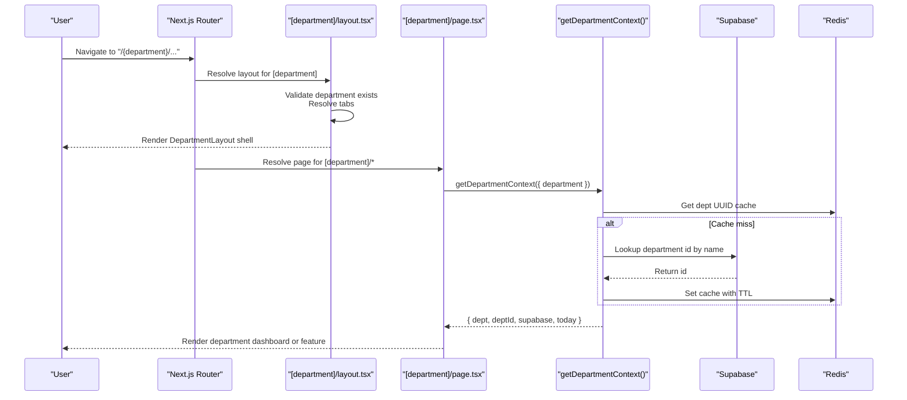
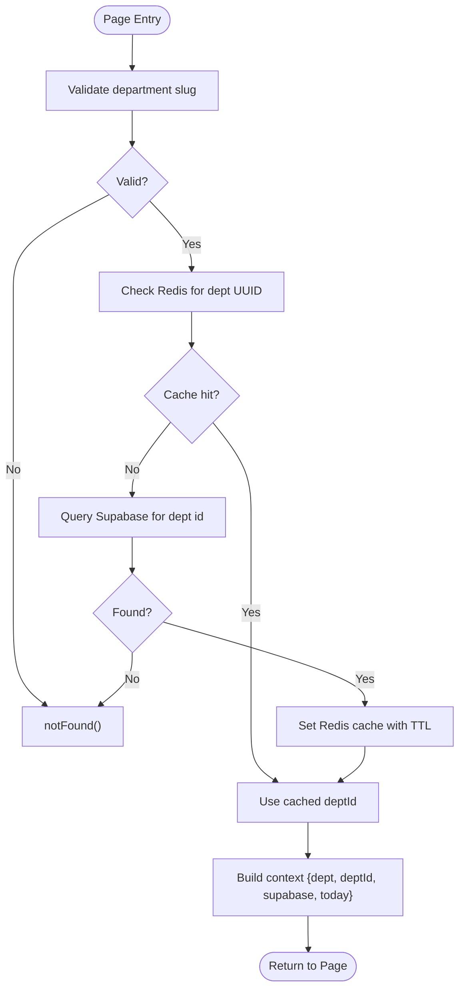
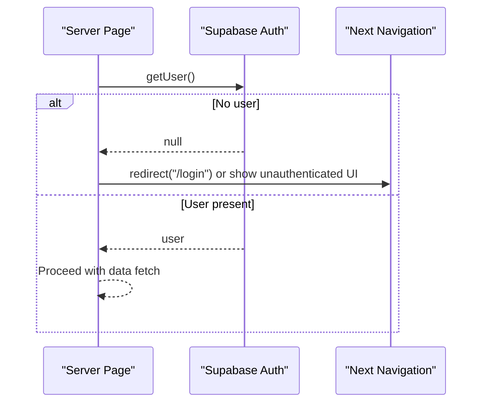
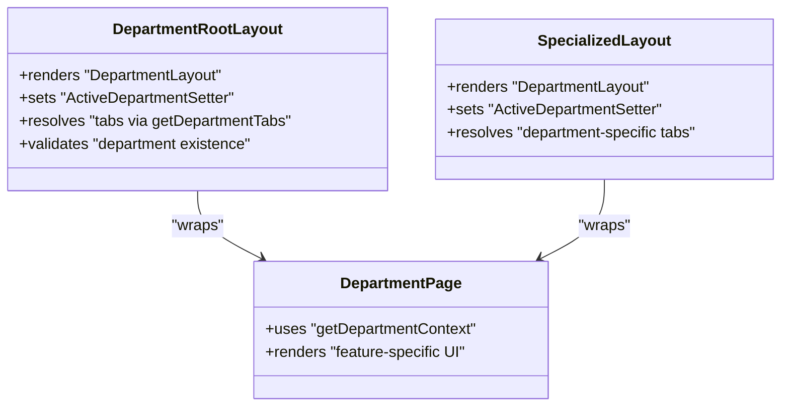
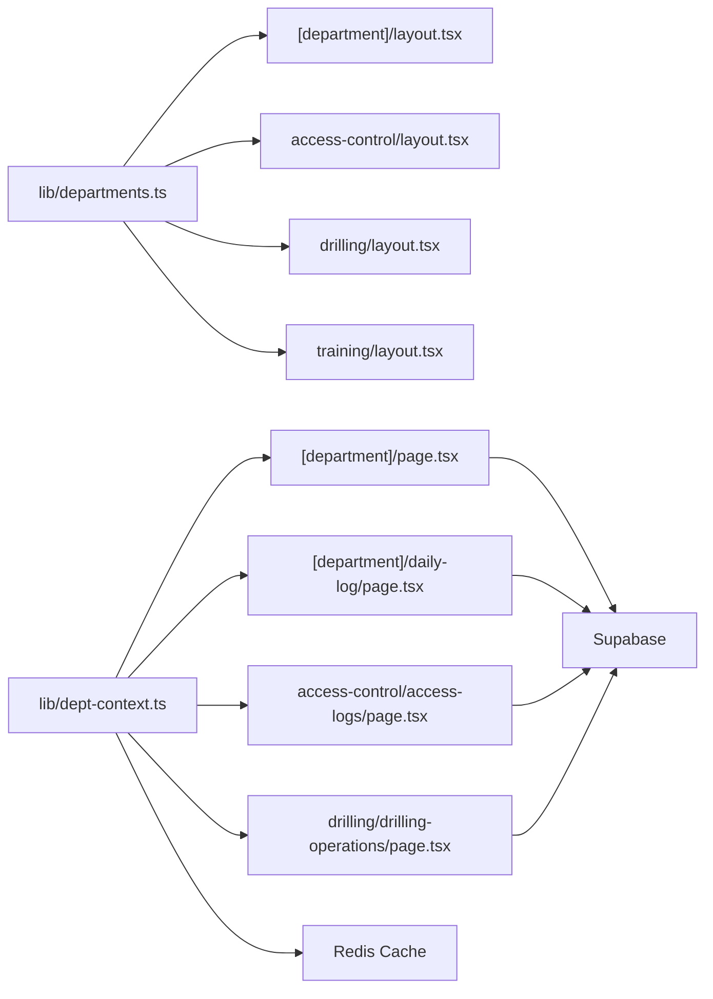

# Route Structure & Organization

<cite>
**Referenced Files in This Document**
- [apps/portal/app/(departments)/[department]/layout.tsx](file://apps/portal/app/(departments)/[department]/layout.tsx)
- [apps/portal/app/(departments)/[department]/page.tsx](file://apps/portal/app/(departments)/[department]/page.tsx)
- [apps/portal/app/(departments)/access-control/layout.tsx](file://apps/portal/app/(departments)/access-control/layout.tsx)
- [apps/portal/app/(departments)/drilling/layout.tsx](file://apps/portal/app/(departments)/drilling/layout.tsx)
- [apps/portal/app/(departments)/training/layout.tsx](file://apps/portal/app/(departments)/training/layout.tsx)
- [apps/portal/lib/dept-context.ts](file://apps/portal/lib/dept-context.ts)
- [apps/portal/lib/departments.ts](file://apps/portal/lib/departments.ts)
- [apps/portal/app/(departments)/access-control/access-logs/page.tsx](file://apps/portal/app/(departments)/access-control/access-logs/page.tsx)
- [apps/portal/app/(departments)/drilling/drilling-operations/page.tsx](file://apps/portal/app/(departments)/drilling/drilling-operations/page.tsx)
- [apps/portal/app/(departments)/[department]/daily-log/page.tsx](file://apps/portal/app/(departments)/[department]/daily-log/page.tsx)
</cite>

## Table of Contents

1. [Introduction](#introduction)
2. [Project Structure](#project-structure)
3. [Core Components](#core-components)
4. [Architecture Overview](#architecture-overview)
5. [Detailed Component Analysis](#detailed-component-analysis)
6. [Dependency Analysis](#dependency-analysis)
7. [Performance Considerations](#performance-considerations)
8. [Troubleshooting Guide](#troubleshooting-guide)
9. [Conclusion](#conclusion)
10. [Appendices](#appendices)

## Introduction

This document explains the Next.js App Router department route structure, focusing on:

- The (departments) route group pattern and how it centralizes shared layouts and middleware for all department routes.
- The dynamic [department] parameter routing system that maps URL segments to specific department features.
- The nested layout hierarchy from the root department layout down to individual department page layouts.
- Examples of route parameters, search params handling patterns, and integration with authentication and authorization.
- Guidance for creating new department routes following established patterns.

## Project Structure

The departments are organized under apps/portal/app/(departments). There are two primary patterns:

- Dynamic routes under [department]/\* for generic department pages (e.g., daily-log, history, reports).
- Static sub-department folders for specialized departments like access-control, drilling, training, engineering.

```mermaid
graph TB
A["(departments)"] --> B["[department] (dynamic)"]
A --> C["access-control (static)"]
A --> D["drilling (static)"]
A --> E["training (static)"]
A --> F["engineering (static)"]
B --> B1["layout.tsx"]
B --> B2["page.tsx"]
B --> B3["daily-log/page.tsx"]
B --> B4["history/page.tsx"]
B --> B5["reports/page.tsx"]
C --> C1["layout.tsx"]
C --> C2["page.tsx"]
C --> C3["access-logs/page.tsx"]
C --> C4["badges/page.tsx"]
C --> C5["visitors/page.tsx"]
D --> D1["layout.tsx"]
D --> D2["page.tsx"]
D --> D3["drilling-operations/page.tsx"]
D --> D4["machine-telemetry/page.tsx"]
D --> D5["reports/page.tsx"]
E --> E1["layout.tsx"]
E --> E2["page.tsx"]
E --> E3["certifications/page.tsx"]
E --> E4["courses/page.tsx"]
E --> E5["schedules/page.tsx"]
E --> E6["reports/page.tsx"]
F --> F1["layout.tsx"]
F --> F2["page.tsx"]
F --> F3["tire-management/page.tsx"]
```

**Diagram sources**

- [apps/portal/app/(departments)/[department]/layout.tsx](<file://apps/portal/app/(departments)/[department]/layout.tsx>)
- [apps/portal/app/(departments)/access-control/layout.tsx](<file://apps/portal/app/(departments)/access-control/layout.tsx>)
- [apps/portal/app/(departments)/drilling/layout.tsx](<file://apps/portal/app/(departments)/drilling/layout.tsx>)
- [apps/portal/app/(departments)/training/layout.tsx](<file://apps/portal/app/(departments)/training/layout.tsx>)

**Section sources**

- [apps/portal/app/(departments)/[department]/layout.tsx](<file://apps/portal/app/(departments)/[department]/layout.tsx>)
- [apps/portal/app/(departments)/access-control/layout.tsx](<file://apps/portal/app/(departments)/access-control/layout.tsx>)
- [apps/portal/app/(departments)/drilling/layout.tsx](<file://apps/portal/app/(departments)/drilling/layout.tsx>)
- [apps/portal/app/(departments)/training/layout.tsx](<file://apps/portal/app/(departments)/training/layout.tsx>)

## Core Components

- Department metadata and tabs: Centralized definitions for departments, tab sets per department type, and a helper to resolve tabs by department name.
- Department context resolver: Server-side utility that validates the department slug, resolves the UUID via Supabase with Redis caching, and returns a consistent context object used across pages.
- Root department layout: Wraps children with a shared UI shell and AI assistant wrapper; enforces notFound for unknown departments.
- Specialized department layouts: Provide department-specific tab sets and context for static sub-departments.

Key responsibilities:

- Routing validation and 404 behavior for invalid departments.
- Consistent navigation shell and active department state.
- Shared data fetching patterns and caching strategies.

**Section sources**

- [apps/portal/lib/departments.ts](file://apps/portal/lib/departments.ts)
- [apps/portal/lib/dept-context.ts](file://apps/portal/lib/dept-context.ts)
- [apps/portal/app/(departments)/[department]/layout.tsx](<file://apps/portal/app/(departments)/[department]/layout.tsx>)
- [apps/portal/app/(departments)/access-control/layout.tsx](<file://apps/portal/app/(departments)/access-control/layout.tsx>)
- [apps/portal/app/(departments)/drilling/layout.tsx](<file://apps/portal/app/(departments)/drilling/layout.tsx>)
- [apps/portal/app/(departments)/training/layout.tsx](<file://apps/portal/app/(departments)/training/layout.tsx>)

## Architecture Overview

The routing architecture uses:

- Route groups to isolate shared behavior for all department routes.
- Dynamic segments to map URL slugs to department features.
- Nested layouts to provide a consistent shell and context.
- Server components for secure data access and early redirects or notFound decisions.

**Diagram sources**

- [apps/portal/app/(departments)/[department]/layout.tsx](<file://apps/portal/app/(departments)/[department]/layout.tsx>)
- [apps/portal/app/(departments)/[department]/page.tsx](<file://apps/portal/app/(departments)/[department]/page.tsx>)
- [apps/portal/lib/dept-context.ts](file://apps/portal/lib/dept-context.ts)

## Detailed Component Analysis

### Dynamic [department] Parameter Routing

- The [department] folder defines a dynamic segment that matches any valid department slug.
- The root layout validates the slug against known departments and renders a shared shell.
- Pages under [department]/\* receive the resolved department context and can branch logic based on department type.

Examples:

- /control-room/hourly-loads
- /drilling/daily-log
- /access-control/access-logs

Behavior:

- Unknown slugs trigger notFound at the layout level.
- Pages use getDepartmentContext to fetch deptId and today’s operational date.

**Section sources**

- [apps/portal/app/(departments)/[department]/layout.tsx](<file://apps/portal/app/(departments)/[department]/layout.tsx>)
- [apps/portal/app/(departments)/[department]/page.tsx](<file://apps/portal/app/(departments)/[department]/page.tsx>)
- [apps/portal/lib/dept-context.ts](file://apps/portal/lib/dept-context.ts)

### Shared Layouts and Middleware via (departments) Group

- The (departments) group provides a common boundary for all department routes.
- Each department has its own layout that wraps content with a consistent UI shell and AI assistant context.
- Tabs are resolved per department using centralized tab configurations.

Static department examples:

- access-control layout sets Access Control tabs.
- drilling layout sets Drilling tabs.
- training layout sets Training tabs.

**Section sources**

- [apps/portal/app/(departments)/access-control/layout.tsx](<file://apps/portal/app/(departments)/access-control/layout.tsx>)
- [apps/portal/app/(departments)/drilling/layout.tsx](<file://apps/portal/app/(departments)/drilling/layout.tsx>)
- [apps/portal/app/(departments)/training/layout.tsx](<file://apps/portal/app/(departments)/training/layout.tsx>)
- [apps/portal/lib/departments.ts](file://apps/portal/lib/departments.ts)

### Data Flow and Context Resolution

- getDepartmentContext validates the department, resolves the UUID from Supabase, caches it in Redis, and returns a standardized context including today’s operational date.
- Pages consume this context to query data scoped to the current department.

**Diagram sources**

- [apps/portal/lib/dept-context.ts](file://apps/portal/lib/dept-context.ts)

**Section sources**

- [apps/portal/lib/dept-context.ts](file://apps/portal/lib/dept-context.ts)

### Authentication and Authorization Integration

- Server components perform auth checks before rendering sensitive data.
- If no user is present, pages either redirect to login or render an unauthenticated message.
- Some pages explicitly require authentication and will redirect when missing.

Patterns observed:

- Access logs page checks for a logged-in user and shows a message if not authenticated.
- Drilling operations page redirects to login if no user is found.

**Diagram sources**

- [apps/portal/app/(departments)/access-control/access-logs/page.tsx](<file://apps/portal/app/(departments)/access-control/access-logs/page.tsx>)
- [apps/portal/app/(departments)/drilling/drilling-operations/page.tsx](<file://apps/portal/app/(departments)/drilling/drilling-operations/page.tsx>)

**Section sources**

- [apps/portal/app/(departments)/access-control/access-logs/page.tsx](<file://apps/portal/app/(departments)/access-control/access-logs/page.tsx>)
- [apps/portal/app/(departments)/drilling/drilling-operations/page.tsx](<file://apps/portal/app/(departments)/drilling/drilling-operations/page.tsx>)

### Route Parameters and Search Params Handling

- Route parameters:
  - [department] is accessed via params in both layout and page components.
  - Example usage: resolving department tabs and building links like /{department}/daily-log.
- Search params:
  - While not shown in the referenced files, typical usage would involve reading searchParams from the route handler props to filter or paginate lists.
  - For server components, read searchParams directly from the function arguments and pass them into client components or data queries.

Examples:

- Daily log page reads params.department to determine department-specific behavior and build URLs.
- Dashboard page reads params.department to select department-specific dashboards and quick actions.

**Section sources**

- [apps/portal/app/(departments)/[department]/daily-log/page.tsx](<file://apps/portal/app/(departments)/[department]/daily-log/page.tsx>)
- [apps/portal/app/(departments)/[department]/page.tsx](<file://apps/portal/app/(departments)/[department]/page.tsx>)

### Nested Layout Hierarchy

- Root department layout ([department]/layout.tsx):
  - Validates department, resolves tabs, sets active department, and wraps children with DepartmentLayout and AIAssistantWrapper.
- Specialized department layouts (e.g., access-control/layout.tsx, drilling/layout.tsx, training/layout.tsx):
  - Provide department-specific tabs and context while reusing the same UI shell.
- Individual pages:
  - Compose UI using shared components and fetch data scoped to the current department.

**Diagram sources**

- [apps/portal/app/(departments)/[department]/layout.tsx](<file://apps/portal/app/(departments)/[department]/layout.tsx>)
- [apps/portal/app/(departments)/access-control/layout.tsx](<file://apps/portal/app/(departments)/access-control/layout.tsx>)
- [apps/portal/app/(departments)/drilling/layout.tsx](<file://apps/portal/app/(departments)/drilling/layout.tsx>)
- [apps/portal/app/(departments)/training/layout.tsx](<file://apps/portal/app/(departments)/training/layout.tsx>)

**Section sources**

- [apps/portal/app/(departments)/[department]/layout.tsx](<file://apps/portal/app/(departments)/[department]/layout.tsx>)
- [apps/portal/app/(departments)/access-control/layout.tsx](<file://apps/portal/app/(departments)/access-control/layout.tsx>)
- [apps/portal/app/(departments)/drilling/layout.tsx](<file://apps/portal/app/(departments)/drilling/layout.tsx>)
- [apps/portal/app/(departments)/training/layout.tsx](<file://apps/portal/app/(departments)/training/layout.tsx>)

## Dependency Analysis

- Departments metadata and tabs are centralized in lib/departments.ts and consumed by layouts and pages.
- getDepartmentContext depends on Supabase client and Redis cache for UUID resolution.
- Pages depend on context and Supabase client to fetch department-scoped data.

**Diagram sources**

- [apps/portal/lib/departments.ts](file://apps/portal/lib/departments.ts)
- [apps/portal/lib/dept-context.ts](file://apps/portal/lib/dept-context.ts)
- [apps/portal/app/(departments)/[department]/layout.tsx](<file://apps/portal/app/(departments)/[department]/layout.tsx>)
- [apps/portal/app/(departments)/access-control/layout.tsx](<file://apps/portal/app/(departments)/access-control/layout.tsx>)
- [apps/portal/app/(departments)/drilling/layout.tsx](<file://apps/portal/app/(departments)/drilling/layout.tsx>)
- [apps/portal/app/(departments)/training/layout.tsx](<file://apps/portal/app/(departments)/training/layout.tsx>)
- [apps/portal/app/(departments)/[department]/page.tsx](<file://apps/portal/app/(departments)/[department]/page.tsx>)
- [apps/portal/app/(departments)/[department]/daily-log/page.tsx](<file://apps/portal/app/(departments)/[department]/daily-log/page.tsx>)
- [apps/portal/app/(departments)/access-control/access-logs/page.tsx](<file://apps/portal/app/(departments)/access-control/access-logs/page.tsx>)
- [apps/portal/app/(departments)/drilling/drilling-operations/page.tsx](<file://apps/portal/app/(departments)/drilling/drilling-operations/page.tsx>)

**Section sources**

- [apps/portal/lib/departments.ts](file://apps/portal/lib/departments.ts)
- [apps/portal/lib/dept-context.ts](file://apps/portal/lib/dept-context.ts)
- [apps/portal/app/(departments)/[department]/layout.tsx](<file://apps/portal/app/(departments)/[department]/layout.tsx>)
- [apps/portal/app/(departments)/access-control/layout.tsx](<file://apps/portal/app/(departments)/access-control/layout.tsx>)
- [apps/portal/app/(departments)/drilling/layout.tsx](<file://apps/portal/app/(departments)/drilling/layout.tsx>)
- [apps/portal/app/(departments)/training/layout.tsx](<file://apps/portal/app/(departments)/training/layout.tsx>)
- [apps/portal/app/(departments)/[department]/page.tsx](<file://apps/portal/app/(departments)/[department]/page.tsx>)
- [apps/portal/app/(departments)/[department]/daily-log/page.tsx](<file://apps/portal/app/(departments)/[department]/daily-log/page.tsx>)
- [apps/portal/app/(departments)/access-control/access-logs/page.tsx](<file://apps/portal/app/(departments)/access-control/access-logs/page.tsx>)
- [apps/portal/app/(departments)/drilling/drilling-operations/page.tsx](<file://apps/portal/app/(departments)/drilling/drilling-operations/page.tsx>)

## Performance Considerations

- Use Suspense boundaries around heavy or async components to improve perceived performance.
- Prefer parallel data fetching where possible (e.g., Promise.all for independent queries).
- Leverage Redis caching for expensive lookups like department UUID resolution.
- Apply force-dynamic only when necessary; default to static or ISR where appropriate to reduce server load.

## Troubleshooting Guide

Common issues and resolutions:

- Invalid department slug results in notFound:
  - Ensure the slug exists in DEPARTMENTS and database.
  - Check layout-level validation and ensure correct import of getDepartmentTabs.
- Unauthenticated access:
  - Verify server component auth checks and redirect behavior.
  - Confirm Supabase session availability on the server.
- Missing data or empty states:
  - Validate department_id scoping in queries.
  - Ensure today’s operational date calculation aligns with business rules.

**Section sources**

- [apps/portal/app/(departments)/[department]/layout.tsx](<file://apps/portal/app/(departments)/[department]/layout.tsx>)
- [apps/portal/app/(departments)/access-control/access-logs/page.tsx](<file://apps/portal/app/(departments)/access-control/access-logs/page.tsx>)
- [apps/portal/app/(departments)/drilling/drilling-operations/page.tsx](<file://apps/portal/app/(departments)/drilling/drilling-operations/page.tsx>)

## Conclusion

The (departments) route group and dynamic [department] parameter create a scalable, maintainable structure for department-based features. Shared layouts enforce consistent UX and navigation, while centralized metadata and context utilities simplify data access and validation. Following the documented patterns ensures predictable routing, robust authentication flows, and efficient performance.

## Appendices

### Creating New Department Routes

Follow these steps to add a new department route:

- Add department metadata and tabs:
  - Update lib/departments.ts with new department entry and tab configuration.
- Create or extend layout:
  - For dynamic routes: rely on [department]/layout.tsx to wrap content.
  - For static sub-department: create a layout.tsx similar to access-control, drilling, or training.
- Implement page(s):
  - Use getDepartmentContext to obtain deptId and today.
  - Perform server-side auth checks and redirect or render unauthenticated UI as needed.
  - Fetch data scoped to deptId and render feature-specific UI.
- Linking and navigation:
  - Build links using the department slug (e.g., `/${department}/daily-log`).
  - Ensure ActiveDepartmentSetter receives the correct department value.

**Section sources**

- [apps/portal/lib/departments.ts](file://apps/portal/lib/departments.ts)
- [apps/portal/app/(departments)/[department]/layout.tsx](<file://apps/portal/app/(departments)/[department]/layout.tsx>)
- [apps/portal/app/(departments)/access-control/layout.tsx](<file://apps/portal/app/(departments)/access-control/layout.tsx>)
- [apps/portal/app/(departments)/drilling/layout.tsx](<file://apps/portal/app/(departments)/drilling/layout.tsx>)
- [apps/portal/app/(departments)/training/layout.tsx](<file://apps/portal/app/(departments)/training/layout.tsx>)
- [apps/portal/app/(departments)/[department]/daily-log/page.tsx](<file://apps/portal/app/(departments)/[department]/daily-log/page.tsx>)
