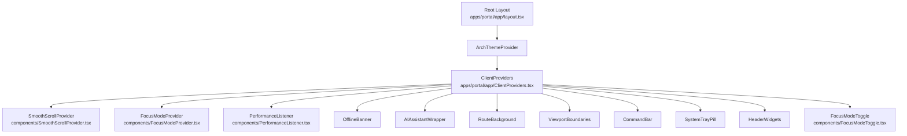
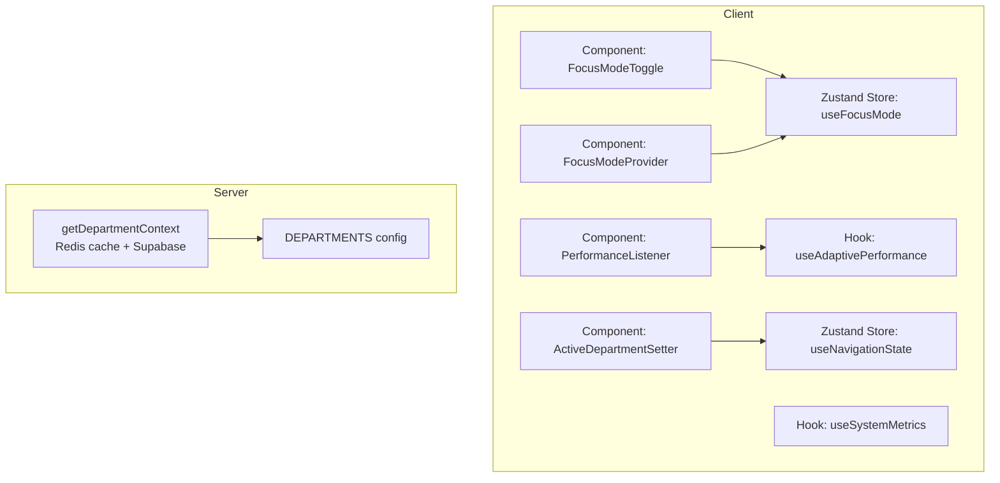
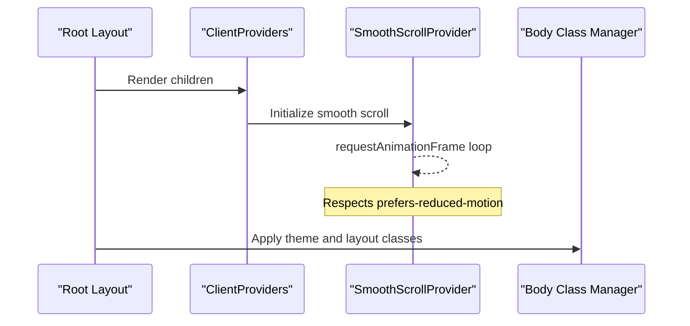
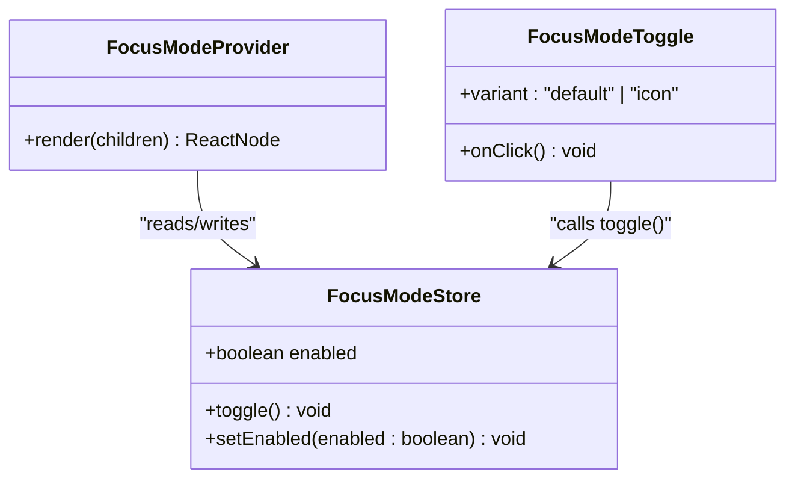
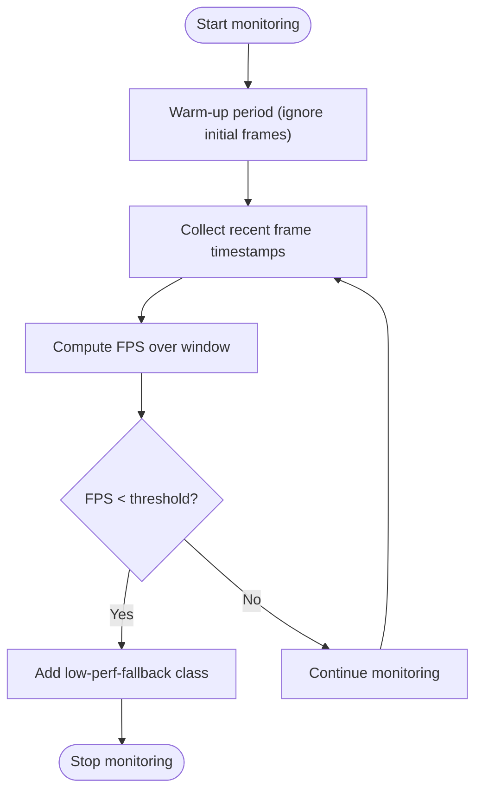
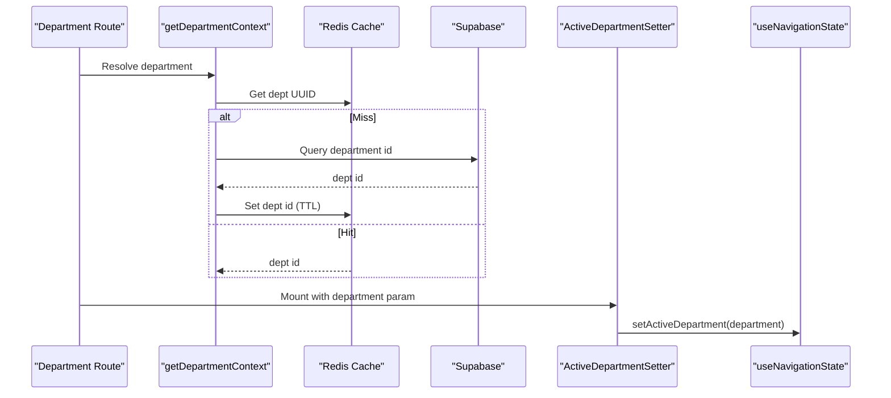
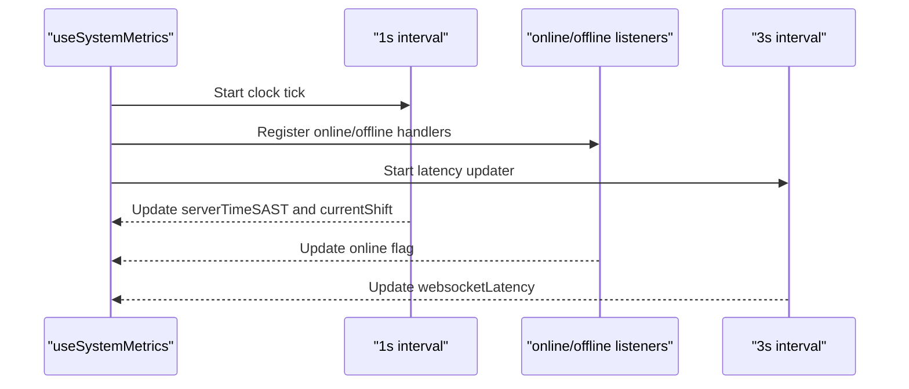
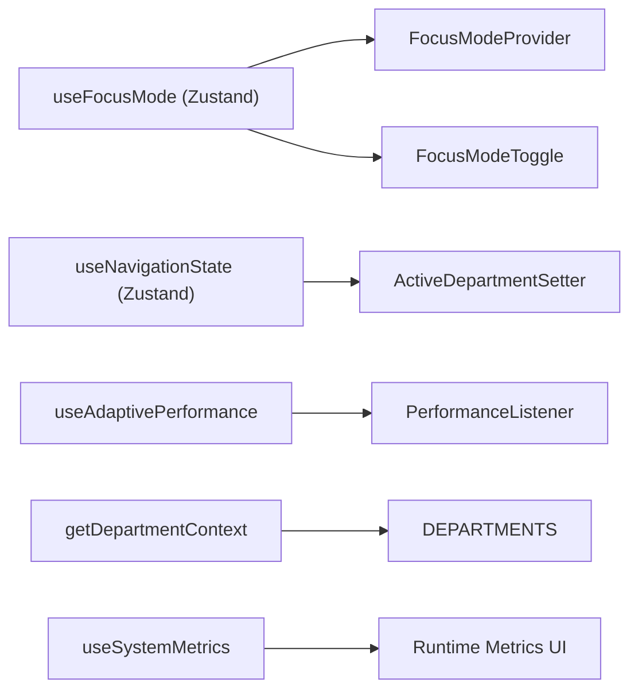

# Global State Management

<cite>
**Referenced Files in This Document**
- [layout.tsx](file://apps/portal/app/layout.tsx)
- [ClientProviders.tsx](file://apps/portal/app/ClientProviders.tsx)
- [SmoothScrollProvider.tsx](file://apps/portal/components/SmoothScrollProvider.tsx)
- [FocusModeProvider.tsx](file://apps/portal/components/FocusModeProvider.tsx)
- [FocusModeToggle.tsx](file://apps/portal/components/FocusModeToggle.tsx)
- [PerformanceListener.tsx](file://apps/portal/components/PerformanceListener.tsx)
- [useFocusMode.ts](file://apps/portal/hooks/useFocusMode.ts)
- [useAdaptivePerformance.ts](file://apps/portal/hooks/useAdaptivePerformance.ts)
- [useSystemMetrics.ts](file://apps/portal/hooks/useSystemMetrics.ts)
- [useNavigationState.ts](file://apps/portal/hooks/useNavigationState.ts)
- [ActiveDepartmentSetter.tsx](file://apps/portal/components/nav/ActiveDepartmentSetter.tsx)
- [dept-context.ts](file://apps/portal/lib/dept-context.ts)
- [departments.ts](file://apps/portal/lib/departments.ts)
- [ADR-005 Zustand](file://wiki/concepts/adr-005-zustand-state-management.md)
</cite>

## Table of Contents

1. Introduction
2. Project Structure
3. Core Components
4. Architecture Overview
5. Detailed Component Analysis
6. Dependency Analysis
7. Performance Considerations
8. Troubleshooting Guide
9. Conclusion
10. Appendices

## Introduction

This document explains the global state management architecture in the Portal application with a focus on:

- Client-side providers setup via ClientProviders and related providers
- Focus mode system for UI complexity control and performance optimization
- Department context and navigation state for current department tracking
- System metrics hook for runtime performance and user interaction tracking
- State persistence strategies, server-client synchronization patterns, and performance implications
- Practical guidance for creating new contexts/stores, implementing custom hooks, and optimizing updates

The approach is intentionally minimal and RSC-friendly: most data lives on the server or URL, while client state is kept small and focused on UI chrome and cross-cutting concerns.

## Project Structure

At the root layout, the application composes several client providers that wrap the entire app. These providers initialize global behaviors (smooth scrolling), apply UI modes (focus mode), listen to performance signals, and inject accessibility features.

**Diagram sources**

- [layout.tsx:144-184](file://apps/portal/app/layout.tsx#L144-L184)
- [ClientProviders.tsx:14-39](file://apps/portal/app/ClientProviders.tsx#L14-L39)
- [SmoothScrollProvider.tsx:6-56](file://apps/portal/components/SmoothScrollProvider.tsx#L6-L56)
- [FocusModeProvider.tsx:10-25](file://apps/portal/components/FocusModeProvider.tsx#L10-L25)
- [PerformanceListener.tsx:12-28](file://apps/portal/components/PerformanceListener.tsx#L12-L28)
- [FocusModeToggle.tsx:12-73](file://apps/portal/components/FocusModeToggle.tsx#L12-L73)

**Section sources**

- [layout.tsx:75-189](file://apps/portal/app/layout.tsx#L75-L189)
- [ClientProviders.tsx:1-40](file://apps/portal/app/ClientProviders.tsx#L1-L40)

## Core Components

- ClientProviders: Bootstraps client-only behavior (e.g., smooth scroll provider) and cleans up stale service workers in development.
- SmoothScrollProvider: Initializes Lenis for smooth scrolling and respects reduced motion preferences.
- FocusModeProvider + useFocusMode: Manages a persisted boolean flag that toggles a CSS class on the body to reduce UI complexity.
- PerformanceListener + useAdaptivePerformance: Monitors frame rate and applies a fallback class when performance degrades.
- ActiveDepartmentSetter + useNavigationState: Tracks the active department across navigation boundaries.
- getDepartmentContext: Server-side utility to resolve department metadata and IDs with Redis caching.
- useSystemMetrics: Tracks simulated websocket latency, server time in SAST, shift windows, and online status.

**Section sources**

- [ClientProviders.tsx:14-39](file://apps/portal/app/ClientProviders.tsx#L14-L39)
- [SmoothScrollProvider.tsx:13-53](file://apps/portal/components/SmoothScrollProvider.tsx#L13-L53)
- [FocusModeProvider.tsx:10-25](file://apps/portal/components/FocusModeProvider.tsx#L10-L25)
- [useFocusMode.ts:12-23](file://apps/portal/hooks/useFocusMode.ts#L12-L23)
- [PerformanceListener.tsx:12-28](file://apps/portal/components/PerformanceListener.tsx#L12-L28)
- [useAdaptivePerformance.ts:13-82](file://apps/portal/hooks/useAdaptivePerformance.ts#L13-L82)
- [ActiveDepartmentSetter.tsx:6-22](file://apps/portal/components/nav/ActiveDepartmentSetter.tsx#L6-L22)
- [useNavigationState.ts:14-23](file://apps/portal/hooks/useNavigationState.ts#L14-L23)
- [dept-context.ts:16-52](file://apps/portal/lib/dept-context.ts#L16-L52)
- [useSystemMetrics.ts:27-106](file://apps/portal/hooks/useSystemMetrics.ts#L27-L106)

## Architecture Overview

The global state strategy combines:

- Minimal client stores (Zustand) for UI chrome and cross-cutting concerns
- Server-resolved context for departments and data
- Lightweight hooks for runtime metrics and adaptive rendering
- Persistence via localStorage for user preferences

**Diagram sources**

- [useFocusMode.ts:12-23](file://apps/portal/hooks/useFocusMode.ts#L12-L23)
- [useNavigationState.ts:14-23](file://apps/portal/hooks/useNavigationState.ts#L14-L23)
- [useAdaptivePerformance.ts:13-82](file://apps/portal/hooks/useAdaptivePerformance.ts#L13-L82)
- [useSystemMetrics.ts:27-106](file://apps/portal/hooks/useSystemMetrics.ts#L27-L106)
- [PerformanceListener.tsx:12-28](file://apps/portal/components/PerformanceListener.tsx#L12-L28)
- [FocusModeProvider.tsx:10-25](file://apps/portal/components/FocusModeProvider.tsx#L10-L25)
- [FocusModeToggle.tsx:12-73](file://apps/portal/components/FocusModeToggle.tsx#L12-L73)
- [ActiveDepartmentSetter.tsx:6-22](file://apps/portal/components/nav/ActiveDepartmentSetter.tsx#L6-L22)
- [dept-context.ts:16-52](file://apps/portal/lib/dept-context.ts#L16-L52)
- [departments.ts:23-168](file://apps/portal/lib/departments.ts#L23-L168)

## Detailed Component Analysis

### Client Providers Setup (ClientProviders and friends)

- ClientProviders initializes SmoothScrollProvider and performs dev-time service worker cleanup.
- SmoothScrollProvider sets up Lenis with requestAnimationFrame and visibility handling.
- The root layout composes these providers around the application shell.

**Diagram sources**

- [layout.tsx:144-184](file://apps/portal/app/layout.tsx#L144-L184)
- [ClientProviders.tsx:14-39](file://apps/portal/app/ClientProviders.tsx#L14-L39)
- [SmoothScrollProvider.tsx:13-53](file://apps/portal/components/SmoothScrollProvider.tsx#L13-L53)

**Section sources**

- [ClientProviders.tsx:14-39](file://apps/portal/app/ClientProviders.tsx#L14-L39)
- [SmoothScrollProvider.tsx:13-53](file://apps/portal/components/SmoothScrollProvider.tsx#L13-L53)
- [layout.tsx:144-184](file://apps/portal/app/layout.tsx#L144-L184)

### Focus Mode System

Focus mode reduces UI complexity by toggling a CSS class on the body. It uses a persisted Zustand store and a provider to synchronize DOM classes.

**Diagram sources**

- [useFocusMode.ts:12-23](file://apps/portal/hooks/useFocusMode.ts#L12-L23)
- [FocusModeProvider.tsx:10-25](file://apps/portal/components/FocusModeProvider.tsx#L10-L25)
- [FocusModeToggle.tsx:12-73](file://apps/portal/components/FocusModeToggle.tsx#L12-L73)

Key behaviors:

- Persisted under a dedicated storage key so user preference survives reloads.
- Provider adds/removes a CSS class on the body to drive UI simplification.
- Toggle component exposes both icon and default variants.

**Section sources**

- [useFocusMode.ts:12-23](file://apps/portal/hooks/useFocusMode.ts#L12-L23)
- [FocusModeProvider.tsx:10-25](file://apps/portal/components/FocusModeProvider.tsx#L10-L25)
- [FocusModeToggle.tsx:12-73](file://apps/portal/components/FocusModeToggle.tsx#L12-L73)

### Adaptive Performance Listener

A lightweight monitor measures frame timing and triggers a fallback mode when FPS drops below a threshold.

**Diagram sources**

- [useAdaptivePerformance.ts:13-82](file://apps/portal/hooks/useAdaptivePerformance.ts#L13-L82)
- [PerformanceListener.tsx:12-28](file://apps/portal/components/PerformanceListener.tsx#L12-L28)

Behavioral notes:

- Immediately engages fallback if Focus Mode is enabled.
- Uses a warm-up window to avoid hydration noise.
- Applies a CSS class to signal downstream components to simplify rendering.

**Section sources**

- [useAdaptivePerformance.ts:13-82](file://apps/portal/hooks/useAdaptivePerformance.ts#L13-L82)
- [PerformanceListener.tsx:12-28](file://apps/portal/components/PerformanceListener.tsx#L12-L28)

### Department Context and Navigation State

- Server-side: getDepartmentContext validates the department slug, resolves UUID from Supabase, caches it in Redis, and returns metadata plus a Supabase client instance.
- Client-side: ActiveDepartmentSetter writes the current department into a shared Zustand store used by navigation elements.

**Diagram sources**

- [dept-context.ts:16-52](file://apps/portal/lib/dept-context.ts#L16-L52)
- [departments.ts:23-168](file://apps/portal/lib/departments.ts#L23-L168)
- [ActiveDepartmentSetter.tsx:6-22](file://apps/portal/components/nav/ActiveDepartmentSetter.tsx#L6-L22)
- [useNavigationState.ts:14-23](file://apps/portal/hooks/useNavigationState.ts#L14-L23)

**Section sources**

- [dept-context.ts:16-52](file://apps/portal/lib/dept-context.ts#L16-L52)
- [departments.ts:23-168](file://apps/portal/lib/departments.ts#L23-L168)
- [ActiveDepartmentSetter.tsx:6-22](file://apps/portal/components/nav/ActiveDepartmentSetter.tsx#L6-L22)
- [useNavigationState.ts:14-23](file://apps/portal/hooks/useNavigationState.ts#L14-L23)

### System Metrics Hook

Tracks runtime metrics including:

- Simulated websocket latency with jitter and occasional spikes
- Server time in South African Standard Time (SAST)
- Current operational shift derived from a utility
- Online/offline status via browser events

**Diagram sources**

- [useSystemMetrics.ts:27-106](file://apps/portal/hooks/useSystemMetrics.ts#L27-L106)

**Section sources**

- [useSystemMetrics.ts:27-106](file://apps/portal/hooks/useSystemMetrics.ts#L27-L106)

## Dependency Analysis

- Client stores are decoupled from server logic; they only manage UI chrome and cross-cutting concerns.
- Department resolution is centralized on the server with caching, minimizing redundant network calls.
- Performance feedback flows from hooks to CSS classes, enabling declarative UI adaptation without complex state propagation.

**Diagram sources**

- [useFocusMode.ts:12-23](file://apps/portal/hooks/useFocusMode.ts#L12-L23)
- [FocusModeProvider.tsx:10-25](file://apps/portal/components/FocusModeProvider.tsx#L10-L25)
- [FocusModeToggle.tsx:12-73](file://apps/portal/components/FocusModeToggle.tsx#L12-L73)
- [useNavigationState.ts:14-23](file://apps/portal/hooks/useNavigationState.ts#L14-L23)
- [ActiveDepartmentSetter.tsx:6-22](file://apps/portal/components/nav/ActiveDepartmentSetter.tsx#L6-L22)
- [useAdaptivePerformance.ts:13-82](file://apps/portal/hooks/useAdaptivePerformance.ts#L13-L82)
- [PerformanceListener.tsx:12-28](file://apps/portal/components/PerformanceListener.tsx#L12-L28)
- [dept-context.ts:16-52](file://apps/portal/lib/dept-context.ts#L16-L52)
- [departments.ts:23-168](file://apps/portal/lib/departments.ts#L23-L168)
- [useSystemMetrics.ts:27-106](file://apps/portal/hooks/useSystemMetrics.ts#L27-L106)

**Section sources**

- [ADR-005 Zustand:1-141](file://wiki/concepts/adr-005-zustand-state-management.md#L1-L141)

## Performance Considerations

- Prefer server-rendered data and URL-driven state; keep client stores minimal.
- Use Focus Mode and adaptive performance to degrade gracefully under load.
- Throttle frequent updates using utilities like useThrottledState to reduce render churn.
- Avoid heavy work in high-frequency intervals; prefer debounced/throttled handlers.
- Leverage Redis caching for expensive lookups (e.g., department UUIDs).

[No sources needed since this section provides general guidance]

## Troubleshooting Guide

- Focus Mode not persisting: Ensure the store’s persistence configuration is present and accessible in the client environment.
- Low performance fallback not activating: Verify the adaptive performance hook is mounted and the CSS class is applied to the body.
- Department mismatch errors: Confirm the department slug exists in the static list and matches database records; check Redis cache TTL and invalidation.
- Service worker interference in development: ClientProviders unregisters stale registrations during development to prevent caching issues.

**Section sources**

- [useFocusMode.ts:12-23](file://apps/portal/hooks/useFocusMode.ts#L12-L23)
- [PerformanceListener.tsx:12-28](file://apps/portal/components/PerformanceListener.tsx#L12-L28)
- [dept-context.ts:16-52](file://apps/portal/lib/dept-context.ts#L16-L52)
- [ClientProviders.tsx:14-39](file://apps/portal/app/ClientProviders.tsx#L14-L39)

## Conclusion

The Portal’s global state strategy emphasizes simplicity and performance:

- Minimal client stores for UI chrome
- Server-resolved context with caching for authoritative data
- Lightweight hooks for runtime metrics and adaptive rendering
- Clear separation between server and client responsibilities

This design scales well for dashboard-heavy applications where most state is server-driven and client state remains small and focused.

[No sources needed since this section summarizes without analyzing specific files]

## Appendices

### Creating a New Client Store (Zustand)

- Define an interface describing state and actions.
- Create a store with create and expose selectors via hooks.
- Optionally add persistence middleware for user preferences.
- Reference ADR-005 for rationale and examples.

**Section sources**

- [ADR-005 Zustand:100-141](file://wiki/concepts/adr-005-zustand-state-management.md#L100-L141)

### Implementing a Custom Hook for Metrics

- Use setInterval or requestAnimationFrame for periodic updates.
- Subscribe to browser events (online/offline, visibilitychange).
- Return a stable object shape to minimize re-renders.
- Clean up timers and event listeners in effect teardown.

**Section sources**

- [useSystemMetrics.ts:27-106](file://apps/portal/hooks/useSystemMetrics.ts#L27-L106)

### Optimizing State Updates

- Batch frequent updates using throttling utilities.
- Select only necessary slices from stores to avoid unnecessary re-renders.
- Defer heavy computations off the main thread or memoize results.

**Section sources**

- [useThrottledState.ts:11-66](file://apps/portal/hooks/useThrottledState.ts#L11-L66)
