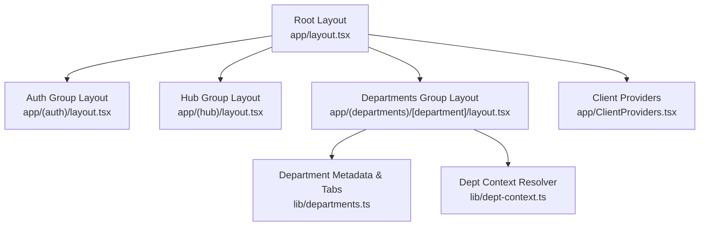
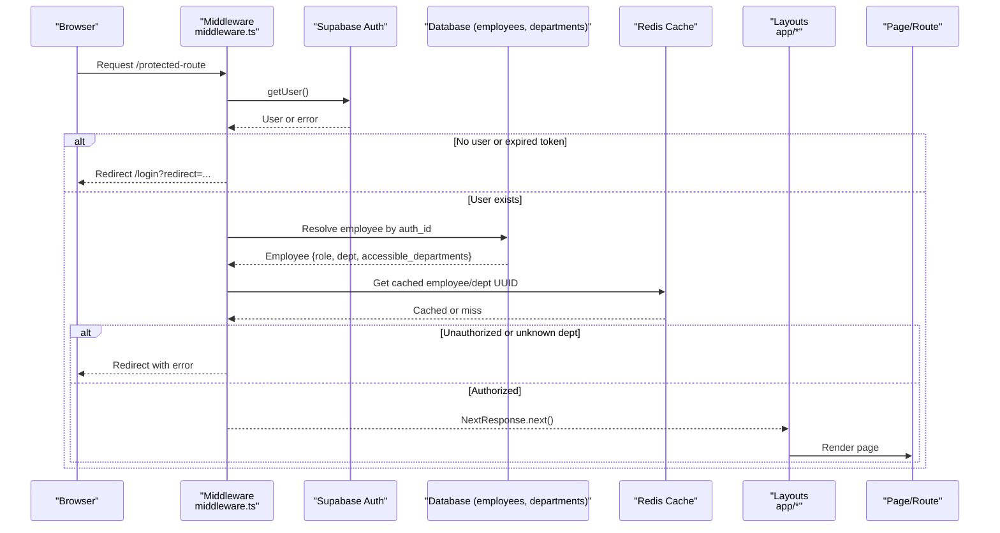
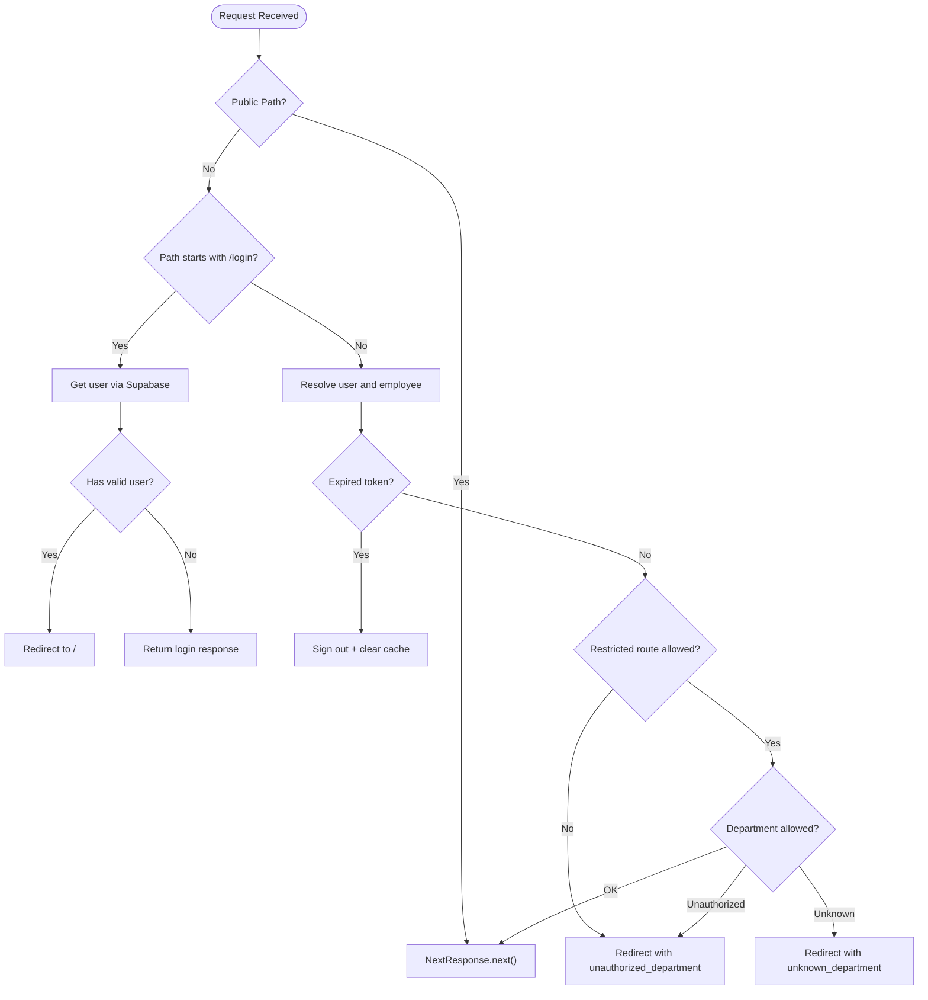
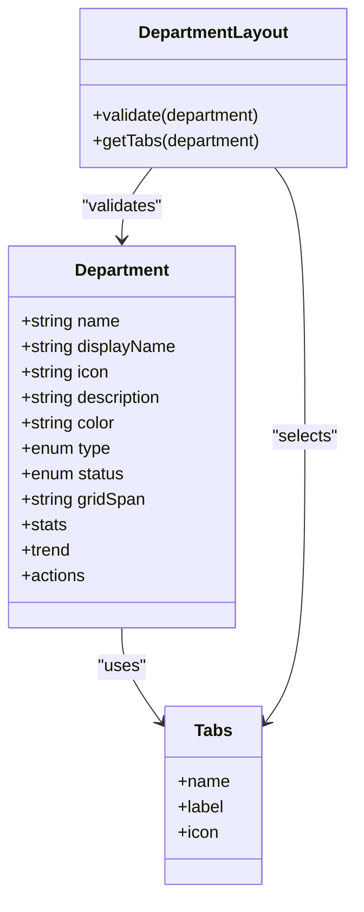
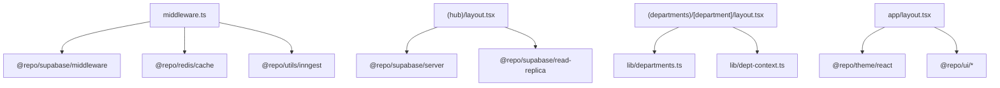

# Portal Application

<cite>
**Referenced Files in This Document**
- [layout.tsx](file://apps/portal/app/layout.tsx)
- [middleware.ts](file://apps/portal/middleware.ts)
- [(auth)/layout.tsx](file://apps/portal/app/(auth)/layout.tsx)
- [(hub)/layout.tsx](file://apps/portal/app/(hub)/layout.tsx)
- [(departments)/[department]/layout.tsx](file://apps/portal/app/(departments)/[department]/layout.tsx)
- [ClientProviders.tsx](file://apps/portal/app/ClientProviders.tsx)
- [departments.ts](file://apps/portal/lib/departments.ts)
- [dept-context.ts](file://apps/portal/lib/dept-context.ts)
- [actions.ts](file://apps/portal/app/actions.ts)
- [loading.tsx](file://apps/portal/app/loading.tsx)
- [error.tsx](file://apps/portal/app/error.tsx)
- [not-found.tsx](file://apps/portal/app/not-found.tsx)
- [OfflineBanner.tsx](file://apps/portal/components/OfflineBanner.tsx)
- [next.config.mjs](file://apps/portal/next.config.mjs)
</cite>

## Table of Contents

1. [Introduction](#introduction)
2. [Project Structure](#project-structure)
3. [Core Components](#core-components)
4. [Architecture Overview](#architecture-overview)
5. [Detailed Component Analysis](#detailed-component-analysis)
6. [Dependency Analysis](#dependency-analysis)
7. [Performance Considerations](#performance-considerations)
8. [Troubleshooting Guide](#troubleshooting-guide)
9. [Conclusion](#conclusion)
10. [Appendices](#appendices)

## Introduction

This document provides comprehensive documentation for the main Portal application, a Next.js 16 interface designed for industrial operations management. It explains the App Router structure, layout hierarchy, route groups for authentication and departments, middleware-based authentication and authorization, department routing with role-based access control, global state and theme integration, performance optimizations, error handling, loading states, and offline support. It also includes practical examples for adding new routes, implementing authentication flows, and extending department functionality.

## Project Structure

The Portal app is organized using Next.js App Router conventions:

- Root layout at the app root establishes global providers, fonts, PWA metadata, accessibility helpers, and shared chrome (header, command bar, split window).
- Route groups encapsulate concerns:
  - (auth): Authentication-related pages (login, password reset/update).
  - (departments): Dynamic department routes under [department] plus static department areas like access-control, drilling, engineering, training.
  - (hub): Executive hub area with its own layout and bottom navigation.
- Server actions handle authenticated server-side operations such as logout, report generation, and cache revalidation.
- Shared libraries define department metadata, tab configurations, and context utilities for resolving department data and enforcing constraints.

**Diagram sources**

- [layout.tsx:1-189](file://apps/portal/app/layout.tsx#L1-L189)
- [(auth)/layout.tsx](<file://apps/portal/app/(auth)/layout.tsx#L1-L12>)
- [(hub)/layout.tsx](<file://apps/portal/app/(hub)/layout.tsx#L1-L64>)
- [(departments)/[department]/layout.tsx](<file://apps/portal/app/(departments)/[department]/layout.tsx#L1-L30>)
- [departments.ts:1-310](file://apps/portal/lib/departments.ts#L1-L310)
- [dept-context.ts:1-68](file://apps/portal/lib/dept-context.ts#L1-L68)

**Section sources**

- [layout.tsx:1-189](file://apps/portal/app/layout.tsx#L1-L189)
- [(auth)/layout.tsx](<file://apps/portal/app/(auth)/layout.tsx#L1-L12>)
- [(hub)/layout.tsx](<file://apps/portal/app/(hub)/layout.tsx#L1-L64>)
- [(departments)/[department]/layout.tsx](<file://apps/portal/app/(departments)/[department]/layout.tsx#L1-L30>)
- [departments.ts:1-310](file://apps/portal/lib/departments.ts#L1-L310)
- [dept-context.ts:1-68](file://apps/portal/lib/dept-context.ts#L1-L68)

## Core Components

- Root layout composes global UI and behavior:
  - Theme provider from the shared theme package.
  - Client providers including smooth scrolling and service worker cleanup in development.
  - Accessibility features (route announcer), background visuals, performance listener, Web Vitals reporting, offline banner, AI assistant wrapper, header menu, and split window layout.
  - Fonts configured via next/font with CSS variables for Tailwind usage.
  - Speculative prerender hints for key routes to improve perceived performance.
- Auth group layout provides a minimal container for login and password flows.
- Hub group layout enforces authentication on the server side, fetches accessible departments for navigation, and renders a bottom nav for mobile.
- Department root layout validates the department slug against known definitions, sets active department context, and wraps content with a department-specific layout and tabs.

Key responsibilities:

- Global theming and client-side providers.
- Authentication enforcement and redirections.
- Department validation and contextual setup.
- Performance and accessibility enhancements.

**Section sources**

- [layout.tsx:1-189](file://apps/portal/app/layout.tsx#L1-L189)
- [ClientProviders.tsx:1-40](file://apps/portal/app/ClientProviders.tsx#L1-L40)
- [(auth)/layout.tsx](<file://apps/portal/app/(auth)/layout.tsx#L1-L12>)
- [(hub)/layout.tsx](<file://apps/portal/app/(hub)/layout.tsx#L1-L64>)
- [(departments)/[department]/layout.tsx](<file://apps/portal/app/(departments)/[department]/layout.tsx#L1-L30>)

## Architecture Overview

The Portal uses a layered architecture:

- Middleware layer handles request interception, session validation, and authorization decisions before reaching route handlers or layouts.
- Layout layers provide structural composition and shared UI across route groups.
- Department system centralizes metadata and tab configuration, enabling consistent navigation and routing per department.
- Server actions perform authenticated operations with role checks and storage interactions.
- Configuration integrates PWA, security headers, caching, and bundle analysis.

**Diagram sources**

- [middleware.ts:1-371](file://apps/portal/middleware.ts#L1-L371)
- [(hub)/layout.tsx](<file://apps/portal/app/(hub)/layout.tsx#L1-L64>)
- [(departments)/[department]/layout.tsx](<file://apps/portal/app/(departments)/[department]/layout.tsx#L1-L30>)

## Detailed Component Analysis

### Middleware Implementation

Responsibilities:

- Public path detection for assets and root files.
- Login flow handling with redirect preservation and session checks.
- Session resolution and sign-out on invalid/expired tokens.
- Role normalization and restricted route enforcement.
- Department access control based on employee’s primary department and accessible departments list.
- Redis-backed caching for employee profile and department UUID lookups.
- Error redirects with cookie propagation.

Key behaviors:

- Allowed redirect patterns ensure safe return URLs after login.
- Restricted routes map specific paths to required roles.
- Department resolution checks admin privileges, primary department match, or explicit access grants.
- Observability metrics are recorded best-effort around auth checks.

**Diagram sources**

- [middleware.ts:1-371](file://apps/portal/middleware.ts#L1-L371)

**Section sources**

- [middleware.ts:1-371](file://apps/portal/middleware.ts#L1-L371)

### Department Routing System

- Centralized department definitions include name, display name, icon, description, color, type, status, grid span, stats, trend, and quick actions.
- Tab configurations vary by department (e.g., Control Room, Engineering, Satellite Monitoring, Drilling, Access Control, Training).
- The department root layout validates the dynamic segment against known departments and throws not found if invalid.
- getDepartmentTabs selects appropriate tabs based on department name.
- requireDepartment utility enforces that certain tabs/pages are only available to specific departments.

**Diagram sources**

- [departments.ts:1-310](file://apps/portal/lib/departments.ts#L1-L310)
- [(departments)/[department]/layout.tsx](<file://apps/portal/app/(departments)/[department]/layout.tsx#L1-L30>)

**Section sources**

- [departments.ts:1-310](file://apps/portal/lib/departments.ts#L1-L310)
- [(departments)/[department]/layout.tsx](<file://apps/portal/app/(departments)/[department]/layout.tsx#L1-L30>)
- [dept-context.ts:1-68](file://apps/portal/lib/dept-context.ts#L1-L68)

### Global State Management and Theme Integration

- Theme provider from the shared theme package wraps the entire application, enabling consistent theming across components.
- Client providers initialize smooth scrolling and manage service worker registrations in development.
- Focus mode and other global behaviors are provided via dedicated providers within the root layout.

Practical implications:

- All components inherit theme tokens and design system styles.
- Client-only features are safely loaded after hydration.

**Section sources**

- [layout.tsx:1-189](file://apps/portal/app/layout.tsx#L1-L189)
- [ClientProviders.tsx:1-40](file://apps/portal/app/ClientProviders.tsx#L1-L40)

### Performance Optimization Strategies

- Speculative prerender hints for high-value routes reduce navigation latency.
- Font optimization via next/font with variable injection and swap strategy.
- Bundle analyzer enabled conditionally; heavy plugins disabled locally to speed up builds.
- Image formats optimized (AVIF/WebP) with long cache TTLs and remote pattern allowlisting.
- Security headers and CSP configured for production vs report-only in non-production.
- PWA runtime caching strategies:
  - Static assets: CacheFirst with expiration.
  - API endpoints: NetworkFirst with timeouts and limited entries.
  - General routes: NetworkFirst with longer TTLs.
- Experimental flags enable inline CSS and Web Vitals attribution.

**Section sources**

- [layout.tsx:1-189](file://apps/portal/app/layout.tsx#L1-L189)
- [next.config.mjs:1-228](file://apps/portal/next.config.mjs#L1-L228)

### Error Handling and Loading States

- Root error component categorizes errors (not found, auth, validation, app errors) and logs them appropriately.
- Development mode exposes additional context details for debugging.
- Not found page provides a friendly fallback with navigation back to the hub.
- Root loading component displays a glass skeleton placeholder during initial load.

Best practices:

- Use typed error classes to differentiate error types.
- Log structured errors with context for observability.
- Provide actionable recovery options (try again, return to hub).

**Section sources**

- [error.tsx:1-114](file://apps/portal/app/error.tsx#L1-L114)
- [not-found.tsx:1-35](file://apps/portal/app/not-found.tsx#L1-L35)
- [loading.tsx:1-12](file://apps/portal/app/loading.tsx#L1-L12)

### Offline Support Capabilities

- Offline banner monitors navigator.onLine events and IndexedDB queue counts while offline.
- States include hidden, offline, syncing, and back-online with auto-dismiss after successful sync.
- Provides user feedback about queued changes and sync progress.

Operational notes:

- Uses IndexedDB object store “actionQueue” to track pending operations.
- Auto-recovery when network returns online, with brief delay to allow sync flush.

**Section sources**

- [OfflineBanner.tsx:1-108](file://apps/portal/components/OfflineBanner.tsx#L1-L108)

### Server Actions and Authentication Flows

- Logout action signs out via Supabase and redirects to login.
- Report generation validates user role (admin/manager) and enforces department boundaries for managers.
- Revalidation action triggers tag-based revalidation for RSC caches.
- Speculative embedding queues text for asynchronous processing without blocking critical paths.

Security considerations:

- Always validate user presence at the top of server actions.
- Enforce role-based permissions and department scoping.

**Section sources**

- [actions.ts:1-137](file://apps/portal/app/actions.ts#L1-L137)

## Dependency Analysis

High-level dependencies:

- Middleware depends on Supabase middleware client, Redis cache, and observability metrics.
- Department system depends on centralized metadata and tab definitions.
- Hub layout depends on read replica client for efficient queries and server-side user retrieval.
- Root layout depends on shared UI/theme packages and internal components.

**Diagram sources**

- [middleware.ts:1-371](file://apps/portal/middleware.ts#L1-L371)
- [(hub)/layout.tsx](<file://apps/portal/app/(hub)/layout.tsx#L1-L64>)
- [(departments)/[department]/layout.tsx](<file://apps/portal/app/(departments)/[department]/layout.tsx#L1-L30>)
- [departments.ts:1-310](file://apps/portal/lib/departments.ts#L1-L310)
- [dept-context.ts:1-68](file://apps/portal/lib/dept-context.ts#L1-L68)
- [layout.tsx:1-189](file://apps/portal/app/layout.tsx#L1-L189)

**Section sources**

- [middleware.ts:1-371](file://apps/portal/middleware.ts#L1-L371)
- [(hub)/layout.tsx](<file://apps/portal/app/(hub)/layout.tsx#L1-L64>)
- [(departments)/[department]/layout.tsx](<file://apps/portal/app/(departments)/[department]/layout.tsx#L1-L30>)
- [departments.ts:1-310](file://apps/portal/lib/departments.ts#L1-L310)
- [dept-context.ts:1-68](file://apps/portal/lib/dept-context.ts#L1-L68)
- [layout.tsx:1-189](file://apps/portal/app/layout.tsx#L1-L189)

## Performance Considerations

- Prefer server-side data fetching where possible to leverage React caching and RSC benefits.
- Use department context resolver to avoid repeated database lookups and benefit from Redis caching.
- Leverage speculative prerendering for frequently accessed routes.
- Configure PWA caching strategies to balance freshness and availability.
- Monitor Web Vitals and use bundle analysis to identify large dependencies.
- Keep images optimized and served via CDN-friendly domains.

## Troubleshooting Guide

Common issues and resolutions:

- Unauthorized access:
  - Verify employee role and department assignments in the database.
  - Ensure middleware restricted routes and department checks align with intended permissions.
- Unknown department:
  - Confirm department slug exists in both frontend definitions and backend records.
  - Validate Redis cache consistency for department UUIDs.
- Token expiration:
  - Check refresh token validity and ensure sign-out clears relevant caches.
- Offline sync problems:
  - Inspect IndexedDB “actionQueue” for stuck items.
  - Review network event listeners and banner state transitions.

Operational tips:

- Use development-mode error context to diagnose failures.
- Enable Sentry source maps in CI/production for better stack traces.
- Use health endpoints and CSP report-only mode to monitor environment health.

**Section sources**

- [middleware.ts:1-371](file://apps/portal/middleware.ts#L1-L371)
- [error.tsx:1-114](file://apps/portal/app/error.tsx#L1-L114)
- [OfflineBanner.tsx:1-108](file://apps/portal/components/OfflineBanner.tsx#L1-L108)
- [next.config.mjs:1-228](file://apps/portal/next.config.mjs#L1-L228)

## Conclusion

The Portal application leverages Next.js App Router conventions to deliver a secure, performant, and extensible industrial operations interface. Middleware enforces robust authentication and authorization, while the department system centralizes routing and navigation logic. Global providers and theme integration ensure consistent UX, and PWA capabilities enhance resilience. With clear error handling, loading states, and performance optimizations, the platform supports complex operational workflows and can be extended through well-defined patterns for new routes, authentication flows, and department features.

## Appendices

### How to Add a New Route

- For public or protected pages:
  - Create a new file under the appropriate route group (e.g., app/(departments)/[department]/your-feature/page.tsx).
  - If it requires department context, use the department context resolver to validate and fetch data.
  - Ensure middleware allows the path if needed, or rely on default restrictions.
- For admin-only routes:
  - Place under app/admin or a restricted group and enforce role checks in middleware or server actions.

### Implementing Authentication Flows

- Login:
  - Use the existing login page under app/(auth)/login.
  - After successful authentication, middleware will redirect to the intended destination if provided.
- Logout:
  - Call the server action to sign out and redirect to login.
- Password reset/update:
  - Use the corresponding pages under app/(auth)/reset-password and update-password.

### Extending Department Functionality

- Add a new department:
  - Update the department definitions in lib/departments.ts with metadata and quick actions.
  - Define department-specific tabs if necessary.
  - Create the route structure under app/(departments)/[department]/... and implement pages.
  - Optionally add tab-specific guards using requireDepartment.
- Restrict access:
  - Update RESTRICTED_ROUTES in middleware to enforce role requirements for new sections.
  - Validate department membership and accessible departments in middleware and server actions.
