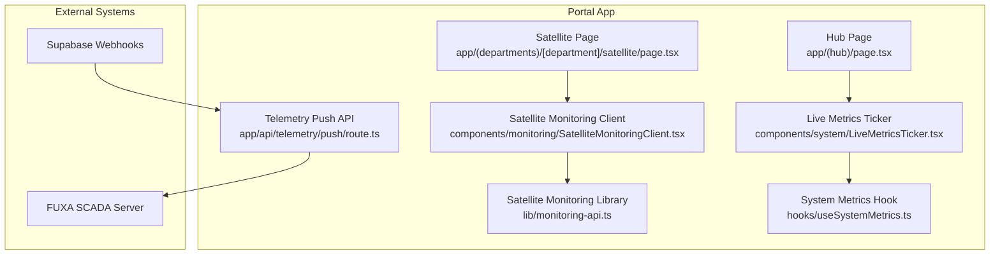
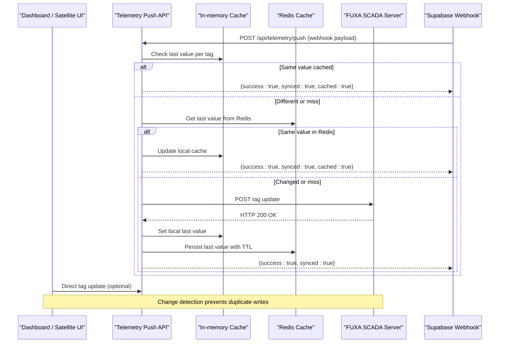
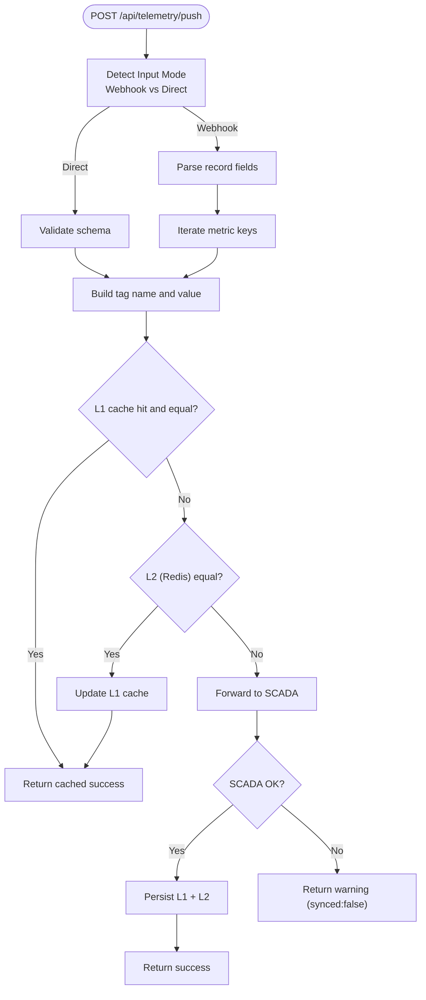
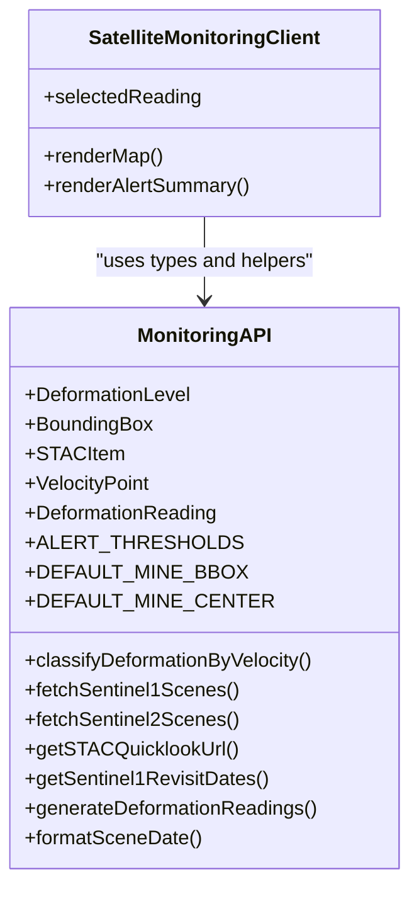
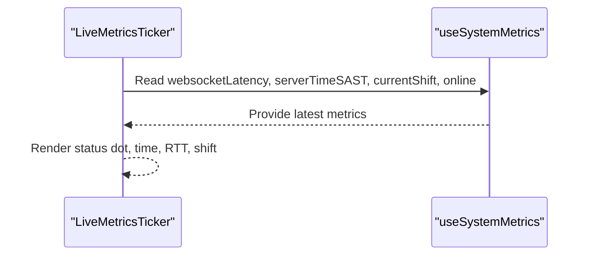
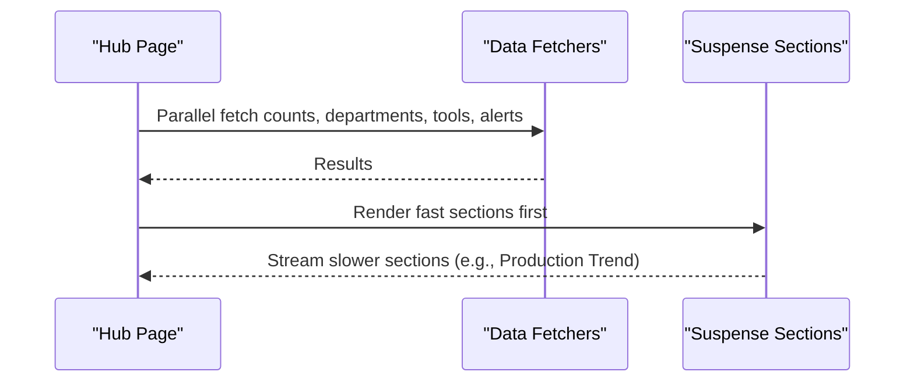
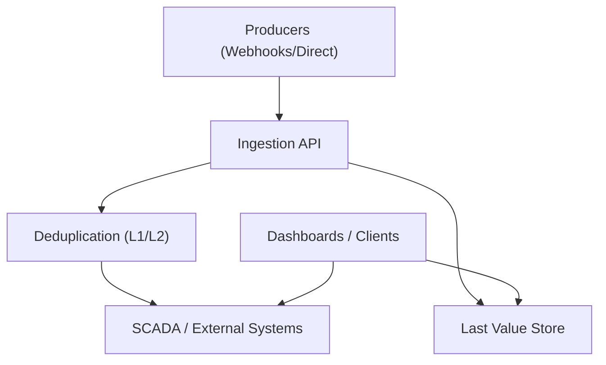
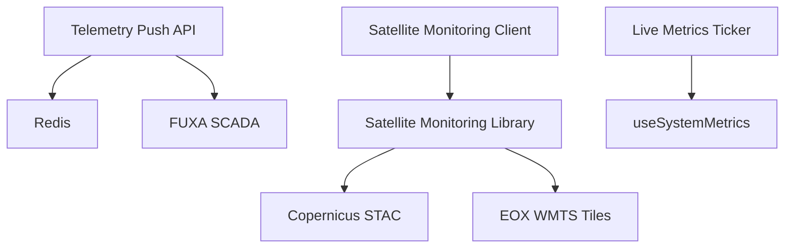

# Real-time & Live Data

<cite>
**Referenced Files in This Document**
- [monitoring-api.ts](file://apps/portal/lib/monitoring-api.ts)
- [SatelliteMonitoringClient.tsx](file://apps/portal/components/monitoring/SatelliteMonitoringClient.tsx)
- [LiveMetricsTicker.tsx](file://apps/portal/components/system/LiveMetricsTicker.tsx)
- [route.ts](file://apps/portal/app/api/telemetry/push/route.ts)
- [useSystemMetrics.ts](file://apps/portal/hooks/useSystemMetrics.ts)
- [page.tsx (satellite)](file://apps/portal/app/(departments)/[department]/satellite/page.tsx)
- [page.tsx (hub)](file://apps/portal/app/(hub)/page.tsx)
- [data.ts](file://apps/overview/lib/data.ts)
</cite>

## Table of Contents

1. [Introduction](#introduction)
2. [Project Structure](#project-structure)
3. [Core Components](#core-components)
4. [Architecture Overview](#architecture-overview)
5. [Detailed Component Analysis](#detailed-component-analysis)
6. [Dependency Analysis](#dependency-analysis)
7. [Performance Considerations](#performance-considerations)
8. [Troubleshooting Guide](#troubleshooting-guide)
9. [Conclusion](#conclusion)
10. [Appendices](#appendices)

## Introduction

This document explains the real-time data streaming and live monitoring capabilities implemented in the portal application. It covers:

- Telemetry ingestion pipeline for high-frequency operational metrics
- Satellite monitoring data streams and visualization
- Operational status synchronization and live dashboards
- Client-side state management patterns for real-time updates
- Connection management, error handling, reconnection strategies, and performance optimization
- Guidance for adding new real-time features and integrating external data sources

The system combines serverless API routes for ingestion, caching layers to reduce redundant writes, and client components that render live telemetry and satellite deformation insights.

## Project Structure

Real-time and live monitoring features are primarily located under apps/portal:

- Ingestion endpoint: app/api/telemetry/push/route.ts
- Satellite monitoring library and client: lib/monitoring-api.ts and components/monitoring/SatelliteMonitoringClient.tsx
- Live metrics ticker: components/system/LiveMetricsTicker.tsx
- System metrics hook: hooks/useSystemMetrics.ts
- Department pages consuming live data: app/(departments)/[department]/satellite/page.tsx
- Hub page with live sections: app/(hub)/page.tsx
- Overview mapping of Control Room routes: apps/overview/lib/data.ts

**Diagram sources**

- [route.ts:1-215](file://apps/portal/app/api/telemetry/push/route.ts#L1-L215)
- [monitoring-api.ts:1-398](file://apps/portal/lib/monitoring-api.ts#L1-L398)
- [SatelliteMonitoringClient.tsx:1-83](file://apps/portal/components/monitoring/SatelliteMonitoringClient.tsx#L1-L83)
- [LiveMetricsTicker.tsx:1-56](file://apps/portal/components/system/LiveMetricsTicker.tsx#L1-L56)
- [useSystemMetrics.ts:1-200](file://apps/portal/hooks/useSystemMetrics.ts#L1-L200)
- [page.tsx (satellite)](<file://apps/portal/app/(departments)/[department]/satellite/page.tsx#L1-L65>)
- [page.tsx (hub)](<file://apps/portal/app/(hub)/page.tsx#L351-L380>)

**Section sources**

- [route.ts:1-215](file://apps/portal/app/api/telemetry/push/route.ts#L1-L215)
- [monitoring-api.ts:1-398](file://apps/portal/lib/monitoring-api.ts#L1-L398)
- [SatelliteMonitoringClient.tsx:1-83](file://apps/portal/components/monitoring/SatelliteMonitoringClient.tsx#L1-L83)
- [LiveMetricsTicker.tsx:1-56](file://apps/portal/components/system/LiveMetricsTicker.tsx#L1-L56)
- [useSystemMetrics.ts:1-200](file://apps/portal/hooks/useSystemMetrics.ts#L1-L200)
- [page.tsx (satellite)](<file://apps/portal/app/(departments)/[department]/satellite/page.tsx#L1-L65>)
- [page.tsx (hub)](<file://apps/portal/app/(hub)/page.tsx#L351-L380>)
- [data.ts:153-209](file://apps/overview/lib/data.ts#L153-L209)

## Core Components

- Telemetry Push API: Accepts direct tag updates or Supabase webhook payloads, applies change detection via L1 (in-memory) and L2 (Redis) caches, and forwards only changed values to the FUXA SCADA server.
- Satellite Monitoring Library: Provides STAC queries, tile layer configuration, deformation classification, and synthetic reading generation utilities used by the satellite dashboard.
- Satellite Monitoring Client: Renders a map with deformation readings and an alert summary; integrates with the monitoring library.
- Live Metrics Ticker: Displays connection health, server time, WebSocket latency, and current shift using the system metrics hook.
- System Metrics Hook: Supplies real-time metrics such as WebSocket latency and online status consumed by UI components.

Key responsibilities:

- Ingestion and change detection: route.ts
- Satellite data and visualization helpers: monitoring-api.ts
- Map and alert rendering: SatelliteMonitoringClient.tsx
- Live status display: LiveMetricsTicker.tsx
- Real-time metrics source: useSystemMetrics.ts

**Section sources**

- [route.ts:1-215](file://apps/portal/app/api/telemetry/push/route.ts#L1-L215)
- [monitoring-api.ts:1-398](file://apps/portal/lib/monitoring-api.ts#L1-L398)
- [SatelliteMonitoringClient.tsx:1-83](file://apps/portal/components/monitoring/SatelliteMonitoringClient.tsx#L1-L83)
- [LiveMetricsTicker.tsx:1-56](file://apps/portal/components/system/LiveMetricsTicker.tsx#L1-L56)
- [useSystemMetrics.ts:1-200](file://apps/portal/hooks/useSystemMetrics.ts#L1-L200)

## Architecture Overview

The real-time architecture centers on a push-based ingestion API that bridges database webhooks and direct tag updates into the SCADA system, while the frontend renders live dashboards and satellite monitoring views.

**Diagram sources**

- [route.ts:40-215](file://apps/portal/app/api/telemetry/push/route.ts#L40-L215)

## Detailed Component Analysis

### Telemetry Ingestion Pipeline

The ingestion pipeline supports two input modes:

- Supabase Database Webhook: Detects inserts into machine_telemetry, maps fields to tags, and forwards changes to SCADA.
- Direct Tag Update: Validates a minimal schema and forwards a single tag update.

Change detection uses:

- L1: Process-scoped Map keyed by department + tag name
- L2: Redis key per tag with TTL

Only when a value differs from both caches is the SCADA server updated.

**Diagram sources**

- [route.ts:40-215](file://apps/portal/app/api/telemetry/push/route.ts#L40-L215)

**Section sources**

- [route.ts:1-215](file://apps/portal/app/api/telemetry/push/route.ts#L1-L215)

### Satellite Monitoring Data Streams

The satellite monitoring feature provides:

- Deformation reading models and classification thresholds
- STAC scene fetching for Sentinel-1 and Sentinel-2
- Tile layer URLs and metadata for basemaps and overlays
- Synthetic reading generation for demonstration and development

The satellite page composes these utilities to present KPIs and a map view. The client component renders markers and alerts based on deformation levels.

**Diagram sources**

- [monitoring-api.ts:1-398](file://apps/portal/lib/monitoring-api.ts#L1-L398)
- [SatelliteMonitoringClient.tsx:1-83](file://apps/portal/components/monitoring/SatelliteMonitoringClient.tsx#L1-L83)

**Section sources**

- [monitoring-api.ts:1-398](file://apps/portal/lib/monitoring-api.ts#L1-L398)
- [SatelliteMonitoringClient.tsx:1-83](file://apps/portal/components/monitoring/SatelliteMonitoringClient.tsx#L1-L83)
- [page.tsx (satellite)](<file://apps/portal/app/(departments)/[department]/satellite/page.tsx#L1-L65>)

### Live Metrics Ticker and System State

The Live Metrics Ticker displays:

- Online/offline indicator
- Server time
- WebSocket round-trip latency
- Current shift window

It consumes the system metrics hook which provides real-time values.

**Diagram sources**

- [LiveMetricsTicker.tsx:1-56](file://apps/portal/components/system/LiveMetricsTicker.tsx#L1-L56)
- [useSystemMetrics.ts:1-200](file://apps/portal/hooks/useSystemMetrics.ts#L1-L200)

**Section sources**

- [LiveMetricsTicker.tsx:1-56](file://apps/portal/components/system/LiveMetricsTicker.tsx#L1-L56)
- [useSystemMetrics.ts:1-200](file://apps/portal/hooks/useSystemMetrics.ts#L1-L200)

### Hub Dashboard Integration

The hub page includes live sections such as operational ingestion telemetry and alert events. It orchestrates multiple data fetches and Suspense boundaries to stream content progressively.

**Diagram sources**

- [page.tsx (hub)](<file://apps/portal/app/(hub)/page.tsx#L351-L380>)
- [page.tsx (hub)](<file://apps/portal/app/(hub)/page.tsx#L546-L597>)

**Section sources**

- [page.tsx (hub)](<file://apps/portal/app/(hub)/page.tsx#L351-L380>)
- [page.tsx (hub)](<file://apps/portal/app/(hub)/page.tsx#L546-L597>)

### Conceptual Overview

Conceptually, the system follows a publish-subscribe pattern where:

- Producers emit telemetry (database webhooks or direct pushes)
- The ingestion API deduplicates and persists last known values
- Downstream consumers (dashboards, satellite views, tickers) subscribe to updates through their respective mechanisms (HTTP polling, hooks, or future WebSocket channels)

[No sources needed since this diagram shows conceptual workflow, not actual code structure]

## Dependency Analysis

The real-time subsystem depends on:

- Next.js API routes for ingestion
- Redis for distributed last-value storage
- FUXA SCADA server for tag persistence
- React hooks and components for live UI updates
- Satellite data providers (Copernicus STAC, EOX WMTS)

**Diagram sources**

- [route.ts:1-215](file://apps/portal/app/api/telemetry/push/route.ts#L1-L215)
- [monitoring-api.ts:1-398](file://apps/portal/lib/monitoring-api.ts#L1-L398)
- [LiveMetricsTicker.tsx:1-56](file://apps/portal/components/system/LiveMetricsTicker.tsx#L1-L56)
- [useSystemMetrics.ts:1-200](file://apps/portal/hooks/useSystemMetrics.ts#L1-L200)
- [SatelliteMonitoringClient.tsx:1-83](file://apps/portal/components/monitoring/SatelliteMonitoringClient.tsx#L1-L83)

**Section sources**

- [route.ts:1-215](file://apps/portal/app/api/telemetry/push/route.ts#L1-L215)
- [monitoring-api.ts:1-398](file://apps/portal/lib/monitoring-api.ts#L1-L398)
- [LiveMetricsTicker.tsx:1-56](file://apps/portal/components/system/LiveMetricsTicker.tsx#L1-L56)
- [useSystemMetrics.ts:1-200](file://apps/portal/hooks/useSystemMetrics.ts#L1-L200)
- [SatelliteMonitoringClient.tsx:1-83](file://apps/portal/components/monitoring/SatelliteMonitoringClient.tsx#L1-L83)

## Performance Considerations

- Change detection reduces redundant writes to SCADA by comparing against L1 and L2 caches before forwarding updates.
- Redis-backed last-value store ensures cross-process consistency and survives process restarts.
- Module-level in-memory cache accelerates same-process requests but must be replaced with Redis-only logic in serverless/horizontal deployments.
- Satellite imagery tiles use free public endpoints; consider caching responses and respecting provider rate limits.
- For high-frequency updates, prefer batching and debouncing at the client level to avoid overwhelming the ingestion API.

[No sources needed since this section provides general guidance]

## Troubleshooting Guide

Common issues and resolutions:

- Duplicate writes observed: Verify L1/L2 cache keys and ensure scoped keys include department identifiers.
- SCADA unreachable: Inspect warnings returned by the ingestion API and confirm environment variables for SCADA URL and authentication.
- Stale values in clients: Ensure clients refresh or reconnect appropriately; check WebSocket latency and online status indicators.
- High latency spikes: Investigate Redis connectivity and network paths to SCADA; consider increasing timeouts or implementing backoff.

Operational checks:

- Confirm CORS headers applied to API responses.
- Validate request body schemas for direct tag updates.
- Monitor Redis TTL behavior for last-value persistence.

**Section sources**

- [route.ts:1-215](file://apps/portal/app/api/telemetry/push/route.ts#L1-L215)
- [LiveMetricsTicker.tsx:1-56](file://apps/portal/components/system/LiveMetricsTicker.tsx#L1-L56)

## Conclusion

The portal’s real-time and live monitoring stack combines robust ingestion with change detection, efficient caching, and clear client-side presentation. Satellite monitoring integrates open geospatial services to provide actionable deformation insights. While WebSocket broadcasting is referenced conceptually, the current implementation emphasizes reliable HTTP-based ingestion and client-driven updates. Extending the system with true WebSocket channels can further improve latency and scalability for high-frequency telemetry.

[No sources needed since this section summarizes without analyzing specific files]

## Appendices

### Adding New Real-time Features

Steps to integrate a new data source:

- Define a new ingestion path in the telemetry push API if it requires change detection and SCADA sync.
- Add validation schemas and response wrappers consistent with existing patterns.
- Implement client components or hooks to consume the new data, following the Live Metrics Ticker pattern for status and latency.
- For satellite-like features, extend the monitoring library with new tile layers or STAC queries and expose helper functions for classification and history.

Example integration points:

- Ingestion endpoint: [route.ts:1-215](file://apps/portal/app/api/telemetry/push/route.ts#L1-L215)
- Satellite helpers: [monitoring-api.ts:1-398](file://apps/portal/lib/monitoring-api.ts#L1-L398)
- Live UI pattern: [LiveMetricsTicker.tsx:1-56](file://apps/portal/components/system/LiveMetricsTicker.tsx#L1-L56)

### Monitoring API Architecture Summary

- Endpoints: POST /api/telemetry/push
- Inputs:
  - Webhook mode: table = "machine_telemetry", record fields mapped to tags
  - Direct mode: name and value fields validated
- Outputs:
  - Success with synced flag
  - Cached success when no change detected
  - Warning when SCADA unreachable

**Section sources**

- [route.ts:40-215](file://apps/portal/app/api/telemetry/push/route.ts#L40-L215)

### Data Models and Types

Key types used across satellite monitoring:

- DeformationLevel: stable | minor | moderate | critical
- BoundingBox: west, south, east, north
- STACItem: id, geometry, properties, assets, links, bbox
- VelocityPoint: month, velocityMmPerMonth
- DeformationReading: id, location, lat, lon, shiftMm, velocityMmPerMonth, trend, level, lastUpdated, sensor, area, history, losAngleDeg

**Section sources**

- [monitoring-api.ts:14-80](file://apps/portal/lib/monitoring-api.ts#L14-L80)

### Control Room Routes Reference

Control Room routes overview for context:

- Dashboard, Daily Log, Machines, History, Reports, Tools

**Section sources**

- [data.ts:153-209](file://apps/overview/lib/data.ts#L153-L209)
