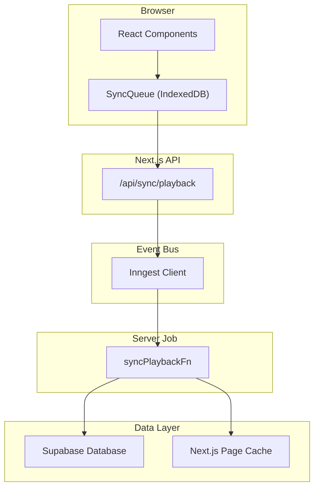
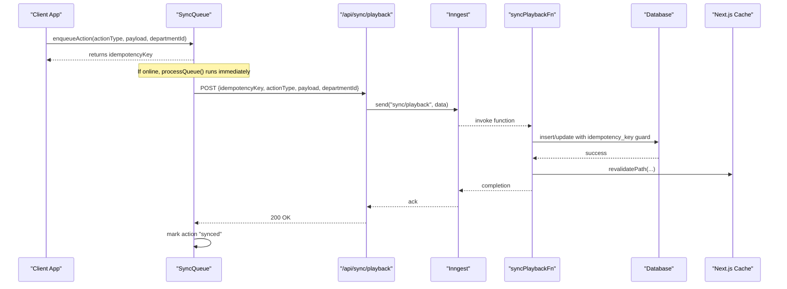
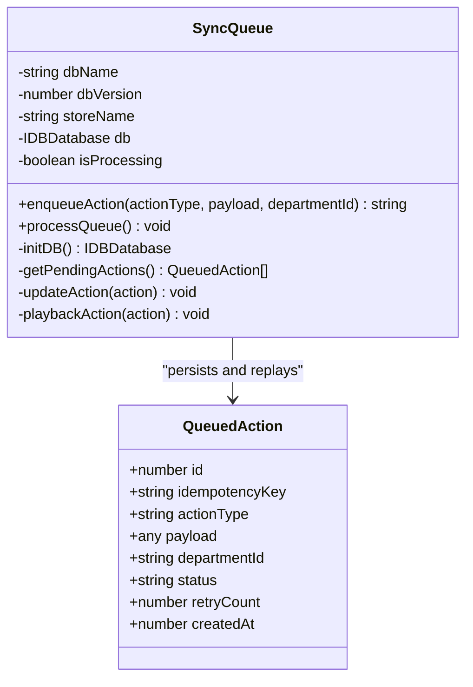
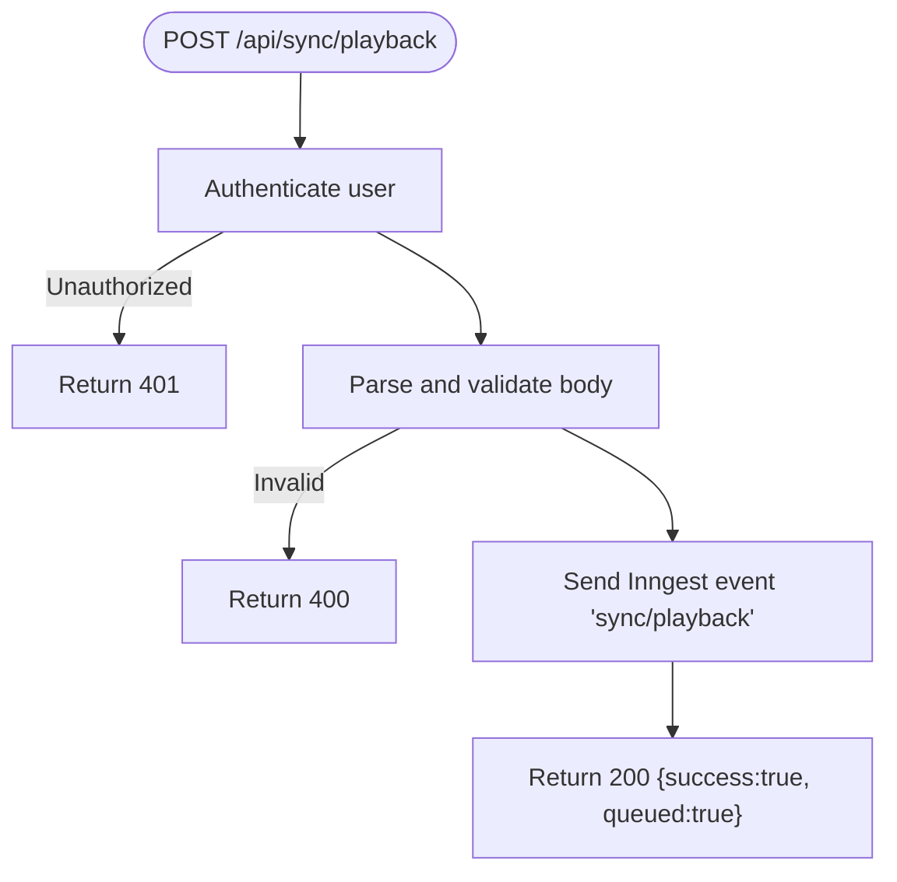
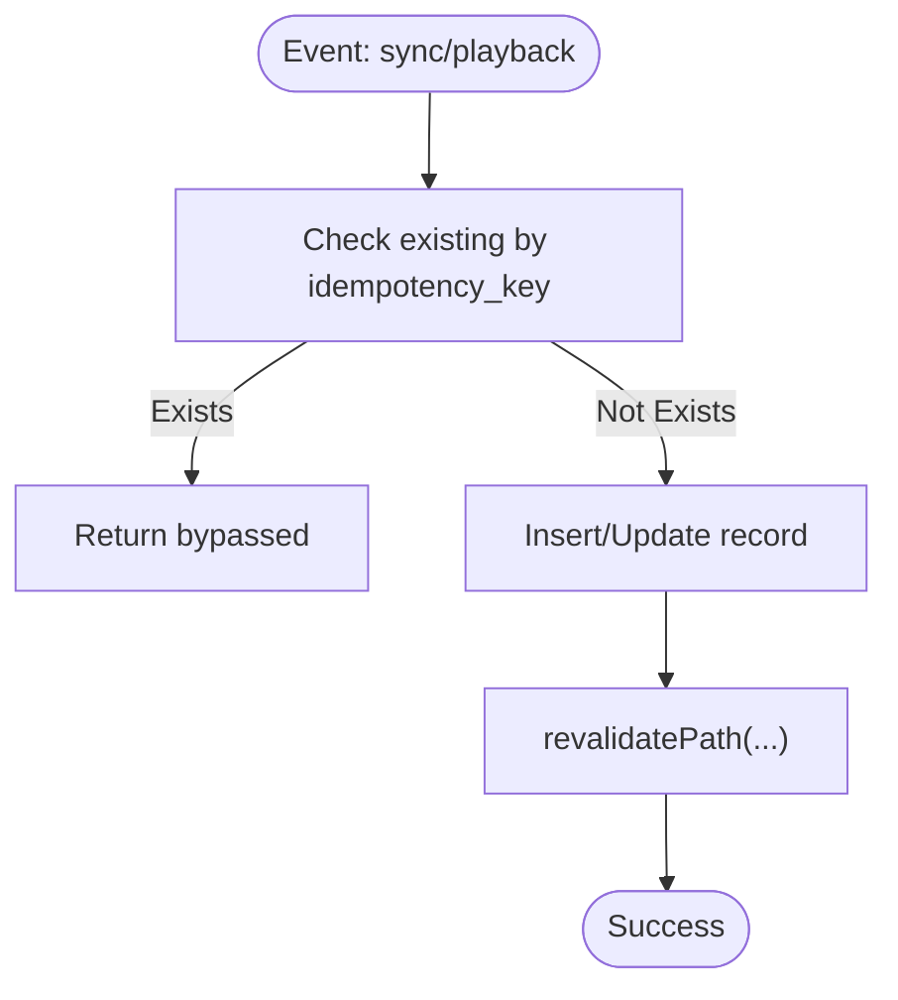
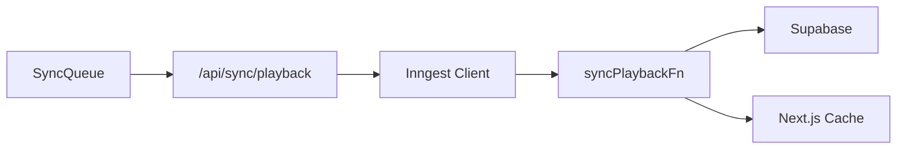

# Real-time State Synchronization

<cite>
**Referenced Files in This Document**
- [sync-queue.ts](file://apps/portal/lib/sync/sync-queue.ts)
- [route.ts](file://apps/portal/app/api/sync/playback/route.ts)
- [inngest.ts](file://packages/utils/src/inngest.ts)
- [sync-playback.ts](file://apps/portal/lib/jobs/sync-playback.ts)
- [useThrottledState.ts](file://apps/portal/hooks/useThrottledState.ts)
- [how-to-fetch-data.md](file://wiki/queries/how-to-fetch-data.md)
</cite>

## Table of Contents

1. [Introduction](#introduction)
2. [Project Structure](#project-structure)
3. [Core Components](#core-components)
4. [Architecture Overview](#architecture-overview)
5. [Detailed Component Analysis](#detailed-component-analysis)
6. [Dependency Analysis](#dependency-analysis)
7. [Performance Considerations](#performance-considerations)
8. [Troubleshooting Guide](#troubleshooting-guide)
9. [Conclusion](#conclusion)

## Introduction

This document explains the real-time state synchronization system that maintains consistency across distributed clients. It covers:

- State management architecture and optimistic updates pattern
- Client-server synchronization protocol, versioning via idempotency keys, and delta-style updates
- Offline support with persistent queue and replay engine
- Conflict resolution strategies and server-side idempotent writes
- Performance considerations for large payloads, selective updates, and memory optimization
- Guidance for implementing custom synchronizers, handling concurrent modifications, and debugging inconsistencies

The system is built around a browser-native outbox queue persisted in IndexedDB, a Next.js API endpoint to accept queued mutations, an Inngest event bus, and server-side job handlers that apply changes idempotently to the database and trigger UI revalidation.

## Project Structure

The synchronization subsystem spans client, API, and background jobs:

- Client: SyncQueue persists actions locally and replays them when online
- API: /api/sync/playback validates and enqueues events
- Jobs: syncPlaybackFn applies mutations to the database and invalidates caches

**Diagram sources**

- [sync-queue.ts:20-36](file://apps/portal/lib/sync/sync-queue.ts#L20-L36)
- [route.ts:13-57](file://apps/portal/app/api/sync/playback/route.ts#L13-L57)
- [inngest.ts:1-14](file://packages/utils/src/inngest.ts#L1-L14)
- [sync-playback.ts:8-122](file://apps/portal/lib/jobs/sync-playback.ts#L8-L122)

**Section sources**

- [sync-queue.ts:20-36](file://apps/portal/lib/sync/sync-queue.ts#L20-L36)
- [route.ts:13-57](file://apps/portal/app/api/sync/playback/route.ts#L13-L57)
- [inngest.ts:1-14](file://packages/utils/src/inngest.ts#L1-L14)
- [sync-playback.ts:8-122](file://apps/portal/lib/jobs/sync-playback.ts#L8-L122)

## Core Components

- SyncQueue: Browser-side outbox using IndexedDB; enqueues actions, tracks status and retry counts, and replays on network availability
- /api/sync/playback: Server route that authenticates requests, validates payloads, and publishes events to Inngest
- Inngest client: Shared client configuration and event name constants
- syncPlaybackFn: Server-side function that applies mutations idempotently and triggers cache revalidation

Key responsibilities:

- Persistence and ordering of pending mutations
- Idempotency enforcement at both client and server layers
- Reliable delivery through retries and backoff
- Immediate UI feedback via optimistic updates and cache invalidation

**Section sources**

- [sync-queue.ts:76-117](file://apps/portal/lib/sync/sync-queue.ts#L76-L117)
- [route.ts:13-57](file://apps/portal/app/api/sync/playback/route.ts#L13-L57)
- [inngest.ts:1-14](file://packages/utils/src/inngest.ts#L1-L14)
- [sync-playback.ts:8-122](file://apps/portal/lib/jobs/sync-playback.ts#L8-L122)

## Architecture Overview

End-to-end flow from mutation to persistence and UI refresh:

**Diagram sources**

- [sync-queue.ts:160-199](file://apps/portal/lib/sync/sync-queue.ts#L160-L199)
- [route.ts:13-57](file://apps/portal/app/api/sync/playback/route.ts#L13-L57)
- [inngest.ts:1-14](file://packages/utils/src/inngest.ts#L1-L14)
- [sync-playback.ts:8-122](file://apps/portal/lib/jobs/sync-playback.ts#L8-L122)

## Detailed Component Analysis

### SyncQueue (Client Outbox and Replay Engine)

Responsibilities:

- Initialize IndexedDB and create object store with indexes for status and idempotency key
- Enqueue actions with unique idempotency keys and metadata
- Process pending actions when online, sending each to the playback API
- Update action status to synced or failed after attempts, with retry counting

Design highlights:

- Singleton instance ensures app-wide coordination
- Automatic replay on window "online" event
- Defensive checks for database initialization and network state

**Diagram sources**

- [sync-queue.ts:20-36](file://apps/portal/lib/sync/sync-queue.ts#L20-L36)
- [sync-queue.ts:76-117](file://apps/portal/lib/sync/sync-queue.ts#L76-L117)
- [sync-queue.ts:160-199](file://apps/portal/lib/sync/sync-queue.ts#L160-L199)

**Section sources**

- [sync-queue.ts:41-71](file://apps/portal/lib/sync/sync-queue.ts#L41-L71)
- [sync-queue.ts:76-117](file://apps/portal/lib/sync/sync-queue.ts#L76-L117)
- [sync-queue.ts:160-199](file://apps/portal/lib/sync/sync-queue.ts#L160-L199)

### Playback API (/api/sync/playback)

Responsibilities:

- Authenticate user via Supabase
- Validate request body against schema
- Publish event to Inngest with idempotency key and action details
- Return immediate acknowledgment to client

Security and reliability:

- Rate limiting and body size limits applied
- CORS configured for cross-origin safety
- Structured error logging for observability

**Diagram sources**

- [route.ts:13-57](file://apps/portal/app/api/sync/playback/route.ts#L13-L57)

**Section sources**

- [route.ts:13-57](file://apps/portal/app/api/sync/playback/route.ts#L13-L57)

### Inngest Event Bus

Shared client configuration and event names used by both client-facing routes and server-side functions.

**Section sources**

- [inngest.ts:1-14](file://packages/utils/src/inngest.ts#L1-L14)

### Server Job Handler (syncPlaybackFn)

Responsibilities:

- Consume "sync/playback" events
- Apply mutations idempotently using idempotency_key columns
- Trigger Next.js page cache revalidation for affected routes
- Record execution metrics and log errors

Supported actions include creating and resolving breakdowns, adding safety incidents, and daily logs. Each write includes idempotency guards to prevent duplicates.

**Diagram sources**

- [sync-playback.ts:8-122](file://apps/portal/lib/jobs/sync-playback.ts#L8-L122)

**Section sources**

- [sync-playback.ts:16-41](file://apps/portal/lib/jobs/sync-playback.ts#L16-L41)
- [sync-playback.ts:43-57](file://apps/portal/lib/jobs/sync-playback.ts#L43-L57)
- [sync-playback.ts:59-83](file://apps/portal/lib/jobs/sync-playback.ts#L59-L83)
- [sync-playback.ts:85-106](file://apps/portal/lib/jobs/sync-playback.ts#L85-L106)

### Optimistic Updates Pattern

Recommended approach:

- Immediately update local UI state upon user action
- Enqueue the corresponding action into SyncQueue
- On successful playback, keep UI consistent; on failure, revert or prompt user
- Use throttling hooks to reduce render churn during rapid updates

Optimization hook:

- useThrottledState batches frequent updates to minimize renders while preserving functional transitions

**Section sources**

- [useThrottledState.ts:11-66](file://apps/portal/hooks/useThrottledState.ts#L11-L66)

### Real-time Data Flow (Read Path)

For live dashboards and collaborative features, subscribe to database changes via Supabase channels and merge deltas into local state.

**Section sources**

- [how-to-fetch-data.md:144-199](file://wiki/queries/how-to-fetch-data.md#L144-L199)

## Dependency Analysis

High-level dependencies between components:

**Diagram sources**

- [sync-queue.ts:200-224](file://apps/portal/lib/sync/sync-queue.ts#L200-L224)
- [route.ts:13-57](file://apps/portal/app/api/sync/playback/route.ts#L13-L57)
- [inngest.ts:1-14](file://packages/utils/src/inngest.ts#L1-L14)
- [sync-playback.ts:8-122](file://apps/portal/lib/jobs/sync-playback.ts#L8-L122)

**Section sources**

- [sync-queue.ts:200-224](file://apps/portal/lib/sync/sync-queue.ts#L200-L224)
- [route.ts:13-57](file://apps/portal/app/api/sync/playback/route.ts#L13-L57)
- [inngest.ts:1-14](file://packages/utils/src/inngest.ts#L1-L14)
- [sync-playback.ts:8-122](file://apps/portal/lib/jobs/sync-playback.ts#L8-L122)

## Performance Considerations

- Payload sizing: The playback API enforces a body size limit to protect resources
- Throttling UI updates: Use throttled state hooks to avoid excessive renders
- Selective updates: Prefer targeted mutations and targeted revalidation paths
- Memory optimization: Keep queued payloads minimal; consider compressing large JSON where feasible
- Batch operations: Group related mutations to reduce round trips and contention
- Backoff strategy: Implement exponential backoff for retries beyond current fixed thresholds

[No sources needed since this section provides general guidance]

## Troubleshooting Guide

Common issues and diagnostics:

- Network interruptions: Verify SyncQueue.processQueue runs on "online" events and check IndexedDB entries for pending actions
- Duplicate writes: Confirm idempotency_key uniqueness and server-side checks
- Failed retries: Inspect retryCount and status fields; actions may be marked "failed" after exceeding max retries
- Unauthorized requests: Ensure authentication succeeds before playback
- Validation errors: Review request schema validation and required fields
- Observability: Check structured error logs for context and idempotency keys

**Section sources**

- [sync-queue.ts:160-199](file://apps/portal/lib/sync/sync-queue.ts#L160-L199)
- [route.ts:13-57](file://apps/portal/app/api/sync/playback/route.ts#L13-L57)
- [sync-playback.ts:109-122](file://apps/portal/lib/jobs/sync-playback.ts#L109-L122)

## Conclusion

The synchronization system combines a resilient client outbox, robust server-side validation, and idempotent job processing to deliver reliable real-time state consistency. With optimistic UI updates, throttled rendering, and targeted cache revalidation, it balances responsiveness and correctness. Extending the system with additional action types follows the established patterns and preserves strong guarantees around duplication and recovery.
