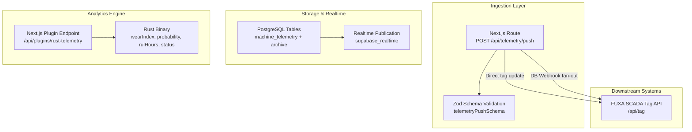
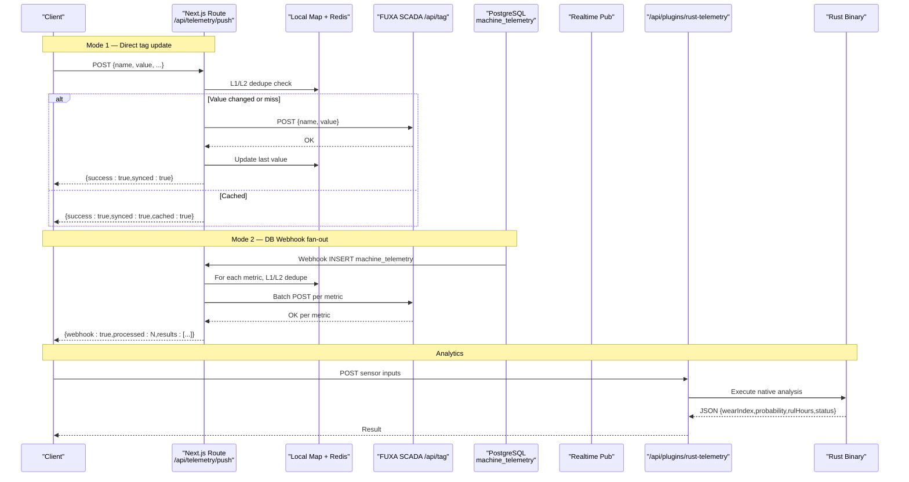
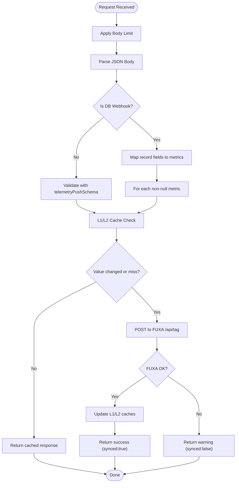
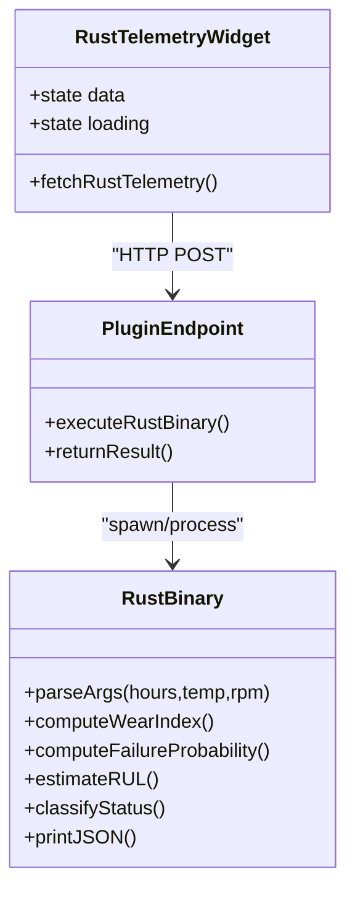
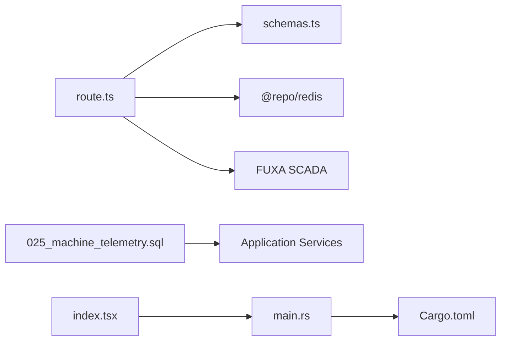

# Telemetry Data Ingestion Pipeline

<cite>
**Referenced Files in This Document**
- [route.ts](file://apps/portal/app/api/telemetry/push/route.ts)
- [schemas.ts](file://apps/portal/lib/api/schemas.ts)
- [025_machine_telemetry.sql](file://packages/database/migrations/025_machine_telemetry.sql)
- [main.rs](file://apps/portal/plugins/rust-telemetry-engine/src/main.rs)
- [index.tsx](file://apps/portal/plugins/rust-telemetry-engine/index.tsx)
- [Cargo.toml](file://apps/portal/plugins/rust-telemetry-engine/Cargo.toml)
</cite>

## Table of Contents

1. [Introduction](#introduction)
2. [Project Structure](#project-structure)
3. [Core Components](#core-components)
4. [Architecture Overview](#architecture-overview)
5. [Detailed Component Analysis](#detailed-component-analysis)
6. [Dependency Analysis](#dependency-analysis)
7. [Performance Considerations](#performance-considerations)
8. [Troubleshooting Guide](#troubleshooting-guide)
9. [Conclusion](#conclusion)
10. [Appendices](#appendices)

## Introduction

This document describes the telemetry data ingestion pipeline that processes real-time operational data from multiple sources, validates and transforms it, and persists or forwards it to downstream systems. It covers:

- Ingestion architecture and entry points
- Validation pipelines and transformation logic
- Storage strategies and archival
- Rust telemetry engine integration for high-performance analytics
- Error handling, retry/backoff considerations, and monitoring guidance
- Practical examples for adding new sources, configuring processing rules, and optimizing throughput at scale

## Project Structure

The telemetry ingestion pipeline spans three primary areas:

- API ingestion layer (Next.js route) accepting direct tag updates and database webhook payloads
- Database schema and archival functions for time-series storage and monthly rollups
- Rust-based analytics engine invoked via a Next.js plugin endpoint for stress-fatigue modeling and remaining useful life estimation

**Diagram sources**

- [route.ts:1-215](file://apps/portal/app/api/telemetry/push/route.ts#L1-L215)
- [schemas.ts:88-95](file://apps/portal/lib/api/schemas.ts#L88-L95)
- [025_machine_telemetry.sql:1-313](file://packages/database/migrations/025_machine_telemetry.sql#L1-L313)
- [main.rs:1-69](file://apps/portal/plugins/rust-telemetry-engine/src/main.rs#L1-L69)
- [index.tsx:1-192](file://apps/portal/plugins/rust-telemetry-engine/index.tsx#L1-L192)

**Section sources**

- [route.ts:1-215](file://apps/portal/app/api/telemetry/push/route.ts#L1-L215)
- [schemas.ts:88-95](file://apps/portal/lib/api/schemas.ts#L88-L95)
- [025_machine_telemetry.sql:1-313](file://packages/database/migrations/025_machine_telemetry.sql#L1-L313)
- [main.rs:1-69](file://apps/portal/plugins/rust-telemetry-engine/src/main.rs#L1-L69)
- [index.tsx:1-192](file://apps/portal/plugins/rust-telemetry-engine/index.tsx#L1-L192)

## Core Components

- Ingestion API: Accepts two modes:
  - Direct single-tag updates with validated payload
  - Supabase database webhook payloads for machine_telemetry inserts, fanning out to multiple tags
- Validation: Zod schemas enforce field presence, types, and constraints
- Caching and deduplication: Two-level cache (in-process Map and Redis) prevents redundant writes when values are unchanged
- Downstream forwarding: HTTP POST to FUXA SCADA tag API with optional bearer token
- Storage: Time-series table with indexes and RLS policies; monthly archival function aggregates and moves historical data
- Analytics: Rust binary computes wear index, failure probability, remaining useful life, and health classification

**Section sources**

- [route.ts:1-215](file://apps/portal/app/api/telemetry/push/route.ts#L1-L215)
- [schemas.ts:88-95](file://apps/portal/lib/api/schemas.ts#L88-L95)
- [025_machine_telemetry.sql:1-313](file://packages/database/migrations/025_machine_telemetry.sql#L1-L313)
- [main.rs:1-69](file://apps/portal/plugins/rust-telemetry-engine/src/main.rs#L1-L69)
- [index.tsx:1-192](file://apps/portal/plugins/rust-telemetry-engine/index.tsx#L1-L192)

## Architecture Overview

End-to-end flows for both ingestion modes and analytics:

**Diagram sources**

- [route.ts:1-215](file://apps/portal/app/api/telemetry/push/route.ts#L1-L215)
- [025_machine_telemetry.sql:1-313](file://packages/database/migrations/025_machine_telemetry.sql#L1-L313)
- [index.tsx:1-192](file://apps/portal/plugins/rust-telemetry-engine/index.tsx#L1-L192)
- [main.rs:1-69](file://apps/portal/plugins/rust-telemetry-engine/src/main.rs#L1-L69)

## Detailed Component Analysis

### Ingestion API: POST /api/telemetry/push

Responsibilities:

- Enforce body size limits and CORS
- Parse request body and detect mode (direct vs webhook)
- Validate payloads using shared schemas
- Deduplicate using L1 (process-local Map) and L2 (Redis) caches
- Forward changes to FUXA SCADA tag API
- Return structured responses indicating success, warnings, and caching behavior

Key behaviors:

- Webhook path: Detects Supabase insert on machine_telemetry, maps record fields to tags, iterates metrics, applies deduplication, and posts only changed values
- Direct path: Validates against telemetryPushSchema, performs deduplication, posts change if needed, updates caches

Error handling:

- Non-OK FUXA responses return a warning with status code while still responding 200 to avoid client retries
- Network failures return a warning indicating unreachable SCADA server
- Unexpected errors return 500 with error message

**Diagram sources**

- [route.ts:1-215](file://apps/portal/app/api/telemetry/push/route.ts#L1-L215)
- [schemas.ts:88-95](file://apps/portal/lib/api/schemas.ts#L88-L95)

**Section sources**

- [route.ts:1-215](file://apps/portal/app/api/telemetry/push/route.ts#L1-L215)
- [schemas.ts:88-95](file://apps/portal/lib/api/schemas.ts#L88-L95)

### Validation Schemas

- telemetryPushSchema enforces required name/value, optional timestamp, identifiers, and flexible tags
- Used by validateBody() to ensure consistent input contracts across endpoints

Best practices:

- Keep schemas aligned with downstream consumers (FUXA tags and DB columns)
- Add explicit type guards and length constraints to prevent oversized payloads

**Section sources**

- [schemas.ts:88-95](file://apps/portal/lib/api/schemas.ts#L88-L95)

### Database Schema and Archival

- Active table machine_telemetry stores current month records with indexes and RLS policies
- Archive table machine_telemetry_archive holds aggregated summaries per machine per month
- Functions:
  - archive_telemetry_month: Aggregates previous month’s data into archive and deletes from active
  - get_telemetry_summary: Provides hourly/daily aggregations for dashboards
- Realtime publication includes machine_telemetry for live updates

Operational notes:

- Unique constraint on (machine_id, recorded_at) ensures idempotent inserts
- Indexes optimize queries by machine/date, year_month, and department
- Row-level security restricts access by department and role

**Section sources**

- [025_machine_telemetry.sql:1-313](file://packages/database/migrations/025_machine_telemetry.sql#L1-L313)

### Rust Telemetry Engine Integration

Purpose:

- Compute wear index, failure probability, remaining useful life (RUL), and health classification based on hours, temperature, and RPM
- Output pure JSON to stdout for consumption by Node bridge

Integration:

- React widget calls Next.js plugin endpoint (/api/plugins/rust-telemetry)
- The endpoint executes the Rust binary and returns results to the UI
- Cargo profile is tuned for release performance (opt-level=3, LTO, single codegen unit, abort on panic)

**Diagram sources**

- [index.tsx:1-192](file://apps/portal/plugins/rust-telemetry-engine/index.tsx#L1-L192)
- [main.rs:1-69](file://apps/portal/plugins/rust-telemetry-engine/src/main.rs#L1-L69)
- [Cargo.toml:1-15](file://apps/portal/plugins/rust-telemetry-engine/Cargo.toml#L1-L15)

**Section sources**

- [main.rs:1-69](file://apps/portal/plugins/rust-telemetry-engine/src/main.rs#L1-L69)
- [index.tsx:1-192](file://apps/portal/plugins/rust-telemetry-engine/index.tsx#L1-L192)
- [Cargo.toml:1-15](file://apps/portal/plugins/rust-telemetry-engine/Cargo.toml#L1-L15)

## Dependency Analysis

High-level dependencies:

- Ingestion API depends on:
  - Zod schemas for validation
  - Redis client for distributed cache
  - External FUXA SCADA service
- Database schema defines tables, indexes, policies, and functions used by application services
- Rust engine is isolated and invoked by the plugin endpoint

**Diagram sources**

- [route.ts:1-215](file://apps/portal/app/api/telemetry/push/route.ts#L1-L215)
- [schemas.ts:88-95](file://apps/portal/lib/api/schemas.ts#L88-L95)
- [025_machine_telemetry.sql:1-313](file://packages/database/migrations/025_machine_telemetry.sql#L1-L313)
- [index.tsx:1-192](file://apps/portal/plugins/rust-telemetry-engine/index.tsx#L1-L192)
- [main.rs:1-69](file://apps/portal/plugins/rust-telemetry-engine/src/main.rs#L1-L69)
- [Cargo.toml:1-15](file://apps/portal/plugins/rust-telemetry-engine/Cargo.toml#L1-L15)

**Section sources**

- [route.ts:1-215](file://apps/portal/app/api/telemetry/push/route.ts#L1-L215)
- [schemas.ts:88-95](file://apps/portal/lib/api/schemas.ts#L88-L95)
- [025_machine_telemetry.sql:1-313](file://packages/database/migrations/025_machine_telemetry.sql#L1-L313)
- [index.tsx:1-192](file://apps/portal/plugins/rust-telemetry-engine/index.tsx#L1-L192)
- [main.rs:1-69](file://apps/portal/plugins/rust-telemetry-engine/src/main.rs#L1-L69)
- [Cargo.toml:1-15](file://apps/portal/plugins/rust-telemetry-engine/Cargo.toml#L1-L15)

## Performance Considerations

- Deduplication reduces network and write overhead:
  - L1 cache avoids repeated work within a process
  - L2 cache (Redis) extends deduplication across processes and deployments
- Batch fan-out for webhooks minimizes round-trips by iterating metrics efficiently
- Database design:
  - Indexes on machine_id+recorded_at, year_month, and department_id support common queries
  - Monthly archival keeps active table lean
- Rust engine:
  - Release profile optimizations reduce CPU usage and latency
  - Pure JSON output simplifies interop and parsing overhead

Recommendations:

- Monitor cache hit rates and adjust TTLs based on telemetry volatility
- Use connection pooling for Redis and FUXA clients
- Consider backpressure and rate limiting at the ingress layer for large-scale volumes

[No sources needed since this section provides general guidance]

## Troubleshooting Guide

Common issues and resolutions:

- FUXA unreachable:
  - Symptom: Response includes warning about unreachable SCADA server
  - Action: Verify FUXA_URL and network connectivity; check firewall and service availability
- FUXA returns non-OK status:
  - Symptom: Response includes warning with status code and synced=false
  - Action: Inspect FUXA logs; validate tag names and authorization headers
- Duplicate writes:
  - Symptom: High volume but no visible changes
  - Action: Confirm deduplication is working; inspect cache keys and Redis state
- Webhook not processed:
  - Symptom: No fan-out to FUXA after DB insert
  - Action: Ensure webhook payload matches expected structure and table name

Monitoring suggestions:

- Track counts of cached vs forwarded updates
- Log FUXA response codes and latencies
- Observe Redis cache misses and errors
- Measure ingestion throughput (requests/sec) and p95/p99 latencies

**Section sources**

- [route.ts:1-215](file://apps/portal/app/api/telemetry/push/route.ts#L1-L215)

## Conclusion

The telemetry ingestion pipeline combines robust validation, efficient deduplication, and reliable downstream forwarding with strong storage and archival strategies. The Rust analytics engine adds high-performance insights for predictive maintenance. With careful monitoring and tuning, the system can scale to handle large volumes of real-time operational data while maintaining low latency and high reliability.

[No sources needed since this section summarizes without analyzing specific files]

## Appendices

### Adding a New Telemetry Source

Steps:

- Extend the webhook mapper in the ingestion route to include new fields from the database record
- Update the telemetryPushSchema if supporting direct ingestion for the new field
- Ensure downstream FUXA tag naming conventions accommodate the new metric
- Add tests covering the new mapping and edge cases (nulls, invalid types)

**Section sources**

- [route.ts:51-139](file://apps/portal/app/api/telemetry/push/route.ts#L51-L139)
- [schemas.ts:88-95](file://apps/portal/lib/api/schemas.ts#L88-L95)

### Configuring Data Processing Rules

Guidance:

- Define thresholds for deduplication sensitivity (e.g., numeric tolerance) if needed
- Configure environment variables for FUXA URL and optional API key
- Adjust Redis TTL for last-value cache based on data volatility

**Section sources**

- [route.ts:1-215](file://apps/portal/app/api/telemetry/push/route.ts#L1-L215)

### Optimizing Ingestion Performance

- Increase batch sizes where feasible (e.g., aggregate multiple metrics per request)
- Enable compression for upstream transports if applicable
- Scale horizontally with Redis-backed cache and load balancer
- Tune Rust engine parameters (hours, temp, rpm) for realistic workloads and monitor CPU usage

**Section sources**

- [main.rs:1-69](file://apps/portal/plugins/rust-telemetry-engine/src/main.rs#L1-L69)
- [Cargo.toml:1-15](file://apps/portal/plugins/rust-telemetry-engine/Cargo.toml#L1-L15)
