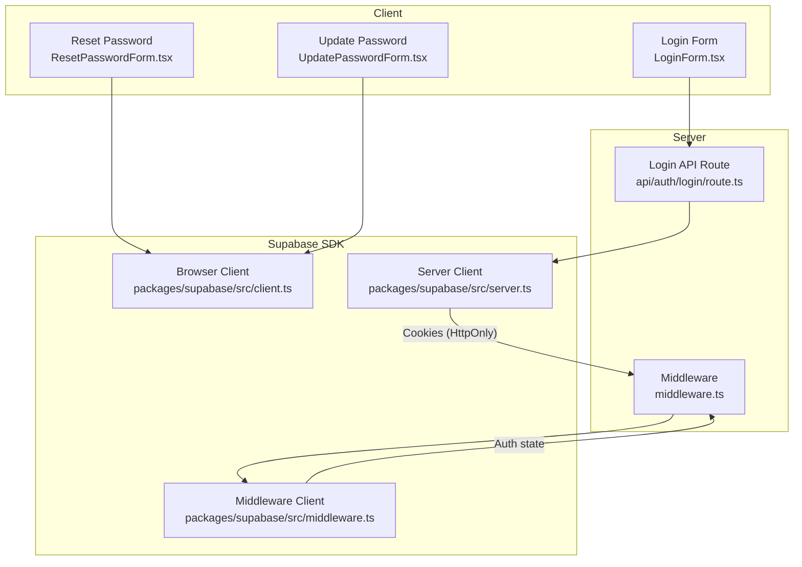
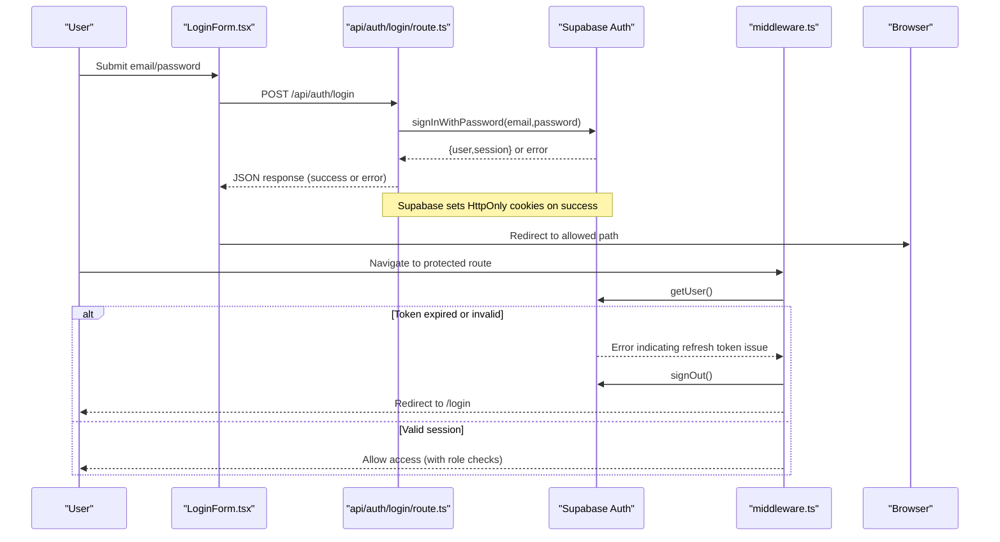
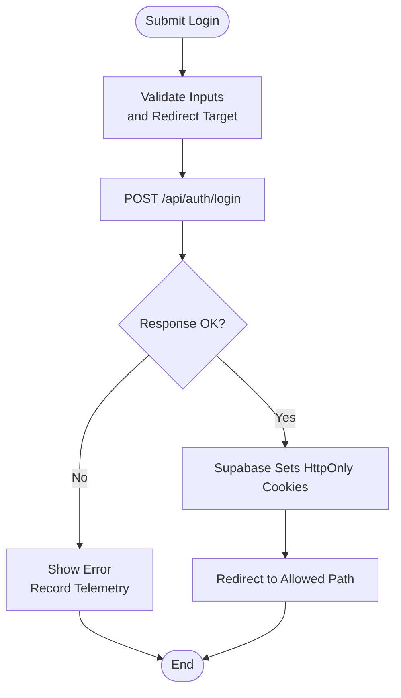
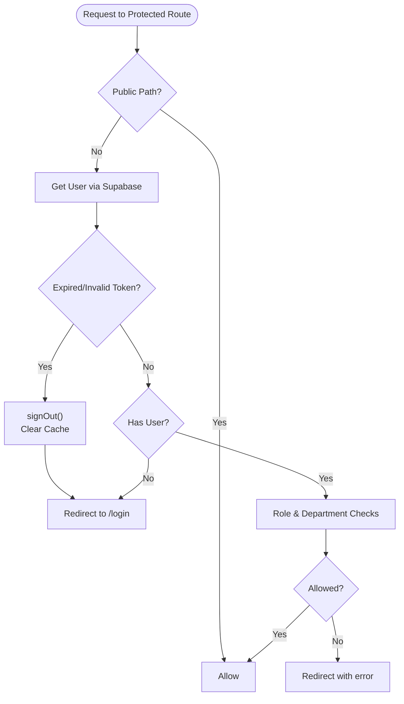
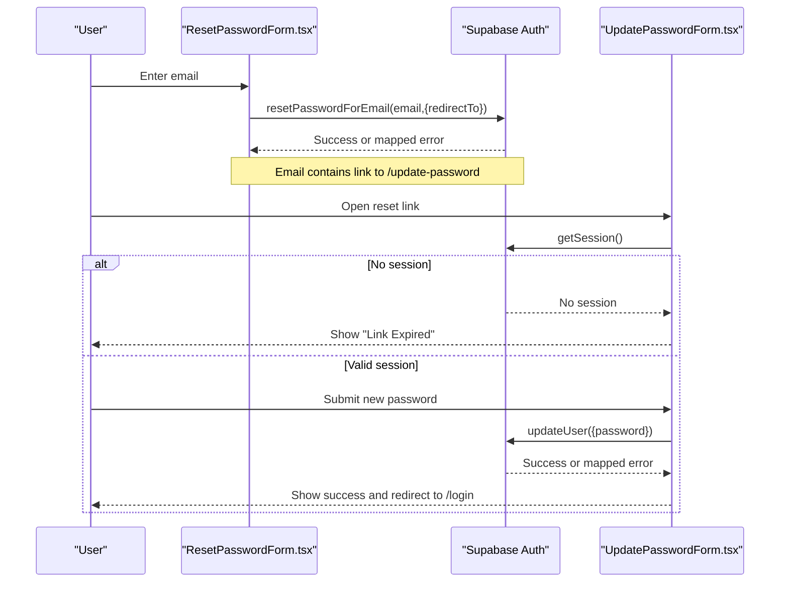
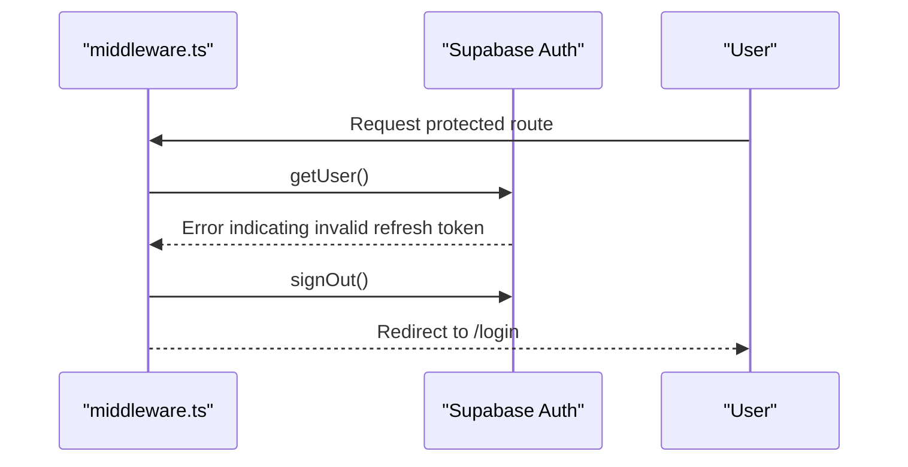
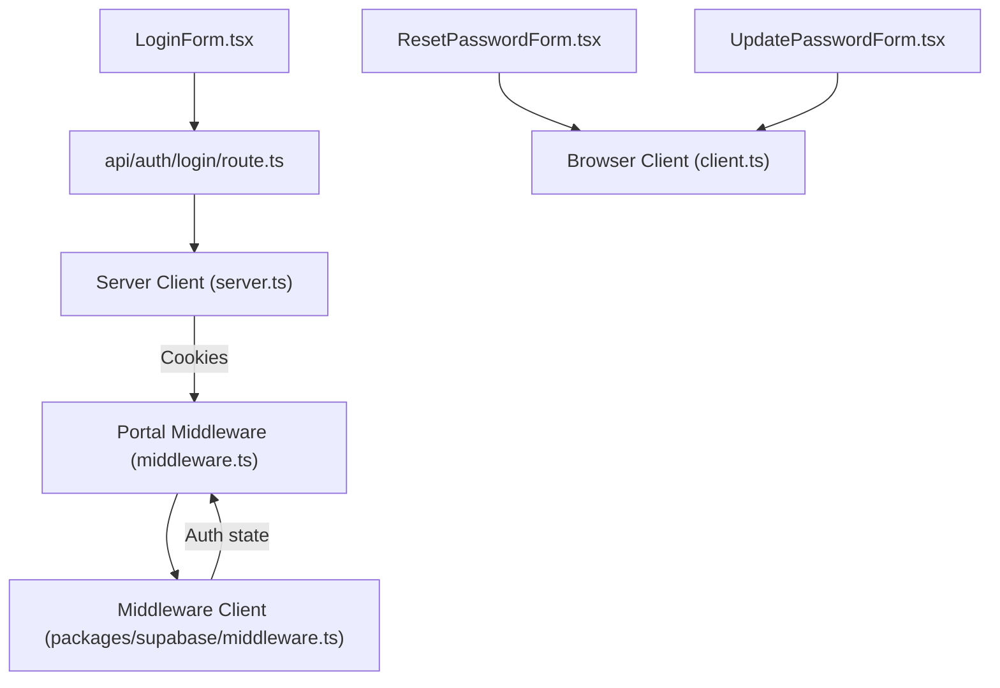

# Authentication Flow

<cite>
**Referenced Files in This Document**
- [middleware.ts](file://apps/portal/middleware.ts)
- [route.ts](file://apps/portal/app/api/auth/login/route.ts)
- [LoginForm.tsx](file://apps/portal/app/(auth)/login/LoginForm.tsx)
- [ResetPasswordForm.tsx](file://apps/portal/app/(auth)/reset-password/ResetPasswordForm.tsx)
- [UpdatePasswordForm.tsx](file://apps/portal/app/(auth)/update-password/UpdatePasswordForm.tsx)
- [client.ts](file://packages/supabase/src/client.ts)
- [server.ts](file://packages/supabase/src/server.ts)
- [middleware.ts](file://packages/supabase/src/middleware.ts)
</cite>

## Table of Contents

1. Introduction
2. Project Structure
3. Core Components
4. Architecture Overview
5. Detailed Component Analysis
6. Dependency Analysis
7. Performance Considerations
8. Troubleshooting Guide
9. Conclusion

## Introduction

This document explains the authentication flow implemented with Supabase Auth across the Next.js application. It covers login, logout, session management, JWT handling, refresh token rotation, automatic sign-out on expiration, password reset and update flows, and security considerations for cookies and CSRF protection. It also provides guidance for extending the system with custom providers and multi-factor authentication.

## Project Structure

Authentication spans three layers:

- Client UI components (login, reset password, update password)
- Server API route for credential-based login
- Middleware for session validation, redirect logic, and role checks
- Shared Supabase client wrappers for browser, server, and middleware contexts

**Diagram sources**

- [LoginForm.tsx](<file://apps/portal/app/(auth)/login/LoginForm.tsx>)
- [ResetPasswordForm.tsx](<file://apps/portal/app/(auth)/reset-password/ResetPasswordForm.tsx>)
- [UpdatePasswordForm.tsx](<file://apps/portal/app/(auth)/update-password/UpdatePasswordForm.tsx>)
- [route.ts](file://apps/portal/app/api/auth/login/route.ts)
- [middleware.ts](file://apps/portal/middleware.ts)
- [client.ts](file://packages/supabase/src/client.ts)
- [server.ts](file://packages/supabase/src/server.ts)
- [middleware.ts](file://packages/supabase/src/middleware.ts)

**Section sources**

- [LoginForm.tsx](<file://apps/portal/app/(auth)/login/LoginForm.tsx>)
- [ResetPasswordForm.tsx](<file://apps/portal/app/(auth)/reset-password/ResetPasswordForm.tsx>)
- [UpdatePasswordForm.tsx](<file://apps/portal/app/(auth)/update-password/UpdatePasswordForm.tsx>)
- [route.ts](file://apps/portal/app/api/auth/login/route.ts)
- [middleware.ts](file://apps/portal/middleware.ts)
- [client.ts](file://packages/supabase/src/client.ts)
- [server.ts](file://packages/supabase/src/server.ts)
- [middleware.ts](file://packages/supabase/src/middleware.ts)

## Core Components

- Login form: Validates inputs, calls the login API, handles success/failure, telemetry, and redirects to an allowed target.
- Login API route: Rate-limited endpoint that authenticates via Supabase and returns session data; sets HttpOnly cookies through Supabase SSR.
- Password reset: Sends a reset email with a redirect to the update-password page.
- Update password: Requires a valid session from the reset link; validates and updates the password.
- Middleware: Protects routes, manages redirects, detects expired tokens, signs out automatically, and enforces department/role access.
- Supabase clients: Browser, server, and middleware clients configured for secure cookie storage and proper request/response lifecycle.

**Section sources**

- [LoginForm.tsx](<file://apps/portal/app/(auth)/login/LoginForm.tsx>)
- [route.ts](file://apps/portal/app/api/auth/login/route.ts)
- [ResetPasswordForm.tsx](<file://apps/portal/app/(auth)/reset-password/ResetPasswordForm.tsx>)
- [UpdatePasswordForm.tsx](<file://apps/portal/app/(auth)/update-password/UpdatePasswordForm.tsx>)
- [middleware.ts](file://apps/portal/middleware.ts)
- [client.ts](file://packages/supabase/src/client.ts)
- [server.ts](file://packages/supabase/src/server.ts)
- [middleware.ts](file://packages/supabase/src/middleware.ts)

## Architecture Overview

The authentication architecture uses Supabase’s cookie-based sessions. The login API authenticates credentials and relies on Supabase to set HttpOnly cookies. The middleware reads these cookies, validates the user, and enforces authorization rules. On invalid or expired tokens, it clears the session and redirects to login.

**Diagram sources**

- [LoginForm.tsx](<file://apps/portal/app/(auth)/login/LoginForm.tsx>)
- [route.ts](file://apps/portal/app/api/auth/login/route.ts)
- [middleware.ts](file://apps/portal/middleware.ts)
- [server.ts](file://packages/supabase/src/server.ts)
- [client.ts](file://packages/supabase/src/client.ts)

## Detailed Component Analysis

### Login Flow

- Client-side validation and UX:
  - Accepts employee ID or email and password.
  - Prevents open redirects by validating the redirect parameter.
  - Displays errors and sends telemetry breadcrumbs.
  - On success, navigates to the validated redirect target and refreshes the app state.
- Server-side login:
  - Enforces rate limiting per IP.
  - Returns generic error messages to avoid account enumeration.
  - Relies on Supabase to set HttpOnly cookies for the session.

**Diagram sources**

- [LoginForm.tsx](<file://apps/portal/app/(auth)/login/LoginForm.tsx>)
- [route.ts](file://apps/portal/app/api/auth/login/route.ts)

**Section sources**

- [LoginForm.tsx](<file://apps/portal/app/(auth)/login/LoginForm.tsx>)
- [route.ts](file://apps/portal/app/api/auth/login/route.ts)

### Session Management and Automatic Sign-Out

- Cookie configuration:
  - Browser client uses Supabase’s default cookie-based storage for better security.
  - Middleware client sets HttpOnly, Secure (in production), and SameSite=Lax cookies.
- Expiration handling:
  - Middleware detects refresh token errors and triggers sign-out.
  - When signing out, it clears cached employee data and redirects to login.
- Protected routes:
  - Unauthenticated requests are redirected to login with a safe redirect parameter.
  - Authorized users are checked against department and role restrictions.

**Diagram sources**

- [middleware.ts](file://apps/portal/middleware.ts)
- [middleware.ts](file://packages/supabase/src/middleware.ts)
- [client.ts](file://packages/supabase/src/client.ts)

**Section sources**

- [middleware.ts](file://apps/portal/middleware.ts)
- [middleware.ts](file://packages/supabase/src/middleware.ts)
- [client.ts](file://packages/supabase/src/client.ts)

### Password Reset and Update Flows

- Reset password:
  - Sends a reset email with a redirect URL pointing to the update-password page.
  - Maps raw errors to friendly messages and handles rate limits.
- Update password:
  - Verifies a valid session exists before allowing updates.
  - Enforces minimum length and confirms passwords match.
  - Updates the password via Supabase and redirects to login after success.

**Diagram sources**

- [ResetPasswordForm.tsx](<file://apps/portal/app/(auth)/reset-password/ResetPasswordForm.tsx>)
- [UpdatePasswordForm.tsx](<file://apps/portal/app/(auth)/update-password/UpdatePasswordForm.tsx>)

**Section sources**

- [ResetPasswordForm.tsx](<file://apps/portal/app/(auth)/reset-password/ResetPasswordForm.tsx>)
- [UpdatePasswordForm.tsx](<file://apps/portal/app/(auth)/update-password/UpdatePasswordForm.tsx>)

### Logout Behavior

- Automatic sign-out:
  - Middleware detects invalid/expired refresh tokens and calls signOut().
  - Clears related cache entries and redirects to login.
- Explicit sign-out:
  - Use Supabase’s signOut method in any context where you need to clear the session.

**Diagram sources**

- [middleware.ts](file://apps/portal/middleware.ts)

**Section sources**

- [middleware.ts](file://apps/portal/middleware.ts)

### Security Considerations

- Token storage:
  - Browser client uses cookie-based storage instead of localStorage/sessionStorage.
  - Middleware sets HttpOnly, Secure (production), and SameSite=Lax cookies.
- CSRF protection:
  - SameSite=Lax mitigates CSRF while allowing navigation-based auth.
- Redirect safety:
  - Both client and server validate redirect targets to prevent open redirects.
- Error hygiene:
  - Generic error messages prevent account enumeration.
  - Rate limiting protects login endpoints.

**Section sources**

- [client.ts](file://packages/supabase/src/client.ts)
- [middleware.ts](file://packages/supabase/src/middleware.ts)
- [route.ts](file://apps/portal/app/api/auth/login/route.ts)
- [LoginForm.tsx](<file://apps/portal/app/(auth)/login/LoginForm.tsx>)
- [middleware.ts](file://apps/portal/middleware.ts)

### Extending Authentication: Custom Providers and Multi-Factor Authentication

- Custom providers:
  - Integrate external identity providers using Supabase Auth providers.
  - Configure provider-specific environment variables and redirect URLs.
  - Ensure middleware allows provider callback paths if needed.
- Multi-factor authentication (MFA):
  - Enable MFA in Supabase and handle required challenges in your UI.
  - After successful MFA, ensure the session is established and cookies are set.
  - Middleware will continue to enforce access controls based on roles.

[No sources needed since this section provides general guidance]

## Dependency Analysis

The following diagram shows how the authentication components depend on each other and on Supabase clients.

**Diagram sources**

- [LoginForm.tsx](<file://apps/portal/app/(auth)/login/LoginForm.tsx>)
- [route.ts](file://apps/portal/app/api/auth/login/route.ts)
- [ResetPasswordForm.tsx](<file://apps/portal/app/(auth)/reset-password/ResetPasswordForm.tsx>)
- [UpdatePasswordForm.tsx](<file://apps/portal/app/(auth)/update-password/UpdatePasswordForm.tsx>)
- [client.ts](file://packages/supabase/src/client.ts)
- [server.ts](file://packages/supabase/src/server.ts)
- [middleware.ts](file://apps/portal/middleware.ts)
- [middleware.ts](file://packages/supabase/src/middleware.ts)

**Section sources**

- [LoginForm.tsx](<file://apps/portal/app/(auth)/login/LoginForm.tsx>)
- [route.ts](file://apps/portal/app/api/auth/login/route.ts)
- [ResetPasswordForm.tsx](<file://apps/portal/app/(auth)/reset-password/ResetPasswordForm.tsx>)
- [UpdatePasswordForm.tsx](<file://apps/portal/app/(auth)/update-password/UpdatePasswordForm.tsx>)
- [client.ts](file://packages/supabase/src/client.ts)
- [server.ts](file://packages/supabase/src/server.ts)
- [middleware.ts](file://apps/portal/middleware.ts)
- [middleware.ts](file://packages/supabase/src/middleware.ts)

## Performance Considerations

- Rate limiting on login reduces brute-force risk and protects backend resources.
- Middleware performs best-effort metrics recording; failures do not block auth flows.
- Avoid storing sensitive tokens in client memory; rely on HttpOnly cookies.
- Keep redirect validations strict to minimize unnecessary network round-trips.

[No sources needed since this section provides general guidance]

## Troubleshooting Guide

- Invalid credentials:
  - The login API returns a generic message to avoid revealing whether an account exists.
- Rate limit exceeded:
  - The login API and reset password flows map provider rate-limit errors to user-friendly messages.
- Expired or missing refresh token:
  - Middleware detects specific error messages and triggers sign-out, then redirects to login.
- Link expired for password update:
  - The update password page checks for a valid session and shows a “link expired” message when none is present.

**Section sources**

- [route.ts](file://apps/portal/app/api/auth/login/route.ts)
- [ResetPasswordForm.tsx](<file://apps/portal/app/(auth)/reset-password/ResetPasswordForm.tsx>)
- [UpdatePasswordForm.tsx](<file://apps/portal/app/(auth)/update-password/UpdatePasswordForm.tsx>)
- [middleware.ts](file://apps/portal/middleware.ts)

## Conclusion

The authentication system leverages Supabase’s cookie-based sessions with robust middleware protections. It ensures secure token storage, safe redirects, rate limiting, and automatic sign-out on token expiration. The design supports extensibility for additional providers and MFA while maintaining strong security practices.
