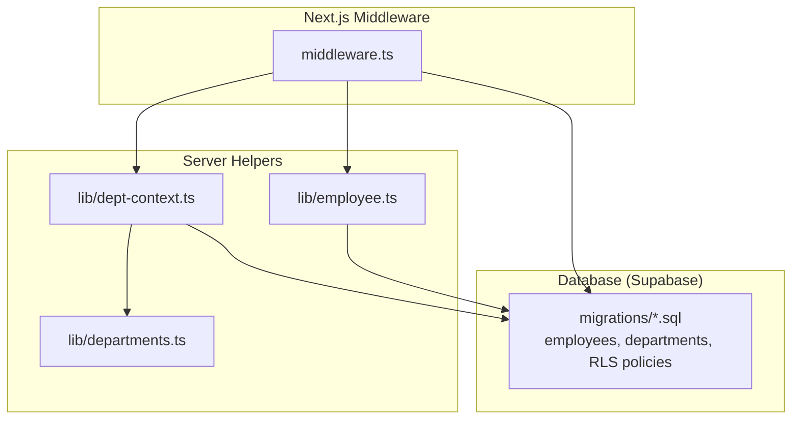
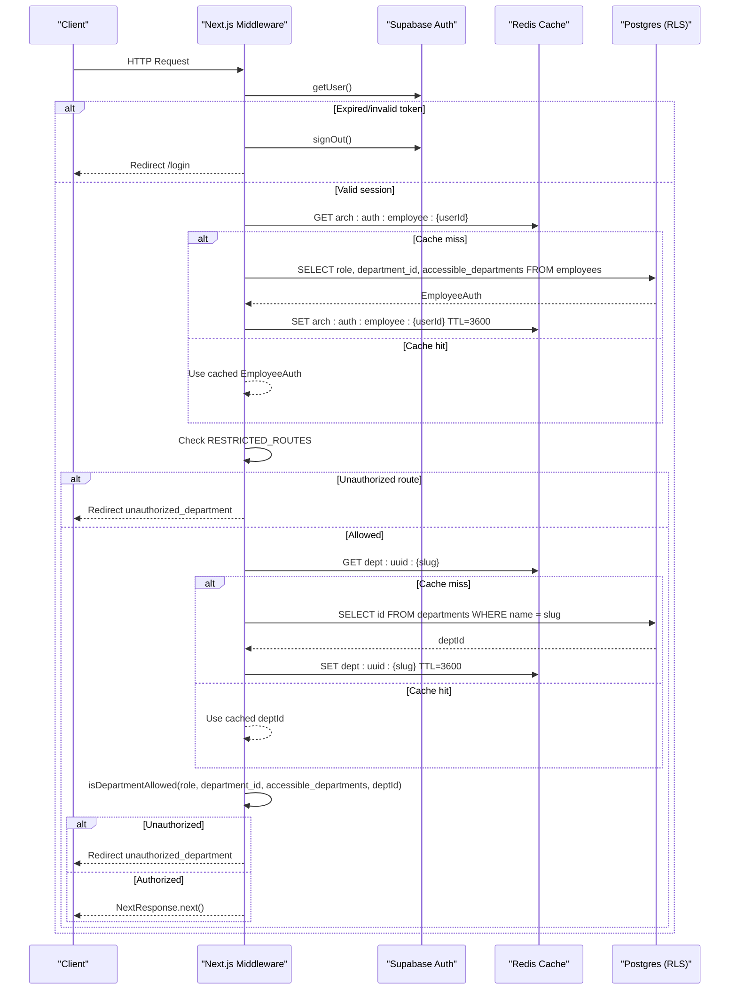
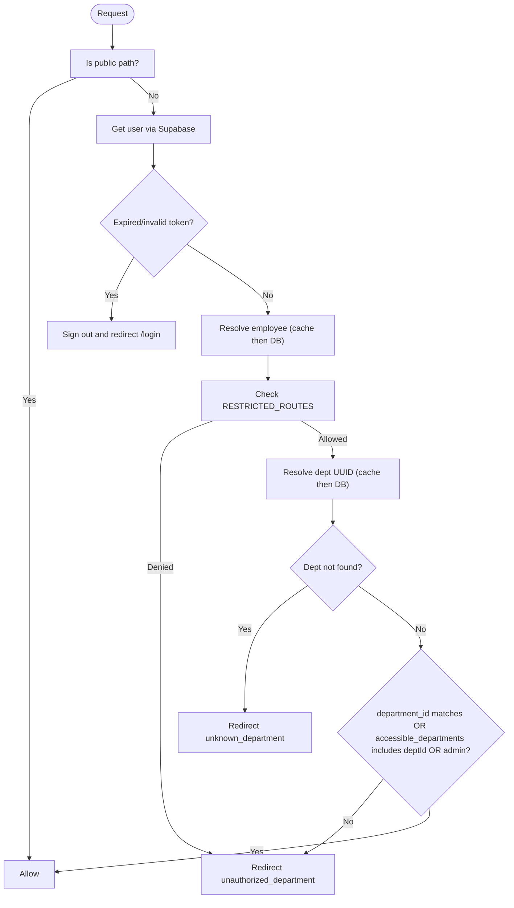
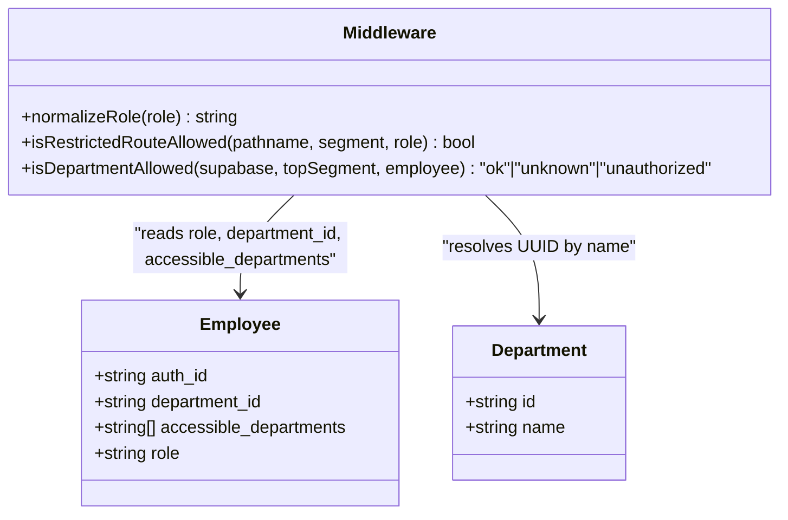
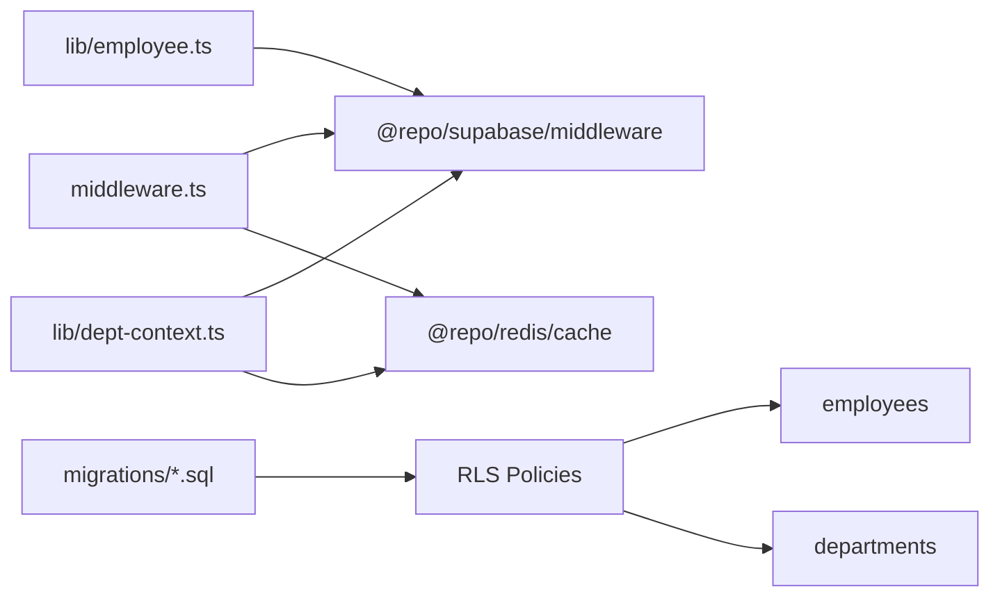

# Authorization & Role-Based Access Control

<cite>
**Referenced Files in This Document**
- [middleware.ts](file://apps/portal/middleware.ts)
- [middleware.test.ts](file://apps/portal/middleware.test.ts)
- [employee.ts](file://apps/portal/lib/employee.ts)
- [dept-context.ts](file://apps/portal/lib/dept-context.ts)
- [departments.ts](file://apps/portal/lib/departments.ts)
- [001_initial.sql](file://packages/database/migrations/001_initial.sql)
- [012_rls_refinement.sql](file://packages/database/migrations/012_rls_refinement.sql)
- [014_schema_refinement.sql](file://packages/database/migrations/014_schema_refinement.sql)
- [auth-middleware.md](file://wiki/concepts/auth-middleware.md)
- [rls-policy.md](file://wiki/concepts/rls-policy.md)
- [how-does-auth-work.md](file://wiki/queries/how-does-auth-work.md)
</cite>

## Table of Contents

1. Introduction
2. Project Structure
3. Core Components
4. Architecture Overview
5. Detailed Component Analysis
6. Dependency Analysis
7. Performance Considerations
8. Troubleshooting Guide
9. Conclusion
10. Appendices

## Introduction

This document explains the role-based access control (RBAC) system used by the portal application. It covers:

- Middleware-based authorization that enforces department isolation and route-level permissions
- Employee role hierarchy including operator, supervisor, control_room_operator, and admin roles
- Department access control via employee.department_id and employees.accessible_departments
- Restricted routes configuration and dynamic permission checking
- Examples for adding new roles, implementing custom authorization logic, and testing access controls
- Performance optimization through caching of employee data and department UUID resolution

The system combines Next.js middleware, server-side helpers, and database Row Level Security (RLS) to enforce security at multiple layers.

## Project Structure

The RBAC implementation spans three main areas:

- Middleware layer: request-time authentication, role checks, and department isolation
- Server-side helpers: lightweight utilities to resolve employee IDs and department context with caching
- Database layer: RLS policies and helper functions enforcing row-level access based on roles and departments

**Diagram sources**

- [middleware.ts:1-371](file://apps/portal/middleware.ts#L1-L371)
- [employee.ts:1-28](file://apps/portal/lib/employee.ts#L1-L28)
- [dept-context.ts:1-43](file://apps/portal/lib/dept-context.ts#L1-L43)
- [departments.ts:1-310](file://apps/portal/lib/departments.ts#L1-L310)
- [001_initial.sql:1-373](file://packages/database/migrations/001_initial.sql#L1-L373)

**Section sources**

- [middleware.ts:1-371](file://apps/portal/middleware.ts#L1-L371)
- [employee.ts:1-28](file://apps/portal/lib/employee.ts#L1-L28)
- [dept-context.ts:1-43](file://apps/portal/lib/dept-context.ts#L1-L43)
- [departments.ts:1-310](file://apps/portal/lib/departments.ts#L1-L310)
- [001_initial.sql:1-373](file://packages/database/migrations/001_initial.sql#L1-L373)

## Core Components

- Middleware authorization: authenticates users, resolves employee profile, validates restricted routes, and enforces department isolation using cached lookups.
- Employee model and role normalization: maps auth identity to an employee record with role, primary department, and cross-department grants.
- Department context resolver: resolves department slugs to UUIDs with Redis caching to avoid repeated DB queries.
- Database RLS policies: enforce per-row access based on role and department membership, including cross-department access via accessible_departments.

Key responsibilities:

- Route-level gating for admin, tools, access-control, and control-room
- Department-level gating for all department-scoped routes
- Cross-department access via employees.accessible_departments
- Caching of employee profiles and department UUIDs for performance

**Section sources**

- [middleware.ts:60-104](file://apps/portal/middleware.ts#L60-L104)
- [middleware.ts:206-263](file://apps/portal/middleware.ts#L206-L263)
- [dept-context.ts:16-43](file://apps/portal/lib/dept-context.ts#L16-L43)
- [001_initial.sql:27-70](file://packages/database/migrations/001_initial.sql#L27-L70)
- [012_rls_refinement.sql:1-97](file://packages/database/migrations/012_rls_refinement.sql#L1-L97)
- [014_schema_refinement.sql:224-367](file://packages/database/migrations/014_schema_refinement.sql#L224-L367)

## Architecture Overview

End-to-end flow from request to response with authorization checks:

**Diagram sources**

- [middleware.ts:165-263](file://apps/portal/middleware.ts#L165-L263)
- [middleware.ts:265-366](file://apps/portal/middleware.ts#L265-L366)
- [001_initial.sql:308-346](file://packages/database/migrations/001_initial.sql#L308-L346)

## Detailed Component Analysis

### Middleware Authorization Flow

Responsibilities:

- Skip public paths and password reset/update flows
- Authenticate via Supabase and handle expired tokens gracefully
- Resolve employee profile with caching
- Enforce route-level restrictions (admin, tools, access-control, control-room)
- Enforce department isolation using department_id and accessible_departments
- Provide clear error redirects (unauthorized_department, unknown_department)

Key behaviors:

- normalizeRole ensures a safe default ("operator") when role is missing or invalid
- isTokenExpiredError detects refresh token issues and triggers sign-out
- RESTRICTED_ROUTES map path prefixes to allowed roles
- isRestrictedRouteAllowed checks both top-level and second-segment patterns (e.g., "/drilling/tools")
- isDepartmentAllowed uses cached department UUID resolution and compares against employee.department_id and employees.accessible_departments

**Diagram sources**

- [middleware.ts:60-104](file://apps/portal/middleware.ts#L60-L104)
- [middleware.ts:225-263](file://apps/portal/middleware.ts#L225-L263)
- [middleware.ts:265-366](file://apps/portal/middleware.ts#L265-L366)

**Section sources**

- [middleware.ts:60-104](file://apps/portal/middleware.ts#L60-L104)
- [middleware.ts:206-263](file://apps/portal/middleware.ts#L206-L263)
- [middleware.ts:265-366](file://apps/portal/middleware.ts#L265-L366)

### Employee Role Hierarchy and Permissions

Roles enforced by middleware and RLS:

- admin: full access across departments and admin panel
- supervisor: read/write within own department; can update records they created; additional write privileges on certain tables
- operator: read within own department; insert daily logs, breakdowns, incidents; update own records
- control_room_operator: specialized role allowing access to control-room routes and department-scoped data

Cross-department access:

- employees.accessible_departments (UUID[]) allows viewing and writing in multiple departments without changing primary department_id
- RLS policies check department_id equality or inclusion in accessible_departments

Role normalization:

- normalizeRole defaults to "operator" if role is empty or invalid, ensuring safe fallback behavior

**Section sources**

- [middleware.ts:67-69](file://apps/portal/middleware.ts#L67-L69)
- [001_initial.sql:27-70](file://packages/database/migrations/001_initial.sql#L27-L70)
- [012_rls_refinement.sql:1-97](file://packages/database/migrations/012_rls_refinement.sql#L1-L97)
- [014_schema_refinement.sql:224-367](file://packages/database/migrations/014_schema_refinement.sql#L224-L367)
- [auth-middleware.md:51-82](file://wiki/concepts/auth-middleware.md#L51-L82)
- [rls-policy.md:135-143](file://wiki/concepts/rls-policy.md#L135-L143)

### Department Access Control via department_id and accessible_departments

- Primary scope: employee.department_id must match the target department’s UUID
- Secondary scope: employees.accessible_departments includes the target department’s UUID
- Admin bypass: admin role bypasses department checks entirely
- Department UUID resolution: resolved once per request and cached in Redis with a 1-hour TTL

**Diagram sources**

- [middleware.ts:206-263](file://apps/portal/middleware.ts#L206-L263)
- [001_initial.sql:7-15](file://packages/database/migrations/001_initial.sql#L7-L15)

**Section sources**

- [middleware.ts:121-138](file://apps/portal/middleware.ts#L121-L138)
- [middleware.ts:247-263](file://apps/portal/middleware.ts#L247-L263)
- [dept-context.ts:16-43](file://apps/portal/lib/dept-context.ts#L16-L43)
- [001_initial.sql:7-15](file://packages/database/migrations/001_initial.sql#L7-L15)

### Restricted Routes Configuration and Dynamic Permission Checking

Restricted routes are defined centrally and checked dynamically:

- access-control: requires access_control or admin
- control-room: requires control_room_operator or admin
- tools: requires admin or supervisor
- admin: requires admin

Dynamic checks:

- isRestrictedRouteAllowed evaluates pathname prefix and second segment (e.g., "/drilling/tools")
- If denied, middleware returns a redirect with "unauthorized_department" error parameter

Testing coverage:

- Tests assert correct handling for non-admin accessing /admin
- Tests assert control_room_operator access to /control-room
- Tests assert operators cannot access "/drilling/tools"
- Tests assert proper redirects for unknown departments and unauthorized department access

**Section sources**

- [middleware.ts:60-65](file://apps/portal/middleware.ts#L60-L65)
- [middleware.ts:225-245](file://apps/portal/middleware.ts#L225-L245)
- [middleware.test.ts:227-267](file://apps/portal/middleware.test.ts#L227-L267)
- [middleware.test.ts:269-282](file://apps/portal/middleware.test.ts#L269-L282)
- [middleware.test.ts:354-368](file://apps/portal/middleware.test.ts#L354-L368)
- [middleware.test.ts:284-314](file://apps/portal/middleware.test.ts#L284-L314)

### Database Layer: RLS Policies and Helper Functions

Core entities:

- departments: organizational units with unique slugs
- employees: links auth.users to roles and departments; includes accessible_departments array

Helper functions:

- user_department_id(): returns current user's department UUID
- is_admin(): checks if current user has admin role
- has_department_access(dept_id): checks admin or department membership or accessible_departments inclusion

Policy patterns:

- SELECT: allow admin or rows where department_id matches user’s department or accessible_departments
- INSERT/UPDATE: restrict by role and department scope
- DELETE: admin-only for sensitive tables

Soft delete support:

- is_active(record_deleted_at) filters out soft-deleted records in policies

**Section sources**

- [001_initial.sql:7-70](file://packages/database/migrations/001_initial.sql#L7-L70)
- [001_initial.sql:308-346](file://packages/database/migrations/001_initial.sql#L308-L346)
- [012_rls_refinement.sql:1-97](file://packages/database/migrations/012_rls_refinement.sql#L1-L97)
- [014_schema_refinement.sql:224-367](file://packages/database/migrations/014_schema_refinement.sql#L224-L367)
- [rls-policy.md:40-92](file://wiki/concepts/rls-policy.md#L40-L92)

### Server-Side Helpers: Employee ID Resolution and Department Context

- getEmployeeIdForAuthUser: resolves employees.id from auth.users, preferring x-auth-employee-id header when available, falling back to DB query
- getDepartmentContext: validates department slug, resolves UUID via Supabase, caches result in Redis for 1 hour, and provides today’s operational date

These helpers reduce redundant DB calls and improve performance for server components.

**Section sources**

- [employee.ts:1-28](file://apps/portal/lib/employee.ts#L1-L28)
- [dept-context.ts:16-43](file://apps/portal/lib/dept-context.ts#L16-L43)

## Dependency Analysis

Component relationships and coupling:

- Middleware depends on Supabase client for auth and DB queries, and Redis cache for performance
- Server helpers depend on Supabase client and Redis cache
- Database policies depend on helper functions and employees table structure

Potential circular dependencies:

- None detected between middleware and server helpers; each is independent and communicates via shared interfaces (Supabase client, cache)

External dependencies:

- Supabase Auth and Postgres (RLS)
- Redis for caching

Interface contracts:

- EmployeeAuth shape: { role, department_id, accessible_departments }
- Department resolution contract: slug -> UUID with 1-hour TTL

**Diagram sources**

- [middleware.ts:1-6](file://apps/portal/middleware.ts#L1-L6)
- [employee.ts:1-5](file://apps/portal/lib/employee.ts#L1-L5)
- [dept-context.ts:1-6](file://apps/portal/lib/dept-context.ts#L1-L6)
- [001_initial.sql:1-373](file://packages/database/migrations/001_initial.sql#L1-L373)

**Section sources**

- [middleware.ts:1-6](file://apps/portal/middleware.ts#L1-L6)
- [employee.ts:1-5](file://apps/portal/lib/employee.ts#L1-L5)
- [dept-context.ts:1-6](file://apps/portal/lib/dept-context.ts#L1-L6)
- [001_initial.sql:1-373](file://packages/database/migrations/001_initial.sql#L1-L373)

## Performance Considerations

Caching strategies implemented:

- Employee profile cache key: arch:auth:employee:{userId}, TTL 3600 seconds
- Department UUID cache key: dept:uuid:{slug}, TTL 3600 seconds
- Header-based employee ID resolution: x-auth-employee-id avoids DB lookup when available

Optimization recommendations:

- Ensure Redis availability and monitor cache hit rates
- Invalidate employee cache on role changes or sign-out events
- Consider shortening TTL for frequently changing department configurations
- Add metrics around cache misses and DB fallbacks

[No sources needed since this section provides general guidance]

## Troubleshooting Guide

Common issues and resolutions:

- Expired or invalid refresh token: middleware signs out and redirects to /login
- Unknown department slug: middleware redirects with "unknown_department" error
- Unauthorized department access: middleware redirects with "unauthorized_department" error
- Missing employee record: ensure auth trigger creates employee on signup; verify employees table constraints

Debugging steps:

- Verify middleware matcher excludes static assets and API routes
- Confirm Redis connectivity and cache keys presence
- Validate RLS policies using Supabase Studio or SQL tests
- Check headers propagation for x-auth-employee-id in server components

**Section sources**

- [middleware.ts:178-189](file://apps/portal/middleware.ts#L178-L189)
- [middleware.ts:318-366](file://apps/portal/middleware.ts#L318-L366)
- [001_initial.sql:351-373](file://packages/database/migrations/001_initial.sql#L351-L373)
- [how-does-auth-work.md:26-72](file://wiki/queries/how-does-auth-work.md#L26-L72)

## Conclusion

The RBAC system integrates middleware-based authorization, server-side helpers, and database RLS to enforce robust, multi-layered security. Roles and department isolation are consistently applied across routes and data access, with caching optimizing performance. The design supports extensibility for new roles and custom authorization logic while maintaining clear testing and troubleshooting pathways.

[No sources needed since this section summarizes without analyzing specific files]

## Appendices

### Adding a New Role

Steps:

- Define the role in RESTRICTED_ROUTES mapping in middleware.ts
- Update isRestrictedRouteAllowed if special second-segment rules apply
- Implement corresponding RLS policies in migrations for any new tables requiring role-specific access
- Add tests in middleware.test.ts covering allowed and denied scenarios

Example references:

- [RESTRICTED_ROUTES definition:60-65](file://apps/portal/middleware.ts#L60-L65)
- [isRestrictedRouteAllowed logic:225-245](file://apps/portal/middleware.ts#L225-L245)
- [RLS policy template usage:224-367](file://packages/database/migrations/014_schema_refinement.sql#L224-L367)
- [Middleware test examples:227-267](file://apps/portal/middleware.test.ts#L227-L267)

**Section sources**

- [middleware.ts:60-65](file://apps/portal/middleware.ts#L60-L65)
- [middleware.ts:225-245](file://apps/portal/middleware.ts#L225-L245)
- [014_schema_refinement.sql:224-367](file://packages/database/migrations/014_schema_refinement.sql#L224-L367)
- [middleware.test.ts:227-267](file://apps/portal/middleware.test.ts#L227-L267)

### Implementing Custom Authorization Logic

Approaches:

- Extend isRestrictedRouteAllowed for complex route patterns
- Introduce a custom authorization function invoked after employee resolution
- Leverage accessible_departments for fine-grained cross-department access
- Use server-side helpers to fetch additional context (e.g., team memberships) before granting access

References:

- [Custom route checks:225-245](file://apps/portal/middleware.ts#L225-L245)
- [Employee resolution with cache:206-223](file://apps/portal/middleware.ts#L206-L223)
- [Department context resolution:16-43](file://apps/portal/lib/dept-context.ts#L16-L43)

**Section sources**

- [middleware.ts:206-223](file://apps/portal/middleware.ts#L206-L223)
- [middleware.ts:225-245](file://apps/portal/middleware.ts#L225-L245)
- [dept-context.ts:16-43](file://apps/portal/lib/dept-context.ts#L16-L43)

### Testing Access Controls

Guidelines:

- Mock Supabase client and Redis cache in tests
- Assert redirects for unauthorized routes and department access failures
- Validate cache usage by mocking cacheGet responses
- Cover edge cases like expired tokens and unknown departments

Test references:

- [Admin route access:227-253](file://apps/portal/middleware.test.ts#L227-L253)
- [Control room access:269-282](file://apps/portal/middleware.test.ts#L269-L282)
- [Tools restriction:354-368](file://apps/portal/middleware.test.ts#L354-L368)
- [Department access denial:300-314](file://apps/portal/middleware.test.ts#L300-L314)
- [Cache utilization:316-337](file://apps/portal/middleware.test.ts#L316-L337)

**Section sources**

- [middleware.test.ts:227-253](file://apps/portal/middleware.test.ts#L227-L253)
- [middleware.test.ts:269-282](file://apps/portal/middleware.test.ts#L269-L282)
- [middleware.test.ts:354-368](file://apps/portal/middleware.test.ts#L354-L368)
- [middleware.test.ts:300-314](file://apps/portal/middleware.test.ts#L300-L314)
- [middleware.test.ts:316-337](file://apps/portal/middleware.test.ts#L316-L337)
