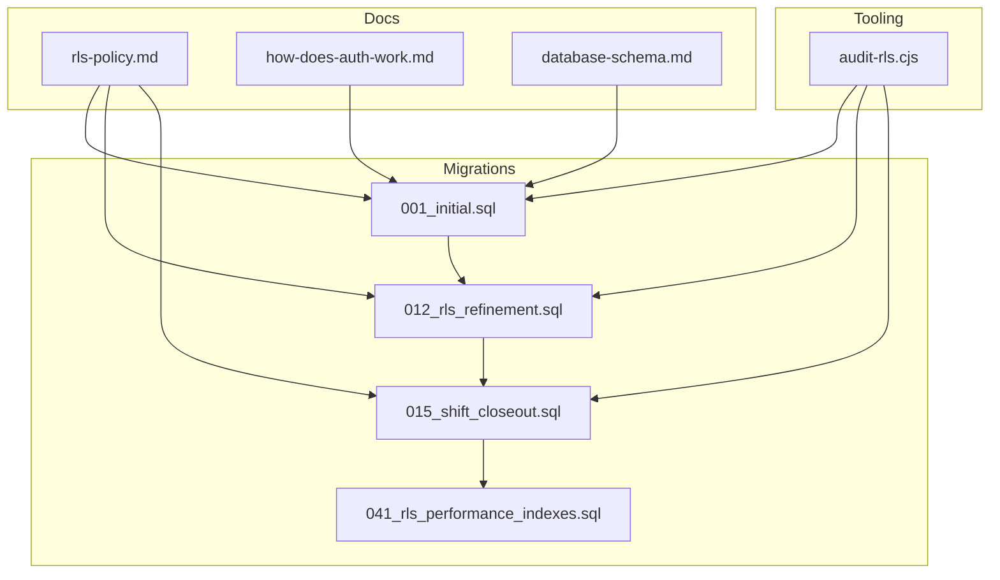
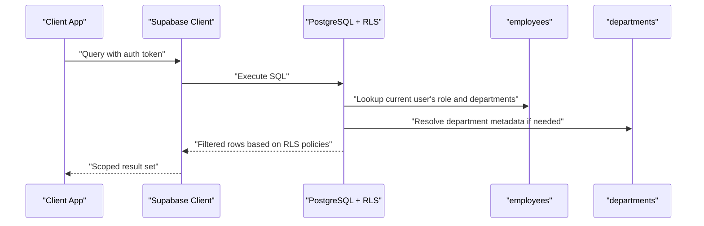
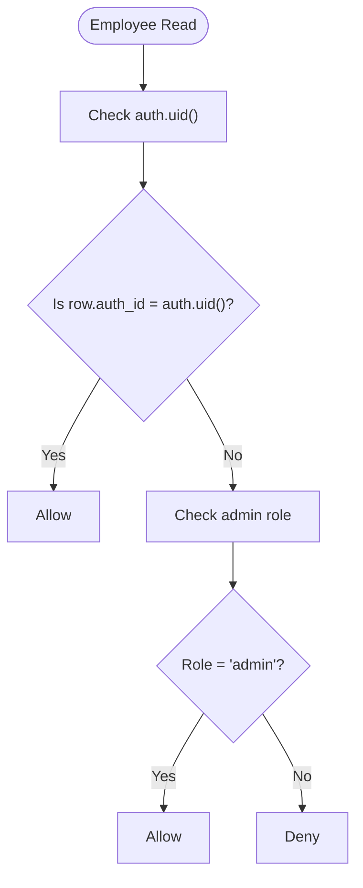
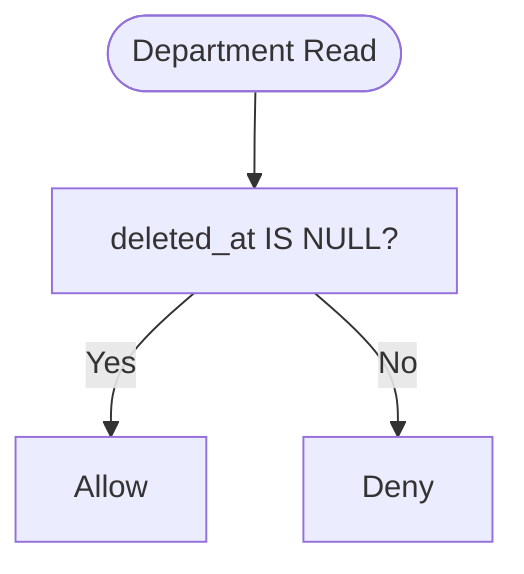
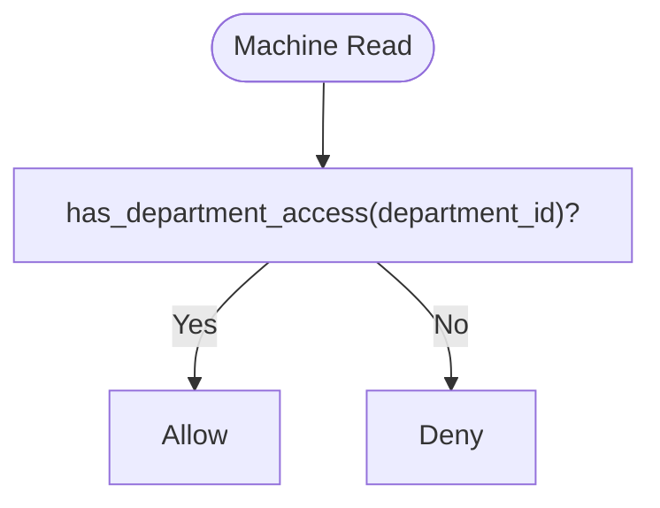
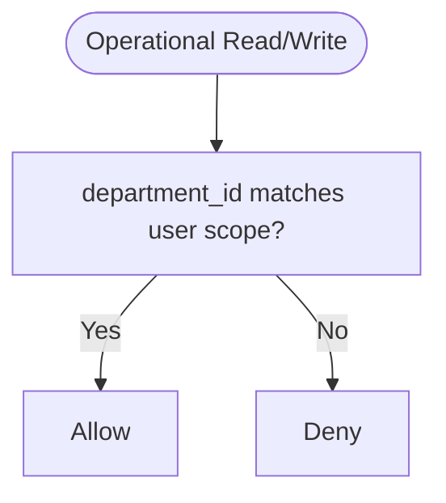
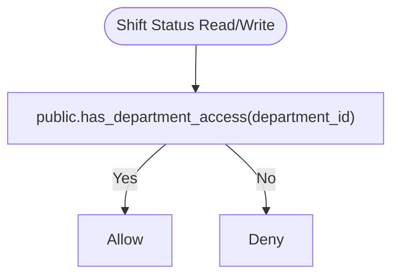
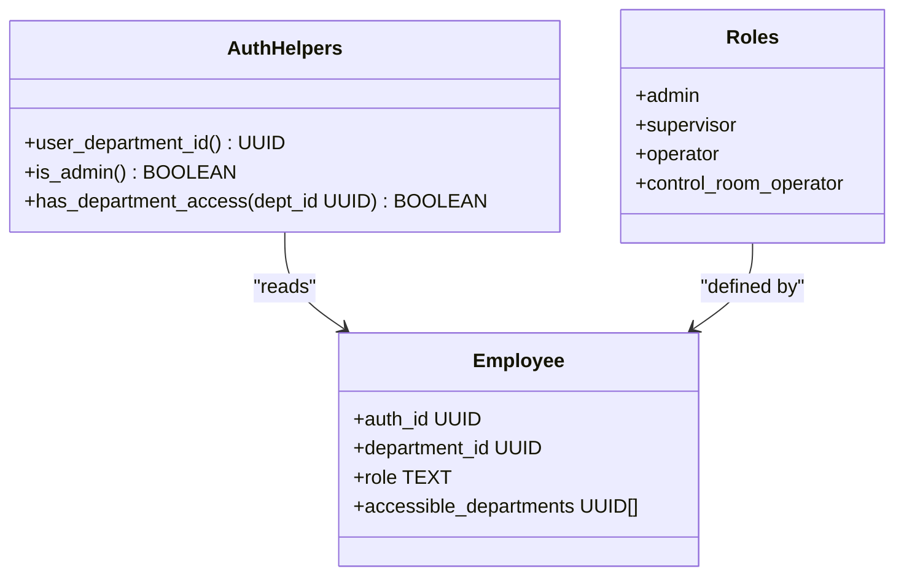
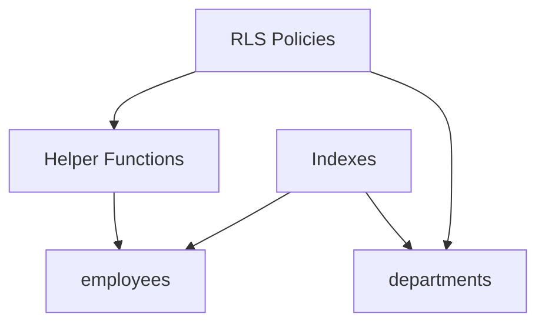

# Row Level Security Policies

<cite>
**Referenced Files in This Document**
- [rls-policy.md](file://wiki/concepts/rls-policy.md)
- [012_rls_refinement.sql](file://packages/database/migrations/012_rls_refinement.sql)
- [041_rls_performance_indexes.sql](file://packages/database/migrations/041_rls_performance_indexes.sql)
- [001_initial.sql](file://packages/database/migrations/001_initial.sql)
- [015_shift_closeout.sql](file://packages/database/migrations/015_shift_closeout.sql)
- [audit-rls.cjs](file://tools/audit-rls.cjs)
- [how-does-auth-work.md](file://wiki/queries/how-does-auth-work.md)
- [database-schema.md](file://wiki/concepts/database-schema.md)
</cite>

## Table of Contents

1. Introduction
2. Project Structure
3. Core Components
4. Architecture Overview
5. Detailed Component Analysis
6. Dependency Analysis
7. Performance Considerations
8. Troubleshooting Guide
9. Conclusion

## Introduction

This document explains how Row Level Security (RLS) policies protect data at the database level using Supabase. It focuses on enforcing access controls based on authenticated user identity, employee roles, and department membership. You will learn how policies are defined for core tables (employees, departments, machines, and operational data), how they leverage authenticated context and employee relationships to filter rows, and how to write, test, and debug custom RLS policies. The guide also covers performance implications and best practices for maintaining secure and efficient data access patterns.

## Project Structure

RLS policies and supporting functions are implemented as SQL migrations under packages/database/migrations. A policy standard is documented in wiki/concepts/rls-policy.md, and a static audit tool exists in tools/audit-rls.cjs to enforce consistent policy coverage and detect overly permissive rules.

**Diagram sources**

- [001_initial.sql:1-200](file://packages/database/migrations/001_initial.sql#L1-L200)
- [012_rls_refinement.sql:1-97](file://packages/database/migrations/012_rls_refinement.sql#L1-L97)
- [015_shift_closeout.sql:20-67](file://packages/database/migrations/015_shift_closeout.sql#L20-L67)
- [041_rls_performance_indexes.sql:1-28](file://packages/database/migrations/041_rls_performance_indexes.sql#L1-L28)
- [rls-policy.md:1-150](file://wiki/concepts/rls-policy.md#L1-L150)
- [how-does-auth-work.md:124-183](file://wiki/queries/how-does-auth-work.md#L124-L183)
- [database-schema.md:242-261](file://wiki/concepts/database-schema.md#L242-L261)
- [audit-rls.cjs:1-348](file://tools/audit-rls.cjs#L1-L348)

**Section sources**

- [rls-policy.md:1-150](file://wiki/concepts/rls-policy.md#L1-L150)
- [001_initial.sql:1-200](file://packages/database/migrations/001_initial.sql#L1-L200)
- [012_rls_refinement.sql:1-97](file://packages/database/migrations/012_rls_refinement.sql#L1-L97)
- [015_shift_closeout.sql:20-67](file://packages/database/migrations/015_shift_closeout.sql#L20-L67)
- [041_rls_performance_indexes.sql:1-28](file://packages/database/migrations/041_rls_performance_indexes.sql#L1-L28)
- [audit-rls.cjs:1-348](file://tools/audit-rls.cjs#L1-L348)
- [how-does-auth-work.md:124-183](file://wiki/queries/how-does-auth-work.md#L124-L183)
- [database-schema.md:242-261](file://wiki/concepts/database-schema.md#L242-L261)

## Core Components

- Policy standards: Every new table must enable RLS and define appropriate SELECT/INSERT/UPDATE policies; DELETE is restricted or omitted for append-only tables.
- Auth helpers: Functions encapsulate role and department checks used by policies.
- Department isolation: Policies restrict access to rows belonging to the current user’s department or accessible departments.
- Audit and enforcement: Static analysis ensures all tables have RLS enabled and flags suspicious policies.

Key responsibilities:

- Define policies consistently across tables with department_id.
- Use helper functions to centralize role and cross-department logic.
- Maintain indexes to avoid full scans inside policy evaluation.

**Section sources**

- [rls-policy.md:15-92](file://wiki/concepts/rls-policy.md#L15-L92)
- [database-schema.md:242-261](file://wiki/concepts/database-schema.md#L242-L261)
- [012_rls_refinement.sql:1-97](file://packages/database/migrations/012_rls_refinement.sql#L1-L97)
- [041_rls_performance_indexes.sql:1-28](file://packages/database/migrations/041_rls_performance_indexes.sql#L1-L28)
- [audit-rls.cjs:1-348](file://tools/audit-rls.cjs#L1-L348)

## Architecture Overview

The RLS architecture ties authentication, employee records, and department membership together to control row visibility. Policies evaluate the authenticated user’s identity and role, then compare against the target row’s department scope.

**Diagram sources**

- [how-does-auth-work.md:144-183](file://wiki/queries/how-does-auth-work.md#L144-L183)
- [001_initial.sql:27-121](file://packages/database/migrations/001_initial.sql#L27-L121)
- [012_rls_refinement.sql:11-97](file://packages/database/migrations/012_rls_refinement.sql#L11-L97)

## Detailed Component Analysis

### Employees Table

- Purpose: Links Supabase users to organizational roles and department memberships.
- Access model:
  - Users can read their own profile; admins can read any employee record.
  - Updates limited to self or admin.
  - Inserts restricted to admin.
- Key policies:
  - Select: self or admin.
  - Update: self or admin.
  - Insert: admin only.

**Diagram sources**

- [001_initial.sql:36-69](file://packages/database/migrations/001_initial.sql#L36-L69)

**Section sources**

- [001_initial.sql:27-69](file://packages/database/migrations/001_initial.sql#L27-L69)

### Departments Table

- Purpose: Reference table defining departments.
- Access model:
  - All authenticated users can read active departments.
- Key policies:
  - Select: allow for authenticated users (active filtering via soft delete).

**Diagram sources**

- [012_rls_refinement.sql:11-16](file://packages/database/migrations/012_rls_refinement.sql#L11-L16)

**Section sources**

- [012_rls_refinement.sql:11-16](file://packages/database/migrations/012_rls_refinement.sql#L11-L16)

### Machines Table

- Purpose: Equipment scoped to departments.
- Access model:
  - Read: users see machines in their department or accessible departments; admins see all.
  - Insert/Update: restricted to admin/supervisor roles.
- Key policies:
  - Select: department-scoped with cross-department support.
  - Insert/Update: role-based restrictions.

**Diagram sources**

- [001_initial.sql:83-121](file://packages/database/migrations/001_initial.sql#L83-L121)
- [012_rls_refinement.sql:28-36](file://packages/database/migrations/012_rls_refinement.sql#L28-L36)

**Section sources**

- [001_initial.sql:73-121](file://packages/database/migrations/001_initial.sql#L73-L121)
- [012_rls_refinement.sql:28-36](file://packages/database/migrations/012_rls_refinement.sql#L28-L36)

### Operational Data Tables (Daily Logs, Machine Hours, Fuel Logs, Production Logs)

- Purpose: Append-heavy operational records tied to departments.
- Access model:
  - Read/Insert: scoped to the user’s department or accessible departments.
  - Delete: typically omitted for append-only design.
- Key policies:
  - Select/Insert: department-scoped with cross-department support.
  - Delete: not provided for append-only tables.

**Diagram sources**

- [001_initial.sql:124-200](file://packages/database/migrations/001_initial.sql#L124-L200)
- [001_initial.sql:225-288](file://packages/database/migrations/001_initial.sql#L225-L288)

**Section sources**

- [001_initial.sql:124-200](file://packages/database/migrations/001_initial.sql#L124-L200)
- [001_initial.sql:225-288](file://packages/database/migrations/001_initial.sql#L225-L288)

### Shift Status Table

- Purpose: Tracks shift closeout status per department.
- Access model:
  - Read/Insert/Update: scoped to user’s department or accessible departments.
- Key policies:
  - Select/Insert/Update: uses has_department_access helper.

**Diagram sources**

- [015_shift_closeout.sql:27-47](file://packages/database/migrations/015_shift_closeout.sql#L27-L47)

**Section sources**

- [015_shift_closeout.sql:27-47](file://packages/database/migrations/015_shift_closeout.sql#L27-L47)

### Helper Functions and Role Matrix

- Helper functions centralize role and department checks:
  - user_department_id(): returns current user’s primary department.
  - is_admin(): checks admin role.
  - has_department_access(target): checks admin, primary department, or accessible_departments array.
- Role matrix:
  - admin: full access across departments and deletes.
  - supervisor/operator/control_room_operator: scoped to own department and optionally accessible_departments.

**Diagram sources**

- [rls-policy.md:94-133](file://wiki/concepts/rls-policy.md#L94-L133)
- [001_initial.sql:307-349](file://packages/database/migrations/001_initial.sql#L307-L349)

**Section sources**

- [rls-policy.md:94-133](file://wiki/concepts/rls-policy.md#L94-L133)
- [001_initial.sql:307-349](file://packages/database/migrations/001_initial.sql#L307-L349)

### Policy Template and Standards

- Standard pattern:
  - Enable RLS on every new table.
  - Define SELECT/INSERT/UPDATE policies using department scope and role checks.
  - Restrict DELETE to admin or omit for append-only tables.
- Template usage:
  - Copy template for new tables with department_id.
  - Ensure policies reference employees and use helper functions.

**Section sources**

- [rls-policy.md:40-92](file://wiki/concepts/rls-policy.md#L40-L92)
- [database-schema.md:242-261](file://wiki/concepts/database-schema.md#L242-L261)

## Dependency Analysis

RLS policies depend on:

- Authentication context (auth.uid()).
- Employee records (role, department_id, accessible_departments).
- Helper functions (is_admin, has_department_access).
- Indexes for performance (employees(auth_id), employees(department_id), departments(name)).

**Diagram sources**

- [001_initial.sql:307-349](file://packages/database/migrations/001_initial.sql#L307-L349)
- [041_rls_performance_indexes.sql:14-28](file://packages/database/migrations/041_rls_performance_indexes.sql#L14-L28)

**Section sources**

- [001_initial.sql:307-349](file://packages/database/migrations/001_initial.sql#L307-L349)
- [041_rls_performance_indexes.sql:1-28](file://packages/database/migrations/041_rls_performance_indexes.sql#L1-L28)

## Performance Considerations

- Root cause of slowness:
  - RLS function has_department_access() runs per-row lookups against employees without an index on auth_id, causing full table scans.
  - Middleware slug lookup on departments(name) lacked indexing.
- Fixes applied:
  - Added indexes on employees(auth_id), employees(department_id), and departments(name).
- Best practices:
  - Prefer helper functions that join on indexed columns.
  - Avoid USING (true) on non-reference tables.
  - Keep policies simple and deterministic to aid query planning.
  - Monitor slow queries and add targeted indexes where necessary.

**Section sources**

- [041_rls_performance_indexes.sql:1-28](file://packages/database/migrations/041_rls_performance_indexes.sql#L1-L28)
- [audit-rls.cjs:189-229](file://tools/audit-rls.cjs#L189-L229)

## Troubleshooting Guide

Common issues and resolutions:

- Empty results when querying operational data:
  - Verify the user’s department and accessible_departments match the target rows’ department_id.
  - Confirm policies are enabled and not overridden by later migrations.
- Overly permissive policies:
  - Use the static audit tool to detect USING (true) or WITH CHECK (true) on sensitive tables.
  - Ensure SELECT policies on department-scoped tables reference auth.uid() or employees.
- Slow queries:
  - Check for missing indexes on employees(auth_id) and employees(department_id).
  - Review query plans for full table scans inside policy evaluation.

Testing and debugging steps:

- Run the RLS audit tool to generate a report and identify critical/warning findings.
- Validate policies locally in Supabase Studio before pushing changes.
- Test with different roles and department memberships to confirm expected scoping.

**Section sources**

- [audit-rls.cjs:1-348](file://tools/audit-rls.cjs#L1-L348)
- [rls-policy.md:144-150](file://wiki/concepts/rls-policy.md#L144-L150)
- [041_rls_performance_indexes.sql:1-28](file://packages/database/migrations/041_rls_performance_indexes.sql#L1-L28)

## Conclusion

Row Level Security in this project enforces strict, department-scoped access based on authenticated user identity and employee roles. By centralizing role and department checks into helper functions, applying consistent policy templates, and maintaining targeted indexes, the system achieves both security and performance. The static audit tool helps maintain policy quality and prevents regressions. Following these patterns ensures robust data protection while keeping queries efficient and maintainable.
