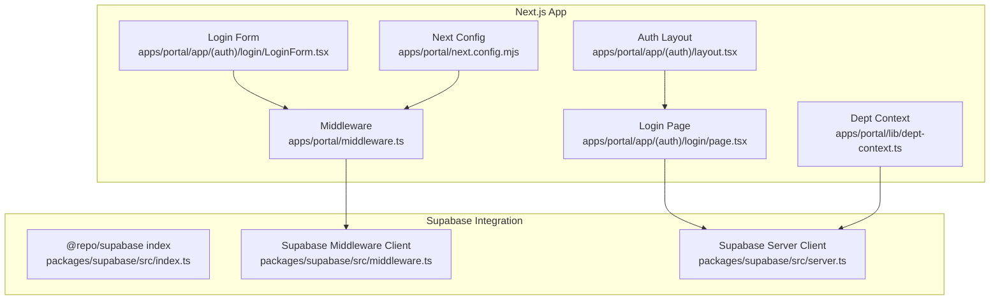
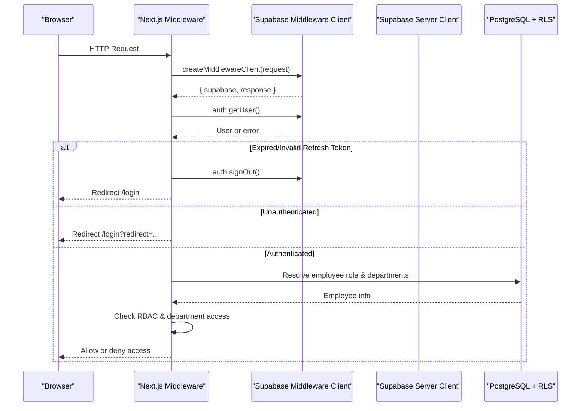
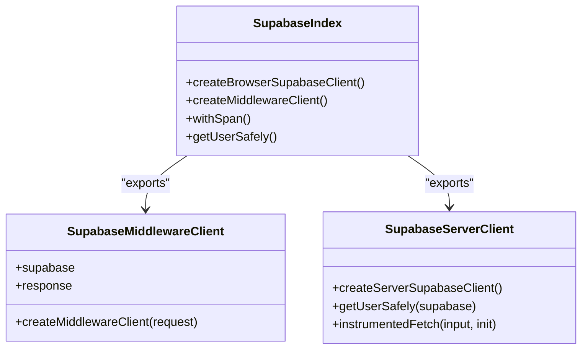
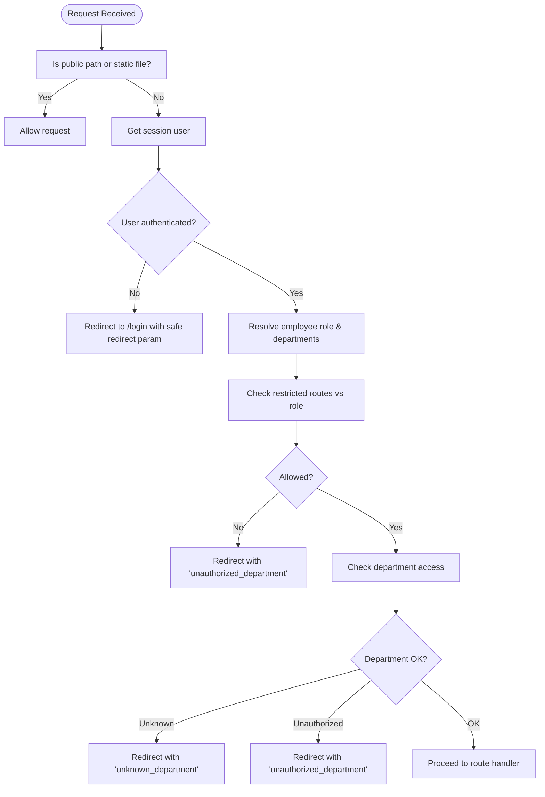
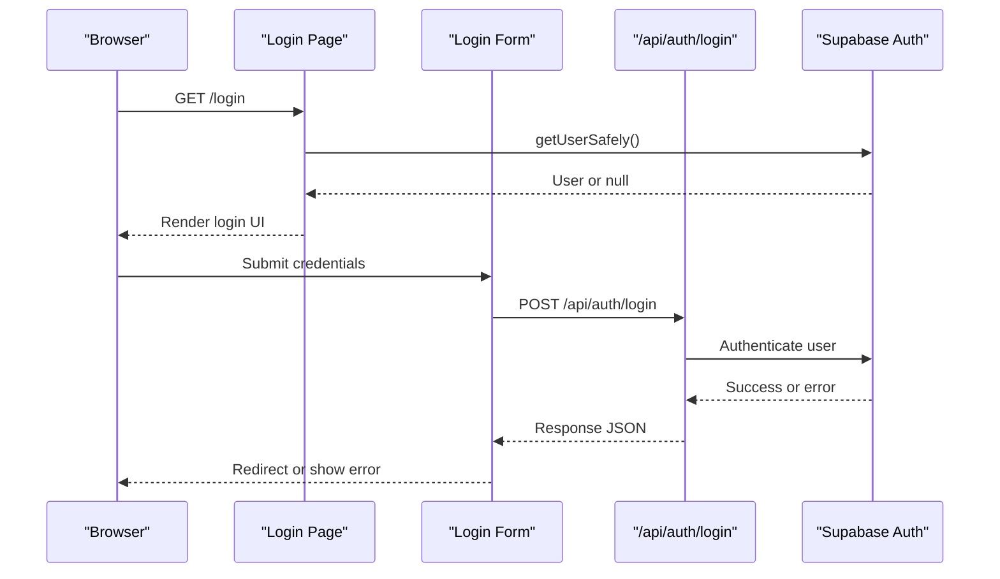
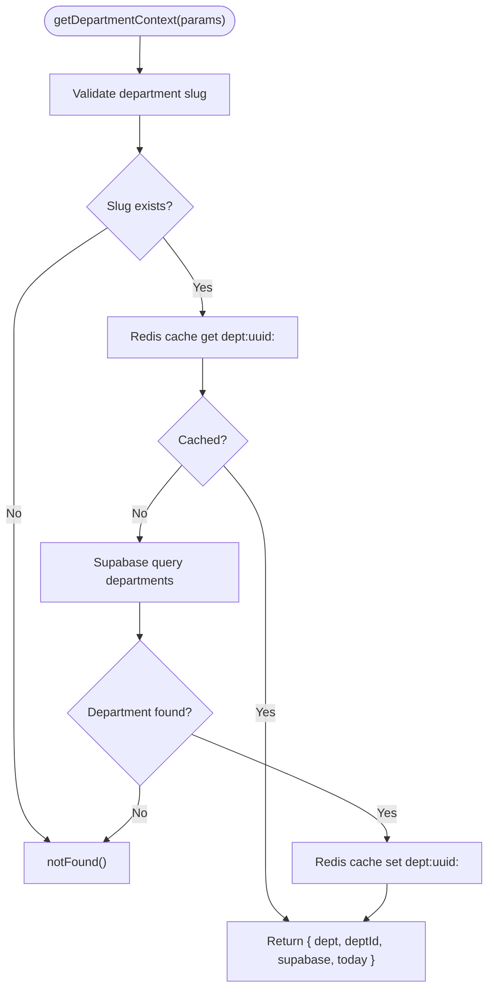
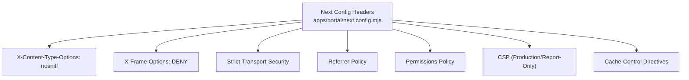
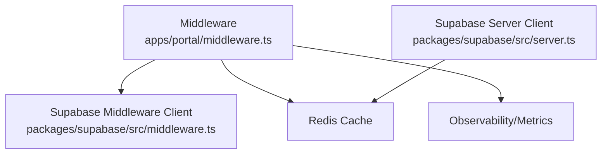

# Security & Authentication

<cite>
**Referenced Files in This Document**
- [middleware.ts](file://apps/portal/middleware.ts)
- [middleware.test.ts](file://apps/portal/middleware.test.ts)
- [layout.tsx](file://apps/portal/app/(auth)/layout.tsx)
- [page.tsx](file://apps/portal/app/(auth)/login/page.tsx)
- [LoginForm.tsx](file://apps/portal/app/(auth)/login/LoginForm.tsx)
- [dept-context.ts](file://apps/portal/lib/dept-context.ts)
- [index.ts](file://packages/supabase/src/index.ts)
- [middleware.ts](file://packages/supabase/src/middleware.ts)
- [server.ts](file://packages/supabase/src/server.ts)
- [next.config.mjs](file://apps/portal/next.config.mjs)
- [security-posture.md](file://wiki/breakdown/security-posture.md)
- [final-project-readiness.md](file://wiki/final-project-readiness.md)
</cite>

## Table of Contents

1. [Introduction](#introduction)
2. [Project Structure](#project-structure)
3. [Core Components](#core-components)
4. [Architecture Overview](#architecture-overview)
5. [Detailed Component Analysis](#detailed-component-analysis)
6. [Dependency Analysis](#dependency-analysis)
7. [Performance Considerations](#performance-considerations)
8. [Troubleshooting Guide](#troubleshooting-guide)
9. [Conclusion](#conclusion)
10. [Appendices](#appendices)

## Introduction

This document provides comprehensive security documentation for authentication, authorization, and security implementation patterns across the application. It explains Supabase Auth integration, JWT token management, session handling, middleware-based authorization with department isolation and role-based access control (RBAC), Row Level Security (RLS) at the database layer, input validation and output sanitization, protection against common vulnerabilities, security headers, CORS configuration, secure communication patterns, and guidelines for implementing secure features and auditing practices.

## Project Structure

Security-related code is primarily implemented in:

- Next.js middleware for request interception, authentication checks, and authorization decisions
- Supabase client wrappers for secure cookie handling and server-side user resolution
- Login page and form for credential submission and error handling
- Department context utilities for server-side validation and caching
- Next.js configuration for security headers and CSP policies
- Documentation summarizing security posture and readiness metrics

**Diagram sources**

- [middleware.ts:1-371](file://apps/portal/middleware.ts#L1-L371)
- [layout.tsx](<file://apps/portal/app/(auth)/layout.tsx#L1-L12>)
- [page.tsx](<file://apps/portal/app/(auth)/login/page.tsx#L1-L196>)
- [LoginForm.tsx](<file://apps/portal/app/(auth)/login/LoginForm.tsx#L74-L124>)
- [dept-context.ts:1-68](file://apps/portal/lib/dept-context.ts#L1-L68)
- [index.ts:1-7](file://packages/supabase/src/index.ts#L1-L7)
- [middleware.ts:1-44](file://packages/supabase/src/middleware.ts#L1-L44)
- [server.ts:1-100](file://packages/supabase/src/server.ts#L1-L100)
- [next.config.mjs:58-165](file://apps/portal/next.config.mjs#L58-L165)

**Section sources**

- [middleware.ts:1-371](file://apps/portal/middleware.ts#L1-L371)
- [next.config.mjs:58-165](file://apps/portal/next.config.mjs#L58-L165)

## Core Components

- Supabase Auth Integration:
  - Middleware client sets secure cookies (HttpOnly, Secure in production, SameSite=Lax) to protect tokens from XSS and CSRF.
  - Server client wraps fetch for observability and safely retrieves users while handling refresh token errors gracefully.
- Session Handling:
  - Middleware detects expired or invalid refresh tokens and signs out users, clearing cached employee data.
  - Redirects unauthenticated users to login with safe redirect parameter validation.
- Authorization:
  - Role-based access control enforces restricted routes based on roles.
  - Department isolation ensures users can only access their assigned departments or those explicitly allowed.
- Input Validation and Output Sanitization:
  - Safe redirect URL validation prevents open redirects.
  - Error messages are sanitized; telemetry and breadcrumbs avoid PII.
- Security Headers and CSP:
  - Strict transport security, nosniff, frame options, referrer policy, permissions policy, and CSP configured per environment.
  - Cache directives prevent caching of sensitive endpoints.

**Section sources**

- [middleware.ts:1-371](file://apps/portal/middleware.ts#L1-L371)
- [middleware.ts:1-44](file://packages/supabase/src/middleware.ts#L1-L44)
- [server.ts:1-100](file://packages/supabase/src/server.ts#L1-L100)
- [next.config.mjs:58-165](file://apps/portal/next.config.mjs#L58-L165)
- [security-posture.md:92-104](file://wiki/breakdown/security-posture.md#L92-L104)
- [final-project-readiness.md:97-111](file://wiki/final-project-readiness.md#L97-L111)

## Architecture Overview

The security architecture follows a layered approach:

- Request Interception: Next.js middleware validates sessions, enforces RBAC, and isolates departments.
- Token Management: Supabase SSR clients manage secure cookies and handle refresh token lifecycle.
- Database Protection: RLS policies enforce row-level access based on user roles and department membership.
- Application Hardening: Security headers, CSP, and cache controls mitigate common web vulnerabilities.

**Diagram sources**

- [middleware.ts:165-366](file://apps/portal/middleware.ts#L165-L366)
- [middleware.ts:1-44](file://packages/supabase/src/middleware.ts#L1-L44)
- [server.ts:82-100](file://packages/supabase/src/server.ts#L82-L100)

## Detailed Component Analysis

### Supabase Auth Integration and JWT Token Management

- Middleware Client:
  - Creates Supabase client with secure cookie settings.
  - Ensures HttpOnly, Secure (production), and SameSite=Lax to mitigate XSS and CSRF risks.
- Server Client:
  - Wraps fetch for observability and safely retrieves current user.
  - Handles refresh token errors by returning null instead of crashing server components.
- Index Exports:
  - Centralized exports for browser, middleware, and server clients.

**Diagram sources**

- [middleware.ts:1-44](file://packages/supabase/src/middleware.ts#L1-L44)
- [server.ts:1-100](file://packages/supabase/src/server.ts#L1-L100)
- [index.ts:1-7](file://packages/supabase/src/index.ts#L1-L7)

**Section sources**

- [middleware.ts:1-44](file://packages/supabase/src/middleware.ts#L1-L44)
- [server.ts:1-100](file://packages/supabase/src/server.ts#L1-L100)
- [index.ts:1-7](file://packages/supabase/src/index.ts#L1-L7)

### Middleware-Based Authorization System

- Authentication Checks:
  - Detects session cookies and validates user presence.
  - Signs out users when refresh tokens are invalid/expired.
- Role-Based Access Control:
  - Restricted routes map to allowed roles; unauthorized users receive an error redirect.
- Department Isolation:
  - Resolves department UUID via Redis cache and Supabase query.
  - Allows access if user is admin, belongs to the department, or has explicit access.
- Safe Redirect Handling:
  - Validates redirect paths to prevent open redirects.

**Diagram sources**

- [middleware.ts:8-47](file://apps/portal/middleware.ts#L8-L47)
- [middleware.ts:265-366](file://apps/portal/middleware.ts#L265-L366)

**Section sources**

- [middleware.ts:1-371](file://apps/portal/middleware.ts#L1-L371)
- [middleware.test.ts:192-225](file://apps/portal/middleware.test.ts#L192-L225)

### Login Flow and Error Handling

- Login Page:
  - Checks for existing auth cookies and attempts to validate user safely.
  - Displays system unavailable state if authentication services cannot be reached.
- Login Form:
  - Submits credentials to API endpoint and handles network errors.
  - Records Sentry breadcrumbs without PII and sends lightweight telemetry.

**Diagram sources**

- [page.tsx](<file://apps/portal/app/(auth)/login/page.tsx#L1-L196>)
- [LoginForm.tsx](<file://apps/portal/app/(auth)/login/LoginForm.tsx#L74-L124>)

**Section sources**

- [page.tsx](<file://apps/portal/app/(auth)/login/page.tsx#L1-L196>)
- [LoginForm.tsx](<file://apps/portal/app/(auth)/login/LoginForm.tsx#L74-L124>)

### Department Context and Caching

- Server-Side Validation:
  - Validates department slug against known departments.
  - Fetches department UUID from Supabase and caches it in Redis for performance.
- Access Control Helper:
  - Enforces department-specific access for tabs or features.

**Diagram sources**

- [dept-context.ts:1-68](file://apps/portal/lib/dept-context.ts#L1-L68)

**Section sources**

- [dept-context.ts:1-68](file://apps/portal/lib/dept-context.ts#L1-L68)

### Security Headers and CSP Configuration

- Global Security Headers:
  - X-Content-Type-Options: nosniff
  - X-Frame-Options: DENY
  - Strict-Transport-Security: max-age with includeSubDomains and preload
  - Referrer-Policy: strict-origin-when-cross-origin
  - Permissions-Policy: restricts camera, microphone, geolocation
- Content Security Policy:
  - Production: Enforced CSP with strict script and connect-src rules.
  - Development: Report-only CSP with report-uri endpoint.
- Cache Controls:
  - Static assets: Long-lived immutable cache.
  - Sensitive endpoints: Private, no-store.

**Diagram sources**

- [next.config.mjs:58-165](file://apps/portal/next.config.mjs#L58-L165)

**Section sources**

- [next.config.mjs:58-165](file://apps/portal/next.config.mjs#L58-L165)

## Dependency Analysis

Security components depend on:

- Supabase SDK for authentication and database access.
- Redis for caching department UUIDs and employee auth data.
- Next.js middleware and server components for request/response handling.
- Observability tools for metrics and error tracking.

**Diagram sources**

- [middleware.ts:1-371](file://apps/portal/middleware.ts#L1-L371)
- [middleware.ts:1-44](file://packages/supabase/src/middleware.ts#L1-L44)
- [server.ts:1-100](file://packages/supabase/src/server.ts#L1-L100)

**Section sources**

- [middleware.ts:1-371](file://apps/portal/middleware.ts#L1-L371)
- [server.ts:1-100](file://packages/supabase/src/server.ts#L1-L100)

## Performance Considerations

- Caching:
  - Department UUID lookups cached in Redis with 1-hour TTL to reduce database load.
  - Employee auth data cached to minimize repeated queries.
- Network Optimization:
  - Preconnect and DNS prefetch for Supabase domains.
  - Image formats optimized with AVIF/WebP and long cache TTLs.
- Build Optimizations:
  - Transpile shared packages and externalize heavy dependencies for faster builds.

[No sources needed since this section provides general guidance]

## Troubleshooting Guide

- Authentication Failures:
  - Check for expired or invalid refresh tokens; middleware signs out and clears cache.
  - Verify Supabase environment variables and network connectivity.
- Authorization Errors:
  - Ensure employee roles and department assignments are correct in the database.
  - Review restricted routes mapping and department access lists.
- Security Header Issues:
  - Confirm CSP policies align with application resources and third-party integrations.
  - Monitor CSP violations in development using report-only mode.

**Section sources**

- [middleware.ts:165-366](file://apps/portal/middleware.ts#L165-L366)
- [server.ts:82-100](file://packages/supabase/src/server.ts#L82-L100)
- [next.config.mjs:58-165](file://apps/portal/next.config.mjs#L58-L165)

## Conclusion

The application implements a robust security model combining Supabase Auth, middleware-based authorization, and database-level RLS. Secure cookie handling, strict CSP, and comprehensive input validation protect against common vulnerabilities. Continuous monitoring and adherence to security best practices ensure ongoing protection and compliance.

[No sources needed since this section summarizes without analyzing specific files]

## Appendices

### Security Posture Summary

- SQL Injection: Mitigated by parameterized queries and RLS.
- XSS: Prevented by JSX auto-escaping and React 19.
- CSRF: Protected by Next.js server actions with origin validation.
- Path Traversal: Protected by file-based routing.
- Auth Bypass: Enforced by middleware on all protected routes.
- Clickjacking: Mitigated by X-Frame-Options.
- Sensitive Headers: No API keys in client bundles.

**Section sources**

- [security-posture.md:92-104](file://wiki/breakdown/security-posture.md#L92-L104)

### Readiness Metrics

- RLS CREATE POLICY statements: Comprehensive coverage.
- Migrations with RLS: Majority complete.
- Middleware auth enforcement: Active.
- Rate-limit middleware: Redis-backed.
- Timing-safe comparisons: Implemented.
- CSV injection guards: Sanitized.
- Secretlint pre-commit hook: Enforced.
- Error sanitization: No leaked API keys.
- Admin input validation: Zod schemas used.

**Section sources**

- [final-project-readiness.md:97-111](file://wiki/final-project-readiness.md#L97-L111)
