# Security Headers & Input Validation

<cite>
**Referenced Files in This Document**
- [next.config.mjs](file://apps/portal/next.config.mjs)
- [nginx.conf](file://config/nginx.conf)
- [route.ts](file://apps/portal/app/api/csp-violations/route.ts)
- [security.controller.ts](file://apps/api/src/security/security.controller.ts)
- [cors.ts](file://apps/portal/lib/api/cors.ts)
- [env.ts](file://apps/portal/lib/env.ts)
- [middleware.ts](file://packages/supabase/src/middleware.ts)
</cite>

## Table of Contents

1. [Introduction](#introduction)
2. [Project Structure](#project-structure)
3. [Core Components](#core-components)
4. [Architecture Overview](#architecture-overview)
5. [Detailed Component Analysis](#detailed-component-analysis)
6. [Dependency Analysis](#dependency-analysis)
7. [Performance Considerations](#performance-considerations)
8. [Troubleshooting Guide](#troubleshooting-guide)
9. [Conclusion](#conclusion)

## Introduction

This document explains how security headers and input validation are implemented across the application, focusing on Next.js configuration, middleware, API endpoints, and environment variable validation. It covers CORS settings, Content Security Policy (CSP), and other security headers applied at both the Next.js and reverse proxy layers. It also details input validation strategies for API endpoints and webhooks, output sanitization considerations to prevent XSS and injection, and secure configuration management using runtime validation.

## Project Structure

Security-related implementation is distributed across:

- Next.js configuration for global headers and CSP
- Reverse proxy (Nginx) for additional security headers and HTTPS enforcement
- Middleware for cookie security and session handling
- API routes for CSP violation reporting and webhook processing
- Environment validation module for safe access to configuration values
- Shared CORS helper used by API handlers

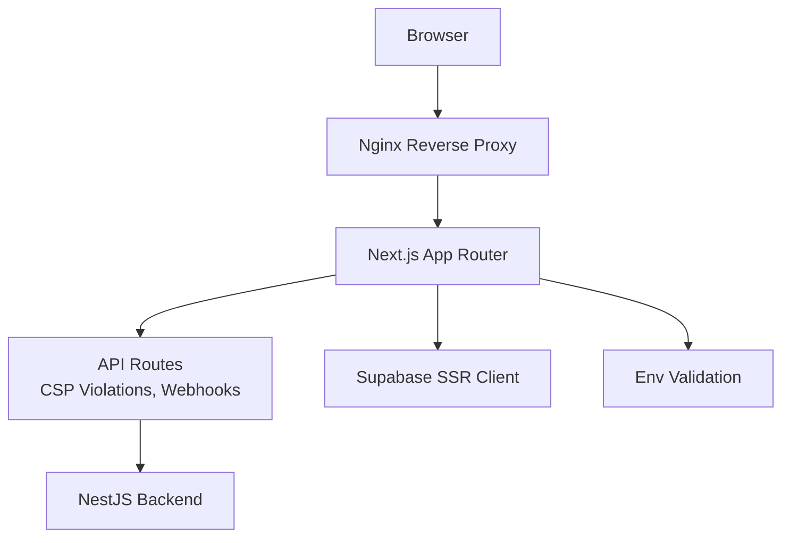

[No sources needed since this diagram shows conceptual workflow, not actual code structure]

**Section sources**

- [next.config.mjs](file://apps/portal/next.config.mjs)
- [nginx.conf](file://config/nginx.conf)
- [route.ts](file://apps/portal/app/api/csp-violations/route.ts)
- [security.controller.ts](file://apps/api/src/security/security.controller.ts)
- [cors.ts](file://apps/portal/lib/api/cors.ts)
- [env.ts](file://apps/portal/lib/env.ts)
- [middleware.ts](file://packages/supabase/src/middleware.ts)

## Core Components

- Global security headers and CSP are configured in Next.js via the headers function. Production uses an enforced CSP; development uses a report-only policy with a reporting endpoint.
- Nginx adds additional security headers and enforces HTTPS redirection.
- A shared CORS helper sets Access-Control-Allow-\* headers for API responses.
- The CSP violation reporting endpoint validates incoming reports and returns 204 as required by the spec.
- Environment variables are validated at runtime using a schema, failing fast in production when required values are missing.
- Supabase SSR middleware configures cookies with HttpOnly, Secure, and SameSite=Lax to mitigate XSS and CSRF risks.

**Section sources**

- [next.config.mjs](file://apps/portal/next.config.mjs)
- [nginx.conf](file://config/nginx.conf)
- [cors.ts](file://apps/portal/lib/api/cors.ts)
- [route.ts](file://apps/portal/app/api/csp-violations/route.ts)
- [env.ts](file://apps/portal/lib/env.ts)
- [middleware.ts](file://packages/supabase/src/middleware.ts)

## Architecture Overview

The request flow includes reverse proxy security headers, Next.js global headers, and route-level validations. CSP violations are reported back to a dedicated endpoint that logs structured data without exposing sensitive information.

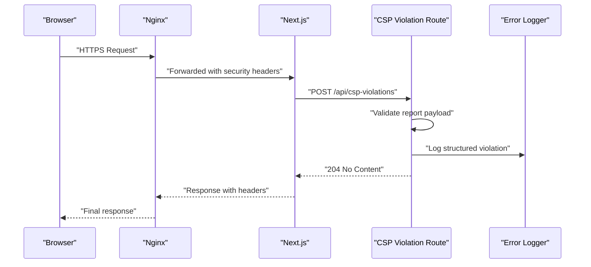

**Diagram sources**

- [next.config.mjs](file://apps/portal/next.config.mjs)
- [nginx.conf](file://config/nginx.conf)
- [route.ts](file://apps/portal/app/api/csp-violations/route.ts)

**Section sources**

- [next.config.mjs](file://apps/portal/next.config.mjs)
- [nginx.conf](file://config/nginx.conf)
- [route.ts](file://apps/portal/app/api/csp-violations/route.ts)

## Detailed Component Analysis

### Security Headers Configuration (Next.js)

- Global headers include X-Content-Type-Options, X-Frame-Options, Strict-Transport-Security, Referrer-Policy, and Permissions-Policy.
- CSP is set in production mode; in non-production, a report-only variant is used with a reporting URI pointing to the CSP violations endpoint.
- Cache-Control directives are applied to static assets, manifest, service worker, login page, health checks, and sensitive API routes.

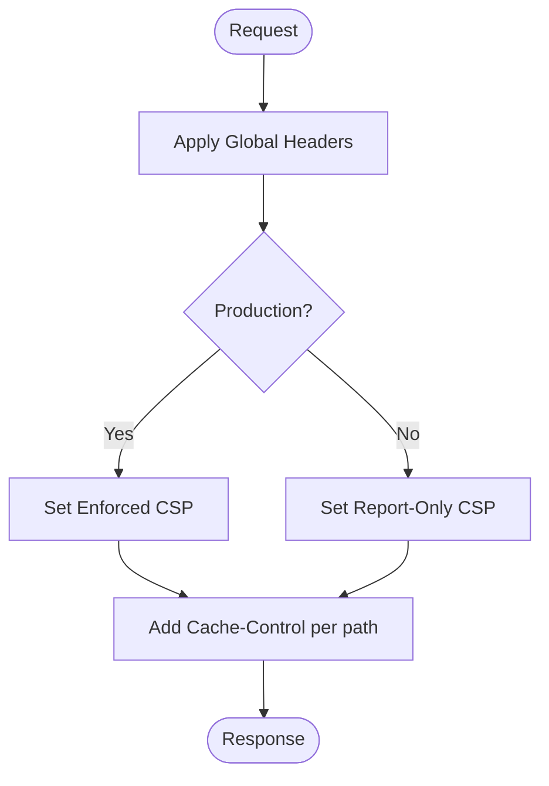

**Diagram sources**

- [next.config.mjs](file://apps/portal/next.config.mjs)

**Section sources**

- [next.config.mjs](file://apps/portal/next.config.mjs)

### Security Headers Configuration (Nginx)

- HTTP to HTTPS redirect is enforced.
- Additional security headers are added: X-Frame-Options, X-Content-Type-Options, X-XSS-Protection, Referrer-Policy, and HSTS.
- Proxy settings forward client IP and protocol information to upstream services.

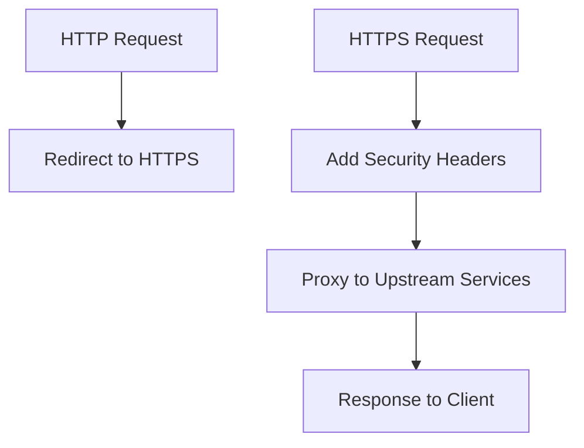

**Diagram sources**

- [nginx.conf](file://config/nginx.conf)

**Section sources**

- [nginx.conf](file://config/nginx.conf)

### CORS Settings

- A shared helper applies Access-Control-Allow-Origin, Methods, and Headers to API responses.
- The origin is taken from the incoming request header or defaults to allow all origins when absent.

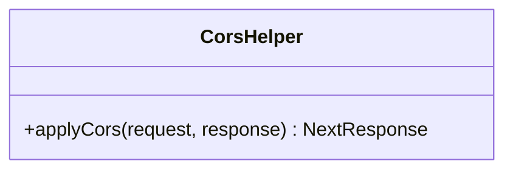

**Diagram sources**

- [cors.ts](file://apps/portal/lib/api/cors.ts)

**Section sources**

- [cors.ts](file://apps/portal/lib/api/cors.ts)

### CSP Violation Reporting Endpoint

- Accepts POST requests containing CSP violation reports.
- Validates the presence of a report object and extracts key fields for logging.
- Always returns 204 No Content, even on malformed payloads, as required by the CSP specification.
- Logs structured violation data for monitoring and alerting.

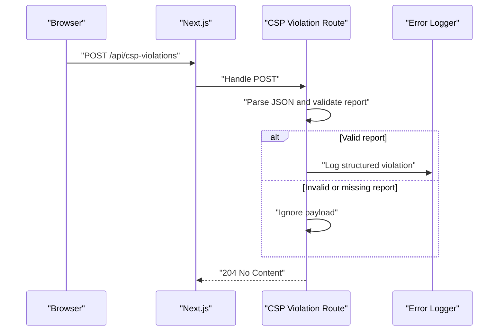

**Diagram sources**

- [route.ts](file://apps/portal/app/api/csp-violations/route.ts)

**Section sources**

- [route.ts](file://apps/portal/app/api/csp-violations/route.ts)

### Backend CSP Violation Handler (NestJS)

- Provides a public endpoint to receive CSP violation reports.
- Parses the report payload and logs warnings with structured context.
- Returns NO_CONTENT status implicitly by default behavior.

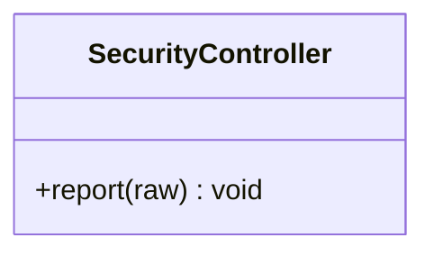

**Diagram sources**

- [security.controller.ts](file://apps/api/src/security/security.controller.ts)

**Section sources**

- [security.controller.ts](file://apps/api/src/security/security.controller.ts)

### Cookie Security and Session Handling (Supabase SSR)

- Cookies are set with HttpOnly, Secure (in production), and SameSite=Lax to reduce XSS and CSRF risks.
- The SSR client integrates with Next.js request/response lifecycle to propagate cookies securely.

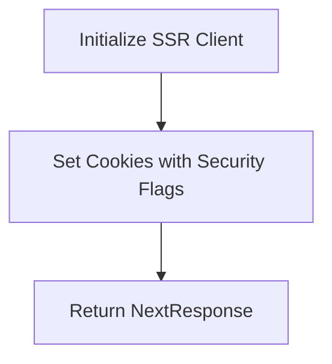

**Diagram sources**

- [middleware.ts](file://packages/supabase/src/middleware.ts)

**Section sources**

- [middleware.ts](file://packages/supabase/src/middleware.ts)

### Environment Variable Validation and Secure Configuration Management

- Runtime validation ensures required variables are present in production and provides sensible defaults in development.
- Feature flags and numeric values are coerced and transformed safely.
- Errors are surfaced early with descriptive messages, aiding operational reliability.

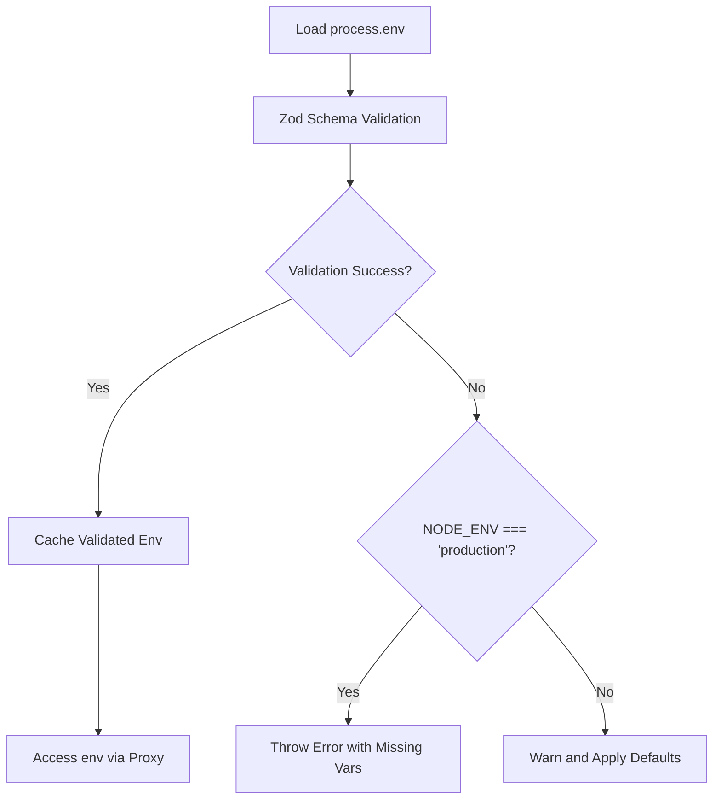

**Diagram sources**

- [env.ts](file://apps/portal/lib/env.ts)

**Section sources**

- [env.ts](file://apps/portal/lib/env.ts)

### Input Validation Patterns for API Endpoints and Webhooks

- API endpoints validate required fields and formats before processing.
- Webhook handlers enforce authentication and validate payload structures, returning appropriate error codes for invalid inputs.
- Tests assert expected behaviors such as 401 for unauthenticated requests and 400 for malformed payloads.

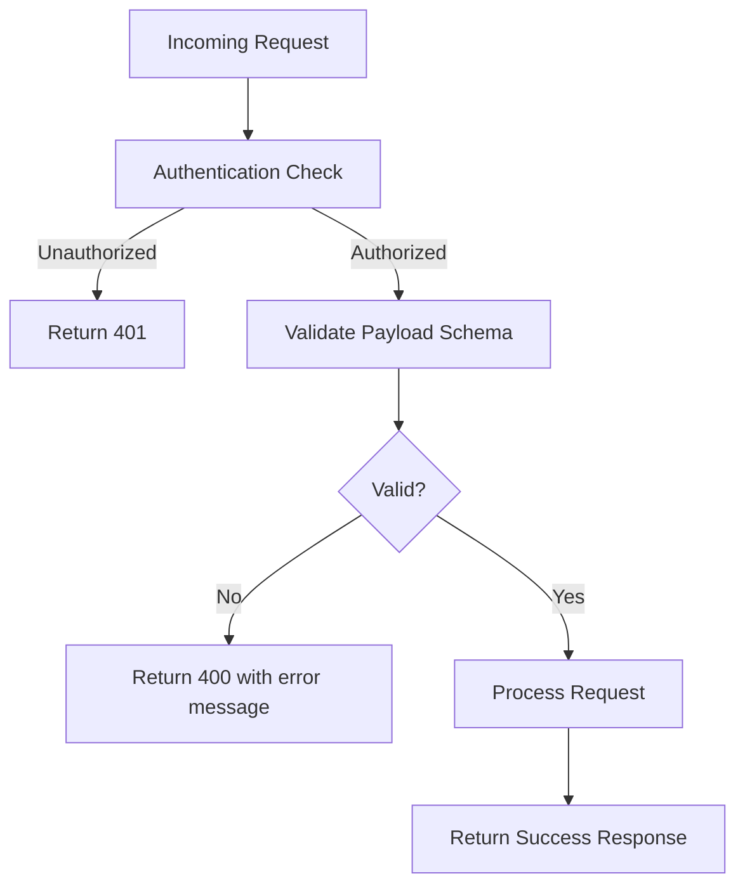

[No sources needed since this diagram shows conceptual workflow, not actual code structure]

**Section sources**

- [route.ts](file://apps/portal/app/api/csp-violations/route.ts)

### Output Sanitization and XSS Prevention

- React’s default rendering prevents direct execution of user-supplied HTML, mitigating XSS risks.
- When dynamic content must be rendered, ensure it is sanitized server-side or through trusted libraries before insertion into the DOM.
- Avoid dangerouslySetInnerHTML unless absolutely necessary and only with pre-sanitized content.

[No sources needed since this section provides general guidance]

### Protection Against Common Web Vulnerabilities

- CSRF Mitigation:
  - Use SameSite=Lax cookies and avoid state-changing operations via GET.
  - For cross-site requests, implement CSRF tokens where applicable.
- SQL Injection Prevention:
  - Use parameterized queries and ORM abstractions; never concatenate user input into SQL strings.
- Path Traversal Prevention:
  - Validate and normalize file paths; restrict access to allowed directories; reject inputs containing traversal sequences.

[No sources needed since this section provides general guidance]

## Dependency Analysis

Security components interact as follows:

- Next.js headers apply globally and conditionally based on environment.
- Nginx enforces HTTPS and adds complementary security headers.
- API routes rely on shared helpers like CORS and environment validation.
- CSP violation reporting flows from browsers to Next.js and optionally to backend services.

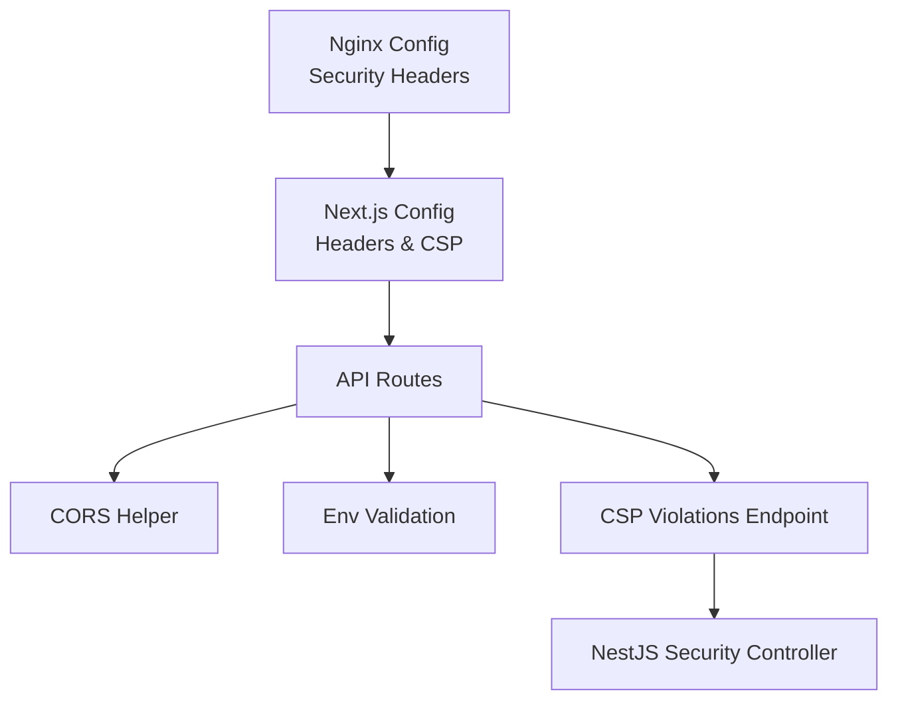

**Diagram sources**

- [next.config.mjs](file://apps/portal/next.config.mjs)
- [nginx.conf](file://config/nginx.conf)
- [cors.ts](file://apps/portal/lib/api/cors.ts)
- [env.ts](file://apps/portal/lib/env.ts)
- [route.ts](file://apps/portal/app/api/csp-violations/route.ts)
- [security.controller.ts](file://apps/api/src/security/security.controller.ts)

**Section sources**

- [next.config.mjs](file://apps/portal/next.config.mjs)
- [nginx.conf](file://config/nginx.conf)
- [cors.ts](file://apps/portal/lib/api/cors.ts)
- [env.ts](file://apps/portal/lib/env.ts)
- [route.ts](file://apps/portal/app/api/csp-violations/route.ts)
- [security.controller.ts](file://apps/api/src/security/security.controller.ts)

## Performance Considerations

- CSP report-only mode allows tuning policies without breaking functionality during development.
- Caching headers optimize static assets while protecting sensitive routes from caching.
- Logging CSP violations should be rate-limited and sampled in high-traffic environments to avoid overhead.

[No sources needed since this section provides general guidance]

## Troubleshooting Guide

- If CSP blocks resources, check the report-only policy and review violations logged by the CSP endpoint.
- Ensure HSTS preload is enabled only after verifying all subdomains support HTTPS.
- Validate environment variables early; failures in production will halt startup with clear messages.
- Confirm CORS settings match the intended origins and methods for API consumers.

**Section sources**

- [route.ts](file://apps/portal/app/api/csp-violations/route.ts)
- [env.ts](file://apps/portal/lib/env.ts)
- [cors.ts](file://apps/portal/lib/api/cors.ts)

## Conclusion

The application implements robust security headers at both the Next.js and Nginx layers, with CSP configured in report-only mode during development and enforced in production. Input validation is applied at API boundaries, and environment variables are validated at runtime to fail fast in production. Cookie security flags and CORS helpers further harden the stack. Following the patterns outlined here will help maintain a strong security posture against common web vulnerabilities.
