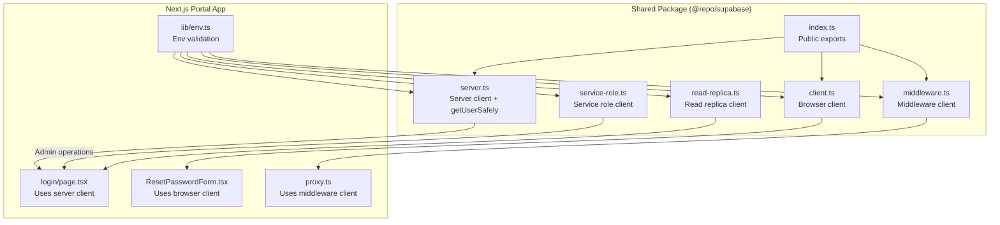
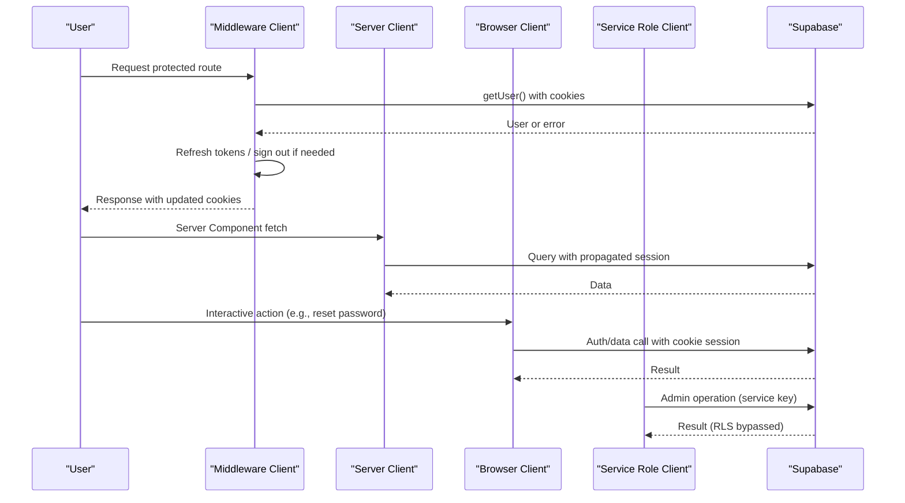
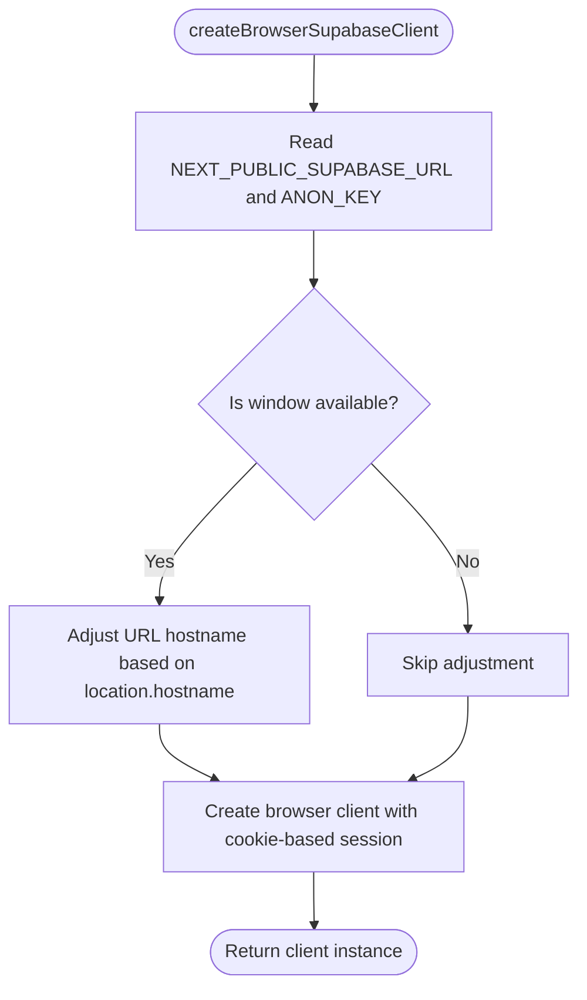
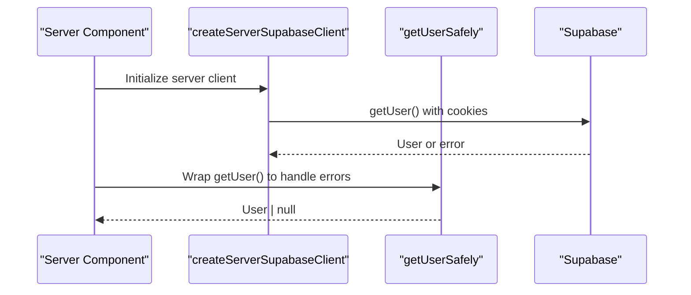
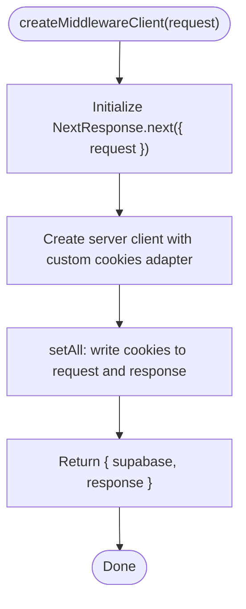
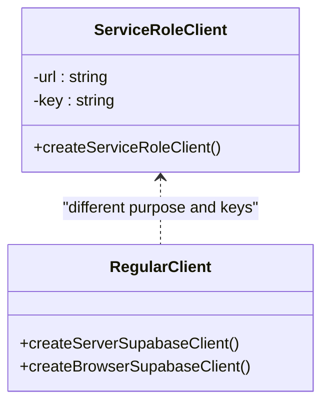
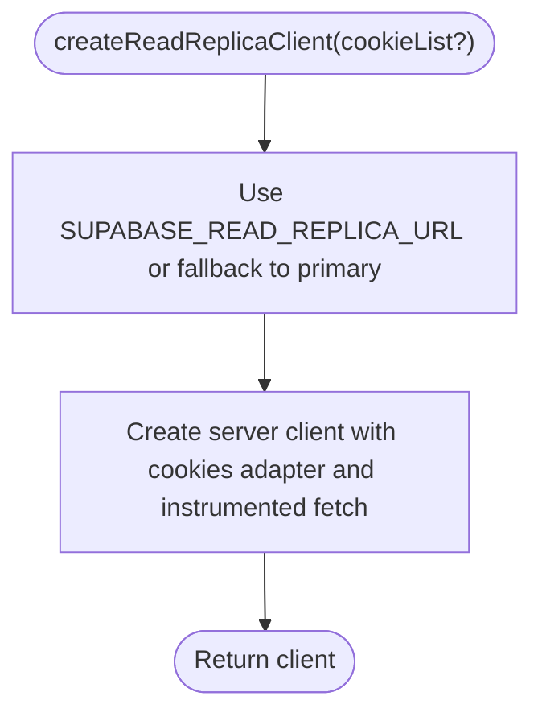
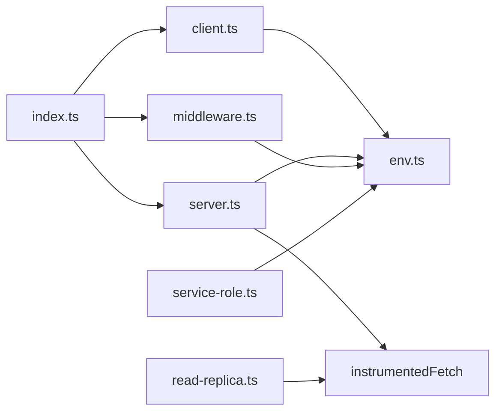

# Database Client Configuration

<cite>
**Referenced Files in This Document**
- [client.ts](file://packages/supabase/src/client.ts)
- [server.ts](file://packages/supabase/src/server.ts)
- [middleware.ts](file://packages/supabase/src/middleware.ts)
- [service-role.ts](file://packages/supabase/src/service-role.ts)
- [read-replica.ts](file://packages/supabase/src/read-replica.ts)
- [index.ts](file://packages/supabase/src/index.ts)
- [env.ts](file://apps/portal/lib/env.ts)
- [login/page.tsx](file://apps/portal/app/(auth)/login/page.tsx)
- [ResetPasswordForm.tsx](file://apps/portal/app/(auth)/reset-password/ResetPasswordForm.tsx)
- [proxy.ts](file://apps/portal/proxy.ts)
</cite>

## Table of Contents

1. [Introduction](#introduction)
2. [Project Structure](#project-structure)
3. [Core Components](#core-components)
4. [Architecture Overview](#architecture-overview)
5. [Detailed Component Analysis](#detailed-component-analysis)
6. [Dependency Analysis](#dependency-analysis)
7. [Performance Considerations](#performance-considerations)
8. [Troubleshooting Guide](#troubleshooting-guide)
9. [Conclusion](#conclusion)

## Introduction

This document explains how the Supabase database client is configured and initialized across server-side, client-side, middleware, and admin contexts within a Next.js application. It covers connection patterns, authentication context propagation via cookies, environment-specific configuration, read replicas, and the service role client for privileged operations. It also provides guidance on error handling, connection management, security considerations, and best practices for managing database connections in Next.js applications.

## Project Structure

The Supabase client configuration is centralized in a shared package and consumed by the Next.js portal app:

- Browser client: creates a browser-aware client with cookie-based session persistence
- Server client: integrates with Next.js request lifecycle and headers to propagate auth context
- Middleware client: bridges Next.js requests/responses for route protection and token refresh
- Service role client: bypasses RLS for admin-only operations using a service key
- Read replica client: routes read queries to a replica when configured
- Environment validation: ensures required variables are present at runtime

**Diagram sources**

- [client.ts:1-40](file://packages/supabase/src/client.ts#L1-L40)
- [server.ts:1-100](file://packages/supabase/src/server.ts#L1-L100)
- [middleware.ts:1-44](file://packages/supabase/src/middleware.ts#L1-L44)
- [service-role.ts:1-28](file://packages/supabase/src/service-role.ts#L1-L28)
- [read-replica.ts:1-49](file://packages/supabase/src/read-replica.ts#L1-L49)
- [index.ts:1-7](file://packages/supabase/src/index.ts#L1-L7)
- [login/page.tsx:1-196](<file://apps/portal/app/(auth)/login/page.tsx#L1-L196>)
- [ResetPasswordForm.tsx:1-185](<file://apps/portal/app/(auth)/reset-password/ResetPasswordForm.tsx#L1-L185>)
- [proxy.ts:151-196](file://apps/portal/proxy.ts#L151-L196)
- [env.ts:1-149](file://apps/portal/lib/env.ts#L1-L149)

**Section sources**

- [client.ts:1-40](file://packages/supabase/src/client.ts#L1-L40)
- [server.ts:1-100](file://packages/supabase/src/server.ts#L1-L100)
- [middleware.ts:1-44](file://packages/supabase/src/middleware.ts#L1-L44)
- [service-role.ts:1-28](file://packages/supabase/src/service-role.ts#L1-L28)
- [read-replica.ts:1-49](file://packages/supabase/src/read-replica.ts#L1-L49)
- [index.ts:1-7](file://packages/supabase/src/index.ts#L1-L7)
- [env.ts:1-149](file://apps/portal/lib/env.ts#L1-L149)
- [login/page.tsx:1-196](<file://apps/portal/app/(auth)/login/page.tsx#L1-L196>)
- [ResetPasswordForm.tsx:1-185](<file://apps/portal/app/(auth)/reset-password/ResetPasswordForm.tsx#L1-L185>)
- [proxy.ts:151-196](file://apps/portal/proxy.ts#L151-L196)

## Core Components

- Browser client: Creates a client for “use client” components and hooks. Uses cookie-based session storage and adjusts URL hostnames for local vs production environments.
- Server client: Integrates with Next.js cookies and headers to propagate authenticated sessions during server rendering and server actions. Includes an instrumented fetch wrapper for observability.
- Middleware client: Bridges NextRequest/NextResponse to maintain session cookies across middleware and route handlers. Enforces secure cookie flags in production.
- Service role client: Initializes a client with the service role key for admin operations that bypass Row Level Security (RLS). Disables session auto-refresh and persistence.
- Read replica client: Routes read-only queries to a configured replica endpoint while preserving auth context; falls back to primary if not set.
- Public exports: Centralizes imports to avoid leaking server-only dependencies into client bundles.

Key responsibilities:

- Environment-driven configuration
- Secure cookie handling
- Auth context propagation
- Observability instrumentation
- Admin-only access control

**Section sources**

- [client.ts:1-40](file://packages/supabase/src/client.ts#L1-L40)
- [server.ts:1-100](file://packages/supabase/src/server.ts#L1-L100)
- [middleware.ts:1-44](file://packages/supabase/src/middleware.ts#L1-L44)
- [service-role.ts:1-28](file://packages/supabase/src/service-role.ts#L1-L28)
- [read-replica.ts:1-49](file://packages/supabase/src/read-replica.ts#L1-L49)
- [index.ts:1-7](file://packages/supabase/src/index.ts#L1-L7)

## Architecture Overview

The application uses three distinct client contexts plus an admin client:

- Browser client for interactive UI features and real-time subscriptions
- Server client for data fetching and mutations in Server Components and Server Actions
- Middleware client for route protection and session refresh
- Service role client for administrative tasks that require elevated privileges

**Diagram sources**

- [middleware.ts:1-44](file://packages/supabase/src/middleware.ts#L1-L44)
- [server.ts:1-100](file://packages/supabase/src/server.ts#L1-L100)
- [client.ts:1-40](file://packages/supabase/src/client.ts#L1-L40)
- [service-role.ts:1-28](file://packages/supabase/src/service-role.ts#L1-L28)

## Detailed Component Analysis

### Browser Client

- Purpose: Provide a Supabase client for client components and hooks.
- Behavior:
  - Reads public URL and anon key from environment.
  - Adjusts hostname for localhost vs deployed hosts.
  - Persists session via HttpOnly cookies instead of localStorage/sessionStorage.
- Usage examples:
  - Password reset flow in a client component.

**Diagram sources**

- [client.ts:1-40](file://packages/supabase/src/client.ts#L1-L40)

**Section sources**

- [client.ts:1-40](file://packages/supabase/src/client.ts#L1-L40)
- [ResetPasswordForm.tsx:1-185](<file://apps/portal/app/(auth)/reset-password/ResetPasswordForm.tsx#L1-L185>)

### Server Client

- Purpose: Provide a Supabase client for Server Components and Server Actions with proper cookie propagation.
- Behavior:
  - Uses Next.js cookies API to read/write session cookies.
  - Wraps fetch with instrumentation to record DB query metrics.
  - Provides getUserSafely to handle refresh token errors gracefully.
- Usage examples:
  - Login page checks system availability and user session safely.

**Diagram sources**

- [server.ts:1-100](file://packages/supabase/src/server.ts#L1-L100)
- [login/page.tsx:1-196](<file://apps/portal/app/(auth)/login/page.tsx#L1-L196>)

**Section sources**

- [server.ts:1-100](file://packages/supabase/src/server.ts#L1-L100)
- [login/page.tsx:1-196](<file://apps/portal/app/(auth)/login/page.tsx#L1-L196>)

### Middleware Client

- Purpose: Bridge Next.js request/response lifecycle to maintain Supabase session cookies during middleware execution.
- Behavior:
  - Reads cookies from NextRequest and writes to NextResponse.
  - Enforces secure cookie flags (HttpOnly, Secure in production, SameSite=Lax).
  - Returns both supabase client and response proxy for downstream use.
- Usage examples:
  - Session validation and sign-out redirect logic in proxy middleware.

**Diagram sources**

- [middleware.ts:1-44](file://packages/supabase/src/middleware.ts#L1-L44)
- [proxy.ts:151-196](file://apps/portal/proxy.ts#L151-L196)

**Section sources**

- [middleware.ts:1-44](file://packages/supabase/src/middleware.ts#L1-L44)
- [proxy.ts:151-196](file://apps/portal/proxy.ts#L151-L196)

### Service Role Client

- Purpose: Initialize a client with the service role key for admin operations that bypass RLS.
- Behavior:
  - Requires SUPABASE_URL and SUPABASE_SERVICE_KEY.
  - Disables auto-refresh and session persistence.
  - Throws a clear error if required env vars are missing.
- Differences from regular clients:
  - No user session propagation.
  - Full database privileges (bypasses RLS).
  - Intended for server-only admin tasks.

**Diagram sources**

- [service-role.ts:1-28](file://packages/supabase/src/service-role.ts#L1-L28)
- [server.ts:1-100](file://packages/supabase/src/server.ts#L1-L100)
- [client.ts:1-40](file://packages/supabase/src/client.ts#L1-L40)

**Section sources**

- [service-role.ts:1-28](file://packages/supabase/src/service-role.ts#L1-L28)

### Read Replica Client

- Purpose: Route read-only queries to a configured replica endpoint while preserving auth context.
- Behavior:
  - Uses SUPABASE_READ_REPLICA_URL if set; otherwise falls back to primary.
  - Reuses instrumented fetch for observability.
  - Accepts optional cookie list for contexts without Next.js cookies API.
- Best practice:
  - Use for dashboards and reports.
  - Always use createServerSupabaseClient for mutations.

**Diagram sources**

- [read-replica.ts:1-49](file://packages/supabase/src/read-replica.ts#L1-L49)
- [server.ts:1-100](file://packages/supabase/src/server.ts#L1-L100)

**Section sources**

- [read-replica.ts:1-49](file://packages/supabase/src/read-replica.ts#L1-L49)
- [server.ts:1-100](file://packages/supabase/src/server.ts#L1-L100)

### Environment Configuration

- Validation: Runtime schema validates required and optional variables.
- Public vs private:
  - Public variables (NEXT*PUBLIC*\*) are safe for client bundles.
  - Server-only variables (SUPABASE_SERVICE_KEY, DATABASE_URL) must never be exposed to the client.
- Defaults:
  - Dev-friendly defaults for public variables; fail-fast in production for critical secrets.

**Section sources**

- [env.ts:1-149](file://apps/portal/lib/env.ts#L1-L149)

## Dependency Analysis

- Exports centralization prevents leaking server-only dependencies into client bundles.
- Shared utilities (instrumentedFetch) ensure consistent observability across server and read replica clients.
- Cookie adapters differ per context but share the same underlying Supabase SSR client.

**Diagram sources**

- [index.ts:1-7](file://packages/supabase/src/index.ts#L1-L7)
- [server.ts:1-100](file://packages/supabase/src/server.ts#L1-L100)
- [read-replica.ts:1-49](file://packages/supabase/src/read-replica.ts#L1-L49)
- [client.ts:1-40](file://packages/supabase/src/client.ts#L1-L40)
- [env.ts:1-149](file://apps/portal/lib/env.ts#L1-L149)

**Section sources**

- [index.ts:1-7](file://packages/supabase/src/index.ts#L1-L7)
- [server.ts:1-100](file://packages/supabase/src/server.ts#L1-L100)
- [read-replica.ts:1-49](file://packages/supabase/src/read-replica.ts#L1-L49)
- [client.ts:1-40](file://packages/supabase/src/client.ts#L1-L40)
- [env.ts:1-149](file://apps/portal/lib/env.ts#L1-L149)

## Performance Considerations

- Prefer read replica client for heavy read workloads (dashboards, reports).
- Use getUserSafely to avoid crashes due to invalid refresh tokens.
- Avoid creating multiple client instances per request; reuse where possible.
- Instrumented fetch records DB query durations and table names for observability.

[No sources needed since this section provides general guidance]

## Troubleshooting Guide

Common issues and resolutions:

- Missing environment variables:
  - Ensure NEXT_PUBLIC_SUPABASE_URL and NEXT_PUBLIC_SUPABASE_ANON_KEY are set for browser/server clients.
  - Ensure SUPABASE_URL and SUPABASE_SERVICE_KEY are set for service role client.
- Invalid refresh token errors:
  - Use getUserSafely to treat refresh token errors as unauthenticated rather than fatal.
- Middleware cookie propagation:
  - Verify secure cookie flags are applied in production (HttpOnly, Secure, SameSite=Lax).
- System unavailable state:
  - If getUserSafely throws, surface a graceful “system unavailable” message to users.

**Section sources**

- [server.ts:1-100](file://packages/supabase/src/server.ts#L1-L100)
- [middleware.ts:1-44](file://packages/supabase/src/middleware.ts#L1-L44)
- [login/page.tsx:1-196](<file://apps/portal/app/(auth)/login/page.tsx#L1-L196>)

## Conclusion

This configuration establishes secure, efficient, and observable Supabase client usage across all execution contexts in a Next.js application. By separating concerns—browser, server, middleware, and service role—and enforcing strict environment validation and cookie security, the system balances usability, performance, and safety. Adopting read replicas for reads and service role clients for admin tasks further strengthens scalability and security posture.
