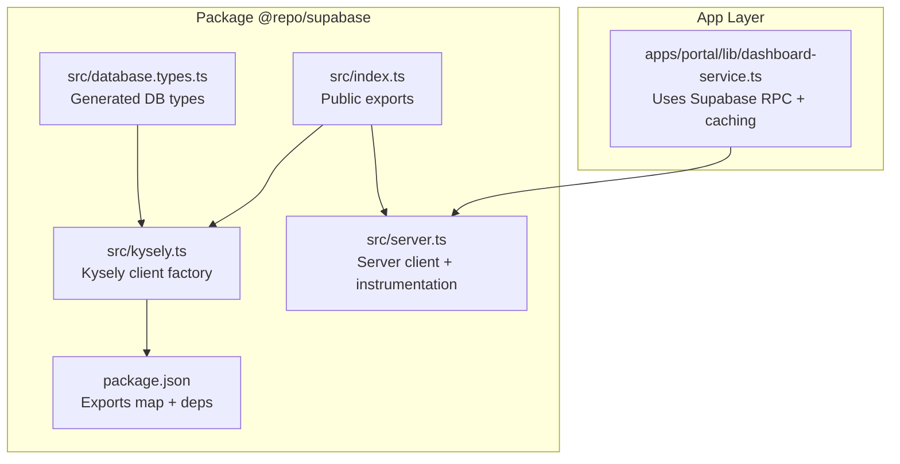
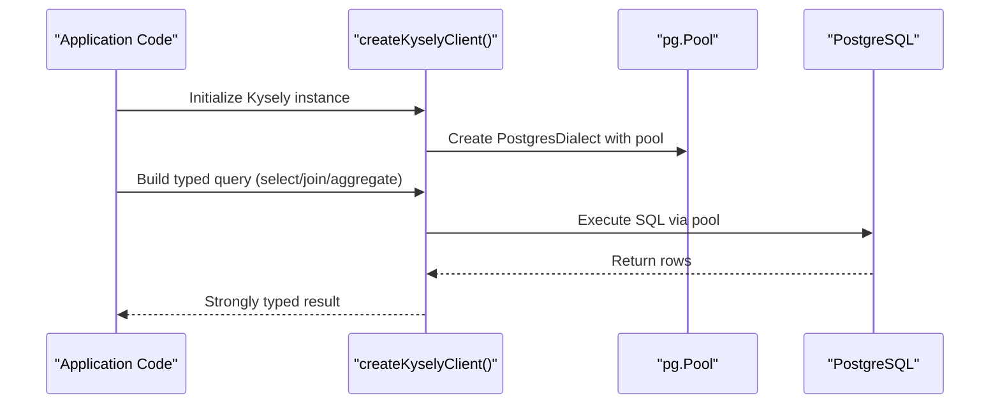
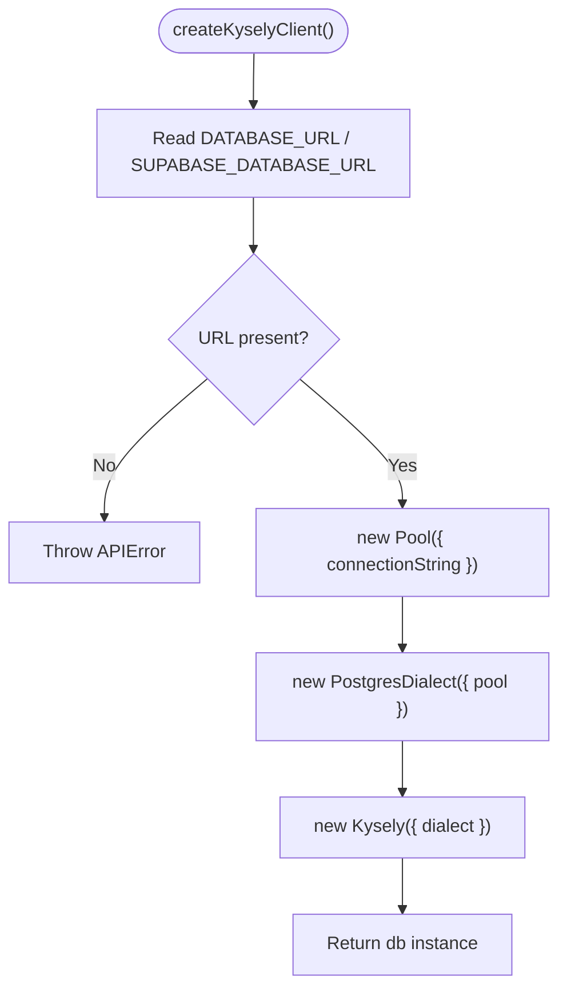
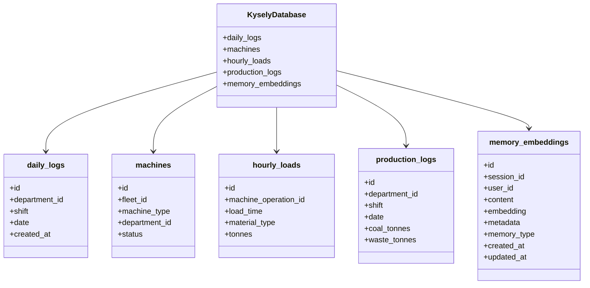
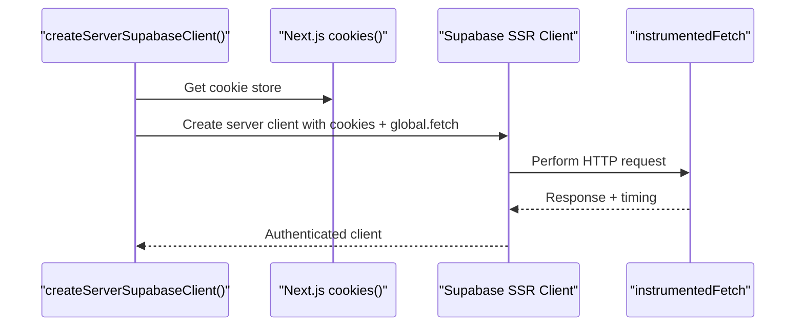
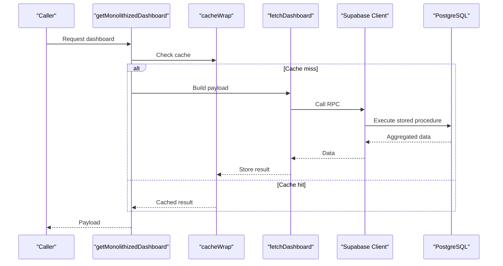
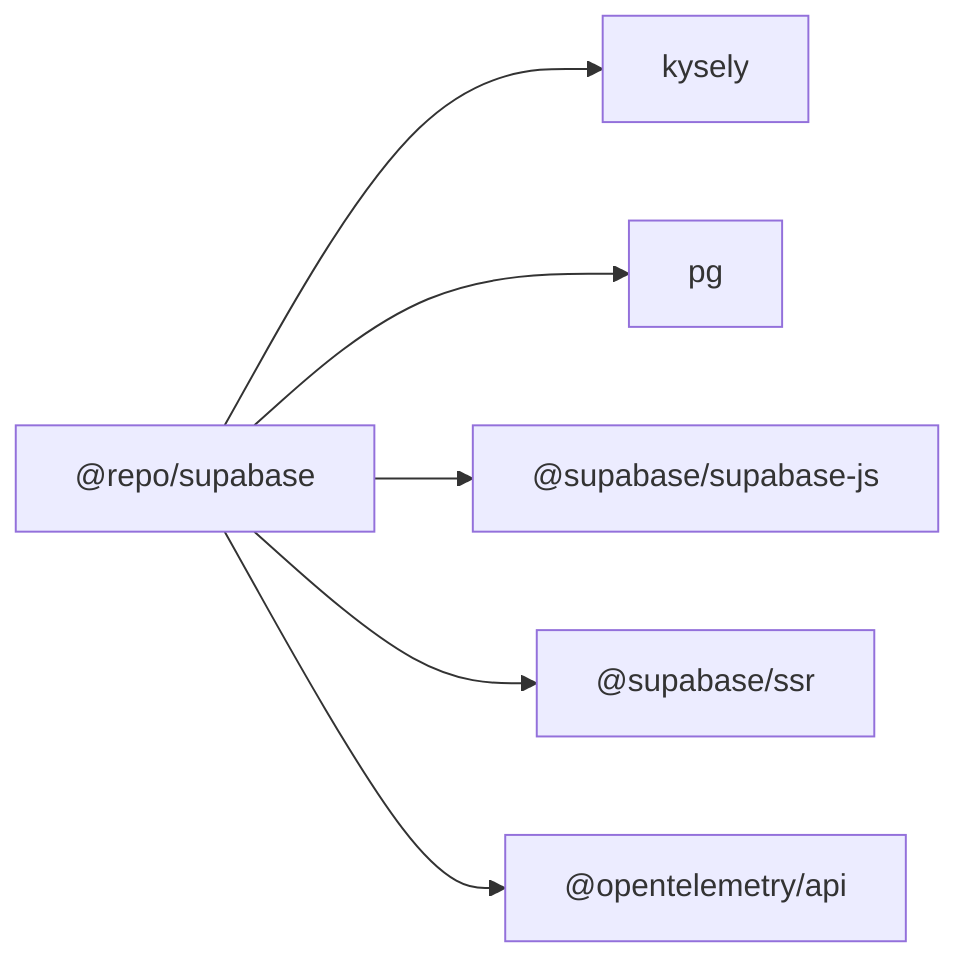

# Kysely Query Builder Integration

<cite>
**Referenced Files in This Document**
- [kysely.ts](file://packages/supabase/src/kysely.ts)
- [database.types.ts](file://packages/supabase/src/database.types.ts)
- [index.ts](file://packages/supabase/src/index.ts)
- [package.json](file://packages/supabase/package.json)
- [server.ts](file://packages/supabase/src/server.ts)
- [dashboard-service.ts](file://apps/portal/lib/dashboard-service.ts)
</cite>

## Table of Contents

1. [Introduction](#introduction)
2. [Project Structure](#project-structure)
3. [Core Components](#core-components)
4. [Architecture Overview](#architecture-overview)
5. [Detailed Component Analysis](#detailed-component-analysis)
6. [Dependency Analysis](#dependency-analysis)
7. [Performance Considerations](#performance-considerations)
8. [Troubleshooting Guide](#troubleshooting-guide)
9. [Conclusion](#conclusion)
10. [Appendices](#appendices)

## Introduction

This document explains how the project integrates Kysely with Supabase to enable type-safe, complex SQL queries (aggregations, joins, CTEs) against the same PostgreSQL database used by the Supabase client. It covers:

- Typed query building patterns and IDE support
- Relationship between Kysely types and Supabase schema types
- Complex joins and aggregations
- Transaction handling strategies
- Common data access patterns, performance optimization techniques, and debugging strategies
- Migration compatibility, query planning considerations, and best practices for maintainable database code

## Project Structure

The integration is implemented as a small package that exposes:

- A Kysely client factory for direct Postgres access via pg pool
- The generated Supabase TypeScript types for reference and alignment
- Server-side helpers for authenticated requests and tracing

**Diagram sources**

- [kysely.ts:1-101](file://packages/supabase/src/kysely.ts#L1-L101)
- [database.types.ts:1-800](file://packages/supabase/src/database.types.ts#L1-L800)
- [index.ts:1-7](file://packages/supabase/src/index.ts#L1-L7)
- [server.ts:1-100](file://packages/supabase/src/server.ts#L1-L100)
- [package.json:1-41](file://packages/supabase/package.json#L1-L41)
- [dashboard-service.ts:1-100](file://apps/portal/lib/dashboard-service.ts#L1-L100)

**Section sources**

- [kysely.ts:1-101](file://packages/supabase/src/kysely.ts#L1-L101)
- [database.types.ts:1-800](file://packages/supabase/src/database.types.ts#L1-L800)
- [index.ts:1-7](file://packages/supabase/src/index.ts#L1-L7)
- [server.ts:1-100](file://packages/supabase/src/server.ts#L1-L100)
- [package.json:1-41](file://packages/supabase/package.json#L1-L41)
- [dashboard-service.ts:1-100](file://apps/portal/lib/dashboard-service.ts#L1-L100)

## Core Components

- Kysely client factory: Creates a Kysely instance configured with a Postgres dialect and connection pool. It requires a database URL from environment variables and returns a strongly typed db object based on a local table interface.
- KyselyDatabase interface: A curated subset of tables mirrored for compile-time validation of complex queries.
- Generated Supabase types: Full schema types exported from Supabase’s generator; useful for cross-referencing and keeping Kysely types aligned.
- Server client and instrumentation: Provides an authenticated server-side Supabase client and fetch instrumentation for observability.
- Public exports: Centralized entry points for clients and utilities.

Key responsibilities:

- Provide a single place to configure Kysely and its connection pool
- Keep Kysely table definitions minimal but sufficient for complex queries
- Maintain alignment with Supabase-generated types to reduce drift
- Offer server-side helpers for authenticated operations and tracing

**Section sources**

- [kysely.ts:19-101](file://packages/supabase/src/kysely.ts#L19-L101)
- [database.types.ts:1-800](file://packages/supabase/src/database.types.ts#L1-L800)
- [index.ts:1-7](file://packages/supabase/src/index.ts#L1-L7)
- [server.ts:1-100](file://packages/supabase/src/server.ts#L1-L100)

## Architecture Overview

The system supports two complementary data access paths:

- Supabase JS client for standard CRUD and RLS-aware queries
- Kysely for advanced SQL (joins, aggregations, CTEs) using the same database

**Diagram sources**

- [kysely.ts:87-101](file://packages/supabase/src/kysely.ts#L87-L101)

## Detailed Component Analysis

### Kysely Client Factory

- Purpose: Expose a simple function to create a Kysely instance bound to the Supabase Postgres database.
- Configuration: Reads DATABASE_URL or SUPABASE_DATABASE_URL from environment; constructs a pg.Pool with a max size; wires it into Kysely’s PostgresDialect.
- Type safety: Uses a local KyselyDatabase interface to constrain table/column names at compile time.

**Diagram sources**

- [kysely.ts:87-101](file://packages/supabase/src/kysely.ts#L87-L101)

**Section sources**

- [kysely.ts:87-101](file://packages/supabase/src/kysely.ts#L87-L101)

### KyselyDatabase Interface

- Purpose: Mirror key tables needed for complex queries.
- Design: Each table maps columns to Kysely-friendly types (e.g., Generated for auto-incremented IDs, ColumnType for timestamps). An index signature allows unknown extra columns without breaking type inference.
- Maintenance: Add new tables here as needed; Kysely validates only at compile time.

**Diagram sources**

- [kysely.ts:21-66](file://packages/supabase/src/kysely.ts#L21-L66)

**Section sources**

- [kysely.ts:21-66](file://packages/supabase/src/kysely.ts#L21-L66)

### Supabase Generated Types Alignment

- Source: database.types.ts contains the full schema types generated by Supabase.
- Strategy: Use these types to keep KyselyDatabase in sync. For example, ensure column names and nullability match the Row/Insert/Update shapes.
- Benefit: Reduces runtime errors and improves IDE autocomplete across both Supabase client and Kysely queries.

Practical tips:

- When adding a new table, add it to KyselyDatabase and verify against Database.public.Tables.<table>.Row.
- Prefer explicit types over unknown where possible to maximize IDE support.

**Section sources**

- [database.types.ts:1-800](file://packages/supabase/src/database.types.ts#L1-L800)

### Server Client and Instrumentation

- Purpose: Provide a server-side Supabase client integrated with Next.js cookies and custom fetch instrumentation.
- Observability: Wraps fetch to record metrics and optionally integrate with a global DB query recorder.

**Diagram sources**

- [server.ts:49-80](file://packages/supabase/src/server.ts#L49-L80)

**Section sources**

- [server.ts:1-100](file://packages/supabase/src/server.ts#L1-L100)

### Example Usage Patterns

- Dashboard service demonstrates a typical pattern: authenticate via Supabase, call an RPC for heavy aggregation, cache results, and wrap with tracing. While this uses the Supabase client, the same approach applies when switching to Kysely for complex SQL.

**Diagram sources**

- [dashboard-service.ts:45-99](file://apps/portal/lib/dashboard-service.ts#L45-L99)

**Section sources**

- [dashboard-service.ts:1-100](file://apps/portal/lib/dashboard-service.ts#L1-L100)

## Dependency Analysis

- Package dependencies include kysely and pg, wired through the Kysely client factory.
- Exports are explicitly mapped so consumers can import the Kysely client directly without pulling unnecessary runtime code.

**Diagram sources**

- [package.json:1-41](file://packages/supabase/package.json#L1-L41)

**Section sources**

- [package.json:1-41](file://packages/supabase/package.json#L1-L41)

## Performance Considerations

- Connection pooling: The Kysely client creates a pg.Pool with a fixed maximum size. Tune max according to workload and database capacity.
- Query complexity: Prefer moving heavy logic into database functions/RPCs or views when possible; use Kysely for composing complex queries while keeping them readable.
- Caching: As demonstrated in the dashboard service, cache expensive aggregated payloads to reduce repeated DB load.
- Indexing and query planning: Ensure appropriate indexes on join/filter columns (e.g., department_id, machine_operation_id). Use EXPLAIN ANALYZE to validate plans for critical queries.
- Read replicas: If available, route read-heavy Kysely queries to a replica to offload the primary.

[No sources needed since this section provides general guidance]

## Troubleshooting Guide

- Missing database URL: The Kysely client throws an error if DATABASE_URL or SUPABASE_DATABASE_URL is not set. Ensure environment configuration is correct before initializing the client.
- Type mismatches: If Kysely reports unknown columns or incorrect types, align KyselyDatabase with the generated Supabase types.
- Authentication context: When mixing Kysely and Supabase client usage, ensure you understand which path enforces RLS. The Supabase client respects RLS; direct Kysely connections may bypass RLS depending on the user role used by the pool.
- Observability: Use the provided server-side fetch instrumentation to correlate HTTP calls with DB activity. Extend with OpenTelemetry spans around Kysely queries if needed.

**Section sources**

- [kysely.ts:87-94](file://packages/supabase/src/kysely.ts#L87-L94)
- [server.ts:6-47](file://packages/supabase/src/server.ts#L6-L47)

## Conclusion

The Kysely integration provides a robust, type-safe pathway for complex SQL against the Supabase-backed PostgreSQL database. By mirroring essential tables in a dedicated interface and aligning with Supabase-generated types, teams can write maintainable, IDE-supported queries. Combine this with careful pooling, caching, indexing, and observability to achieve high performance and reliability.

[No sources needed since this section summarizes without analyzing specific files]

## Appendices

### Best Practices for Maintainable Database Code

- Keep KyselyDatabase minimal and focused on tables used by complex queries.
- Regularly regenerate Supabase types and diff against KyselyDatabase to catch drift.
- Encapsulate complex queries in repository-style modules with clear return types.
- Use transactions for multi-step writes; leverage Kysely’s transaction APIs to ensure atomicity.
- Prefer database-level computations (functions/views) for heavy aggregations and call them via Kysely or RPC.

[No sources needed since this section provides general guidance]
