# Supabase Client & Database Access

<cite>
**Referenced Files in This Document**
- [client.ts](file://packages/supabase/src/client.ts)
- [server.ts](file://packages/supabase/src/server.ts)
- [database.types.ts](file://packages/supabase/src/database.types.ts)
- [middleware.ts](file://packages/supabase/src/middleware.ts)
- [read-replica.ts](file://packages/supabase/src/read-replica.ts)
- [service-role.ts](file://packages/supabase/src/service-role.ts)
- [tracing.ts](file://packages/supabase/src/tracing.ts)
- [index.ts](file://packages/supabase/src/index.ts)
- [kysely.ts](file://packages/supabase/src/kysely.ts)
- [README.md](file://packages/supabase/README.md)
- [env.ts](file://apps/portal/lib/env.ts)
- [dept-context.ts](file://apps/portal/lib/dept-context.ts)
- [departments.ts](file://apps/portal/lib/departments.ts)
- [employee.ts](file://apps/portal/lib/employee.ts)
- [how-does-auth-work.md](file://wiki/queries/how-does-auth-work.md)
- [rls-policy.md](file://wiki/concepts/rls-policy.md)
- [auth-middleware.md](file://wiki/concepts/auth-middleware.md)
- [database-schema.md](file://wiki/concepts/database-schema.md)
- [security-posture.md](file://wiki/breakdown/security-posture.md)
- [how-to-fetch-data.md](file://wiki/queries/how-to-fetch-data.md)
</cite>

## Table of Contents

1. [Introduction](#introduction)
2. [Project Structure](#project-structure)
3. [Core Components](#core-components)
4. [Architecture Overview](#architecture-overview)
5. [Detailed Component Analysis](#detailed-component-analysis)
6. [Dependency Analysis](#dependency-analysis)
7. [Performance Considerations](#performance-considerations)
8. [Troubleshooting Guide](#troubleshooting-guide)
9. [Conclusion](#conclusion)
10. [Appendices](#appendices)

## Introduction

This document explains the Supabase client wrappers and typed database access layer used across the application. It covers:

- Typed database schema types for compile-time safety
- Browser, server, and middleware client creation patterns
- Authentication helpers and safe user retrieval
- Employee context resolution and department-based access control
- Role-based permissions and Row Level Security (RLS) integration
- Real-time subscriptions and common query patterns
- Error handling strategies
- Connection pooling, caching, and performance optimization techniques

## Project Structure

The Supabase package provides environment-aware clients and strongly-typed database schemas. The portal app integrates these clients with Next.js Server Components, Middleware, and React hooks.

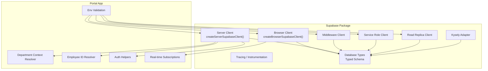

**Diagram sources**

- [client.ts:1-41](file://packages/supabase/src/client.ts#L1-L41)
- [server.ts:1-100](file://packages/supabase/src/server.ts#L1-L100)
- [database.types.ts:1-800](file://packages/supabase/src/database.types.ts#L1-L800)
- [env.ts:1-144](file://apps/portal/lib/env.ts#L1-L144)
- [dept-context.ts:1-68](file://apps/portal/lib/dept-context.ts#L1-L68)
- [employee.ts:1-28](file://apps/portal/lib/employee.ts#L1-L28)

**Section sources**

- [README.md:1-41](file://packages/supabase/README.md#L1-L41)
- [env.ts:1-144](file://apps/portal/lib/env.ts#L1-L144)

## Core Components

- Browser client: Creates a browser-side Supabase client with cookie-based session persistence and hostname normalization for local development.
- Server client: Creates a server-side Supabase client bound to Next.js cookies and an instrumented fetch wrapper for observability.
- Safe user retrieval: A helper that safely obtains the current user on the server, handling refresh token errors gracefully.
- Typed schema: Generated TypeScript types for all tables, views, functions, and enums to ensure type-safe queries.
- Department context resolver: Resolves the active department UUID from slug with Redis caching and validates availability.
- Employee ID resolver: Maps auth users to employee records, preferring a header-provided value when available.
- RLS policies: Enforce department-scoped access and role-based permissions at the database level.

**Section sources**

- [client.ts:1-41](file://packages/supabase/src/client.ts#L1-L41)
- [server.ts:1-100](file://packages/supabase/src/server.ts#L1-L100)
- [database.types.ts:1-800](file://packages/supabase/src/database.types.ts#L1-L800)
- [dept-context.ts:1-68](file://apps/portal/lib/dept-context.ts#L1-L68)
- [employee.ts:1-28](file://apps/portal/lib/employee.ts#L1-L28)
- [rls-policy.md:1-92](file://wiki/concepts/rls-policy.md#L1-L92)

## Architecture Overview

The system uses three distinct client contexts aligned with Next.js execution environments:

- Browser: For real-time subscriptions and interactive UI state.
- Server: For data fetching and mutations within Server Components and API routes.
- Middleware: For route protection and JWT refresh logic.

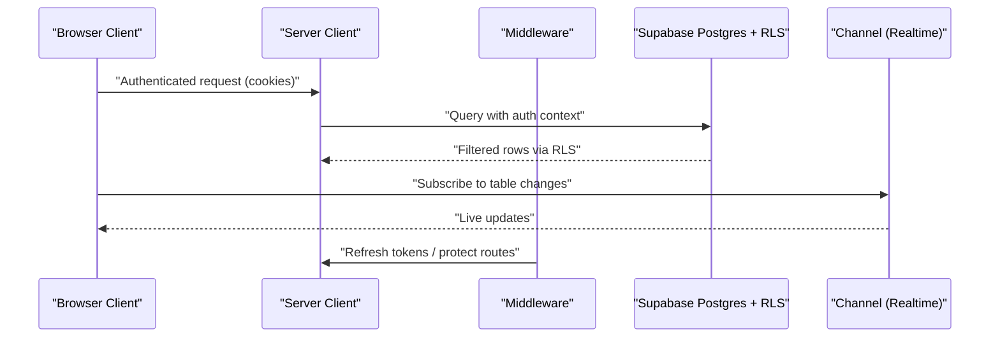

**Diagram sources**

- [client.ts:1-41](file://packages/supabase/src/client.ts#L1-L41)
- [server.ts:1-100](file://packages/supabase/src/server.ts#L1-L100)
- [middleware.ts](file://packages/supabase/src/middleware.ts)
- [how-does-auth-work.md:73-122](file://wiki/queries/how-does-auth-work.md#L73-L122)
- [rls-policy.md:1-92](file://wiki/concepts/rls-policy.md#L1-L92)

## Detailed Component Analysis

### Browser Client

- Purpose: Provide a secure, cookie-backed Supabase client for client components and hooks.
- Key behaviors:
  - Normalizes Supabase URL hostname based on runtime location for local vs production.
  - Uses cookie storage for sessions to avoid localStorage/sessionStorage.
  - Exposes real-time subscription APIs.

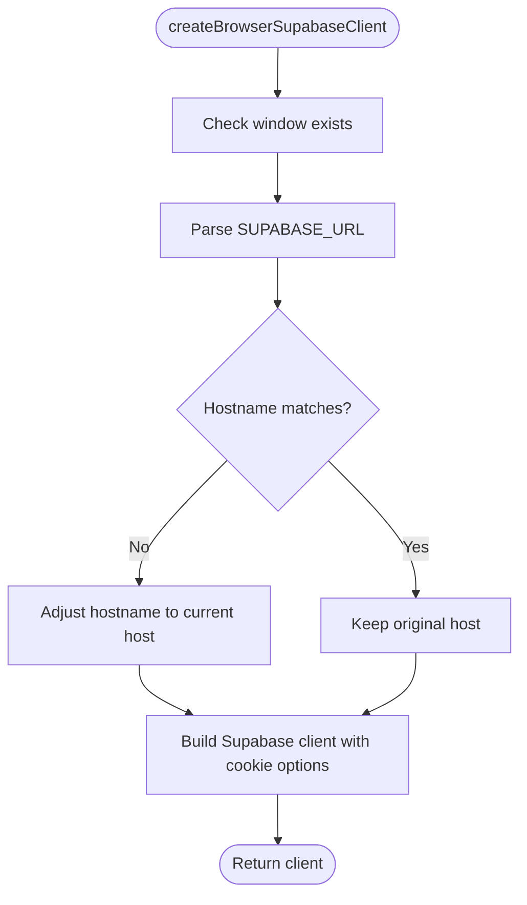

**Diagram sources**

- [client.ts:1-41](file://packages/supabase/src/client.ts#L1-L41)

**Section sources**

- [client.ts:1-41](file://packages/supabase/src/client.ts#L1-L41)
- [how-does-auth-work.md:73-122](file://wiki/queries/how-does-auth-work.md#L73-L122)

### Server Client

- Purpose: Provide a server-side Supabase client integrated with Next.js cookies and instrumentation.
- Key behaviors:
  - Binds to Next.js cookie store for read/write.
  - Wraps fetch with timing and table extraction for observability.
  - Provides getUserSafely to handle invalid refresh tokens without crashing.

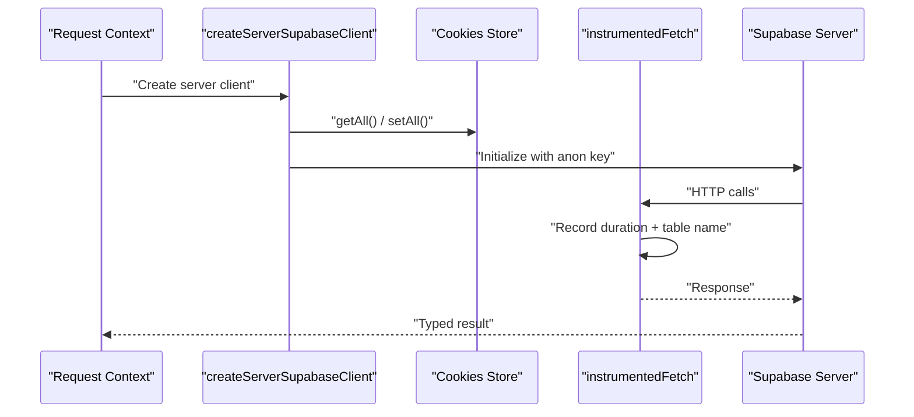

**Diagram sources**

- [server.ts:1-100](file://packages/supabase/src/server.ts#L1-L100)

**Section sources**

- [server.ts:1-100](file://packages/supabase/src/server.ts#L1-L100)

### Typed Database Schema

- Purpose: Provide compile-time safety for queries using generated types for tables, views, functions, and enums.
- Highlights:
  - Strongly-typed Row/Insert/Update shapes per table.
  - Relationships metadata for foreign keys and referenced relations.
  - Public schema namespace with comprehensive coverage.

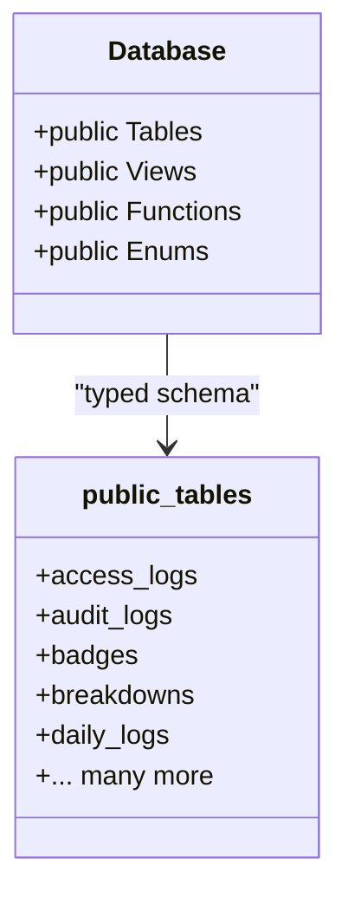

**Diagram sources**

- [database.types.ts:1-800](file://packages/supabase/src/database.types.ts#L1-L800)

**Section sources**

- [database.types.ts:1-800](file://packages/supabase/src/database.types.ts#L1-L800)

### Department Context Management

- Purpose: Resolve the active department for server components, validate slug, cache UUID lookup, and provide today’s operational date.
- Key behaviors:
  - Validates department against known list.
  - Fetches department UUID from Supabase if not cached.
  - Caches UUID in Redis with TTL.
  - Returns supabase client instance alongside resolved context.

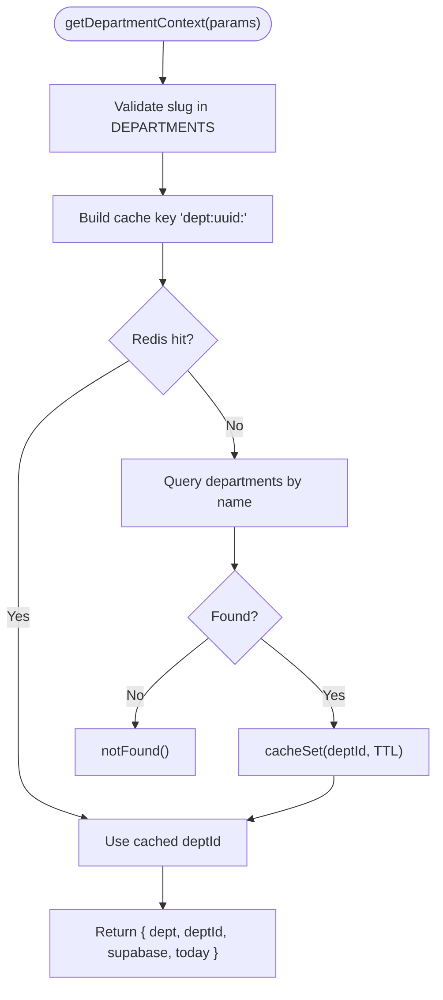

**Diagram sources**

- [dept-context.ts:1-68](file://apps/portal/lib/dept-context.ts#L1-L68)
- [departments.ts:1-310](file://apps/portal/lib/departments.ts#L1-L310)

**Section sources**

- [dept-context.ts:1-68](file://apps/portal/lib/dept-context.ts#L1-L68)
- [departments.ts:1-310](file://apps/portal/lib/departments.ts#L1-L310)

### Employee Context Resolution

- Purpose: Map Supabase Auth user id to employees.id efficiently.
- Key behaviors:
  - Prefers x-auth-employee-id header when available.
  - Falls back to querying employees table by auth_id.
  - Handles tests where headers are unavailable.

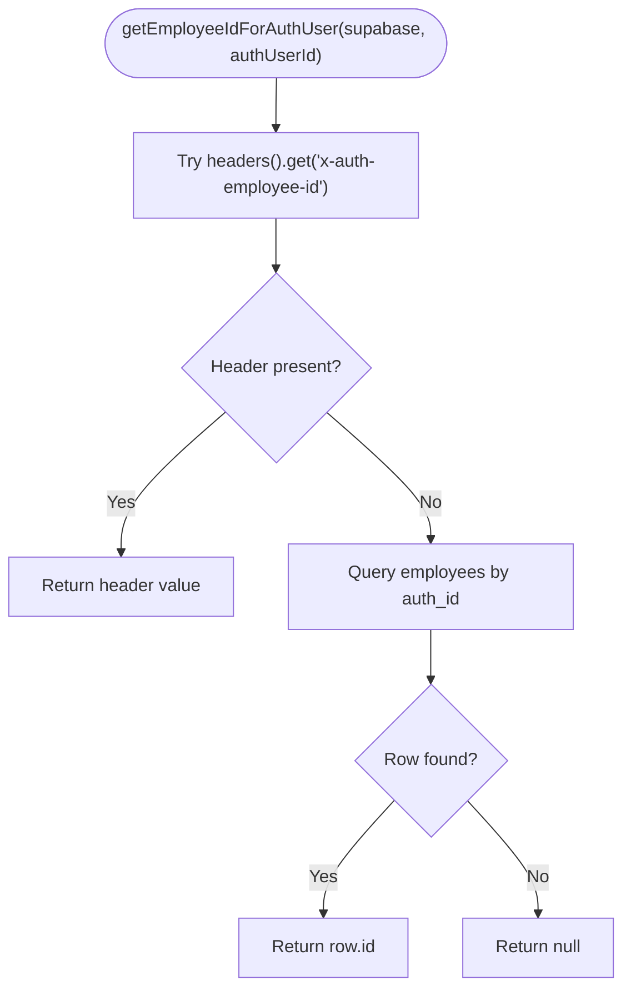

**Diagram sources**

- [employee.ts:1-28](file://apps/portal/lib/employee.ts#L1-L28)

**Section sources**

- [employee.ts:1-28](file://apps/portal/lib/employee.ts#L1-L28)

### Authentication Helpers and Safe User Retrieval

- Purpose: Provide robust user retrieval on the server and integrate with Next.js cookies.
- Key behaviors:
  - getUserSafely catches refresh token errors and returns null instead of throwing.
  - createServerSupabaseClient binds to Next.js cookies and wraps fetch for tracing.

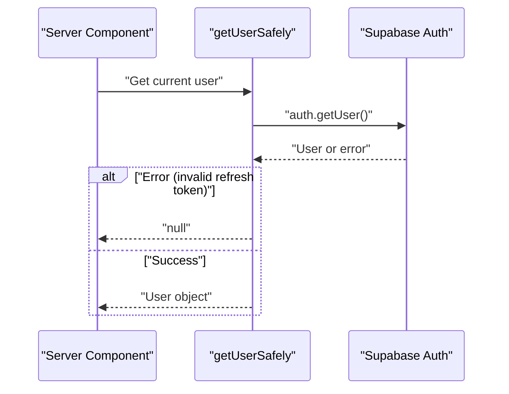

**Diagram sources**

- [server.ts:82-100](file://packages/supabase/src/server.ts#L82-L100)

**Section sources**

- [server.ts:1-100](file://packages/supabase/src/server.ts#L1-L100)
- [how-does-auth-work.md:73-122](file://wiki/queries/how-does-auth-work.md#L73-L122)

### Row Level Security (RLS) Policies and Integration

- Purpose: Enforce department-scoped access and role-based permissions at the database level.
- Key concepts:
  - All operational tables have RLS enabled.
  - SELECT/INSERT/UPDATE/DELETE policies scoped by employees.auth_id and roles.
  - Cross-department access via employees.accessible_departments array.
  - Helper functions like is_admin(), user_department_id(), has_department_access().

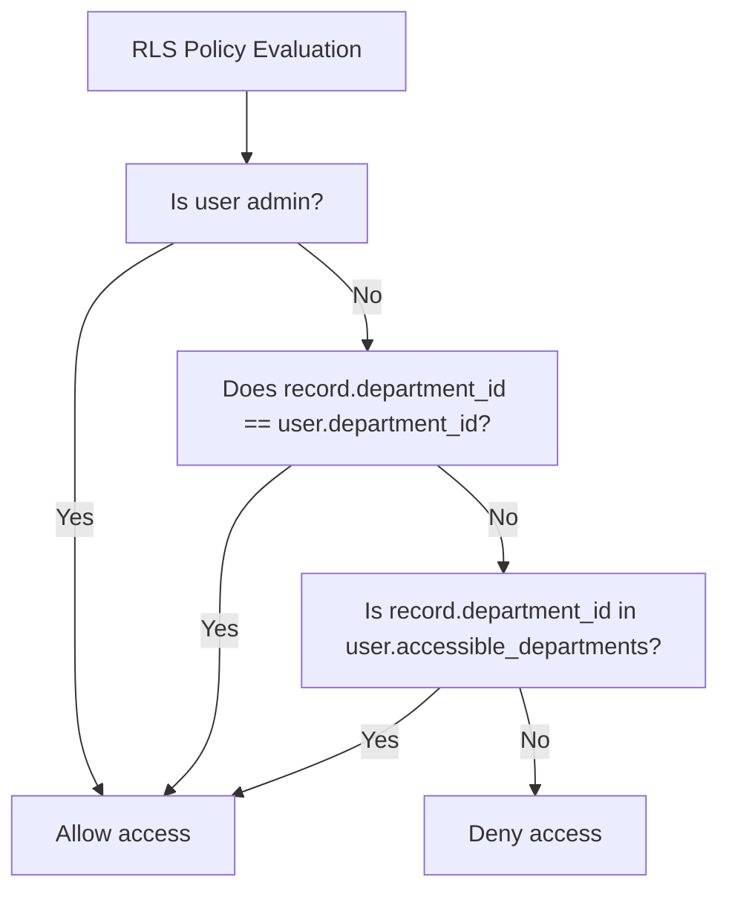

**Diagram sources**

- [rls-policy.md:1-92](file://wiki/concepts/rls-policy.md#L1-L92)
- [auth-middleware.md:51-82](file://wiki/concepts/auth-middleware.md#L51-L82)
- [database-schema.md:242-261](file://wiki/concepts/database-schema.md#L242-L261)
- [security-posture.md:46-77](file://wiki/breakdown/security-posture.md#L46-L77)

**Section sources**

- [rls-policy.md:1-92](file://wiki/concepts/rls-policy.md#L1-L92)
- [auth-middleware.md:51-82](file://wiki/concepts/auth-middleware.md#L51-L82)
- [database-schema.md:242-261](file://wiki/concepts/database-schema.md#L242-L261)
- [security-posture.md:46-77](file://wiki/breakdown/security-posture.md#L46-L77)

### Common Database Operations and Patterns

- Reading data:
  - Use typed clients to select filtered rows; RLS enforces scope automatically.
- Writing data:
  - Insert/update operations validated by RLS INSERT/UPDATE policies.
- Real-time subscriptions:
  - Subscribe to postgres_changes events for live dashboards and collaborative features.

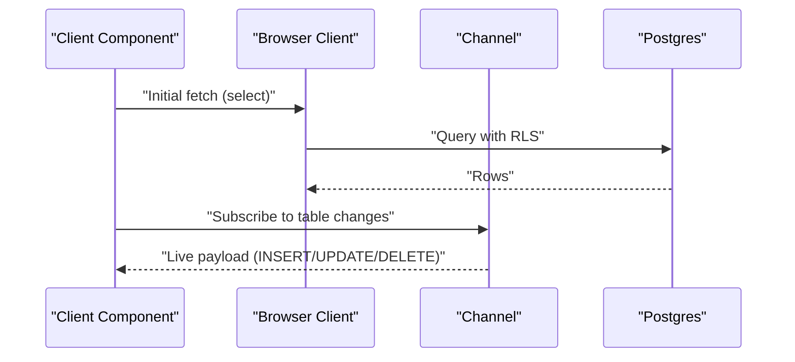

**Diagram sources**

- [how-to-fetch-data.md:144-199](file://wiki/queries/how-to-fetch-data.md#L144-L199)

**Section sources**

- [how-to-fetch-data.md:144-199](file://wiki/queries/how-to-fetch-data.md#L144-L199)

## Dependency Analysis

The following diagram shows how the Supabase package modules relate to each other and to the portal app.

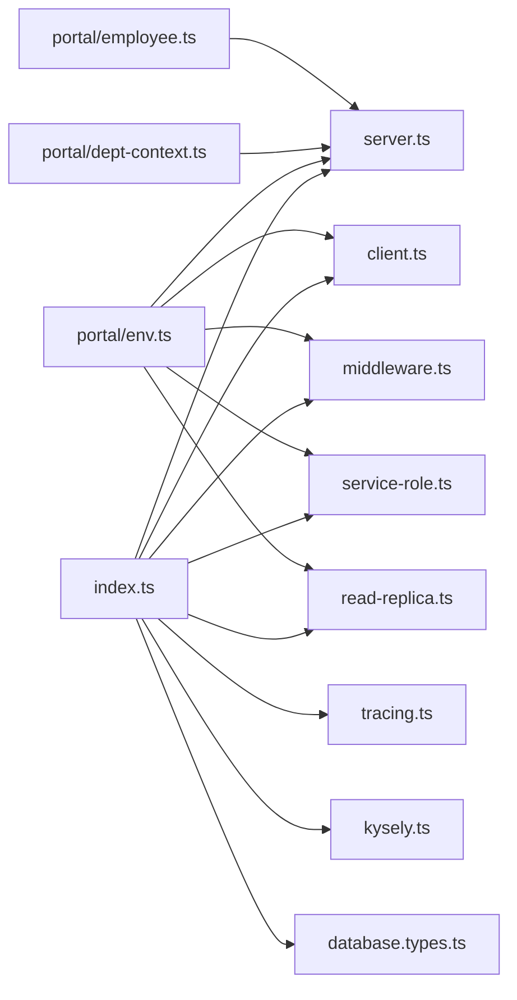

**Diagram sources**

- [index.ts](file://packages/supabase/src/index.ts)
- [client.ts:1-41](file://packages/supabase/src/client.ts#L1-L41)
- [server.ts:1-100](file://packages/supabase/src/server.ts#L1-L100)
- [middleware.ts](file://packages/supabase/src/middleware.ts)
- [service-role.ts](file://packages/supabase/src/service-role.ts)
- [read-replica.ts](file://packages/supabase/src/read-replica.ts)
- [tracing.ts](file://packages/supabase/src/tracing.ts)
- [kysely.ts](file://packages/supabase/src/kysely.ts)
- [database.types.ts:1-800](file://packages/supabase/src/database.types.ts#L1-L800)
- [env.ts:1-144](file://apps/portal/lib/env.ts#L1-L144)
- [dept-context.ts:1-68](file://apps/portal/lib/dept-context.ts#L1-L68)
- [employee.ts:1-28](file://apps/portal/lib/employee.ts#L1-L28)

**Section sources**

- [index.ts](file://packages/supabase/src/index.ts)
- [env.ts:1-144](file://apps/portal/lib/env.ts#L1-L144)

## Performance Considerations

- Connection pooling:
  - Prefer connection reuse via Supabase SDK defaults; use service-role client for privileged server tasks to minimize overhead.
  - Read replica client can offload heavy reads when configured.
- Caching strategies:
  - Department UUID lookups cached in Redis with TTL to reduce DB load.
  - React cache for deterministic server component results.
- Query optimization:
  - Leverage RLS indexes and composite indexes defined in migrations.
  - Use specific selects and filters to minimize payload size.
- Real-time efficiency:
  - Filter subscriptions by department_id to limit event volume.
  - Unsubscribe channels on cleanup to prevent leaks.

[No sources needed since this section provides general guidance]

## Troubleshooting Guide

- Refresh token errors on server components:
  - Use getUserSafely to return null instead of throwing when refresh tokens are invalid.
- Missing employee mapping:
  - Ensure x-auth-employee-id header is set by middleware; otherwise, verify employees.auth_id linkage.
- Department not found:
  - getDepartmentContext calls notFound() when slug or UUID is missing; check DEPARTMENTS list and database entries.
- RLS denials:
  - Verify policy definitions and employee.role/accessibility; confirm department_id alignment.

**Section sources**

- [server.ts:82-100](file://packages/supabase/src/server.ts#L82-L100)
- [employee.ts:1-28](file://apps/portal/lib/employee.ts#L1-L28)
- [dept-context.ts:1-68](file://apps/portal/lib/dept-context.ts#L1-L68)
- [rls-policy.md:1-92](file://wiki/concepts/rls-policy.md#L1-L92)

## Conclusion

The Supabase client wrappers and typed database access layer provide a secure, efficient, and type-safe foundation for data access across browser and server contexts. Combined with RLS policies, department context management, and robust authentication helpers, the system enforces strong isolation and role-based permissions while supporting real-time updates and performance optimizations through caching and indexing.

[No sources needed since this section summarizes without analyzing specific files]

## Appendices

### Environment Variables and Local Development

- Required variables include Supabase URL and keys; validation ensures correct configuration at runtime.
- Local development workflow includes linking, starting local stack, and syncing migrations.

**Section sources**

- [README.md:1-41](file://packages/supabase/README.md#L1-L41)
- [env.ts:1-144](file://apps/portal/lib/env.ts#L1-L144)
