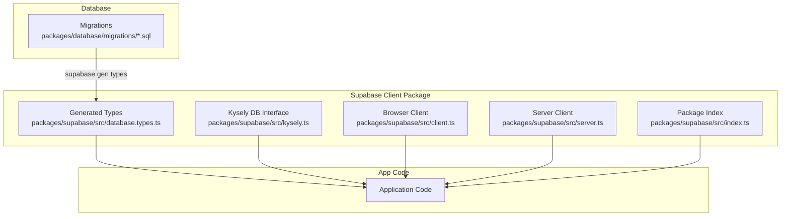
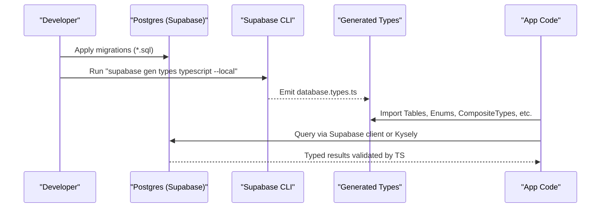
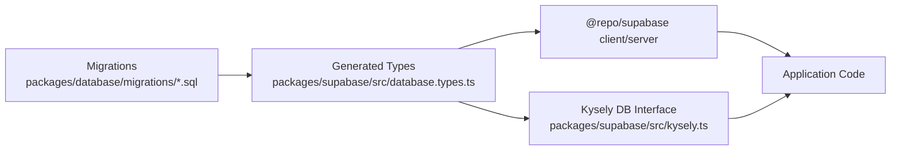

# TypeScript Type System & Schema Types

<cite>
**Referenced Files in This Document**
- [package.json](file://packages/database/package.json)
- [001_initial.sql](file://packages/database/migrations/001_initial.sql)
- [database.types.ts](file://packages/supabase/src/database.types.ts)
- [kysely.ts](file://packages/supabase/src/kysely.ts)
- [client.ts](file://packages/supabase/src/client.ts)
- [server.ts](file://packages/supabase/src/server.ts)
- [index.ts](file://packages/supabase/src/index.ts)
- [migration-rollback-safety.mjs](file://packages/database/tests/migration-rollback-safety.mjs)
</cite>

## Table of Contents

1. Introduction
2. Project Structure
3. Core Components
4. Architecture Overview
5. Detailed Component Analysis
6. Dependency Analysis
7. Performance Considerations
8. Troubleshooting Guide
9. Conclusion

## Introduction

This document explains how database migrations are reflected into TypeScript types and how to build type-safe queries across the application. It covers:

- How Supabase generates TypeScript types from the live database schema
- How those generated types are consumed for compile-time safety
- The Kysely-based approach for complex, type-safe queries
- Practical patterns for working with entities, relationships, and constraints
- Strategies for keeping types in sync when the schema evolves

## Project Structure

The repository uses a monorepo layout where database migrations live in one package and the Supabase client + generated types live in another. The key pieces are:

- Database migrations: packages/database/migrations/\*.sql
- Generated TypeScript types: packages/supabase/src/database.types.ts (generated by Supabase CLI)
- Kysely integration for advanced queries: packages/supabase/src/kysely.ts
- Supabase client helpers for browser and server contexts: packages/supabase/src/client.ts, packages/supabase/src/server.ts
- Package scripts that drive generation and push/pull operations: packages/database/package.json, packages/supabase/package.json

**Diagram sources**

- [package.json:1-22](file://packages/database/package.json#L1-L22)
- [database.types.ts:8467-8585](file://packages/supabase/src/database.types.ts#L8467-L8585)
- [kysely.ts:1-102](file://packages/supabase/src/kysely.ts#L1-L102)
- [client.ts:1-41](file://packages/supabase/src/client.ts#L1-L41)
- [server.ts:1-100](file://packages/supabase/src/server.ts#L1-L100)
- [index.ts:1-7](file://packages/supabase/src/index.ts#L1-L7)

**Section sources**

- [package.json:1-22](file://packages/database/package.json#L1-L22)
- [database.types.ts:8467-8585](file://packages/supabase/src/database.types.ts#L8467-L8585)
- [kysely.ts:1-102](file://packages/supabase/src/kysely.ts#L1-L102)
- [client.ts:1-41](file://packages/supabase/src/client.ts#L1-L41)
- [server.ts:1-100](file://packages/supabase/src/server.ts#L1-L100)
- [index.ts:1-7](file://packages/supabase/src/index.ts#L1-L7)

## Core Components

- Generated types: The Supabase CLI generates a comprehensive TypeScript file describing tables, views, enums, composite types, and helper utility types for row/insert/update shapes. These types are consumed throughout the app to ensure compile-time correctness.
- Kysely integration: A minimal, hand-maintained interface mirrors key tables for complex queries. Kysely enforces column names and types at compile time for aggregations, joins, and CTEs.
- Supabase clients: Browser and server client factories provide typed query builders backed by the generated types.

Key responsibilities:

- Generate types from the database schema
- Provide safe accessors for rows, inserts, updates, enums, and composites
- Offer a Kysely client for advanced SQL-like queries with strong typing

**Section sources**

- [database.types.ts:8467-8585](file://packages/supabase/src/database.types.ts#L8467-L8585)
- [kysely.ts:1-102](file://packages/supabase/src/kysely.ts#L1-L102)
- [client.ts:1-41](file://packages/supabase/src/client.ts#L1-L41)
- [server.ts:1-100](file://packages/supabase/src/server.ts#L1-L100)

## Architecture Overview

The type system is driven by the database schema and flows through three main paths:

1. Migrations define the canonical schema.
2. Supabase CLI generates TypeScript types reflecting the current database state.
3. Application code consumes these types via the Supabase client or Kysely for type-safe queries.

**Diagram sources**

- [package.json:1-22](file://packages/database/package.json#L1-L22)
- [database.types.ts:8467-8585](file://packages/supabase/src/database.types.ts#L8467-L8585)
- [kysely.ts:1-102](file://packages/supabase/src/kysely.ts#L1-L102)

## Detailed Component Analysis

### Generated Types and Utility Helpers

The generated file includes:

- Base Database shape with schemas and their Tables/Views/Enums/CompositeTypes
- Helper types to extract Row, Insert, Update shapes for any table/view
- Enum and CompositeType extraction helpers supporting default or explicit schema selection

Usage patterns:

- Use the helper types to get strongly-typed row/insert/update shapes without manually duplicating definitions
- Reference enums and composite types directly from the generated namespace

Typical imports and usage locations:

- See the helper type definitions for Tables, TablesInsert, TablesUpdate, Enums, CompositeTypes

**Section sources**

- [database.types.ts:8467-8585](file://packages/supabase/src/database.types.ts#L8467-L8585)

### Kysely Integration for Complex Queries

A small, curated interface mirrors critical tables used in complex queries. This ensures:

- Column-level type safety for joins, aggregations, and CTEs
- Compile-time validation of table/column names and types
- Runtime connection pooling via pg

Notes:

- The interface is intentionally minimal; add more tables as needed
- Columns use Kysely’s Generated and ColumnType to reflect defaults and read/write semantics

Example usage path:

- Create a Kysely client using the provided factory
- Build queries against the mirrored interface

**Section sources**

- [kysely.ts:1-102](file://packages/supabase/src/kysely.ts#L1-L102)

### Supabase Client Factories

- Browser client: Creates a browser-side client with cookie-aware session handling and environment-driven URL normalization.
- Server client: Creates a server-side client integrated with Next.js cookies and optional request instrumentation.

These clients rely on the generated types for compile-time safety when querying tables and views.

**Section sources**

- [client.ts:1-41](file://packages/supabase/src/client.ts#L1-L41)
- [server.ts:1-100](file://packages/supabase/src/server.ts#L1-L100)
- [index.ts:1-7](file://packages/supabase/src/index.ts#L1-L7)

### Migration-to-Type Generation Workflow

- Migrations are stored under packages/database/migrations/\*.sql
- The Supabase CLI generates TypeScript types from the local database instance
- The generated file is committed alongside the codebase so consumers can import it without running the generator locally

Common commands:

- Generate types locally and write to the generated file
- Push migrations to the local Supabase instance
- Reset local database to match migrations

**Section sources**

- [package.json:1-22](file://packages/database/package.json#L1-L22)
- [001_initial.sql:1-200](file://packages/database/migrations/001_initial.sql#L1-L200)

### Example Patterns and Best Practices

#### Type-Safe Query Building with Supabase Client

- Use the generated Tables/TablesInsert/TablesUpdate helpers to type your inputs and outputs
- Prefer explicit types for function parameters and return values to catch mismatches early

References:

- See the generated helper types for row/insert/update shapes

**Section sources**

- [database.types.ts:8467-8585](file://packages/supabase/src/database.types.ts#L8467-L8585)

#### Type-Safe Query Building with Kysely

- For complex aggregations, multi-table joins, or CTEs, use the Kysely client
- Keep the KyselyDatabase interface aligned with frequently used tables
- Leverage Kysely’s type inference for select columns, where clauses, and result shapes

References:

- Kysely client factory and mirrored table interface

**Section sources**

- [kysely.ts:1-102](file://packages/supabase/src/kysely.ts#L1-L102)

#### Working with Enums and Composite Types

- Use the generated Enums and CompositeTypes helpers to reference database-defined enumerations and composite structures
- This avoids manual duplication and keeps frontend/backend types synchronized with the database

References:

- Generated enum/composite helpers

**Section sources**

- [database.types.ts:8467-8585](file://packages/supabase/src/database.types.ts#L8467-L8585)

#### Type Guards and Validation Utilities

- When bridging between runtime data and static types, implement lightweight guards around user input before passing to insert/update helpers
- Validate required fields and constrained values prior to sending to the database

[No sources needed since this section provides general guidance]

#### Common Query Patterns

- Single-table reads/writes: Use the Supabase client with generated row/insert/update types
- Aggregations and analytics: Use Kysely for sum/avg/count/group-by patterns
- Cross-entity lookups: Use Kysely joins to combine related tables while preserving type safety

[No sources needed since this section provides general guidance]

### Schema Changes and Migration Strategy

When the schema changes:

- Author a new migration under packages/database/migrations
- Regenerate types locally and commit the updated generated file
- Ensure application code compiles; fix any breaking changes surfaced by the type checker
- For destructive changes, coordinate with rollback safety checks

Rollback safety checks:

- Automated tests analyze migrations for unsafe patterns (e.g., dropping objects without IF EXISTS)
- Enforce safer DDL patterns to reduce risk during rollbacks

**Section sources**

- [001_initial.sql:1-200](file://packages/database/migrations/001_initial.sql#L1-L200)
- [migration-rollback-safety.mjs:81-157](file://packages/database/tests/migration-rollback-safety.mjs#L81-L157)

## Dependency Analysis

The following diagram shows how components depend on each other and on generated types.

**Diagram sources**

- [package.json:1-22](file://packages/database/package.json#L1-L22)
- [database.types.ts:8467-8585](file://packages/supabase/src/database.types.ts#L8467-L8585)
- [kysely.ts:1-102](file://packages/supabase/src/kysely.ts#L1-L102)

**Section sources**

- [package.json:1-22](file://packages/database/package.json#L1-L22)
- [database.types.ts:8467-8585](file://packages/supabase/src/database.types.ts#L8467-L8585)
- [kysely.ts:1-102](file://packages/supabase/src/kysely.ts#L1-L102)

## Performance Considerations

- Prefer Kysely for heavy analytical queries to leverage database indexes and efficient execution plans
- Avoid over-fetching by selecting only necessary columns
- Reuse connection pools and avoid creating clients per request in long-lived processes
- Cache expensive computed results where appropriate

[No sources needed since this section provides general guidance]

## Troubleshooting Guide

- Missing DATABASE_URL: The Kysely client requires a valid connection string; ensure environment variables are set before running server code.
- Stale generated types: If you see type errors after schema changes, regenerate types locally and commit the updated file.
- Migration risks: Use the rollback safety test to detect unsafe DDL patterns before deploying.

**Section sources**

- [kysely.ts:87-101](file://packages/supabase/src/kysely.ts#L87-L101)
- [package.json:1-22](file://packages/database/package.json#L1-L22)
- [migration-rollback-safety.mjs:81-157](file://packages/database/tests/migration-rollback-safety.mjs#L81-L157)

## Conclusion

By generating TypeScript types directly from the database schema and combining them with a Kysely-based approach for complex queries, the application achieves strong compile-time guarantees across both simple and advanced data access patterns. Keeping migrations, generated types, and application code in lockstep ensures consistency, reduces runtime errors, and improves developer productivity.
