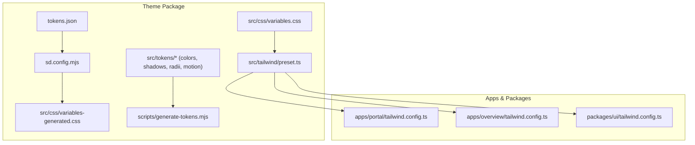
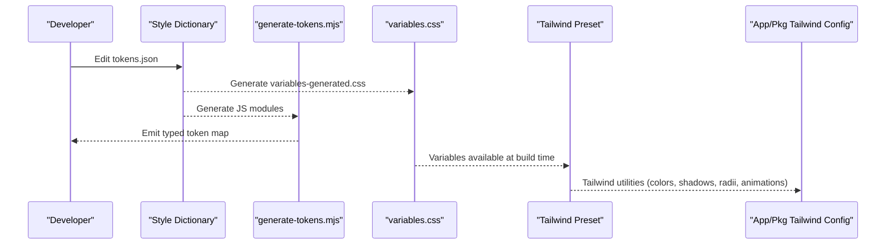
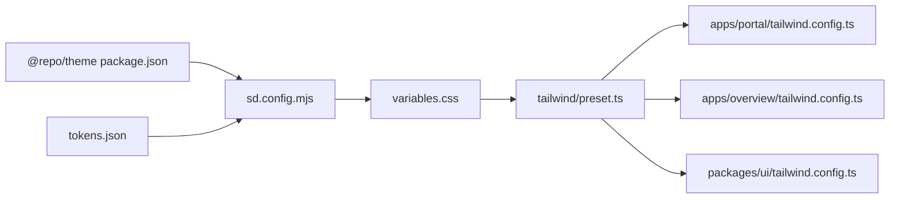

# Theme & Design System

<cite>
**Referenced Files in This Document**
- [packages/theme/package.json](file://packages/theme/package.json)
- [packages/theme/sd.config.mjs](file://packages/theme/sd.config.mjs)
- [packages/theme/tokens.json](file://packages/theme/tokens.json)
- [packages/theme/src/css/variables.css](file://packages/theme/src/css/variables.css)
- [packages/theme/src/css/index.css](file://packages/theme/src/css/index.css)
- [packages/theme/src/tailwind/preset.ts](file://packages/theme/src/tailwind/preset.ts)
- [apps/portal/tailwind.config.ts](file://apps/portal/tailwind.config.ts)
- [apps/overview/tailwind.config.ts](file://apps/overview/tailwind.config.ts)
- [packages/ui/tailwind.config.ts](file://packages/ui/tailwind.config.ts)
- [packages/theme/src/tokens/colors.ts](file://packages/theme/src/tokens/colors.ts)
- [packages/theme/src/tokens/index.ts](file://packages/theme/src/tokens/index.ts)
- [packages/theme/scripts/generate-tokens.mjs](file://packages/theme/scripts/generate-tokens.mjs)
- [packages/theme/GEMINI.md](file://packages/theme/GEMINI.md)
- [packages/theme/DECISIONS.md](file://packages/theme/DECISIONS.md)
</cite>

## Table of Contents

1. Introduction
2. Project Structure
3. Core Components
4. Architecture Overview
5. Detailed Component Analysis
6. Dependency Analysis
7. Performance Considerations
8. Troubleshooting Guide
9. Conclusion
10. Appendices

## Introduction

This document describes the theme system and design tokens powering the project’s visual language. It covers:

- Color palette, typography scales, spacing, shadows, radii, and motion tokens
- Tailwind CSS configuration and custom utilities
- Responsive breakpoints and container settings
- Extending themes and creating consistent components
- Dark mode support and accessibility considerations
- Cross-browser compatibility notes
- Best practices for theming, performance optimization, and maintenance

The system is light-only by product decision, with a macOS-inspired aesthetic and glassmorphism surfaces. Tokens are authored in a single source file and generated into CSS variables, TypeScript types, and JSON outputs via Style Dictionary.

## Project Structure

At the heart of the theme system is a dedicated package that centralizes tokens, CSS variables, Tailwind preset, and runtime token exports. Applications import the Tailwind preset to ensure consistent styling across apps and shared UI packages.

**Diagram sources**

- [packages/theme/sd.config.mjs:1-45](file://packages/theme/sd.config.mjs#L1-L45)
- [packages/theme/tokens.json:1-295](file://packages/theme/tokens.json#L1-L295)
- [packages/theme/src/css/variables.css:1-386](file://packages/theme/src/css/variables.css#L1-L386)
- [packages/theme/src/tailwind/preset.ts:1-403](file://packages/theme/src/tailwind/preset.ts#L1-L403)
- [packages/theme/scripts/generate-tokens.mjs:79-123](file://packages/theme/scripts/generate-tokens.mjs#L79-L123)
- [apps/portal/tailwind.config.ts:1-2](file://apps/portal/tailwind.config.ts#L1-L2)
- [apps/overview/tailwind.config.ts:1-14](file://apps/overview/tailwind.config.ts#L1-L14)
- [packages/ui/tailwind.config.ts:1-1](file://packages/ui/tailwind.config.ts#L1-L1)

**Section sources**

- [packages/theme/package.json:1-46](file://packages/theme/package.json#L1-L46)
- [packages/theme/sd.config.mjs:1-45](file://packages/theme/sd.config.mjs#L1-L45)
- [packages/theme/tokens.json:1-295](file://packages/theme/tokens.json#L1-L295)
- [packages/theme/src/css/variables.css:1-386](file://packages/theme/src/css/variables.css#L1-L386)
- [packages/theme/src/tailwind/preset.ts:1-403](file://packages/theme/src/tailwind/preset.ts#L1-L403)
- [apps/portal/tailwind.config.ts:1-2](file://apps/portal/tailwind.config.ts#L1-L2)
- [apps/overview/tailwind.config.ts:1-14](file://apps/overview/tailwind.config.ts#L1-L14)
- [packages/ui/tailwind.config.ts:1-1](file://packages/ui/tailwind.config.ts#L1-L1)

## Core Components

- Token source of truth: W3C DTCG-compliant tokens.json defines primitives, semantic aliases, shadows, radii, motion timings, and eases.
- Build pipeline: Style Dictionary generates CSS variables and JS modules; a secondary script produces typed token maps for runtime usage.
- CSS layering: A single entry imports all theme layers (variables, glass, animations, transitions, focus, reset).
- Tailwind preset: Centralized Tailwind configuration extending colors, fonts, shadows, radii, keyframes, and animations.
- Runtime tokens: Typed color sets, shadows, radii, and motion values exported for React and Canvas/WebGL use.

Key responsibilities:

- Maintain a single source of truth for tokens
- Generate platform-specific outputs (CSS, TS, JSON)
- Provide a Tailwind preset consumed by apps and packages
- Expose typed tokens for non-CSS contexts

**Section sources**

- [packages/theme/tokens.json:1-295](file://packages/theme/tokens.json#L1-L295)
- [packages/theme/sd.config.mjs:1-45](file://packages/theme/sd.config.mjs#L1-L45)
- [packages/theme/src/css/index.css:1-8](file://packages/theme/src/css/index.css#L1-L8)
- [packages/theme/src/tailwind/preset.ts:1-403](file://packages/theme/src/tailwind/preset.ts#L1-L403)
- [packages/theme/src/tokens/index.ts:1-62](file://packages/theme/src/tokens/index.ts#L1-L62)
- [packages/theme/scripts/generate-tokens.mjs:79-123](file://packages/theme/scripts/generate-tokens.mjs#L79-L123)

## Architecture Overview

The theme architecture follows a three-tier model:

- Primitives: Raw brand ramps and base values
- Semantic: Purpose-named tokens mapping to primitives
- Derived: Component-level tokens derived from semantics via var()

Build flow:

- tokens.json → Style Dictionary → CSS variables + JS modules
- CSS variables → Tailwind preset → utility classes
- Generated token map → runtime usage (Framer Motion, Canvas, etc.)

**Diagram sources**

- [packages/theme/sd.config.mjs:1-45](file://packages/theme/sd.config.mjs#L1-L45)
- [packages/theme/src/css/variables.css:1-386](file://packages/theme/src/css/variables.css#L1-L386)
- [packages/theme/src/tailwind/preset.ts:1-403](file://packages/theme/src/tailwind/preset.ts#L1-L403)
- [packages/theme/scripts/generate-tokens.mjs:79-123](file://packages/theme/scripts/generate-tokens.mjs#L79-L123)

## Detailed Component Analysis

### Color Palette and Semantics

- Primitives: arch0–arch15 define background, border, text, and accent ranges aligned with macOS light tones.
- Semantic aliases: bg-primary/secondary/tertiary, border-subtle/default/emphasis, text-muted/secondary/body/primary/heading, accent-red/blue/green.
- Extended action/status tokens: vivid electric blue, mint, amber with subtle/hover/border variants and glow shadows.
- Compatibility layers: shadcn/ui HSL variables and Tremor chart tokens mapped to the same semantic surface.

Usage guidance:

- Prefer semantic aliases over primitives in components and utilities.
- Use arch.\* namespace in Tailwind for production-ready consistency.
- Deprecated Tier 3 aliases exist for backward compatibility but should be migrated to canonical names.

**Section sources**

- [packages/theme/src/css/variables.css:1-386](file://packages/theme/src/css/variables.css#L1-L386)
- [packages/theme/src/tailwind/preset.ts:41-226](file://packages/theme/src/tailwind/preset.ts#L41-L226)
- [packages/theme/src/tokens/colors.ts:1-185](file://packages/theme/src/tokens/colors.ts#L1-L185)
- [packages/theme/tokens.json:1-295](file://packages/theme/tokens.json#L1-L295)

### Typography Scale and Fonts

- Font families: sans and mono stacks defined via CSS variables and exposed in Tailwind.
- Tremor-compatible font sizes: label, default, title, metric for charts.
- Font variables: --font-sans, --font-inter, --font-outfit, --font-mono.

Best practices:

- Use Tailwind font-family utilities tied to the preset stacks.
- For chart labels and metrics, prefer Tremor size tokens for consistency.

**Section sources**

- [packages/theme/src/tailwind/preset.ts:23-40](file://packages/theme/src/tailwind/preset.ts#L23-L40)
- [packages/theme/src/tailwind/preset.ts:277-282](file://packages/theme/src/tailwind/preset.ts#L277-L282)
- [packages/theme/src/css/variables.css:372-382](file://packages/theme/src/css/variables.css#L372-L382)

### Spacing, Radius, Shadows, and Glass Surfaces

- Radius scale: sm/md/lg/xl/card/full mapped to CSS variables.
- Shadow system: layered elevation, diffusion, window, glow, and volumetric glass shadows.
- Glass tokens: surface, hover, strong, borders, sheen, and text-on-glass variants for standard and video overlays.
- Opacity and blur tokens: focus dim, disabled, hover, and backdrop blur.

Guidelines:

- Use shadow-card and glass-depth variants for elevated panels.
- Apply glass tokens consistently for frosted surfaces and maintain contrast on text-on-glass.

**Section sources**

- [packages/theme/src/tailwind/preset.ts:232-271](file://packages/theme/src/tailwind/preset.ts#L232-L271)
- [packages/theme/src/css/variables.css:190-252](file://packages/theme/src/css/variables.css#L190-L252)
- [packages/theme/src/css/variables.css:280-312](file://packages/theme/src/css/variables.css#L280-L312)
- [packages/theme/src/css/variables.css:350-366](file://packages/theme/src/css/variables.css#L350-L366)

### Animation and Motion Tokens

- Keyframes: accordion, fade-in, float, ken-burns, liquid effects, status glow, and more.
- Timing functions: glass, liquid-inertia, ease-out-smooth.
- Duration tiers: instant/fast/normal/slow/emphasis defined in tokens.

Recommendations:

- Animate only opacity, transform, and color properties.
- Use predefined animation utilities from the preset for consistency.

**Section sources**

- [packages/theme/src/tailwind/preset.ts:272-396](file://packages/theme/src/tailwind/preset.ts#L272-L396)
- [packages/theme/tokens.json:258-293](file://packages/theme/tokens.json#L258-L293)
- [packages/theme/GEMINI.md:26-30](file://packages/theme/GEMINI.md#L26-L30)

### Tailwind Configuration and Custom Utilities

- The preset extends Tailwind with:
  - Content scanning paths for components and apps
  - Container centering and padding
  - Colors (primitives, semantic, brand, glass, shadcn/ui, Tremor, HUD)
  - Border radius, shadows, blur, backdropBlur, opacity
  - Font families and sizes
  - Keyframes and animations
- Apps and packages re-export the preset to keep configurations minimal and consistent.

Extending the theme:

- Add new semantic tokens in tokens.json and rebuild.
- Map new tokens to Tailwind in the preset under theme.extend.
- Import the preset in app or package tailwind.config files.

**Section sources**

- [packages/theme/src/tailwind/preset.ts:1-403](file://packages/theme/src/tailwind/preset.ts#L1-L403)
- [apps/portal/tailwind.config.ts:1-2](file://apps/portal/tailwind.config.ts#L1-L2)
- [apps/overview/tailwind.config.ts:1-14](file://apps/overview/tailwind.config.ts#L1-L14)
- [packages/ui/tailwind.config.ts:1-1](file://packages/ui/tailwind.config.ts#L1-L1)

### Responsive Breakpoints and Container

- Container: centered with 2rem padding and max width at 2xl screen.
- Screens: explicit 2xl breakpoint configured.
- No additional custom breakpoints are added in the preset; rely on Tailwind defaults plus the 2xl override.

Practical tips:

- Use container utilities for consistent page widths.
- Combine with responsive prefixes for layout adjustments.

**Section sources**

- [packages/theme/src/tailwind/preset.ts:14-21](file://packages/theme/src/tailwind/preset.ts#L14-L21)

### Dark Mode Support

- Product decision: Light-only theme. No dark mode implementation in the core theme.
- next-themes dependency exists in the theme package, but the theme itself does not provide dark overrides.
- If enabling dark mode later, follow the contract: :root = light defaults, .dark overrides for every theme-switched token.

Accessibility note:

- Ensure sufficient contrast ratios for text and interactive elements against backgrounds and glass surfaces.

**Section sources**

- [packages/theme/GEMINI.md:14-19](file://packages/theme/GEMINI.md#L14-L19)
- [packages/theme/src/css/variables.css:1-12](file://packages/theme/src/css/variables.css#L1-L12)
- [packages/theme/package.json:1-46](file://packages/theme/package.json#L1-L46)

### Accessibility Considerations

- Contrast: Verify text-on-glass readability over varied backgrounds.
- Focus states: Focus dim opacity and blur tokens are provided; ensure visible focus indicators.
- Reduced motion: Respect user preferences by avoiding forced animations where possible.

**Section sources**

- [packages/theme/src/css/variables.css:350-366](file://packages/theme/src/css/variables.css#L350-L366)
- [packages/theme/src/tailwind/preset.ts:227-238](file://packages/theme/src/tailwind/preset.ts#L227-L238)

### Cross-Browser Compatibility

- Uses modern CSS features (custom properties, backdrop-filter, oklch).
- Glassmorphism relies on backdrop-filter; verify fallbacks for older browsers if needed.
- Color schemes: color-scheme set to light.

**Section sources**

- [packages/theme/src/css/variables.css:384-386](file://packages/theme/src/css/variables.css#L384-L386)
- [packages/theme/src/css/variables.css:190-252](file://packages/theme/src/css/variables.css#L190-L252)

## Dependency Analysis

The theme package exposes multiple entry points consumed by apps and packages.

**Diagram sources**

- [packages/theme/package.json:21-28](file://packages/theme/package.json#L21-L28)
- [packages/theme/sd.config.mjs:1-45](file://packages/theme/sd.config.mjs#L1-L45)
- [packages/theme/tokens.json:1-295](file://packages/theme/tokens.json#L1-L295)
- [packages/theme/src/css/variables.css:1-386](file://packages/theme/src/css/variables.css#L1-L386)
- [packages/theme/src/tailwind/preset.ts:1-403](file://packages/theme/src/tailwind/preset.ts#L1-L403)
- [apps/portal/tailwind.config.ts:1-2](file://apps/portal/tailwind.config.ts#L1-L2)
- [apps/overview/tailwind.config.ts:1-14](file://apps/overview/tailwind.config.ts#L1-L14)
- [packages/ui/tailwind.config.ts:1-1](file://packages/ui/tailwind.config.ts#L1-L1)

**Section sources**

- [packages/theme/package.json:21-28](file://packages/theme/package.json#L21-L28)
- [packages/theme/sd.config.mjs:1-45](file://packages/theme/sd.config.mjs#L1-L45)
- [packages/theme/tokens.json:1-295](file://packages/theme/tokens.json#L1-L295)
- [packages/theme/src/tailwind/preset.ts:1-403](file://packages/theme/src/tailwind/preset.ts#L1-L403)

## Performance Considerations

- Minimize heavy animations; prefer opacity and transform.
- Avoid animating layout properties (width, height).
- Reuse predefined keyframes and timing functions from the preset.
- Keep glass effects judicious; excessive backdrop-filter can impact rendering performance.
- Leverage generated tokens to avoid redundant computations in runtime code.

[No sources needed since this section provides general guidance]

## Troubleshooting Guide

Common issues and resolutions:

- Tokens not updating:
  - Run the build command to regenerate CSS and JS outputs after editing tokens.json.
  - Use watch mode during development to auto-rebuild on changes.
- Missing Tailwind utilities:
  - Ensure content paths include component directories.
  - Confirm apps/packages re-export the theme preset.
- Inconsistent styles across apps:
  - Verify each app uses the centralized preset rather than duplicating config.
- Runtime token access:
  - Use the generated token map for Framer Motion, Canvas, or dynamic style injection.

Operational commands:

- Build tokens: pnpm codegen
- Watch tokens: pnpm tokens:watch
- Lint CSS: pnpm lint:css
- Validate tokens: pnpm lint:tokens

**Section sources**

- [packages/theme/package.json:33-42](file://packages/theme/package.json#L33-L42)
- [packages/theme/sd.config.mjs:1-45](file://packages/theme/sd.config.mjs#L1-L45)
- [packages/theme/scripts/generate-tokens.mjs:95-123](file://packages/theme/scripts/generate-tokens.mjs#L95-L123)
- [packages/theme/DECISIONS.md:125-154](file://packages/theme/DECISIONS.md#L125-L154)

## Conclusion

The theme system provides a cohesive, light-only design language grounded in a single source of truth. By centralizing tokens, generating outputs, and exposing a Tailwind preset, it ensures consistency across apps and packages while offering typed tokens for runtime needs. Adhering to semantic naming, using predefined animations, and following accessibility guidelines will help maintain a high-quality, performant interface.

[No sources needed since this section summarizes without analyzing specific files]

## Appendices

### How to Extend the Theme

- Add new tokens in tokens.json (primitive or semantic).
- Rebuild to generate CSS variables and JS modules.
- Map new tokens to Tailwind in the preset under theme.extend.
- Update any runtime token consumers if necessary.

**Section sources**

- [packages/theme/tokens.json:1-295](file://packages/theme/tokens.json#L1-L295)
- [packages/theme/sd.config.mjs:1-45](file://packages/theme/sd.config.mjs#L1-L45)
- [packages/theme/src/tailwind/preset.ts:22-397](file://packages/theme/src/tailwind/preset.ts#L22-L397)

### Creating Custom Components Consistently

- Use semantic tokens (e.g., bg-primary, text-heading, border-default) instead of raw primitives.
- Apply glass tokens for translucent surfaces and ensure text-on-glass contrast.
- Use predefined shadows and radii for elevation and corner consistency.
- Reference motion tokens for durations and easings.

**Section sources**

- [packages/theme/src/css/variables.css:45-136](file://packages/theme/src/css/variables.css#L45-L136)
- [packages/theme/src/tailwind/preset.ts:232-271](file://packages/theme/src/tailwind/preset.ts#L232-L271)
- [packages/theme/tokens.json:258-293](file://packages/theme/tokens.json#L258-L293)

### Maintaining Design Consistency

- Centralize all token definitions in tokens.json.
- Avoid ad-hoc color or spacing values in components.
- Regularly run linters and type checks to catch drift.
- Keep deprecated aliases out of new code; migrate to canonical names.

**Section sources**

- [packages/theme/DECISIONS.md:125-154](file://packages/theme/DECISIONS.md#L125-L154)
- [packages/theme/src/tokens/colors.ts:85-104](file://packages/theme/src/tokens/colors.ts#L85-L104)
