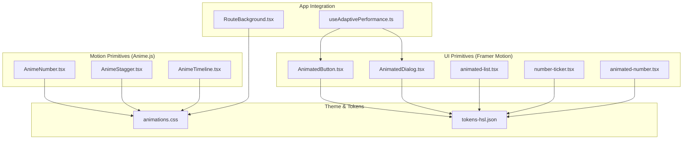
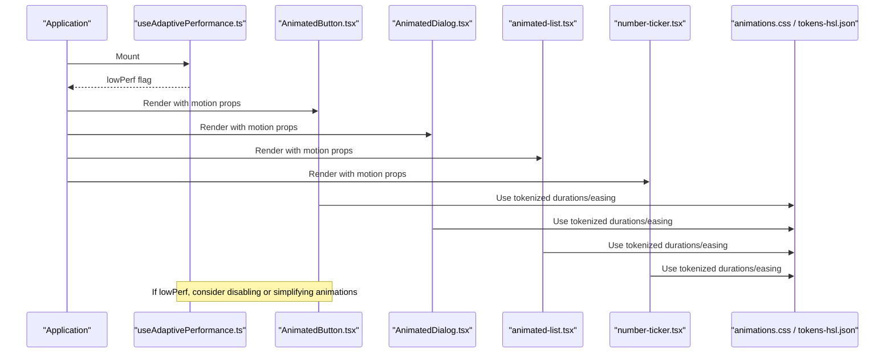
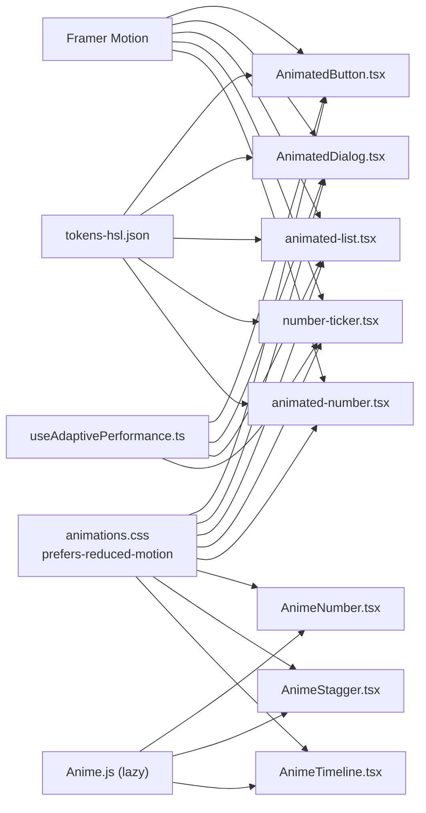

# Animated & Motion Components

<cite>
**Referenced Files in This Document**
- [AnimeNumber.tsx](file://packages/ui/src/components/motion/AnimeNumber.tsx)
- [AnimeStagger.tsx](file://packages/ui/src/components/motion/AnimeStagger.tsx)
- [AnimeTimeline.tsx](file://packages/ui/src/components/motion/AnimeTimeline.tsx)
- [AnimatedButton.tsx](file://packages/ui/src/components/ui/animated-button.tsx)
- [AnimatedDialog.tsx](file://packages/ui/src/components/ui/animated-dialog.tsx)
- [animated-list.tsx](file://packages/ui/src/components/ui/animated-list.tsx)
- [number-ticker.tsx](file://packages/ui/src/components/ui/number-ticker.tsx)
- [animated-number.tsx](file://packages/ui/src/components/ui/animated-number.tsx)
- [animations.css](file://packages/theme/src/css/animations.css)
- [tokens-hsl.json](file://packages/theme/src/tokens/tokens-hsl.json)
- [useAdaptivePerformance.ts](file://apps/portal/hooks/useAdaptivePerformance.ts)
- [RouteBackground.tsx](file://apps/portal/components/RouteBackground.tsx)
- [animation-libraries.md](file://wiki/comparisons/animation-libraries.md)
</cite>

## Table of Contents

1. Introduction
2. Project Structure
3. Core Components
4. Architecture Overview
5. Detailed Component Analysis
6. Dependency Analysis
7. Performance Considerations
8. Troubleshooting Guide
9. Conclusion
10. Appendices

## Introduction

This document provides comprehensive documentation for the animated and motion components used across the project, including AnimeNumber, AnimeStagger, AnimeTimeline, AnimatedButton, AnimatedDialog, AnimatedList, and NumberTicker. It explains animation props, timing configurations, easing functions, performance considerations, integration with Framer Motion, accessibility, and reduced motion preferences. The goal is to help developers implement performant, accessible animations consistently using both Framer Motion and Anime.js where appropriate.

## Project Structure

The animation-related components are organized under two primary locations:

- packages/ui/src/components/motion: Anime.js-based primitives (AnimeNumber, AnimeStagger, AnimeTimeline)
- packages/ui/src/components/ui: Framer Motion-based UI primitives (AnimatedButton, AnimatedDialog, AnimatedList, NumberTicker, AnimatedNumber)

**Diagram sources**

- [AnimeNumber.tsx:1-61](file://packages/ui/src/components/motion/AnimeNumber.tsx#L1-L61)
- [AnimeStagger.tsx:1-75](file://packages/ui/src/components/motion/AnimeStagger.tsx#L1-L75)
- [AnimeTimeline.tsx:1-149](file://packages/ui/src/components/motion/AnimeTimeline.tsx#L1-L149)
- [AnimatedButton.tsx:1-70](file://packages/ui/src/components/ui/animated-button.tsx#L1-L70)
- [AnimatedDialog.tsx:1-193](file://packages/ui/src/components/ui/animated-dialog.tsx#L1-L193)
- [animated-list.tsx:1-141](file://packages/ui/src/components/ui/animated-list.tsx#L1-L141)
- [number-ticker.tsx:1-75](file://packages/ui/src/components/ui/number-ticker.tsx#L1-L75)
- [animated-number.tsx:1-147](file://packages/ui/src/components/ui/animated-number.tsx#L1-L147)
- [animations.css:505-530](file://packages/theme/src/css/animations.css#L505-L530)
- [tokens-hsl.json:2306-2362](file://packages/theme/src/tokens/tokens-hsl.json#L2306-L2362)
- [useAdaptivePerformance.ts:1-82](file://apps/portal/hooks/useAdaptivePerformance.ts#L1-L82)
- [RouteBackground.tsx:86-112](file://apps/portal/components/RouteBackground.tsx#L86-L112)

**Section sources**

- [AnimeNumber.tsx:1-61](file://packages/ui/src/components/motion/AnimeNumber.tsx#L1-L61)
- [AnimeStagger.tsx:1-75](file://packages/ui/src/components/motion/AnimeStagger.tsx#L1-L75)
- [AnimeTimeline.tsx:1-149](file://packages/ui/src/components/motion/AnimeTimeline.tsx#L1-L149)
- [AnimatedButton.tsx:1-70](file://packages/ui/src/components/ui/animated-button.tsx#L1-L70)
- [AnimatedDialog.tsx:1-193](file://packages/ui/src/components/ui/animated-dialog.tsx#L1-L193)
- [animated-list.tsx:1-141](file://packages/ui/src/components/ui/animated-list.tsx#L1-L141)
- [number-ticker.tsx:1-75](file://packages/ui/src/components/ui/number-ticker.tsx#L1-L75)
- [animated-number.tsx:1-147](file://packages/ui/src/components/ui/animated-number.tsx#L1-L147)
- [animations.css:505-530](file://packages/theme/src/css/animations.css#L505-L530)
- [tokens-hsl.json:2306-2362](file://packages/theme/src/tokens/tokens-hsl.json#L2306-L2362)
- [useAdaptivePerformance.ts:1-82](file://apps/portal/hooks/useAdaptivePerformance.ts#L1-L82)
- [RouteBackground.tsx:86-112](file://apps/portal/components/RouteBackground.tsx#L86-L112)

## Core Components

- AnimeNumber: Animates numeric values using Anime.js with configurable duration, rounding, prefix/suffix, and formatting modes.
- AnimeStagger: Staggered entrance animations for child elements along x or y axis with delay and distance controls.
- AnimeTimeline: Declarative timeline orchestration for step-based animations with built-in presets and control handles.
- AnimatedButton: Interactive button with spring transitions on hover and tap.
- AnimatedDialog: Accessible dialog with focus management, ARIA attributes, and spring-based open/close transitions.
- AnimatedList: Multiple list variants with Framer Motion and AutoAnimate for smooth enter/exit/reorder transitions.
- NumberTicker: In-view triggered number ticker with spring interpolation and decimal formatting.
- AnimatedNumber: Digit-strip style number transition with per-digit animations.

Key characteristics:

- Two animation engines: Framer Motion (primary), Anime.js (for specific primitives).
- Consistent use of design tokens for durations and colors.
- Accessibility-first patterns in dialogs and lists.
- Reduced motion support via CSS media queries and component-level checks.

**Section sources**

- [AnimeNumber.tsx:1-61](file://packages/ui/src/components/motion/AnimeNumber.tsx#L1-L61)
- [AnimeStagger.tsx:1-75](file://packages/ui/src/components/motion/AnimeStagger.tsx#L1-L75)
- [AnimeTimeline.tsx:1-149](file://packages/ui/src/components/motion/AnimeTimeline.tsx#L1-L149)
- [AnimatedButton.tsx:1-70](file://packages/ui/src/components/ui/animated-button.tsx#L1-L70)
- [AnimatedDialog.tsx:1-193](file://packages/ui/src/components/ui/animated-dialog.tsx#L1-L193)
- [animated-list.tsx:1-141](file://packages/ui/src/components/ui/animated-list.tsx#L1-L141)
- [number-ticker.tsx:1-75](file://packages/ui/src/components/ui/number-ticker.tsx#L1-L75)
- [animated-number.tsx:1-147](file://packages/ui/src/components/ui/animated-number.tsx#L1-L147)

## Architecture Overview

The system uses a hybrid approach:

- Framer Motion for layout-aware transitions, gestures, and AnimatePresence-driven enter/exit sequences.
- Anime.js for targeted DOM manipulations and timelines when needed.
- Theme tokens define consistent motion durations and easing.
- Application-level hooks detect low performance and can disable heavy animations.

**Diagram sources**

- [useAdaptivePerformance.ts:1-82](file://apps/portal/hooks/useAdaptivePerformance.ts#L1-L82)
- [AnimatedButton.tsx:1-70](file://packages/ui/src/components/ui/animated-button.tsx#L1-L70)
- [AnimatedDialog.tsx:1-193](file://packages/ui/src/components/ui/animated-dialog.tsx#L1-L193)
- [animated-list.tsx:1-141](file://packages/ui/src/components/ui/animated-list.tsx#L1-L141)
- [number-ticker.tsx:1-75](file://packages/ui/src/components/ui/number-ticker.tsx#L1-L75)
- [animations.css:505-530](file://packages/theme/src/css/animations.css#L505-L530)
- [tokens-hsl.json:2306-2362](file://packages/theme/src/tokens/tokens-hsl.json#L2306-L2362)

## Detailed Component Analysis

### AnimeNumber

Purpose:

- Smoothly animate displayed numbers from an initial value to a target value.

Props:

- value: Target number to animate to.
- duration: Animation duration in milliseconds.
- round: Rounding precision during animation.
- prefix/suffix: Optional text around the number; percentage mode auto-appends suffix if missing.
- className: Additional styling.
- format: "number", "percentage", or "time".

Behavior:

- Dynamically imports Anime.js to avoid blocking initial render.
- Uses a scope to manage lifecycle and cleanup.
- Animates innerHTML with easing outExpo by default.

Accessibility:

- Uses tabular-nums for stable digit width.
- For screen readers, ensure meaningful labels are provided at the parent level if needed.

Performance:

- Lazy import reduces bundle impact until needed.
- Scope revert ensures no lingering animations.

Example usage references:

- [AnimeNumber.tsx:1-61](file://packages/ui/src/components/motion/AnimeNumber.tsx#L1-L61)

**Section sources**

- [AnimeNumber.tsx:1-61](file://packages/ui/src/components/motion/AnimeNumber.tsx#L1-L61)

### AnimeStagger

Purpose:

- Apply staggered entrance animations to children along x or y axes.

Props:

- children: Items to animate.
- className/childClassName: Styling wrappers.
- staggerDelay: Delay between each child’s animation.
- delayChildren: Initial delay before starting the sequence.
- duration: Duration per child animation.
- ease: Easing function string.
- axis: "x" or "y".
- distance: Starting offset distance.

Behavior:

- Targets children marked with data-anime-child.
- Uses Anime.js stagger utility to compute delays.
- Animates opacity and position simultaneously.

Accessibility:

- Ensure content remains readable and keyboard navigable.
- Avoid hiding critical information behind animations.

Performance:

- Batched staggered animations reduce layout thrashing.
- Keep distance moderate to minimize repaints.

Example usage references:

- [AnimeStagger.tsx:1-75](file://packages/ui/src/components/motion/AnimeStagger.tsx#L1-L75)

**Section sources**

- [AnimeStagger.tsx:1-75](file://packages/ui/src/components/motion/AnimeStagger.tsx#L1-L75)

### AnimeTimeline

Purpose:

- Orchestrate step-based animations with built-in presets and imperative controls.

Props:

- children: Steps to animate.
- className/childClassName: Styling wrappers.
- autoPlay: Whether to start automatically.
- onComplete: Callback when timeline completes.

Handles:

- play, pause, restart, reverse exposed via ref.

Built-in step types:

- fadeSlide, scalePop, alertPulse, slideRight, and default fade.

Data attributes for steps:

- data-anime-step: Marks a step element.
- data-anime-delay: Per-step delay override.
- data-anime-duration: Per-step duration override.
- data-anime-ease: Per-step easing override.
- data-anime-type: Preset type selection.

Behavior:

- Scans for step elements and builds a timeline.
- Uses createScope and createTimeline from Anime.js.

Accessibility:

- Provide visible cues and avoid relying solely on motion for meaning.
- Respect prefers-reduced-motion globally via theme overrides.

Performance:

- Prefer shorter durations and fewer simultaneous steps.
- Reuse timelines rather than recreating frequently.

Example usage references:

- [AnimeTimeline.tsx:1-149](file://packages/ui/src/components/motion/AnimeTimeline.tsx#L1-L149)

**Section sources**

- [AnimeTimeline.tsx:1-149](file://packages/ui/src/components/motion/AnimeTimeline.tsx#L1-L149)

### AnimatedButton

Purpose:

- Interactive button with spring-based hover and tap micro-interactions.

Props:

- variant, size: Style variants via class-variance-authority.
- hoverScale, tapScale: Scale factors for interactions.
- Standard HTML button props forwarded.

Behavior:

- Uses Framer Motion motion.button with spring transitions.
- Integrates with design tokens for consistent durations and colors.

Accessibility:

- Inherits native button semantics.
- Ensure sufficient color contrast and focus ring visibility.

Performance:

- Spring transitions are GPU-friendly; keep scales modest.

Example usage references:

- [AnimatedButton.tsx:1-70](file://packages/ui/src/components/ui/animated-button.tsx#L1-L70)

**Section sources**

- [AnimatedButton.tsx:1-70](file://packages/ui/src/components/ui/animated-button.tsx#L1-L70)

### AnimatedDialog

Purpose:

- Accessible modal dialog with animated backdrop and panel, focus trapping, and keyboard handling.

Props:

- open, onClose, children, title, description, className.

Accessibility features:

- role="dialog", aria-modal="true", aria-labelledby, aria-describedby.
- Focus trap within dialog on Tab/Shift+Tab.
- Initial focus on first focusable element; restore focus on close.
- Escape key closes dialog.

Behavior:

- Backdrop and panel animate with spring transitions.
- AnimatePresence manages mount/unmount transitions.

Performance:

- Short exit durations improve perceived responsiveness.
- Avoid animating large nested trees inside the dialog.

Example usage references:

- [AnimatedDialog.tsx:1-193](file://packages/ui/src/components/ui/animated-dialog.tsx#L1-L193)

**Section sources**

- [AnimatedDialog.tsx:1-193](file://packages/ui/src/components/ui/animated-dialog.tsx#L1-L193)

### AnimatedList

Purpose:

- Provides multiple list animation strategies:
  - AnimatedList: Rotating items with spring transitions.
  - AnimatedFeed: Real-time feed with enter/exit animations.
  - AutoAnimateList: Zero-config transitions using @formkit/auto-animate.

Props:

- AnimatedList: children, delay, className.
- AnimatedFeed: children, className.
- AutoAnimateList: children, className.

Behavior:

- Uses Framer Motion AnimatePresence for coordinated enter/exit.
- AutoAnimateList leverages library defaults for smooth reorder/mount/unmount.

Accessibility:

- Maintain semantic structure and keyboard navigation.
- Avoid hiding important content behind animations.

Performance:

- Prefer layout animations only when necessary.
- Limit item count and complexity in real-time feeds.

Example usage references:

- [animated-list.tsx:1-141](file://packages/ui/src/components/ui/animated-list.tsx#L1-L141)

**Section sources**

- [animated-list.tsx:1-141](file://packages/ui/src/components/ui/animated-list.tsx#L1-L141)

### NumberTicker

Purpose:

- In-view triggered number ticker with spring interpolation and formatted output.

Props:

- value: Target number.
- startValue: Starting number for animation.
- direction: "up" or "down".
- delay: Delay before triggering animation after in view.
- decimalPlaces: Formatting precision.
- className and other span props.

Behavior:

- Uses useInView to trigger once.
- useMotionValue + useSpring for smooth interpolation.
- Formats display using Intl.NumberFormat.

Accessibility:

- Announce changes via live regions if the number represents dynamic status.
- Ensure sufficient contrast and readable font sizing.

Performance:

- Debounced updates via spring reduce reflows.
- Avoid frequent value churn; batch updates when possible.

Example usage references:

- [number-ticker.tsx:1-75](file://packages/ui/src/components/ui/number-ticker.tsx#L1-L75)

**Section sources**

- [number-ticker.tsx:1-75](file://packages/ui/src/components/ui/number-ticker.tsx#L1-L75)

### AnimatedNumber

Purpose:

- Digit-strip style number transitions with per-digit animations.

Props:

- value, className, duration, prefix, suffix.

Behavior:

- Splits digits and animates each with staggered transitions.
- Uses AnimatePresence for coordinated enter/exit.

Accessibility:

- Prefer tabular-nums and clear labeling for context.

Performance:

- Limit length of long numbers to avoid excessive DOM nodes.

Example usage references:

- [animated-number.tsx:1-147](file://packages/ui/src/components/ui/animated-number.tsx#L1-L147)

**Section sources**

- [animated-number.tsx:1-147](file://packages/ui/src/components/ui/animated-number.tsx#L1-L147)

## Dependency Analysis

- Framer Motion is used extensively for layout-aware transitions, gestures, and AnimatePresence.
- Anime.js is lazily imported for AnimeNumber, AnimeStagger, and AnimeTimeline.
- Theme tokens define motion durations and easing constants.
- Application-level performance hook can signal low FPS to simplify animations.

**Diagram sources**

- [AnimatedButton.tsx:1-70](file://packages/ui/src/components/ui/animated-button.tsx#L1-L70)
- [AnimatedDialog.tsx:1-193](file://packages/ui/src/components/ui/animated-dialog.tsx#L1-L193)
- [animated-list.tsx:1-141](file://packages/ui/src/components/ui/animated-list.tsx#L1-L141)
- [number-ticker.tsx:1-75](file://packages/ui/src/components/ui/number-ticker.tsx#L1-L75)
- [animated-number.tsx:1-147](file://packages/ui/src/components/ui/animated-number.tsx#L1-L147)
- [AnimeNumber.tsx:1-61](file://packages/ui/src/components/motion/AnimeNumber.tsx#L1-L61)
- [AnimeStagger.tsx:1-75](file://packages/ui/src/components/motion/AnimeStagger.tsx#L1-L75)
- [AnimeTimeline.tsx:1-149](file://packages/ui/src/components/motion/AnimeTimeline.tsx#L1-L149)
- [tokens-hsl.json:2306-2362](file://packages/theme/src/tokens/tokens-hsl.json#L2306-L2362)
- [animations.css:505-530](file://packages/theme/src/css/animations.css#L505-L530)
- [useAdaptivePerformance.ts:1-82](file://apps/portal/hooks/useAdaptivePerformance.ts#L1-L82)

**Section sources**

- [tokens-hsl.json:2306-2362](file://packages/theme/src/tokens/tokens-hsl.json#L2306-L2362)
- [animations.css:505-530](file://packages/theme/src/css/animations.css#L505-L530)
- [useAdaptivePerformance.ts:1-82](file://apps/portal/hooks/useAdaptivePerformance.ts#L1-L82)

## Performance Considerations

- Prefer Framer Motion for layout transitions and gesture-driven animations; reserve Anime.js for targeted effects.
- Use lazy imports for Anime.js to reduce initial bundle cost.
- Keep animation durations short and consistent with design tokens.
- Avoid animating expensive properties like width/height; prefer transform and opacity.
- Use AnimatePresence for coordinated enter/exit sequences to prevent layout thrash.
- Monitor frame rate and degrade gracefully:
  - useAdaptivePerformance detects sustained low FPS and can be used to disable heavy animations.
  - RouteBackground respects prefers-reduced-motion and avoids loading videos when disabled.
- Reduce motion:
  - Global CSS overrides disable animations for users who prefer reduced motion.

**Section sources**

- [useAdaptivePerformance.ts:1-82](file://apps/portal/hooks/useAdaptivePerformance.ts#L1-L82)
- [RouteBackground.tsx:86-112](file://apps/portal/components/RouteBackground.tsx#L86-L112)
- [animations.css:505-530](file://packages/theme/src/css/animations.css#L505-L530)
- [tokens-hsl.json:2306-2362](file://packages/theme/src/tokens/tokens-hsl.json#L2306-L2362)

## Troubleshooting Guide

Common issues and resolutions:

- Animations not starting:
  - Ensure components are client-side ("use client") and mounted before querying DOM.
  - Verify that Anime.js is successfully imported and targets exist.
- Memory leaks or stuck animations:
  - Confirm scope revert/cleanup runs on unmount.
  - Clear timeouts and cancel rAF loops where applicable.
- Accessibility problems:
  - Validate ARIA roles and labels in dialogs.
  - Ensure focus trapping works and Escape dismisses modals.
- Reduced motion not respected:
  - Check global CSS overrides and Tailwind motion-reduce utilities.
  - Confirm application logic does not force animations regardless of preference.

**Section sources**

- [AnimeNumber.tsx:1-61](file://packages/ui/src/components/motion/AnimeNumber.tsx#L1-L61)
- [AnimeStagger.tsx:1-75](file://packages/ui/src/components/motion/AnimeStagger.tsx#L1-L75)
- [AnimeTimeline.tsx:1-149](file://packages/ui/src/components/motion/AnimeTimeline.tsx#L1-L149)
- [AnimatedDialog.tsx:1-193](file://packages/ui/src/components/ui/animated-dialog.tsx#L1-L193)
- [animations.css:505-530](file://packages/theme/src/css/animations.css#L505-L530)

## Conclusion

The project adopts a pragmatic mix of Framer Motion and Anime.js to deliver high-quality animations while maintaining performance and accessibility. By leveraging design tokens, respecting user preferences, and monitoring runtime performance, these components provide a robust foundation for interactive experiences.

[No sources needed since this section summarizes without analyzing specific files]

## Appendices

### Animation Props Reference

- AnimeNumber
  - value, duration, round, prefix, suffix, className, format
- AnimeStagger
  - children, className, childClassName, staggerDelay, delayChildren, duration, ease, axis, distance
- AnimeTimeline
  - children, className, childClassName, autoPlay, onComplete
  - Step data attributes: data-anime-step, data-anime-delay, data-anime-duration, data-anime-ease, data-anime-type
- AnimatedButton
  - variant, size, hoverScale, tapScale, plus standard button props
- AnimatedDialog
  - open, onClose, children, title, description, className
- AnimatedList
  - AnimatedList: children, delay, className
  - AnimatedFeed: children, className
  - AutoAnimateList: children, className
- NumberTicker
  - value, startValue, direction, delay, decimalPlaces, className, plus span props
- AnimatedNumber
  - value, className, duration, prefix, suffix

**Section sources**

- [AnimeNumber.tsx:1-61](file://packages/ui/src/components/motion/AnimeNumber.tsx#L1-L61)
- [AnimeStagger.tsx:1-75](file://packages/ui/src/components/motion/AnimeStagger.tsx#L1-L75)
- [AnimeTimeline.tsx:1-149](file://packages/ui/src/components/motion/AnimeTimeline.tsx#L1-L149)
- [AnimatedButton.tsx:1-70](file://packages/ui/src/components/ui/animated-button.tsx#L1-L70)
- [AnimatedDialog.tsx:1-193](file://packages/ui/src/components/ui/animated-dialog.tsx#L1-L193)
- [animated-list.tsx:1-141](file://packages/ui/src/components/ui/animated-list.tsx#L1-L141)
- [number-ticker.tsx:1-75](file://packages/ui/src/components/ui/number-ticker.tsx#L1-L75)
- [animated-number.tsx:1-147](file://packages/ui/src/components/ui/animated-number.tsx#L1-L147)

### Timing and Easing Guidelines

- Use design tokens for durations (fast, normal, slow) to maintain consistency.
- Prefer spring transitions for natural motion; use linear or easeOut for simple fades.
- Keep total animation time under 400ms for micro-interactions; longer for page-level transitions.

**Section sources**

- [tokens-hsl.json:2306-2362](file://packages/theme/src/tokens/tokens-hsl.json#L2306-L2362)
- [AnimatedButton.tsx:1-70](file://packages/ui/src/components/ui/animated-button.tsx#L1-L70)
- [AnimatedDialog.tsx:1-193](file://packages/ui/src/components/ui/animated-dialog.tsx#L1-L193)

### Custom Animations and Sequences

- Custom stagger:
  - Wrap items with AnimeStagger and adjust staggerDelay/distance for desired effect.
- Timeline sequences:
  - Use AnimeTimeline with data attributes to compose multi-step sequences.
- Framer Motion custom transitions:
  - Compose motion.div/motion.button with custom whileHover/whileTap and transition configs.

**Section sources**

- [AnimeStagger.tsx:1-75](file://packages/ui/src/components/motion/AnimeStagger.tsx#L1-L75)
- [AnimeTimeline.tsx:1-149](file://packages/ui/src/components/motion/AnimeTimeline.tsx#L1-L149)
- [AnimatedButton.tsx:1-70](file://packages/ui/src/components/ui/animated-button.tsx#L1-L70)

### Integration with Framer Motion

- Use AnimatePresence for coordinated enter/exit.
- Prefer layout animations sparingly; rely on transform/opacity for performance.
- Combine with AutoAnimate for zero-config list transitions.

**Section sources**

- [animated-list.tsx:1-141](file://packages/ui/src/components/ui/animated-list.tsx#L1-L141)
- [number-ticker.tsx:1-75](file://packages/ui/src/components/ui/number-ticker.tsx#L1-L75)
- [animation-libraries.md:98-131](file://wiki/comparisons/animation-libraries.md#L98-L131)

### Accessibility and Reduced Motion

- Provide ARIA roles and labels for dialogs and dynamic content.
- Respect prefers-reduced-motion via global CSS overrides and component checks.
- Ensure keyboard navigation and focus management work correctly.

**Section sources**

- [AnimatedDialog.tsx:1-193](file://packages/ui/src/components/ui/animated-dialog.tsx#L1-L193)
- [animations.css:505-530](file://packages/theme/src/css/animations.css#L505-L530)
- [RouteBackground.tsx:86-112](file://apps/portal/components/RouteBackground.tsx#L86-L112)
