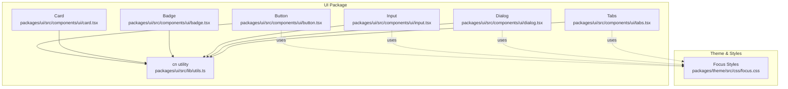
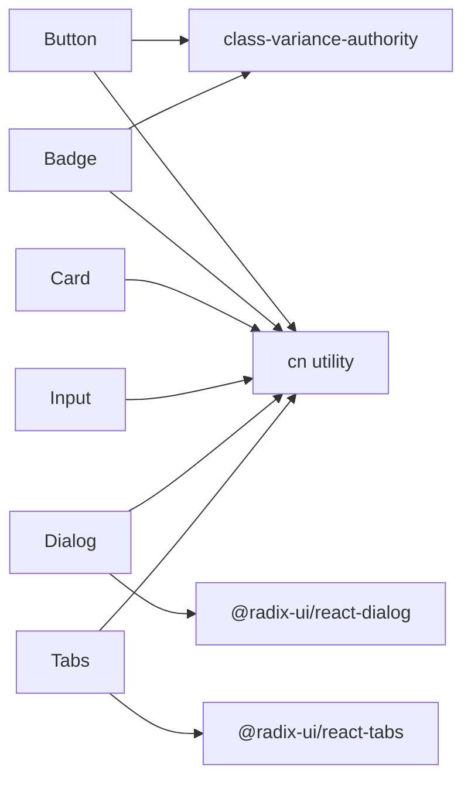

# Core UI Components

<cite>
**Referenced Files in This Document**
- [button.tsx](file://packages/ui/src/components/ui/button.tsx)
- [card.tsx](file://packages/ui/src/components/ui/card.tsx)
- [badge.tsx](file://packages/ui/src/components/ui/badge.tsx)
- [input.tsx](file://packages/ui/src/components/ui/input.tsx)
- [dialog.tsx](file://packages/ui/src/components/ui/dialog.tsx)
- [tabs.tsx](file://packages/ui/src/components/ui/tabs.tsx)
- [utils.ts](file://packages/ui/src/lib/utils.ts)
- [focus.css](file://packages/theme/src/css/focus.css)
</cite>

## Table of Contents

1. Introduction
2. Project Structure
3. Core Components
4. Architecture Overview
5. Detailed Component Analysis
6. Dependency Analysis
7. Performance Considerations
8. Troubleshooting Guide
9. Conclusion

## Introduction

This document provides comprehensive documentation for the core UI components: Button, Card, Badge, Input, Dialog, and Tabs. It covers props, events, styling options, accessibility features, variants, sizes, colors, customization, responsive behavior, keyboard navigation, screen reader support, composition patterns, and integration with Tailwind CSS classes. The components are implemented using React, Tailwind CSS via class-variance-authority (cva), and Radix primitives for accessible primitives where applicable.

## Project Structure

The core UI components live under packages/ui/src/components/ui and share a common utility for merging Tailwind classes. Styling is driven by Tailwind utilities and theme tokens exposed as CSS variables. Accessibility focus styles are centralized in a global stylesheet.



**Diagram sources**

- [button.tsx:1-57](file://packages/ui/src/components/ui/button.tsx#L1-L57)
- [card.tsx:1-90](file://packages/ui/src/components/ui/card.tsx#L1-L90)
- [badge.tsx:1-37](file://packages/ui/src/components/ui/badge.tsx#L1-L37)
- [input.tsx:1-23](file://packages/ui/src/components/ui/input.tsx#L1-L23)
- [dialog.tsx:1-120](file://packages/ui/src/components/ui/dialog.tsx#L1-L120)
- [tabs.tsx:1-56](file://packages/ui/src/components/ui/tabs.tsx#L1-L56)
- [utils.ts:1-7](file://packages/ui/src/lib/utils.ts#L1-L7)
- [focus.css:1-52](file://packages/theme/src/css/focus.css#L1-L52)

**Section sources**

- [button.tsx:1-57](file://packages/ui/src/components/ui/button.tsx#L1-L57)
- [card.tsx:1-90](file://packages/ui/src/components/ui/card.tsx#L1-L90)
- [badge.tsx:1-37](file://packages/ui/src/components/ui/badge.tsx#L1-L37)
- [input.tsx:1-23](file://packages/ui/src/components/ui/input.tsx#L1-L23)
- [dialog.tsx:1-120](file://packages/ui/src/components/ui/dialog.tsx#L1-L120)
- [tabs.tsx:1-56](file://packages/ui/src/components/ui/tabs.tsx#L1-L56)
- [utils.ts:1-7](file://packages/ui/src/lib/utils.ts#L1-L7)
- [focus.css:1-52](file://packages/theme/src/css/focus.css#L1-L52)

## Core Components

- Button: A versatile action button with variant and size options, supporting asChild composition to render as another component while preserving semantics.
- Card: A glassmorphic container with header, title, description, content, and footer slots for structured layouts.
- Badge: A small status or label indicator with multiple semantic variants.
- Input: A styled text input with focus states, disabled state, and file input support.
- Dialog: An accessible modal dialog built on Radix primitives with overlay, portal, close handling, and keyboard management.
- Tabs: A tabbed interface built on Radix primitives with list, trigger, and content composition.

Key shared behaviors:

- All components accept className to merge additional Tailwind classes via cn.
- Focus-visible styles are globally enhanced for keyboard users.
- Theme tokens are referenced through CSS variables and Tailwind utilities.

**Section sources**

- [button.tsx:1-57](file://packages/ui/src/components/ui/button.tsx#L1-L57)
- [card.tsx:1-90](file://packages/ui/src/components/ui/card.tsx#L1-L90)
- [badge.tsx:1-37](file://packages/ui/src/components/ui/badge.tsx#L1-L37)
- [input.tsx:1-23](file://packages/ui/src/components/ui/input.tsx#L1-L23)
- [dialog.tsx:1-120](file://packages/ui/src/components/ui/dialog.tsx#L1-L120)
- [tabs.tsx:1-56](file://packages/ui/src/components/ui/tabs.tsx#L1-L56)
- [utils.ts:1-7](file://packages/ui/src/lib/utils.ts#L1-L7)
- [focus.css:1-52](file://packages/theme/src/css/focus.css#L1-L52)

## Architecture Overview

The UI layer composes presentational components that rely on:

- Tailwind CSS for layout and visual design
- class-variance-authority for variant/size APIs
- @radix-ui/react-dialog and @radix-ui/react-tabs for accessible primitives
- A shared cn utility for deterministic class merging

```mermaid
classDiagram
class Button {
+variant : "default" | "destructive" | "outline" | "secondary" | "ghost" | "link"
+size : "default" | "sm" | "lg" | "icon"
+asChild? : boolean
+forwardRef()
}
class Card {
+children
+forwardRef()
}
class CardHeader
class CardTitle
class CardDescription
class CardContent
class CardFooter
class Badge {
+variant : "default" | "secondary" | "destructive" | "outline"
}
class Input {
+type
+forwardRef()
}
class Dialog {
+Root
+Trigger
+Portal
+Close
+Overlay
+Content
+Header
+Footer
+Title
+Description
}
class Tabs {
+Root
+List
+Trigger
+Content
}
Card -- CardHeader : "composes"
Card -- CardTitle : "composes"
Card -- CardDescription : "composes"
Card -- CardContent : "composes"
Card -- CardFooter : "composes"
Dialog ..> "@radix-ui/react-dialog" : "uses"
Tabs ..> "@radix-ui/react-tabs" : "uses"
Button ..> "class-variance-authority" : "uses"
Badge ..> "class-variance-authority" : "uses"
Button ..> "cn" : "uses"
Card ..> "cn" : "uses"
Badge ..> "cn" : "uses"
Input ..> "cn" : "uses"
Dialog ..> "cn" : "uses"
Tabs ..> "cn" : "uses"
```

**Diagram sources**

- [button.tsx:1-57](file://packages/ui/src/components/ui/button.tsx#L1-L57)
- [card.tsx:1-90](file://packages/ui/src/components/ui/card.tsx#L1-L90)
- [badge.tsx:1-37](file://packages/ui/src/components/ui/badge.tsx#L1-L37)
- [input.tsx:1-23](file://packages/ui/src/components/ui/input.tsx#L1-L23)
- [dialog.tsx:1-120](file://packages/ui/src/components/ui/dialog.tsx#L1-L120)
- [tabs.tsx:1-56](file://packages/ui/src/components/ui/tabs.tsx#L1-L56)
- [utils.ts:1-7](file://packages/ui/src/lib/utils.ts#L1-L7)

## Detailed Component Analysis

### Button

Purpose: Primary interactive element for actions. Supports multiple variants and sizes, and can be composed into other elements without losing semantics.

Props:

- variant: default, destructive, outline, secondary, ghost, link
- size: default, sm, lg, icon
- asChild: boolean — renders as child component via Slot instead of native button
- All standard HTML button attributes (e.g., type, disabled, onClick)

Events:

- Inherits all standard DOM events from HTMLButtonElement

Styling:

- Uses cva to compose base styles and variant/size-specific classes
- Focus-visible ring and disabled opacity handled via Tailwind utilities
- Accessible focus styles reinforced globally

Accessibility:

- Native <button> semantics when not using asChild
- Proper focus-visible ring for keyboard navigation
- Disabled state disables pointer events and reduces opacity

Variants and Sizes:

- Variants control color and hover behavior
- Sizes adjust height and padding; icon size is square

Composition:

- asChild enables rendering inside Link or custom components while preserving button semantics

Responsive Behavior:

- No explicit breakpoints; style via className overrides if needed

Tailwind Integration:

- Base and variant classes use Tailwind utilities
- Merged via cn utility

Usage Examples (paths only):

- Default usage: [button.tsx:1-57](file://packages/ui/src/components/ui/button.tsx#L1-L57)
- Variant and size: [button.tsx:7-34](file://packages/ui/src/components/ui/button.tsx#L7-L34)
- Composition with asChild: [button.tsx:42-53](file://packages/ui/src/components/ui/button.tsx#L42-L53)

**Section sources**

- [button.tsx:1-57](file://packages/ui/src/components/ui/button.tsx#L1-L57)
- [utils.ts:1-7](file://packages/ui/src/lib/utils.ts#L1-L7)
- [focus.css:1-52](file://packages/theme/src/css/focus.css#L1-L52)

### Card

Purpose: Container for grouping related content with consistent spacing and visual hierarchy.

Components:

- Card: Glassmorphic card surface with subtle border, shadow, and backdrop effects
- CardHeader: Header area with vertical spacing
- CardTitle: Prominent heading within header
- CardDescription: Secondary descriptive text
- CardContent: Main body content area
- CardFooter: Footer area for actions or metadata

Props:

- Each component accepts standard HTML div attributes and className

Styling:

- Glass effect via backdrop-blur and background opacity
- Hover and active micro-interactions
- Focus-visible ring for accessibility

Accessibility:

- Semantic headings via CardTitle
- Clear separation of header, content, and footer improves screen reader flow

Composition:

- Compose children across CardHeader, CardTitle, CardDescription, CardContent, CardFooter

Responsive Behavior:

- Padding and layout adapt via Tailwind utilities; customize with className

Tailwind Integration:

- Extensive use of Tailwind utilities for spacing, typography, shadows, and transitions

Usage Examples (paths only):

- Full card structure: [card.tsx:1-90](file://packages/ui/src/components/ui/card.tsx#L1-L90)
- Title and description: [card.tsx:35-59](file://packages/ui/src/components/ui/card.tsx#L35-L59)
- Content and footer: [card.tsx:62-80](file://packages/ui/src/components/ui/card.tsx#L62-L80)

**Section sources**

- [card.tsx:1-90](file://packages/ui/src/components/ui/card.tsx#L1-L90)
- [utils.ts:1-7](file://packages/ui/src/lib/utils.ts#L1-L7)

### Badge

Purpose: Small label or status indicator with semantic variants.

Props:

- variant: default, secondary, destructive, outline
- All standard HTML div attributes and className

Styling:

- Pill shape with border and background based on variant
- Hover states and transition-colors for smooth feedback
- Focus-visible ring for keyboard users

Accessibility:

- Use role="status" or aria-label when conveying dynamic information
- Ensure sufficient contrast per variant

Variants:

- default: primary background
- secondary: muted background
- destructive: error-like appearance
- outline: minimal emphasis

Usage Examples (paths only):

- Variants and base styles: [badge.tsx:1-37](file://packages/ui/src/components/ui/badge.tsx#L1-L37)

**Section sources**

- [badge.tsx:1-37](file://packages/ui/src/components/ui/badge.tsx#L1-L37)
- [utils.ts:1-7](file://packages/ui/src/lib/utils.ts#L1-L7)
- [focus.css:1-52](file://packages/theme/src/css/focus.css#L1-L52)

### Input

Purpose: Text input field with consistent styling and focus states.

Props:

- type: string (e.g., text, email, password)
- All standard HTML input attributes and className

Styling:

- Rounded borders, placeholder styling, and file input enhancements
- Focus-visible ring and border highlight
- Disabled state with reduced opacity and cursor

Accessibility:

- Proper focus-visible ring for keyboard navigation
- Compatible with form labels and validation messages

Responsive Behavior:

- Width adapts to container; customize via className

Tailwind Integration:

- Uses Tailwind utilities for spacing, typography, and focus states

Usage Examples (paths only):

- Base input implementation: [input.tsx:1-23](file://packages/ui/src/components/ui/input.tsx#L1-L23)

**Section sources**

- [input.tsx:1-23](file://packages/ui/src/components/ui/input.tsx#L1-L23)
- [utils.ts:1-7](file://packages/ui/src/lib/utils.ts#L1-L7)
- [focus.css:1-52](file://packages/theme/src/css/focus.css#L1-L52)

### Dialog

Purpose: Accessible modal dialog with overlay, portal, and keyboard management.

Components:

- Dialog: Root primitive
- DialogTrigger: Element to open the dialog
- DialogPortal: Portal for rendering outside the DOM tree
- DialogOverlay: Backdrop overlay
- DialogContent: Modal content wrapper with animations
- DialogClose: Close button
- DialogHeader, DialogFooter: Layout helpers
- DialogTitle, DialogDescription: Semantic headings and descriptions

Props:

- Each component forwards appropriate Radix props and className

Events:

- Controlled or uncontrolled open/close via Radix state
- Close triggered by Escape key and close button

Styling:

- Centered fixed positioning with z-index layering
- Fade and zoom animations for open/close states
- Responsive rounded corners on larger screens

Accessibility:

- Built on Radix primitives ensuring correct ARIA roles, focus trapping, and keyboard navigation
- sr-only text for close button icon

Composition:

- Combine Trigger, Content, Header/Footer, Title/Description for complete dialogs

Responsive Behavior:

- Max width and rounding adapt at sm breakpoint

Tailwind Integration:

- Animation states controlled via data-[state] selectors and Tailwind utilities

Usage Examples (paths only):

- Overlay and content: [dialog.tsx:17-54](file://packages/ui/src/components/ui/dialog.tsx#L17-L54)
- Header and footer: [dialog.tsx:56-82](file://packages/ui/src/components/ui/dialog.tsx#L56-L82)
- Title and description: [dialog.tsx:84-106](file://packages/ui/src/components/ui/dialog.tsx#L84-L106)

**Section sources**

- [dialog.tsx:1-120](file://packages/ui/src/components/ui/dialog.tsx#L1-L120)
- [utils.ts:1-7](file://packages/ui/src/lib/utils.ts#L1-L7)
- [focus.css:1-52](file://packages/theme/src/css/focus.css#L1-L52)

### Tabs

Purpose: Tabbed interface for organizing content into switchable panels.

Components:

- Tabs: Root primitive
- TabsList: Tab bar container
- TabsTrigger: Individual tab buttons
- TabsContent: Panel content for each tab

Props:

- Controlled value via value and onValueChange on Tabs
- Each component forwards Radix props and className

Events:

- Value changes propagate via onValueChange
- Keyboard navigation supported by Radix (arrow keys, Home/End)

Styling:

- Active state highlights via data-[state=active]
- Focus-visible rings for keyboard users

Accessibility:

- Correct ARIA roles and attributes provided by Radix
- Screen readers announce active tab and panel content

Composition:

- Pair TabsList with multiple TabsTrigger and corresponding TabsContent

Responsive Behavior:

- Inline-flex layout adapts to available space; customize via className

Tailwind Integration:

- Uses Tailwind utilities for spacing, typography, and state-based styling

Usage Examples (paths only):

- List, trigger, and content: [tabs.tsx:1-56](file://packages/ui/src/components/ui/tabs.tsx#L1-L56)

**Section sources**

- [tabs.tsx:1-56](file://packages/ui/src/components/ui/tabs.tsx#L1-L56)
- [utils.ts:1-7](file://packages/ui/src/lib/utils.ts#L1-L7)
- [focus.css:1-52](file://packages/theme/src/css/focus.css#L1-L52)

## Dependency Analysis

The components depend on:

- Tailwind CSS utilities for styling
- class-variance-authority for variant APIs (Button, Badge)
- @radix-ui/react-dialog and @radix-ui/react-tabs for accessible primitives (Dialog, Tabs)
- Shared cn utility for deterministic class merging



**Diagram sources**

- [button.tsx:1-57](file://packages/ui/src/components/ui/button.tsx#L1-L57)
- [badge.tsx:1-37](file://packages/ui/src/components/ui/badge.tsx#L1-L37)
- [dialog.tsx:1-120](file://packages/ui/src/components/ui/dialog.tsx#L1-L120)
- [tabs.tsx:1-56](file://packages/ui/src/components/ui/tabs.tsx#L1-L56)
- [utils.ts:1-7](file://packages/ui/src/lib/utils.ts#L1-L7)

**Section sources**

- [button.tsx:1-57](file://packages/ui/src/components/ui/button.tsx#L1-L57)
- [badge.tsx:1-37](file://packages/ui/src/components/ui/badge.tsx#L1-L37)
- [dialog.tsx:1-120](file://packages/ui/src/components/ui/dialog.tsx#L1-L120)
- [tabs.tsx:1-56](file://packages/ui/src/components/ui/tabs.tsx#L1-L56)
- [utils.ts:1-7](file://packages/ui/src/lib/utils.ts#L1-L7)

## Performance Considerations

- Prefer using asChild on Button to avoid extra DOM nodes when composing with links or custom components.
- Keep Dialog content lightweight; defer heavy computations until the dialog opens.
- Avoid excessive re-renders in Tabs by memoizing expensive panel content.
- Leverage Tailwind’s utility-first approach to minimize custom CSS and reduce bundle size.
- Use motion-reduce-friendly styles where possible to respect user preferences.

[No sources needed since this section provides general guidance]

## Troubleshooting Guide

Common issues and resolutions:

- Focus ring not visible: Ensure focus-visible styles are applied and not overridden by custom CSS. Global focus enhancements are defined centrally.
- Dialog not closing: Verify DialogClose is used or handle Escape key via Radix’s built-in behavior.
- Tabs not switching: Confirm value and onValueChange are wired correctly on Tabs and that each TabsTrigger has a matching value.
- Class conflicts: Use cn to merge Tailwind classes deterministically and avoid duplicate conflicting utilities.

**Section sources**

- [focus.css:1-52](file://packages/theme/src/css/focus.css#L1-L52)
- [dialog.tsx:17-54](file://packages/ui/src/components/ui/dialog.tsx#L17-L54)
- [tabs.tsx:1-56](file://packages/ui/src/components/ui/tabs.tsx#L1-L56)
- [utils.ts:1-7](file://packages/ui/src/lib/utils.ts#L1-L7)

## Conclusion

These core UI components provide a cohesive, accessible, and customizable foundation for building interfaces. They integrate seamlessly with Tailwind CSS, leverage Radix primitives for robust accessibility, and offer clear composition patterns. By following the documented props, variants, and best practices, teams can maintain consistency and deliver high-quality user experiences across devices and assistive technologies.

[No sources needed since this section summarizes without analyzing specific files]
