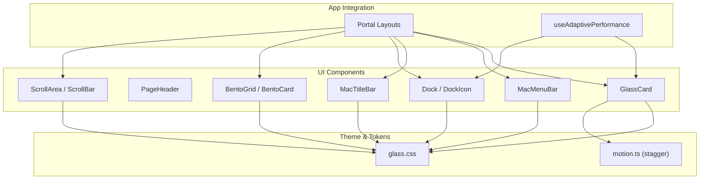
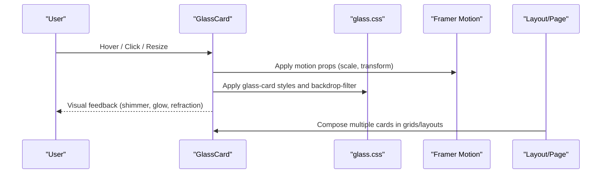
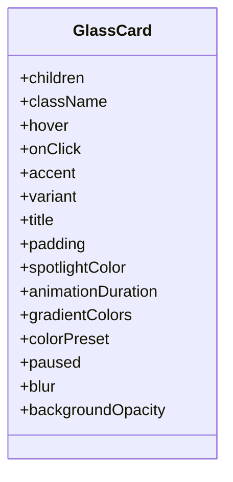
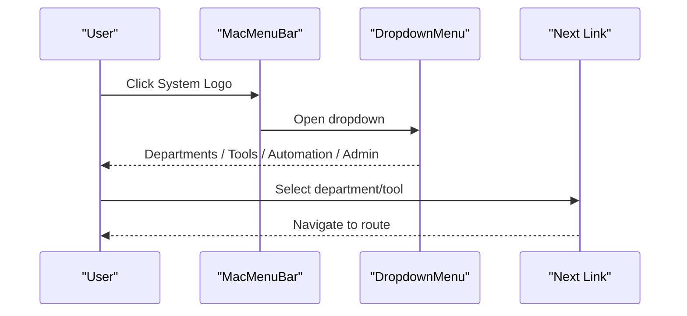
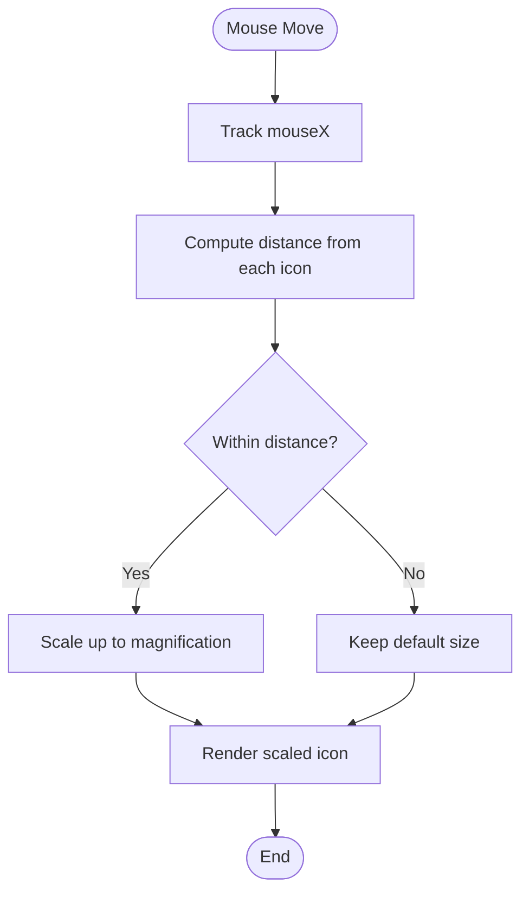
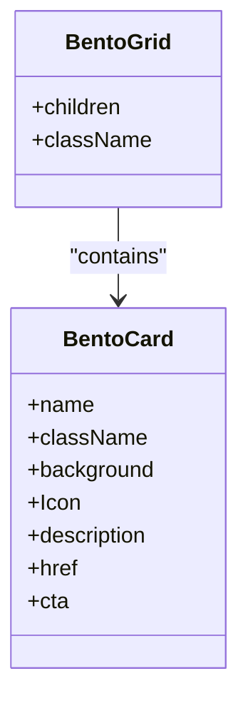
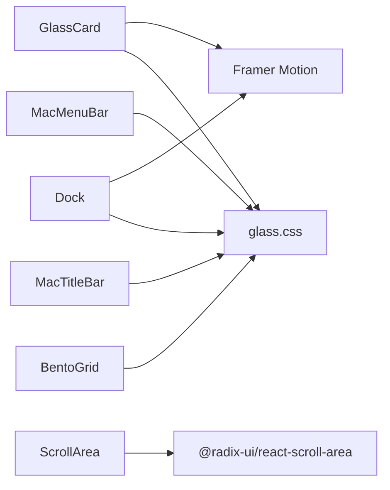

# Layout & Structure Components

<cite>
**Referenced Files in This Document**
- [GlassCard.tsx](file://packages/ui/src/components/GlassCard.tsx)
- [PageHeader.tsx](file://packages/ui/src/components/PageHeader.tsx)
- [MacMenuBar.tsx](file://packages/ui/src/components/MacMenuBar.tsx)
- [MacTitleBar.tsx](file://packages/ui/src/components/MacTitleBar.tsx)
- [dock.tsx](file://packages/ui/src/components/ui/dock.tsx)
- [bento-grid.tsx](file://packages/ui/src/components/ui/bento-grid.tsx)
- [scroll-area.tsx](file://packages/ui/src/components/ui/scroll-area.tsx)
- [glass.css](file://packages/theme/src/css/glass.css)
- [motion.ts](file://packages/theme/src/tokens/motion.ts)
- [useAdaptivePerformance.ts](file://apps/portal/hooks/useAdaptivePerformance.ts)
</cite>

## Table of Contents

1. [Introduction](#introduction)
2. [Project Structure](#project-structure)
3. [Core Components](#core-components)
4. [Architecture Overview](#architecture-overview)
5. [Detailed Component Analysis](#detailed-component-analysis)
6. [Dependency Analysis](#dependency-analysis)
7. [Performance Considerations](#performance-considerations)
8. [Troubleshooting Guide](#troubleshooting-guide)
9. [Conclusion](#conclusion)
10. [Appendices](#appendices)

## Introduction

This document provides comprehensive documentation for layout and structure components: GlassCard, PageHeader, MacMenuBar, MacTitleBar, Dock, BentoGrid, and ScrollArea. It covers props, layout behavior, spacing, responsive patterns, styling customization (including glass morphism and macOS-style interfaces), complex layouts with nested components, and performance optimization strategies for large layouts and memory management.

## Project Structure

The components are implemented as reusable React primitives within the UI package and theme tokens/styles. They integrate with Next.js app router layouts and can be composed to build complex dashboards and macOS-like interfaces.

**Diagram sources**

- [GlassCard.tsx:257-718](file://packages/ui/src/components/GlassCard.tsx#L257-L718)
- [PageHeader.tsx:1-25](file://packages/ui/src/components/PageHeader.tsx#L1-L25)
- [MacMenuBar.tsx:182-687](file://packages/ui/src/components/MacMenuBar.tsx#L182-L687)
- [MacTitleBar.tsx:14-78](file://packages/ui/src/components/MacTitleBar.tsx#L14-L78)
- [dock.tsx:36-155](file://packages/ui/src/components/ui/dock.tsx#L36-L155)
- [bento-grid.tsx:24-109](file://packages/ui/src/components/ui/bento-grid.tsx#L24-L109)
- [scroll-area.tsx:8-48](file://packages/ui/src/components/ui/scroll-area.tsx#L8-L48)
- [glass.css:51-125](file://packages/theme/src/css/glass.css#L51-L125)
- [motion.ts:41-55](file://packages/theme/src/tokens/motion.ts#L41-L55)
- [useAdaptivePerformance.ts:13-46](file://apps/portal/hooks/useAdaptivePerformance.ts#L13-L46)

**Section sources**

- [GlassCard.tsx:257-718](file://packages/ui/src/components/GlassCard.tsx#L257-L718)
- [PageHeader.tsx:1-25](file://packages/ui/src/components/PageHeader.tsx#L1-L25)
- [MacMenuBar.tsx:182-687](file://packages/ui/src/components/MacMenuBar.tsx#L182-L687)
- [MacTitleBar.tsx:14-78](file://packages/ui/src/components/MacTitleBar.tsx#L14-L78)
- [dock.tsx:36-155](file://packages/ui/src/components/ui/dock.tsx#L36-L155)
- [bento-grid.tsx:24-109](file://packages/ui/src/components/ui/bento-grid.tsx#L24-L109)
- [scroll-area.tsx:8-48](file://packages/ui/src/components/ui/scroll-area.tsx#L8-L48)
- [glass.css:51-125](file://packages/theme/src/css/glass.css#L51-L125)
- [motion.ts:41-55](file://packages/theme/src/tokens/motion.ts#L41-L55)
- [useAdaptivePerformance.ts:13-46](file://apps/portal/hooks/useAdaptivePerformance.ts#L13-L46)

## Core Components

- GlassCard: Multi-variant card supporting default, window, spotlight, glowborder, and liquid effects. Includes hover interactions, macOS traffic lights, dynamic spotlight overlay, animated border glow, and a sophisticated liquid refraction engine using SVG filters and Canvas displacement maps.
- PageHeader: Simple header with title and optional localized date display.
- MacMenuBar: macOS-style top bar with system menu dropdown, search input, and right slot; integrates navigation and external tools.
- MacTitleBar: macOS-style window title bar with traffic light buttons and optional right slot.
- Dock: Magnification dock with configurable icon size, magnification, distance, and direction.
- BentoGrid: Responsive grid with BentoCard for feature showcases and CTAs.
- ScrollArea: Accessible scroll container with custom scrollbar styling.

**Section sources**

- [GlassCard.tsx:257-718](file://packages/ui/src/components/GlassCard.tsx#L257-L718)
- [PageHeader.tsx:1-25](file://packages/ui/src/components/PageHeader.tsx#L1-L25)
- [MacMenuBar.tsx:182-687](file://packages/ui/src/components/MacMenuBar.tsx#L182-L687)
- [MacTitleBar.tsx:14-78](file://packages/ui/src/components/MacTitleBar.tsx#L14-L78)
- [dock.tsx:36-155](file://packages/ui/src/components/ui/dock.tsx#L36-L155)
- [bento-grid.tsx:24-109](file://packages/ui/src/components/ui/bento-grid.tsx#L24-L109)
- [scroll-area.tsx:8-48](file://packages/ui/src/components/ui/scroll-area.tsx#L8-L48)

## Architecture Overview

These components follow a layered architecture:

- Presentation layer: UI components render styled elements and handle user interactions.
- Theme layer: Shared CSS variables and utility classes define glass morphism, shadows, and transitions.
- Motion layer: Framer Motion and CSS animations provide smooth transitions and reduced-motion support.
- App integration: Layouts compose these components into pages and dashboards.

**Diagram sources**

- [GlassCard.tsx:440-515](file://packages/ui/src/components/GlassCard.tsx#L440-L515)
- [glass.css:78-125](file://packages/theme/src/css/glass.css#L78-L125)

## Detailed Component Analysis

### GlassCard

GlassCard is a highly customizable card with multiple visual variants and advanced effects.

Key behaviors:

- Variants: default, window, spotlight, glowborder, liquid.
- Spotlight variant tracks mouse position to create a radial gradient overlay.
- GlowBorder variant renders an animated conic gradient behind the card with blur to simulate a glowing border.
- Liquid variant uses a Canvas-generated displacement map and SVG filter chain to produce refraction and chromatic aberration at edges, plus a sheen sweep on hover.
- Window variant includes macOS-style traffic lights and a title bar area.
- Accessibility: Respects prefers-reduced-motion and touch detection to disable heavy effects when needed.

Props overview:

- children, className, hover, onClick, accent, variant, title, padding
- Spotlight: spotlightColor
- GlowBorder: animationDuration, gradientColors, colorPreset, paused, blur, backgroundOpacity

Responsive and styling:

- Uses Tailwind utilities and CSS variables for consistent theming.
- Backdrop blur and saturation via glass-card class.
- Optional padding toggled per variant.

Complex layout examples:

- Nesting multiple GlassCards inside BentoGrid or ScrollArea for dashboard panels.
- Using variant="window" to emulate application windows with titles and controls.

**Diagram sources**

- [GlassCard.tsx:13-41](file://packages/ui/src/components/GlassCard.tsx#L13-L41)

**Section sources**

- [GlassCard.tsx:257-718](file://packages/ui/src/components/GlassCard.tsx#L257-L718)
- [glass.css:78-125](file://packages/theme/src/css/glass.css#L78-L125)

### PageHeader

PageHeader displays a page title and optionally a localized date string.

Props:

- title: string
- showDate?: boolean (default true)

Usage:

- Place at the top of content sections to provide context and temporal information.

**Section sources**

- [PageHeader.tsx:1-25](file://packages/ui/src/components/PageHeader.tsx#L1-L25)

### MacMenuBar

MacMenuBar implements a macOS-style top bar with:

- System logo dropdown containing departments, tools, automation links, and admin panel.
- Center slot for search or custom content.
- Right slot for system tray items.

Props:

- menuItems?: readonly string[]
- centerSlot?: React.ReactNode
- rightSlot?: React.ReactNode
- className?: string

Behavior:

- Dropdown menus use accessible primitives and glass-styled content.
- Search form opens Google results in a new tab.
- Integrates with focus mode state to adjust branding.

**Diagram sources**

- [MacMenuBar.tsx:218-377](file://packages/ui/src/components/MacMenuBar.tsx#L218-L377)

**Section sources**

- [MacMenuBar.tsx:182-687](file://packages/ui/src/components/MacMenuBar.tsx#L182-L687)

### MacTitleBar

MacTitleBar provides macOS-style window controls and centered title.

Props:

- title?: string
- className?: string
- onClose?: () => void
- onMinimize?: () => void
- onMaximize?: () => void
- rightSlot?: React.ReactNode

Behavior:

- Traffic light buttons with hover-visible symbols.
- Balanced layout with spacer when no right slot is provided.

**Section sources**

- [MacTitleBar.tsx:14-78](file://packages/ui/src/components/MacTitleBar.tsx#L14-L78)

### Dock

Dock creates a magnifying dock effect similar to macOS Dock.

Props:

- className?: string
- iconSize?: number
- iconMagnification?: number
- disableMagnification?: boolean
- iconDistance?: number
- direction?: "top" | "middle" | "bottom"
- children: React.ReactNode

Behavior:

- Tracks mouse X position and scales icons near cursor.
- Uses framer-motion springs for smooth scaling.
- Supports vertical alignment via direction prop.

**Diagram sources**

- [dock.tsx:50-86](file://packages/ui/src/components/ui/dock.tsx#L50-L86)
- [dock.tsx:117-134](file://packages/ui/src/components/ui/dock.tsx#L117-L134)

**Section sources**

- [dock.tsx:36-155](file://packages/ui/src/components/ui/dock.tsx#L36-L155)

### BentoGrid

BentoGrid provides a responsive grid layout for showcasing features or modules.

Props:

- BentoGrid: children, className
- BentoCard: name, className, background, Icon, description, href, cta

Behavior:

- Grid adapts columns based on breakpoints.
- Cards include hover lift and CTA reveal.

**Diagram sources**

- [bento-grid.tsx:24-36](file://packages/ui/src/components/ui/bento-grid.tsx#L24-L36)
- [bento-grid.tsx:38-109](file://packages/ui/src/components/ui/bento-grid.tsx#L38-L109)

**Section sources**

- [bento-grid.tsx:24-109](file://packages/ui/src/components/ui/bento-grid.tsx#L24-L109)

### ScrollArea

ScrollArea wraps content in an accessible scroll container with a styled scrollbar.

Props:

- Inherits from Radix ScrollArea.Root
- Orientation for ScrollBar: vertical or horizontal

Behavior:

- Maintains rounded corners inherited from parent.
- Customizable scrollbar appearance via className.

**Section sources**

- [scroll-area.tsx:8-48](file://packages/ui/src/components/ui/scroll-area.tsx#L8-L48)

## Dependency Analysis

Component relationships and shared dependencies:

- GlassCard depends on Framer Motion and glass.css for effects.
- MacMenuBar composes dropdown menus and links.
- Dock relies on Framer Motion for spring-based magnification.
- BentoGrid uses Tailwind grid utilities and Button component.
- ScrollArea wraps Radix ScrollArea primitives.

**Diagram sources**

- [GlassCard.tsx:3-11](file://packages/ui/src/components/GlassCard.tsx#L3-L11)
- [dock.tsx:5-12](file://packages/ui/src/components/ui/dock.tsx#L5-L12)
- [scroll-area.tsx:3-6](file://packages/ui/src/components/ui/scroll-area.tsx#L3-L6)
- [glass.css:78-125](file://packages/theme/src/css/glass.css#L78-L125)

**Section sources**

- [GlassCard.tsx:3-11](file://packages/ui/src/components/GlassCard.tsx#L3-L11)
- [dock.tsx:5-12](file://packages/ui/src/components/ui/dock.tsx#L5-L12)
- [scroll-area.tsx:3-6](file://packages/ui/src/components/ui/scroll-area.tsx#L3-L6)
- [glass.css:78-125](file://packages/theme/src/css/glass.css#L78-L125)

## Performance Considerations

- Reduced motion and touch detection: GlassCard disables heavy effects when prefers-reduced-motion is set or on touch devices.
- Adaptive performance: The app monitors frame rates and can signal downgrading rendering when FPS drops below thresholds or when Focus Mode is enabled.
- Staggered animations: Motion tokens provide stagger configurations for lists and bento layouts to avoid jank during initial render.
- Memory management: Avoid excessive concurrent liquid refractions; limit the number of active GlassCard liquid variants on screen. Use ScrollArea to virtualize long lists where possible.

Recommendations:

- Prefer default or window variants for dense dashboards; reserve liquid for focal cards.
- Pause glow animations when not visible or when low performance is detected.
- Use BentoGrid’s responsive columns to reduce DOM depth on small screens.
- Combine ScrollArea with pagination or virtualization for large datasets.

**Section sources**

- [GlassCard.tsx:286-295](file://packages/ui/src/components/GlassCard.tsx#L286-L295)
- [useAdaptivePerformance.ts:13-46](file://apps/portal/hooks/useAdaptivePerformance.ts#L13-L46)
- [motion.ts:41-55](file://packages/theme/src/tokens/motion.ts#L41-L55)

## Troubleshooting Guide

Common issues and resolutions:

- Effects not appearing on mobile: Ensure touch detection does not block necessary interactions; verify prefers-reduced-motion settings.
- Liquid refraction artifacts: Check canvas sizing and ResizeObserver fallback; ensure proper dimensions before generating displacement maps.
- Glow border misalignment: Confirm that inner mask inset matches outer spinner inset and border-radius inheritance.
- Dock magnification jitter: Tune magnification and distance props; consider disabling magnification for very dense docks.
- ScrollArea corner overlap: Ensure parent containers have matching border-radius and overflow-hidden.

**Section sources**

- [GlassCard.tsx:339-362](file://packages/ui/src/components/GlassCard.tsx#L339-L362)
- [GlassCard.tsx:517-535](file://packages/ui/src/components/GlassCard.tsx#L517-L535)
- [dock.tsx:117-134](file://packages/ui/src/components/ui/dock.tsx#L117-L134)
- [scroll-area.tsx:11-23](file://packages/ui/src/components/ui/scroll-area.tsx#L11-L23)

## Conclusion

The layout and structure components provide a cohesive design system combining glass morphism, macOS-style interfaces, and modern grid layouts. With careful attention to performance and accessibility, they enable rich, responsive dashboards and applications. Use variants judiciously, leverage responsive grids, and apply adaptive performance strategies to maintain smooth interactions across devices.

## Appendices

### Styling Customization Reference

- Glass morphism variables and classes: glass-card, glass-hover, liquid-glass utilities.
- Motion tokens: stagger configurations for cards, lists, and bento layouts.

**Section sources**

- [glass.css:51-125](file://packages/theme/src/css/glass.css#L51-L125)
- [motion.ts:41-55](file://packages/theme/src/tokens/motion.ts#L41-L55)
