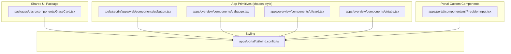
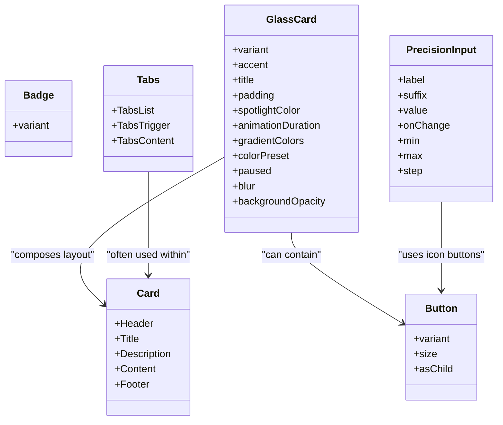
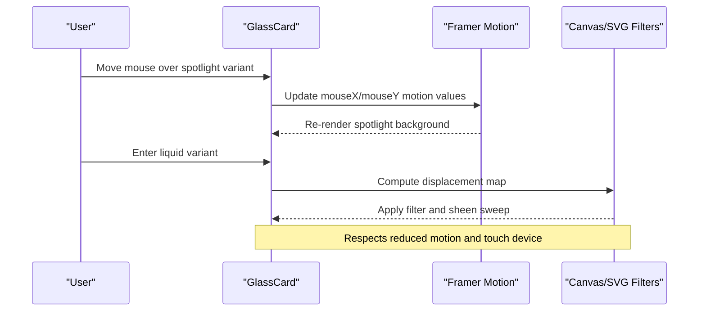
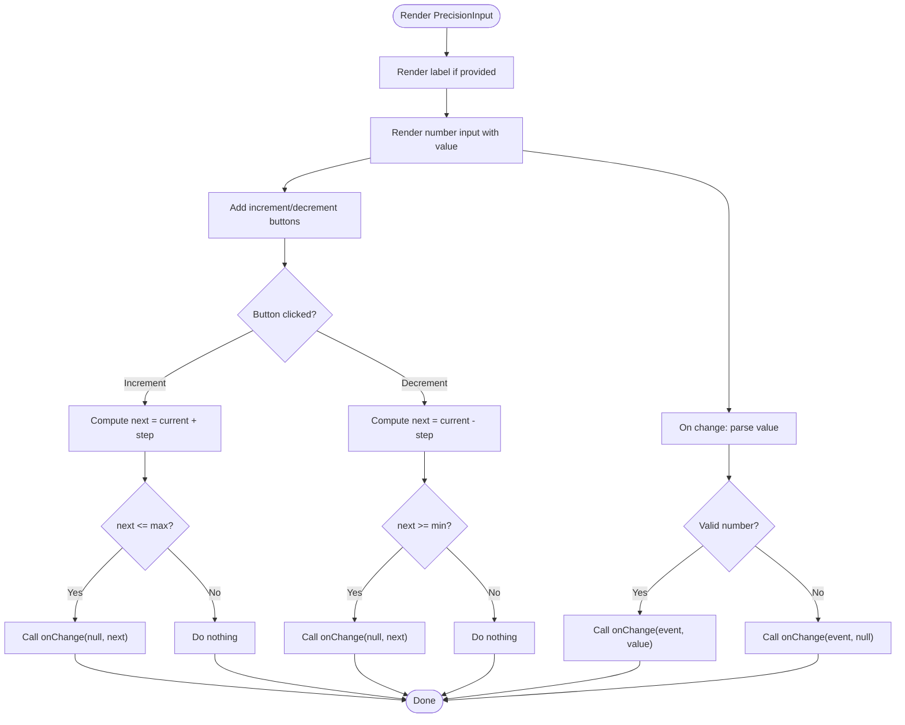
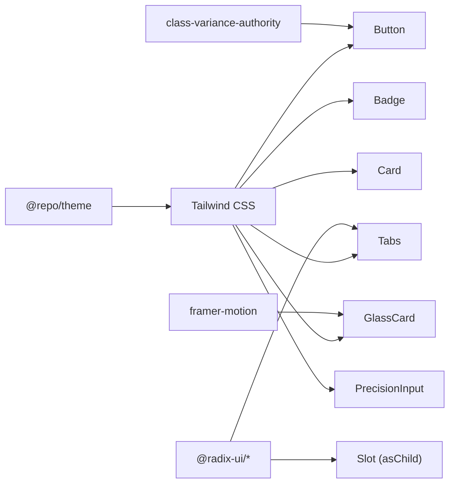

# UI Component Library

<cite>
**Referenced Files in This Document**
- [GlassCard.tsx](file://packages/ui/src/components/GlassCard.tsx)
- [PrecisionInput.tsx](file://apps/portal/components/ui/PrecisionInput.tsx)
- [badge.tsx](file://apps/overview/components/ui/badge.tsx)
- [card.tsx](file://apps/overview/components/ui/card.tsx)
- [tabs.tsx](file://apps/overview/components/ui/tabs.tsx)
- [button.tsx](file://tools/secrin/apps/web/components/ui/button.tsx)
- [tailwind.config.ts](file://apps/portal/tailwind.config.ts)
</cite>

## Table of Contents

1. [Introduction](#introduction)
2. [Project Structure](#project-structure)
3. [Core Components](#core-components)
4. [Architecture Overview](#architecture-overview)
5. [Detailed Component Analysis](#detailed-component-analysis)
6. [Dependency Analysis](#dependency-analysis)
7. [Performance Considerations](#performance-considerations)
8. [Troubleshooting Guide](#troubleshooting-guide)
9. [Conclusion](#conclusion)
10. [Appendices](#appendices)

## Introduction

This document describes the shared UI component library built on shadcn-style primitives and Tailwind CSS. It covers standard components (Button, Badge, Card, Tabs) and custom components (GlassCard, PrecisionInput). For each component, you will find:

- Props and events
- Styling options and design tokens
- Accessibility features
- Usage examples via code snippet paths
- Composition patterns and customization approaches
- Integration with Tailwind CSS
- Performance considerations and tree-shaking strategies

The library emphasizes accessibility-first primitives, composable building blocks, and a cohesive glass-inspired visual language.

## Project Structure

The UI components are implemented across multiple locations:

- Shared advanced components live under packages/ui/src/components (e.g., GlassCard)
- App-scoped shadcn-style primitives exist under apps/\*/components/ui (e.g., Badge, Card, Tabs, Button)
- Tailwind configuration is centralized and referenced by applications

**Diagram sources**

- [GlassCard.tsx:1-719](file://packages/ui/src/components/GlassCard.tsx#L1-L719)
- [button.tsx:1-60](file://tools/secrin/apps/web/components/ui/button.tsx#L1-L60)
- [badge.tsx:1-39](file://apps/overview/components/ui/badge.tsx#L1-L39)
- [card.tsx:1-76](file://apps/overview/components/ui/card.tsx#L1-L76)
- [tabs.tsx:1-56](file://apps/overview/components/ui/tabs.tsx#L1-L56)
- [PrecisionInput.tsx:1-111](file://apps/portal/components/ui/PrecisionInput.tsx#L1-L111)
- [tailwind.config.ts:1-1](file://apps/portal/tailwind.config.ts#L1-L1)

**Section sources**

- [GlassCard.tsx:1-719](file://packages/ui/src/components/GlassCard.tsx#L1-L719)
- [button.tsx:1-60](file://tools/secrin/apps/web/components/ui/button.tsx#L1-L60)
- [badge.tsx:1-39](file://apps/overview/components/ui/badge.tsx#L1-L39)
- [card.tsx:1-76](file://apps/overview/components/ui/card.tsx#L1-L76)
- [tabs.tsx:1-56](file://apps/overview/components/ui/tabs.tsx#L1-L56)
- [PrecisionInput.tsx:1-111](file://apps/portal/components/ui/PrecisionInput.tsx#L1-L111)
- [tailwind.config.ts:1-1](file://apps/portal/tailwind.config.ts#L1-L1)

## Core Components

- Button: A shadcn-style button using class-variance-authority for variants and sizes, with Radix Slot support for asChild composition.
- Badge: A small label component with variant-driven styling and focus ring behavior.
- Card: A container with semantic parts (Header, Title, Description, Content, Footer).
- Tabs: Accessible tabbed interface built on Radix Tabs primitives.
- GlassCard: A high-fidelity glass card with multiple visual variants (default, window, spotlight, glowborder, liquid), motion effects, and accessibility-aware animations.
- PrecisionInput: A numeric input with increment/decrement controls, suffix display, and accessible labeling.

Key integration points:

- All components use a utility to merge classes (cn) and integrate with Tailwind.
- The portal app references a shared Tailwind preset from @repo/theme.

**Section sources**

- [button.tsx:1-60](file://tools/secrin/apps/web/components/ui/button.tsx#L1-L60)
- [badge.tsx:1-39](file://apps/overview/components/ui/badge.tsx#L1-L39)
- [card.tsx:1-76](file://apps/overview/components/ui/card.tsx#L1-L76)
- [tabs.tsx:1-56](file://apps/overview/components/ui/tabs.tsx#L1-L56)
- [GlassCard.tsx:1-719](file://packages/ui/src/components/GlassCard.tsx#L1-L719)
- [PrecisionInput.tsx:1-111](file://apps/portal/components/ui/PrecisionInput.tsx#L1-L111)
- [tailwind.config.ts:1-1](file://apps/portal/tailwind.config.ts#L1-L1)

## Architecture Overview

The library follows a layered architecture:

- Primitives layer: Small, focused components (Button, Badge, Card, Tabs) that compose into higher-level UI.
- Custom components layer: Feature-rich components (GlassCard, PrecisionInput) that build on primitives and theme tokens.
- Styling layer: Tailwind CSS with a shared preset and CSS variables for theming.

**Diagram sources**

- [button.tsx:1-60](file://tools/secrin/apps/web/components/ui/button.tsx#L1-L60)
- [badge.tsx:1-39](file://apps/overview/components/ui/badge.tsx#L1-L39)
- [card.tsx:1-76](file://apps/overview/components/ui/card.tsx#L1-L76)
- [tabs.tsx:1-56](file://apps/overview/components/ui/tabs.tsx#L1-L56)
- [GlassCard.tsx:1-719](file://packages/ui/src/components/GlassCard.tsx#L1-L719)
- [PrecisionInput.tsx:1-111](file://apps/portal/components/ui/PrecisionInput.tsx#L1-L111)

## Detailed Component Analysis

### Button

- Purpose: Primary interactive element with consistent styles and variants.
- Props:
  - variant: default, destructive, outline, secondary, ghost, link
  - size: default, sm, lg, icon, icon-sm, icon-lg
  - asChild: boolean to render as another component via Radix Slot
- Events: Inherits all native button events.
- Styling: Uses cva for variant/size combinations; integrates with Tailwind tokens.
- Accessibility: Focus-visible rings, disabled states, aria-invalid integration.
- Usage example path: [button.tsx:1-60](file://tools/secrin/apps/web/components/ui/button.tsx#L1-L60)

**Section sources**

- [button.tsx:1-60](file://tools/secrin/apps/web/components/ui/button.tsx#L1-L60)

### Badge

- Purpose: Compact status or categorization labels.
- Props:
  - variant: default, secondary, destructive, outline, accent
- Styling: Rounded pill shape with border and hover states; focus ring for keyboard navigation.
- Accessibility: Focusable via outline and ring utilities.
- Usage example path: [badge.tsx:1-39](file://apps/overview/components/ui/badge.tsx#L1-L39)

**Section sources**

- [badge.tsx:1-39](file://apps/overview/components/ui/badge.tsx#L1-L39)

### Card

- Purpose: Container for grouped content with clear sections.
- Parts:
  - Card: Outer container
  - CardHeader: Header area
  - CardTitle: Prominent title
  - CardDescription: Secondary text
  - CardContent: Main content area
  - CardFooter: Actions or meta
- Styling: Semantic spacing and typography; dark-mode friendly tokens.
- Accessibility: Semantic HTML elements (h3, p, divs) with proper roles.
- Usage example path: [card.tsx:1-76](file://apps/overview/components/ui/card.tsx#L1-L76)

**Section sources**

- [card.tsx:1-76](file://apps/overview/components/ui/card.tsx#L1-L76)

### Tabs

- Purpose: Organize content into switchable panels.
- Parts:
  - Tabs: Root
  - TabsList: Tab bar
  - TabsTrigger: Individual tabs
  - TabsContent: Panel content
- Styling: Active state highlighting, focus rings, and transitions.
- Accessibility: Built on Radix Tabs for correct ARIA attributes and keyboard navigation.
- Usage example path: [tabs.tsx:1-56](file://apps/overview/components/ui/tabs.tsx#L1-L56)

**Section sources**

- [tabs.tsx:1-56](file://apps/overview/components/ui/tabs.tsx#L1-L56)

### GlassCard

- Purpose: High-end glass-styled card with multiple visual variants and motion effects.
- Variants:
  - default: Standard glass panel
  - window: macOS-like title bar with traffic lights
  - spotlight: Mouse-following radial gradient overlay
  - glowborder: Animated conic-gradient border effect
  - liquid: Refraction-based backdrop with sheen sweep
- Key props:
  - children, className, hover, onClick
  - accent: green, blue, red, cyan, indigo, violet, alert, none
  - variant, title, padding
  - Spotlight: spotlightColor
  - GlowBorder: animationDuration, gradientColors, colorPreset, paused, blur, backgroundOpacity
- Interactions:
  - Hover scale/tap feedback (when enabled)
  - Spotlight mouse tracking with motion values
  - Liquid refraction computed via canvas and SVG filters
- Accessibility:
  - Respects prefers-reduced-motion
  - Touch detection disables pointer-heavy effects
  - aria-hidden for decorative layers
- Styling:
  - Backdrop blur, saturation, contrast
  - Shimmer and light-sweep overlays
  - Accent-specific hover borders and shadows
- Usage example path: [GlassCard.tsx:1-719](file://packages/ui/src/components/GlassCard.tsx#L1-L719)

**Diagram sources**

- [GlassCard.tsx:257-719](file://packages/ui/src/components/GlassCard.tsx#L257-L719)

**Section sources**

- [GlassCard.tsx:1-719](file://packages/ui/src/components/GlassCard.tsx#L1-L719)

### PrecisionInput

- Purpose: Numeric input with step controls and optional suffix.
- Props:
  - label: Accessible label text
  - suffix: Displayed unit or suffix
  - value: Controlled number or null
  - onChange: Handler receiving event and new value
  - min, max, step: Number constraints
- Behavior:
  - Increment/decrement respects min/max bounds
  - Empty input sets value to null
  - Suffix positioned absolutely inside the control
- Accessibility:
  - Label associates with input
  - Keyboard-friendly increment/decrement buttons
- Styling:
  - Focus ring and border emphasis
  - Theme variables for colors
- Usage example path: [PrecisionInput.tsx:1-111](file://apps/portal/components/ui/PrecisionInput.tsx#L1-L111)

**Diagram sources**

- [PrecisionInput.tsx:1-111](file://apps/portal/components/ui/PrecisionInput.tsx#L1-L111)

**Section sources**

- [PrecisionInput.tsx:1-111](file://apps/portal/components/ui/PrecisionInput.tsx#L1-L111)

## Dependency Analysis

- External dependencies:
  - Radix UI primitives for Tabs and Slot
  - Framer Motion for animations and motion values
  - Class-variance-authority for variant composition
  - Tailwind CSS for styling and responsive utilities
- Internal dependencies:
  - Utility functions for class merging and theme integration
  - Shared Tailwind preset via @repo/theme

**Diagram sources**

- [tabs.tsx:1-56](file://apps/overview/components/ui/tabs.tsx#L1-L56)
- [button.tsx:1-60](file://tools/secrin/apps/web/components/ui/button.tsx#L1-L60)
- [GlassCard.tsx:1-719](file://packages/ui/src/components/GlassCard.tsx#L1-L719)
- [tailwind.config.ts:1-1](file://apps/portal/tailwind.config.ts#L1-L1)

**Section sources**

- [tabs.tsx:1-56](file://apps/overview/components/ui/tabs.tsx#L1-L56)
- [button.tsx:1-60](file://tools/secrin/apps/web/components/ui/button.tsx#L1-L60)
- [GlassCard.tsx:1-719](file://packages/ui/src/components/GlassCard.tsx#L1-L719)
- [tailwind.config.ts:1-1](file://apps/portal/tailwind.config.ts#L1-L1)

## Performance Considerations

- Prefer static variants and avoid excessive runtime style changes.
- Use asChild sparingly; it adds an extra rendering layer.
- Reduce motion:
  - GlassCard respects prefers-reduced-motion and touch devices.
  - Disable heavy effects when not needed.
- Liquid variant:
  - Canvas and SVG filters can be expensive; consider limiting usage or disabling blur/background opacity where possible.
- Tree-shaking:
  - Import only what you need (e.g., specific variants or components).
  - Avoid importing large bundles through barrel exports unless necessary.
- Responsive behavior:
  - Leverage Tailwind’s responsive prefixes to adapt layouts and font sizes.
  - Ensure focus rings remain visible at all breakpoints.

[No sources needed since this section provides general guidance]

## Troubleshooting Guide

- Focus visibility issues:
  - Ensure focus-visible styles are present; verify Tailwind config includes focus utilities.
- Variant mismatches:
  - Confirm variant names match the component’s cva definitions.
- Animation jank:
  - If animations stutter, disable non-essential effects (e.g., blur, shimmer) or reduce motion.
- Input validation:
  - For PrecisionInput, ensure onChange handles null values and invalid inputs gracefully.
- Accessibility:
  - Verify labels associate with inputs and that interactive elements have appropriate roles and states.

**Section sources**

- [PrecisionInput.tsx:1-111](file://apps/portal/components/ui/PrecisionInput.tsx#L1-L111)
- [GlassCard.tsx:257-719](file://packages/ui/src/components/GlassCard.tsx#L257-L719)

## Conclusion

This UI component library provides a robust set of accessible, composable primitives and polished custom components. By leveraging shadcn-style patterns, Radix primitives, and Tailwind CSS, teams can maintain consistency while enabling rich interactions. Follow the usage paths and guidelines above to integrate components effectively and optimize performance.

[No sources needed since this section summarizes without analyzing specific files]

## Appendices

### Design System Tokens and Color Schemes

- Tokens are defined in CSS variables and registered in Tailwind presets.
- Common tokens include backgrounds, text colors, borders, and glass surfaces.
- Refer to the shared theme configuration for exact mappings.

**Section sources**

- [tailwind.config.ts:1-1](file://apps/portal/tailwind.config.ts#L1-L1)

### Usage Examples (Code Snippet Paths)

- Button: [button.tsx:1-60](file://tools/secrin/apps/web/components/ui/button.tsx#L1-L60)
- Badge: [badge.tsx:1-39](file://apps/overview/components/ui/badge.tsx#L1-L39)
- Card: [card.tsx:1-76](file://apps/overview/components/ui/card.tsx#L1-L76)
- Tabs: [tabs.tsx:1-56](file://apps/overview/components/ui/tabs.tsx#L1-L56)
- GlassCard: [GlassCard.tsx:1-719](file://packages/ui/src/components/GlassCard.tsx#L1-L719)
- PrecisionInput: [PrecisionInput.tsx:1-111](file://apps/portal/components/ui/PrecisionInput.tsx#L1-L111)
