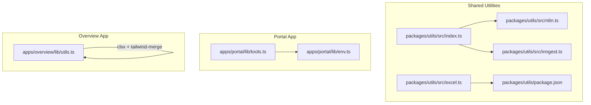
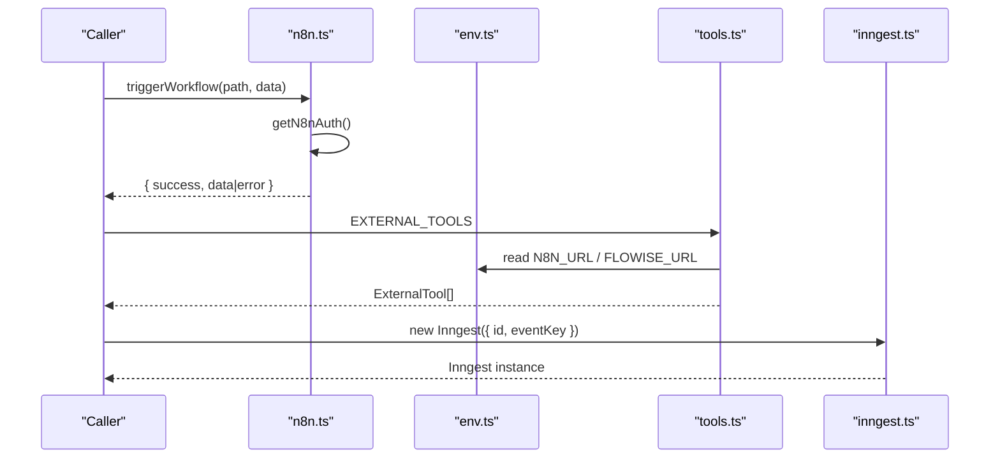
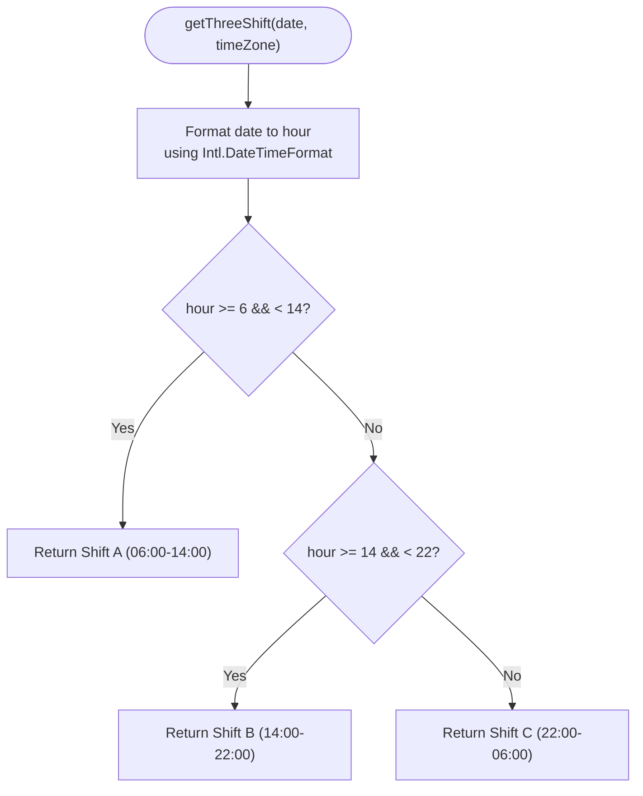
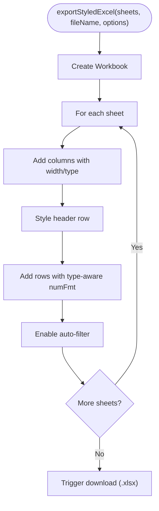
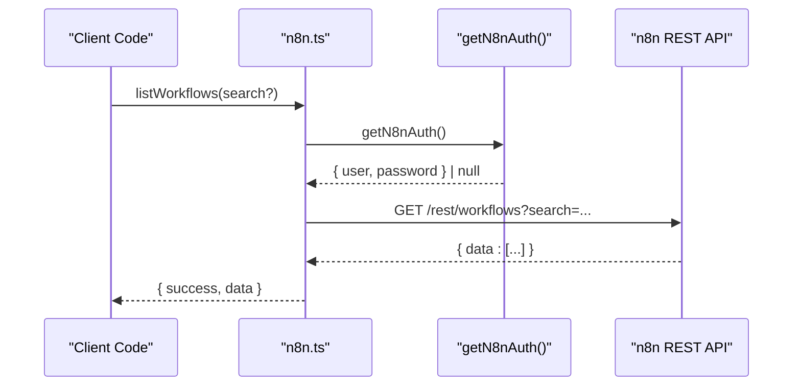
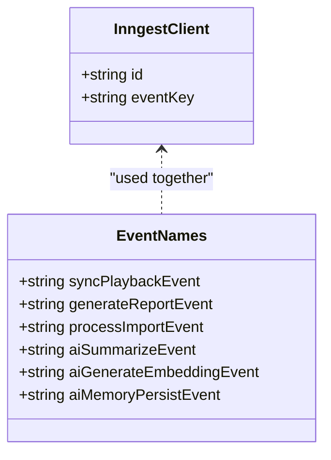
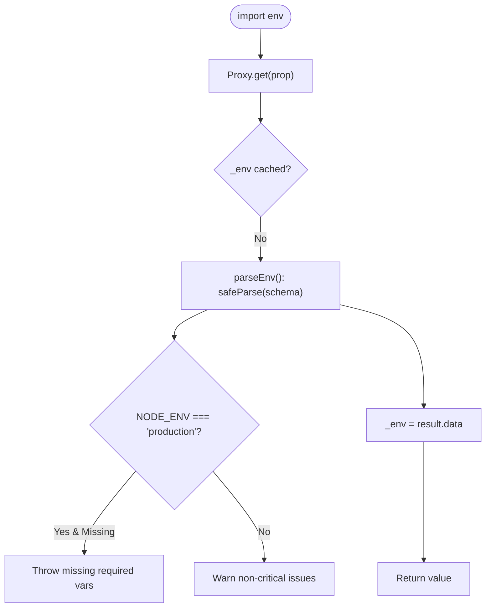
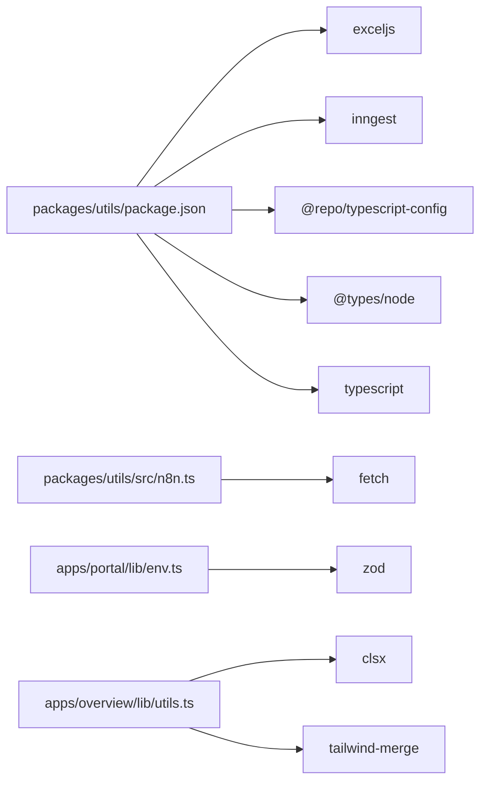

# Utility Functions & Helpers

<cite>
**Referenced Files in This Document**
- [packages/utils/package.json](file://packages/utils/package.json)
- [packages/utils/src/index.ts](file://packages/utils/src/index.ts)
- [packages/utils/src/client.ts](file://packages/utils/src/client.ts)
- [packages/utils/src/excel.ts](file://packages/utils/src/excel.ts)
- [packages/utils/src/inngest.ts](file://packages/utils/src/inngest.ts)
- [packages/utils/src/n8n.ts](file://packages/utils/src/n8n.ts)
- [apps/portal/lib/env.ts](file://apps/portal/lib/env.ts)
- [apps/portal/lib/tools.ts](file://apps/portal/lib/tools.ts)
- [apps/overview/lib/utils.ts](file://apps/overview/lib/utils.ts)
</cite>

## Table of Contents

1. [Introduction](#introduction)
2. [Project Structure](#project-structure)
3. [Core Components](#core-components)
4. [Architecture Overview](#architecture-overview)
5. [Detailed Component Analysis](#detailed-component-analysis)
6. [Dependency Analysis](#dependency-analysis)
7. [Performance Considerations](#performance-considerations)
8. [Troubleshooting Guide](#troubleshooting-guide)
9. [Conclusion](#conclusion)
10. [Appendices](#appendices)

## Introduction

This document provides comprehensive documentation for the shared utility functions and helper libraries across the repository. It focuses on:

- Environment variable management with runtime validation
- Tool integrations (n8n, Inngest)
- Common business logic utilities (date/time formatting, shift calculations)
- Excel export/import helpers
- Client-side class name utilities
- Testing strategies, performance considerations, dependency management, TypeScript integration, documentation generation, and contribution guidelines

The goal is to make these utilities easy to understand, use, extend, and maintain while ensuring backward compatibility and robust error handling.

## Project Structure

Utilities are organized into a dedicated package and app-scoped libs:

- packages/utils: Shared library exports for date/time, shifts, Excel, n8n, and Inngest
- apps/portal/lib: Runtime environment validation and tool configuration
- apps/overview/lib: Lightweight client-side utility for CSS class merging

**Diagram sources**

- [packages/utils/src/index.ts:1-64](file://packages/utils/src/index.ts#L1-L64)
- [packages/utils/src/excel.ts:1-238](file://packages/utils/src/excel.ts#L1-L238)
- [packages/utils/src/n8n.ts:1-181](file://packages/utils/src/n8n.ts#L1-L181)
- [packages/utils/src/inngest.ts:1-14](file://packages/utils/src/inngest.ts#L1-L14)
- [packages/utils/package.json:1-25](file://packages/utils/package.json#L1-L25)
- [apps/portal/lib/env.ts:1-226](file://apps/portal/lib/env.ts#L1-L226)
- [apps/portal/lib/tools.ts:1-101](file://apps/portal/lib/tools.ts#L1-L101)
- [apps/overview/lib/utils.ts:1-7](file://apps/overview/lib/utils.ts#L1-L7)

**Section sources**

- [packages/utils/package.json:1-25](file://packages/utils/package.json#L1-L25)
- [packages/utils/src/index.ts:1-64](file://packages/utils/src/index.ts#L1-L64)
- [apps/portal/lib/env.ts:1-226](file://apps/portal/lib/env.ts#L1-L226)
- [apps/portal/lib/tools.ts:1-101](file://apps/portal/lib/tools.ts#L1-L101)
- [apps/overview/lib/utils.ts:1-7](file://apps/overview/lib/utils.ts#L1-L7)

## Core Components

- Date/time and shift utilities: Human-readable date formatting, current shift determination, three-shift calculation with timezone support, and operational day computation.
- Excel export/import: Single/multi-sheet exports, styled exports with currency/date formats, and parsing uploaded files to JSON.
- n8n integration: Triggering webhooks, listing/importing/executing workflows, and retrieving execution details with optional Basic Auth.
- Inngest client: Typed event names and an Inngest client instance configured via environment variables.
- Environment validation: Zod-based schema with safe defaults, production fail-fast behavior, and test-friendly reset utilities.
- External tools configuration: Centralized external tool URLs with env overrides and fallbacks.
- Client-side class merging: A small utility combining clsx and tailwind-merge for deterministic CSS class resolution.

**Section sources**

- [packages/utils/src/index.ts:1-64](file://packages/utils/src/index.ts#L1-L64)
- [packages/utils/src/excel.ts:1-238](file://packages/utils/src/excel.ts#L1-L238)
- [packages/utils/src/n8n.ts:1-181](file://packages/utils/src/n8n.ts#L1-L181)
- [packages/utils/src/inngest.ts:1-14](file://packages/utils/src/inngest.ts#L1-L14)
- [apps/portal/lib/env.ts:1-226](file://apps/portal/lib/env.ts#L1-L226)
- [apps/portal/lib/tools.ts:1-101](file://apps/portal/lib/tools.ts#L1-L101)
- [apps/overview/lib/utils.ts:1-7](file://apps/overview/lib/utils.ts#L1-L7)

## Architecture Overview

High-level interactions between utilities and services:

**Diagram sources**

- [packages/utils/src/n8n.ts:1-181](file://packages/utils/src/n8n.ts#L1-L181)
- [apps/portal/lib/env.ts:1-226](file://apps/portal/lib/env.ts#L1-L226)
- [apps/portal/lib/tools.ts:1-101](file://apps/portal/lib/tools.ts#L1-L101)
- [packages/utils/src/inngest.ts:1-14](file://packages/utils/src/inngest.ts#L1-L14)

## Detailed Component Analysis

### Date/Time and Shift Utilities

Responsibilities:

- Format dates for display using locale-aware formatting
- Determine current shift based on hour ranges
- Compute three operational shifts with timezone awareness
- Provide server-only operational date computation

Usage examples:

- Formatting a date string for local display
- Getting the current two-shift indicator (day/night)
- Computing the active three-shift window with a specific timezone
- Getting today’s date in the operational timezone on the server

**Diagram sources**

- [packages/utils/src/index.ts:30-53](file://packages/utils/src/index.ts#L30-L53)

**Section sources**

- [packages/utils/src/index.ts:1-64](file://packages/utils/src/index.ts#L1-L64)

### Excel Export and Import Utilities

Responsibilities:

- Export single or multiple sheets from JSON arrays
- Apply column widths, borders, headers, filters, and type-aware formatting (currency, date)
- Parse uploaded Excel files into JSON structures

Usage examples:

- Exporting a simple dataset to a single sheet
- Creating multi-sheet workbooks with typed columns
- Styling exports with custom header colors and number formats
- Reading an uploaded .xlsx file into JSON

**Diagram sources**

- [packages/utils/src/excel.ts:115-195](file://packages/utils/src/excel.ts#L115-L195)

**Section sources**

- [packages/utils/src/excel.ts:1-238](file://packages/utils/src/excel.ts#L1-L238)

### n8n Integration Utilities

Responsibilities:

- Read credentials from environment variables with secure defaults and warnings
- Perform authenticated requests to n8n REST endpoints
- Provide convenience methods for workflow lifecycle operations

Usage examples:

- Triggering a webhook with payload data
- Listing available workflows with optional search
- Importing a workflow definition and optionally activating it
- Executing a workflow by ID and retrieving execution details

**Diagram sources**

- [packages/utils/src/n8n.ts:1-181](file://packages/utils/src/n8n.ts#L1-L181)

**Section sources**

- [packages/utils/src/n8n.ts:1-181](file://packages/utils/src/n8n.ts#L1-L181)

### Inngest Client Configuration

Responsibilities:

- Initialize an Inngest client with application identity and event key
- Export typed event names for consistent usage across the codebase

Usage examples:

- Importing the Inngest instance and event constants
- Using event names when invoking background jobs

**Diagram sources**

- [packages/utils/src/inngest.ts:1-14](file://packages/utils/src/inngest.ts#L1-L14)

**Section sources**

- [packages/utils/src/inngest.ts:1-14](file://packages/utils/src/inngest.ts#L1-L14)

### Environment Variable Management

Responsibilities:

- Define a Zod schema for all required and optional environment variables
- Provide safe defaults for development and fail-fast behavior in production
- Expose a proxy-based singleton for lazy, cached access
- Offer debugging and reset utilities for tests

Usage examples:

- Accessing validated environment values through a typed object
- Retrieving parse errors for diagnostics
- Resetting the cache between tests

**Diagram sources**

- [apps/portal/lib/env.ts:119-209](file://apps/portal/lib/env.ts#L119-L209)

**Section sources**

- [apps/portal/lib/env.ts:1-226](file://apps/portal/lib/env.ts#L1-L226)

### External Tools Configuration

Responsibilities:

- Provide centralized external tool configurations
- Allow URL overrides via environment variables
- Supply sensible defaults for local development

Usage examples:

- Rendering links to n8n and Flowise dashboards
- Overriding URLs per environment without changing source

**Section sources**

- [apps/portal/lib/tools.ts:1-101](file://apps/portal/lib/tools.ts#L1-L101)

### Client-Side Class Name Utility

Responsibilities:

- Merge and deduplicate Tailwind classes deterministically
- Combine clsx and tailwind-merge for predictable output

Usage examples:

- Composing conditional classes in components

**Section sources**

- [apps/overview/lib/utils.ts:1-7](file://apps/overview/lib/utils.ts#L1-L7)

## Dependency Analysis

Internal and external dependencies:

- packages/utils depends on exceljs and inngest at runtime; TypeScript config and types are dev-time only
- n8n integration uses fetch and Base64 encoding for optional Basic Auth
- env validation uses zod for schema-driven parsing and transformation
- overview utils depend on clsx and tailwind-merge

**Diagram sources**

- [packages/utils/package.json:1-25](file://packages/utils/package.json#L1-L25)
- [packages/utils/src/n8n.ts:1-181](file://packages/utils/src/n8n.ts#L1-L181)
- [apps/portal/lib/env.ts:1-226](file://apps/portal/lib/env.ts#L1-L226)
- [apps/overview/lib/utils.ts:1-7](file://apps/overview/lib/utils.ts#L1-L7)

**Section sources**

- [packages/utils/package.json:1-25](file://packages/utils/package.json#L1-L25)

## Performance Considerations

- Lazy loading of heavy libraries:
  - ExcelJS is dynamically imported within export functions to avoid bundling overhead when not used.
- Timezone formatting:
  - Use Intl.DateTimeFormat once per call; consider memoization if called frequently in tight loops.
- Network calls:
  - n8n functions wrap fetch with minimal overhead; ensure retries/backoff at the caller level for resilience.
- Environment parsing:
  - The env module caches parsed results behind a Proxy; avoid repeated re-parsing by accessing via the exported singleton.

[No sources needed since this section provides general guidance]

## Troubleshooting Guide

Common issues and resolutions:

- Missing environment variables in production:
  - The env module throws with a clear list of missing keys; verify deployment configuration.
- n8n authentication failures:
  - Ensure N8N_USER and N8N_PASSWORD are set; in non-production, insecure defaults will warn but may be rejected by the server.
- Excel export/download not triggering:
  - Confirm browser allows downloads and that the workbook contains at least one worksheet.
- Inngest initialization errors:
  - Verify INNGEST_EVENT_KEY is present where required by your runtime.

**Section sources**

- [apps/portal/lib/env.ts:159-189](file://apps/portal/lib/env.ts#L159-L189)
- [packages/utils/src/n8n.ts:8-22](file://packages/utils/src/n8n.ts#L8-L22)
- [packages/utils/src/excel.ts:198-238](file://packages/utils/src/excel.ts#L198-L238)
- [packages/utils/src/inngest.ts:1-14](file://packages/utils/src/inngest.ts#L1-L14)

## Conclusion

The shared utilities provide a cohesive set of building blocks for environment validation, external tool integrations, date/time and shift logic, and Excel processing. They emphasize safety (runtime validation, secure defaults), clarity (typed interfaces and exports), and extensibility (modular design). Following the testing and performance recommendations will help maintain reliability and efficiency as the system grows.

[No sources needed since this section summarizes without analyzing specific files]

## Appendices

### Usage Examples and Patterns

- Date/time and shifts:
  - Format a date string for display
  - Determine current two-shift status
  - Compute three-shift windows with timezone
  - Get operational date on the server
- Excel:
  - Export single/multi-sheet workbooks
  - Apply styling and type-aware formatting
  - Parse uploaded Excel files to JSON
- n8n:
  - Trigger webhooks and manage workflows via REST
- Inngest:
  - Initialize client and reference typed events
- Environment:
  - Access validated env values safely
  - Debug parse errors and reset cache in tests
- External tools:
  - Configure and override external service URLs
- Client utilities:
  - Merge Tailwind classes deterministically

[No sources needed since this section provides general guidance]

### Creating Custom Utilities

Guidelines:

- Keep modules focused and pure where possible
- Prefer explicit parameters and return types
- Avoid global state; if necessary, cache with lazy initialization
- Document assumptions (timezones, locales, environments)
- Provide graceful fallbacks and clear error messages

[No sources needed since this section provides general guidance]

### Maintaining Backward Compatibility

- Introduce deprecation notices before removing APIs
- Preserve existing function signatures and behaviors
- Add migration notes in changelogs
- Use feature flags for risky changes

[No sources needed since this section provides general guidance]

### Testing Strategies

- Unit tests:
  - Validate edge cases for date/time and shift logic
  - Mock network calls for n8n and Inngest
  - Snapshot or assert structured outputs for Excel exports
- Environment tests:
  - Use resetEnv to isolate tests
  - Assert parse errors for invalid configs
- Client utilities:
  - Assert deterministic class merging outcomes

[No sources needed since this section provides general guidance]

### Performance Considerations

- Prefer lazy imports for large dependencies
- Minimize repeated Intl formatting in hot paths
- Cache expensive computations when safe
- Profile network-bound operations and add retries/backoff at callers

[No sources needed since this section provides general guidance]

### Dependency Management

- Pin major versions for critical dependencies
- Audit unused dependencies regularly
- Separate runtime vs dev dependencies clearly
- Keep workspace packages aligned with shared TypeScript configs

**Section sources**

- [packages/utils/package.json:1-25](file://packages/utils/package.json#L1-L25)

### TypeScript Integration

- Use strict mode and explicit types for public APIs
- Leverage Zod schemas for runtime validation alongside static types
- Re-export stable entry points via package exports map

**Section sources**

- [packages/utils/package.json:13-17](file://packages/utils/package.json#L13-L17)
- [apps/portal/lib/env.ts:1-226](file://apps/portal/lib/env.ts#L1-L226)

### Documentation Generation

- Maintain JSDoc comments for public functions
- Generate API docs from source annotations
- Keep READMEs updated with usage examples and migration notes

[No sources needed since this section provides general guidance]

### Contribution Guidelines

- Follow existing patterns for naming, structure, and error handling
- Include tests for new utilities
- Update relevant configuration and exports when adding features
- Ensure environment variables are documented and validated

[No sources needed since this section provides general guidance]
