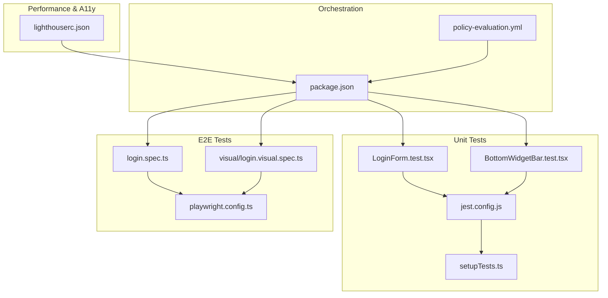
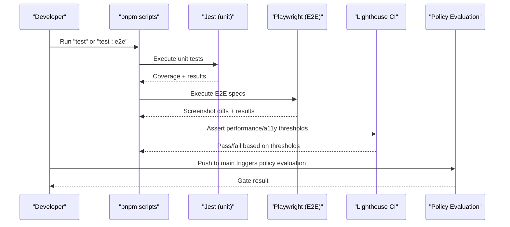
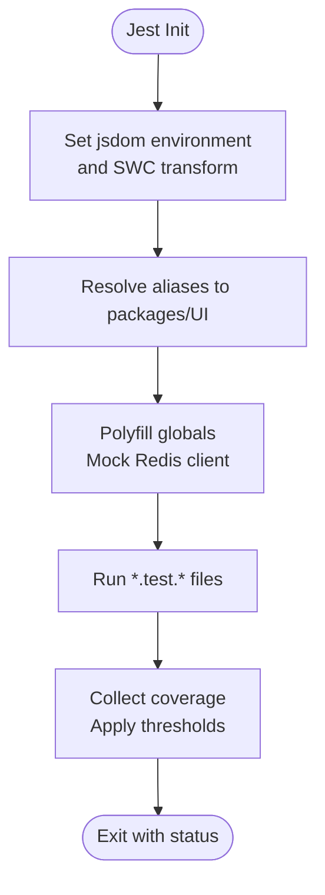
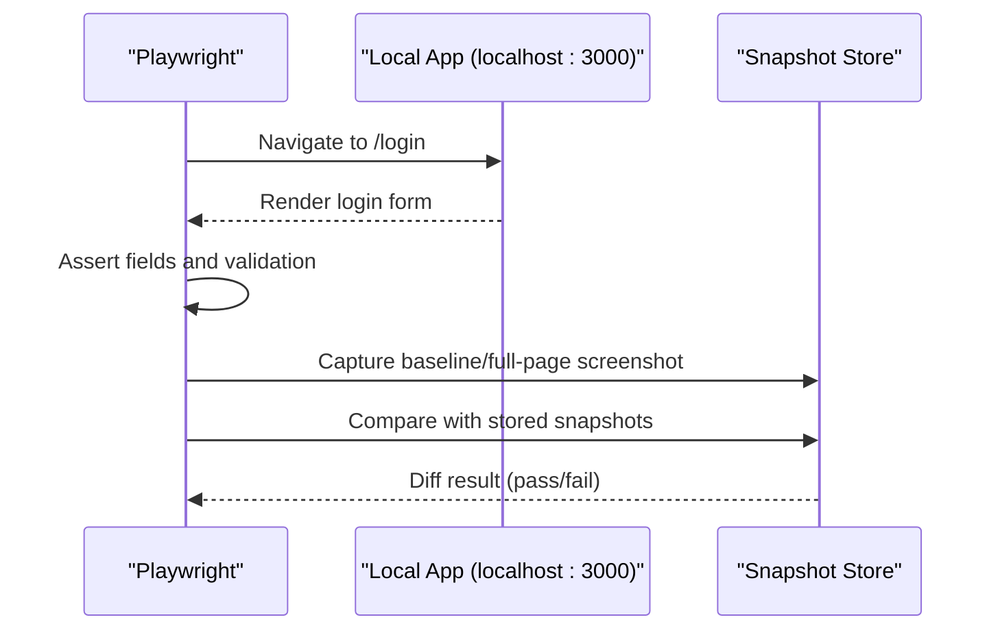
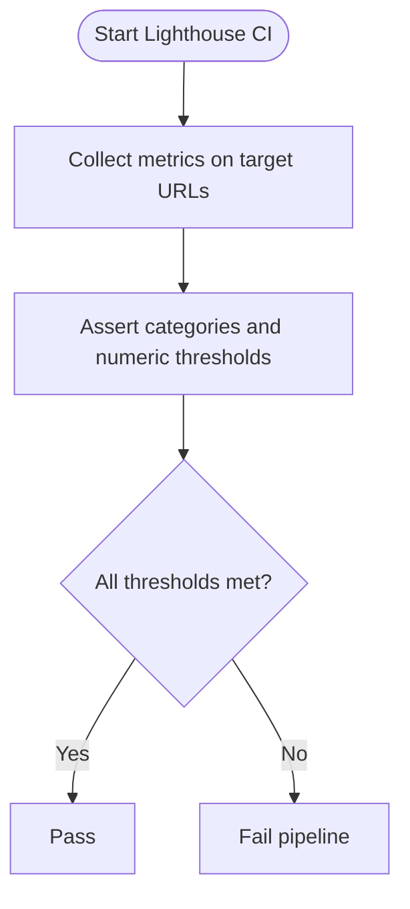
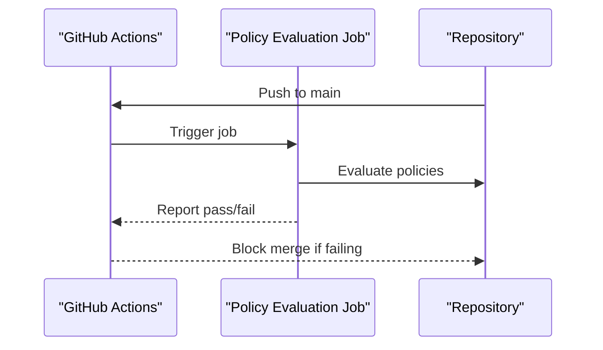
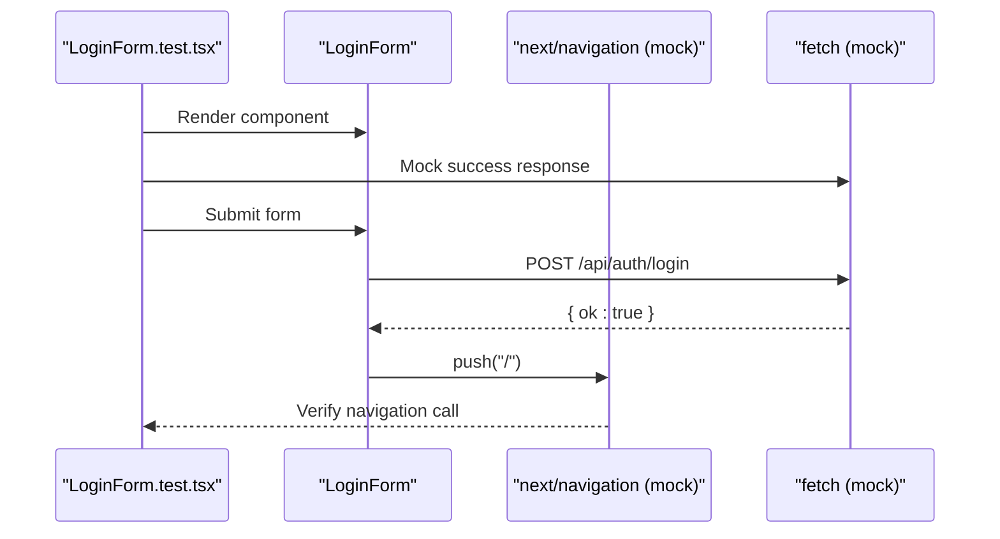
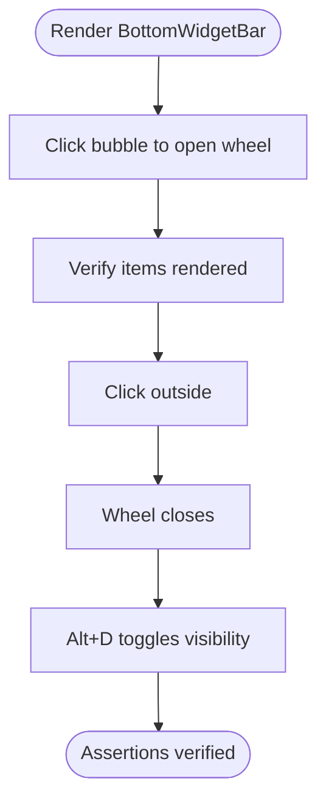
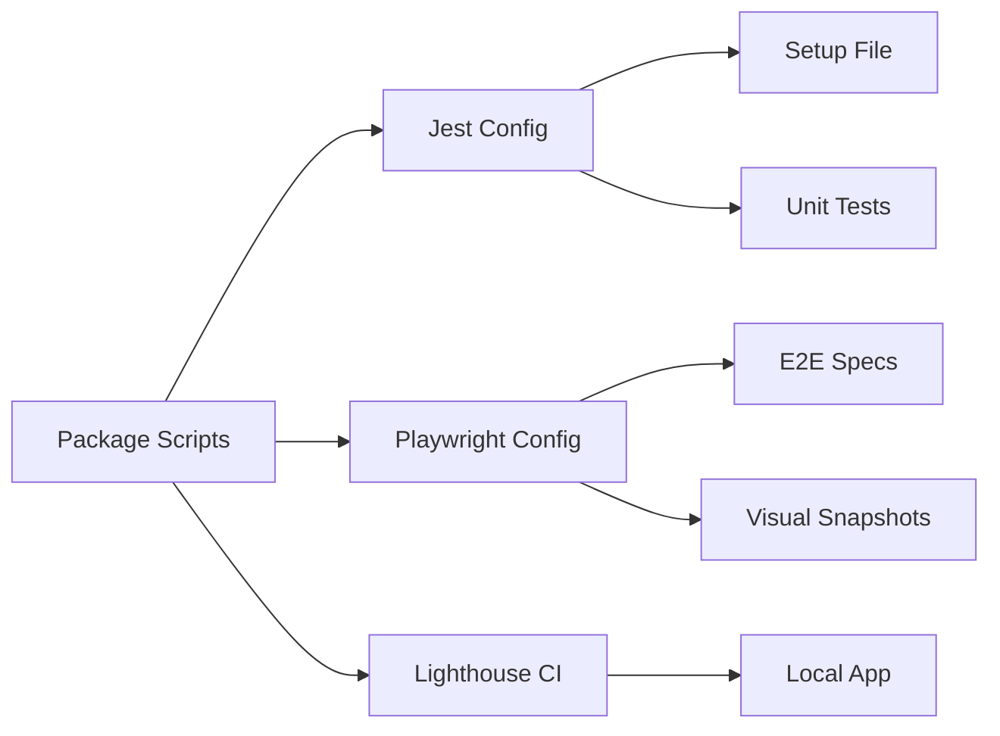

# Testing & Quality Assurance

<cite>
**Referenced Files in This Document**
- [playwright.config.ts](file://playwright.config.ts)
- [apps/portal/jest.config.js](file://apps/portal/jest.config.js)
- [apps/portal/setupTests.ts](file://apps/portal/setupTests.ts)
- [lighthouserc.json](file://lighthouserc.json)
- [e2e/login.spec.ts](file://e2e/login.spec.ts)
- [e2e/visual/login.visual.spec.ts](file://e2e/visual/login.visual.spec.ts)
- [apps/portal/app/(auth)/login/LoginForm.test.tsx](file://apps/portal/app/(auth)/login/LoginForm.test.tsx)
- [apps/portal/components/BottomWidgetBar.test.tsx](file://apps/portal/components/BottomWidgetBar.test.tsx)
- [package.json](file://package.json)
- [ci/workflows/policy-evaluation.yml](file://ci/workflows/policy-evaluation.yml)
</cite>

## Table of Contents

1. Introduction
2. Project Structure
3. Core Components
4. Architecture Overview
5. Detailed Component Analysis
6. Dependency Analysis
7. Performance Considerations
8. Troubleshooting Guide
9. Conclusion

## Introduction

This document explains the multi-layered testing strategy for the Arch-Mk2 platform, covering unit testing with Jest, integration patterns, end-to-end (E2E) testing with Playwright, visual regression, accessibility and performance checks, and CI quality gates. It also provides guidance on test organization, mocking strategies, data management, debugging techniques, and maintenance best practices.

## Project Structure

The testing setup spans multiple layers:

- Unit tests co-located with source files under apps/portal using Jest and React Testing Library.
- E2E tests under e2e using Playwright, including functional and visual regression suites.
- Performance and accessibility thresholds configured via Lighthouse CI.
- Root-level scripts orchestrate running tests across the monorepo.

**Diagram sources**

- [apps/portal/jest.config.js:1-86](file://apps/portal/jest.config.js#L1-L86)
- [apps/portal/setupTests.ts:1-123](file://apps/portal/setupTests.ts#L1-L123)
- [apps/portal/app/(auth)/login/LoginForm.test.tsx](<file://apps/portal/app/(auth)/login/LoginForm.test.tsx#L1-L334>)
- [apps/portal/components/BottomWidgetBar.test.tsx:1-148](file://apps/portal/components/BottomWidgetBar.test.tsx#L1-L148)
- [playwright.config.ts:1-25](file://playwright.config.ts#L1-L25)
- [e2e/login.spec.ts:1-220](file://e2e/login.spec.ts#L1-L220)
- [e2e/visual/login.visual.spec.ts:1-77](file://e2e/visual/login.visual.spec.ts#L1-L77)
- [lighthouserc.json:1-37](file://lighthouserc.json#L1-L37)
- [package.json:1-96](file://package.json#L1-L96)
- [ci/workflows/policy-evaluation.yml:1-17](file://ci/workflows/policy-evaluation.yml#L1-L17)

**Section sources**

- [apps/portal/jest.config.js:1-86](file://apps/portal/jest.config.js#L1-L86)
- [apps/portal/setupTests.ts:1-123](file://apps/portal/setupTests.ts#L1-L123)
- [playwright.config.ts:1-25](file://playwright.config.ts#L1-L25)
- [e2e/login.spec.ts:1-220](file://e2e/login.spec.ts#L1-L220)
- [e2e/visual/login.visual.spec.ts:1-77](file://e2e/visual/login.visual.spec.ts#L1-L77)
- [lighthouserc.json:1-37](file://lighthouserc.json#L1-L37)
- [package.json:1-96](file://package.json#L1-L96)
- [ci/workflows/policy-evaluation.yml:1-17](file://ci/workflows/policy-evaluation.yml#L1-L17)

## Core Components

- Jest configuration defines environment, transform, module mapping, coverage collection, reporters, and thresholds.
- Jest setup file provides Web API shims, mocks Redis client globally, and polyfills browser APIs for jsdom.
- Playwright configuration sets test directory, snapshot directory, project browsers, base URL, screenshot behavior, user agent, and screenshot diff tolerance.
- Lighthouse CI config asserts performance, accessibility, best practices, SEO, and specific metrics thresholds.
- E2E specs cover login form rendering, validation, auth middleware redirects, design system styling, and full flows.
- Visual regression specs capture snapshots with masked dynamic regions and compare against baselines.
- Unit tests validate component behavior, network interactions, navigation, keyboard shortcuts, and UI state transitions.
- Root package scripts provide unified commands to run tests and E2E suites.

**Section sources**

- [apps/portal/jest.config.js:1-86](file://apps/portal/jest.config.js#L1-L86)
- [apps/portal/setupTests.ts:1-123](file://apps/portal/setupTests.ts#L1-L123)
- [playwright.config.ts:1-25](file://playwright.config.ts#L1-L25)
- [lighthouserc.json:1-37](file://lighthouserc.json#L1-L37)
- [e2e/login.spec.ts:1-220](file://e2e/login.spec.ts#L1-L220)
- [e2e/visual/login.visual.spec.ts:1-77](file://e2e/visual/login.visual.spec.ts#L1-L77)
- [apps/portal/app/(auth)/login/LoginForm.test.tsx](<file://apps/portal/app/(auth)/login/LoginForm.test.tsx#L1-L334>)
- [apps/portal/components/BottomWidgetBar.test.tsx:1-148](file://apps/portal/components/BottomWidgetBar.test.tsx#L1-L148)
- [package.json:1-96](file://package.json#L1-L96)

## Architecture Overview

The testing architecture is layered:

- Unit layer validates components and hooks in isolation using Jest and React Testing Library.
- Integration layer exercises routes and server actions by mocking external dependencies.
- E2E layer drives real browser sessions through Playwright to assert critical user journeys.
- Visual regression ensures UI stability over time with snapshot comparisons.
- Performance and accessibility are enforced via Lighthouse CI assertions.
- CI policy evaluation runs as a gate on main branch pushes.

**Diagram sources**

- [package.json:1-96](file://package.json#L1-L96)
- [apps/portal/jest.config.js:1-86](file://apps/portal/jest.config.js#L1-L86)
- [playwright.config.ts:1-25](file://playwright.config.ts#L1-L25)
- [lighthouserc.json:1-37](file://lighthouserc.json#L1-L37)
- [ci/workflows/policy-evaluation.yml:1-17](file://ci/workflows/policy-evaluation.yml#L1-L17)

## Detailed Component Analysis

### Unit Testing with Jest

- Environment and Transform: jsdom environment with SWC transform for TypeScript/TSX and automatic React runtime.
- Module Mapping: Aliases map workspace packages and UI components to their implementations for deterministic resolution.
- Coverage: Collects from lib, features, app, components, hooks; excludes test files and declarations; reports text, lcov, html; enforces global thresholds.
- Setup: Provides TextEncoder/Decoder, Request/Response shims, mocks Redis client globally, and polyfills matchMedia and IntersectionObserver for jsdom.

**Diagram sources**

- [apps/portal/jest.config.js:1-86](file://apps/portal/jest.config.js#L1-L86)
- [apps/portal/setupTests.ts:1-123](file://apps/portal/setupTests.ts#L1-L123)

**Section sources**

- [apps/portal/jest.config.js:1-86](file://apps/portal/jest.config.js#L1-L86)
- [apps/portal/setupTests.ts:1-123](file://apps/portal/setupTests.ts#L1-L123)

### Mocking Strategies

- Global Redis mock: Replaces @repo/redis and internal redis client with an in-memory Map-backed implementation to avoid external connections.
- Browser API mocks: Polyfills matchMedia and IntersectionObserver for jsdom compatibility.
- Next.js mocks: Navigation and Link are mocked in component tests to control routing behavior without a router instance.
- UI component stubs: Minimal renderers for complex UI primitives to isolate logic.

Best practices:

- Keep mocks close to tested units when possible; use global mocks only for shared infrastructure like Redis.
- Reset mocks between tests to prevent cross-test pollution.
- Validate that mocks expose the same interface as real implementations.

**Section sources**

- [apps/portal/setupTests.ts:1-123](file://apps/portal/setupTests.ts#L1-L123)
- [apps/portal/app/(auth)/login/LoginForm.test.tsx](<file://apps/portal/app/(auth)/login/LoginForm.test.tsx#L1-L334>)
- [apps/portal/components/BottomWidgetBar.test.tsx:1-148](file://apps/portal/components/BottomWidgetBar.test.tsx#L1-L148)

### Test Data Management

- Use minimal, deterministic fixtures within tests rather than relying on seeded databases.
- Prefer explicit inputs and controlled responses (mocked fetch) to ensure repeatability.
- For E2E, rely on stable selectors and attributes (data-testid) to reduce flakiness.

[No sources needed since this section provides general guidance]

### End-to-End Testing with Playwright

- Configuration: Single Chromium project targeting a local dev server; screenshots captured only on failure; strict baseline diff tolerance.
- Functional Specs: Login page rendering, HTML5 validation, redirect parameter handling, auth middleware redirections, and full sign-in/reset password flow.
- Visual Regression: Full-page and card-level snapshots with masks for dynamic elements; threshold-based comparison.

**Diagram sources**

- [playwright.config.ts:1-25](file://playwright.config.ts#L1-L25)
- [e2e/login.spec.ts:1-220](file://e2e/login.spec.ts#L1-L220)
- [e2e/visual/login.visual.spec.ts:1-77](file://e2e/visual/login.visual.spec.ts#L1-L77)

**Section sources**

- [playwright.config.ts:1-25](file://playwright.config.ts#L1-L25)
- [e2e/login.spec.ts:1-220](file://e2e/login.spec.ts#L1-L220)
- [e2e/visual/login.visual.spec.ts:1-77](file://e2e/visual/login.visual.spec.ts#L1-L77)

### Accessibility and Performance Testing

- Lighthouse CI targets key pages and asserts minimum scores for performance, accessibility, best practices, and SEO.
- Numeric thresholds enforce constraints on core web vitals and bundle hygiene.

**Diagram sources**

- [lighthouserc.json:1-37](file://lighthouserc.json#L1-L37)

**Section sources**

- [lighthouserc.json:1-37](file://lighthouserc.json#L1-L37)

### Continuous Integration and Quality Gates

- Policy evaluation workflow runs on push to main, acting as a gate for repository policies.
- Root scripts unify test execution across the monorepo and provide dedicated E2E command.

**Diagram sources**

- [ci/workflows/policy-evaluation.yml:1-17](file://ci/workflows/policy-evaluation.yml#L1-L17)
- [package.json:1-96](file://package.json#L1-L96)

**Section sources**

- [ci/workflows/policy-evaluation.yml:1-17](file://ci/workflows/policy-evaluation.yml#L1-L17)
- [package.json:1-96](file://package.json#L1-L96)

### Component-Level Analysis

#### LoginForm Unit Test Flow

**Diagram sources**

- [apps/portal/app/(auth)/login/LoginForm.test.tsx](<file://apps/portal/app/(auth)/login/LoginForm.test.tsx#L1-L334>)

**Section sources**

- [apps/portal/app/(auth)/login/LoginForm.test.tsx](<file://apps/portal/app/(auth)/login/LoginForm.test.tsx#L1-L334>)

#### BottomWidgetBar Interaction Tests

**Diagram sources**

- [apps/portal/components/BottomWidgetBar.test.tsx:1-148](file://apps/portal/components/BottomWidgetBar.test.tsx#L1-L148)

**Section sources**

- [apps/portal/components/BottomWidgetBar.test.tsx:1-148](file://apps/portal/components/BottomWidgetBar.test.tsx#L1-L148)

## Dependency Analysis

Testing dependencies and relationships:

- Jest depends on jsdom, SWC transform, and React Testing Library utilities.
- Playwright depends on a Chromium executable path and uses snapshot directories for visual regression.
- Lighthouse CI depends on a running application at localhost:3000 and asserts thresholds.
- Package scripts coordinate execution order and provide consistent entry points.

**Diagram sources**

- [apps/portal/jest.config.js:1-86](file://apps/portal/jest.config.js#L1-L86)
- [apps/portal/setupTests.ts:1-123](file://apps/portal/setupTests.ts#L1-L123)
- [playwright.config.ts:1-25](file://playwright.config.ts#L1-L25)
- [lighthouserc.json:1-37](file://lighthouserc.json#L1-L37)
- [package.json:1-96](file://package.json#L1-L96)

**Section sources**

- [apps/portal/jest.config.js:1-86](file://apps/portal/jest.config.js#L1-L86)
- [apps/portal/setupTests.ts:1-123](file://apps/portal/setupTests.ts#L1-L123)
- [playwright.config.ts:1-25](file://playwright.config.ts#L1-L25)
- [lighthouserc.json:1-37](file://lighthouserc.json#L1-L37)
- [package.json:1-96](file://package.json#L1-L96)

## Performance Considerations

- Use targeted unit tests to keep Jest suites fast; avoid heavy I/O and external calls.
- Isolate E2E tests to critical paths; leverage Playwright’s screenshot-on-failure to minimize overhead.
- Tune Lighthouse thresholds to balance quality and stability; prefer simulate throttling for consistency.
- Cache snapshots judiciously and mask dynamic regions to reduce false positives.

[No sources needed since this section provides general guidance]

## Troubleshooting Guide

Common issues and resolutions:

- Missing browser executable: Ensure Playwright’s Chromium path matches the environment; adjust executablePath accordingly.
- Snapshot drift: Update baselines after intentional UI changes; review diffs carefully before committing.
- Flaky E2E tests: Add explicit waits, stabilize selectors with data-testid, and avoid timing-dependent assertions.
- Jest environment errors: Confirm jsdom polyfills and module mappings; reset mocks between tests.
- Coverage failures: Expand test scope to meet thresholds; exclude non-testable files where appropriate.

**Section sources**

- [playwright.config.ts:1-25](file://playwright.config.ts#L1-L25)
- [apps/portal/jest.config.js:1-86](file://apps/portal/jest.config.js#L1-L86)
- [apps/portal/setupTests.ts:1-123](file://apps/portal/setupTests.ts#L1-L123)

## Conclusion

Arch-Mk2 employs a comprehensive testing strategy spanning unit, integration, E2E, visual regression, accessibility, and performance. The configuration and scripts provide clear entry points and quality gates. By following the recommended practices—stable selectors, robust mocks, targeted coverage, and disciplined snapshot management—the team can maintain high confidence in releases while keeping feedback loops fast and reliable.
